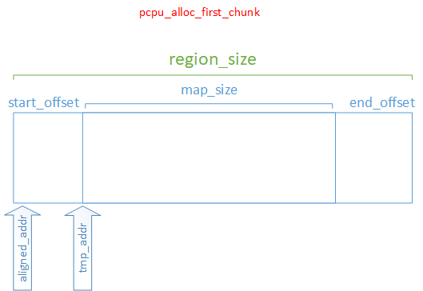

# PerCPU Variables

PerCPU is a moderate sized topic in Linux kernel. Generally, developer only cares how to use it in their daily working.

现代 PerCPU 针对 NUMA 而设计，所以初始化过程看起来特别复杂。因为在 NUMA 下实现 PerCPU 时，PerCPU 变量确实要存在不同 NUMA node 上的 Memory, 这正是复杂的地方。


start_kernel --> setup_per_cpu_areas. setup_per_cpu_areas 有几处定义，其中 mm/percpu.c 中有 2 处，分别针对: architecture 不提供该函数实现，以及 UP 的情况，对于 x86 而言，其实现在 arch/x86/kernel/setup_percpu.c 中。但阅读该函数之前，需读几遍 mm/percpu.c 的 head comments, 虽然此刻大部分是看不懂的，至少可 get 几个术语的定义。

```c
void __init setup_per_cpu_areas(void)
{
	unsigned int cpu;
	unsigned long delta;
	int rc;

	pr_info("NR_CPUS:%d nr_cpumask_bits:%d nr_cpu_ids:%u nr_node_ids:%u\n",
		NR_CPUS, nr_cpumask_bits, nr_cpu_ids, nr_node_ids);

	/*
	 * Allocate percpu area.  Embedding allocator is our favorite;
	 * however, on NUMA configurations, it can result in very
	 * sparse unit mapping and vmalloc area isn't spacious enough
	 * on 32bit.  Use page in that case.
	 */
#ifdef CONFIG_X86_32
	if (pcpu_chosen_fc == PCPU_FC_AUTO && pcpu_need_numa())
		pcpu_chosen_fc = PCPU_FC_PAGE;
#endif

	rc = -EINVAL;
	if (pcpu_chosen_fc != PCPU_FC_PAGE) {
		const size_t dyn_size = PERCPU_MODULE_RESERVE +
			PERCPU_DYNAMIC_RESERVE - PERCPU_FIRST_CHUNK_RESERVE;
		size_t atom_size;

		/*
		 * On 64bit, use PMD_SIZE for atom_size so that embedded
		 * percpu areas are aligned to PMD.  This, in the future,
		 * can also allow using PMD mappings in vmalloc area.  Use
		 * PAGE_SIZE on 32bit as vmalloc space is highly contended
		 * and large vmalloc area allocs can easily fail.
		 */
#ifdef CONFIG_X86_64
		atom_size = PMD_SIZE;
#else
		atom_size = PAGE_SIZE;
#endif

		/* Tips:
		 * 1. pcpu_cpu_distance: 通过 "logical CPU ID <--> logical Node ID"
		 *    mapping 判断 2 个 CPU 是否属于同一 Node. Mapping 在 NUMA 初始化阶段建立。
		 * 2. pcpu_fc_alloc: for NUMA, 最终调用的是 memblock_alloc_try_nid -->
		 *    phys_to_virt, 返回 virtual address, 且是来自 direct mapping 的虚拟
		 *    地址. Refer Documentation/x86/x86_64/mm.rst for *direct mapping*
		 *
		 * 为什么需要 atom_size? (目前粗浅理解) memblock 分配的是 physical address,
		 * 但 kernel 使用 paging 机制, 所以 specific size allocation will make
		 * paging easy in the future.
		 */
		rc = pcpu_embed_first_chunk(PERCPU_FIRST_CHUNK_RESERVE,
					    dyn_size, atom_size,
					    pcpu_cpu_distance,
					    pcpu_fc_alloc, pcpu_fc_free);
		if (rc < 0)
			pr_warn("%s allocator failed (%d), falling back to page size\n",
				pcpu_fc_names[pcpu_chosen_fc], rc);
	}
	if (rc < 0)
		rc = pcpu_page_first_chunk(PERCPU_FIRST_CHUNK_RESERVE,
					   pcpu_fc_alloc, pcpu_fc_free,
					   pcpup_populate_pte);
	if (rc < 0)
		panic("cannot initialize percpu area (err=%d)", rc);

	/* alrighty, percpu areas up and running */
	delta = (unsigned long)pcpu_base_addr - (unsigned long)__per_cpu_start;
	for_each_possible_cpu(cpu) {
		per_cpu_offset(cpu) = delta + pcpu_unit_offsets[cpu];
		per_cpu(this_cpu_off, cpu) = per_cpu_offset(cpu);
		per_cpu(cpu_number, cpu) = cpu;
		setup_percpu_segment(cpu);
		setup_stack_canary_segment(cpu);
		/*
		 * Copy data used in early init routines from the
		 * initial arrays to the per cpu data areas.  These
		 * arrays then become expendable and the *_early_ptr's
		 * are zeroed indicating that the static arrays are
		 * gone.
		 */
#ifdef CONFIG_X86_LOCAL_APIC
		per_cpu(x86_cpu_to_apicid, cpu) =
			early_per_cpu_map(x86_cpu_to_apicid, cpu);
		per_cpu(x86_bios_cpu_apicid, cpu) =
			early_per_cpu_map(x86_bios_cpu_apicid, cpu);
		per_cpu(x86_cpu_to_acpiid, cpu) =
			early_per_cpu_map(x86_cpu_to_acpiid, cpu);
#endif
#ifdef CONFIG_X86_32
		per_cpu(x86_cpu_to_logical_apicid, cpu) =
			early_per_cpu_map(x86_cpu_to_logical_apicid, cpu);
#endif
#ifdef CONFIG_NUMA
		per_cpu(x86_cpu_to_node_map, cpu) =
			early_per_cpu_map(x86_cpu_to_node_map, cpu);
		/*
		 * Ensure that the boot cpu numa_node is correct when the boot
		 * cpu is on a node that doesn't have memory installed.
		 * Also cpu_up() will call cpu_to_node() for APs when
		 * MEMORY_HOTPLUG is defined, before per_cpu(numa_node) is set
		 * up later with c_init aka intel_init/amd_init.
		 * So set them all (boot cpu and all APs).
		 */
		set_cpu_numa_node(cpu, early_cpu_to_node(cpu));
#endif
		/*
		 * Up to this point, the boot CPU has been using .init.data
		 * area.  Reload any changed state for the boot CPU.
		 */
		if (!cpu)
			switch_to_new_gdt(cpu);
	}

	/* indicate the early static arrays will soon be gone */
#ifdef CONFIG_X86_LOCAL_APIC
	early_per_cpu_ptr(x86_cpu_to_apicid) = NULL;
	early_per_cpu_ptr(x86_bios_cpu_apicid) = NULL;
	early_per_cpu_ptr(x86_cpu_to_acpiid) = NULL;
#endif
#ifdef CONFIG_X86_32
	early_per_cpu_ptr(x86_cpu_to_logical_apicid) = NULL;
#endif
#ifdef CONFIG_NUMA
	early_per_cpu_ptr(x86_cpu_to_node_map) = NULL;
#endif

	/* Setup node to cpumask map */
	setup_node_to_cpumask_map();

	/* Setup cpu initialized, callin, callout masks */
	setup_cpu_local_masks();

	/*
	 * Sync back kernel address range again.  We already did this in
	 * setup_arch(), but percpu data also needs to be available in
	 * the smpboot asm.  We can't reliably pick up percpu mappings
	 * using vmalloc_fault(), because exception dispatch needs
	 * percpu data.
	 *
	 * FIXME: Can the later sync in setup_cpu_entry_areas() replace
	 * this call?
	 */
	sync_initial_page_table();
}

int __init pcpu_embed_first_chunk(size_t reserved_size, size_t dyn_size,
				  size_t atom_size,
				  pcpu_fc_cpu_distance_fn_t cpu_distance_fn,
				  pcpu_fc_alloc_fn_t alloc_fn,
				  pcpu_fc_free_fn_t free_fn)
{
	void *base = (void *)ULONG_MAX;
	void **areas = NULL;
	struct pcpu_alloc_info *ai;
	size_t size_sum, areas_size;
	unsigned long max_distance;
	int group, i, highest_group, rc = 0;

	/* struct pcpu_alloc_info 看起来只是管理 PerCPU area 的 metadata. "area" 相关
	 * 变量才是 PerCPU 变量本身。 可以看出，不管 metadata or data, 在初始化中，大量使用
	 * pointer. 经过此函数， pcpu_alloc_info 中所有 fields 都被初始化。
	 * Tip: allocation of unit is rounded up to upa, so there may be wasted units. */
	ai = pcpu_build_alloc_info(reserved_size, dyn_size, atom_size,
				   cpu_distance_fn);
	if (IS_ERR(ai))
		return PTR_ERR(ai);

	size_sum = ai->static_size + ai->reserved_size + ai->dyn_size;
	/* 用于存储 group memory base address, 临时用，最终会 free. */
	areas_size = PFN_ALIGN(ai->nr_groups * sizeof(void *));

	/* So, 变量 areas 将保存所有 group memory 的 base address.
	 * Tip again: 返回的是 direct mapping 的 virtual address. 临时使用，函数末尾会释放。*/
	areas = memblock_alloc(areas_size, SMP_CACHE_BYTES);
	if (!areas) {
		rc = -ENOMEM;
		goto out_free;
	}

	/* allocate, copy and determine base address & max_distance */
	/* 在每个 Node memory 上，分配 PerCPU variable 的存储空间。*/
	highest_group = 0;
	for (group = 0; group < ai->nr_groups; group++) {
		struct pcpu_group_info *gi = &ai->groups[group];
		unsigned int cpu = NR_CPUS;
		void *ptr;

		/* cpu_map 分配空间时全部初始化为 NR_CPUS; 判断 pcpu_group_info->cpu_map
		 * 是否正确初始化 NR_CPUS. */
		for (i = 0; i < gi->nr_units && cpu == NR_CPUS; i++)
			cpu = gi->cpu_map[i];
		BUG_ON(cpu == NR_CPUS);

		/* allocate space for the whole group */
		/* 通过 logical CPU number 找到对应的 NUMA node ID. 在每个 NUMA node
		 * 上分配自己的 PerCPU memory. */
		ptr = alloc_fn(cpu, gi->nr_units * ai->unit_size, atom_size);
		if (!ptr) {
			rc = -ENOMEM;
			goto out_free_areas;
		}
		/* kmemleak tracks the percpu allocations separately */
		kmemleak_free(ptr);
		areas[group] = ptr;

		/* “base” is used to record the lowest base address among all groups.
		 * highest_group is the group number with highest group base address.*/
		base = min(ptr, base);
		if (ptr > areas[highest_group])
			highest_group = group;
	}
	/* lowest PerCPU memory base address -- highest PerCPU memory end address.
	 * NOTE: max_distance 包括那些 wasted unit space. */
	max_distance = areas[highest_group] - base;
	max_distance += ai->unit_size * ai->groups[highest_group].nr_units;

	/* warn if maximum distance is further than 75% of vmalloc space */
	/* NOTE: max_distance is not only in terms of virtual address, but also
	 * physical address. 可能后续分配 PerCPU memory 时是通过 vmalloc 地址空间?
	 * 若超过 3/4, 则只能 get back to pcpu_page_first_chunk.
	 */
	if (max_distance > VMALLOC_TOTAL * 3 / 4) {
		pr_warn("max_distance=0x%lx too large for vmalloc space 0x%lx\n",
				max_distance, VMALLOC_TOTAL);
#ifdef CONFIG_NEED_PER_CPU_PAGE_FIRST_CHUNK
		/* and fail if we have fallback */
		rc = -EINVAL;
		goto out_free_areas;
#endif
	}

	/*
	 * Copy data and free unused parts.  This should happen after all
	 * allocations are complete; otherwise, we may end up with
	 * overlapping groups.
	 */
	/* 将 vmlinux image 中 static PerCPU copy 到真正的 PerCPU area. And free 2
	 * types of unused parts: wasted unit; unit_size - size_sum.
	 * Tip: pcpu_group_info->cpu_map 已在 pcpu_build_alloc_info 中初始化。
	 */
	for (group = 0; group < ai->nr_groups; group++) {
		struct pcpu_group_info *gi = &ai->groups[group];
		void *ptr = areas[group];

		for (i = 0; i < gi->nr_units; i++, ptr += ai->unit_size) {
			if (gi->cpu_map[i] == NR_CPUS) {
				/* unused unit, free whole */
				free_fn(ptr, ai->unit_size);
				continue;
			}
			/* copy and return the unused part */
			/* One tiny tip: __per_cpu_load is the virtual address from vmlinux
			 * image page mapping, while ptr is virtual address from direct page
			 * mapping. */
			memcpy(ptr, __per_cpu_load, ai->static_size);
			free_fn(ptr + size_sum, ai->unit_size - size_sum);
		}
	}

	/* base address is now known, determine group base offsets */
	for (group = 0; group < ai->nr_groups; group++) {
		ai->groups[group].base_offset = areas[group] - base;
	}

	...

	/* Now, all PerCPU metadata info could be attained by these 2 parameters. */
	pcpu_setup_first_chunk(ai, base);
	goto out_free;

out_free_areas:
	for (group = 0; group < ai->nr_groups; group++)
		if (areas[group])
			free_fn(areas[group],
				ai->groups[group].nr_units * ai->unit_size);
out_free:
	pcpu_free_alloc_info(ai);
	if (areas)
		memblock_free_early(__pa(areas), areas_size);
	return rc;
}

/* The 1st difficult function. Too many variables & calculation.
 * x86_64 下， 入参 reserved_size = 8k， dyn_size = 28k, atom_size = 2M. */
static struct pcpu_alloc_info * __init pcpu_build_alloc_info(
				size_t reserved_size, size_t dyn_size,
				size_t atom_size,
				pcpu_fc_cpu_distance_fn_t cpu_distance_fn)
{
	static int group_map[NR_CPUS] __initdata;
	static int group_cnt[NR_CPUS] __initdata;

	/* In Author's example, static_size = 180k */
	const size_t static_size = __per_cpu_end - __per_cpu_start;

	int nr_groups = 1, nr_units = 0;
	size_t size_sum, min_unit_size, alloc_size;
	int upa, max_upa, uninitialized_var(best_upa);	/* units_per_alloc */
	int last_allocs, group, unit;
	unsigned int cpu, tcpu;
	struct pcpu_alloc_info *ai;
	unsigned int *cpu_map;

	/* this function may be called multiple times */
	/* NUMA 下，同一 node 上的 CPU 的 PerCPU 变量都位于该 node's Memory 上，这很像
	 * 无 NUMA 概念的 SMP? 这里的 group == NUMA node. 这两个变量用来将 CPU 分组，
	 * 统计每个 group 中 CPU 数目。(In this context,  CPU is indicated by kernel's
	 * Logical CPU number.)
	 *
	 * For example:
	 *   group_map[1] = 0 indicates logical CPU 1 belongs to group(NUMA node) 0;
	 *   group_cnt[0] = 2 indicates group(NUMA node) 0 has 2 CPUs.
	 */
	memset(group_map, 0, sizeof(group_map));
	memset(group_cnt, 0, sizeof(group_cnt));

	/* calculate size_sum and ensure dyn_size is enough for early alloc */
	/* size_sum 表示 unit 中三类区域的 size 总和，它和最终确定的 unit size 不一样.
	 * reserved_size = 8k, dyn_size = 28k, static_size = 180k, so, size_num = 216k. */
	size_sum = PFN_ALIGN(static_size + reserved_size +
			    max_t(size_t, dyn_size, PERCPU_DYNAMIC_EARLY_SIZE));
	dyn_size = size_sum - static_size - reserved_size;

	/*
	 * Determine min_unit_size, alloc_size and max_upa such that
	 * alloc_size is multiple of atom_size and is the smallest
	 * which can accommodate 4k aligned segments which are equal to
	 * or larger than min_unit_size.
	 */
	/* In author's example, min_unit_size will be 216k. */
	min_unit_size = max_t(size_t, size_sum, PCPU_MIN_UNIT_SIZE);

	/* determine the maximum # of units that can fit in an allocation */

	/* alloc_size should be multiple of atom_size. Theoretically, unit size
	 * could be greater or less than atom_size. In my reality, alloc_size =
	 * atom_size = 2M, 可容纳多个 unit size, that is how unit per-allocation (upa)
	 * comes from.
	 *
	 * upa = 2M / 216k = 9. upa 的数值有讲究，它须等分 alloc_size(无余数), 且等分的
	 * unit size should be aligned to page(4k), that is why while loop exists.
	 * In the worst case: upa = 1. 可以预见， unit size 很可能比 size_sum 大，造成
	 * 部分空间浪费。   NOTE: 只是 *max*, 未必 *best*.
	 */
	alloc_size = roundup(min_unit_size, atom_size);
	upa = alloc_size / min_unit_size;
	while (alloc_size % upa || (offset_in_page(alloc_size / upa)))
		upa--;
	max_upa = upa;

	/* group cpus according to their proximity */
	/* 略过细节分析，知道 group_map 和 group_cnt 的含义即可。 Just 1 tip: logical CPU
	 * number (0-N) mapped physical CPU ID(APIC ID) could be sparse, No warranty. */
	for_each_possible_cpu(cpu) {
		group = 0;
	next_group:
		for_each_possible_cpu(tcpu) {
			if (cpu == tcpu)
				break;
			if (group_map[tcpu] == group && cpu_distance_fn &&
			    (cpu_distance_fn(cpu, tcpu) > LOCAL_DISTANCE ||
			     cpu_distance_fn(tcpu, cpu) > LOCAL_DISTANCE)) {
				group++;
				nr_groups = max(nr_groups, group + 1);
				goto next_group;
			}
		}
		group_map[cpu] = group;
		group_cnt[group]++;
	}

	/*
	 * Wasted space is caused by a ratio imbalance of upa to group_cnt.
	 * Expand the unit_size until we use >= 75% of the units allocated.
	 * Related to atom_size, which could be much larger than the unit_size.
	 */
	/* 举例:
	 * 若 group(NUMA node) 0 has 5 CPUs, upa = 4, then group 0 need 2 x alloc_size,
	 * which results in 2 x 4 - 5 = 3 units wasted.
	 * 若 group 0 has 4 CPUs, upa = 4, then just 1 x alloc_size is needed, no
	 * wasted space.
	 *
	 * Count max_upa down to find best_upa, with fixed alloc_size, so this is
	 * actually expand the unit size. the last eligible upa is the best_upa.
	 */
	last_allocs = INT_MAX;
	for (upa = max_upa; upa; upa--) {
		int allocs = 0, wasted = 0;

		if (alloc_size % upa || (offset_in_page(alloc_size / upa)))
			continue;

		for (group = 0; group < nr_groups; group++) {
			int this_allocs = DIV_ROUND_UP(group_cnt[group], upa);
			allocs += this_allocs;
			wasted += this_allocs * upa - group_cnt[group];
		}

		/*
		 * Don't accept if wastage is over 1/3.  The
		 * greater-than comparison ensures upa==1 always
		 * passes the following check.
		 */
		if (wasted > num_possible_cpus() / 3)
			continue;

		/* and then don't consume more memory */
		if (allocs > last_allocs)
			break;
		last_allocs = allocs;
		best_upa = upa;
	}
	upa = best_upa;

	/* allocate and fill alloc_info */
	/* 统计将分配的实际 unit number, via align group CPU number up to upa.
	 * nr_units 可能大于实际 CPU 数，所以可能有 wasted unit space. */
	for (group = 0; group < nr_groups; group++)
		nr_units += roundup(group_cnt[group], upa);

	/* This is easy for C programmer, skip analysis.
	 * NOTE: It is *virtual address* from direct mapping returned. BTW, 分配空间
	 * 时并没有指定 nid, 可能因为只是短暂使用。
	 */
	ai = pcpu_alloc_alloc_info(nr_groups, nr_units);
	if (!ai)
		return ERR_PTR(-ENOMEM);
	cpu_map = ai->groups[0].cpu_map;

	/* struct pcpu_alloc_info 的构造略新奇，To be illustrated via graph. 正因
	 * 构造新奇，才有下面的 for loop.
	 * 初始化 pcpu_group_info->cpu_map, 指向属于 group 的正确的地址。*/
	for (group = 0; group < nr_groups; group++) {
		ai->groups[group].cpu_map = cpu_map;
		cpu_map += roundup(group_cnt[group], upa);
	}

	ai->static_size = static_size;
	ai->reserved_size = reserved_size;
	ai->dyn_size = dyn_size;
	ai->unit_size = alloc_size / upa;
	ai->atom_size = atom_size;
	ai->alloc_size = alloc_size;

	for (group = 0, unit = 0; group < nr_groups; group++) {
		struct pcpu_group_info *gi = &ai->groups[group];

		/*
		 * Initialize base_offset as if all groups are located
		 * back-to-back.  The caller should update this to
		 * reflect actual allocation.
		 */
		/* comments 说的明白：此处初始化假设所有 groups(即未来分配的所有 units memory)
		 * are located back-to-back, 即分配的所有 units memory 紧挨着。
		 * NUMA 中， group(a group of units) 属于不同 NUMA Node, 即 group is
		 * non-contiguous, 所以后面要 update.  base_offset means: group 的起始地址
		 * 距第一个(地址最低) group's base address 的 offset. */
		gi->base_offset = unit * ai->unit_size;

		for_each_possible_cpu(cpu)
			if (group_map[cpu] == group)
				gi->cpu_map[gi->nr_units++] = cpu;
		gi->nr_units = roundup(gi->nr_units, upa);
		unit += gi->nr_units;
	}
	BUG_ON(unit != nr_units);

	return ai;
}

/* PerCPU 的核心知识之一: chunk. 此函数有大段 comments, 此处省略 */
void __init pcpu_setup_first_chunk(const struct pcpu_alloc_info *ai,
				   void *base_addr)
{
	size_t size_sum = ai->static_size + ai->reserved_size + ai->dyn_size;
	size_t static_size, dyn_size;
	struct pcpu_chunk *chunk;
	unsigned long *group_offsets;
	size_t *group_sizes;
	unsigned long *unit_off;
	unsigned int cpu;
	int *unit_map;
	int group, unit, i;
	int map_size;
	unsigned long tmp_addr;
	size_t alloc_size;

	...
	/* 一堆 small size allocation, will be saved into global variables.
	 * NOTE: 这里提到 CPU number 都是 kernel's logical CPU number. */

	/* process group information and build config tables accordingly */
	alloc_size = ai->nr_groups * sizeof(group_offsets[0]);
	group_offsets = memblock_alloc(alloc_size, SMP_CACHE_BYTES);
	if (!group_offsets)
		...

	alloc_size = ai->nr_groups * sizeof(group_sizes[0]);
	group_sizes = memblock_alloc(alloc_size, SMP_CACHE_BYTES);
	if (!group_sizes)
		...

	alloc_size = nr_cpu_ids * sizeof(unit_map[0]);
	unit_map = memblock_alloc(alloc_size, SMP_CACHE_BYTES);
	if (!unit_map)
		...

	alloc_size = nr_cpu_ids * sizeof(unit_off[0]);
	unit_off = memblock_alloc(alloc_size, SMP_CACHE_BYTES);
	if (!unit_off)
		...

	/* simple initialization.
	 * NOTE: the mapping between CPU & unit is not necessarily linear. */
	for (cpu = 0; cpu < nr_cpu_ids; cpu++)
		unit_map[cpu] = UINT_MAX;

	/* 占据 lowest & highest unit 的 CPU number. */
	pcpu_low_unit_cpu = NR_CPUS;
	pcpu_high_unit_cpu = NR_CPUS;

	/* 初始化上面分配的 4 个变量 */
	for (group = 0, unit = 0; group < ai->nr_groups; group++, unit += i) {
		const struct pcpu_group_info *gi = &ai->groups[group];

		group_offsets[group] = gi->base_offset;
		group_sizes[group] = gi->nr_units * ai->unit_size;

		for (i = 0; i < gi->nr_units; i++) {
			cpu = gi->cpu_map[i];
			if (cpu == NR_CPUS)
				continue;

			/* skip debug code */

			unit_map[cpu] = unit + i;
			unit_off[cpu] = gi->base_offset + i * ai->unit_size;

			/* determine low/high unit_cpu */
			if (pcpu_low_unit_cpu == NR_CPUS ||
			    unit_off[cpu] < unit_off[pcpu_low_unit_cpu])
				pcpu_low_unit_cpu = cpu;
			if (pcpu_high_unit_cpu == NR_CPUS ||
			    unit_off[cpu] > unit_off[pcpu_high_unit_cpu])
				pcpu_high_unit_cpu = cpu;
		}
	}
	pcpu_nr_units = unit;

	/* skip debug code */

	/* debug printf. My example:
	 *
	 * [    0.129249] pcpu-alloc: s180224 r8192 d28672 u262144 alloc=1*2097152
	 * [    0.129249] pcpu-alloc: [0] 0 1 2 3 4 5 - -
	 */
	pcpu_dump_alloc_info(KERN_DEBUG, ai);

	/* 各种 metadata 保存到全局变量 */
	pcpu_nr_groups = ai->nr_groups;
	pcpu_group_offsets = group_offsets;
	pcpu_group_sizes = group_sizes;
	pcpu_unit_map = unit_map;
	pcpu_unit_offsets = unit_off;

	/* determine basic parameters */
	pcpu_unit_pages = ai->unit_size >> PAGE_SHIFT;
	pcpu_unit_size = pcpu_unit_pages << PAGE_SHIFT;
	pcpu_atom_size = ai->atom_size;
	pcpu_chunk_struct_size = sizeof(struct pcpu_chunk) +
		BITS_TO_LONGS(pcpu_unit_pages) * sizeof(unsigned long);

	pcpu_stats_save_ai(ai);

	/*
	 * Allocate chunk slots.  The additional last slot is for
	 * empty chunks.
	 */
	pcpu_nr_slots = __pcpu_size_to_slot(pcpu_unit_size) + 2;
	pcpu_slot = memblock_alloc(pcpu_nr_slots * sizeof(pcpu_slot[0]),
				   SMP_CACHE_BYTES);
	if (!pcpu_slot)
		panic("%s: Failed to allocate %zu bytes\n", __func__,
		      pcpu_nr_slots * sizeof(pcpu_slot[0]));
	for (i = 0; i < pcpu_nr_slots; i++)
		INIT_LIST_HEAD(&pcpu_slot[i]);

	/*
	 * The end of the static region needs to be aligned with the
	 * minimum allocation size as this offsets the reserved and
	 * dynamic region.  The first chunk ends page aligned by
	 * expanding the dynamic region, therefore the dynamic region
	 * can be shrunk to compensate while still staying above the
	 * configured sizes.
	 */
	static_size = ALIGN(ai->static_size, PCPU_MIN_ALLOC_SIZE);
	dyn_size = ai->dyn_size - (static_size - ai->static_size);

	/*
	 * Initialize first chunk.
	 * If the reserved_size is non-zero, this initializes the reserved
	 * chunk.  If the reserved_size is zero, the reserved chunk is NULL
	 * and the dynamic region is initialized here.  The first chunk,
	 * pcpu_first_chunk, will always point to the chunk that serves
	 * the dynamic region.
	 */
	tmp_addr = (unsigned long)base_addr + static_size;
	map_size = ai->reserved_size ?: dyn_size;
	chunk = pcpu_alloc_first_chunk(tmp_addr, map_size);

	/* init dynamic chunk if necessary */
	if (ai->reserved_size) {
		pcpu_reserved_chunk = chunk;

		tmp_addr = (unsigned long)base_addr + static_size +
			   ai->reserved_size;
		map_size = dyn_size;
		chunk = pcpu_alloc_first_chunk(tmp_addr, map_size);
	}

	/* link the first chunk in */
	pcpu_first_chunk = chunk;
	pcpu_nr_empty_pop_pages = pcpu_first_chunk->nr_empty_pop_pages;
	pcpu_chunk_relocate(pcpu_first_chunk, -1);

	/* include all regions of the first chunk */
	pcpu_nr_populated += PFN_DOWN(size_sum);

	pcpu_stats_chunk_alloc();
	trace_percpu_create_chunk(base_addr);

	/* we're done */
	pcpu_base_addr = base_addr;
}

/* Parameter tmp_addr is the start address of reserved or dynamic area in
 * 1st unit, map_size is its size.
 * pcpu_chunk 服务于一块内存，用于管理 percpu memory. 但有两个不同 bitmap: page size
 * based bitmap, PCPU_MIN_ALLOC_SIZE based bitmap, 分别啥用? */
static struct pcpu_chunk * __init pcpu_alloc_first_chunk(unsigned long tmp_addr,
							 int map_size)
{
	struct pcpu_chunk *chunk;
	unsigned long aligned_addr, lcm_align;
	int start_offset, offset_bits, region_size, region_bits;
	size_t alloc_size;

	/* region calculations */
	/* NOTE: aligned_addr 向下对齐到 page, 所以只可能比入参 tmp_addr 小。*/
	aligned_addr = tmp_addr & PAGE_MASK;

	start_offset = tmp_addr - aligned_addr;

	/*
	 * Align the end of the region with the LCM of PAGE_SIZE and
	 * PCPU_BITMAP_BLOCK_SIZE.  One of these constants is a multiple of
	 * the other.
	 */
	lcm_align = lcm(PAGE_SIZE, PCPU_BITMAP_BLOCK_SIZE);
	region_size = ALIGN(start_offset + map_size, lcm_align);

	/* allocate chunk */
	/* The extra allocated space is for pcpu_chunk->populated, page -> bit,
	 * it will be initialized to all 1 by bitmap_fill below. */
	alloc_size = sizeof(struct pcpu_chunk) +
		BITS_TO_LONGS(region_size >> PAGE_SHIFT);
	chunk = memblock_alloc(alloc_size, SMP_CACHE_BYTES);
	if (!chunk)
		...

	INIT_LIST_HEAD(&chunk->list);

	/* Need illustration to show the relation among these variables. TBD. */
	chunk->base_addr = (void *)aligned_addr;
	chunk->start_offset = start_offset;
	chunk->end_offset = region_size - chunk->start_offset - map_size;

	chunk->nr_pages = region_size >> PAGE_SHIFT;
	region_bits = pcpu_chunk_map_bits(chunk);

	alloc_size = BITS_TO_LONGS(region_bits) * sizeof(chunk->alloc_map[0]);
	chunk->alloc_map = memblock_alloc(alloc_size, SMP_CACHE_BYTES);
	if (!chunk->alloc_map)
		...

	alloc_size =
		BITS_TO_LONGS(region_bits + 1) * sizeof(chunk->bound_map[0]);
	chunk->bound_map = memblock_alloc(alloc_size, SMP_CACHE_BYTES);
	if (!chunk->bound_map)
		...

	alloc_size = pcpu_chunk_nr_blocks(chunk) * sizeof(chunk->md_blocks[0]);
	chunk->md_blocks = memblock_alloc(alloc_size, SMP_CACHE_BYTES);
	if (!chunk->md_blocks)
		...

	pcpu_init_md_blocks(chunk);

	/* manage populated page bitmap */
	chunk->immutable = true;
	bitmap_fill(chunk->populated, chunk->nr_pages);
	chunk->nr_populated = chunk->nr_pages;
	chunk->nr_empty_pop_pages = chunk->nr_pages;

	chunk->free_bytes = map_size;

	if (chunk->start_offset) {
		/* hide the beginning of the bitmap */
		offset_bits = chunk->start_offset / PCPU_MIN_ALLOC_SIZE;
		bitmap_set(chunk->alloc_map, 0, offset_bits);
		set_bit(0, chunk->bound_map);
		set_bit(offset_bits, chunk->bound_map);

		chunk->chunk_md.first_free = offset_bits;

		pcpu_block_update_hint_alloc(chunk, 0, offset_bits);
	}

	if (chunk->end_offset) {
		/* hide the end of the bitmap */
		offset_bits = chunk->end_offset / PCPU_MIN_ALLOC_SIZE;
		bitmap_set(chunk->alloc_map,
			   pcpu_chunk_map_bits(chunk) - offset_bits,
			   offset_bits);
		set_bit((start_offset + map_size) / PCPU_MIN_ALLOC_SIZE,
			chunk->bound_map);
		set_bit(region_bits, chunk->bound_map);

		pcpu_block_update_hint_alloc(chunk, pcpu_chunk_map_bits(chunk)
					     - offset_bits, offset_bits);
	}

	return chunk;
}
```

first chunk variables:

