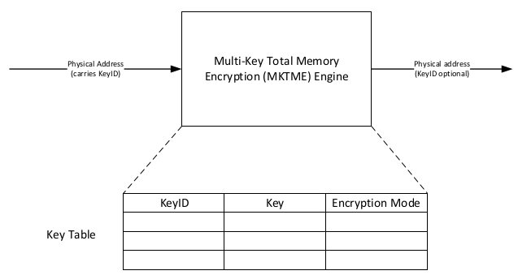

# TME/MKTME

Spec 是原理介绍。代码是实际应用，二者之间的距离还很远。

## Spec 干货解读

The spec is available at [here](https://software.intel.com/sites/default/files/managed/a5/16/Multi-Key-Total-Memory-Encryption-Spec.pdf).

加密使用的密钥/Key 只存在于 CPU 的硬件加密 engine 中，软件使用 key 时，都是使用 key ID 来索引对应的 key, 而不是直接使用。 CPU boot 时硬件会生成一个随机 key, 也被叫做 platform key, 这个 key 的 index 始终是 0,  indicated as **KeyID 0**.



软件如何使用 KeyID? When MKTME is activated, the upper bits of platform physical address (starting with the highest order bit available as enumerated by the CPUID MAX_PA info) are repurposed for usage as a KeyID as shown below. (Q: 为什么强调 MKTME 激活的时候，而不是 TME? TME 固定使用 KeyID 0, 不需要显式设置 KeyID? TME 下 KeyID 0 也不会出现在物理地址中？)


所以，软件唯一可见的是 KeyID.

### TME/MKTME configuration & usage

Memory Encription 功能通过 Model-Specific Register(MSR) 配置 & 激活使用。 CPUID.TME (CPUID.7.0.ECX.13) 用来判断当前 CPU 是否支持 Intel 内存加密架构，即 4 个 TME/MKTME 相关 MSRs 是否存在：

  1. IA32_TME_CAPABILITY – 981H
  2. IA32_TME_ACTIVATE – 982H
  3. IA32_TME_EXCLUDE_MASK – 983H
  4. IA32_TME_EXCLUDE_BASE – 984H

通过检查 TME_CAPABILITY MSR 的内容，进一步判断当前 CPU 是否支持 MKTME. 若支持，MKTME 通过 IA32_TME_ACTIVATE MSR 来配置和使能。 MKTME requires TME and cannot be enabled without enabling TME.

Power on/Reset 后， BIOS 负责配置上述寄存器来完成 memory encryption 的配置 & 使用。先配置，后激活使用(IA32_TME_ACTIVATE)。 Memory encryption 功能激活后，各配置不能更改，强行再写各配置寄存器的话，会产生 #GP exception.

#### IA32_TME_CAPABILITY

若此 Intel CPU 支持 memory encryption, IA32_TME_CAPABILITY 进一步描述 TME/MKTME 的 capability/characteristics:

  1. 本 CPU 支持的加密算法？ 1 个 bit 表示一种(预留 0 - 15 bits)，目前 spec 只支持 1 种(indicated by bit 0)
  2. MK_TME_MAX_KEYID_BITS: Key ID 使用的 bit 数, i.e., page table entry 中使用几个 bit 索引 key? 预留 4 bits 表示可以使用 0 - 15 个 bit 表示 key ID, 也即最大 key number = 2^15. 若该 field 为 0，则说明仅支持 TME, 不支持 MKTME; 若不为 0, 说明支持 MKTME.
  3. MK_TME_MAX_KEYS: 上一个 field 表示 ID 使用 bit 数，也即最大 key number。 此 field 才表示当前 CPU 实际支持的 Key number. 0 表示不支持 MKTME.

强调： IA32_TME_CAPABILITY 列出的都是 **capability**, 能力！实质是 range. 一个具体 CPU 真正使用多少由下面的 IA32_TME_ACTIVATE 决定。

#### IA32_TME_ACTIVATE

使用需要通过 IA32_TME_ACTIVATE MSR:

  1. TME Enable RWL (bit 1): TME/MKTME 使能。
  2. key select (bit 2): CPU hard 生成一个新 key, or 恢复使用上次的 key from storage?
  3. Save TME key for standby (bit 3)– Save key into storage to be used when resume from standby. 未必所有加密 CPU 都支持此功能
  4. TME encryption algorithm (bit 4 -7): 对应 IA32_TME_CAPABILITY 的加密算法 bit number. 表示 **TME** 使用的加密算法。下面还有 field 选择 MKTME 的加密算法
  5. MK_TME_KEYID_BITS (bit 32 - 35): MKTME 专用。 key ID 的**实际** bit 数。 Content pattern 和 MK_TME_MAX_KEYID_BITS 一致，但值不能大于它。
  6. MK_TME_CRYPTO_ALGS (bit 48 - 63): 16 个 bit, MKTME 专用。表示 MKTME 可以使用的加密算法的 bitmask, content pattern 跟 IA32_TME_CAPABILITY 中相应 field 一致。

#### IA32_TME_EXCLUDE_MASK & IA32_TME_EXCLUDE_BASE

TME and MKTME (for KeyID=0 only) supports **one exclusion range** to be used for special cases. (Note[1]: For all KeyIDs other than 0, TME Exclusion Range does not apply to MK-TME) The range of physical addresses specified in this MSR does not apply memory encryption described in this document. This range is primarily intended to be used for memory not available to OS and typically configured by BIOS. However, TME/MKTME (for KeyID=0) architecture does not place any restrictions on use of the exclusion range. The software is able to determine this range by reading MSR. The definition of this range follows definition of many range registers implemented in Intel processors.

[1]: 可以想象， CPU 的硬件加密 engine 在工作时看到 2 个数据，key ID & exclusion range.

  - KeyID 0 + exclusion range = 不加密
  - KeyID 0 + !exclusion range = 加密
  - Key ID !0 + exclusion range = 加密
  - Key ID !0 + ！exclusion range = 加密

### MKTME Key Programming

引入新指令： PCONFIG. This instruction is used to execute functions for **configuring platform features**. PCONFIG is enumerated in extended features (CPUID.7.0.EDX[18])

PCONFIG 支持的每个 function 被称为一个 leaf. 使用时， leaf number 先写入 EAX 寄存器，而 RBX, RCX, RDX 用来配置更细节的 leaf-specific function. 由 Spec chapter 6.2.1, table 1 可知，当前只支持一个 function leaf: MKTME_KEY_PROGRAM, 其 encoding 是 0x0000,0000.

PCONFIG 目前仅用来 program Key's attributes for MKTME(Key 本身 & 对应的 encryption mode). 未来可能会扩展此指令的功能。

**PCONFIG is a package scoped instruction and likewise, needs to be executed once per physical package to configure the desired platform feature.**

A **PCONFIG target** is defined as any hardware block on the platform which can be configured using PCONFIG. **PCONFIG currently only supports one target, MKTME.**

可以看出：PCONFIG 指令的存在只是因为 MKTME！ I.e., TME 下并不需要该指令！

#### MKTME_KEY_PROGRAM 使用详细

使用步骤：

  1. 将 MKTME_KEY_PROGRAM's leaf number: 0 写入 EAX,
  2. 在 memory 中构造 MKTME_KEY_PROGRAM_STRUCT, structure 地址写入 RBX. 结构的格式在 spec
chapter 6.2.1.1， Table 3.
  3. 执行指令。看起来 PCONFIG 是不需加任何操作数的指令。

其中的**重点**是 MKTME_KEY_PROGRAM_STRUCT,代码中定义如下：

```
struct mktme_key_program {
	u16 keyid;
	u32 keyid_ctrl;
	u8 __rsvd[58];
	u8 key_field_1[64];
	u8 key_field_2[64];
} __packed __aligned(256);
```
  - **KeyID**: 无需赘述。
  - KeyID control: 有 2 个有用的 sub-field.
	- Command: 1 byte length @ offset 0. 设置 **KeyID** 使用的 Encryption mode, 有 4 种
		- KEYID_SET_KEY_DIRECT: **KeyID** 使用 software provided key, 即 KEY_FIELD_1 + KEY_FIELD_2.
		- KEYID_SET_KEY_RANDOM[*]: **KeyID** 使用 CPU 生成的 ephemeral key. 每次执行这个 command, CPU 都会生成一个新的 key 并使用。
		- KEYID_CLEAR_KEY: clear **KeyID** 对应的 software provided key, i.e., 该 **KeyID** 将使用 CPU 生成的 platform key(或叫 TME key).
		- KEYID_NO_ENCRYPT: **KeyID** 将不加密 memory.
	- CRYPTO_ALG: 2 bytes length @ offset 1. **KeyID** 使用的加密算法，须是  IA32_TME_ACTIVATE[48:63] 中之一，即使是 KEYID_CLEAR_KEY and KEYID_NO_ENCRYPT commands。
  - KEY_FIELD_1 & KEY_FIELD_2: software provided KEY, 128 bytes.

[*] Q: 若如描述所述，那么： MKTME 下，可以有多个 KeyID 分别使用 CPU 生成的不同 Key?

## MKTME patchset 解读

[latest patchset](https://lore.kernel.org/lkml/20190731150813.26289-7-kirill.shutemov@linux.intel.com/T/) 于 2019/7/31 发出， 但据悉， Intel 已放弃把它推进 upstream.(本 section 使用 "p+number" 形式 reference patch in patchset).

搭载 MKTME 技术的 CPU 可能 2020 上市，由 p51 可知： IceLake.

原来 MKTME 已有 5 patches 进入 upstream: [here](https://lkml.org/lkml/2018/3/5/544).

p44 为 MKTME 新增 syscall: encrypt_mprotect. p59 展示了使用 demo. p46(mm: Restrict MKTME memory encryption to anonymous VMAs): 明确表示：Memory encryption is only supported for mappings that are ANONYMOUS(Anonymous memory = no file-backed memory). 从 commit msg 推测： MKTME 下应有一个不加密的 KeyID, 应用程序加载执行时，其所有 memory 默认是不加密的。应用程序内部可以选择 encrypt_mprotect 来加密 anonymous memory, 即 no file-backed memory.

MKTME 使用 Linux kernel key service framework 来管理它的 Key, 作为一个新的 key service type(p 57). I.e., MKTME 的 key management 被封装入该 framework, 通过此 framework 提供 syscall/user API: add_key/request_key/keyctl, etc. Linux kernel key service framework 在用户空间也提供了 keyctl 命令来管理 key.

从 patch 57 中 add_key() 的介绍来看，似乎不支持"用户提供 key" 的方式？ 更新：在 cover letter 中找到确切说明：This update removes support for user type keys. This closes a security gap, where the encryption keys were exposed to user space.

## Tips

As spec said, Encryption Engine locates on CPU, But one detail it doesn't reveal: Memory controller 传统上位于 NorthBridge, 现代 Computing system 越来越把原属于 [NorthBridge](https://en.wikipedia.org/wiki/Northbridge_(computing)) & SouthBridge 的功能往 CPU chip 上搬。 所以, memory encryption engine 实际是位于 CPU chip 上的 memory controller 中。 容易忽略的一个 fact: 进出 memory 的 data 要经过 memory controller(encryption enginer). 这样的话，就可理解为什么 DMA 时写入 memory 的数据也是加密的；为什么 TME 时，把 memory 中的数据写回 disk 是 plain text.

与 patchset 作者几封邮件的交流，push 我们想了更多问题。以至于回到最初：TME 到底有什么好处？ 这些问题，源于我们缺少安全攻击方面的 fundamentals.

我们在谈论"数据加密"时，基本是指 disk 数据加密，hard disk, U盘等，这已有很多相关产品。数据加密的话题出现以来，这貌似是一直以来的研究方向，它的安全防护目的我们也容易理解。

但是，RAM 上的数据也是容易受到安全攻击的，这个场景我们不容易理解。这类攻击通常被称为 [cold boot attact](https://en.wikipedia.org/wiki/Cold_boot_attack). 简而言之: RAM 中的数据在掉电后还可以维持一段时间，可通过攻击手段将 memory 中的数据 dump 出来，这是 cold boot attack 的核心概念。对于 cold boot attack, [full memory encryption](https://en.wikipedia.org/wiki/Cold_boot_attack#Full_memory_encryption) is a effective solution. 这应该就是 chip vendor 分别推出 memory encryption 的初衷。所以，现在可非常明确: **volatle memory(RAM) 加密有很多安全用途**。(上面 Wikipedia reference 对此 topic 做了 nice introduction.)

With the background above, let's look at Intel's TME/MKTME. TME/MKTME using the NIST standard AES-XTS algorithm with 128-bit keys. 对于这种加密算法， single key 还是 multiple key 在当代几乎无差，因为 AES 加密可以理解为[无法暴力枚举破解](https://www.sdnlab.com/21145.html)(Refer 下图)。另外一份[AES 安全性参考](https://blog.csdn.net/wulex/article/details/74052505)。所以 kernel 社区质疑 MKTME 比 TME 能带来更多 security benefits? Intel tried very hard 来寻找 MKTME 的 use-case, as is stated in "== MKTME-Provided Mitigations ==" in cover letter, 但看起来非常有限，没有说服社区，所以他们不打算继续 push MKTME into upstream.


(貌似我们在调查中过多带入我们的问题：对 dump 影响，忽略了上面这些“初心”背景)

Patch author Kirill said: The only legitimate use-case for MKTME is encryption of persistent memory.  不了解上面背景知识前有些难理解。 Let's deduce. 已知 memory encryption 的目的是为了防止 cold boot attack 之类的安全攻击。随着 persistent memory 的到来，情况变成怎样了？假如把 NVRAM 也当作 DRAM 用，那看起来也没什么好做的，即使写入的数据是加密的，因为已经把它当作 DRAM, so people don't care if the data inside is encrypted; 假如把 NVRAM 当作 NVRAM 用，则势必出现问题：重启后密钥没有了，how to decrypt NVRAM's data after reboot? 这时就需要 MKTME, WHY? (因为 TME 对 OS 来说完全透明，由 BIOS 激活功能后，OS 不需任何改动就可完美运行。) MKTME 技术带来了 PCONFIG 指令，它用来管理 encryption engine 中 key(add/remove/modify), 所以目测需要它来帮助 save/restore key. 而 TME 技术不包含这个指令。(具体细节还不知，spec 未细说，没有任何信息，个人怀疑这个功能还没有设计出来，因为目前 Intel memory encryption 还不支持 NVRAM 加密，或者说，只把它当作 DRAM 用)

## Gossip

MKTME patchset 的作者之一: [长者女性](https://www.linkedin.com/in/alisons/)