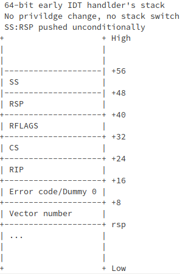

# From Power on to Linux kernel

Out of the extreme interest into the low level things, I have done this: analyzing Linux booting process base on X86. This is the memo record all the details about it.

To get this work done, one need to know but not limited to: X86 arch, compilation, linkage, hardware details, etc. For X86 arch, the authoritative documents are [Intel® 64 and IA-32 Architectures Software Developer’s Manual](https://software.intel.com/en-us/articles/intel-sdm), it has 10 volumes, we use SDM 1, SDM 2, SDM 3a, etc to refer to them.

## 1st instruction after Power-up

PC 在 power on 或 reset(assertion of the RESET# pin) 后，系统总线上的 CPU 会做处理器的硬件初始化，这包括：将所有寄存器复位成默认值，将 CPU 置于 real mode, invalidate 所有 cache，如 TLB 等；对于 SMP 系统，还会执行硬件的 multiple processor (MP) initialization protocol 来选择一个 CPU 成为 bootstrap  processor(BSP)，被选出的 BSP 则立刻从当前的 CS:IP 中取指令执行。

Power-up 后，寄存器 CR0 的值为 0x60000010, Protection Enable(PE) bit 为 0, 意味着 CPU 处于 real mode.


其他寄存器复位后的状态如下图示:


此处需提前介绍一下 X86 的 segment register，如下图：


Segment register 包含 visual part 和 hidden part(有时也叫做 descriptor cache 或 shadow register)，当 segment selector 被加载进 visual part 时，CPU 自动将相应 segment descriptor 中的 Base Address, Limit, Accesstion Information 加载进 hidden part。这些 cache 在 segment register 中的信息，使得 CPU 做地址翻译时不必从 memory 中的 segment descriptor 读取 base address 等信息，从而节省不必要的 bus cycle。若 segment descriptor table 发生变化，CPU 需重新加载 segment register，否则，地址翻译仍使用旧的 segment descriptor 中的信息。

也就是说，当使用 CS:EIP 的方式寻址时(或者说在计算 linear address 时)，实际是使用 hidden part 中的 Base Address + EIP value。

由上文知， BSP 从 CS：IP 中取第一条指令执行。Power-up 后，CS.Base = FFFF0000H, EIP=0000FFF0H，所以第一条指令的地址 = FFFF0000H + 0000FFFFH = FFFFFFF0H，该地址映射到 [ROM](https://en.wikipedia.org/wiki/Read-only_memory)上的 system firmware(一般指 BIOS).

典型的第一条指令是：

    FFFFFFF0:    EA 5B E0 00 F0         jmp far ptr F000:E05B

跳转指令会刷新 CS, 所以 CS.Base 的值变为 F0000H(F000H << 4)。接下来的寻址就是 real mode 的方式： CS selector << 4 + IP.

System firmware 中第一条指令的实现可能在不同的芯片/平台上而不同，因为 BIOS 一般不开源，且近年来出现新的 firmware: EFI。笔者目前的知识还无法得出一个 general 的答案。基于上述典型第一条指令，可推理一种执行过程：第一条指令跳转到第 1M 地址范围内，以 [Intel ® 3 Series Express Chipset Family](https://www.intel.com/Assets/PDF/datasheet/316966.pdf) 为例，chipset 的 Programmable Attribute Map(PAM) 寄存器会控制 768 KB 到 1 MB 地址空间中的 13 个 sections 的访问属性，power-up 后这些寄存器默认值的行为是 DRAM Disabled: All accesses are directed to [DMI](https://en.wikipedia.org/wiki/Direct_Media_Interface)，猜测对上述地址范围的访问会被 route 到 4G 的最后 1M 空间内，也就是说执行的代码还是来自 ROM 中的 BIOS。后续 BIOS 是否做 memory shadowing(将自己 copy 到第 1M 空间的 DRAM) 都可，只是 access 的速度有差别。此外，猜测所谓的带外管理技术(如 Intel 的 Management Engine)，也可能提前将 BIOS copy 到第 1M 的 DRAM 空间中。

注: BIOS 运行在 real mode，只能看到第 1M 地址空间。

BIOS 的最后工作是从已设置的启动设备中加载第一个 sector 到 RAM，并跳转过去执行。本文将以 grub2 的硬盘启动为例分析。

参考： [An Introduction to the PC's BIOS](https://thestarman.pcministry.com/asm/bios/index.html)

## GRUB2 booting process

本节假设 PC 只有一块硬盘，基于代码分析 grub 的工作流程。

官方给了一堆[权威参考文档](https://www.gnu.org/software/grub/grub-documentation.html)，另外，[grub2-booting-process](https://www.slideshare.net/MikeWang45/grub2-booting-process) 也是不错的参考。

BIOS 的最后工作是将硬盘上的 Master Boot Record(MBR, 也叫 boot sector) 加载到地址 0000:7C00，并跳转过去执行。 0x7c00 = 31kb, 为什么将 MBR 加载到这个地址？[这篇](http://www.ruanyifeng.com/blog/2015/09/0x7c00.html)做出了解释。另外，使用 MBR 这个术语是为了和 Volume Boot Record(VBR) 区分，MBR 是整个硬盘的第一个 sector, 而 Volume boot record 是分区的第一个 sector.

显然，512 bytes 的 boot sector 装不下功能强大的 grub，所以 grub 使用的方案是将代码分成几个部分，用 grub 的术语讲，grub 的工作流程分为: stage 1, stage 1.5, stage 2.

* stage 1 是位于 MBR 的 boot.img，用于加载 stage 1.5 的 core.img. (boot.img 在某些场景下也可以安装在 VBR 中)
* stage 1.5 是位于 MBR 和第一个磁盘分区之间的 core.img，它包含了访问文件系统的驱动程序，可以从文件系统读取 stage 2 的内容；以前这块空间有 63 sectors, 今天普遍是 2048 sectors, 使用分区工具查看磁盘时，都会看到第一个分区从第 2048 sector 开始。
* stage 2 是位于 /boot/grub 目录下的所有文件，包括配置文件和模块等。

参考： [The bootstrap mechanism used in GRUB](https://www.gnu.org/software/grub/manual/legacy/grub.html#Bootstrap-tricks)

安装在硬盘上的 grub2 布局如下：


简化版长这样：


core.img 包含多个 image 和 module，其布局如下：


2年前分析的 grub 的版本是 2.02, 现在(2020/07)已是 2.04.

### boot.img/MBR/boot sector

boot.img 的工作仅是将 core.img 的第一个 sector(即 diskboot.img) 加载到 RAM, core.img 中剩余的部分由 diskboot.img 继续加载到 RAM. boot.img 对应的 source code 是 [grub-core/boot/i386/pc/boot.S](http://git.savannah.gnu.org/cgit/grub.git/tree/grub-core/boot/i386/pc/boot.S)

对于 boot.S 的完整分析可参考：

1. [Boot image](https://www.funtoo.org/Boot_image):基于较老的代码，但整体逻辑一样。
2. [boot.S & diskboot.S 分析](https://blog.csdn.net/conansonic/article/details/78482766):基于最新的代码(2018/4)

文件开头定义了两个宏:

```assembly
.macro floppy
	xxx
.endm

.macro scratch
	xxx
.endm
```
其中, `.macro scratch` 声明了一些描述磁盘地址的变量，叫做 disk address packet, 下面调用 BIOS INT 13h 时会填充。

Macro HYBRID_BOOT 用作生成 boot_hybrid.image，可兼容 BIOS 和 EFI 启动。本例仅关注 BIOS 启动。 ·

boot.img 的开头为 [BIOS Parameter Block (BPB)](https://en.wikipedia.org/wiki/BIOS_parameter_block) 数据结构预留了空间，这是 [Volume Boot Record(VBR)](https://en.wikipedia.org/wiki/Volume_boot_record) 使用的数据结构，用于描述 volume 的物理布局，Windows 的文件系统 FAT/HPFS/NTFS 会使用它。VBR/BPB 的概念由 IBM PC(搭载 Microsoft DOS 系统) 引入，是 DOS 时代使用的东西， Windows 的文件系统 FAT/HPFS/NTFS 会使用它，[All about BIOS parameter blocks](http://jdebp.eu/FGA/bios-parameter-block.html) 给了一些参考信息。所以，看来 grub 也会被安装到 VBR?

BPB 起始自 sector 第 12(0xB) byte, 前面空出 11 bytes. 由 [Format of full DOS 7.1 Extended BIOS Parameter Block](https://en.wikipedia.org/wiki/BIOS_parameter_block#DOS_7.1_EBPB) 可看出，BPB 结束地址 = 0x52 + 0x8 = 0x5A，正是 *GRUB_BOOT_MACHINE_BPB_END* 的值。但 GRUB_BOOT_MACHINE_BPB_START 为什么是 0x3? TBD.

```assembly
	.file	"boot.S"

	.text

	/* Tell GAS to generate 16-bit instructions so that this code works
	   in real mode. */

	/* Tell GAS to generate 16-bit instructions so that this code works
	   in real mode. */
	.code16

.globl _start, start;
_start:
start:
	/*
	 * _start is loaded at 0x7c00 and is jumped to with CS:IP 0:0x7c00
	 */

	/* Beginning of the sector is compatible with the FAT/HPFS BIOS
	 * parameter block. */

	jmp	LOCAL(after_BPB)
	nop	/* do I care about this ??? */

#ifdef HYBRID_BOOT
	...
#else
	/*
	 * This space is for the BIOS parameter block!!!!  Don't change
	 * the first jump, nor start the code anywhere but right after
	 * this area.
	 */

	.org GRUB_BOOT_MACHINE_BPB_START
	.org 4
#endif
#ifdef HYBRID_BOOT
	...
#else
	scratch
#endif

	.org GRUB_BOOT_MACHINE_BPB_END
	/* End of BIOS parameter block.	 */

/* grub 的上下文中，kernel 指 core.img. kernel_address 表示 core.img 第一个 sector(diskboot.img)
 * 加载到 RAM 中的地址，定义为 GRUB_BOOT_MACHINE_KERNEL_ADDR, 在 i386 PC 上，它的值是 0x8000，见下面解释。*/
LOCAL(kernel_address):
	.word	GRUB_BOOT_MACHINE_KERNEL_ADDR

/* kernel_sector & kernel_sector_high 记录 core.img 在磁盘上的起始 sector number, 即 
 * diskboot.img 所在 sector number. grub install 时被写入 */
#ifndef HYBRID_BOOT
	.org GRUB_BOOT_MACHINE_KERNEL_SECTOR
LOCAL(kernel_sector):
	.long	1
LOCAL(kernel_sector_high):
	.long	0
#endif
```
GRUB_BOOT_MACHINE_KERNEL_ADDR 的定义：
```c
/* The address where the kernel is loaded.  */
#define GRUB_BOOT_MACHINE_KERNEL_ADDR	(GRUB_BOOT_MACHINE_KERNEL_SEG << 4)

#define GRUB_BOOT_MACHINE_KERNEL_SEG    GRUB_OFFSETS_CONCAT (GRUB_BOOT_, GRUB_MACHINE, _KERNEL_SEG)

#define GRUB_OFFSETS_CONCAT(a,b,c)    GRUB_OFFSETS_CONCAT_(a,b,c)
#define GRUB_OFFSETS_CONCAT_(a,b,c)   a ## b ## c

/* The segment where the kernel is loaded.  */
#define GRUB_BOOT_I386_PC_KERNEL_SEG	0x800
```
同时，grub-core/Makefile 中有:
```makefile
TARGET_CPPFLAGS =  -Wall -W  -DGRUB_MACHINE_PCBIOS=1 -DGRUB_MACHINE=I386_PC -m32 bluhbluh...
```
所以， GRUB_BOOT_MACHINE_KERNEL_ADDR = 0x8000.

继续分析前，剧透一些背景知识: BIOS 跳转到 grub 时会设置 DL 寄存器，表示 **boot drive number**, 即从哪个驱动器(drive)读取 grub kernel image, 在使用 BIOS interrupt service 从 HDD 读取内容时会用到（待确认）。但 grub 可以改修改它的值。

Boot driver number 属于 BIOS 的知识范畴，因为 grub boot.img 将使用 BIOS 的磁盘读写中断服务从驱动器加载 core.img，所以 BIOS 对其有解释权，未找到权威介绍，这几篇可参考：

1. [list the BIOS drive index](https://stackoverflow.com/questions/45891044/any-way-to-list-the-bios-drive-numbers-in-real-mode)
2. [PC boot: dl register and drive number](https://stackoverflow.com/questions/11174399/pc-boot-dl-register-and-drive-number)
3. **[BIOS to MBR interface](https://en.wikipedia.org/wiki/Master_boot_record#BIOS_to_MBR_interface)**

>3: By convention, only fixed disks / removable drives are partitioned, therefore, the only DL value a MBR could see traditionally was 0x80.

简而言之，boot drive number 用一个 byte 表示，最高 bit 为 1 表示 若 boot drive 是 hard disk or removable device (包括 U盘，移动硬盘，光驱等), number range 是 0x80 - 0xfe; 最高 bit 为 0 表示 floppy, number range 是 0x00 - 0x7E. boot.img 使用 BIOS interrupt service 读取 diskboot.img 时需要确定从哪儿个驱动器读取。

```assembly
	.org GRUB_BOOT_MACHINE_BOOT_DRIVE
boot_drive:
	/* grub install 时，此 field 再次写入 0xff, 见 write_rootdev 函数。0xff 表示使用 BIOS 设置的
	 * DL 值。似乎隐含的信息：boot.img 和 core.img 可以安装在不同的 drive? */
	.byte 0xff	/* the disk to load kernel from */
			    /* 0xff means use the boot drive */

LOCAL(after_BPB):
/* MBR 真正的 code 始于此 */
/* general setup */
	cli		/* we're not safe here! */

	/*
	 * This is a workaround for buggy BIOSes which don't pass boot
	 * drive correctly. If GRUB is installed into a HDD, check if
	 * DL is masked correctly. If not, assume that the BIOS passed
	 * a bogus value and set DL to 0x80, since this is the only
	 * possible boot drive. If GRUB is installed into a floppy,
	 * this does nothing (only jump).
	 */
	/* 上面注释的关键信息：buggy BIOS 可能错误设置 DL 寄存器；grub 安装到 HDD 时, 0x80 是唯一有效
	 * boot driver number, 隐含的信息是：若系统有多个 hard drive, BIOS 始终将包含 boot loader
	 * 的 drive 置为 0x80.
	 * grub 安装在 HDD 时，jmp 指令被 overwrite 为 2 个 NOP 指令(详见 grub_util_bios_setup 函数)。
	 * 若 %dl 是 0x80 - 0x8f, 说明有效，使用它，否则强行赋值 dl 为 0x80.
	 */
    .org GRUB_BOOT_MACHINE_DRIVE_CHECK
boot_drive_check:
        jmp     3f	/* grub-setup may overwrite this jump */
        testb   $0x80, %dl  /* 若 dl 最高 bit ！= 1，则跳到 2，强赋值为 0x80 */
        jz      2f /* 若 dl 最高 bit = 1, 则进入 3 判断范围是否在 0x80-0x8f */
3:
	/* Ignore %dl different from 0-0x0f and 0x80-0x8f.  */
	testb   $0x70, %dl
	jz      1f /* grub 安装在 HDD 时，若 dl 范围在 0x80-0x8f, 说明是有效值，则不必修改，
				  进入真正代码 1f; 否则仍然强赋值为 0x80. */
2:
	movb    $0x80, %dl
1:
	/*
	 * ljmp to the next instruction because some bogus BIOSes
	 * jump to 07C0:0000 instead of 0000:7C00.
	 */
	/* 这也是 BIOS to MBR interface 中定义的内容 */
	ljmp	$0, $real_start

real_start:
	/* ... */

	/*  Check if we have a forced disk reference here	 */
	/* "forced disk reference" 是指 grub install 时 grub 修改的 boot_drive 值。若 grub 设置了
	 * boot_drive, 则使用它，否则使用 %dl. */
	movb   boot_drive, %al
	cmpb	$0xff, %al
	je	1f           /* boot_drive = 0xff 表示使用 BIOS 设置的 %dl*/
	movb	%al, %dl /* 否则，使用 boot_drive 的值 */
1:
	/* save drive reference first thing! */
	pushw	%dx
```
真正的代码始于 real_start：先使用 [INT 13/AH=41h/BX=55AAh](http://www.ctyme.com/intr/rb-0706.htm) 判断磁盘是否支持 LBA 访问，若不支持，则使用 CHS 模式。以 LBA 为例，再次调用 INT 13/AH=42h, 从 core.img 中读取第一个 sector(代码注释是："the blocks") 到地址 GRUB_BOOT_MACHINE_BUFFER_SEG(0x7000) : 0 的 buffer 中，然后函数 copy_buffer 拷贝 buffer 中的 512 bytes 到 0 : GRUB_BOOT_MACHINE_KERNEL_ADDR，即**从 0x7000 : 0 拷贝到 0 : 0x8000**，最后 absolute jmp 到 GRUB_BOOT_MACHINE_KERNEL_ADDR. That is what boot.img does.  将简略分析关键代码。

INT 0x13 的使用参考:

1. [wikipedia: INT 13H](https://en.wikipedia.org/wiki/INT_13H)
2. [INT 13/AH=42h](http://www.ctyme.com/intr/rb-0708.htm)。

[INT 13/AH=41h/BX=55AAh](http://www.ctyme.com/intr/rb-0706.htm) 检查是否支持 LBA：

>Int 13/AH=41h/BX=55AAh: Check Extensions Present

检查 **INT 13h Extensions** 功能是否存在，它支持更大的磁盘空间访问，更大的磁盘空间访问是通过支持 LBA 模式实现。所以代码注释直接道出了本质: check if LBA is supported

 [Int 13/AH=42h](http://www.ctyme.com/intr/rb-0708.htm) 加载 disk.img:

>INT 13h AH=42h: Extended Read Sectors From Drive

DS:SI 指向叫做 **disk address packet**(DAP) 的 memory，它是 INT 13h AH=42h 的入参，所以需初始化这段数据。INT 13h AH=42h 从 DAP 中取得必要的入参进行操作，所以这块内存也被叫做 packet interface.

boot.s 开头的代码定义了 DAP, 并放在BPB 的空间:

```assembly
.macro scratch
/* scratch space */
mode:
	.byte	0
disk_address_packet:
sectors:
	.long	0
heads:
	.long	0
cylinders:
	.word	0
sector_start:
	.byte	0
head_start:
	.byte	0
cylinder_start:
	.word	0
/* more space... */
.endm
```

可看出格式并不遵循 DAP 定义，应该是还有其他用处，待分析。DAP 前还有变量 mode，记录 INT 13/AH=41h/BX=55AAh 的结果，即磁盘是否支持 LBA(1：支持，0：不支持), 后面的代码直接检查这个变量即可知道是否支持 LBA mode，不必再使用 INT 13h.

初始化 [DAP](https://en.wikipedia.org/wiki/INT_13H#INT_13h_AH=42h:_Extended_Read_Sectors_From_Drive):

```assembly
LOCAL(lba_mode):
	xorw	%ax, %ax
	movw	%ax, 4(%si)

	incw	%ax
	/* set the mode to non-zero */
	movb	%al, -1(%si)

	/* the blocks */
	movw	%ax, 2(%si)

	/* the size and the reserved byte */
	movw	$0x0010, (%si)

	/* the absolute address */
	movl	LOCAL(kernel_sector), %ebx
	movl	%ebx, 8(%si)
	movl	LOCAL(kernel_sector_high), %ebx
	movl	%ebx, 12(%si)

	/* the segment of buffer address */
	movw	$GRUB_BOOT_MACHINE_BUFFER_SEG, 6(%si)
```

### diskboot.img

由 core.img 的图示可知，其第一个 sector 的内容是 diskboot.img, 对应 grub-core/boot/i386/pc/diskboot.S. diskboot.img 的执行环境，也即寄存器，由 boot.img 设置，此时的环境如下：

1. 有可用的 stack(SS 和 SP 已配置)。
2. 寄存器 DL 是正确的 boot drive。
3. 寄存器 SI 是 DAP(Disk Address Packet) 的地址(还需要使用 INT 13/AH=42h 来继续读取磁盘 sector)。

diskboot.img 的工作是加载 core.img 中剩余的部分到 RAM, 并跳过去执行。其代码实现本质上和 boot.img 一样，都是借助 BIOS 的 interrupt service 读取 HDD 的内容到 RAM, 只不过 diskboot.img 需要 load 多个 sectors 而已。

diskboot.img 需要知道 core.img 剩余部分的 sector address & size 才能去读，显然，address 在 grub-install 时才能确定；而 core.img 的 size 在 grub-mkimage(生成 core.img) 时才能确定. core.img 的 address & size 定义在 diskboot.S 末尾：

```assembly
	.org 0x200 - GRUB_BOOT_MACHINE_LIST_SIZE
LOCAL(firstlist):	/* this label has to be before the first list entry!!! */
				 	/* fill the first data listing with the default */
blocklist_default_start:
	/* this is the sector start parameter, in logical sectors from
	   the start of the disk, sector 0 */
	/* core.img 的剩余部分从 2nd sector 开始，因为 sector 0 是 boot.img,
	 * sector 1 是 diskboot.img. 又因为 x86 是 little-endian, 所以定义如此。
	 * 通过 objdump 确认, .long 是 4 bytes, 即使是 .code16.*/
	.long 2, 0

blocklist_default_len:
	/* this is the number of sectors to read.  grub-mkimage
	   will fill this up */
	.word 0

blocklist_default_seg:
/* this is the segment of the starting address to load the data into */
/* 由 boot.img 的分析可知，GRUB_BOOT_MACHINE_KERNEL_SEG = 0x800. 因 diskboot.img 在 RAM
 * 0x8000 处，size 是 512 bytes, 将 core.img 剩余部分紧挨着 diskboot.img 加载，所以是 0x8200. */
	.word (GRUB_BOOT_MACHINE_KERNEL_SEG + 0x20)
```

对应 grub 中的 C struture：

```c
struct grub_pc_bios_boot_blocklist
{
  grub_uint64_t start;
  grub_uint16_t len;
  grub_uint16_t segment;
} GRUB_PACKED;
```

为什么这段空间被标以 label: **firstlist**? blocklist 结构描述一块磁盘区域和其加载地址，某些情况下，core.img 可能被分成几部分安装在磁盘，这时便需要多个 blocklist, 比如，比如, MBR 到第一个 partition 之间的空间不够放下 core.img, 再比如，On GPT, there is no guaranteed unused space before the first partition. 若存在多个 blocklist，他们将紧挨着 firstlist 存放, 且向 diskboot.img 头部延伸。

代码分析：

```assembly
	/* this sets up for the first run through "bootloop" */
	/* 将 firstlist 地址保存到寄存器 di.   $ label 的形式表示取 label 的地址。 */
	movw	$LOCAL(firstlist), %di

	/* save the sector number of the second sector in %ebp */
	/* firstlist 的第一个 field, 表示起始 sector 号，保存到 ebp. */
	movl	(%di), %ebp

    /* this is the loop for reading the rest of the kernel in */
    /* 因为每次读取的 sector 数有限制，所以需要循环读取 */
LOCAL(bootloop):

	/* check the number of sectors to read */
	/* firstlist + 8 处的值表示待读取的 sector 数；每次读 HDD 后，将减去已读 sector 数。*/
	cmpw	$0, 8(%di)

	/* if zero, go to the start function */
	/* 若待读取 sector 数是 0，说明已经读取完，跳转 bootit 启动；否则继续读 HDD.  */
	je	LOCAL(bootit)

LOCAL(setup_sectors):
	/* check if we use LBA or CHS */
	/* 读 HDD 前，判断使用哪儿种方式：LBA or CHS.  si 寄存器是 DAP 地址，-1(%si) 表示
	 * 变量 mode, boot.S 的分析中已介绍。以 LBA 为例分析. */
	cmpb	$0, -1(%si)

	/* use CHS if zero, LBA otherwise */
	je	LOCAL(chs_mode)

	/* load logical sector start */
	/* 将 HDD 起始地址(sector No. in LBA mode)放入寄存器 ebx 和 ecx， INT 13/AH=42h 要用 */
	movl	(%di), %ebx
	movl	4(%di), %ecx

	/* the maximum is limited to 0x7f because of Phoenix EDD */
	/* Phoenix EDD 的介绍参考 https://en.wikipedia.org/wiki/INT_13H:
	 * 	To support even larger addressing modes, an interface known as
	 * 	INT 13h Extensions was introduced by Western Digital and Phoenix
	 * 	Technologies as part of BIOS Enhanced Disk Drive Services (EDD).
	 */
	xorl	%eax, %eax
	movb	$0x7f, %al

	/* how many do we really want to read? */
	/* 将读取的 sector 数，和待读取的 sector 总数比较，即从 8(%di) 处减去要读取的数 */
	cmpw	%ax, 8(%di)	/* compare against total number of sectors */

	/* which is greater? */
	/* 若 cmp 结果不为 0，说明要读取 0x7f 个 sector，则跳到 1f */
	jg	1f

	/* if less than, set to total */
	/* 若 cmp 结果 <= 0，说明待读取的数目小于 0x7f，读取该数目即可 */
	movw	8(%di), %ax

1:
	/* subtract from total */
	subw	%ax, 8(%di)

	/* add into logical sector start */
	/* 读取 sector 后，下次待读取的地址要更新，新地址 = 老地址 + 上次读取的 sector 数 */
	addl	%eax, (%di)
	adcl	$0, 4(%di)

	/* set up disk address packet */
	/* 通过 blocklist 设置 DAP, 因为 DAP 是 INT 13/ah=42h 的入参。*/

	/* the size and the reserved byte */
	/* si 寄存器是 DAP 的地址。初始化 DAP，跟 boot.S 中一样，前两个字节是 0x10, 0，
	 * 因为 x86 是 little-endian, 所以是 0x0010. */
	movw	$0x0010, (%si)

	/* the number of sectors */
	movw	%ax, 2(%si)

	/* the absolute address */
	/* 填入 sector 读取地址，已经在上面代码初始化过 */
	movl	%ebx, 8(%si)
	movl	%ecx, 12(%si)

	/* the segment of buffer address */
	/* 使用和 boot.S 中一样的 buffer */
	movw	$GRUB_BOOT_MACHINE_BUFFER_SEG, 6(%si)

	/* save %ax from destruction! */
	pushw	%ax

	/* the offset of buffer address */
	/* 还是使用和 boot.S 中一样的 buffer segment 的 offset 0 */
	movw	$0, 4(%si)

	/* BIOS call "INT 0x13 Function 0x42" to read sectors from disk into memory */
	movb	$0x42, %ah
	int	$0x13

	jc	LOCAL(read_error)

	/* 读取 HDD 到 memory 后，立刻调用 copy_buffer, 把 buffer 内容 cp 到它应该在的位置 */
	movw	$GRUB_BOOT_MACHINE_BUFFER_SEG, %bx
	jmp	LOCAL(copy_buffer)
```

略过 chs_mode 的代码，来到 copy_buffer:

```assembly
LOCAL(copy_buffer):
/* 将刚刚读到 buffer 中的数据 cp 到目的地址 */
	/* load addresses for copy from disk buffer to destination */
	/* blokdlist 10(%di) 处保存着 buffer 数据被 cp 到目的段的段基址： GRUB_BOOT_MACHINE_KERNEL_SEG
	 * + 0x20，即 0x820。这里的策略是：每次 cp 使用的目的地址是 10(%di): 0，即每次
	 * offset 都是 0，那么每次 cp 后只更新段基址 10(%di) 即可形成下次 cp 的物理(线性)地址 */
	movw	10(%di), %es	/* load destination segment */

	/* restore %ax */
	/* ax 中保存着刚刚 INT 13/ah=42h 的返回值：读取的 sector 数 */
	popw	%ax

	/* determine the next possible destination address (presuming 512 byte sectors!) */
	/* 为啥表示 sector 数的 %ax 左移 5 bit？每次从 buffer 中 cp %ax 个 sector 内容
	 * 到目的地址 10(%di):0，所以每次 cp 后，目的地址 = 目的地址 + %ax * 512，即 %ax
	 * 需要左移 9 bit。因为使用的策略是仅更新段基址，所以左移 5 bit 后的值加到 10(%di)
	 * 处的段基址上，又因为 logical address 转换 linear address 时，段基址还要左移
	 * 4 bit，所以其实一共左移 9 bit，也就达到了 %ax * 512(2^9) 的目的。 */
	shlw	$5, %ax		/* shift %ax five bits to the left */
	addw	%ax, 10(%di)	/* add the corrected value to the destination
						       address for next time */

	/* save addressing regs */
	pusha
	pushw	%ds

	/* get the copy length */
	/* 上面左移了 5 bit，这里又左移了 3 bit，共 8 bit，也即 %ax = %ax * 2^8 =
	 * %ax * 256。因为一个 sector 是 512 byte，且下面使用 movsw 指令执行 cp，每次 mov
	 * 一个 word(2 bytes)，所以 cp 一个 sector 需循环 512 / 2 = 256(2^8) 次。
	 * 所以，一共移动 %ax << 8 次即可 */
	shlw	$3, %ax
	movw	%ax, %cx

	/* 将 DS：SI cp 到 ES:DI */
	xorw	%di, %di	/* zero offset of destination addresses */
	xorw	%si, %si	/* zero offset of source addresses */
	movw	%bx, %ds	/* restore the source segment */

	cld		/* sets the copy direction to forward */

	/* perform copy */
	rep		/* sets a repeat */
	movsw		/* this runs the actual copy */

	/* restore addressing regs and print a dot with correct DS
	   (MSG modifies SI, which is saved, and unused AX and BX) */
	popw	%ds
	MSG(notification_step)
	popa

	/* check if finished with this dataset */
	/* cp 完成后，检查还有没有待读取的 sector，有的话继续这个循环，跳回 setup_sectors */
	cmpw	$0, 8(%di)
	jne	LOCAL(setup_sectors)

	/* update position to load from */
	/* 当前 blocklist 已读完，检查是否还有 blocklist 需要读取。若有多个 blocklist，上文已经分析，
	 × 它将紧挨 diskboot.S 文件底部的 firstlist，所以减去 12 即可 */
	subw	$GRUB_BOOT_MACHINE_LIST_SIZE, %di

	/* jump to bootloop */
	/* 这再请在回到前文品味 bootloop 的注释 */
	jmp	LOCAL(bootloop)

/* END OF MAIN LOOP */
```

正常情况下，只有一个 blocklist 结构。core.img 剩余部分读完后，通过下面的代码跳转到地址 0:0x8200，即 core.img 的所有 components 紧挨一起。

```assembly
LOCAL(bootit):
	/* print a newline */
	MSG(notification_done)
	popw	%dx	/* this makes sure %dl is our "boot" drive */
	ljmp	$0, $(GRUB_BOOT_MACHINE_KERNEL_ADDR + 0x200)
```

跳转后的代码是 lzma_decompress.img 的内容。

### lzma_decompress.img

lzma_decompress.img 对应源码 grub-core/boot/i386/pc/startup_raw.S，它 include 同目录下的  "lzma_decode.S"，这是 lzma 的算法核心。lzma_decompress.img 的工作是解压缩自己后面的压缩内容并跳过去，由 core.img 的图示可知，后面 kernel.img，由名字可知，这是 grub 的核心内容，它对应代码 grub-core/kern.

某种意义上说，kernel.img 才是 grub 真正的开始。对于 lzma_decompress.img 代码的详细分析参考[此文](https://blog.csdn.net/conansonic/article/details/78534950)。本节仅简单分析。

startup_raw.S 开头是 long jmp 指令：

```assembly
ljmp $0, $ABS(LOCAL (codestart))
```
跳过开头部分的 special data area 来到 lzma_dcomress.img 的真正代码处.  **GRUB_DECOMPRESSOR_MACHINE_COMPRESSED_SIZE** & **GRUB_DECOMPRESSOR_MACHINE_UNCOMPRESSED_SIZE**, 顾名思义，由 grub-mkimage 生成 core.img 时填写。

```assembly
/* the real mode code continues... */
LOCAL (codestart):
	cli		/* we're not safe here! */

	/* set up %ds, %ss, and %es */
	/* diskboot.S 最后的跳转指令中的 CS 为 0. 将 DS，SS，ES 也置 0 */
	xorw	%ax, %ax
	movw	%ax, %ds
	movw	%ax, %ss
	movw	%ax, %es

	/* set up the real mode/BIOS stack */
	/* boot.img 和 diskboot.img 中都使用 GRUB_BOOT_MACHINE_STACK_SEG(0x2000)
	 * 作为 sp, why (0x2000 - 0x10) here? */
	movl	$GRUB_MEMORY_MACHINE_REAL_STACK, %ebp
	movl	%ebp, %esp

	sti		/* we're safe again */
	...

	/* transition to protected mode */
	/* 解压缩需使用超过 1M memory, 所以切换到 protect mode. 经 objdump -d 可看出：calll
	 * 使用 prefix 66H, operand overwrite, 生成 4 bytes long 跳转地址。
	 * calll 将下一条指令地址 push 到 stack, 下一条指令是 32-bit code. 因为 real mode 与
	 * protect mode 使用不同的 stack, 而下一条指令地址是保存在 real mode stack, 所以
	 * 跳转到 protect mode 后，将该地址辗转保存到 protect mode stack, 以便 ret 时返回到
	 * 正确地址。此外 real mode 使用的 BIOS 提供的 Interrupt Vector Table(IVT), 切到
	 * protect mode 时也需保存其地址，以便未来切回 real mode. */
	calll	real_to_prot

	/* mode switch 的分析略过。只需知道返回到这里时已是 protect mode. */

	/* The ".code32" directive takes GAS out of 16-bit mode. */
	.code32

	cld
	/* a20: address line 20. 参考 https://wiki.osdev.org/A20_Line. 此处不做分析，后面分析
	 * linux kernel 时有详细分析。*/
	call	grub_gate_a20

	/* 由代码可知，lzma_decompress.img 后面的内容不仅被压缩，而且*可能*使用 Reed
	 * solomon code 做内容纠错(grub-bios-setup's option: --no-rs-codes)。这里先纠错，
	 * 再解压。 参考：
	 * https://www.cs.cmu.edu/~guyb/realworld/reedsolomon/reed_solomon_codes.html
	 *
	 * 编译使用了 mregparm = 3，表示使用寄存器(以顺序) EAX, EDX, ECX 来传递 C 函数的入参。
	 */
	movl	LOCAL(compressed_size), %edx
#ifdef __APPLE__
	...
#else
	addl    $(LOCAL(decompressor_end) - LOCAL(reed_solomon_part)), %edx
#endif
	movl    reed_solomon_redundancy, %ecx
	leal    LOCAL(reed_solomon_part), %eax
	cld
	call    EXT_C (grub_reed_solomon_recover)
	jmp	post_reed_solomon
```

将紧挨着 lzma_decompress.img 的数据(开始于 decompressor_end)解压到 buffer GRUB_MEMORY_MACHINE_DECOMPRESSION_ADDR(0x100000) 处，并跳转过去执行：

```assembly
post_reed_solomon:

#ifdef ENABLE_LZMA
	movl	$GRUB_MEMORY_MACHINE_DECOMPRESSION_ADDR, %edi /* edi：解压目的地址 */
	movl	$LOCAL(decompressor_end), %esi /* esi：待解压数据起始地址 */
#endif

	pushl	%edi
	movl	LOCAL (uncompressed_size), %ecx   /* ecx: 解压后的 size */
	leal	(%edi, %ecx), %ebx /* ebx: 压缩数据尾部的地址 = 起始地址 + size */
/* Don't remove this push: it's an argument.  */
	push 	%ecx
	call	_LzmaDecodeA
	pop	%ecx
	/* _LzmaDecodeA clears DF, so no need to run cld */
	popl	%esi /* esi 是刚 push 的 %edi: 解压 buffer address */
#endif

	/* 给后面的代码使用，见后面分析。boot_dev 位于 GRUB_DECOMPRESSOR_I386_PC_BOOT_DEVICE
	 * 处，它仅用于 lnxboot.img 中，本文场景不涉及。*/
	movl	LOCAL(boot_dev), %edx
	movl	$prot_to_real, %edi
	movl	$real_to_prot, %ecx
	movl	$LOCAL(realidt), %eax

	/* 又是 absolute jump. Refer: 9.15.7 of `info as`: AT&T absolute
	 * (as opposed to PC relative) jump/call operands are prefixed by '*' .
	 * 跳到解压数据起始地址。*/
	jmp	*%esi
```

### kernel.img

构建 kernel.img 的 Makefile 内容，在 grub-core/Makefile.core.am:

	# 为适配排版，格式有微调
	if COND_i386_pc
	platform_PROGRAMS += kernel.exec
	kernel_exec_SOURCES  = kern/i386/pc/startup.S
	kernel_exec_SOURCES += kern/i386/pc/init.c kern/i386/pc/mmap.c term/i386/pc/console.c
	               kern/i386/dl.c kern/i386/tsc.c kern/i386/tsc_pit.c kern/compiler-rt.c
	               kern/mm.c kern/time.c kern/generic/millisleep.c kern/command.c
	               kern/corecmd.c kern/device.c kern/disk.c kern/dl.c kern/env.c
	               kern/err.c kern/file.c kern/fs.c kern/list.c kern/main.c kern/misc.c
	               kern/parser.c kern/partition.c kern/rescue_parser.c kern/rescue_reader.c
	               kern/term.c
	...
	kernel_exec_LDFLAGS  = $(AM_LDFLAGS) $(LDFLAGS_KERNEL) $(TARGET_IMG_LDFLAGS)
	                       $(TARGET_IMG_BASE_LDOPT),0x9000
	...

可看出：kernel.img 的入口是 startup.S，起始地址为 0x9000，因 kernel.img 运行在保护模式下，所以文件开头有 directive `.code32`。

> Tip: kernel.img 前，real mode 的 CS 都是 0; 切到 protect mode 后，CS segment descriptor's base address 也是 0.

```assembly
.code32

/* memory reference 参考： 9.14.7 Memory References of `info as`.
 * 由 startup_raw.S 跳转前的几行代码可知：此时 esi 的值是 0x100000(1M), edi, ecx 分别
 * 保存函数 prot_to_real 和 real_to_prot 的地址，eax 保存变量 realidt 的地址。将他们存到
 * kernel.img 内部变量 */
movl	%ecx, (LOCAL(real_to_prot_addr) - _start) (%esi)
movl	%edi, (LOCAL(prot_to_real_addr) - _start) (%esi)
movl	%eax, (EXT_C(grub_realidt) - _start) (%esi)
```
kernel.img 首先把自己 copy 到链接地址 0x9000:

```assembly
	/* copy back the decompressed part (except the modules) */
	/* 二者相减得到 kernel.img 的 size，放在 ecx, movsb 指令会用到 */
	movl	$(_edata - _start), %ecx

	/* _start 位于 kernel.img 的开头，所以它的地址是 0x9000，这是 copy 的目的地址 */
	movl	$(_start), %edi
	rep
	movsb

	/* 窍门：符号 cont 的值(地址)基于 kernel.img 的链接起始地址 0x9000.  movsb 已
	 * 把 kernel.img copy 回它的链接地址，这里通过absolute jump，跳回符号 cont 的地址
	 * 继续执行，i.e., absolute jump 后执行的代码取自 0x9000 的 kernel.img，不是
	 * buffer 0x100000 中的 kernel.img */
	movl	$LOCAL (cont), %esi
	jmp	*%esi
LOCAL(cont):
```

上面有个不常见的符号: _edata, 参考 `man etext/edata/end/`. ld 的 default linker script 中定义了这几个符号。使用 `ld --verbose` 查看 ld's default linker script.

```assembly
LOCAL(cont):
...

	/* clean out the bss */
	/* BSS_START_SYMBOL, END_SYMBOL 通过 configure script 定义在 Makefile, 其值与当前系统匹配。
	 * 本场景下，他们是 __bss_start, & end, 都在 ld‘s default linker script 中定义。*/
	movl	$BSS_START_SYMBOL, %edi

	/* compute the bss length */
	movl	$END_SYMBOL, %ecx

	/* 相减得到 size 放在 ecx */
	subl	%edi, %ecx

	/* clean out */
	xorl	%eax, %eax
	cld /* index 递增 */
	rep
	stosb /* store eax to ES:EDI，每次 1 byte，重复 ecx 次 */

	/* lnxboot.img 专用。放入 kernel.img 内部变量中 */
	movl	%edx, EXT_C(grub_boot_device)

	/*
	 *  Call the start of main body of C code.
	 */
	call EXT_C(grub_main)
```

**grum_main** 函数是 grub 的核心内容。分析至此，可先去看 **Install GRUB** 一节，再来看 kernel.img 的流程，因为上面分析的 image 中某些变量在 install 时被写入。

#### kernel.img/grub_main

由函数定义

	void __attribute__ ((noreturn)) grub_main (void)

可知，它不会返回。这时 CPU 在 protect mode, **未开启 paging**, kernel image 被 copy 到链接地址，但 modules 还在 buffer 中. 依然捡重点代码分析：

```c
void __attribute__ ((noreturn)) grub_main (void)
{
	/* First of all, initialize the machine.  */grub_mm_base
	/* Get modules' buffer address into 'grub_modbase'; Initialize console; most important:
	 * memory management initialization. Details at below. */
	grub_machine_init ();
	...
	/* Initialize corresponding data if there is  OBJ_TYPE_CONFIG object in module info data. */
	grub_load_config ();
	...

	/* grub adopt the mechanism of module, which is PIC(Position Independent Code). Modules
	 * use the symbol from kernel image, so when module is used, relocation must be done first.
	 * Export the kernel image symbols that modules will use, for future relocation. symbols
	 * All exported are saved via grub_symtab. */
	grub_register_exported_symbols();
	...

	/* Load modules in buffer to specific address, and link them with kernel image & each other,
	 * make them available. Details at below. */
	grub_load_modules ();

	...
	/* Reclaim space used for modules. */
	 * make the buffer space for modules available for grub memory management. */
	reclaim_module_space ();
	...

	/* The core commands provides by kernel.img itself. There are still other commands
	 * provided by modules. */
	grub_register_core_commands ();

	...
	/* 加载 grub 目录中的 normal 模块，其加载过程和函数 grub_load_modules 中一样。加载
	 * 后则执行 normal 命令。normal 模块会加载 linux kernel, initramfs */
	grub_load_normal_mode ();
}
```

grub_machine_init 最重要的工作是初始化 grub 内存管理系统：
```c
void grub_machine_init (void)
{
	/* workaround for VIA chipset, skip. */
	grub_via_workaround_init ();

	/* 解压 buffer 位于地址 1M(0x100000)处，压缩数据前端是 kernel.img, 后面是 modules.
	 * bss section 不占据文件空间，所以 _edata - _start = kernel.img file size. */
	grub_modbase = GRUB_MEMORY_MACHINE_DECOMPRESSION_ADDR + (_edata - _start);
	...

	/* 通过 e820 中断获得 memory 信息(addr, len, type), 交给函数 mmap_iterate_hook 处理，
	 * 过滤掉地址小于 1M 且大于 4G 的，将类型是 GRUB_MEMORY_AVAILABLE 的 region 保存
	 * 到数组 mem_regions[] 中 */
	grub_machine_mmap_iterate (mmap_iterate_hook, NULL);
	/* Sort mem_regions[]: 按地址从小到大排序，若相邻 region 重叠，merge. */
	compact_mem_regions ();

	/* grub memory management initialization.
	 * 遍历 mem_regions[], 过滤掉 buffer 中 [1M - module end] 的 range, 交给
	 * grub_mm_init_region 初始化。有两级数据结构来管理：grub_mm_region_t &
	 * grub_mm_header_t. 初始化后，malloc 操作都是在操作 grub_mm_base 数据结构。*/
	modend = grub_modules_get_end ();
	for (i = 0; i < num_regions; i++)
	{
		grub_addr_t beg = mem_regions[i].addr;
		grub_addr_t fin = mem_regions[i].addr + mem_regions[i].size;
		if (modend && beg < modend)
			beg = modend;
	    if (beg >= fin)
			continue;

	  	grub_mm_init_region ((void *) beg, fin - beg);
	}
}
```

grub_load_modules 核心工作是遍历 buffer 中类型为 OBJ_TYPE_ELF 的 object, 即 module, 将其代码和数据加载到分配的内存中，并进行重定位，然后执行 module 的初始化函数。函数 call chain 如下：


重点函数 grub_dl_load_core_noinit:

```c
/* 入参 addr 是 module 在 buffer 中的地址 */
grub_dl_t grub_dl_load_core_noinit (void *addr, grub_size_t size)
{
	Elf_Ehdr *e;  /* module 是 ELF 格式 */
	grub_dl_t mod;/* 描述 module 的数据结构 */
	...
	/* ELF header 的常规检查。很常规，略。 */
	grub_dl_check_header(e, size);
	...

	/* Dynamic relocation. Background knowledge at `man elf`.
	 * grub_dl_check_license & grub_dl_resolve_name are easy enough to skip analysis;
	 * grub_dl_resolve_dependencies is simple too, discover the module dependency relation
	 * by searching ".moddeps" section, if there is such section, parse to find module name,
	 * load module from file system to memory, and relocate;
	 * the rest 3 functions focus on relocation. */
	if (grub_dl_check_license (e)
		|| grub_dl_resolve_name (mod, e)
		|| grub_dl_resolve_dependencies (mod, e)
		|| grub_dl_load_segments (mod, e)
		|| grub_dl_resolve_symbols (mod, e)
		|| grub_dl_relocate_symbols (mod, e))
	{
		mod->fini = 0;
		grub_dl_unload (mod);
		return 0;
	}
	...
}

/* Load section of type SHF_ALLOC from buffer to allocated memory. */
static grub_err_t grub_dl_load_segments (grub_dl_t mod, const Elf_Ehdr *e)
{
	...
	/* 遍历 sections 获得 total size & total align. total align 是所有 section alignment
	 * 中最大的那个; total size 是将各 section size 对其到 alignment 后的 sum. */
	for (i = 0, s = (const Elf_Shdr *)((const char *) e + e->e_shoff);
		 i < e->e_shnum;
		 i++, s = (const Elf_Shdr *)((const char *) s + e->e_shentsize))
	{
		tsize = ALIGN_UP (tsize, s->sh_addralign) + s->sh_size;
		if (talign < s->sh_addralign)
			talign = s->sh_addralign;
	}

	/* 按 total size 和 total align 分配内存 */
	mod->base = grub_memalign (talign, tsize);
	mod->sz = tsize;
	ptr = mod->base;

	/* 再次遍历 module‘s sections */
	for (i = 0, s = (Elf_Shdr *)((char *) e + e->e_shoff);
		 i < e->e_shnum;
		 i++, s = (Elf_Shdr *)((char *) s + e->e_shentsize))
	{
		/* SHF_ALLOC means this section occupies memory during process execution. */
		if (s->sh_flags & SHF_ALLOC)
		{
			grub_dl_segment_t seg; /* 描述 loaded sections 的数据结构 */

			seg = (grub_dl_segment_t) grub_malloc (sizeof (*seg));
			if (! seg)
				return grub_errno;

			if (s->sh_size)
			{
				void *addr;
				/* section 加载地址按 section alignment 对齐 */
				ptr = (char *) ALIGN_UP ((grub_addr_t) ptr, s->sh_addralign);
				addr = ptr;
				ptr += s->sh_size;

				switch (s->sh_type)
				{
					/* copy modules's section from buffer to destination. */
					case SHT_PROGBITS:
					grub_memcpy (addr, (char *) e + s->sh_offset, s->sh_size);
					break;

					case SHT_NOBITS:
					grub_memset (addr, 0, s->sh_size);
					break;
				}

				seg->addr = addr;
			}
			else
				seg->addr = 0;

			seg->size = s->sh_size;
			seg->section = i;
			seg->next = mod->segment;
			mod->segment = seg;
		}
	}
}

/* Parse module's symbol table in buffer, update symbol table in place.
 * Prepare for linking. Modules is object file without linking in essence. */
static grub_err_t grub_dl_resolve_symbols (grub_dl_t mod, Elf_Ehdr *e)
{
	unsigned i;
	Elf_Shdr *s;
	Elf_Sym *sym;
	const char *str;
	Elf_Word size, entsize;

	/* 在 buffer 的 module 中遍历 sections 找到 symbol table. */
	for (i = 0, s = (Elf_Shdr *) ((char *) e + e->e_shoff);
	     i < e->e_shnum;
	 	 i++, s = (Elf_Shdr *) ((char *) s + e->e_shentsize))
		if (s->sh_type == SHT_SYMTAB)
			break;

	/* record the address & section size of symbol table inf buffer.  */
	mod->symtab = (Elf_Sym *) ((char *) e + s->sh_offset);
	mod->symsize = s->sh_entsize;
	sym = mod->symtab;
	size = s->sh_size;
	entsize = s->sh_entsize;
	...
	/* sh_link 在 man elf 未详细解释，参考：
	* https://docs.oracle.com/cd/E19683-01/816-1386/6m7qcoblj/index.html#chapter6-47976
	* For symbol table section, sh_link 是其对应 string table section 的 index. */
	s = (Elf_Shdr *) ((char *) e + e->e_shoff + e->e_shentsize * s->sh_link);
	str = (char *) e + s->sh_offset; /* 拿到 string table 的地址 */

	/* 遍历 & 解析 modules's symbol table's entry */
	for (i = 0;
	     i < size / entsize;
	     i++, sym = (Elf_Sym *) ((char *) sym + entsize))
	{
		switch (type)
		{
			case STT_NOTYPE:
			case STT_OBJECT:
			/* Resolve a global symbol. */
			/* https://docs.oracle.com/cd/E19683-01/816-1386/6m7qcoblh/index.html,
			 * table 7-11. 若符号有名字，且 st_shndx 是 SHN_UNDEF(0), 说明该 symbol 定义在
			 * kernel.img. STT_OBJECT is variable, and STT_NOTYPE generally is function,
			 * which are defined outside the module. */
			if (sym->st_name != 0 && sym->st_shndx == 0)
			{
				/* 在 kernel image exported symbol 中查找该 symbol, 若没有，则无法 relocate, fail. */
				grub_symbol_t nsym = grub_dl_resolve_symbol (name);
				if (! nsym)
					return grub_error (GRUB_ERR_BAD_MODULE,
					   N_("symbol `%s' not found"), name);

				/* 找到则把符号地址赋给 st_value, 这是 Linking; 并更新 symbol entry 的 st_info field */
				sym->st_value = (Elf_Addr) nsym->addr;
				if (nsym->isfunc)
					sym->st_info = ELF_ST_INFO (bind, STT_FUNC);
			}
			else
			{
				/* symbol 在本 module 中定义。 */
				/* symbol table entry 的 st_value 定义参考：
				 * https://docs.oracle.com/cd/E19683-01/816-1386/6m7qcoblj/index.html#chapter6-35166
				 * 本例中，st_value 是 symbol 在 section 中的 offset, 加上 section 的 *loaded address*,
				 * 构成 st_value */
				sym->st_value += (Elf_Addr) grub_dl_get_section_addr (mod,
								    sym->st_shndx);
				/* 若不是 STB_LOCAL(static variable or function), 则注册到 grub_symtable. */
				if (bind != STB_LOCAL)
					if (grub_dl_register_symbol (name, (void *) sym->st_value, 0, mod))
						return grub_errno;

				/* record the address of module initialization & finalization function,
				 * to be used after module loading & linking. */
				if (grub_strcmp (name, "grub_mod_init") == 0)
					mod->init = (void (*) (grub_dl_t)) sym->st_value;
				else if (grub_strcmp (name, "grub_mod_fini") == 0)
					mod->fini = (void (*) (void)) sym->st_value;
				break;
			}

		case STT_FUNC:
			sym->st_value += (Elf_Addr) grub_dl_get_section_addr (mod, sym->st_shndx);

	    case...
		}// switch()
	}// for()
}

/* 遍历 buffer 中 module 的 relocation section, 对 cp 到已分配内存中代码/数据进行重定位 */
static grub_err_t grub_dl_relocate_symbols (grub_dl_t mod, void *ehdr)
{
	Elf_Ehdr *e = ehdr;
	Elf_Shdr *s;
	unsigned i;

	/* 遍历所有 SHT_REL & SHT_RELA section */
	for (i = 0, s = (Elf_Shdr *) ((char *) e + e->e_shoff);
		 i < e->e_shnum;
		 i++, s = (Elf_Shdr *) ((char *) s + e->e_shentsize))
		if (s->sh_type == SHT_REL || s->sh_type == SHT_RELA)
		{
			grub_dl_segment_t seg;
			grub_err_t err;

			/* Find the target segment.  */
			/* sh_info 的详细解释参考：
			 * https://docs.oracle.com/cd/E19683-01/816-1386/6m7qcoblj/index.html#chapter6-47976
			 * For SHT_REL/SHT_RELA section, sh_info is:
			 * The section header index of the section to which the relocation applies.*/
			for (seg = mod->segment; seg; seg = seg->next)
				if (seg->section == s->sh_info)
					break;

			/* 找到待重定位 section, 对其重定位。NOTE: section 地址是 grub_dl_load_segments
			 * 分配的，即 module 运行地址，不是解压缩 buffer 中的地址。*/
			if (seg)
			{
	     		if (!mod->symtab)
					return grub_error (GRUB_ERR_BAD_MODULE, "relocation without symbol table");

				err = grub_arch_dl_relocate_symbols (mod, ehdr, s, seg);
				if (err)
					return err;
			}
		}
}

/* 不同 ABI 的重定位实现不同。x86 下分 i386 和 x86_64, take i386 for example */
grub_err_t grub_arch_dl_relocate_symbols (grub_dl_t mod, void *ehdr, Elf_Shdr *s,
                                          grub_dl_segment_t seg)
{
	Elf_Rel *rel, *max;

	/* 遍历 buffer 中每个 relocation entry */
	for (rel = (Elf_Rel *) ((char *) ehdr + s->sh_offset),
			max = (Elf_Rel *) ((char *) rel + s->sh_size);
		 rel < max;
		 rel = (Elf_Rel *) ((char *) rel + s->sh_entsize))
	{
		Elf_Word *addr;
		Elf_Sym *sym;

		if (seg->size < rel->r_offset)
			return grub_error (GRUB_ERR_BAD_MODULE,
				   "reloc offset is out of the segment");

		/* 待重定位点地址 = section 地址 + 重定位点在 section 中的 offset。
		 * 拿到重定位相关的符号信息 */
	    addr = (Elf_Word *) ((char *) seg->addr + rel->r_offset);
	    sym = (Elf_Sym *) ((char *) mod->symtab
			  + mod->symsize * ELF_R_SYM (rel->r_info));

		/* 根据 relocation type 进行重定位。grub_dl_resolve_symbols 函数已 update
		 * symbol table in buffer, so the following code is intuitive. No need for verbiage. */
	    switch (ELF_R_TYPE (rel->r_info))
		{
		case R_386_32:
			*addr += sym->st_value;
			break;

		case R_386_PC32:
			*addr += (sym->st_value - (grub_addr_t) addr);
			break;
		default:
			return grub_error (GRUB_ERR_NOT_IMPLEMENTED_YET,
			     N_("relocation 0x%x is not implemented yet"),
			     ELF_R_TYPE (rel->r_info));
		}
	}
}
```

Module has been loaded & linked, it can work from now, initialize it:

```c
static inline void grub_dl_init (grub_dl_t mod)
{
	if (mod->init)
		(mod->init) (mod);

	mod->next = grub_dl_head;
	grub_dl_head = mod;
}
```

grub module 详细介绍在 "GRUB modules introduction"一节。至此，可对 grub 启动流程做个总结了，如下图：


继续 grub_main: 倒数第二个函数是 grub_load_normal_mode，顾名思义：加载 normal mode module, 并调用其提供的 normal 命令。normal module/command 的介绍参考[官方文档](https://www.gnu.org/software/grub/manual/grub/grub.html#normal):  Enter normal mode and display the GRUB menu. 执行 normal 命令是 kernel.img/grub_main 过程的重要内容。

重点代码分析：

```c
static grub_err_t grub_cmd_normal (struct grub_command *cmd __attribute__ ((unused)),
                                   int argc, char *argv[])
{
	...
	/* According to function grub_load_normal_mode, both argc & argv are 0.
	 * 读取 grub 目录中的 grub.cfg 并进入 normal mode.  */
	char *config;
	...
	config = grub_xasprintf ("%s/grub.cfg", prefix);
	...
	grub_enter_normal_mode (config);
}

/* This starts the normal mode. */
void grub_enter_normal_mode (const char *config)
{
	...
	/* 读取 grub boot directory 中各种文件。
	 * read_lists() 读取 command.lst, fs.lst, crypto.lst, terminal.lst 保存到
	 * 内部数据结构；读取解析 grub.cfg, 将 menu entry 保存为 grub_menu_t 结构，并执行
	 * 其中的命令。grub_menu_t 结构是展示 grub menu 所需的数据。
	 * 显示 menu 菜单，获得用户选择的 menu entry 或  timeout 后的 default entry,
	 * 执行该 entry 中各命令启动 OS. */
	/* Read the config file CONFIG and execute the menu interface or
	 * the command line interface if BATCH is false. */
	grub_normal_execute (config, 0, 0);

	/* 正常情况下，此函数不会走到，因为上面的函数已经成功启动 OS , 只有在无法启动
	 * OS 的异常情况下，grub_normal_execute 才返回 */
	grub_cmdline_run (0, 1);
	...
}
```

展示 grub menu，获得 menu entry 并执行的 callchain 长这样：


callchain 中部分过程下文有详细分析。走到这一步，我们所关心的 grub 启动流程，就剩下 menu entry 中用于加载 linux kernel 和 initramfs 的两条命令比较重要，将单独在 "normal mod loading Linux kernel & initramfs”一节分析，因为它涉及 Linux kernel 的内容。

#### GRUB modules introduction

grub2 使用 module 机制，这两篇可作科普：

1. [Writing GRUB Modules](https://wiki.osdev.org/Writing_GRUB_Modules)
2. [grub2-modules](http://blog.fpmurphy.com/2010/06/grub2-modules.html?output=pdf)

从代码角度简单分析 module 的实现框架。Module 需要 initialization 和 finalization 函数，分别由宏 GRUB_MOD_INIT 和 GRUB_MOD_FINI 辅助完成，定义在 include/grub/dl.h:

```c
/* For brevity, 直接列出该 macro 在 i386-pc 上的定义 */
#define GRUB_MOD_INIT(name)	\
static void grub_mod_init (grub_dl_t mod __attribute__ ((unused))) __attribute__ ((used)); \
void \
grub_##name##_init (void) { grub_mod_init (0); } \
static void \
grub_mod_init (grub_dl_t mod __attribute__ ((unused)))

#define GRUB_MOD_FINI(name)	\
static void grub_mod_fini (void) __attribute__ ((used)); \
void \
grub_##name##_fini (void) { grub_mod_fini (); } \
static void \
grub_mod_fini (void)
```

可以看出，对于 initialization 和 finalization, module 分别定义了 static 的函数: grub_mod_init() & grub_mod_fini。在上文加载模块的 grub_dl_resolve_symbols 函数中有：

```c
	if (grub_strcmp (name, "grub_mod_init") == 0)
		mod->init = (void (*) (grub_dl_t)) sym->st_value;
	else if (grub_strcmp (name, "grub_mod_fini") == 0)
		mod->fini = (void (*) (void)) sym->st_value;
```

所以现在可以理解 grub_dl_init 函数了。以 normal 模块为例(grub-core/normal/main.c)，它的 initialization 函数内容很简单，基本都在注册命令，比如我们最关心的命令：

```c
/* Register a command "normal" for the rescue mode.  */
grub_register_command ("normal", grub_cmd_normal, 0, N_("Enter normal mode."));
```

grub_main 函数的最后一步就是执行这个命令。

### normal mod loading Linux kernel & initramfs

grub-mkconfig 生成 grub.cfg 时，应会根据实际环境在 menu entry 中使用 linux16/initrd16 或 linux/initrd 命令，暂时略过该代码细节。现在只需要知道，他们分别对应 16-bit/32-bit 的 linux/x86 boot protocol, 在 Linux kernel 的 Documentation/x86/boot.rst 中有详细介绍。本文以 16-bit boot protocol 为例进行代码分析。

上文提到，normal 模块解析 grub.cfg 的 menu entry，执行选中的 entry，即执行 entry 中的命令。其中 linux 和 initrd 命令分别加载 Linux kernel(bzImage) 和 initramfs. Tips: bzImage 文件是 Linux kernel image, 它包括两部分：运行在 real mode 的 setup code, 以及运行在 protect mode/long mode 的	 Linux OS. 本节分析中会经常提到他们。

 以 16-bit boot protocol 为例，在 grub.cfg's  menu entry 中，他们一般长这样：

>linux16 /vmlinuz-4.15.16-300.fc27.x86_64 root=UUID=ad9010cd-848d-4473-94c8-129d6e4a8cfe ro rhgb quiet

>initrd16 /initramfs-4.15.16-300.fc27.x86_64.img

linux16 命令由 1inux16 module 提供，代码在 grub-core/loader/i386/pc/linux.c:

```c
static grub_err_t grub_cmd_linux (grub_command_t cmd __attribute__ ((unused)), int argc, char *argv[])
{
	struct linux_i386_kernel_header lh;
	...

	/* argv[0] 是 linux16 命令的第一个参数，即要加载的 bzImage 文件。*/
	file = grub_file_open (argv[0], GRUB_FILE_TYPE_LINUX_KERNEL);
	...

	/* Read bzImage file header, put it in linux_i386_kernel_header structure, which of
	 * Linux/x86 Boot Protocol, defined in Documentation/x86/boot.rst of Linux kernel. */
	if (grub_file_read (file, &lh, sizeof (lh)) != sizeof (lh))
	...

	  /* Skip header content check & local variable initialization.  */
	  ...

	/* Documentation/x86/boot.rst: protocol 2.05 and earlier, 最大值是 255.
	 * 这里 256 是包括了结尾的 0 */
	maximal_cmdline_size = 256;

	/* protocol 2.00 是个分界线，之前不支持 bzImage & initrd */
	if (lh.header == grub_cpu_to_le32_compile_time (GRUB_LINUX_I386_MAGIC_SIGNATURE)
		&& grub_le_to_cpu16 (lh.version) >= 0x0200)
	{
		/* 通过 BIOS e820 给 bzImage 中的 setup code(real mode) 寻找合适 memory range.
		 *  其 memory layout 如 Documentation/x86/boot.rst 中 bzImage memory layout 的图示。
		 * setup code 最大 size = 0x8000(32k), 由 arch/x86/boot/setup.ld 也可确认这点。
		 * heap/stack 紧挨 setup code. 注意：并不是真正分配空间，下面 relocator code 才是真正
		 * 分配空间。
		 *
		 * 从 grub memory management 管理的 memory 中找一块合适 region:
		 *     1. 结束地址 < 0xa0000, &
		 *     2. size >= GRUB_LINUX_CL_OFFSET + maximal_cmdline_size
		 *     3. 符合条件 1 & 2 后，起始地址尽可能高
		 * 由代码可看出，grub 给 setup code + heap/stack 预留 size 是 GRUB_LINUX_CL_OFFSET
		 * = 0x9000, 其中 setup code 最大 0x8000.  heap/stack 之后是 Linux kernel command line.
		 *
		 * 注意：变量 grub_linux_real_target 和下面的 grub_linux_real_chunk 都表示
		 * real mode 部分的地址，仔细看会发现前者的类型是整数，典型的用作跳转指令的操作数；
		 * 后者是指针 char *, 用于 memory 读写操作，所以下面会做转换。*/
		grub_linux_real_target = grub_find_real_target ();
		....
	}

	/* 获得 bzImage 中 protect mode 部分的 size: grub_linux16_prot_size; 解析 linux16 命令后的
	 * Linux kernel parameter.  略。 */
...

	/* 通过 relocator 机制为 setup code 分配空间，将整数类型的 grub_linux_real_target
	 *  转换为指针类型的 grub_linux_real_chunk.
	 * 前者根据 E820 信息找一块符合要求(size, type) memory range. 后者经过神秘的 relocator 机制，
	 * 与 grub 的内存管理机制交互真正分配 memory. */
	relocator = grub_relocator_new ();
	...
	grub_relocator_chunk_t ch;
	err = grub_relocator_alloc_chunk_addr (relocator, &ch,
		  			     grub_linux_real_target,
					     GRUB_LINUX_CL_OFFSET + maximal_cmdline_size);
	...
	grub_linux_real_chunk = get_virtual_current_address (ch);

	/* Put the real mode code at the temporary address. */
	 * linux_i386_kernel_header first, then read the rest of the setup code. */
	grub_memmove (grub_linux_real_chunk, &lh, sizeof (lh));
	len = real_size + GRUB_DISK_SECTOR_SIZE - sizeof (lh);
	if (grub_file_read (file, grub_linux_real_chunk + sizeof (lh), len) != len)
	  ...

	/* Create kernel command line. */
	/* 在 GRUB_LINUX_CL_OFFSET 处写入 Linux kernel command line parameter.
	 * 注意，特意在前面加上了 “BOOT_IMAGE=” */
	grub_memcpy ((char *)grub_linux_real_chunk + GRUB_LINUX_CL_OFFSET,
			LINUX_IMAGE, sizeof (LINUX_IMAGE));
	/* -1 是因为 LINUX_IMAGE 表示的字符串末尾是空字符(0)结尾 */
	grub_create_loader_cmdline (argc, argv,
			      (char *)grub_linux_real_chunk
			      + GRUB_LINUX_CL_OFFSET + sizeof (LINUX_IMAGE) - 1,
			      maximal_cmdline_size
			      - (sizeof (LINUX_IMAGE) - 1));

	/* 将 bzImage 的 protect mode 部分加载 GRUB_LINUX_BZIMAGE_ADDR(0x100000),
	 * 这里原是 grub 解压缩用的 buffer, 已没有用处。代码略 */
	...

	if (grub_errno == GRUB_ERR_NONE)
	{
		/* 最后一步，注册启动 OS 的 callback 函数: grub_linux16_boot，并 set 各种标记:
		 * loaded, grub_loader_flags, grub_loader_loaded 后续使用 */
		grub_loader_set (grub_linux16_boot, grub_linux_unload, 0);
		loaded = 1;
	  }
}

/* 给 bzImage 的 real mode 部分找一个合适的加载地址 */
static grub_addr_t grub_find_real_target (void)
{
	grub_uint64_t result = (grub_uint64_t) -1;

	/* 因考虑很多不同的情况，此函数较复杂。以最简单的情况分析，其过程可这样理解：
	 * 通过 E820 获得 memory map 的信息，交给 target_hook 函数处理选择：
	 *   1. 类型是 GRUB_MEMORY_AVAILABLE
	 *   2. 结束地址小于 0xa0000
	 *   3. size 必须大于 GRUB_LINUX_CL_OFFSET + maximal_cmdline_size，若某块 memory
	 *      size 大于它，则从这块 memory 尾端开始留出这个 size 的区域，目的如原注释所说：
	 *      Put the real mode part at as a high location as possible
	 * 按照这个要求遍历处理 E820 得到的所有 ENTRY，得到 the highest location。
	 */
	grub_mmap_iterate (target_hook, &result);
	return result;
}
```

一点细节：Linux kernel 的 real mode 部分的 size 包括两部分，一是开头的 512 bytes，由于历史原因，被称为 boot sector，因为最早的 Linux kernel 自带 boot sector, 可直接由 bios 启动；二是剩余部分，被称为 setup code, 这部分的 size 由 boot protocol 中的 setup_sects 指示，单位如它的名字所示：sector.

bzImage 的 real mode 部分最大是 GRUB_LINUX_MAX_SETUP_SECTS(64) x GRUB_DISK_SECTOR_BITS(512) = 32k, 包括开头 512 bytes 的 boot sector, 所以 setup code 实际最大只有 31k; 从 Linux 的文档 [Documentation/x86/boot.rst](https://github.com/torvalds/linux/blob/master/Documentation/x86/boot.rst) 中的 bzImage memory layout 也可看出 Linux kernel 的 setup code + boot sector 的 size 是 即 32k(0x8000); 更确凿的证据在 arch/x86/boot/setup.ld:

	. = ASSERT(_end <= 0x8000, "Setup too big!");

grub 代码实际以 GRUB_LINUX_CL_OFFSET(0x9000) + maximal_cmdline_size = 36k + maximal_cmdline_size 分配 memory, 多出来的 36k - 32k = 4k 作 stack & heap 用，但 setup code 与 heap/stack 的边界进入 Linux kernel 后才能确定(下方章节的 init_heap 函数)。grub_cmd_linux 函数中有：

	lh.heap_end_ptr = grub_cpu_to_le16_compile_time (GRUB_LINUX_HEAP_END_OFFSET);

即 heap_end_ptr = 0x9000 - 0x200 = 36k - 0x200(512), Linux boot protocol 对 heap_end_ptr 的解释：

>Set this field to the offset (from the beginning of the real-mode code) of the end of the setup stack/heap, minus 0x0200.

不知道为什么要减去 0x200。在启动 OS 的函数 **grub_linux16_boot** 中有：

	state.sp = GRUB_LINUX_SETUP_STACK;

即 sp = 0x9000，因为 stack 的使用是从高地址 -> 低地址，所以把 sp 赋值为 36k 空间的最顶端。

initrd16 命令对应的函数 grub_cmd_initrd 内容简单：从 range [GRUB_LINUX_BZIMAGE_ADDR + grub_linux16_prot_size, GRUB_LINUX_INITRD_MAX_ADDRESS - 0x10000(最简单情况)]中选择一块尽量靠近尾部的区域，加载 initrd image, 然后将 initrd image 加载的地址和 size 填写到 linux_i386_kernel_header 中相应的字段。

Loaded Linux kernel & initrd, time to get back to normal module. As mentioned above, normal module  parse the OS menu entry of grub.cfg, execute all the commands included in the selected entry, boot OS by executing the "boot" command. Shown as below:

```c
grub_menu_execute_entry(...)
{
	...
	/* Execute "boot" command to boot OS, which corresponds function
	 * grub_cmd_boot in grub-core/commands/boot.c */
	if (grub_errno == GRUB_ERR_NONE && grub_loader_is_loaded ())
		/* Implicit execution of boot, only if something is loaded. */
		grub_command_execute ("boot", 0, 0);
}
```

grub_cmd_boot 函数的内容只有一行：调用 grub_loader_boot:

```c
grub_err_t grub_loader_boot (void)
{
	...
	/* Module 可以注册 hook function 在 OS 启动前执行，保存在 preboots_head .
	 * 若有，则依次执行。*/
	for (cur = preboots_head; cur; cur = cur->next)
		...

	/* 执行启动 OS 的 callback 函数。本例中是 grub_linux16_boot */
	err = (grub_loader_boot_func) ();

	/* Module 可以注册 hook function 在 OS 启动后执行，保存在 preboots_tail.
	 * 若有，则依次执行 */
	for (cur = preboots_tail; cur; cur = cur->prev)
		...
}
```

在 linux16 命令对应的函数 grub_cmd_linux 尾部, **grub_loader_boot_func** 已被赋值为 grub_linux16_boot:

```c
static grub_err_t grub_linux16_boot (void)
{
	grub_uint16_t segment;
	struct grub_relocator16_state state;

	/* 以 Linux kernel setup code 的加载地址作为 segment base(此时需要整数形式的
	 * grub_linux_real_target). CS 的值加 0x20, ip = 0, means CPU will execute from
	 * offset 0x200(512) of Linux setup code. */
	segment = grub_linux_real_target >> 4;
	state.gs = state.fs = state.es = state.ds = state.ss = segment;
	state.sp = GRUB_LINUX_SETUP_STACK;
	state.cs = segment + 0x20;
	state.ip = 0;
	state.a20 = 1;

	...

	return grub_relocator16_boot (relocator, state);
}

/* relocator code is provided by relocator module. 看起来是 template code, 用于
 * 跳转到 Linux OS. 所以需事先分配 memory 给 relocator code.*/
grub_err_t grub_relocator16_boot (struct grub_relocator *rel, struct grub_relocator16_state state)
{
	...
	/* Put it higher than the byte it checks for A20 check.  */
	/* Allocate memory of size RELOCATOR_SIZEOF (16) + GRUB_RELOCATOR16_STACK_SIZE
	 * for relocator code, from range:
	 *     [0x8010, 0xa0000 - RELOCATOR_SIZEOF (16) - GRUB_RELOCATOR16_STACK_SIZE]
	 *
	 * RELOCATOR_SIZEOF (16) = grub_relocator16_end - grub_relocator16_start
	 * in relocator16.S, which is actually the whole code size of relocator16.S.
	 *
	 * Denote the allocated address with A1 for convenient reference later. */
	err = grub_relocator_alloc_chunk_align (rel, &ch, 0x8010,
					  0xa0000 - RELOCATOR_SIZEOF (16)
					  - GRUB_RELOCATOR16_STACK_SIZE,
					  RELOCATOR_SIZEOF (16)
					  + GRUB_RELOCATOR16_STACK_SIZE, 16,
					  GRUB_RELOCATOR_PREFERENCE_NONE,
					  0);

	/* Initialize many global variables with parameter state. Skip. */

	/* Copy relocator16 code to the allocated memory A1, waiting to be jumped to
	 * be executed, which happened in code of "relst". */
	grub_memmove (get_virtual_current_address (ch), &grub_relocator16_start,
					RELOCATOR_SIZEOF (16));

	/* 又是重点函数，在下面分析 */
	err = grub_relocator_prepare_relocs (rel, get_physical_target_address (ch),
	                                       &relst, NULL);

	/* 执行 relocator16.S 的代码拷贝 */
	((void (*) (void)) relst) ();
}

/* Allocate memory for jumper code, which is used to jump to relocator code.
 * Skip the complicacy of grub memory management code. */
grub_err_t grub_relocator_prepare_relocs (..., grub_addr_t addr, void **relstart,...)
{
	/* Allocate memory of size rel->relocators_size via malloc_in_range, record it
	 * in rels & rels0. */
	...

	/* jumper: hardcode jmp instruction in allocated memory, jump to relocator code.
	 * From comments inside, for i386, it is instruction:
	 *
	 *	    movl imm32, %eax
	 *      jmp $eax
	 *
	 * 立即数是入参 addr, 即 A1, 也即 grub_relocator16_start 的地址。
	 */
	grub_cpu_relocator_jumper ((void *) rels, (grub_addr_t) addr);

	/* 将 hardcode 指令的地址传出去，等待执行 */
	*relstart = rels0;
}
```

relocator16.S is mainly for switching to real mode from protect mode, remember, we are using 16-bit Linux/x86 boot protocol, means when transferring to Linux kernel, it actually transfer to the real mode code of Linux kernel. Refer to: [Switching from Protected Mode to Real Mode](https://wiki.osdev.org/Real_Mode#Switching_from_Protected_Mode_to_Real_Mode). 代码流程大致如上文所述。

>NOTE: relocator has been loaded into memory as module, but the executed code is its copy in different place.

grub_relocator16_start analysis:

```assembly
#include "relocator_common.S"

VARIABLE(grub_relocator16_start)
	PREAMBLE
```
PREAMBLE defined in grub-core/lib/i386/relocator_common.S:

```assembly
	.macro PREAMBLE
LOCAL(base):
	/* %rax contains now our new 'base'.  */
	/* local label 'base' 本有自己的加载地址，但此刻执行的 code 是 A1(eax) 处的拷贝，
	 * 所以说 eax(x86) 寄存器包含的是新 'base'. */
	mov	RAX, RSI

	/* Add code size of macro PREAMBLE to address A1. */
	add	$(LOCAL(cont0) - LOCAL(base)), RAX

	/* Absolute jump to, relocator16.S 中 PREAMBLE 之后 */
	jmp	*RAX
LOCAL(cont0):
	.endm
```

Get back to relocator16.S:

```assembly
	/* Recover eax to value A1. */
	movl 	%esi, %eax

	/* relocator module defined GDT in each relocator, 16, 32, 64. Fill relocator16's
	 * GDT's 16-bit code/data segment with %eax.
	 * Memory reference form (RSI, 1) is AT&T syntax, refer to 9.16.7 Memory References
	 * of `info as`. Tips: 1 is element SCALE, because BASE & INDEX are registers.
	 *
	 * A1 in eax is under 1M, means the most significant byte of A1 is 0, so only the
	 * least significant 3 bytes need to be written into GDT. This is how label name
	 * cs_base_bytes12 & cs_base_byte3 come from.
	 * "base" is from .macro PREAMBLE of relocator_common.S. */
	movw	%ax, (LOCAL (cs_base_bytes12) - LOCAL (base)) (RSI, 1)
	movw	%ax, (LOCAL (ds_base_bytes12) - LOCAL (base)) (RSI, 1)
	shrl	$16, %eax
	movb	%al, (LOCAL (cs_base_byte3) - LOCAL (base)) (RSI, 1)
	movb	%al, (LOCAL (ds_base_byte3) - LOCAL (base)) (RSI, 1)


	/* 当前正在使用的 GDT 是 grub switch to protect mode from real mode 时准备的，
	 * 现在切换到新 GDT*/
	RELOAD_GDT
	...
```

RELOAD_GDT is also a macro defined in grub-core/lib/i386/relocator_common.S:

```assembly
	.macro RELOAD_GDT

	/* 将 macro end address 的 effective address(offset in segement) 放到 eax,
	 * 因 segment base address is 0, so, effective address 就是 linear address;
	 * 然后转存到 local label: jump_vector, used as one of target long jump operand
	 * in the following. */
	lea	(LOCAL(cont1) - LOCAL(base)) (RSI, 1), RAX
	movl	%eax, (LOCAL(jump_vector) - LOCAL(base)) (RSI, 1)

	/* 将 local label: gdt 的 effective address 放到 eax, 再转存到 gdt_addr. GDTR 的内容。*/
	lea	(LOCAL(gdt) - LOCAL(base)) (RSI, 1), RAX
	mov	RAX, (LOCAL(gdt_addr) - LOCAL(base)) (RSI, 1)

	/* Switch to compatibility mode. GDTR 的内容在下面。 */
	lgdt	(LOCAL(gdtdesc) - LOCAL(base)) (RSI, 1)

	/* Update %cs. */
	/* 实际只是跳转到本宏结束的位置，long jump 的原因如注释所说：更新 cs, 因为刚更新 GDT.
	 * long jump 指令参考 Intel SDM 2, 指令集手册中 JMP 指令：“Far Jumps in Real-Address
	 * or Virtual-8086 Mode.” 和 “Far Jumps in Protected Mode”. Specify target address
	 * indirectly with a memory location, the value of segment selector & EIP are in memory.
	 * 语法中的星号暂未找到权威出处。 */
	ljmp	*(LOCAL(jump_vector) - LOCAL(base)) (RSI, 1)

	.p2align	4 /* 以 16 byte 对齐 */

/* GDTR 的内容， used by lgdt instruction. */
LOCAL(gdtdesc):
	.word	LOCAL(gdt_end) - LOCAL(gdt)
LOCAL(gdt_addr):
	/* Filled by the code. */
	.long	0

	.p2align	4
LOCAL(jump_vector):
	/* Jump location. Is filled by the code */
	/* CODE_SEGMENT is 8, which is the segment selector value for descriptor index 1,
     * Refer to Intel SDM 3a, Figure 3-6 Segment Selector. Question: Why using .long
     * for CS selector value? Community response:
     *     https://www.mail-archive.com/grub-devel@gnu.org/msg27434.html
     * 看起来应该是个类似手误的问题，多出了 2 个 byte，并不妨事
     */
	.long	0
	.long	CODE_SEGMENT
LOCAL(cont1):
	.endm
```

Get back to relocator16.S:

```assembly
	RELOAD_GDT

	.code32
	/* Update other registers. */
	/* DATA_SEGMENT is 0x10, index 2 in GDT. */
	movl	$DATA_SEGMENT, %eax
	movl	%eax, %ds
	movl	%eax, %es
	movl	%eax, %fs
	movl	%eax, %gs
	movl	%eax, %ss

	DISABLE_PAGING
	...

	/* Turn off PAE. 必要吗？*/
	movl	%cr4, %eax
	andl	$(~GRUB_MEMORY_CPU_CR4_PAE_ON), %eax
	movl	%eax, %cr4
```

DISABLE_PAGING is still defined in grub-core/lib/i386/relocator_common.S:

```assembly
.macro DISABLE_PAGING
	movl	%cr0, %eax
	andl	$(~GRUB_MEMORY_CPU_CR0_PAGING_ON), %eax
	movl	%eax, %cr0
.endm

DISABLE_PAGING 顾名思义。grub  运行在 protect mode, 若使用 16-bit boot protocol，则需回到 real mode, 才好跳转到 Linux kernel 的 setup code. BTW, grub 从 real mode 切换到  protect mode 时，并没有开启 paging.

relocator16.S again:

```assembly
	/* Update other registers. */
	/* 这些 data segment register 被更新了 2 次，但又两次之间没有实际 memory 操作。
	 * 社区的答复：
	 *     https://www.mail-archive.com/grub-devel@gnu.org/msg27434.html
	 * 老代码就是这样，没人愿意冒风险去动它。
	 */
	movl	$PSEUDO_REAL_DSEG, %eax
	movl	%eax, %ds
	movl	%eax, %es
	movl	%eax, %fs
	movl	%eax, %gs
	movl	%eax, %ss
	...

	/* esi 一直保存地址 A1, 右移 4 bit 得到 real mode 下的 segment base, 放在 local label: segment. */
	movl 	%esi, %eax
	shrl	$4, %eax
	movw	%ax, (LOCAL (segment) - LOCAL (base)) (%esi, 1)

	/* Load IDTR. IDT is empty, maybe it can work because interrupt is disabled now. */
	lidt (EXT_C(grub_relocator16_idt) - LOCAL (base)) (%esi, 1)

	/* jump to a 16 bit segment.  长跳转到 16-bit protect mode segment.
	 * 本文件开头以 relocator code 起始地址，即符号 base 的地址，作为该 segment
	 * base address, 写入该 descriptor, so the offset start to make sense. */
	ljmp	$PSEUDO_REAL_CSEG, $(LOCAL (cont2) - LOCAL(base))

LOCAL(cont2):
	.code16

	/* clear the PE bit of CR0. */
	movl	%cr0, %eax
	andl 	$(~GRUB_MEMORY_CPU_CR0_PE_ON), %eax
	movl	%eax, %cr0

	/* flush prefetch queue, reload %cs */
	 * protect mode 已 disable, 现在处于 real mode, 但 CS 还是 protect mode's
	 * segment selector value, 需要 update 为 real mode 的样子: segment base.
	 *
	 * hardcode ljmp 指令。9.16.3.1 AT&T Syntax versus Intel Syntax of `info as`:
	 *     Immediate form long jumps and calls are 'lcall/ljmp $SECTION, $OFFSET'
	 *     in AT&T syntax;
	 */
	.byte	0xea
	.word 	LOCAL(cont3)-LOCAL(base)
	LOCAL(segment):
	.word	0

LOCAL(cont3):
	/* CPU executes in real mode from now. */

	/* movw imm16, %ax.*/
	/*  又 hard code 指令, grub_relocator16_keep_a20_enabled 在 grub_relocator16_boot
	 * 中被初始化为 1. */
	.byte	0xb8
VARIABLE(grub_relocator16_keep_a20_enabled)
	.word	0

	/* %ax = 1, 所以 jump to gate_a20_done */
	test	%ax, %ax
	jnz	LOCAL(gate_a20_done)

	/* 初始化 stack，因为下面 a20 检查的代码中多次出现 call 指令。stack 所在 data segment
	 * 和 code segment range 相同。label: base 是 segment base. Stack size is 4k,
	 * it is also allocated in grub_relocator16_boot. */
	movw    %cs, %ax
	movw    %ax, %ss
	leaw    LOCAL(relocator16_end) - LOCAL(base), %sp
	addw    $GRUB_RELOCATOR16_STACK_SIZE, %sp

	/* Skip a20 related code. */

/* hard code instruction to initialize register value which come from
 * grub_linux16_boot. All the segment register points to the area where
 * Linux kernel setup code exists.
 * 构建 Linux kernel setup code 的运行环境：各寄存器初始化 */
LOCAL(gate_a20_done):
	/* This comment is updated by my commit d2374cfb71.
	 *
	 * We are in real mode now. Set up the real mode segment registers and
	 * all the other general purpose registers. cs is updated with ljmp.
	 */
	/* movw imm16, %ax.  */
	.byte	0xb8
VARIABLE(grub_relocator16_ds)
	.word	0
	movw	%ax, %ds

	/* all the other data segment register assignment has the same style as
	 * DS above, skip. CS is different, it is updated via ljmp.
	 * But general purpose register ESI, EDX, EBX, EBP may have random value?
	 * 可能本场景下，Linux kernel setup code 不需要这几个 register, 所以 random value 不碍事。*/
	...
	/* ljmp */
	.byte	0xea
VARIABLE(grub_relocator16_ip)
	.word	0
VARIABLE(grub_relocator16_cs)
	.word	0
```
Finally grub has run its course! Jump to Linux kernel setup code.

回顾 CS 的变化：grub 从 real mode 切到 protect mode 时使用 realmode.S 中的 GDT, 为从 protect mode 切回 real mode 使用 relocator16.S 中的 GDT, 2 个 GDT 的 16-bit segment 不同，后者用于 CPU mode switch. 切换 GDT, CPU mode 不变，所以先使用 32-bit code segment(CODE_SEGMENT), 然后 long jump 使用 protect mode 16-bit code segment(PSEUDO_REAL_CSEG), 准备切回 real mode. Disable CR0.PE, 将 CS 更新为 real mode segment register 的样子，但 base address 与 PSEUDO_REAL_CSEG 相同。最后 long jump 到 Linux kernel setup code, 其 load address 作 segment base in CS.

分析 Linux kernel 前，有必要了解另一主题： grub 的安装，才能对上面 grub 流程中的部分细节有更确切的理解。

## Install GRUB

权威参考: [official doc](https://www.gnu.org/software/grub/manual/grub/html_node/Installation.html#Installation). 必读。

Linux PC 通常只有一块 HDD, 叫 /dev/sda，则只需: `grub-install /dev/sda [-v]` 安装 grub, 选项 -v 输出安装过程的详细信息，若需更详细的信息可使用 `-vv`.

由 official doc 知， grub-install 只是对各种 real task 的封装。它的核心内容是：调用 grub-mkimage 生成 core.img; 调用 grub-bios-setup 安装 core.img 和 boot.img. 通过 `grub-install -v` 可确认。在我的测试环境(Fedora Workstation 27)中，`-v` 的输出中有如下两条：

>grub-mkimage --directory '/usr/lib/grub/i386-pc' --prefix '(,msdos1)/grub2' --output '/boot/grub2/i386-pc/core.img'  --dtb '' --format 'i386-pc' --compression 'auto'  'ext2' 'part_msdos' 'biosdisk'

>grub-bios-setup  --verbose     --directory='/boot/grub2/i386-pc' --device-map='/boot/grub2/device.map' '/dev/sda'

grub-mkimage 从 image directory 取各种 components 生成 core.img 到 boot directory, 由上面图示可知 core.img = diskboot.img + lzma_decompress.img + kernel.img + mods

  - diskboot.img 用于 HDD 启动。其他情况有不同 image, 如 CDROM 是 cdboot.img，网络启动是 pxeboot.img
  - grub 支持多种压缩算法，对应不同的 decompress image. X86 默认是 lzma

Analyse grub-mkimage & grub-bios-setup first, then back to grub-install.

### grub-mkimage

grub utility 的编译依赖 gnulib, 每个 utility program 代码的开头都有：grub_util_host_init --> set_program_name, 后者是 gnulib 的函数；入参解析也借助于 gnulib, 每个 program 都定义这几个数据结构和函数

  - struct arguments
  - static struct argp_option options
  - static struct argp argp
  - static error_t argp_parser

由根目录下 Makefile 中 **grub_mkimage_SOURCES** 的定义可知该 utility program 的源码组成，其 main 函数在util/grub-mkimage.c. 解析命令行选项后，调用 **grub_install_generate_image** 生成 core.img: 读取 kernel.img 和相关模块，打包并压缩。打包后压缩前的数据内部结构长这样：


以我的环境

>grub-mkimage --directory '/usr/lib/grub/i386-pc' --prefix '(,msdos1)/grub2' --output '/boot/grub2/i386-pc/core.img'  --dtb '' --format 'i386-pc' --compression 'auto'  'ext2' 'part_msdos' 'biosdisk'

为例择重点代码分析 **grub_install_generate_image**.

```
/* Tips: "--format i386-pc" correspond to following struct grub_install_image_target_desc. */
{
    .dirname = "i386-pc",
    .names = { "i386-pc", NULL }, 
    .voidp_sizeof = 4, 
    .bigendian = 0, 
    .id = IMAGE_I386_PC, 
    .flags = PLATFORM_FLAGS_DECOMPRESSORS,
    .total_module_size = TARGET_NO_FIELD,
    .decompressor_compressed_size = GRUB_DECOMPRESSOR_I386_PC_COMPRESSED_SIZE,
    .decompressor_uncompressed_size = GRUB_DECOMPRESSOR_I386_PC_UNCOMPRESSED_SIZE,
    .decompressor_uncompressed_addr = TARGET_NO_FIELD,
    .section_align = 1, 
    .vaddr_offset = 0, 
    .link_addr = GRUB_KERNEL_I386_PC_LINK_ADDR,
    .default_compression = GRUB_COMPRESSION_LZMA
}

/* dir: image directory */
void grub_install_generate_image (const char *dir, const char *prefix,
			     FILE *out, const char *outname, char *mods[],
			     char *memdisk_path, char **pubkey_paths,
			     size_t npubkeys, char *config_path,
			     const struct grub_install_image_target_desc *image_target,
			     int note, grub_compression_t comp, const char *dtb_path)
{
	struct grub_mkimage_layout layout;
	...

	/* If modules is appended on grub-mkimage command line, get their dependency by
	 * reading moddep.lst of image directory, list all of them to path_list, access to get
	 * total_module_size. */
	path_list = grub_util_resolve_dependencies (dir, "moddep.lst", mods);
	...

	if (image_target->voidp_sizeof == 8)
		total_module_size = sizeof (struct grub_module_info64);
	else
		total_module_size = sizeof (struct grub_module_info32);

	...
	if (prefix)
	{
		prefix_size = ALIGN_ADDR (strlen (prefix) + 1);
		total_module_size += prefix_size + sizeof (struct grub_module_header);
	}

	for (p = path_list; p; p = p->next)
		total_module_size += (ALIGN_ADDR (grub_util_get_image_size (p->name))
				 			  + sizeof (struct grub_module_header));
	...


	kernel_path = grub_util_get_path (dir, "kernel.img");
	...
	/* Read & parse kernel.img, put parsed info into struct grub_mkimage_layout layout。
	 * kernel_img points to the buffer for data to be compressed. */
	if (image_target->voidp_sizeof == 4)
	  kernel_img = grub_mkimage_load_image32 (kernel_path, total_module_size,
					    &layout, image_target);
	else
	  kernel_img = grub_mkimage_load_image64 (kernel_path, total_module_size,
					    &layout, image_target);
```

Functions grub_mkimage_load_image32/grub_mkimage_load_image64 are defined in util/grub-mkimagexx.c:

```
/* util/grub-mkimagexx.c */
char *
SUFFIX (grub_mkimage_load_image) (const char *kernel_path,
			  size_t total_module_size,
			  struct grub_mkimage_layout *layout,
			  const struct grub_install_image_target_desc *image_target)

/* util/grub-mkimage32.c */
# define SUFFIX(x)	x ## 32

/* util/grub-mkimage64.c */
# define SUFFIX(x)	x ## 64
```

image_target->voidp_sizeof == 4, 所以是 grub_mkimage_load_image32. 其处理较复杂，比如去除 kernel.img 中非代码数据相关的 section, relocation 相关处理。不必关心。
```
{
	/* Fill in the grub_module_info structure.  */
	/* get start address of module, put it into modinfo. */
	struct grub_module_info32 *modinfo;
	if (image_target->flags & PLATFORM_FLAGS_MODULES_BEFORE_KERNEL)
		modinfo = (struct grub_module_info32 *) kernel_img;
	else
		modinfo = (struct grub_module_info32 *) (kernel_img + layout.kernel_size);

	modinfo->magic = grub_host_to_target32 (GRUB_MODULE_MAGIC);
	modinfo->offset = grub_host_to_target_addr (sizeof (struct grub_module_info32));
	modinfo->size = grub_host_to_target_addr (total_module_size);

	/* offset 是 buffer 中的指针，随着填充 buffer 往前移动。*/
	if (image_target->flags & PLATFORM_FLAGS_MODULES_BEFORE_KERNEL)
		offset = sizeof (struct grub_module_info32);
	else
		offset = layout.kernel_size + sizeof (struct grub_module_info32);
}


	/* 遍历 module, 填充 header info, load into buffer. */
	for (p = path_list; p; p = p->next)
	{
	  struct grub_module_header *header;
	  size_t mod_size;

	  mod_size = ALIGN_ADDR (grub_util_get_image_size (p->name));

	  header = (struct grub_module_header *) (kernel_img + offset);
	  header->type = grub_host_to_target32 (OBJ_TYPE_ELF);
	  header->size = grub_host_to_target32 (mod_size + sizeof (*header));
	  offset += sizeof (*header);

	  grub_util_load_image (p->name, kernel_img + offset);
	  offset += mod_size;
	}
	...

	/* prefix  '(,msdos1)/grub2' 也作为一个 module, 不知何用，TBD. */
	if (prefix)
	{
		struct grub_module_header *header;

		header = (struct grub_module_header *) (kernel_img + offset);
		header->type = grub_host_to_target32 (OBJ_TYPE_PREFIX);
		header->size = grub_host_to_target32 (prefix_size + sizeof (*header));
		offset += sizeof (*header);

		grub_strcpy (kernel_img + offset, prefix);
		offset += prefix_size;
	}

	/* Compress kernel.img & modules, put the compressed data into buffer: core_img,
	 * size after compress is core_size */
	compress_kernel (image_target, kernel_img, layout.kernel_size + total_module_size,
		   &core_img, &core_size, comp);

	...

	/* i386-PC default to GRUB_COMPRESSION_LZMA. Load lzma_decompress.img. */
	decompress_path = grub_util_get_path (dir, name);
	decompress_size = grub_util_get_image_size (decompress_path);
	decompress_img = grub_util_read_image (decompress_path);

	/* As mentioned in section "lzma_decompress.img", some special data is overwritten by
	 * grub-mkimage: size of uncompressed & compressed data is overwritten here. */
	if (image_target->decompressor_compressed_size != TARGET_NO_FIELD)
	  *((grub_uint32_t *) (decompress_img + image_target->decompressor_compressed_size))
					= grub_host_to_target32 (core_size);

	if (image_target->decompressor_uncompressed_size != TARGET_NO_FIELD)
	  *((grub_uint32_t *) (decompress_img + image_target->decompressor_uncompressed_size))
					= grub_host_to_target32 (layout.kernel_size + total_module_size);

	...

	/* Copy lzma_decompress.img & compressed data(kernel.img & mods) into new buffer: full_img. */
	full_size = core_size + decompress_size;
	full_img = xmalloc (full_size);
	memcpy (full_img, decompress_img, decompress_size);
	memcpy (full_img + decompress_size, core_img, core_size);

	free (core_img);
	/* Still use core_img & core_size respectively. */
	core_img = full_img;
	core_size = full_size;
	free (decompress_img);
	free (decompress_path);

	/* For HDD, prepend lzma_decompress.img with diskboot.img, and modify blocklist structure
	 * at the bottom of diskboot.img, then diskboot.img knows where to find the rest part(lzma
	 * image, kernel image,modules) of core.img */

	/* Transform size unit of (lzma_decomress.img + kernel.img + <mods>) to sector number */
	num = ((core_size + GRUB_DISK_SECTOR_SIZE - 1) >> GRUB_DISK_SECTOR_BITS);

	/* Find diskboot.img in image directory */
	boot_path = grub_util_get_path (dir, "diskboot.img");
	boot_size = grub_util_get_image_size (boot_path);
	...
	boot_img = grub_util_read_image (boot_path);
	{
	  /* As shown in section "diskboot.img", blocklist lies at the bottom of the image.
	   * blocklist.len denotes the length in sector for (core.img - diskboot.img). blocklist.start
	   * is known when core.img is installed. */
	  struct grub_pc_bios_boot_blocklist *block;
	  block = (struct grub_pc_bios_boot_blocklist *) (boot_img
							  + GRUB_DISK_SECTOR_SIZE
							  - sizeof (*block));
	  block->len = grub_host_to_target16 (num);
	  ...
	}
	/* Write diskboot.img first into '/boot/grub2/i386-pc/core.img' */
	grub_util_write_image (boot_img, boot_size, out, outname);

	...

	/* Then write the rest content(lzma image, kernel image, modules) of the into
	 * '/boot/grub2/i386-pc/core.img' */
	grub_util_write_image (core_img, core_size, out, outname);
```
The production of core.img is quite simple & straightforward as expected. 

### grub-bios-setup

`man grub-bios-setup` says:

>Set up images to boot from a device. You should not normally run this program directly.  Use grub-install instead.

Take the example shown above, the output of  `grub-install -v` has:
>grub-bios-setup  --verbose     --directory='/boot/grub2/i386-pc' --device-map='/boot/grub2/device.map' '/dev/sda'

Refer to [The map between BIOS drives and OS devices](https://www.gnu.org/software/grub/manual/grub/html_node/Device-map.html) for `--device-map=` option. In my environment, /boot/grub2/device.map reads:

> \# this device map was generated by anaconda
>
> (hd0)			/dev/sda

`--directory` means use GRUB files in this directory, and we don't specify boot image & core image via `-b` & `-c`, they default to "boot.img" & "core.img".

grub-bios-setup's main function locates in util/grub-setup.c,  it writes boot.img into first sector, and core.img into MBR gap(or boot tract, or embedding area) of boot drive.  因需 cover 众多特殊场景(比如 MBR 和 /boot 不在同一 disk)，代码比较复杂，依然仅分析假设场景下的关键代码。

A bunch of preparation code first:

```
  /* Initialize the emulated biosdisk driver.  */
  /* As device.map file shows, map "hd0" to "dev/sda". */
  grub_util_biosdisk_init (arguments.dev_map ? : DEFAULT_DEVICE_MAP);

  /* Initialize all modules. */
  ...

  /* 各种周折确认 /dev/sda 是 OS 上的设备文件 。*/
  dest_dev = get_device_name (arguments.device);
  if (! dest_dev)
  {
      /* Possibly, the user specified an OS device file.  */
      dest_dev = grub_util_get_grub_dev (arguments.device);
      if (! dest_dev)
      {
          char *program = xstrdup(program_name);
          fprintf (stderr, _("Invalid device `%s'.\n"), arguments.device);
          argp_help (&argp, stderr, ARGP_HELP_STD_USAGE, program);
          free(program);
          exit(1);
      }
      grub_util_info ("transformed OS device `%s' into GRUB device `%s'",
                      arguments.device, dest_dev);
  }
  else
  {
      /* For simplicity.  */
      dest_dev = xstrdup (dest_dev);
      grub_util_info ("Using `%s' as GRUB device", dest_dev);
  }
```
The real code starts from:
```
	/* Do the real work.  */
	GRUB_SETUP_FUNC (arguments.dir ? : DEFAULT_DIRECTORY,
		   arguments.boot_file ? : DEFAULT_BOOT_FILE,
		   arguments.core_file ? : DEFAULT_CORE_FILE,
		   dest_dev, arguments.force,
		   arguments.fs_probe, arguments.allow_floppy,
		   arguments.add_rs_codes);
```
Looks tricky,  GRUB_SETUP_FUNC is actually defined in Makefile:

	grub_bios_setup_CPPFLAGS = $(AM_CPPFLAGS) $(CPPFLAGS_PROGRAM) -DGRUB_SETUP_FUNC=grub_util_bios_setup

and grub_util_bios_setup is defined in util/setup.c:

```
#ifdef GRUB_SETUP_BIOS
	#define SETUP grub_util_bios_setup
#elif GRUB_SETUP_SPARC64
	#define SETUP grub_util_sparc_setup
#else
	#error "Shouldn't happen"
#endif

void
SETUP (const char *dir,
       const char *boot_file, const char *core_file,
       const char *dest, int force,
       int fs_probe, int allow_floppy,
       int add_rs_codes __attribute__ ((unused))) /* unused on sparc64 */
{
	...
	struct blocklists bl;

	bl.first_sector = (grub_disk_addr_t) -1;

	/* bl.current_segment = 0x8200，link & load address of lzma_decompress.img */
	#ifdef GRUB_SETUP_BIOS
		bl.current_segment =
		    GRUB_BOOT_I386_PC_KERNEL_SEG + (GRUB_DISK_SECTOR_SIZE >> 4);
	#endif
	bl.last_length = 0;

	/* read boot.img & core.img */
	boot_path = grub_util_get_path (dir, boot_file);
	boot_size = grub_util_get_image_size (boot_path);
	boot_img = grub_util_read_image (boot_path);

	core_path = grub_util_get_path (dir, core_file);
	core_size = grub_util_get_image_size (core_path);
	core_img = grub_util_read_image (core_path);

	/* Transform core.img size to sector from byte: divided by 512. */
	#ifdef GRUB_SETUP_BIOS
		core_sectors = ((core_size + GRUB_DISK_SECTOR_SIZE - 1)
			  >> GRUB_DISK_SECTOR_BITS);
	#endif

	/* obtain the address of blocklist structure at the bottom of diskboot.img. */
	bl.first_block = (struct grub_boot_blocklist *) (core_img
				   + GRUB_DISK_SECTOR_SIZE
				   - sizeof (*bl.block));
	...
	/* open /dev/sda */
	dest_dev = grub_device_open (dest);
	...
	/* Skip code about root_devices, too complicated.
	 * 不确定 root device 的含义。看起来是确认入参 "dir" 在 dest device 上(可能入参错误设置，
	 * 导致二者不匹配)，正常情况 directory 在 dest device 上。一般 PC 只有一块硬盘，明显它就是
	 * root device.
	 * 艰难的看了这段代码，过程大致如下：读取 /proc/self/mountinfo, 跟入参 dir:
	 * /boot/grub2/i386-pc 比对，找到 mountinfo 中 mount point 是 /boot 的 mount source,
	 * 最后确定 root device, 设置到环境变量。我的测试显示 root = hostdisk//dev/sda,msdos1 */
	grub_util_info ("setting the root device to `%s'", root);
	if (grub_env_set ("root", root) != GRUB_ERR_NONE)
		grub_util_error ("%s", grub_errmsg);

	/* all the code above still are preparation work. real job starts from now. */
	#ifdef GRUB_SETUP_BIOS
	{
		/* Read the original sector from the disk.  */
		/* 作用：
		 *   1. copy 当前 boot sector 可能存在的 BPB 数据;
		 *   2. 修改指令适配有问题的 BIOS;
		 *   3. copy 分区表
		 */
		tmp_img = xmalloc (GRUB_DISK_SECTOR_SIZE);
		if (grub_disk_read (dest_dev->disk, 0, 0, GRUB_DISK_SECTOR_SIZE, tmp_img))
		  grub_util_error ("%s", grub_errmsg);

		boot_drive_check = (grub_uint8_t *) (boot_img
						  + GRUB_BOOT_MACHINE_DRIVE_CHECK);
		/* Copy the possible DOS BPB.  */
		memcpy (boot_img + GRUB_BOOT_MACHINE_BPB_START,
				tmp_img + GRUB_BOOT_MACHINE_BPB_START,
				GRUB_BOOT_MACHINE_BPB_END - GRUB_BOOT_MACHINE_BPB_START);

		/* If DEST_DRIVE is a hard disk, enable the workaround, which is
		   for buggy BIOSes which don't pass boot drive correctly. Instead,
		   they pass 0x00 or 0x01 even when booted from 0x80.  */
		/* boot drive number 的问题在 boot.img 一节已分析。一般情况下都会 overwrite */
		if (!allow_floppy && !grub_util_biosdisk_is_floppy (dest_dev->disk))
		{
			/* Replace the jmp (2 bytes) with double nop's.  */
			boot_drive_check[0] = 0x90;
			boot_drive_check[1] = 0x90;
		}
		...
		/* 后面的处理复杂，略过。工作大致有：确认第一个分区之前是否有足够空间放 core.img,
		 * 若不够，则需多个 blocklist, 确定每个 blocklist 的起始 sector 地址&长度，并将 blocklist
		 * 重写入 diskboot.img 中。为 lzma_decompress.img 后面的数据应用 reed-solomon codes
		 * if necessary. 最后写入 core.img & boot.img */
		...
}
```

### grub-install

grub-install 的工作是将 grub 的文件从 image directory 拷贝到 boot directory，然后调用 grub-mkimage 生成 core.img, 调用 grub-bios-setup 安装 boot.img 和 core.img. 安装 grub 通常只需 `grub-install /dev/sda`, 无需指定额外参数，grub 会自动配置。`man grub-install` 可以看出，部分选项是面向 grub-mkimage 和 grub-bios-setup 的。

main 函数在 util/grub-install.c. 仍仅简略分析关键代码。
```
	/* A bunch of preparation work: parameter parsing, get font /usr/share/grub/unicode.pf2,
	 * reading configuration /etc/default/grub. */

	/* grub_install_source_directory is the image directory, often is "/usr/lib/grub/<platform>";
	 * target is "i386-pc" in our case. */
	if (!grub_install_source_directory)
	{
		if (!target)
		{
			const char * t;
		    t = get_default_platform ();
			if (!t)
			  grub_util_error ("%s",
			     _("Unable to determine your platform."
			       " Use --target."));
			  target = xstrdup (t);
		  }
		grub_install_source_directory
			= grub_util_path_concat (2, grub_util_get_pkglibdir (), target);
	  }

	/* Get enum grub_install_plat value for platform from string. */
	platform = grub_install_get_target (grub_install_source_directory);

	...

	switch (platform)
	{
	  /* i386-pc defaults to biosdisk disk module */
  	  case GRUB_INSTALL_PLATFORM_I386_PC:
  	    if (!disk_module)
		  disk_module = xstrdup ("biosdisk");
	    break;
	  ...
	}

	/* bootdir & grubdir generally are /boot/ & /boot/grub/. bootdir is configurable when configure. */
	if (!bootdir)
	  bootdir = grub_util_path_concat (3, "/", rootdir, GRUB_BOOT_DIR_NAME);

	{
		char * t = grub_util_path_concat (2, bootdir, GRUB_DIR_NAME);
		grub_install_mkdir_p (t);
		grubdir = grub_canonicalize_file_name (t);
		if (!grubdir)
			grub_util_error (_("failed to get canonical path of `%s'"), t);
		free (t);
	}

	...

	/* For none efi, it directly come to here, copy content of image directory to boot
	 * directory.  Things that are copied:
	 *   1. image directory 下所有的 .mod 文件；
	 *   2. {"efiemu32.o", "efiemu64.o", "moddep.lst", "command.lst", "fs.lst",
	 *       "partmap.lst", "parttool.lst", "video.lst", "crypto.lst", "terminal.lst",
	 *       "modinfo.sh"} 等 12 个文件；
	 *   3. image directory 下的 po 目录，即 locale 文件(在我们的测试环境中没有 po 目录)；
	 *   4. /usr/lib/grub/theme(我们的测试下环境) 下的 theme 文件; /usr/lib/grub/
	 *      下的 fonts 文件(.pf2)
	 */
	grub_install_copy_files (grub_install_source_directory,
							 grubdir, platform);

	...

	/* 跨过一堆磁盘/文件系统检测相关代码。
	 * platdir is /boot/grub/i386-pc,  imgfile is /boot/grub/i386-pc/core.img */
	char *imgfile = grub_util_path_concat (2, platdir, core_name);
	char *prefix = xasprintf ("%s%s", prefix_drive ? : "", relative_grubdir);

	/* 调用 grub-mkimage 命令生成 core.img. 最终调用的是该命令的主函数：
	 * grub_install_generate_image */
	grub_install_make_image_wrap (/* source dir  */ grub_install_source_directory,
				/*prefix */ prefix,
				/* output */ imgfile,
				/* memdisk */ NULL,
				have_load_cfg ? load_cfg : NULL,
				/* image target */ mkimage_target, 0);

	/* core.img 已经生成到 boot directory. 把 boot.img 也放到里面：从 image directory 中 copy
	 * 到 boot directory，即: /usr/lib/grub/i386-pc/boot.img --> /boot/grub/i386-pc/boot.img */
	{
	  char *boot_img_src = grub_util_path_concat (2,
		  				  grub_install_source_directory,
						  "boot.img");
	  char *boot_img = grub_util_path_concat (2, platdir,
					      "boot.img");
	  grub_install_copy_file (boot_img_src, boot_img, 1);

	  /*  Now perform the installation. */
	  /* install_bootsector defaults to 1,  call the real function of grub-bios-setup
	   * to install boot.img & core.img */
	  if (install_bootsector)
	    grub_util_bios_setup (platdir, "boot.img", "core.img",
				  install_drive, force,
				  fs_probe, allow_floppy, add_rs_codes);
	}
	...

	/* 结束 */
```

grub-install 大部分代码是为最终调用 grub-mkimage 和 grub-bios-setup 做准备。

## How Linux kernel boot

The prerequisite is how Linux kernel is compiled, which is not the subject of this section, but there is  a [good reference](https://opensource.com/article/18/10/kbuild-and-kconfig) for it.

On x86, the compiled Linux kernel is called **bzImage**, which includes:

  1. arch/x86/boot/setup.bin, which runs under real mode, it is only executed when boot loader using 16-bit boot protocol. It is often referred to as **setup** or **setup code**
  2. arch/x86/boot/vmlinux.bin, which runs under protect mode or long mode, it has the compressed kernel(vmlinux) & corresponding decompressing code, it is often referred as **decompressor**
  3. arch/x86/boot/compressed/vmlinux.relocs, optional, depends on CONFIG_X86_NEED_RELOCS,  which has the relocation infomation of vmlinux, used for KASLR.

As mentions in grub analysis, linux16 command of grub loads **setup code** into the 1st 1M memory, it is the 1st executive under 16-bit boot protocol.

### arch/x86/boot/setup.bin

Its binary layout is defined by linker script arch/x86/boot/setup.ld:

```
...
SECTIONS
{
    . = 0;
    .bstext         : { *(.bstext) }
    .bsdata         : { *(.bsdata) }

    . = 495;
    .header         : { *(.header) }
    .entrytext      : { *(.entrytext) }
    .inittext       : { *(.inittext) }
    .initdata       : { *(.initdata) }
    __end_init = .;

	...
}
```
The output .bstext & .bsdata section occupies the 1st sector, i.e., boot sector, which is abbreviated as bs. Linux 诞生之初还没有 boot loader, 且安装在软盘中使用，所以自带 boot sector 代码，因为向后兼容，依然保留了 boot sector 的概念。

Linux 支持 UEFI 启动，可不依赖 boot loader 而直接由 UEFI 加载启动, Refer

  1. [https://wiki.archlinux.org/index.php/EFISTUB](https://wiki.archlinux.org/index.php/EFISTUB)
  2. [https://www.kernel.org/doc/html/latest/admin-guide/efi-stub.html](https://www.kernel.org/doc/html/latest/admin-guide/efi-stub.html)

所以 setup.bin 需伪装成 UEFI 支持的 image format. UEFI spec 对 UEFI image 的描述：

>2.1.1 UEFI Images

>UEFI Images are a class of files defined by UEFI that contain executable code. The most distinguishing feature of UEFI Images is that the first set of bytes in the UEFI Image file contains an image header that defines the encoding of the executable image.

>UEFI uses a subset of the PE32+ image format with a modified header signature. The modification to the signature value in the PE32+ image is done to distinguish UEFI images from normal PE32 executables. The “+” addition to PE32 provides the 64-bit relocation fix-up extensions to standard PE32 format.

UEFI image 的格式是 PE format, 这是 Windows 下的可执行文件和目标文件等的格式，参考：

1. [PE 官方文档](https://docs.microsoft.com/en-us/windows/desktop/debug/pe-format)
2. [PE 32bit illustration](https://commons.wikimedia.org/wiki/File:Portable_Executable_32_bit_Structure.png)
3. [The Linux EFI Boot Stub](https://firmware.intel.com/blog/linux-efi-boot-stub)

用文字形式简单概括 PE 格式：

  - MS-DOS stub(Image Only)
  - PE header
	- signature("PE\0\0", Image Only)
	- COFF file header(Object and Image)
	- Optional header(Image Only，包括3个主要部分：Standard fields, Windows-specific fields, Data directories)
	- section table

图示：


#### arch/x86/boot/header.S

Section .bstext, .bsdata, .header 定义在 arch/x86/boot/header.S. 回忆下 grub 跳转到 setup code 时的环境设置： grub_linux16_boot 函数以 setup code 的加载地址 + 0x20 作为 code segment base, IP 为 0, 说明从 setup code image 的 offset 512 处执行。Boot sector, 即前 512 bytes 的内容是 image header, masquerade as UEFI image.

```assembly
	.code16
	.section ".bstext", "ax"

	.global bootsect_start
bootsect_start:
#ifdef CONFIG_EFI_STUB
	# "MZ", MS-DOS header
	# Microsoft MS-DOS stub is at the head of PE format, its first 2 bytes is magic word “MZ”.
	# 后面是 stub 中的内容，不用关心。
	.byte 0x4d
	.byte 0x5a
#endif

...

#ifdef CONFIG_EFI_STUB
	# As PE spec said: At location 0x3c, the stub has the file offset to the PE signature.
	.org	0x3c
	# Offset to the PE header.
	.long	pe_header
#endif /* CONFIG_EFI_STUB */

	.section ".bsdata", "a"
	...
#ifdef CONFIG_EFI_STUB
	# PE signature
	pe_header:
	.ascii	"PE"
	.word 	0

# coff file header, 参考 "PE 官方文档"，可确认每个字段定义
coff_header:
#ifdef CONFIG_X86_32
	.word	0x14c				# i386
#else
	.word	0x8664				# x86-64
#endif
	...

# optional header, 同样参考 "PE 官方文档"，确认每个字段定义
# 开头是 optional header magic number，然后是 optional header 的 Standard Fields
optional_header:
#ifdef CONFIG_X86_32
	.word	0x10b				# PE32 format
#else
	.word	0x20b 				# PE32+ format
#endif
	...

# optional header 的 Windows-Specific Fields. 因为是 Windows-Specific，
# 所以下面的大多 fields 为空。
extra_header_fields:
#ifdef CONFIG_X86_32
	.long	0				# ImageBase
#else
	.quad	0				# ImageBase
#endif

# Optional Header 的 Data Directories
	.quad	0				# ExportTable
	.quad	0				# ImportTable
	...

# Section table, 包含多个 section header entry，数目由 coff header 中 NumberOfSections
# 指定，entry size is 40 bytes. Hardcode 4 个 section 可能因为 UEFI 需要？
section_table:
	# The offset & size fields are filled in by build.c.
	# 第一个 field 是 name，8 bytes 长，又因为 .ascii 表示的字符串在汇编时不包含结尾
	# 的空字符，所以，用 2 个 .byte 0 补齐
	.ascii	".setup"
	.byte	0
	.byte	0
	...

	.ascii	".reloc"
	...
	.ascii	".text"
	...
	.ascii	".bss"
	...
# PE file header 的内容到此结束，但 size 还没有 1 个 sector 大(512 byte)
#endif //CONFIG_EFI_STUB

# 由 arch/x86/boot/setup.ld 可知，.header section 从地址 495 开始。
.section ".header", "a"
	.globl	sentinel
sentinel:	.byte 0xff, 0xff        /* Used to detect broken loaders */

# Starting from hdr, belongs to Linux/x86 boot protocol: Documentation/x86/boot.rst
.globl	hdr
hdr:
setup_sects:	.byte 0			/* Filled in by build.c */
root_flags:	.word ROOT_RDONLY
syssize:	.long 0			/* Filled in by build.c */
ram_size:	.word 0			/* Obsolete */
vid_mode:	.word SVGA_MODE
root_dev:	.word 0			/* Filled in by build.c */
boot_flag:	.word 0xAA55

# As of here, boot sector is finished, it also can be told by magic number 0xAA55.

	# offset 512, entry point.
	# When grub jumps to Linux setup code, this is real entry point.
	.globl	_start
_start:
	# 下面注释说的清楚。但为什么 assembler 会生成 3 bytes 的 jmp 指令？难道因为当前是
	# 16-bit 的 real mode，所以 GCC 会默认生成 rel16 的 displacement？
	# 一般 jmp 指令是相对跳转，即跳转相对当前位置的偏移，所以指令的第二个 byte 表示偏移。
	# start_of_setup 是 .entrytext section 的第一个地址，也即跳转目的地址。

	# Explicitly enter this as bytes, or the assembler
	# tries to generate a 3-byte jump here, which causes
	# everything else to push off to the wrong offset.
	.byte	0xeb		# short (2-byte) jump
	.byte	start_of_setup-1f
1:

# Linux boot protocol 被 jmp 指令分割，所以是 part 2.
# Part 2 of the header, from the old setup.S。
	.ascii	"HdrS"		# header signature
	.word	0x020d		# header version number (>= 0x0105)
	...
# 省略 boot protocol 的内容，待有需要时候再进行分析。
# End of setup header #####################################################

.section ".entrytext", "ax"
start_of_setup:
	# Force %es = %ds
	movw	%ds, %ax
	movw	%ax, %es
	cld

# Apparently some ancient versions of LILO invoked the kernel with %ss != %ds,
# which happened to work by accident for the old code.  Recalculate the stack
# pointer if %ss is invalid.  Otherwise leave it alone, LOADLIN sets up the
# stack behind its own code, so we cant blindly put it directly past the heap.
	movw	%ss, %dx
	cmpw	%ax, %dx	# %ds == %ss?
	movw	%sp, %dx    # sp 在 grub_linux16_boot 函数中被赋为 0x9000,
					    # 而 setup code size 不超过 0x8000, make sense.
	je	2f		# -> assume %sp is reasonably set
	...

# ds = ss 的正常情况下，跳转至此
2:	# Now %dx should point to the end of our stack space
	# 此时, dx = sp = 0x9000. and 操作强制抹 0 尾部 2 个 bit，为了 dword 对齐
	andw	$~3, %dx	# dword align (might as well...)
	jnz	3f
	# 万一 dx(sp) 是无效值，给它赋个有效值: segment 最高地址，64k, 同时 dword 对齐
	movw	$0xfffc, %dx	# Make sure we're not zero
3:	movw	%ax, %ss  # ax 中是 ds 的值
	movzwl	%dx, %esp	# Clear upper half of %esp。将校正过的 sp 放回
	# 恢复响应中断，上次 cli 发生在 grub 的函数 grub_relocator16_boot 中
	sti			# Now we should have a working stack

# We will have entered with %cs = %ds+0x20, normalize %cs so
# it is on par with the other segments.
# 用这个技巧重新 load CS & IP
	pushw	%ds
	pushw	$6f
	lretw
6:

# Check signature at end of setup.
# setup_sig 定义在 linker script. 理论上他们不会不相等，参考 Maintainer
# 的解释：https://lkml.org/lkml/2018/3/21/226。下面的 bss 清零代码也有个小问题，也在
# 上面的邮件里得到确认和澄清。
	cmpl	$0x5a5aaa55, setup_sig
	jne	setup_bad

# Zero the bss
	movw	$__bss_start, %di
	movw	$_end+3, %cx
	xorl	%eax, %eax
	subw	%di, %cx
	shrw	$2, %cx
	rep; stosl

# Jump to C code (should not return)
# 跳入 setup 的 C 函数，在 arch/x86/boot/main.c. call 指令奇怪的加了 l 后缀，
# 用于指定内存操作数的 size，但在 real mode 中，并不需要 l(32 bit).
# 怀疑作者手误，改成 "call" 经测试没有问题。看看 setup 的反汇编：
#
#		2bb:   66 e8 29 2b           callw  2de8 <bios_probe+0x108>
#		...
#		00002dea <main>:
#		...
#
# call 指令使用 relative offset 寻址，即相对当前 PC(IP 寄存器)的 offset, 使用
# l 后缀导致 call 指令机器码前面有 prefix 66h: Operand-size override prefix, 即
# 操作数是 32bit，又因 x86 是小端，所以其实反汇编中少显示了 2 个 0 byte，也
# 就是说整个 call 指令是 6 bytes 大小，所以跳转地址是： 2bb + 6 + 2b29 = 2dea，其中
# (2bb+6) 是当前 IP 的值，2b29是嵌在指令中的相对 offset。

	calll	main
```

#### arch/x86/boot/main.c

```c
void main(void)
{
	/* First, copy the boot header into the "zeropage" */
	copy_boot_params();

	/* Initialize the early-boot console */
	/* Parsing command line for "earlyprintk=serial..." or "console=uart...",
	 * to initialize serial port, which is in I/O port address space. */
	console_init();
	if (cmdline_find_option_bool("debug"))
		puts("early console in setup code\n");

	/* End of heap check */
	init_heap();

	/* Make sure we have all the proper CPU support */
	/* Retrieve CPU info, skip. */
	if (validate_cpu()) {
		...
	}

	/* Tell the BIOS what CPU mode we intend to run in. */
	/* x86-64 specific. 网络上找不到 "int 0x15 eax=0xec00, ebx=0x2" 的确切描述。
	 * 唯一发现：
	 *     https://forum.osdev.org/viewtopic.php?f=1&t=20445&start=0
	 */
	set_bios_mode();

	/* Detect memory layout */
	/* 依次通过 int 0x15 ax=E820/E801/88 获取 memory map info, fill into
	 * different fields of boot_params. Refer:
	 *     https://wiki.osdev.org/Detecting_Memory_(x86)
	 *
	 * BTW, 为使用 real mode 下的 BIOS 中断服务，专门写了叫 intcall 的汇编函数，
	 * 在 setup 的代码中广泛使用，值的分析，TBD
	 */
	detect_memory();

	/* Set keyboard repeat rate (why?) and query the lock flags */
	/* 通过 BIOS 中断(intcall 函数)来查询键盘信息存在 boot_params 变量中，
	 * 并设置键盘的配置参数 */
	keyboard_init();

	/* Query Intel SpeedStep (IST) information */
	/* 仍然通过 BIOS 中断获取信息存在 boot_params 中 */
	query_ist();

	/* 略过两个非重点函数：query_apm_bios，query_edd，set_video，
	 * 过程依然是 BIOS 中断 -> boot_params */

	/* Do the last things and invoke protected mode */
	/* 重点 */
	go_to_protected_mode();
}
```

对重点函数单独分析：

```c
/* 把 header.S 中 hdr 起始的 boot protocol 的内容 copy 到另一处的全局变量
 * boot_params 中 */
static void copy_boot_params(void)
{
	...
	/* BUILD_BUG_ON is defined in include/linux/build_bug.h. Simply speaking:
	 * 括号中条件为 true 时，编译将报错退出。同时引出一个新东西：__OPTIMIZE__, GCC 的
	 * Common Predefined Macros, refer to:
	 *     https://gcc.gnu.org/onlinedocs/cpp/Common-Predefined-Macros.html
	 */
	BUILD_BUG_ON(sizeof boot_params != 4096);

	/* In arch/x86/boot/boot.h:
	 *     extern struct setup_header hdr;
	 * hdr is assembly label defined in header.S, which is of boot protocol data
	 * defined in Documentation/x86/boot.rst.
	 */
	memcpy(&boot_params.hdr, &hdr, sizeof(hdr));

	/* Following code targets for old version boot protocol, to get command line
	 * pointer. 配合 grub 的 grub_cmd_linux 一起看. In my presumed scenario, grub
	 * with 16-bit boot protocol, command line locates linear address:
	 * setup code start address + 0x9000. Recall: When enter Linux setup code, CS
	 * & other data segment registers has been set to the load address of setup code. */
	 ...
}

static void init_heap(void)
{
	char *stack_end;

	/* GCC inline assembly 参考：
	 *     https://www.ibiblio.org/gferg/ldp/GCC-Inline-Assembly-HOWTO.html
	 *
	 * 此 inline assembly 含义: stack_end = %esp - STACK_SIZE = %esp - 0x400.
	 *
	 * GRUB 跳入 Linux setup code 时，sp 设为 0x9000(GRUB_LINUX_SETUP_STACK),
	 * 因为本函数无入参，理论上此时 esp 的值不变，待验证。
	 * Recall: When GRUB loading Linux kernel, allocated 4k memory for stack &
	 * heap, but not determine their boundary, which is determined here:
	 * stack is 1k(STACK_SIZE), and is at the top of the memory, so the rest 3k
	 * is left for heap.
	 */
	if (boot_params.hdr.loadflags & CAN_USE_HEAP) {
		asm("leal %P1(%%esp),%0"
		    : "=r" (stack_end) : "i" (-STACK_SIZE));

		/* Documentation/x86/boot.rst 对 heap_end_ptr 的定义有减去 0x200, GRUB
		 * 也是这样做的：将 heap_end_ptr 赋值为 GRUB_LINUX_HEAP_END_OFFSET =
		 * 0x9000 - 0x200. Recover its value before using.
		 * Determine the boundary as said above. */
		 */
		heap_end = (char *)((size_t)boot_params.hdr.heap_end_ptr + 0x200);
		if (heap_end > stack_end)
			heap_end = stack_end;
	} else {
		/* Boot protocol 2.00 only, no heap available */
		puts("WARNING: Ancient bootloader, some functionality "
		     "may be limited!\n");
	}
}
```

detect_memory 依次使用 BIOS interrupt service: INT 0x15/AX = 0xE820/0xE801/0x88 获取 memory info, E820 很常见，获取的信息放在 boot_params.e820_table; 后两者少见。

E801 比较标准的定义：
>It is built to handle the 15M memory hole, but stops at the next hole / memory mapped device / reserved area above that. That is, it is only designed to handle contiguous memory above 16M.

它的返回值：
>AX = CX = extended memory between 1M and 16M, in K (max 3C00h = 15MB)
BX = DX = extended memory above 16M, in 64K blocks

读了几次也不太明白，因为缺少一些背景知识： memory 映射到 CPU 地址空间时，本应是连续的，但由于某些历史原因，某段空间不能用来映射 memory, 这段空间叫做 memory hole. 在 (15M - 16M )之间可能有 ISA memory hole，后面的地址空间也可能有 memory hole, E801 最多只能处理 2 个 memory hole, 也即最多返回 2 段 memory size: before & after 16M. Simply speaking: E801 reports the amount of memory after 0xFFFFF.  Refer to 15M memory hole at:

  - [Memory Hole At 15M-16M – The BIOS Optimization Guide](https://www.techarp.com/bios-guide/memory-hole-15m-16m/)
  - [Memory Map (x86).Extended Memory](https://wiki.osdev.org/Memory_Map_(x86)#Extended_Memory_.28.3E_1_MiB.29)

E801 的用法很简单，无需入参，直接 INT 0x15/AX=0xE801, 读代码前先参考[这里](https://wiki.osdev.org/Detecting_Memory_(x86)#BIOS_Function:_INT_0x15.2C_AX_.3D_0xE801)。

```c
static int detect_memory_e801(void)
{
	...
	/* Do we really need to do this? */
	/* 有些 bios 只会返回ax/bx，或者 cx/dx */
	if (oreg.cx || oreg.dx) {
		oreg.ax = oreg.cx;
		oreg.bx = oreg.dx;
	}

	if (oreg.ax > 15*1024) {
		/* Because 16M - 1M = 15M. */
		return -1;	/* Bogus! */
	} else if (oreg.ax == 15*1024) {
		/* (15M -16M) 无 memory hole, bx 以 64k 为单位，<< 6 转为单位 k. */
		boot_params.alt_mem_k = (oreg.bx << 6) + oreg.ax;
	} else {
		/*
		 * This ignores memory above 16MB if we have a memory
		 * hole there.  If someone actually finds a machine
		 * with a memory hole at 16MB and no support for
		 * 0E820h they should probably generate a fake e820
		 * map.
		 */
		boot_params.alt_mem_k = oreg.ax;
	}
}
```

最后一个 branch 的处理参考：https://stackoverflow.com/questions/20612874/why-memory-size-returned-by-e801-ios-interrupt-is-ingnored-on-linux. 依然不太理解。

0x88 中断更简单，用于返回地址 0x100000 之后的连续空间的 size，以 k 为单位。

0xe801 & 0x88 获得的 memory info 仅在 kexec 时使用，暂不必深究。

According to the code above, they are all initializing boot_params, maybe that is why it is called setup code.

go_to_protected_mode is the last & most important part of main, the official guide of real/protected mode switching is at Intel SDM 3a, 9.9 MODE SWITCHING.

```c
void go_to_protected_mode(void)
{
	/* Hook before leaving real mode, also disables interrupts */
	/* realmode_swtch of boot protocol is set by boot loader, GRUB doesn't set it.
	 * If there is no this hook, just turn off all interrupts(maskable hardware
	 * interrupt & NMI).
	 *
	 * Q: Why turn off interrupt before entering protect mode?
	 * A: One of the reason maybe: real mode using Interrupt Vector Table(IVT),
	 * while protect mode using Interrupt Descriptor Table(IDT). This is one of
	 * the requirements for entering protect mode, refer to:
	 *     https://wiki.osdev.org/Protected_Mode
	 */
	realmode_switch_hook();

	/* Enable the A20 gate。有趣的内容，下面详细分析 */
	if (enable_a20()) {
		puts("A20 gate not responding, unable to boot...\n");
		die();
	}

	/* Reset coprocessor (IGNNE#) */
	/* 各种 I/O port 操作 */
	reset_coprocessor();

	/* Mask all interrupts in the PIC */
	/* I/O 指令写入 OCW1 到 master & slave，设置 8259 PIC 的 IMR 寄存器，
	 * 屏蔽所有 IR pin. */
	mask_all_interrupts();

	/* Actual transition to protected mode... */
	/* Protect mode need IDT, GDT. Load IDTR & GDTR. IDT is null.
	 * Obviously, 这里的 table 都是临时的。protected_mode_jump 定义在 pmjump.S,
	 * 下文详细分析。*/
	setup_idt();
	setup_gdt();
	protected_mode_jump(boot_params.hdr.code32_start,
			    (u32)&boot_params + (ds() << 4));
}
```
**enable_a20** is interesting. Get to know A20 first via:

1. [A20 line@wikipedia](https://en.wikipedia.org/wiki/A20_line)
2. [A20 line@osdev](https://wiki.osdev.org/A20_Line)

And in Intel SDM Volume 3a, chaper 8.7.13.4:
>On an IA-32 processor, the A20M# pin is typically provided for compatibility with the Intel 286 processor. Asserting this pin causes bit 20 of the physical address to be masked (forced to zero) for all external bus memory accesses.

>The functionality of A20M# is used primarily by older operating systems and not used by modern operating systems. On newer Intel 64 processors, A20M# may be absent.

来看代码：
```c
int enable_a20(void)
{
	int loops = A20_ENABLE_LOOPS;
	int kbc_err;

	while (loops--) {
		/* First, check to see if A20 is already enabled(legacy free, etc.) */
		/* 这是重点，下面几个函数只是 enable a20 的不同方法。
		 *
		 * 原理：从两个表示相同 linear address 的 real mode logical address(其中一个
		 * 故意 wrap around)分别读取一个数，判断是否相等，相等则说明是从同一个 linear
		 * address 读出来的，即 A20 is not enabled.
		 *
		 * 本例中，读取中断向量 0x80 所在逻辑地址 0：200h(线性地址 200h)处的 4-byte
		 * 整数，++ 后写入原地址；读取另一逻辑地址 ffff:210h, 判断是否相等。上述步骤
		 * 最多重复 A20_TEST_LONG 次。不相等则说明 a20 已 enable，函数返回。
		 */
		if (a20_test_short())
			return 0;

		/* enable a20 的方法在 reference A20 line@osdev 里有描述，不是重点, skip. */
		...
}
```

省略 I/O port 操作的两个函数的分析。setup 的代码中经常使用 in/out 指令操作 I/O port，如常见的 io_delay 函数，这里有一个[简单介绍](http://lkml.iu.edu/hypermail/linux/kernel/0802.2/0766.html)。

protected_mode_jump is called like this:

```c
protected_mode_jump(boot_params.hdr.code32_start, (u32)&boot_params + (ds() << 4));
```

入参 code32_start 表示 protect mode kernel's linear address，header.S 中定义为 0x100000, 16-bit boot protocol GRUB 未修改它，并且也是使用此地址(GRUB_LINUX_BZIMAGE_ADDR)加载 protect mode kernel; 第二个入参是 boot_param 的 linear address, 以整数形式表示，表达式的意思是使用逻辑地址翻译成线性地址。

Tips: Linux kernel setup code uses GCC flag `-mregparm=3`，defined in arch/x86/Makefile:
```makefile
REALMODE_CFLAGS := $(M16_CFLAGS) -g -Os -DDISABLE_BRANCH_PROFILING \
                   -Wall -Wstrict-prototypes -march=i386 -etregparm=3 \
                   -fno-strict-aliasing -fomit-frame-pointer -fno-pic \
                   -mno-mmx -mno-sse
```
which means:

>mregparm=num

>	Control how many registers are used to pass integer arguments.  By default, no registers are used to pass arguments, and at most 3 registers can be used.  You can control this behavior for a specific function by using the function attribute "regparm".

by `man gcc`. 按入参从左到右的顺序，分别使用 eax, edx, ecx 传递。正常情况下 x86 上函数调用使用 stack 传递参数。这里使用寄存器，WHY?

```assembly
/*
 * void protected_mode_jump(u32 entrypoint, u32 bootparams);
 */
SYM_FUNC_START_NOALIGN(protected_mode_jump)
	movl	%edx, %esi		# Pointer to boot_params table

	xorl	%ebx, %ebx # 清零 ebx
	movw	%cs, %bx
	shll	$4, %ebx # 获得 CS segment base address, 保存在 ebx
	addl	%ebx, 2f # 将 ebx(CS segment base address) 的值加到下方的 label: 2 处
	jmp	1f			# Short jump to serialize on 386/486
1:

	# __BOOT_DS = 24，是 DS 的 segment selector value； __BOOT_TSS = 32，
	# 是 TSS 的 segment selector value。参考 segment selector 格式。
	movw	$__BOOT_DS, %cx
	movw	$__BOOT_TSS, %di

	movl	%cr0, %edx
	orb	$X86_CR0_PE, %dl	# Protected mode，这里就无需解释了
	movl	%edx, %cr0

	# Transition to 32-bit mode
	# 0x66 is Operand-size override prefix，因为从 16 bit 代码跳到 32 bit 代码。
	# 0xea 是 jmp 指令，表示 Jump far, absolute, address given in operand
	# 30a2441cae7b1 将其改成 local symbol, so it will not be in the symbol table.
	.byte	0x66, 0xea # ljmpl opcode
2:	.long	.Lin_pm32  # in_pm32 的值是它在当前 CS 中的 offset, 即 effective
					   # address. 上面已将 CS segment base address 加到这里，
					   # 得到 linear address of label in_pm32. 因 boot GDT 中
					   # CS segment base is 0, 所以这里的值既是 real mode 下的
					   # linear address, 又是 protect mode 下的 offset(effective
					   # address). 可以使用 jmp CS, offset 的 long jump 指令。

	.word	__BOOT_CS
SYM_FUNC_END(protected_mode_jump)

	.code32
	.section ".text32","ax"
SYM_FUNC_START_LOCAL_NOALIGN(.Lin_pm32)
	# Set up data segments for flat 32-bit mode
	# Now, we are formally in protected mode.
	# cx is initialized as segment selector: __BOOT_DS of boot GDT above.
	movl	%ecx, %ds
	movl	%ecx, %es
	movl	%ecx, %fs
	movl	%ecx, %gs
	movl	%ecx, %ss

	# The 32-bit code sets up its own stack, but this way we do have
	# a valid stack if some debugging hack wants to use it.

	# ebx is initialized as CS segment base of real mode above, BUT until now,
	# esp is always the offset within real mode data segment, add to get linear
	# address of esp in real mode. And because data segment base of boot GDT is 0,
	# the value of esp is transformed into offset of data segment of boot GDT.
	# So, 实际还是原来的 stack.
	addl	%ebx, %esp

	# Set up TR to make Intel VT happy。实际没用
	ltr	%di

	# Clear registers to allow for future extensions to the
	# 32-bit boot protocol
	# eax, esi 未清零，eax 作为跳转地址还未使用; esi 中 boot_params 的地址要使用很久。
	xorl	%ecx, %ecx
	xorl	%edx, %edx
	xorl	%ebx, %ebx
	xorl	%ebp, %ebp
	xorl	%edi, %edi

	# Set up LDTR to make Intel VT happy。同样，实际没用
	lldt	%cx

	# 又是 absolute jump
	jmpl	*%eax			# Jump to the 32-bit entrypoint
SYM_FUNC_END(.Lin_pm32)
```

Linux kernel setup code is finalized, jumping to protect mode。

代码中多次提到 make Intel VT happy，参考此 [commit](https://github.com/torvalds/linux/commit/88089519f302f1296b4739be45699f06f728ec31).

#### intcall

intcall() has been used many times in setup code, take detect_memory_e820() for example, see how it is used.

```c
/* bioscall.c */
struct biosregs {
	union {
		struct {
			u32 edi;
			u32 esi;
			u32 ebp;
			u32 _esp;
			u32 ebx;
			u32 edx;
			u32 ecx;
			u32 eax;
			u32 _fsgs;
			u32 _dses;
			u32 eflags;
		};
		struct {
			u16 di, hdi;
			u16 si, hsi;
			u16 bp, hbp;
			u16 _sp, _hsp;
			u16 bx, hbx;
			u16 dx, hdx;
			u16 cx, hcx;
			u16 ax, hax;
			u16 gs, fs;
			u16 es, ds;
			u16 flags, hflags;
		};
		struct {
			u8 dil, dih, edi2, edi3;
			u8 sil, sih, esi2, esi3;
			u8 bpl, bph, ebp2, ebp3;
			u8 _spl, _sph, _esp2, _esp3;
			u8 bl, bh, ebx2, ebx3;
			u8 dl, dh, edx2, edx3;
			u8 cl, ch, ecx2, ecx3;
			u8 al, ah, eax2, eax3;
		};
	};
};

static void detect_memory_e820(void)
{
	struct biosregs ireg, oreg;
	static struct boot_e820_entry buf; /* static so it is zeroed */
	...

	/* function initialized DS, ES, FS, GS. */
	initregs(&ireg);
	ireg.ax  = 0xe820;
	ireg.cx  = sizeof(buf);
	ireg.edx = SMAP;
	ireg.di  = (size_t)&buf;

	do {
		...
		intcall(0x15, &ireg, &oreg);
		...
	} while (blah blah)
}
```

**intcall** is defined in arch/x86/boot/bioscall.S:

```assembly
/*
 * "Glove box" for BIOS calls.  Avoids the constant problems with BIOSes
 * touching registers they shouldn't be.
 */

/* void intcall(u8 int_no, const struct biosregs *ireg, struct biosregs *oreg);
/* Reminder: 入参从左到右分别使用 eax, edx, ecx */

	.code16
	.section ".inittext","ax"
	.globl	intcall
	.type	intcall, @function
intcall:
	/* Self-modify the INT instruction.  Ugly, but works. */
	/* 3f 处存放 vector number, 作为 hardcoded int instruction 的一部分. */
	cmpb	%al, 3f
	je	1f
	movb	%al, 3f
	jmp	1f		/* Synchronize pipeline */
1:
	/* Save state */
	/* except CS, DS, ES? */
	pushfl       /* l means pushing EFLAGS. 4 bytes */
	pushw	%fs
	pushw	%gs
	pushal       /* l means pushing 4-byte register. 32 bytes */

	/* Copy input state to stack frame */
	/* 44 是 struct biosregs 的 size. dx 是入参 struct biosregs *ireg,
	 * 将它 cp 到 stack. */
	subw	$44, %sp
	movw	%dx, %si
	movw	%sp, %di
	movw	$11, %cx
	rep; movsd

	/* Pop full state from the stack */
	/* 使用入参 ireg 中的值构建执行中断的 executive environment. */
	popal
	popw	%gs
	popw	%fs
	popw	%es
	popw	%ds
	popfl

	/* Actual INT */
	.byte	0xcd		/* INT opcode */
3:	.byte	0

	/* Push full state to the stack */
	/* 执行中断后，部分寄存器也许被 clobbered. 将执行后的环境存到 stack. */
	pushfl
	pushw	%ds
	pushw	%es
	pushw	%fs
	pushw	%gs
	pushal

	/* Re-establish C environment invariants */
	cld
	movzwl	%sp, %esp
	movw	%cs, %ax
	movw	%ax, %ds
	movw	%ax, %es

	/* Copy output state from stack frame */
	/* 跨过 44 bytes 的 struct biosregs, 再 24 bytes 后恰是 ecx 的值。
	 * 而 cx 恰是 oreg 的地址。*/
	movw	68(%esp), %di	/* Original %cx == 3rd argument */
	andw	%di, %di   /* Is struct biosregs *oreg null? */
	jz	4f
	movw	%sp, %si  /* Not null, 则从 stack cp sizeof(struct biosregs) 过去 */
	movw	$11, %cx
	rep; movsd
4:	addw	$44, %sp  /* oreg is null, or oreg cp done */

	/* Restore state and return */
	popal
	popw	%gs
	popw	%fs
	popfl
	retl
	.size	intcall, .-intcall
```

### arch/x86/boot/vmlinux.bin

This is another part of bzImage, which include kernel itself(vmlinux under kernel source), which is compressed; and the vmlinux.relocs which has all relocation info of vmlinux.

需要简单了解它是如何生成的：源码根目录下的 vmlinux 被 `objcopy -R .comment -S` 为 arch/x86/boot/compressed/vmlinux.bin; 若 kernel 编译为 relocatable 的，还将剥离其重定位信息到 vmlinux.relocs; 二者被一起压缩为 vmlinux.bin.gz(默认压缩算法)，作为同目录下 host program `mkpiggy` 的输入，生成 piggy.S; piggy.S 和同目录的其他源代码文件一起编译生成 arch/x86/boot/compressed/vmlinux, 然后经 `objcopy -O binary -R .note -R .comment -S` 输出为 arch/x86/boot/vmlinux.bin. 最后 host program `build` 将 vmlinux.bin 与 setup.bin 一起打包成 bzImage.

bzImage file layout:


图示比例无法准确描述 bzImage 的内部 layout. 从图示的 size 数据(从我的环境中获得)可以看出，几乎整个 bzImage 的内容是 vmlinux.bin, 而几乎整个 vmlinux.bin 的内容是 compressed kernel.

有必要简单了解几个术语先，因为下文将多处使用他们，在 "VO/ZO" 一节中有更多的细节描述。注意：表示同一个概念时，不同的地方可能使用不同的术语，混合使用容易让读者混淆，本文尽量阐明。

 1. VO: 指源码根目录下的 vmlinux, 从代码角度来说是 VO__end - VO__text 范围内的内容, 有时也被叫做 decompressed kernel；
 2. ZO: 上面的图示清楚的标记了它的范围，它的内容是 boot/compressed/vmlinux, 有时也被叫做 ZO image 或 decompressor(因为最重要的功能是解压缩 kernel);
 3. compressed kernel: 压缩的数据实际上包括 compressed/vmlinux.bin 和 compressed/vmlinux.relocs, 但通常简称为 compressed kernel.

VO/ZO 的唯一权威解释在 [patch](https://lore.kernel.org/patchwork/patch/674100/), 下文还有专门一节介绍。

Take x86-64 for example for following analysis. Binary layout of arch/x86/boot/compressed/vmlinux is defined in arch/x86/boot/compressed/vmlinux.lds：

```
...
SECTIONS
{
	. = 0;
	.head.text : {
		_head = . ;
		*(.head.text)
		_ehead = . ;
	}

	.rodata..compressed : {
		*(.rodata..compressed)
	}

	.text : {
		_text = .;
		*(.text)
		*(.text.*)
		_etext = . ;
	}
	....
}
```

which denote **.head.text** output section locates address 0, which also is the entry point when setup code jumping to protect mode. **.head.text** input section is in arch/x86/boot/compressed/head_64.S, with entry point **startup_32**.

#### arch/x86/boot/compressed/head_64.S: startup_32

startup_32 is the kernel entry under 32-bit boot protocol. It is necessary to read "32-bit Boot Protocol" of Documentation/x86/boot.rst before & after analyzing following code, which describes the executive environment when being here. "32-bit Boot Protocol" is often referred to in following analysis.

>Compared with 2 years ago, this file has lots of changes. Re-analyze.

```assembly
	__HEAD /* macro for ".head.text" */
	.code32
SYM_FUNC_START(startup_32)
	/*
	 * 32bit entry is 0 and it is ABI so immutable!
	 * If we come here directly from a bootloader,
	 * kernel(text+data+bss+brk) ramdisk, zero_page, command line
	 * all need to be under the 4G limit.
	 */

	/* clear direction flag in EFLAGS register: 字符串操作指令(scas, stos, etc)将
	 * 递增 index 寄存器。(下面初始化 page table 会用到 stos.) header.S already has
	 * it, but in case of 32-bit boot protocol, boot loader jumps to here directly. */
	cld

	/* realmode_switch_hook 中已 cli; 32-bit boot protocol also require:
	 * interrupt must be disabled. 不信任原则？*/
	cli

/*
 * Calculate the delta between where we were compiled to run
 * at and where we were actually loaded at.  This can only be done
 * with a short local call on x86.  Nothing else will tell us what
 * address we are running at.  The reserved chunk of the real-mode
 * data at 0x1e4 (defined as a scratch field) are used as the stack
 * for this calculation. Only 4 bytes are needed.
 */

/* ZO 的实际加载地址由 boot protocol: code32_start 表示, 默认 1M. 若 boot loader
 * 加载 ZO 到 nonstandard address(boot protocol term), 则将实际加载地址写入此 field.
 * ZO 的编译起始地址是 0, obviously, is different from load address.
 *
 * 16-bit boot protocol: GRUB 使用 GRUB_LINUX_BZIMAGE_ADDR(1M) 作为 ZO 加载
 * 地址，未修改 code32_start.
 * 32-bit boot-protocol: GRUB 根据 kernel 是否 CONFIG_RELOCATABLE 分别使用
 * pref_address(Y) 或 GRUB_LINUX_BZIMAGE_ADDR(N) 作为 ZO 加载地址，并写入
 * code32_start.
 *
 * call 将下一条指令地址(label 1 的运行地址)压栈，再 pop 到 ebp; 和 label 1 的
 * 编译地址相减，差值(delta)放 ebp. 因 ZO 编译起始地址为 0, 所以 delta 也是
 * startup_32 的运行地址，即 ZO 的加载地址。
 * (16-bit boot protocol 时它的加载/运行地址是 0x100000)
 */
	leal	(BP_scratch+4)(%esi), %esp
	call	1f
1:	popl	%ebp
	subl	$1b, %ebp

	/* Load new GDT with the 64bit segments using 32bit descriptor */
	/* Remember, ebp holds the load/run time address of ZO. New GDT is the one
	 * defined at the bottom of head_64.S, get its linear address(runtime address)
	 * into eax, write it into memory which has content of GDTR, and load.
	 */
	leal	gdt(%ebp), %eax
	movl	%eax, 2(%eax)
	lgdt	(%eax)

	/* Load segment registers with our descriptors */
	/* This is already done in setup of 16-bit boot protocol; it is also required
	 * by "32-bit BOOT PROTOCOL". */
	movl	$(__BOOT_DS), %eax
	movl	%eax, %ds
	movl	%eax, %es
	movl	%eax, %fs
	movl	%eax, %gs
	movl	%eax, %ss

/* setup a stack and make sure cpu supports long mode. */
/* At the bottom of head_64.S has label: boot_stack, boot_stack_end,
 * boot_heap. Get linear address(runtime address) of boot_stack_end into esp.
 * From now on, can do function call with stack. */
	leal	boot_stack_end(%ebp), %esp

	/* Defined in verify_cpu.S, included below. skip.
	 * verify_cpu 大部分内容是用 cpuid 指令 discover CPU feature. 此刻只需看
	 * verify_cpu.S 的文件头描述，了解其返回值:
	 *     verify_cpu, returns the status of longmode and SSE in register %eax,
	 *     0: Success, 1: Failure
	 */
	call	verify_cpu
	testl	%eax, %eax
	jnz	.Lno_longmode

/*
 * Compute the delta between where we were compiled to run at
 * and where the code will actually run at.
 *
 * %ebp contains the address we are loaded at by the boot loader and %ebx
 * contains the address where we should move the kernel image temporarily
 * for safe in-place decompression.
 */
/* 原以为 ”Compute the delta...“ comments 重复了(https://lkml.org/lkml/2019/1/4/196)，
 * 但细看其实并未重复。
 *
 * kernel_alignment 在 header.S(boot protocol) 中定义为: CONFIG_PHYSICAL_ALIGN,
 * 16-bit boot protocol 时 GRUB 未修改它。x86_64 下，其范围是 0x200000(2M) -
 * 0x1000000(16M), 且须是 2M 的倍数，可能因为 early boot page table 使用 2M page?
 *
 * Tip: CONFIG_PHYSICAL_ALIGN 的注释(arch/x86/Kconfig 中)说：On x86_64,
 * this value must be a multiple of 0x200000. 实际只能是 2M, 4M,8M,16M 之一，
 * 因为 arch/x86/include/asm/boot.h 中有：
 *
 *     #if (CONFIG_PHYSICAL_ALIGN & (CONFIG_PHYSICAL_ALIGN-1)) || \
 *         (CONFIG_PHYSICAL_ALIGN < MIN_KERNEL_ALIGN)
 *	       # error "Invalid value for CONFIG_PHYSICAL_ALIGN"
 *	   #endif
 *
 * 所以，原注释没错，但不严谨，但似乎又没有更好的表述。
 *
 * ebp holds load/runtime address of ZO, align the address up to
 * kernel_alignment(CONFIG_PHYSICAL_ALIGN) under CONFIG_RELOCATABLE,
 * put the aligned address into ebx.
 *
 * 若 ebx < LOAD_PHYSICAL_ADDR, 即 aligned address of ZO, 则给 ebx 赋值
 * LOAD_PHYSICAL_ADDR. 说明即使 ZO is relocatable, the minimal loading address
 * of vmlinux 也不能小于 LOAD_PHYSICAL_ADDR, arch/x86/Kconfig 中 "RELOCATABLE"
 * 的注释有描述此逻辑。
 * 本文假设的 16-bit boot protocol w/ x86_64 kernel 为例，GRUB load ZO at 1M,
 * kernel has CONFIG_PHYSICAL_START defaults to 16M, CONFIG_PHYSICAL_ALIGN
 * defaults to 2M, so ebx = 16M. 32-bit boot protocol GRUB load ZO at pref_address.
 *
 * 所以 ebx 是解压缩 buffer 的地址，也即 VO 的起始物理地址？
 * 2018/12/29 update：上述推论正确！ LOAD_PHYSICAL_ADDR 在代码中被定义为:
 * CONFIG_PHYSICAL_START 对齐到 CONFIG_PHYSICAL_ALIGN。阅读 arch/x86/Kconfig
 * 中 PHYSICAL_START 和 PHYSICAL_ALIGN 的定义，会发现上面的推论正确。
 */
#ifdef CONFIG_RELOCATABLE
	movl    %ebp, %ebx
#ifdef CONFIG_EFI_STUB
	...
#endif
	movl	BP_kernel_alignment(%esi), %eax
	decl	%eax
	addl	%eax, %ebx
	notl	%eax
	andl	%eax, %ebx
	/* 若 ebx >= LOAD_PHYSICAL_ADDR，则跳到 1f */
	cmpl	$LOAD_PHYSICAL_ADDR, %ebx
	jge	1f
#endif
	movl	$LOAD_PHYSICAL_ADDR, %ebx
1:

	/* Target address to relocate to for decompression */
	/* _end is defined in linker script, denotes the end address of
	 * arch/x86/boot/compressed/vmlinux, because its start address is 0,
	 * so _end is also ZO's memory image size, which larger than file size,
	 * because SHT_NOBITS section(.bss, .pgtable) doesn't occupy file space.
	 *
	 * init_size 在 header.S 中的定义比较复杂，在 “VO/ZO” 一节中有详细描述。
	 * 它表示安全 in-place decompress 所需的 buffer size, 经实际计算发现,
	 * 一般情况下它是 ZO_INIT_SIZE;
	 *
	 * ebx holds decompressing buffer start address, add buffer size to get
	 * buffer end address, subtract ZO memory image size get the destination
	 * address when moving ZO image for decompress, i.e., 解压时，ZO 紧贴 buffer
	 * 底部摆放.  	 压缩后 size 大于压缩前的情况是怎样?
	 */
	addl	BP_init_size(%esi), %ebx
	subl	$_end, %ebx
	/* Now ebx holds the new ZO image address for decompressing. */

/* Prepare for entering 64 bit mode */

	/* Enable PAE mode */
	/* Enable long mode 必要步骤(见下文)之一; 也是开启 4-level paging 的必要条件：
	 * CR0.PG=1 & CR4.PAE=1 & IA32_EFER.LME=1 之一。*/
	movl	%cr4, %eax
	orl	$X86_CR4_PAE, %eax
	movl	%eax, %cr4

/* Build early 4G boot page table */

	/* AMD Secure Encrypted Virtualization (SEV) is not relevant, omit. */


	/* pgtable is defined in .pgtable section at the bottom of this file,
	 * point to space of size BOOT_PGT_SIZE. its address has been aligned
	 * to page size(4k) in arch/x86/boot/compressed/vmlinux.lds.S
	 * 注意：leal 指令基于 ebx 寄存器，所以得到的是 ZO memory image 在解压缩
	 * buffer 中 pgtable 的地址，i.e., 初始化的页表位于解压缩 buffer 中 ZO
	 * memory image.
	 *
	 * 由注释知: early boot 只需映射 4G 的物理地址空间，所以 page table size
	 * is BOOT_INIT_PGT_SIZE, i.e., 6 个 paging structure.
	 * BTW: this is identity-mapped page table.
	 * Explanation of "identity-mapped" & "6 paging structures" are at below.
	 *
	 * It is necessary to refer to Intel SDM 3a, "chapter 4: paging" before
	 * reading paging related code.
	 */
	/* Initialize Page tables to 0 */
	leal	pgtable(%ebx), %edi
	xorl	%eax, %eax
	movl	$(BOOT_INIT_PGT_SIZE/4), %ecx
	rep	stosl

	/* 5-level paging 出现前，x86_64 进入 long mode 时只可能是 4-level paging
	 * mode, 即: 48-bit linear address -> 52-bit(最大) physical address.
	 * 5-level paging 出现后，因无法预知 CPU 是否需要进入 5-level paging, 所以仍
	 * 默认进入 4-level paging.
	 * 48-bit linear address is separated into several fields, last field denotes
	 * page offset, the other are the index of paging structure.
	 *
	 *     A PML4 entry maps 2^39(48-9) = 512G physical address range;
	 *     A PDPT(page directory pointer table) entry maps 2^30(48-9-9) = 1G
	 *     physical address range;
	 *     A PD(page directory) entry maps 2^21(48-9-9-9) = 2M physical address range.
	 *
	 * So，mapping 4G physical address needs 1 PML4 entry, 4 PDPT entries, 4 PD.
	 * BTW, paging structures 的 size 都是 4k，CR3 是 top paging structure 的物理地址，
	 * 由 Intel SDM 3a, chapter 2.5 CONTROL REGISTERS 知，CR3 保存 lower 12 bits 以外
	 * 的其他地址 bit, lower 12 bits are 0, 所以第一级 paging structure 的地址对齐 4k;
	 * 同样，其他所有 paging structure 的地址都对齐 4k; 若 entry 是 map a page, 则
	 * entry 中的地址对齐到 page size.
	 * 本例中，所有 paging structure 分配在同一块连续内存，所以他们的地址都是 4k 对齐。
	 */

	/* Build Level 4 */
	/* 0x1007 让我困惑了一天，主要因为忽略了 lable: pgtable 已在 linker script 中
	 * align to 4k.
	 *
	 * leal 得到 (pgtable + 0x1007) 的 effective address, 也是 linear address &
	 * physical address(因未开启 paging), 作为 PML4 1st entry.
	 * 假设 pgtable = 0x80600000, 则 0x80600000 + 0x1007 = 0x80601007, 表明 PML4
	 * 1st entry 指向的下一级 paging structure 的地址是 0x80601000; 7 = 01111b,
	 * 表示 Present, memory region is read/write, user-mode address.(参考 4.6.1 Determination of Access
	 * Rights)。所以，这算是小小的 trick。
	 * 如上面分析所说，PML4 table 仅需初始化 1 个 entry
	 */
	leal	pgtable + 0(%ebx), %edi
	leal	0x1007 (%edi), %eax
	movl	%eax, 0(%edi)
	addl	%edx, 4(%edi) /* 由 AMD SEV 特性引入，可忽略。同样忽略下面所有相同操作 */

	/* Build Level 3 */
	/* 如上面分析，PDPT 需要初始化 4 个 entry */
	leal	pgtable + 0x1000(%ebx), %edi /* address of 2nd paging structure. */
	leal	0x1007(%edi), %eax
	movl	$4, %ecx /* counter for 4 entries */
1:	movl	%eax, 0x00(%edi)
	addl	%edx, 0x04(%edi) /* AMD SEV 特有，忽略 */
	addl	$0x00001000, %eax
	addl	$8, %edi /* entry size 是 8 byte */
	decl	%ecx
	jnz	1b

	/* Build Level 2 */
	/* 如上面分析，4 个 PD table 的所有 entry 都需初始化，共 4 x 512 entries.
	 * 0x183 = 0001,1000,0011b, 由 Intel SDM 3a, Figure 4-11. Formats of CR3
	 * and Paging-Structure Entries with 4-Level Paging 可知：
	 *     Present, Read/Write, Page size = 1(2M page), Global
	 *
	 * 第一个 page 的地址是 0，所以是从物理地址 0 开始连续 map 4G 物理地址空间
	 */
	leal	pgtable + 0x2000(%ebx), %edi /* address of 3rd paging structure. */
	movl	$0x00000183, %eax
	movl	$2048, %ecx /* 4 x 512 = 2048 */
1:	movl	%eax, 0(%edi)
	addl	%edx, 4(%edi) /* AMD SEV 特有，忽略 */
	addl	$0x00200000, %eax /* page size 2M */
	addl	$8, %edi
	decl	%ecx
	jnz	1b

	/* Enable the boot page tables */
	/* 获得解压 buffer 中 top paging structure's effective address, also is
	 * linear address & physical address(尚未开启 paging).
	 */
	leal	pgtable(%ebx), %eax
	movl	%eax, %cr3

	/* Enable Long mode in EFER (Extended Feature Enable Register) */
	/* Refer to Intel SDM 3a, "2.2.1 Extended Feature Enable Register".
	 * Refer MSR at Intel SDM 3a, “9.4 MODEL-SPECIFIC REGISTERS (MSRS)”;
	 * 详细介绍在 Intel SDM 4, chapter 2.
	 *
	 * 开启 long mode 的条件：protect mode(CR0.PE=1) 下，LME=1 & CR0.PG=1.
	 * 已在 protect mode, LME=1 只是 enable，需要 CR0.PG=1 才会 activate.
	 * 这也暗示了 long mode 中必须有 paging 功能。详细描述在 Intel SDM 3a,
	 * 9.8.5 Initializing IA-32e Mode
	 */
	movl	$MSR_EFER, %ecx
	rdmsr		/* 64-bit MSR 地址由 ECX 指定，读入 EDX:EAX */
	btsl	$_EFER_LME, %eax /* enable long mode in value of eax，然后写回 msr */
	wrmsr

	/* After gdt is loaded */
	/* make Intel VT happy, already done in real mode setup code. Do it again
	 * in case of 32-bit boot protocol.
	 * segment selector 的格式参考 Intel SDM 3a, Figure 3-6. Segment Selector
	 */
	xorl	%eax, %eax
	lldt	%ax
	movl    $__BOOT_TSS, %eax
	ltr	%ax

	/*
	 * Setup for the jump to 64bit mode
	 *
	 * When the jump is performed we will be in long mode but
	 * in 32bit compatibility mode with EFER.LME = 1, CS.L = 0, CS.D = 1
	 * (and in turn EFER.LMA = 1).	To jump into 64bit mode we use
	 * the new gdt/idt that has __KERNEL_CS with CS.L = 1.
	 * We place all of the values on our mini stack so lret can
	 * used to perform that far jump.
	 */
	/* Intel 对于 64-bit mode 的权威描述：Intel 64-bit 架构引入了 IA-32e mode，
	 * 它包括 2 种子模式, Compatibility mode & 64-bit mode. Compatibility mode
	 * 下执行 16-bit 或 32-bit 代码, 64-bit mode 下执行 64-bit 代码。通过
	 * EFER.LME = 1 进入 long mode(即 IA-32e mode) 时，势必是子模式的一种，究竟是
	 * 哪儿一种，由 CS.L 决定。代码的意图是直接跳入 64-bit mode，所以需要 load
	 * 64-bit code segment: __KERNEL_CS. 这里使用了小技巧：push segment
	 * selector 和 startup_64 的地址，待执行 lret 指令将它们加载回 CS:EIP。
	 *
	 * 问题: 不能用长跳转 jmp cs:eip 的形式跳转到另一个代码段中执行吗？ AT&T 语法：
	 * ljmp $SECTION,$OFFSET。(2019/12/29)经测试, "ljmp $__KERNEL_CS, %eax" 报错：
	 *
	 *     Error: operand type mismatch for `ljmp'
	 *
	 * 粗略分析：根据 volume 2 指令集手册中的 JMP 描述，jmp 要么跟 ptr16:32, 两部分
	 * 都是立即数；要么 m16:64，两部分是存在 memory 中。所以写法不对。仅为验证语法，
	 * 写为 "ljmp $__KERNEL_CS, %0x1000000", 可以编译通过。
	 */
	pushl	$__KERNEL_CS
	leal	startup_64(%ebp), %eax
#ifdef CONFIG_EFI_MIXED
	...
#endif
	pushl	%eax

	/* Enter paged protected Mode, activating Long Mode */
	/* 问：startup_32 中的代码明显已在 protected mode, why enable again?
	 * 答：(2019/12/29)经测试，删掉 X86_CR0_PE 无法启动，又回到 grub menu.
	 * WHY? 仔细看宏定义发现，这两个 macro 只有 set 自己的 bit. 并不是读取
	 * CR0 后仅 enable PG bit 写回。所以如果删除 X86_CR0_PE, PE bit 不会 set.
	 *
	 * 另一个角度: CR0 中那么多 bit，这里不管之前有没有设置其他 bit, 只 set PG & PE.
	 */
	movl	$(X86_CR0_PG | X86_CR0_PE), %eax /* Enable Paging and Protected mode */
	movl	%eax, %cr0

	/* 看来 compatibility mode 的存在也是为了润滑过渡到 64-bit mode. Protected
	 * mode 下，所有 long mode 必要开关开启后，直接进入 compatibility mode. 差别
	 * 仅在 CS.L，切换个 CS，即可从 compatibility mode 进入 64-bit mode。
	 *
	 * 从 stack 上 load 回准备好的 CS 和 EIP，进入 64-bit mode. */
	/* Jump from 32bit compatibility mode into 64bit mode. */
	lret
SYM_FUNC_END(startup_32)
```

startup_32 的主要作用是为跳入到 long mode 做准备，Intel SDM 3a, 9.8.5 Initializing IA-32e Mode 中描述了所需步骤:

>1. 处在没有开启 paging 的 protect mode 下。
>2. 设置 CR4.PAE = 1 使能 physical-address extensions (PAE)
>3. 加载 paging structure 的物理地址到 CR3 寄存器。64-bit 下即 Level 4 page map table (PML4) 的基址
>4. 设置 IA32_EFER.LME = 1 使能 long mode(IA-32e)
>5. 设置 CR0.PG = 1 使能 paging。这将使 processor 自动设置 IA32_EFER.LMA = 1.

手册对第 5 步还有更多描述：

>The MOV CR0 instruction that enables paging and the following instructions must be located in an **identity-mapped** page

对照手册中的步骤回望代码，会发现代码做的和手册讲的完全一致。

protected mode 时 paging 不是必要的; 而 IA-32e mode 默认必须开启 paging, 从上述步骤可以看出。

Tips:

  1. processor 操作模式切换条件在 Intel SDM 3a, Figure 2-3. Transitions Among the Processor’s Operating Modes
  2. paging mode 切换条件在 Intel SDM 3a, Figure 4-1. Enabling and Changing Paging Modes

#### Two piece of knowledge

代码中常看到 **identity-mapped** 字眼，what does it mean? 取自数学术语 [Identity function](https://en.wikipedia.org/wiki/Identity_function), 中文译为恒等函数。单词 identity 的主要意思是**身份**，但还有另一个意思：**一致性**，所以翻译为“恒等映射的 page”，也就是 linear address = physical address 的映射。

另一科普：看到过很久却没有找到权威定义的术语: Canonical Address, at Intel SDM 1, 3.3.7.1 Canonical Addressing.

#### arch/x86/boot/compressed/head_64.S: startup_64

Similar to startup_32, startup_64 is the kernel entry under 64-bit boot protocol. It is also necessary to read "64-bit Boot Protocol" of Documentation/x86/boot.rst before & after analyzing following code, which describes the executive environment when being here.

**Important tip**: In this moment, all segment base is 0, & page table is identity-mapped, so, effective address(offset in segment) = linear address = physical address in following code.

>GRUB doesn't support 64-bit boot protocol.

```assembly
	.code64
	.org 0x200  /* WHY? (2019/1/2) 64-bit boot protocol 的约定 */
ENTRY(startup_64)
	/*
	 * 64bit entry is 0x200 and it is ABI so immutable!
	 * We come here either from startup_32 or directly from a
	 * 64bit bootloader.
	 * If we come here from a bootloader, kernel(text+data+bss+brk),
	 * ramdisk, zero_page, command line could be above 4G.
	 * We depend on an identity mapped page table being provided
	 * that maps our entire kernel(text+data+bss+brk), zero page
	 * and command line.
	 */

	cld
	cli

	/* Setup data segments. */
	/* In 64-bit mode, according to Intel SDM volume 1, chapter 3.4.2.1 Segment
	 * Registers in 64-Bit Mode: 不管 CS, DS, ES, SS 中的值如何，他们的段基址
	 * 都被当作 0, FS, GS 例外，这俩的使用如往常一样。所以这里给各段寄存器赋值
	 * 的意义是？而且他们都被赋值为 0，引用 null descriptor？
	 * By initializing the segment registers with segment selector of null
	 * descriptor, accidental reference to unused segment registers can be
	 * guaranteed to generate an exception.
	 * 这是目前 manual 中看到的最像答案的说法, BUT 应该并不是！Still in Question!
	 * 无论是从 startup_32 还是 64-bit boot protocol 来到这里，所有段寄存器应该是
	 * 设置过了，所以暂不理解为什么还要显式的设置一遍？
	 * 2019/1/15 update: 由 commit 08da5a2ca 可知，set fs/gs 是为了 make VT
	 * happy, 但 BIOS 中开启了 Intel VT, 没有发现异常！
	 * 2019/2/12 update: 询问社区(https://lkml.org/lkml/2019/1/15/443)后依然
	 * 不明白. PIC 需要所有 segment register 为 0? 但测试过删除这几行代码，并没有
	 * 问题，从 startup_32 走到这里时，一些 segment register 明显不为 0. TBD.
	 */
	xorl	%eax, %eax
	movl	%eax, %ds
	movl	%eax, %es
	movl	%eax, %ss
	movl	%eax, %fs
	movl	%eax, %gs

	/*
	 * Compute the decompressed kernel start address.  It is where
	 * we were loaded at aligned to a 2M boundary. %rbp contains the
	 * decompressed kernel start address.
	 *
	 * If it is a relocatable kernel then decompress and run the kernel
	 * from load address aligned to 2MB addr, otherwise decompress and
	 * run the kernel from LOAD_PHYSICAL_ADDR
	 *
	 * We cannot rely on the calculation done in 32-bit mode, since we
	 * may have been invoked via the 64-bit entry point.
	 */
	/* 下面的代码功能在 startup_32 中出现过，同样是因为 64-bit boot protocol 的原因
	 * 又做一遍，下面的英文注释也有讲。FYI: IF CONFIG_RELOCATABLE, align ZO 的加载/物理
	 * 地址 up to kernel_alignment, put it into ebp, as address of decompress buffer;
	 * ebx 是 ZO memory image 被 copy/relocate 到解压缩 buffer 中的物理地址。
	 *
	 * 起初以为下面 comments 中的 "2M boundary" 不严谨，认为是 aligned to
	 * CONFIG_PHYSICAL_ALIGN(https://lkml.org/lkml/2019/1/4/196), 但发现自己错了。
	 * 如 startup_32 中的分析, it must be one of 2M, 4M, 8M, 16M. 不严谨，但没有
	 * 更好的表述。
	 */

	/* Start with the delta to where the kernel will run at. */
#ifdef CONFIG_RELOCATABLE
	/* 由于不仔细阅读 gnu as 文档对 rip relative addressing 的描述，仍然按 x86_32
	 * memory reference 方式来理解这条 lea 指令，导致无法理解，以致费了一天多时间翻阅
	 * Intel SDM 也没有找到对该语句的权威解释。绝望中重翻 `info as`，finally got:
	 *
	 * AT&T: 'symbol(%rip)', Intel: '[rip + symbol]'
	 *     Points to the 'symbol' in RIP relative way, this is shorter than
	 *     the default absolute addressing.*/
	 * (In 9.15.7 Memory References of `info as`)
	 *
	 * 原来就是 symbol 的地址！而且是运行时地址！ So, everything finally make sense
	 * 看下这条语句的反汇编：
	 *
	 *   20c:  48 8d 2d ed fd ff ff  lea  -0x213(%rip),%rbp  # 0 <startup_32>
	 * (诚不欺我)
	 */
	leaq	startup_32(%rip) /* - $startup_32 */, %rbp

#ifdef CONFIG_EFI_STUB
	...
#endif

	movl	BP_kernel_alignment(%rsi), %eax
	decl	%eax
	addq	%rax, %rbp
	notq	%rax
	andq	%rax, %rbp
	cmpq	$LOAD_PHYSICAL_ADDR, %rbp
	jge	1f
#endif
	movq	$LOAD_PHYSICAL_ADDR, %rbp
1:

	/* Now, rbp holds the address of decompress buffer, also is the address
	 * of VO(vmlinux). */

	/* Target address to relocate to for decompression */
	/* rbp 是解压缩 buffer 的物理起始地址. 计算后，rbx 是 ZO memory image 被 copy/
	 * relocate  到解压缩 buffer 中物理地址 */
	movl	BP_init_size(%rsi), %ebx /* get decompression buffer size into ebx. */
	subl	$_end, %ebx /* _end also denotes the ZO memory image size. */
	addq	%rbp, %rbx

	/* Set up the stack. */
	/* 使用解压缩 buffer 中 ZO 的 boot_stack_end 做 stack */
	leaq	boot_stack_end(%rbx), %rsp

	/* 下面注释和 adjust_got 的注释一起看更 make sense，但不理解 Position Independent
	 * Code(PIC) 的话，对注释的理解只能停留在表面。
	 * 关于 dynamic linking, share object, PIC, 对我来说目前最 make sense 的讲解是:
	 * <一个程序员的自我修养>，第7章“动态链接”。
	 *
	 * Why ZO has Global Offset Table(GOT)? 分析：使用 -fPIC 或 -fPIE 生成 PIC 时，
	 * 会生成 .got section, GOT 是实现 PIC 的核心技术。
	 *
	 * 查看引入下面注释的 commit 5c9b0b1c49881 知：为生成 X86_64 的位置无关代码，新
	 * 版本 binutils 使用 RIP relative addressing 的方式(这也是我脑中最自然的方式)，
	 * 而老版本 binutils 则使用 GOT.
	 *
	 * 下面的分析是个人粗浅理解，很可能不准确，仅作理解当前代码用。盼指正。
	 * 本例中，GOT entry 的内容应是相应符号的编译地址，因不涉及动态链接，不会 involve
	 * Procedure Link Table(PLT). GOT entry size is 4 bytes under i386, 8 bytes under
	 * X86_64. User application(process) 链接动态库时默认使用 -fPIC, each referenced
	 * dynamic library symbol has a GOT entry; During execution, run time linker modify
	 * GOT entry's value, make it equal to the run time address of targeted dynamic
	 * library symbol. Process 中所有对 .so 中符号的引用都变成对自身 GOT 中相应 entry
	 * 的引用。
	 *
	 * 对老版本 binutils 会生成 GOT 不完全理解。ZO image 作为独立运行的个体，不引用
	 * 外部模块的变量或函数，所以不存在动态链接。是部分函数如 paging_prepare，
	 * cleanup_trampoline 还是全部函数都会在 GOT 中有 reference? 推测: 老版本 ld
	 * 对 assembly referenced global C 函数都会生成 GOT entry.
	 * head_32.S 中也有调整 GOT 的相同操作。
	 *
	 * 暂时不纠结这个问题，因为老版本中 -fPIC 会生成 GOT 是事实，那么只有 boot loader
	 * 有机会对它做 PIC 的调整(对应普通应用程序的动态链接)，但从未听说有此说法，且由
	 * Zero RAX for adjust_got 的注释和代码，arch/x86/boot/compressed/Makefile
	 * 中 "quiet_cmd_check_data_rel" 的注释，也证实 boot loader 不会对 ZO 做 PIC 调整，
	 * which is re-calculate the value of GOT entry. 既然之前没有人做
	 * GOT adjust，所以此刻 adjust_got 无需 undo previous adjustment，只需 apply
	 * current adjustment.   那么又引出别的问题：adjustment 的值如何决定？GOT 中的
	 * 初始值是什么？这两个问题本质上是一个，假设并推理一下：GOT 的内容是符号的编译地址，
	 * 所以此处 adjust_got 只需加上编译地址和加载地址之 delta，即可更新为运行地址，又
	 * 因为编译起始地址是 0，所以加载地址就是这个 delta。
	 *
	 * 我的环境中，binutils 的版本是 2.29(>2.24)，所以不会通过 GOT 实现位置无关，通过
	 * `objdump -h <compressed_vmlinux>` 发现，.got section 的 size 是 0x18，即
	 * 只有 3 条(8 bytes per entry) entry，而 GOT 的前三条是特殊 entry，用于动态链接，
	 * 后面的 entry 才是对符号的 reference, i.e., 这是只有 header 的 empty GOT,
	 * 所以不会使用它。
	 * ToDo: 虚拟机装个老版本 binutils 看一下 compressed 目录下的 vmlinux？
	 */
	/*
	 * paging_prepare() and cleanup_trampoline() below can have GOT
	 * references. Adjust the table with address we are running at.
	 *
	 * Zero RAX for adjust_got: the GOT was not adjusted before;
	 * there's no adjustment to undo.
	 */
	xorq	%rax, %rax

	/* Calculate the address the binary is loaded at and use it as
	 * a GOT adjustment. */
	call	1f
1:	popq	%rdi
	subq	$1b, %rdi

	/* 定义在文件下方 */
	call	.Ladjust_got

	/*
	 * At this point we are in long mode with 4-level paging enabled,
	 * but we might want to enable 5-level paging or vice versa.
	 *
	 * The problem is that we cannot do it directly. Setting or clearing
	 * CR4.LA57 in long mode would trigger #GP. So we need to switch off
	 * long mode and paging first.
	 *
	 * We also need a trampoline in lower memory to switch over from
	 * 4- to 5-level paging for cases when the bootloader puts the kernel
	 * above 4G, but didn't enable 5-level paging for us.
	 *
	 * The same trampoline can be used to switch from 5- to 4-level paging
	 * mode, like when starting 4-level paging kernel via kexec() when
	 * original kernel worked in 5-level paging mode.
	 *
	 * For the trampoline, we need the top page table to reside in lower
	 * memory as we don't have a way to load 64-bit values into CR3 in
	 * 32-bit mode.
	 *
	 * We go though the trampoline even if we don't have to: if we're
	 * already in a desired paging mode. This way the trampoline code gets
	 * tested on every boot.
	 */
	/* Refer to <5-Level Paging and 5-Level EPT white paper> for 5-level
	 * paging background knowledge. Tips:
	 *
	 *   1. 无法在 long mode 中随意切换 4-level 和 5-level paging，只能从
	 *      protected mode 直接跳入，所以需要 trampoline 函数
	 *   2. trampoline 函数的功能不仅那么点，还有很多其他的功能。
	 *      目前作者还没有感受，待补充。
	 *
	 * 使用自己的 GDT, which is defined at the bottom, 32-bit boot protocol already
	 * did it. This is for 64-bit boot protocol, as commit 7beebaccd50 says:
	 * bootloader 可能没有准备合适的 GDT, i.e., 缺少 32-bit code segment, 因为
	 * trampoline 函数须位于低地址(0 - 4G), 这是 32-bit protect mode 的虚拟地址空间范围
	 */
	/* Make sure we have GDT with 32-bit code segment */
	leaq	gdt64(%rip), %rax
	addq	%rax, 2(%rax)
	lgdt	(%rax)

	/* Reload CS so IRET returns to a CS actually in the GDT */
	/* startup_32 使用过相同的 trick. 不涉及 privilege 切换，所以不需要 TSS 提供
	 * stack. */
	pushq	$__KERNEL_CS
	leaq	.Lon_kernel_cs(%rip), %rax
	pushq	%rax
	lretq

.Lon_kernel_cs:

	/* paging_prepare 函数细节分析在下方。
	 * 涉及 X86_64 ABI 的 calling conventions, details at “3.2.3 Parameter Passing” of
	 * https://software.intel.com/sites/default/files/article/402129/mpx-linux64-abi.pdf
	 *
	 * X86_64 calling convention summary:
	 * 函数入参传递使用 register or stack. Rules: 先对所有入参分类，分为 POINTER,
	 * INTEGER, MEMORY 等。paging_prepare 函数入参是指针(POINTER), 根据规则：
	 *
	 *     If the class is INTEGER or POINTER, the next available register of
	 *     the sequence %rdi, %rsi, %rdx, %rcx, %r8 and %r9 is used
	 *
	 * 这就是为什么代码需要 push & mov rsi。
	 *
	 * 返回值和入参一样分类，对于 structure/array 这种 aggregate 类型，按照规则：
	 *
	 *     If the size of the aggregate exceeds a single eightbyte, each is
	 *     classified separately. Each eightbyte gets initialized to class
	 *     NO_CLASS.
	 *
	 * 每个 field 单独分类，在根据规则得到一个 resulting class，本例适用规则：
	 *
	 *     If both classes are equal, this is the resulting class.
	 *
	 * 函数返回值是结构体，其中两个 field 都是 long 型整数。所以 resulting class 是
	 * INTEGER，根据规则:
	 *
	 *   If the class is INTEGER or POINTER, the next available register of
	 *   the sequence %rax, %rdx is used.
	 *
	 * Now the original comments start to make sense. brief introduction is at
	 * Figure 3.4: Register Usage of mpx-linux64-abi.pdf
	 */
	/*
	 * paging_prepare() sets up the trampoline and checks if we need to
	 * enable 5-level paging.
	 *
	 * Address of the trampoline is returned in RAX.
	 * Non zero RDX on return means we need to enable 5-level paging.
	 *
	 * RSI holds real mode data and needs to be preserved across
	 * this function call.
	 */
	pushq	%rsi
	movq	%rsi, %rdi		/* real mode address */
	call	paging_prepare
	popq	%rsi

	/* Save the trampoline address in RCX */
	movq	%rax, %rcx

	/*
	 * Load the address of trampoline_return() into RDI.
	 * It will be used by the trampoline to return to the main code.
	 */
	/* lea 拿到符号的 effective address, which is also linear address(segment
	 * base is 0)/physical address(identity mapping)，for later absolute jump. */
	leaq	trampoline_return(%rip), %rdi

	/* Switch to compatibility mode (CS.L = 0 CS.D = 1) via far return */
	/* trampoline_32bit_src 是 .code32 代码，所以需 switch to compatible mode.
	 * rax 是 trampoline 空间起始地址，lea 拿到 trampoline 函数在其中的地址，
	 * far jump to: trampoline_32bit_src. lret again.
	 */
	pushq	$__KERNEL32_CS
	leaq	TRAMPOLINE_32BIT_CODE_OFFSET(%rax), %rax
	pushq	%rax
	lretq

trampoline_return:
	/* Restore the stack, the 32-bit trampoline uses its own stack */
	/* 回忆：rbx 是 ZO memory image 被 copy/relocate 到解压缩 buffer 中的地址.
	 * effective address(segment offset) = linear address = physical address. */
	leaq	boot_stack_end(%rbx), %rsp

	/*
	 * cleanup_trampoline() would restore trampoline memory.
	 *
	 * RDI is address of the page table to use instead of page table
	 * in trampoline memory (if required).
	 *
	 * RSI holds real mode data and needs to be preserved across
	 * this function call.
	 */
	/* cleanup_trampoline 的入参是指针，根据 calling conventions，用 rdi 传递。
	 * top_pgtable 定义在本文件最末尾。
	 * 很久不看此段代码的话，容易和 startup_32 中初始化页表用的 pgtable 混淆。
	 * top_pgtable is dedicated for top paging structure in trampoline space.
	 * 函数内容本身很简单：把 trampoline 空间的 top page table 放到 top_pgtable,
	 * 恢复 trampoline 空间的内容。 Details at below.
	 */
	pushq	%rsi
	leaq	top_pgtable(%rbx), %rdi
	call	cleanup_trampoline
	popq	%rsi

	/* 至今，解压缩 buffer 的 ZO memory image 空间在代码中只有两处使用:
	 * 1. 作 stack；2. 存放页表, 刚 copy 的 top_pgtable，及 startup_32 中
	 * 初始化页表 pgtable, 都是 .pgtable section 的空间。
	 */

	/* Zero EFLAGS */
	/* WHY? */
	pushq	$0
	popfq

	/*
	 * Previously we've adjusted the GOT with address the binary was
	 * loaded at. Now we need to re-adjust for relocation address.
	 *
	 * Calculate the address the binary is loaded at, so that we can
	 * undo the previous GOT adjustment.
	 * 原解释很清楚，无需赘述。
	 */
	call	1f
1:	popq	%rax
	subq	$1b, %rax

	/* The new adjustment is the relocation address */
	/* 温馨提示： rbx 是 ZO memory image 被 copy/relocate 到解压缩 buffer 中的
	 * 地址，用作 new GOT adjustment. 在当前运行地址处使用 relocated 后的地址
	 * 做完 PIC 调整，就可将 ZO memory image 拷贝到 relocated 处 & 跳过去执行了
	 */
	movq	%rbx, %rdi
	call	.Ladjust_got

/*
 * Copy the compressed kernel to the end of our buffer
 * where decompression in place becomes safe.
 */
/* _bss 定义在 linker script，_bss 之前的 section 是待 copy 的内容。
 * ZO 的编译起始地址是 0，所以 _bss 的值也表示待 copy 的 size. std(Set Direction
 * Flag) 指令表示使用逆序 copy，即从内容的后端->前端进行 copy; 当前运行在 long mode,
 * 所以每次可 copy 一个 quadruple word(8 bytes). So，copy 次数自然是 size/8.
 * output .bss section 地址(待 copy size)在 linker script 中已对齐到
 * 1 << CONFIG_X86_L1_CACHE_SHIFT, 所以 size 可以整除 8.
 * NOTE: 虽是逆序 copy, 但 copy 一个 unit (8 bytes)时是正常的顺序! 否则 copy 后
 * 内容就乱了，这就是 (_bss-8) 的含义.
 * copy 结束则 cld 恢复 direction flag. rsi holds address of boot_params.
 */
	pushq	%rsi
	leaq	(_bss-8)(%rip), %rsi  /* 源地址 */
	leaq	(_bss-8)(%rbx), %rdi  /* 目的地址 */
	movq	$_bss /* - $startup_32 */, %rcx  /* copy 的 size */
	shrq	$3, %rcx  /* copy 的次数 = size/8*/
	std
	rep	movsq
	cld
	popq	%rsi

	/*
	 * The GDT may get overwritten either during the copy we just did or
	 * during extract_kernel below. To avoid any issues, repoint the GDTR
	 * to the new copy of the GDT.
	 */
	/* By commit 32d009137a564. 的确如此， what a subtle catch. */
	leaq	gdt64(%rbx), %rax
	leaq	gdt(%rbx), %rdx
	movq	%rdx, 2(%rax)
	lgdt	(%rax)

	/* Jump to the relocated address. */
	/* 再提醒: ZO 编译起始地址是 0，所以 label 既是地址，又是 offset. lea 出 relocated
	 * ZO 中 label： relocated 的 effective 地址，then, absolute jump to it.
	 * 自此，将从解压缩 buffer(relocated 地址) 的 label relocated: 处执行，也就是说，
	 * 后面运行的代码是 ZO 在 relocated 处的拷贝。
	 */
	leaq	.Lrelocated(%rbx), %rax
	jmp	*%rax

#ifdef CONFIG_EFI_STUB
	/* 不关注 EFI 相关流程，snip... */
#endif

/* 重要细节：这里的 ".text" 是解压后 Jump to the decompressed kernel 指令
 * 不会被覆盖的原因。*/
	.text
SYM_FUNC_START_LOCAL_NOALIGN(.Lrelocated)

/*
 * Clear BSS (stack is currently empty)
 * 与上面 relocate ZO 的逻辑相似，但不是逆序，且 _bss/_ebss 均 aligned to 8 bytes
 * (_bss aligned to 1 << CONFIG_X86_L1_CACHE_SHIFT).
 * stack & heap are in .bss section，且已做完所有函数调用，所以 stack is empty.
 */
	xorl	%eax, %eax
	leaq    _bss(%rip), %rdi
	leaq    _ebss(%rip), %rcx
	subq	%rdi, %rcx  /* _ebss - _bss, 获得 size */
	shrq	$3, %rcx    /* 一次 copy quadruple word(8 bytes) */
	rep	stosq

/*
 * Do the extraction, and jump to the new kernel..
 * extract_kernel 有 6 个入参，都是指针或整数，返回指针。根据 calling conventions，
 * 从左到右，入参依次使用 %rdi, %rsi, %rdx, %rcx, %r8 and %r9；返回值通过 %rax.
 * extract_kernel 内容复杂，涉及到 kaslr 处理，elf 解析，重定位处理，在
 * "ZO: extract_kernel" 一节单独分析。
 */
	pushq	%rsi			/* Save the real mode argument */
	movq	%rsi, %rdi		/* real mode address */
	leaq	boot_heap(%rip), %rsi	/* malloc area for uncompression */
	leaq	input_data(%rip), %rdx  /* input_data */
	movl	$z_input_len, %ecx	/* input_len. */
	movq	%rbp, %r8		/* output target address。看C函数后可知，作物理地址 */
	movq	$z_output_len, %r9	/* decompressed length, end of relocs */
	call	extract_kernel		/* returns kernel location in %rax */
	popq	%rsi

/*
 * Jump to the decompressed kernel.
 * (背景乐响起：我们走进新时代！)跳转！Finally！本文件的任务结束！
 */
	jmp	*%rax
SYM_FUNC_END(.Lrelocated)

/* jae 的 ae = above or equal，很少看到 above 的跳转条件，和 great 的区别是啥？参考：
 * https://stackoverflow.com/questions/20906639/difference-between-ja-and-jg-in-assembly
 * https://en.wikibooks.org/wiki/X86_Assembly/Control_Flow#Jump_if_Above_(unsigned_comparison)
 *
 * 符号 _got 和 _egot 定义在 linker script 中，通过 RIP relative addressing
 * 获得两个符号的运地址，放在 rdx, rcx.
 * 代码本身比较容易理解：通过比较 .got section 起始 & 结束地址，遍历 GOT 的 entry，
 * undo 之前的 adjustment，apply 现在的 adjustment。
 * GOT 前三项是特殊 entry，所以这里需要从第一项开始 adjust 吗，从第4项不行吗？
 * `readelf -x .got vmlinux` 显示确实如此，除了第一项是 .dynamic section 的地址，
 * 其他两项都是空(0)，猜测 .dynamic section 未来应该也不会被用到，而且被 objcopy 为
 * 上层目录的 vmlinux.bin 时(objcopy --strip-all)删除了所有符号信息 & 重定位信息.
 * 2019/1/2：还不了解打包到 bzImage 的 relocation info 是什么情况，那些被 strip
 * 的 relocation info 说不定在 bzImage 中。答：(2020/09/08), 两个 strip 操作并不
 * 一样，source root 下的 vmlinux 被 strip 后保留了 relocation section, ELF header
 * 等等 ELF format 数据，而 arch/boot/vmlinux.bin 则是被 strip 了代码之外的一切，
 * 通过 file 命令查看二者的输出可知。
 */
/*
 * Adjust the global offset table
 *
 * RAX is the previous adjustment of the table to undo (use 0 if it's the
 * first time we touch GOT).
 * RDI is the new adjustment to apply.
 */
.Ladjust_got:
	/* Walk through the GOT adding the address to the entries */
	leaq	_got(%rip), %rdx
	leaq	_egot(%rip), %rcx
1:
	cmpq	%rcx, %rdx
	jae	2f  /* 起始地址怎么会大于结束地址？所以这里不会跳到 2f，但下面的代码将对起始地址++ */
	subq	%rax, (%rdx)	/* Undo previous adjustment */
	addq	%rdi, (%rdx)	/* Apply the new adjustment */
	addq	$8, %rdx	/* 起始地址不断++，直到等于结束地址，跳转到 2f，返回 */
	jmp	1b
2:
	ret

	.code32
/*
 * This is the 32-bit trampoline that will be copied over to low memory.
 *
 * RDI contains the return address (might be above 4G).
 * ECX contains the base address of the trampoline memory.
 * Non zero RDX on return means we need to enable 5-level paging.
 */
/* 上面的注释 so sweet~ */
SYM_CODE_START(trampoline_32bit_src)
	/* Set up data and stack segments */
	/* startup_64 入口处用 0 初始化了所有 data segments，此刻我们运行在
	 * compatible mode，所以需要重新初始化数据段 */
	movl	$__KERNEL_DS, %eax
	movl	%eax, %ds
	movl	%eax, %ss

	/* Set up new stack */
	/* 下面的 push 操作需要 stack. 用 trampoline 空间的结束地址作栈顶，
	 * 因为 trampline 函数很小，4kb 中还剩余很多。 */
	leal	TRAMPOLINE_32BIT_STACK_END(%ecx), %esp

	/* Disable paging */
	/* paging mode 切换需要从 paging disabled 的状态，所以关闭 paging */
	/* btr: Bit Test and Reset. stores the value of the bit in the CF flag,
	 *      and clears the selected bit in the bit string to 0
	 */
	movl	%cr0, %eax
	btrl	$X86_CR0_PG_BIT, %eax
	movl	%eax, %cr0

	/* Check what paging mode we want to be in after the trampoline */
	/* rdx(edx) 是 l5_required，表示是否需要进入 5-level paging mode. 原注释很精准 */
	cmpl	$0, %edx
	jz	1f /* edx = 0 means no 5-level paging, i.e., 4->4 or 5->4 */

	/* We want 5-level paging: don't touch CR3 if it already points to 5-level page tables /
	/* 需要进入 5-level paging mode. 两种情况： 4->5 或 5->5. 通过 CR4.LA57 bit
	 * 判断进入 trampoline 函数前是否已在 5-level paging mode. */
	movl	%cr4, %eax
	testl	$X86_CR4_LA57, %eax
	jnz	3f  /* 5->5 的情况，不需要动 CR3，仅回到 long mode 即可 */
	jmp	2f  /* 4->5 的情况，跳到 2: 处理 5- 所需页表 */
1:
	/* We want 4-level paging: don't touch CR3 if it already points to 4-level page tables */
	/* 希望进入 4-level paging mode, 检查进入 trampoline 函数前是否在 5-level
	 * paging mode 下，这涉及是否使用 trampoline 空间的页表。通过 CR4.LA57 bit
	 * 来确认 */
	movl	%cr4, %eax
	testl	$X86_CR4_LA57, %eax
	jz	3f /* 之前不在 5-level paging mode 下，就是 4->4, 跳到 3: */
2:
	/* Point CR3 to the trampoline's new top level page table */
	/* Paging mode switch(5->4 or 4->5), 使用 trampoline 空间中准备好的 page table. */
	leal	TRAMPOLINE_32BIT_PGTABLE_OFFSET(%ecx), %eax
	movl	%eax, %cr3
3:
	/* Enable PAE and LA57 (if required) paging modes */
	/* label 3 的功能是打开 paging mode 所需开关，与页表操作的代码解耦。各 sub-开关
	 * 先打开，等待最后 activate paging via CR0.PG */
	movl	$X86_CR4_PAE, %eax  /* 不 care CR4 中其他 bit? */
	cmpl	$0, %edx
	jz	1f /* 确认不需进入 5-level paging */
	orl	$X86_CR4_LA57, %eax /* 按需 eanble 5-level paging bit */
1:
	movl	%eax, %cr4 /* enable PAE & LA57(需要的话), 但还没 activate */

	/* trampoline 核心代码看完了，感叹其几个 label 使用之精妙，主要就是 2: 和 3:，
	 * 前者只负责把 top paging structure 的地址搬到 cr3，后者只负责 enable 所需
	 * 开关；第一个 1: 之前是进入 5-level 的处理，之后是进入 4-level 的处理。下面的
	 * 代码是共用的功能：activate & 返回 long mode
	 */

	/* Calculate address of paging_enabled() once we are executing in the trampoline */
	/* 获得 trampoline 函数的 exit 地址，准备离开 trampoline. */
	leal	.Lpaging_enabled - trampoline_32bit_src + TRAMPOLINE_32BIT_CODE_OFFSET(%ecx), eax

	/* Prepare the stack for far return to Long Mode */
	pushl	$__KERNEL_CS
	pushl	%eax

	/* Enable paging again */
	/* 上文已解释：这两个宏只 set 各自的 bit，只使用 X86_CR0_PG 的话，意味着 clear
	 * 了 PE bit
	 */
	movl	$(X86_CR0_PG | X86_CR0_PE), %eax
	movl	%eax, %cr0

	lret /* 回到 long mode，跳到 trampoline 空间的 paging_enabled: */
SYM_CODE_END(trampoline_32bit_src)

	.code64
SYM_FUNC_START_LOCAL_NOALIGN(.Lpaging_enabled)
	/* Return from the trampoline */
	/* absolute jump to: trampoline_return. */
	jmp	*%rdi
SYM_FUNC_END(.Lpaging_enabled)

	/*
     * The trampoline code has a size limit.
     * Make sure we fail to compile if the trampoline code grows
     * beyond TRAMPOLINE_32BIT_CODE_SIZE bytes.
	 */
	/* 终于解释 TRAMPOLINE_32BIT_CODE_SIZE 了，paging_prepare() 使用它做 copy */
	.org	trampoline_32bit_src + TRAMPOLINE_32BIT_CODE_SIZE

	.code32
SYM_FUNC_START_LOCAL_NOALIGN(.Lno_longmode)
	/* This isn't an x86-64 CPU, so hang intentionally, we cannot continue */
1:
	hlt
	jmp     1b

#include "../../kernel/verify_cpu.S"

		.data
	/* gdt64 denotes content of GDTR under X86_64. base is 64 bits.
	 * 曾经的故事:
	 *     Q: https://lkml.org/lkml/2019/1/22/420
	 *     patch: https://lkml.org/lkml/2019/1/23/198
	 */
SYM_DATA_START_LOCAL(gdt64)
	.word	gdt_end - gdt - 1
	.quad   gdt - gdt64
SYM_DATA_END(gdt64)
	.balign	8
SYM_DATA_START_LOCAL(gdt)
	/* 巧妙利用 GDT 中第一项是 null descriptor 的定义，用这个空间存储 GDTR 的值。
	 * 紧挨着的是 GDT 的内容
	 */
	.word	gdt_end - gdt - 1  /* limit */
	.long	gdt				/* base address */
	.word	0				/* padding for null descriptor */
	/* Refer to Intel SDM 3a，“3.4.5 Segment Descriptors”.
	 * 前三项都是：base: 0x0, limit: 0xfffff;
	 * type 'a' 表示代码段，Execute/Read, type '2' 表示数据段，R/W;
	 * 9 = 1001b，表示 Segment present，不是 system descriptor, DPL=00;
	 * 左数第三个数 a = 1010b，表示 64-bit code segment，即此 segment
	 * 包含 native 64-bit code，也即运行在 IA-32e 的 64-bit mode 下,
	 * granularity 是 4k(若 L bit set, 则 D bit 必须 clear); c 表示
	 * granularity 是 4k，对于 32-bit code or data segment, D bit 总是 set 1.
	 */
	/* In 64-bit mode, TSS Descriptor size is 16 bytes, so is LDT Descriptor.
	 * Refer to: Intel SDM 3a, 3.5.2 Segment Descriptor Tables in IA-32e Mode.
	 * 问题：64-bit mode 下如何计算 descriptor 的地址？对于
	 * 32-bit mode，手册有说：index x 8 + GDT base address。但 64-bit 下，
	 * descriptor 的 size varies. 分析：应该无法计算，只能事先安排设计好。
	 */
	.quad	0x00cf9a000000ffff	/* __KERNEL32_CS */
	.quad	0x00af9a000000ffff	/* __KERNEL_CS */
	.quad	0x00cf92000000ffff	/* __KERNEL_DS */
	.quad	0x0080890000000000	/* TS descriptor */
	.quad   0x0000000000000000	/* TS continued */
SYM_DATA_END_LABEL(gdt, SYM_L_LOCAL, gdt_end)
```

pgtable_64.c 的函数分析(以他们在 head_64.S 中的出现顺序)：

```c
/* CPU now in long mode, with 4-level or 5-level paging mode, 根据实际需求
 * 决定是否需要 paging mode switch. trampoline 函数定义在 head_64.S, 把它 cp
 * 到合适的位置执行。*/
struct paging_config paging_prepare(void *rmode)
{
	struct paging_config paging_config = {};

	/* 和 setup 中的 boot_params 同名，定义在 misc.c, 需要通过它找 cmd_line_ptr,
	 * 下方的 cmdline_find_option_bool 函数会用到。但这个解析函数中的：
	 *     	cptr = cmdline_ptr & 0xf;
	 * 不明白，待向社区询问。2019/1/16 update: 不需问社区了，已明白，在下方命令行解析
	 * 一节有详细解释。
	 */
	/* Initialize boot_params. Required for cmdline_find_option_bool(). */
	boot_params = rmode;

	/*
	 * Check if LA57 is desired and supported.
	 *
	 * There are several parts to the check:
	 *   - if the kernel supports 5-level paging: CONFIG_X86_5LEVEL=y
	 *   - if user asked to disable 5-level paging: no5lvl in cmdline
	 *   - if the machine supports 5-level paging:
	 *     + CPUID leaf 7 is supported
	 *     + the leaf has the feature bit set
	 *
	 * That's substitute for boot_cpu_has() in early boot code.
	 */
	/* 3 parts: hardware, software, user.
	 * Macro IS_ENABLED is defined in kconfig.h. It involves a trick to determine
	 * if a config item is defined, which is variadic macro:
	 *     https://gcc.gnu.org/onlinedocs/cpp/Variadic-Macros.html
	 *
	 * Tip: 调用有参数的宏时，即使不传入参，也可使用，参数为空而已。例子：
	 *     #include <stdio.h>
	 *     #define world(arg) "hello"##arg
	 *     int main()
	 * 	   {
	 *         printf("%s\n", world());
	 *	       return 0;
	 *     }
	 */
	if (IS_ENABLED(CONFIG_X86_5LEVEL) &&
			!cmdline_find_option_bool("no5lvl") &&
			native_cpuid_eax(0) >= 7 &&
			(native_cpuid_ecx(7) & (1 << (X86_FEATURE_LA57 & 31)))) {
		paging_config.l5_required = 1;
	}

	/* 无论是否 switch paging mode, head_64.S 中说 trampoline 函数始终需要(姑且同意)，
	 * 所以先找到合适的 trampoline 空间：在 conventional memory(0 - 640kb)
	 * 中找到 2 pages 大小的空间，起始地址 aligned to page(4k).
	 * 下有 find_trampoline_placement 的详细分析。
	 */
	paging_config.trampoline_start = find_trampoline_placement();
	/* 将刚找到的地址由 integer 变成 pointer */
	trampoline_32bit = (unsigned long *)paging_config.trampoline_start;

	/* Preserve trampoline memory. 占用的 trampoline 空间不知道有什么重要数据，
	 * 所以需要备份，待用完恢复 */
	memcpy(trampoline_save, trampoline_32bit, TRAMPOLINE_32BIT_SIZE);

	/* Clear trampoline memory first */
	memset(trampoline_32bit, 0, TRAMPOLINE_32BIT_SIZE);

	/* Copy trampoline code in place */
	/* trampoline 空间有两个作用：1. 后一 page 放 trampoline 函数的 copy;
	 * 2. 前一 page 放 top level page table，用于 4->5 或 5->4 的
	 * paging mode switch.
	 * 代码分析至此，一直未看到 TRAMPOLINE_32BIT_CODE_SIZE 的定义，原来它在
	 * head_64.S 中。但不理解为什么起始地址要除 sizeof(unsigned long)?
	 * 2019/01/11 update: 终于想明白了 = =|trampoline_32bit 的类型是
	 * (unsigned long *)，它加 1 的时候，实际是加了 sizeof(unsigned long)
	 */
	memcpy(trampoline_32bit + TRAMPOLINE_32BIT_CODE_OFFSET / sizeof(unsigned long),
			&trampoline_32bit_src, TRAMPOLINE_32BIT_CODE_SIZE);

	/*
	 * The code below prepares page table in trampoline memory.
	 *
	 * The new page table will be used by trampoline code for switching
	 * from 4- to 5-level paging or vice versa.
	 *
	 * If switching is not required, the page table is unused: trampoline
	 * code wouldn't touch CR3.
	 */
	/* 如需 paging mode 切换，则需准备好目标 mode 的页表，待 trampoline 函数
	 * load 入 CR3：
	 *   1. 4 -> 5，少了 top paging structure，则在 trampoline 空间准备它；
	 *   2. 5 -> 4，多了 top paging structure，则将 PML4 copy 到 trampoline
	 *      空间, 当作新的 top paging structure.
	 *
	 * mode 切换有 2 x 2 = 4 种情况: (事先 4- 或 5-) x (事后 4- 或 5-)。目前
	 * 推测，由 bootloader 启动 kernel 的情况下，只可能处于 4-level paging mode，
	 * 因为 firmware 没有需求进入 5-level.
	 */

	/*
	 * We are not going to use the page table in trampoline memory if we
	 * are already in the desired paging mode.
	 */
	/* 此 if 语句 cover 事先事后相同的两种情况，这样则不需要准备页表。
	 * left = desired; right = reality. */
	if (paging_config.l5_required == !!(native_read_cr4() & X86_CR4_LA57))
		goto out;

	/* 剩下两种情况： 4 -> 5 或 5 -> 4 */
	if (paging_config.l5_required) {
		/*
		 * For 4- to 5-level paging transition, set up current CR3 as
		 * the first and the only entry in a new top-level page table.
		 */
		/* 对于 identity mapping，这样确实就够了。entry 数目决定 mapping size,
		 * entry 的位置决定 linear address 到 physical address 的映射关系 */
		trampoline_32bit[TRAMPOLINE_32BIT_PGTABLE_OFFSET] = __native_read_cr3() | PAGE_TABLE_NOENC;
	} else {
		unsigned long src;

		/*
		 * For 5- to 4-level paging transition, copy page table pointed
		 * by first entry in the current top-level page table as our
		 * new top-level page table.
		 *
		 * We cannot just point to the page table from trampoline as it
		 * may be above 4G.
		 */
		/* 将 5-level paging 的 2nd top paging table 拷贝到 trampoline 空间
		 * 作为 4-level paging 的 top paging table，所以只需 1 PAGE_SIZE 空间。
		 * 这隐含了前提：之前 5-level paging 是 identity mapping(也是 boot
		 * protocol requirement); 且，内核
		 * 加载地址 + setup_header.init_size，zero page，command line buffer
		 * 都在第一个 PML5 entry 映射的范围内，即 512 x 512G = 256TB 空间内。
		 * 如何确认？ 这里隐含了一个前提：5->4 发生在 kexec 的情况下，kexec 加载第二
		 * 个内核时，会建立一个 identity mapped page table, 毕竟 kexec 可以看作
		 * 一个特殊的 boot loader. 从代码可以找到证据: machine_kexec_prepare ->
		 * init_pgtable, 可以猜想，kexec 建立的页表会满足此刻的所有需求。
		 *
		 * __native_read_cr3() 本就是返回 unsigned long，这里转换的逻辑是：
		 * 以整数形式读出 top page table 的地址，转为指针后再使用 dereference
		 * operator (*) 可以取该地址处相应指针类型的整数，即 PML5 中第一个 entry
		 * 的内容，逻辑与 PAGE_MASK 就得到了第一个 PML4 table 的地址。
		 */
		src = *(unsigned long *)__native_read_cr3() & PAGE_MASK;
		memcpy(trampoline_32bit + TRAMPOLINE_32BIT_PGTABLE_OFFSET / sizeof(unsigned long),
		       (void *)src, PAGE_SIZE);
	}

out:
	return paging_config;
}

/* 给 trampoline 函数在第 1M 空间內找合适的空间摆放，WHY? 分析：第 1M 空间用于 map
 * conventional memory(640kb RAM), firmware, video RAM, I/O device. 进入
 * long mode Linux 后，conventional memory 中的闲置部分不太会被使用，相比现代 PC
 * 上的 RAM size，它太小了。1M 后的空间是未来使用的，所以在第 1M 内的 conventional
 * memroy 中内找个空比较合理。
 */
/* 此函数参照 reserve_bios_regions() 实现，需阅读理解原函数注释，但仅阅读注释恐怕也
 * 无法完全理解，还需要一些古老的背景知识：现代 PC 架构源自1981年的 IBM PC，BIOS 的
 * 概念也源自该产品。IBM PC 只有 1M 地址空间。参考：
 *     https://en.wikipedia.org/wiki/IBM_Personal_Computer (随意阅读，干货不多)
 * 这又引出 Conventional memory 的概念，参考：
 *     https://en.wikipedia.org/wiki/Conventional_memory
 *     https://ancientelectronics.wordpress.com/tag/conventional-memory
 *
 * Simply speaking: real mode CPU 只能寻址 1M 地址空间，前 640k 地址映射为 RAM,
 * 称为 conventional memory; 后 384k 称为 upper memory area(UMA), 作它用，如
 * 映射 video memory，firmware(BIOS) 等。(BTW: conventional memory 的 first
 * 64k 也被称作 "lower memory" or "low memory area".) BIOS 会产生数据会放在
 * Conventional memory 中，如第 1k 空间中的 Interrupt Vector Table(IVT),
 * [1k - 1k + 256byte] 的 BIOS Data Area(BDA), 紧贴 conventional memory 顶部的
 * Extended BIOS Data Area(EBDA).
 *
 * 因 EBDA 被放在 conventional memory 顶部，且 EBDA 在未来仍可能被用到，这会减少
 * conventional memory 的 reported amount(INT 0x12)。参考：
 *     1. http://www.ctyme.com/intr/rb-0598.htm (INT 0x12)
 *     2. https://wiki.osdev.org/Memory_Map (很好！必看！)
 *     3. http://stanislavs.org/helppc/bios_data_area.html (最后一节展示了
 *        640k - 1M 空间映射的例子)
 *
 * 2. 中说：SMM also seems to use the EBDA. So the EBDA memory area should
 * never be overwritten. 函数的计算中，考虑到了这一点。*/
static unsigned long find_trampoline_placement(void)
{
	unsigned long bios_start = 0, ebda_start = 0;
	struct boot_e820_entry *entry;
	char *signature;
	int i;

	/*
	 * Find a suitable spot for the trampoline.
	 * This code is based on reserve_bios_regions().
	 */

	 * 在第 1M 地址空间里找合适的空间放 trampoline 函数，对空间有什么要求？
	 * 首先，类型(当然)必须是 E820_TYPE_RAM, which is conventional memory;
	 * 其次，不碰 conventional memory 中 BIOS 相关区域(代码，数据)，因为未来可能会用。
	 * 尽可能保守的推测可用 RAM 空间，所以对齐时使用 round_down, 而不是 round_up. */

	/* magic number: 0x40e, 0x413 is linear address. 由：
	 *     http://stanislavs.org/helppc/bios_data_area.html
	 *     https://wiki.osdev.org/EBDA#Overview
	 * 可知，BIOS data area(BDA) 中的逻辑地址 40:0E 处的 word 表示 EBDA 的
	 * segment base address; 逻辑地址 40:13 处的 word 表示 Memory size in
	 * Kbytes(kilobytes of contiguous memory starting at absolute address
	 * 00000h, 或叫 conventional memory size, 但减去 EBDA 的空间)。变量名终于
	 * make sense: conventional memory 以上，1M 以下的部分是 BIOS related area，
	 * 所以叫 bios_start. 但某种角度看，这两个值其实也是一个东西？ */
	/*
	 * EFI systems may not provide legacy ROM. The memory may not be mapped
	 * at all.
	 *
	 * Only look for values in the legacy ROM for non-EFI system.
	 */
	signature = (char *)&boot_params->efi_info.efi_loader_signature;
	if (strncmp(signature, EFI32_LOADER_SIGNATURE, 4) &&
	    strncmp(signature, EFI64_LOADER_SIGNATURE, 4)) {
		ebda_start = *(unsigned short *)0x40e << 4;
		bios_start = *(unsigned short *)0x413 << 10;
	}

	/* MIN(128K) 不知道如何确定的，MAX 是 636K，但注释中写 640K，这 4k 是 quirk?
	 * 考虑 Dell 可能在 RAM size 中没有预留 EBDA 的空间？ 通过 git blame ebda.c
	 * 发现 commit: 0c51a965ed3c4, 证明推测正确。但现在似乎不再需要这 4k quirk?
	 * 因为下面有 if(xxx && ebda_start < bios_start)，待确认 */
	if (bios_start < BIOS_START_MIN || bios_start > BIOS_START_MAX)
		bios_start = BIOS_START_MAX;

	/* EBDA 在 RAM 中，不可以 overwritten. 正常情况下，我认为 ebda_start
	 * 应等于 bios_start，但一些奇葩情况，如 Dell 老系统中 "RAM size" value 没有考虑
	 * EBDA，导致 bios_start 大于 ebda_start，这时当然要按真实情况来。
	 * 所有不可用 RAM 都被 reserve，原函数 reserve_bios_regions 的终极目标是，
	 * bios_start 至 1M 之间都要被 reserve. */
	if (ebda_start > BIOS_START_MIN && ebda_start < bios_start)
		bios_start = ebda_start;

	/* 可能是怕下面 for 循环中找不到合适的，而 bios_start 又需要始终保持页对齐，
	 * 所以先做页对齐。round up 可能跑到 BIOS related area 中，所以宁愿浪费
	 * 一点也要 round down */
	bios_start = round_down(bios_start, PAGE_SIZE);

	/* Find the first usable memory region under bios_start. */
	/* 这时的 boot_params->e820_table[] 还是原始的数据，即 BIOS E820 中断的输出，
	 * 未经任何处理(如，排序)。如 comments 所说，找到第一个可用的 region。因为没什么
	 * 特殊要求，只要可用。*/
	for (i = boot_params->e820_entries - 1; i >= 0; i--) {
		unsigned long new = bios_start;

		entry = &boot_params->e820_table[i];

		/* Skip all entries above bios_start. */
		if (bios_start <= entry->addr)
			continue;

		/* Skip non-RAM entries. */
		if (entry->type != E820_TYPE_RAM)
			continue;

		/* Adjust bios_start to the end of the entry if needed. */
		/* 如果 region 完全在 bios_start 之下，那么 region 和 bios_start 之间的
		 * gap 理论上可能不是可用 RAM，所以这样调整，保证找到的空间完全落在
		 * 这段 E820_TYPE_RAM 空间中。*/
		if (bios_start > entry->addr + entry->size)
			new = entry->addr + entry->size;

		/* Keep bios_start page-aligned. */
		new = round_down(new, PAGE_SIZE);

		/* Skip the entry if it's too small. */
		if (new - TRAMPOLINE_32BIT_SIZE < entry->addr)
			break;

		bios_start = new;
		break;
	}

	/* Place the trampoline just below the end of low memory */
	return bios_start - TRAMPOLINE_32BIT_SIZE;
}

void cleanup_trampoline(void *pgtable)
{
	void *trampoline_pgtable;

	/* 除以 sizeof(unsigned long) 上文中已有解释 */
	trampoline_pgtable = trampoline_32bit + TRAMPOLINE_32BIT_PGTABLE_OFFSET / izeof(unsigned long);

	/*
	 * Move the top level page table out of trampoline memory,
	 * if it's there.
	 */
	/* 若 trampoline 函数做过 4->5 或 5->4 的 paging mode switch, 则此时 CR3
	 * 是 trampoline 空间中 top page table 的地址, move it to top_pgtable.
	 * 看来在 paging 开启的状态下，可以修改 CR3.
	 */
	if ((void *)__native_read_cr3() == trampoline_pgtable) {
		memcpy(pgtable, trampoline_pgtable, PAGE_SIZE);
		native_write_cr3((unsigned long)pgtable);
	}

	/* Restore trampoline memory。之前备份的内容恢复到原地址 */
	memcpy(trampoline_32bit, trampoline_save, TRAMPOLINE_32BIT_SIZE);
}
```

#### command line parsing under x86/boot

此节内容源自分析 paging_prepare->cmdline_find_option_bool 时的困惑。command line 解析在 boot/ 和 compressed/ 目录下都会用到，在 boot/ 目录遇到时没细看，来到 compressed/ 后，就有了小困惑：fs/gs 寄存器的使用问题。

本节旨在分析 fs/gs 在 boot/ 和 compressed/ 下的使用差异，非 parsing 本身。

command line parsing 在 compressed/ 中第一次出现如上所述：paging_prepare->cmdline_find_option_bool("no5lvl"). compressed/cmdline.c 中 #include 了 boot/ 下的 cmdline.c，所以实际使用的核心函数来自 boot/cmdline.c，而 compressed/cmdline.c 中只是定义了 wrapper 函数和 helper 函数(set_fs, rdfs8)。

boot/cmdline.c 的核心函数 __cmdline_find_option_bool:

```c
/* 仅关注 fs/gs 相关代码 */
int __cmdline_find_option_bool(unsigned long cmdline_ptr, const char *option)
{
	addr_t cptr;
	...

	/* 此函数既运行在 real mode, 也运行在 protected mode/long mode，两种情况分别分析。
	 * 入参 cmdline_ptr 是 command line 在 memory 中的线性(物理)地址。
	 *
	 * 1. 作为 setup 的代码运行在 real mode
	 * 线性(即物理)地址的计算方式：linear address = segment base << 4 + offset,
	 * 第一行开始没明白，后来逆向思考明白了，这两行代码后，按照 real mode 计算地址
	 * 的方式，fs << 4 + cptr = cmdline_ptr
	 *
	 * 2. 作为 ZO 运行在 protected mode/long mode
	 * 这个情况略复杂，因为地址计算方式不一样，此时的所有 segment base 都是 0。所以
	 * compressed/cmdline.c 定义了自己的 set_fs 和 rdfs8，代替 boot/ 中的。看
	 * 定义，便明白了。
	 */
	cptr = cmdline_ptr & 0xf;
	set_fs(cmdline_ptr >> 4);

	/* real mode 下，segment size is fixed to 64k = 0x10000 */
	while (cptr < 0x10000) {
		c = rdfs8(cptr++);
		...
	}

	return 0;
}

/* compressed/cmdline.c */
static unsigned long fs;
static inline void set_fs(unsigned long seg)
{
	fs = seg << 4;  /* shift it back */
}

typedef unsigned long addr_t;
static inline char rdfs8(addr_t addr)
{
	return *((char *)(fs + addr));
}
```

#### ZO: extract_kernel

如上所述，extract_kernel 函数的内容复杂，涉及 KASLR 处理，ELF 解析，重定位处理，each topic deserves a separate section.

In arch/x86/boot/compressed/misc.c:

```c
/* asmlinkage，字面意思是汇编链接，在 X86_64 下定义为空；在 X86_32 下被定义为：
 *     #define asmlinkage CPP_ASMLINKAGE __attribute__((regparm(0)))
 * 意为不使用 register 做参数传递，X86_32 最多可用 3 个 register 作入参传递。但这样做
 * 的目的是什么？推测：如名字所示，汇编链接时用，即汇编代码调用 C 函数时用，为什么呢？因为
 * C 语言函数之间的调用，有编译器会处理 calling conventions，而汇编代码则必须自己处理。
 * 若用 register 做入参传递，X86_32 下第 3 个后的入参时只能 stack，混合使用 register
 * 和 stack 传递入参的话，汇编代码处理起来有些复杂。
 * 从另一个角度看，C 函数间调用的 calling conventions 有编译器根据指定的 rule 去 take
 * care，但汇编代码没有这种机制，需要 coder 纯手动处理，那么，设一个明确的规则，也方便汇编
 * 代码按照一致的方式处理入参。
 * 参考 head_32.S 种调用 extract_kernel 时入参传递的汇编代码(用 stack，从左往右)。
 * X86_64 本身支持最多 6 个 registers 做入参传递，所以定义为空。
 * __visible 是另一个有趣的话题，它因内核链接优化而引入。背景知识参考：
 * 		https://lwn.net/Articles/512548/
 * 它的定义是：
 * 		# define __visible   __attribute__((__externally_visible__))
 * 参考 GCC 的属性：__externally_visible__，编译选项 ‘-flto’，‘-fwhole-program’
 */
asmlinkage __visible void *extract_kernel(void *rmode, memptr heap,
				  unsigned char *input_data,
				  unsigned long input_len,
				  unsigned char *output,
				  unsigned long output_len)
{
	/* VO memory image size, include .bss, .brk section */
	const unsigned long kernel_total_size = VO__end - VO__text;
	/* VO 的 virtual address 其实是 base on __START_KERNEL_map 的，但这里没有提 */
	unsigned long virt_addr = LOAD_PHYSICAL_ADDR;
	unsigned long needed_size;

	/* Retain x86 boot parameters pointer passed from startup_32/64. */
	boot_params = rmode;

	/* Clear flags intended for solely in-kernel use. */
	/* 没看到之前的代码有 set 此 flag, so, WHY? 推测可能其他的 bootloader 会 set
	 * 此 flag，总之以防万一。*/
	boot_params->hdr.loadflags &= ~KASLR_FLAG;

	/* 略过大片非重点代码，如 console debug output 之类， */
	...
	/* real mode 的 setup 代码调用过，此处是非 16-bit boot protocol 的情况 */
	console_init();

	/*
	 * Save RSDP address for later use. Have this after console_init()
	 * so that early debugging output from the RSDP parsing code can be
	 * collected.
	 */
	/* My team member's patch, helped reviewing his patch during development,
	 * not quite related with the points I cares, skip. */
	boot_params->acpi_rsdp_addr = get_rsdp_addr();

	debug_putstr("early console in extract_kernel\n");

	/* ZO needs malloc/free, which is defined in include/linux/decompress/mm.h
	 * with STATIC. */
	free_mem_ptr     = heap;	/* Heap */
	free_mem_end_ptr = heap + BOOT_HEAP_SIZE;

	/*
	 * The memory hole needed for the kernel is the larger of either
	 * the entire decompressed kernel plus relocation table, or the
	 * entire decompressed kernel plus .bss and .brk sections.
	 *
	 * On X86_64, the memory is mapped with PMD pages. Round the
	 * size up so that the full extent of PMD pages mapped is
	 * included in the check against the valid memory table
	 * entries. This ensures the full mapped area is usable RAM
	 * and doesn't include any reserved areas.
	 */
	/* 解释的比较清楚，size 使用完整的 PMD pages(2M). Term "memory hole" is
	 * a little bit confusing, it is just ordinary usable RAM occupied by
	 * decompressed kernel. */
	needed_size = max(output_len, kernel_total_size);
#ifdef CONFIG_X86_64
	needed_size = ALIGN(needed_size, MIN_KERNEL_ALIGN);
#endif

	/* Report initial kernel position details. */
	...


	/* output & virt_addr denotes the physical address & virtual(linear) address
	 * chosen by KASLR. Trick about "output": 函数定义入参是一重指针，传入时二重指针
	 * 转为一重指针。
	 * If KASLR is not enabled, then the following handle_relocations will not
	 * be involved. Refer to dependency in arch/x86/Kconfig: X86_NEED_RELOCS ->
	 * RANDOMIZE_BASE -> RELOCATABLE.
	 */
	choose_random_location((unsigned long)input_data, input_len,
				(unsigned long *)&output,
				needed_size,
				&virt_addr);

	/* Validate memory location choices. */
	if ((unsigned long)output & (MIN_KERNEL_ALIGN - 1))
		error("Destination physical address inappropriately aligned");
	if (virt_addr & (MIN_KERNEL_ALIGN - 1))
		error("Destination virtual address inappropriately aligned");

#ifdef CONFIG_X86_64
	/* Magic number is (64T - 1), which is also the maximum of range for KASLR.
	 * Why this number? It is identity paging in the moment, virtual address
	 * equals physical address. W/o 5-level paging, max virtual address is 48
	 * bits width, and for the sake of canonical address. 48-bit virtual address
	 * makes up 256T, for canonical address, half of it is unusable, and the usable
	 * half locates on both end of address range.
	 * Should is the check before its use? KASLR uses malloc.
	 * Should it be checked with the max memory address? */
	if (heap > 0x3fffffffffffUL)
		error("Destination address too large");
	if (virt_addr + max(output_len, kernel_total_size) > KERNEL_IMAGE_SIZE)
		error("Destination virtual address is beyond the kernel mapping area");
#else
	if (heap > ((-__PAGE_OFFSET-(128<<20)-1) & 0x7fffffff))
		error("Destination address too large");
#endif

#ifndef CONFIG_RELOCATABLE
	/* 无 CONFIG_RELOCATABLE 时，解压缩 buffer 地址(也即 VO 运行物理地址)是
	 * LOAD_PHYSICAL_ADDR, enforced in head_64.S.
	 * Tip: CONFIG_RELOCATABLE 仅影响解压 buffer 的地址，即 VO 的物理地址。
	 */
	if ((unsigned long)output != LOAD_PHYSICAL_ADDR)
		error("Destination address does not match LOAD_PHYSICAL_ADDR");
	if (virt_addr != LOAD_PHYSICAL_ADDR)
		error("Destination virtual address changed when not relocatable");
#endif

	debug_putstr("\nDecompressing Linux... ");
	__decompress(input_data, input_len, NULL, NULL, output, output_len,
			NULL, error);

	/* decompressor 对 VO 做个 validation, 比如：确认是它是 ELF 格式 */
	parse_elf(output);

	/* 依赖 CONFIG_X86_NEED_RELOCS. 因为虚拟地址也随机过了，所以需要重定位? */
	handle_relocations(output, output_len, virt_addr);
	debug_putstr("done.\nBooting the kernel.\n");
	return output;
}
```

#### ZO: extract_kernel: KASLR

choose_random_location() is the entry of KASLR, choose random physical address & virtual(linear) address. In compressed/kaslr.c:

```c
/* Since this function examines addresses much more numerically,
 * it takes the input and output pointers as 'unsigned long'. */
void choose_random_location(unsigned long input,
			    unsigned long input_size,
			    unsigned long *output,
			    unsigned long output_size,
			    unsigned long *virt_addr)
{
	unsigned long random_addr, min_addr;

	if (cmdline_find_option_bool("nokaslr")) {
		warn("KASLR disabled: 'nokaslr' on cmdline.");
		return;
	}

#ifdef CONFIG_X86_5LEVEL
	if (__read_cr4() & X86_CR4_LA57) {
		__pgtable_l5_enabled = 1;
		pgdir_shift = 48; /* 说明 4-level paging CPU virtual address is 48-bit */
		ptrs_per_p4d = 512;
	}
#endif

	boot_params->hdr.loadflags |= KASLR_FLAG;

	/* Prepare to add new identity pagetables on demand. */
	initialize_identity_maps();

	/* Record the various known unsafe memory ranges. */
	mem_avoid_init(input, input_size, *output);

	/*
	 * Low end of the randomization range should be the
	 * smaller of 512M or the initial kernel image
	 * location.
	 */
	/* KASLR 可用空间的起始地址最大 512M. */
	min_addr = min(*output, 512UL << 20);

	/* Walk available memory entries to find a random address. */
	random_addr = find_random_phys_addr(min_addr, output_size);
	if (!random_addr) {
		warn("Physical KASLR disabled: no suitable memory region!");
	} else {
		/* Update the new physical address location. */
		/* 可用的随机物理地址 needs to be identity mapped. */
		if (*output != random_addr) {
			add_identity_map(random_addr, output_size);
			*output = random_addr;
		}

		/*
		 * This loads the identity mapping page table.
		 * This should only be done if a new physical address
		 * is found for the kernel, otherwise we should keep
		 * the old page table to make it be like the "nokaslr"
		 * case.
		 */
		finalize_identity_maps();
	}

	/* Pick random virtual address starting from LOAD_PHYSICAL_ADDR. */
	/* 该函数需要背景知识。VO 链接起始地址(in linker script)是：
	 *
	 *     __START_KERNEL_map + LOAD_PHYSICAL_ADDR
	 *
	 * According to Documentation/x86/x86_64/mm.rst: VO(vmlinux) 的虚拟地址始于
	 * __START_KERNEL_map, 此函数中的虚拟地址其实是 base on it, 但代码看不出这个
	 * 细节。所以，乍看虚拟地址随机化的范围是 [LOAD_PHYSICAL_ADDR, KERNEL_IMAGE_SIZE
	 * - VO image size], 实际要加上 __START_KERNEL_map. 由此也可见，随机化前后，
	 * 虚拟地址的 delta 相对是比较小的。
	 *
	 * 使用相同的 slot 机制，过程比物理地址随机简单很多，省略分析。output_size 作
	 * 滑动窗口，CONFIG_PHYSICAL_ALIGN 为 滑动粒度。
	 * 这些内容对理解 handle_relocations 很有帮助。
	 */
	if (IS_ENABLED(CONFIG_X86_64))
		random_addr = find_random_virt_addr(LOAD_PHYSICAL_ADDR, output_size);
	*virt_addr = random_addr;
}

/* 函数注释非常长，省略，在代码中查看。
 *
 * 发了错误的 patch： https://lore.kernel.org/patchwork/patch/1037742/，
 * 因为混淆了 input_size 和 ZO memory image size. input_size is compressed
 * file size, i.e., the size of vmlinux.bin.gz, or the size of .rodata..compressed
 * section; while ZO memory image has all the other sections, include the
 * sections which don't occupy file size, like .bss, .pgtable section, which
 * are of nobits type. (.pgtable section is defined in head_64.S with
 * section type: nobits.)
 *
 * 为什么对"不能用来解压的 memory"做 add_identity_map?
 */
static void mem_avoid_init(unsigned long input, unsigned long input_size,
			   unsigned long output)
{
	unsigned long init_size = boot_params->hdr.init_size;
	u64 initrd_start, initrd_size;
	u64 cmd_line, cmd_line_size;
	char *ptr;

	/*
	 * Avoid the region that is unsafe to overlap during
	 * decompression. 这一段是 ZO relocate 后的运行空间，所以叫 ZO_RANGE
	 */
	mem_avoid[MEM_AVOID_ZO_RANGE].start = input;
	mem_avoid[MEM_AVOID_ZO_RANGE].size = (output + init_size) - input;
	add_identity_map(mem_avoid[MEM_AVOID_ZO_RANGE].start,
			 mem_avoid[MEM_AVOID_ZO_RANGE].size);

	/* Avoid initrd. */
	...
	/* No need to set mapping for initrd, it will be handled in VO. */

	/* Avoid kernel command line. */
	...

	/* Avoid boot parameters. boot_params 的值是由 RSI 寄存器传递过来*/
	...
	/* We don't need to set a mapping for setup_data. */

	/* Mark the memmap regions we need to avoid。下方简略分析 */
	handle_mem_options();

#ifdef CONFIG_X86_VERBOSE_BOOTUP
	/* Make sure video RAM can be used. */
	add_identity_map(0, PMD_SIZE);
#endif
}

/* 专为处理 memmap=, mem=, hugepages 三个参数。*/
static void handle_mem_options(void)
{
	...
	/* 着重分析 memmap=。参考 Documentation/admin-guide/kernel-parameters.txt。
	 * nn@ss 指定的区域为可用的 memory range，可用作摆放解压后的 kernel; 其他 3 个
	 * 符号: #$! 指定的空间明显不能使用。同时会记录 mem= 的值, 等同于 memmap= 不指定
	 * ss，表示系统所能使用的 memory size, 表示解压缩后的 kernel 不能超过这个 limit.
	 */
	if (!strcmp(param, "memmap")) {
		mem_avoid_memmap(val);
	} else if (strstr(param, "hugepages")) {
		...
	} else if (!strcmp(param, "mem")) {
		...
	}
}

/* KASLR 用的最小起始地址 & 解压后 size 都有了，直奔主题 */
static unsigned long find_random_phys_addr(unsigned long minimum,
					   unsigned long image_size)
{
	/* Check if we had too many memmaps. */
	if (memmap_too_large) {
		debug_putstr("Aborted memory entries scan (more than 4 memmap= args)!\n");
		return 0;
	}

	/* Make sure minimum is aligned. */
	/* 解压缩 buffer 的起始地址在 head_32/64.S 已经对齐到 CONFIG_PHYSICAL_ALIGN，
	 * so is 512M, As mentioned above, under x86-64, CONFIG_PHYSICAL_ALIGN is
	 * actually one of 2M, 4M, 8M, 16M. Looks redundant, which is mentioned in
	 * https://lkml.org/lkml/2019/2/1/147
	 */
	minimum = ALIGN(minimum, CONFIG_PHYSICAL_ALIGN);

	/* Case of EFI, omit. */
	if (process_efi_entries(minimum, image_size))
		return slots_fetch_random();

	process_e820_entries(minimum, image_size);
	return slots_fetch_random();
}
```

不考虑 EFI, 只看最后两个函数即可。process_e820_entries 仅是遍历 boot param 中的 E820 信息，包装成 mem_vector 形式，交给 process_mem_region 处理：

```c
/* 入参 entry 是 E820 来的信息，表示 RAM 的地址空间；名字 "entry" 隐含 E820 entry
 * 的意思。可想而知, 函数将对各种情况的判断，比较繁琐。非重点，简略分析.
 *
 * 背景知识： KASRL 称一块 image_size 的可用 memory 为一个 slot. 当可用 memory size
 * 大于 image_size, 以 CONFIG_PHYSICAL_ALIGN 为对齐要求，这块 memory 可能由多个
 * KASLR slot. (脑补画面：image_size 作滑动窗口，以 CONFIG_PHYSICAL_ALIGN 为粒度，
 * 在可用 memory 上滑动) 可用来解压缩的的区域以 slot 计(slot_area_index), 不超过
 * MAX_SLOT_AREA. 选取解压空间实际选的 slot.
 */
static void process_mem_region(struct mem_vector *entry,
			       unsigned long minimum,
			       unsigned long image_size)
{
	struct mem_vector region, overlap;
	unsigned long start_orig, end;
	struct mem_vector cur_entry;

	/* 函数逻辑粗略描述:
	 * 入参 E820 "entry" 的 range, 须 overlap (minimum，mem_limit),
	 * 所以先对 entry 表示的地址范围做边界判断优化，放入 cur_entry, 再转放入 region.
	 *
	 * 遍历 region, 看其中有多少个 slot. 因为是选择物理地址，所以 slot 的起始地址须
	 * 向上对齐到 CONFIG_PHYSICAL_ALIGN，但向上对齐后也不能大于这个 entry 的 size,
	 * region.size 太小时可能出现这种情况；向上对齐导致 region.size 也相应减小，所以
	 * 要调整 region.size, 调整后的 size 当然不能小于 image_size.
	 * 调整后的 KASLR region candidate 不能落在 avoided area 中, 但可 overlap,
	 * 若 overlap，则需调整 region.size: 减去 overlap 的部分 size, 剩下的 size
	 * 如果还大于 image_size 则存起来; 没 overlap 的话，则直接存起来...
	 */
}

/* 确定了所有可用的 slot，剩下的事情就简单了，选一个即可。返回值是物理地址 */
static unsigned long slots_fetch_random(void)
{
	...
	/* 重点是随机选一个不可预测的 slot index */
	slot = kaslr_get_random_long("Physical") % slot_max;
	...
}
```

compressed/kaslr_64.c:

```c
/* Used to track our allocated page tables. */
static struct alloc_pgt_data pgt_data;

/* The top level page table entry pointer. */
static unsigned long top_level_pgt;

/* Under x86_64, __PHYSICAL_MASK_SHIFT is 52, 表示 x86_64 最大支持 52-bit 物理地址。
 * Intel SDM 3a, chapter 4.1.4 的最后两条：最大物理地址宽度是 52；一般
 * 情况下, linear-address(或叫虚拟地址) 宽度是 48 bit. (5-level paging CPU
 * support 57-bit linear address.)
 */
phys_addr_t physical_mask = (1ULL << __PHYSICAL_MASK_SHIFT) - 1;

/* 同时注意到，有个相应的 __VIRTUAL_MASK_SHIFT, 在 x86_64 的定义：
 *
 *   #ifdef CONFIG_X86_5LEVEL
 *       #define __VIRTUAL_MASK_SHIFT	(pgtable_l5_enabled() ? 56 : 47)
 *   #else
 *       #define __VIRTUAL_MASK_SHIFT	47
 *   #endif
 *
 * Q: In long mode, the bit width of linear address(virtual address) is 48(or
 *    57 in 5-level paging)，why the definition decrements by 1?
 * A: Reason is the concept of canonical address. i386 has no concept of
 *    canonical address, it is 64-bit specific(Intel SDM 3a, 3.3.7.1),
 *    because not all 64 bits will be used as address, but 32-bit does.
 *    Canonical address has bits 63 through to the most-significant
 *    implemented bit are set to either all ones or all zeros, 所以其实
 *    the most-significant address bit 是不用的。
 */

/*
 * Mapping information structure passed to kernel_ident_mapping_init().
 * Due to relocation, pointers must be assigned at run time not build time.
 */
static struct x86_mapping_info mapping_info;

/* Locates and clears a region for a new top level page table. */
void initialize_identity_maps(void)
{
	/* If running as an SEV guest, the encryption mask is required. */
	/* AMD specific */
	set_sev_encryption_mask();

	/* Exclude the encryption mask from __PHYSICAL_MASK */
	/* AMD specific */
	physical_mask &= ~sme_me_mask;

	/* Init mapping_info with run-time function/buffer pointers. */
	mapping_info.alloc_pgt_page = alloc_pgt_page;
	mapping_info.context = &pgt_data;
	mapping_info.page_flag = __PAGE_KERNEL_LARGE_EXEC | sme_me_mask;
	mapping_info.kernpg_flag = _KERNPG_TABLE;

	/*
	 * It should be impossible for this not to already be true,
	 * but since calling this a second time would rewind the other
	 * counters, let's just make sure this is reset too.
	 */
	pgt_data.pgt_buf_offset = 0;

	/*
	 * If we came here via startup_32(), cr3 will be _pgtable already
	 * and we must append to the existing area instead of entirely
	 * overwriting it.
	 *
	 * With 5-level paging, we use '_pgtable' to allocate the p4d page table,
	 * the top-level page table is allocated separately.
	 *
	 * p4d_offset(top_level_pgt, 0) would cover both the 4- and 5-level
	 * cases. On 4-level paging it's equal to 'top_level_pgt'.
	 *
	 * 原以为上面第一段注释 outdated, 仔细分析其 commit 3a94707d7a7b 后发觉并不是。
	 * NOTE: 2016 年还没有 5 级页表的概念. 下面的代码本意只是为了判断前面的代码流程是
	 * 32-bit 还是 64-bit boot protocol, 当加入了 5-level 页表的判断后，原代码就
	 * 不能满足需求了。
	 * In 32-bit boot protocol, startup_32() build identity mapped page table
	 * which mapped first 4G memory, then goes into startup_64(). In order to use
	 * memory above 4G, need extra memory to build extra identity mapped page tables,
	 * then use the rest part of .pgtable section.
	 * In 64-bit boot protocol, bootloader has prepared the identity mapped
	 * page table, (but range?) so all the space of .pgtable section
	 * could be used to build extra identity mapped page table as demand.
	 *
	 * 本函数的注释似乎有错误? 只是找一块区域存放包含全新映射关系的 page table，
	 * 而不是 new top level page table.
	 */
	top_level_pgt = read_cr3_pa();
	if (p4d_offset((pgd_t *)top_level_pgt, 0) == (p4d_t *)_pgtable) {
		debug_putstr("booted via startup_32()\n");
		pgt_data.pgt_buf = _pgtable + BOOT_INIT_PGT_SIZE;
		pgt_data.pgt_buf_size = BOOT_PGT_SIZE - BOOT_INIT_PGT_SIZE;
		memset(pgt_data.pgt_buf, 0, pgt_data.pgt_buf_size);
	} else {
		debug_putstr("booted via startup_64()\n");
		pgt_data.pgt_buf = _pgtable;
		pgt_data.pgt_buf_size = BOOT_PGT_SIZE;
		memset(pgt_data.pgt_buf, 0, pgt_data.pgt_buf_size);
		top_level_pgt = (unsigned long)alloc_pgt_page(&pgt_data);
	}
}
```

Linux kernel 页表数据结构兼容所有 arch/paging mode. Before 5-level paging，page table hierarchy is "PGD -> PUD -> PMD -> PTE : Page"; after 5-level paging, hierarchy becomes "PGD -> P4D -> PUD -> PMD -> PTE : Page". Both hierarch cover all the paging mode.

此刻仅从代码角度简单分析 p4d_offset. It is defined in asm/pgtable.h which included by kaslr_64.c, 但被 #if CONFIG_PGTABLE_LEVELS 包裹，which is defined in arch/x86/Kconfig:

```
config PGTABLE_LEVELS
        int
        default 5 if X86_5LEVEL
        default 4 if X86_64
        default 3 if X86_PAE
        default 2
```

This configuration item is user invisible, automatically set according to environment. In 64-bit mode, CONFIG_PGTABLE_LEVELS is 4 or 5. 还好头文件的包含关系比较简单，可以肉眼分析。asm/pgtable.h 中 #include 了 asm/pgtable_types.h，这两个头文件中都根据 CONFIG_PGTABLE_LEVELS 的不同分别定义符号和 include 头文件。

In case of CONFIG_PGTABLE_LEVELS = 4, p4d_offset is defined in asm-generic/pgtable-nop4d.h:

	/* 入参 pgd 指向 PGT 中某 entry，即 P4D table 的地址, 返回可以 cover 入参 address
	 * 的 P4D table entry 的地址，所以函数名叫 p4d_offset。
	 * 4-level paging 下没有 p4d，用 kernel 的术语说收 p4d folded into ggd. 此时，
	 * pgd 本身就是第 4 级页表，所以返回入参 pgd
	 */
	static inline p4d_t *p4d_offset(pgd_t *pgd, unsigned long address)
	{
		return (p4d_t *)pgd;
	}

In case of CONFIG_PGTABLE_LEVELS = 5,  p4d_offset is defined in asm/pgtable.h:

	/* to find an entry in a page-table-directory. */
	static inline p4d_t *p4d_offset(pgd_t *pgd, unsigned long address)
	{
		/* 是否 enable 5-level 的逻辑是：
		 *   - 硬件支持(CR4.LA57)
		 *     &&
		 *   - 软件需要(CONFIG_X86_5LEVEL)
		 */
		if (!pgtable_l5_enabled())
			return (p4d_t *)pgd;
		return (p4d_t *)pgd_page_vaddr(*pgd) + p4d_index(address);
	}

杂乱memo:

 1. 看起来 CONFIG_PGTABLE_LEVELS 不会为 1，虽然理论上有1级页表，在 32-bit paging w/ Page Size Extension 的情况下，但推测 Linux Kernel 并不支持。
 2. 引入 4-level paging 时，引入了 PUD
 3. CONFIG_PGTABLE_LEVELS = 2 时，对应 32-bit paging w/o PSE, 在 linux kernel 中是 PGD -> PTE : Page, 所以会包含头文件 pgtable-nop4d.h, pgtable-nopud.h, pgtable-nopmd.h
 4. CONFIG_PGTABLE_LEVELS = 3 时，对应 PAE paging, 在 linux kernel 中是 PGD -> PMD -> PTE : Page, 所以会包含头文件 pgtable-nop4d.h, pgtable-nopud.h
 5. CONFIG_PGTABLE_LEVELS = 4 时，对应 long mode 64-bit paging, 在 linux kernel 中是 PGD -> PUD -> PMD -> PTE : Page, 所以会包含头文件 pgtable-nop4d.h
 6. https://www.kernel.org/doc/gorman/html/understand/understand006.html
 7. https://lwn.net/Articles/717293/
 8. https://lwn.net/Articles/117749/

Finished analysis of KASLR, time to summary:

>randomly choose VO physical address(or decompress buffer) & VO virtual address, both aligned to CONFIG_PHYSICAL_ALIGN. The range for virtual address is (LOAD_PHYSICAL_ADDR, KERNEL_IMAGE_SIZE), base on __START_KERNEL_map; range for physical address is (min(ZO loaded address, 512M), max memory
).

问题: CONFIG_RELOCATABLE 和 CONFIG_RANDOMIZE_BASE 有什么不同？
CONFIG_RANDOMIZE_BASE 仅表示 KASLR feature; 而 CONFIG_RELOCATABLE 在 arch/x86/Kconfig 中的描述是 “Build a relocatable kernel”，其实表示 ZO 和 VO 的加载地址都是 relocatable 的，也就是说，boot loader 可以将 ZO 加载到任意地址，解压缩地址也是 ZO 加载地址(对齐后)。但描述中似乎有错误, CONFIG_RELOCATABLE 并不直接导致 image 中包含 vmlinux.relocs, 而是 CONFIG_X86_NEED_RELOCS.  x86_64 下，依赖关系是: CONFIG_X86_NEED_RELOCS --> CONFIG_RANDOMIZE_BASE --> CONFIG_RELOCATABLE. 也就是说, !CONFIG_RANDOMIZE_BASE && CONFIG_RELOCATABLE 的情况是存在的，这时， 解压地址(or VO 地址)只可以是 LOAD_PHYSICAL_ADDR. 只有 CONFIG_RANDOMIZE_BASE 随机化 VO 的虚拟地址后，才需要重新 relocation.

#### ZO: extract_kernel: parse_elf

vmlinux of source root is `objcopy -R .comment -S` to arch/x86/boot/compressed/vmlinux.bin, which is still of ELF format. After decompression，validate decompressed kernel(VO) in **parse_elf** before loading ELF segments according to program header. Refer to `man elf`.

```c
static void parse_elf(void *output)
{
#ifdef CONFIG_X86_64
	Elf64_Ehdr ehdr;
	Elf64_Phdr *phdrs, *phdr;
#else
	Elf32_Ehdr ehdr;
	Elf32_Phdr *phdrs, *phdr;
#endif
	void *dest;
	int i;

	memcpy(&ehdr, output, sizeof(ehdr));
	if (ehdr.e_ident[EI_MAG0] != ELFMAG0 ||
	   ehdr.e_ident[EI_MAG1] != ELFMAG1 ||
	   ehdr.e_ident[EI_MAG2] != ELFMAG2 ||
	   ehdr.e_ident[EI_MAG3] != ELFMAG3) {
		error("Kernel is not a valid ELF file");
		return;
	}

	debug_putstr("Parsing ELF... ");

	phdrs = malloc(sizeof(*phdrs) * ehdr.e_phnum);
	if (!phdrs)
		error("Failed to allocate space for phdrs");

	memcpy(phdrs, output + ehdr.e_phoff, sizeof(*phdrs) * ehdr.e_phnum);

	for (i = 0; i < ehdr.e_phnum; i++) {
		phdr = &phdrs[i];

		switch (phdr->p_type) {
		case PT_LOAD:
#ifdef CONFIG_X86_64
			/* 为什么 p_align 需要 2M 对齐?
			 * man elf say: p_align 的值应是 integral power of two, segment
			 * 的文件中偏移 p_offset 和虚拟地址 p_vaddr 应对齐到 p_align, 而
			 * p_align generally is arch default page size.  所以问题变成:
			 * 若 executive 使用 non default page size, linker 如何知道？
			 * 答案在 arch/x86/Makefile 中的链接选项: "-z max-page-size=0x200000"
			 * 同时参考 MAXPAGESIZE of `info ld`.
			 * 看来 linker 中每个 arch 有 default max page size, 但可以修改它.
			 */
			if ((phdr->p_align % 0x200000) != 0)
				error("Alignment of LOAD segment isn't multiple of 2MB");
#endif

			/* The logic is little bit tricky.
			 * VO 基于 offset 加载到 (0 - max) 的物理地址空间。In !CONFIG_RELOCATABLE,
			 * offset = LOAD_PHYSICAL_ADDR, 且 linker script 也据此 offset 设置 p_paddr,
			 * 所以直接照 p_paddr 加载 segments 即可; in CONFIG_RELOCATABLE,
			 * offset = output, 所以 destination address 需减去 outdated offset,
			 * 加上 new offset.
			 */
#ifdef CONFIG_RELOCATABLE
			/* 这两行代码同样适用 #else 分支，只需 output = LOAD_PHYSICAL_ADDR. */
			dest = output;
			dest += (phdr->p_paddr - LOAD_PHYSICAL_ADDR);
#else
			/* 因 Linker script 中 section 的对齐，segment 之间可能有 gap. */
			dest = (void *)(phdr->p_paddr);
#endif
			memmove(dest, output + phdr->p_offset, phdr->p_filesz);
			break;
		default: /* Ignore other PT_* */ break;
		}//switch
	}//for

	free(phdrs);
}
```

参考: [change alignment of code segment in elf](https://stackoverflow.com/questions/33005638/how-to-change-alignment-of-code-segment-in-elf)

通过实际数据确认代码：
```
$ readelf -l boot/compressed/vmlinux.bin

Elf file type is EXEC (Executable file)
Entry point 0x1000000
There are 5 program headers, starting at offset 64

Program Headers:
  Type           Offset             VirtAddr           PhysAddr
                 FileSiz            MemSiz              Flags  Align
  LOAD           0x0000000000200000 0xffffffff81000000 0x0000000001000000
                 0x0000000001343384 0x0000000001343384  R E    0x200000
  LOAD           0x0000000001600000 0xffffffff82400000 0x0000000002400000
                 0x00000000005dc000 0x00000000005dc000  RW     0x200000
  LOAD           0x0000000001c00000 0x0000000000000000 0x00000000029dc000
                 0x000000000002a258 0x000000000002a258  RW     0x200000
  LOAD           0x0000000001e07000 0xffffffff82a07000 0x0000000002a07000
                 0x0000000000104000 0x0000000000225000  RWE    0x200000
  NOTE           0x0000000001543348 0xffffffff82343348 0x0000000002343348
                 0x000000000000003c 0x000000000000003c         0x4

 Section to Segment mapping:
  Segment Sections...
   00     .text .rodata ... __ex_table .notes 
   01     .data __bug_table .orc_unwind_ip .orc_unwind .orc_lookup .vvar 
   02     .data..percpu 
   03     .init.text ... .bss .brk 
   04     .notes
```

可以看出 p_align = 2M, for each segment, *Offset* & *VirtAddr* 都对齐到 2M; 前 2 个 segment 之间有 gap, 因 0x1000000(PhysAddr) + 0x1343384(FileSiz) = 0x2343384 < 0x2400000, 通过 `hexdump` 可以发现 gap 被填充 0:

```
$ hexdump -s 0x1543384 -n 0xBCC7C vmlinux
1543384 0000 0000 0000 0000 0000 0000 0000 0000
*
15ffff4 0000 0000 0000 0000 0000 0000
1600000
```

#### ZO: extract_kernel: handle_relocations

handle_relocations is KASLR specific. KASLR is enabled by default in x86_64, result in producing of vmlinux.relocs, the processing is defined in arch/x86/boot/compressed/Makefile: arch/x86/tools/relocs 处理 vmlinux(VO) 得到. handle_relocations 函数专为处理 vmlinux.relocs 存在. 为什么 KASLR 需要 vmlinux.relocs? 是时候梳理来龙去脉了:

>In x86_64, KASLR 也要随机化 VO 的虚拟地址，所以 VO 编译时使用的虚拟地址已不再有效，i.e., 指令中符号引用的地址信息将不再有效，需要基于随机化的虚拟地址对 VO 再次 relocate, 那就需要保留编译 VO 时的 relocation 信息，即各 .o 文件中的 relocation section, 用于 KASLR 后的再次 relocation.

第一件事是保留 relocation 信息，how? 查看 VO 的 section header，发现有很多 .rela section, 说明 relocation 信息的确被保留下来。但 vmlinux 是 fully linked executive, 本不应存在 .rela section, vmlinux 中的 .relaXXX section 是怎么来的？ 查看 arch/x86/Makefile 发现：

```makefile
ifdef CONFIG_X86_NEED_RELOCS
	LDFLAGS_vmlinux := --emit-relocs
endif
```

CONFIG_X86_NEED_RELOCS only depends on CONFIG_RANDOMIZE_BASE(KASLR), and is not user visible, i.e., `make menuconfig` 时找不到 CONFIG_X86_NEED_RELOCS. `man ld` 对 “--emit-relocs” 的解释：

>Leave relocation sections and contents in fully linked executables.  Post link analysis and optimization tools may need this information in order to perform correct modifications of executables.  This results in larger executables.

Got it.

第二件事:如何进行再次 relocation? 这需要熟悉 ELF 文件格式，`man elf`是学习它的权威资源。For ELF, 重定位信息保存为 relocation section 中的 relocation entries, entry 的 r_offset 字段是我们关心的重点，它表示 binary 中需要 relocation 的具体位置，其解释如下：

>For a relocatable file, the value is the byte offset from the beginning of the section to the storage unit affected by the relocation.  For an executable file or shared object, the value is the virtual address of the storage unit affected by the relocation.

也就是说，vmlinux 中 relocation entry 的 r_offset 是发生重定位的虚拟地址。有了这些背景知识，再来看代码。

首先分析工具 relocs，代码不算难，熟悉 ELF 文件格式的话比较容易阅读。总的来说：relocs 工具读取 vmlinux 文件中的所有 section，过滤出 relocation section，将所有 relocation entry 中的 r_offset 字段数据保留下来，输出到 vmlinux.relocs 文件，用于后续 KASLR 的 relocation processing 使用。

>NOTE: 通过 `readelf -S` 查看 vmlinux 或者 .o 文件 section header 信息会发现，每个 PROGBITS 类型的 section 都有其对应的 .rela section, 而且在 section header table 中紧相邻。也会发现 .data section 也有相应的 .rela section, 乍一看比较奇怪，感觉数据区好像不存在符号引用的，实际上 data section 中的全局指针变量需要 relocation, 可以通过简单的小程序来测试。

`man elf` 中对 section header 的描述比较简陋，代码使用了更多的细节知识：[ELF sh_link and sh_info Interpretation](https://docs.oracle.com/cd/E23824_01/html/819-0690/chapter6-94076.html#chapter6-47976).

relocs 的大部分代码比较简单，分析一下部分比较 tricky 的代码：

```c
/* arch/x86/tools/relocs.c */

static int do_reloc64(struct section *sec, Elf_Rel *rel, ElfW(Sym) *sym,
	      const char *symname)
{
	unsigned r_type = ELF64_R_TYPE(rel->r_info);
	/* 这里 offset 是 VO 中发生重定位的虚拟地址 */
	ElfW(Addr) offset = rel->r_offset;
	...

	/*
	 * Adjust the offset if this reloc applies to the percpu section.
	 * percpu section
	 */
	/* relocation section header's sh_info is "the section header index
	 * of the section to which the relocation applies".
	 * percpu section is specially arranged to start at virtual address 0 in
	 * linker script, while VO start virtual address is __START_KERNEL, which
	 * in our case is 0xffffffff81000000. per_cpu_load_addr denotes percpu
	 * section's original virtual address. 看来对 percpu section 中发生的
	 * relocation 最终还是要 apply to its original address, wait to see, TBD.
	 */
	if (sec->shdr.sh_info == per_cpu_shndx)
		offset += per_cpu_load_addr;

	switch (r_type) {
	case ...

	case R_X86_64_PC32:
	case R_X86_64_PLT32:
		/*
		 * PC relative relocations don't need to be adjusted unless
		 * referencing a percpu symbol.
		 *
		 * NB: R_X86_64_PLT32 can be treated as R_X86_64_PC32.
		 */
		/* Both relocation types are PC relative addressing, the calculation
		 * of relocation for them are of similar: (S + A - P) & (L + A - P),
		 * "P represents the place (section offset or address) of the storage
		 * unit being relocated", (S+A) 待寻址符号的绝对地址，P 是发生 relocation
		 * 的地址，相减得到 offset, 所以是 PC relative addressing.
		 * 当代码引用 percpu 符号时，As mentioned above, 假设 0xffffffff81000000
		 * 处的指令引用地址 0 处的 percpu variable, offset 太大，超过 32 bits length,
		 * address value 当作有符号整数的话是负值，所以记入 reloc32neg.
		 * Imagine: PC 正在执行 0xffffffff81000000 处的指令，发现引用开始于地址 0
		 * 处的 percpu 变量，可想而知需要 PC - offset 得到 percpu 变量的地址。所以
		 * relocation 位置的值是负数。*/
		if (is_percpu_sym(sym, symname))
			add_reloc(&relocs32neg, offset);
		break;

	case R_X86_64_32:
	case R_X86_64_32S:
	case R_X86_64_64:
		...
		/*
		 * Relocation offsets for 64 bit kernels are output
		 * as 32 bits and sign extended back to 64 bits when
		 * the relocations are processed.
		 * Make sure that the offset will fit.
		 */
		/* 需要一些背景知识理解上述 comments. 由 VO 的 linker script
		 * arch/x86/kernel/vmlinux.lds.S 和 Documentation/x86/x86_64/mm.rst
		 * 可知, x86_64 下，VO 的起始虚拟地址是 __START_KERNEL_map =
		 * ffffffff80000000, max image size is KERNEL_IMAGE_SIZE(1G in KASLR),
		 * i.e., VO covers range [ffffffff80000000 - ffffffffC0000000) in
		 * virtual address. .data..percpu section is assigned 0 as its virtual
		 * address, 且 .data..percpu section 的 size 很小(0x23000 bytes in my case).
		 * 所以 r_offset 的值只可能有 2 种: 0xffffffff 8xxxxxxx 或
		 * 0x00000000 000xxxxx, 这样的话，可以只保存它的低 32 bits，使用时
		 * 在 sign extended back to 64 bits.
		 * 之前理解困难，是因为基础知识欠缺：有符号整数的扩展. 比如: 将 32 bits
		 * 负数 -249346713(0xF1234567) sign extend 到 64 bits 是 0xFFFFFFFF F1234567.
		 * 对 offset 的 if 判断，就是保证 address form 是上述的样子，这样的
		 * address 才能安全 sign extend back 且数值不会改变.
		 *
		 * 这 3 种 relocation type 的地址计算方式都是 S(symbol value) + A(addend),
		 * 绝对地址寻址
		 */
		if ((int32_t)offset != (int64_t)offset)
			die("Relocation offset doesn't fit in 32 bits\n");

		if (r_type == R_X86_64_64)
			add_reloc(&relocs64, offset);
		else
			add_reloc(&relocs32, offset);
		break;
	}

	return 0;
}
```

Simply speaking: relocs 工具把 vmlinux 中的绝对地址寻址(S + A)的几种 relocation type 的 relocation entry 的 r_offset(relocation 发生的地址) 字段保存到 vmlinux.relocs 文件. 可想而知，若虚拟地址被 KASLR 随机化，发生 relocation 的位置中的符号地址，要根据随机化后的新地址相应的更新，这就是 handle_relocations 函数要做的事情。理解这个函数的细节，需要了解一个**很重要的逻辑**: 不管是从 vmlinux 的加载(物理)地址，还是链接的虚拟地址，还是 vmlinux 文件内的偏移看，relocation 的位置相对起始点的 offset 是不变的，即: relocation 的 file offset = relocation 的物理地址 - vmlinux 物理起始地址 = relocation 的虚拟地址 - vmlinux 的虚拟起始地址。

了解了上述逻辑，就容易理解 *handle_relocations* 了：

```c
/* Reminder: 此时是 identity mapping, physical address = virtual(linear) address. */

#if CONFIG_X86_NEED_RELOCS
static void handle_relocations(void *output, unsigned long output_len,
			       unsigned long virt_addr)
{
	int *reloc;
	unsigned long delta, map, ptr;
	unsigned long min_addr = (unsigned long)output;
	unsigned long max_addr = min_addr + (VO___bss_start - VO__text);

	/* min_addr/max_addr 界定了再次 relocation 的 range: 当然在 VO 的 memory
	 * image 内，但 .bss section 不需 relocation.
	 * 本函数的核心内容：根据已知信息，找到 VO memory image 中需再次 relocation
	 * 的地址, 将原虚拟地址和新虚拟地址的 delta, apply 到需 relocation 的位置.
	 */

	/*
	 * Calculate the delta between where vmlinux was linked to load
	 * and where it was actually loaded.
	 */
	delta = min_addr - LOAD_PHYSICAL_ADDR;

	/*
	 * The kernel contains a table of relocation addresses. Those
	 * addresses have the final load address of the kernel in virtual
	 * memory. We are currently working in the self map. So we need to
	 * create an adjustment for kernel memory addresses to the self map.
	 * This will involve subtracting out the base address of the kernel.
	 */
	map = delta - __START_KERNEL_map;

	/*
	 * 32-bit always performs relocations. 64-bit relocations are only
	 * needed if KASLR has chosen a different starting address offset
	 * from __START_KERNEL_map.
	 */
	if (IS_ENABLED(CONFIG_X86_64))
		delta = virt_addr - LOAD_PHYSICAL_ADDR;

	if (!delta) {
		debug_putstr("No relocation needed... ");
		return;
	}
	debug_putstr("Performing relocations... ");

	/* 上面几个变量的算术运算，单独看理解困难的话，不妨结合下面的代码展开：
	 *
	 * extended = extended(虚拟地址) + map
	 * 			= extended(虚拟地址) + delta - __START_KERNEL_map
	 * 			= extended(虚拟地址) + min_addr - LOAD_PHYSICAL_ADDR - __START_KERNEL_map
	 * 			= extended(虚拟地址) - (LOAD_PHYSICAL_ADDR + __START_KERNEL_map) + min_addr
	 *
	 * 等式左边的 extended 是待求值的需再次重定位的物理地址； 右边的 extended 是
	 * vmlinux.relocs 中 relocation entry 中的值，表示编译时发生重定位的虚拟地址；
	 * (LOAD_PHYSICAL_ADDR + __START_KERNEL_map) 是 VO 的链接起始虚拟地址，extended
	 * 减去它得到上面说的待再次 relocation 位置在 file image 中的 offset; 将不变的
	 * offset 加到 VO 的物理地址 min_addr 上，便得到 VO 的 memory image 中需再次
	 * relocation 的地址。
	 */

	/*
	 * Process relocations: 32 bit relocations first then 64 bit after.
	 * Three sets of binary relocations are added to the end of the kernel
	 * before compression. Each relocation table entry is the kernel
	 * address of the location which needs to be updated stored as a
	 * 32-bit value which is sign extended to 64 bits.
	 *
	 * Format is:
	 *
	 * kernel bits...
	 * 0 - zero terminator for 64 bit relocations
	 * 64 bit relocation repeated
	 * 0 - zero terminator for inverse 32 bit relocations
	 * 32 bit inverse relocation repeated
	 * 0 - zero terminator for 32 bit relocations
	 * 32 bit relocation repeated
	 *
	 * So we work backwards from the end of the decompressed image.
	 */
	for (reloc = output + output_len - sizeof(*reloc); *reloc; reloc--) {
		long extended = *reloc; /* sign extend back 得到完整的重定位地址 */
		extended += map; /* 获得要做 relocation 的物理地址 */

		/* relocation 的物理地址必须在 VO 的加载物理地址范围内 */
		ptr = (unsigned long)extended;
		if (ptr < min_addr || ptr > max_addr)
			error("32-bit relocation outside of kernel!\n");

		/* 物理地址处的内容是被引用符号的链接时虚拟地址，加上随机化后虚拟地址的 delta
		 * 即得到符号的新虚拟地址。处理 32 bit relocation，所以是 uint32_t. */
		*(uint32_t *)ptr += delta;
	}
#ifdef CONFIG_X86_64
	/* 背景知识在上文 do_reloc64 函数的分析中。*/
	while (*--reloc) {
		long extended = *reloc;
		extended += map;

		ptr = (unsigned long)extended;
		if (ptr < min_addr || ptr > max_addr)
			error("inverse 32-bit relocation outside of kernel!\n");

		/* Virtual address 随机化的地址方向只能是地址增长的方向，所以 PC-relative
		 * addressing 方式引用 percpu 变量时，offset 更大了，virtual address delta
		 * 加上去得到新的 offset. */
		*(int32_t *)ptr -= delta;
	}
	for (reloc--; *reloc; reloc--) {
		long extended = *reloc;
		extended += map;

		ptr = (unsigned long)extended;
		if (ptr < min_addr || ptr > max_addr)
			error("64-bit relocation outside of kernel!\n");

		*(uint64_t *)ptr += delta;
	}
#endif
}
```

#### string operation under x86/boot

The subject stems from analysis of x86/boot/string.{c,h}. They are used not only in setup code, but also in ZO(x86/boot/compressed) & x86/purgatory directory. 意图很简单，通用字符串操作无需多处定义。但在实际使用中，发现了一些有趣的情况。

For memcpy/memset/memcmp, in x86/boot/string.h, there is:

```c
void *memcpy(void *dst, const void *src, size_t len);
void *memset(void *dst, int c, size_t len);
int memcmp(const void *s1, const void *s2, size_t len);

#define memcpy(d,s,l) __builtin_memcpy(d,s,l)
#define memset(d,c,l) __builtin_memset(d,c,l)
#define memcmp	__builtin_memcmp
```

既声明了函数，也定义了 macro, looks weird.

x86/boot/string.c 中 #undef 了这些 macro 并定义了 memcmp 函数, 但 memset & memcpy 函数定义在 x86/boot/copy.S.

编译 x86/boot/ 下 setup 文件时，使用了选项 `-ffreestanding`，它在 [GCC 文档](https://gcc.gnu.org/onlinedocs/gcc/C-Dialect-Options.html#C-Dialect-Options)中的定义如下：

>Assert that compilation targets a freestanding environment. This implies
‘-fno-builtin’. bluhbluh...

`-fno-builtin` 的定义也在上述 GCC 文档：

>Don’t recognize built-in functions that do not begin with ‘__builtin_’ as prefix. bluhbluh...

Simply speaking，标准 C 库中的很多函数都有其 GCC builtin 版本，这些 GCC builtin 函数有两种形式，带前缀 "__builtin_" 和不带的，使用选项 `-fno-builtin` 意味着不带前缀则不会被识别为 builtin 函数。继续阅读之前需要补充一些背景知识：

 1.[C Language Standards supported by GCC](https://gcc.gnu.org/onlinedocs/gcc/Standards.html#C-Language)

 2.[Other Built-in Functions Provided by GCC](https://gcc.gnu.org/onlinedocs/gcc/Other-Builtins.html#Other-Builtins)

实际使用中，x86/boot/ 下的 .c 文件会 #include "string.h", 意味着会使用 memxxx() 的 GCC builtin 版本，因为 pre-process 阶段会作 macro 替换。这么说来，x86/boot 下定义的 memxxx() 不会用到？这要 case by case 的看：

  * memcmp() 定义在 string.c，被同文件中的 strstr()使用，因为 string.c 有 #undef 这三个 memxxx()；
  * memcmp() 定义在 copy.S，被同文件中的 copy_from_fs/copy_to_fs 使用；
  * memset() 定义在 copy.S，但看起来没有被特别的使用，因为凡使用 memset 的文件头部都有 #include "string.h"，所以看起来 copy.S 中定义的 memset() 没有被使用，从 setup 的 `objdump -d` 输出中也可以确认这一点。

memset() 的情况引出了 [patch](https://lkml.org/lkml/2019/1/7/60). x86 maintainer 的回复太简洁，无法明白背后的原理。发了 patch 后，又发现 x86/boot/compressed 目录下的[有趣现象](https://lkml.org/lkml/2019/1/8/128)，实际上和 patch 是一个问题。最后，从 GCC 社区得到了[帮助](https://gcc.gnu.org/ml/gcc-help/2019-01/msg00039.html)。

简而言之，当 GCC 看到 builtin 函数后，会使用启发式的策略决定如何 expand 它：emit a call to library equivalent(我们的情况下就是 call 自己定义的函数), 还是 optimize to inline code。有编译选项来精确的控制 expand 行为：`-mstringop-strategy=`, `-mmemcpy-strategy=`, `-mmemset-strategy=strategy`. 从这些选项的释义可以看出，可以配置是否 inline builtin 函数，inline 时根据操作数 size 选择不同的 inline 算法。

经过测试，`-mstringop-strategy=` 的确可以达成期望。在 arch/x86/boot/compressed/Makefile 添加：

	$(obj)/kaslr.o: KBUILD_CFLAGS += -mstringop-strategy=byte_loop
	$(obj)/pgtable_64.o: KBUILD_CFLAGS += -mstringop-strategy=libcall

后编译，观察 kaslr.o 和 pgtable_64.o 的 nm 输出，并 `grep mem*`，就可确认编译选项生效，与 hack 之前的结果相反，符合预期。

#### VO/ZO

head_64.S 和 head_32.S 中有用到 macro: BP_init_size，表示 header.S 中的 boot protocol field "init_size":

	init_size:		.long INIT_SIZE		# kernel initialization size

INIT_SIZE 的定义非常复杂，涉及一堆 ZO_、VO_ 开头的变量，这些变量分别定义在 arch/x86/boot/ 下的 zoffset.h & voffset.h, 若不理解 arch/x86/boot/vmlinux.bin 的处理流程，很难理解这些变量的含义。kernel 文档中没有 VO/ZO 的权威解释，唯一的解释在 [patch](https://lore.kernel.org/patchwork/patch/674100/) 中。

相关文件的处理过程定义在 Makefile 中，技术细节属于 kbuild 领域，本文不展开解释，仅直接告诉结果：源码根目录下的 vmlinux 被 `objcopy -R .comment -S` 为 arch/x86/boot/compressed/vmlinux.bin; vmlinux.bin(with optional vmlinux.relocs) 被压缩为 vmlinux.bin.gz(默认压缩算法)，作为同目录下 host program `mkpiggy` 的输入，生成 piggy.S; piggy.S 和同目录的其他源代码文件一起编译生成该目录下的 vmlinux; 此 vmlinux 被 objcopy 剥离为 arch/x86/boot/ vmlinux.bin, 此 vmlinux.bin 与同目录的 setup.bin 一起被 host program `build` 打包在一起成 bzImage。

piggy.S 由 `mkpiggy` 生成，以默认压缩算法 gzip 为例分析。[mkpiggy 的源代码](https://github.com/torvalds/linux/blob/master/arch/x86/boot/compressed/mkpiggy.c)很简单，但需要结合 [gzip spec](https://tools.ietf.org/html/rfc1952) 才能理解。

>gzip spec tips: gzip 文件由一系列 members (compressed data sets) 组成，因为可以多个文件被压缩在一起，所以一个 member 表示一个被压缩的文件；而 kernel 压缩是以 `cat file | gzip` 的方式，所以只有一个 member. 多字节整数在 gzip 压缩文件中以 Little-endian 存放。

目前，Linux kernel 支持 6 种压缩算法：`.gz`, `.bz2`, `.lzma`, `.xz`, `.lzo`, `.lz4`. 为直观感受 objcopy 的剥离效果，以及各种压缩算法的效果，在我的测试环境下，各相关文件 size 如下：

```
# before stripped
[pino@IAAS0 linux]$ ll -h vmlinux
-rwxrwxr-x 1 pino pino 576M Nov 10 12:01 vmlinux

[pino@IAAS0 linux]$ ll -h arch/x86/boot/compressed/vmlinux.bin*
-rwxrwxr-x 1 pino pino  30M Nov 10 12:02 arch/x86/boot/compressed/vmlinux.bin
-rw-rw-r-- 1 pino pino 8.3M Nov 10 11:51 arch/x86/boot/compressed/vmlinux.bin.bz2
-rw-rw-r-- 1 pino pino 7.9M Nov  9 19:29 arch/x86/boot/compressed/vmlinux.bin.gz
-rw-rw-r-- 1 pino pino  11M Nov 10 13:37 arch/x86/boot/compressed/vmlinux.bin.lz4
-rw-rw-r-- 1 pino pino 6.2M Nov 10 12:28 arch/x86/boot/compressed/vmlinux.bin.lzma
-rw-rw-r-- 1 pino pino 9.4M Nov 10 12:40 arch/x86/boot/compressed/vmlinux.bin.lzo
-rw-rw-r-- 1 pino pino 5.8M Nov 10 12:35 arch/x86/boot/compressed/vmlinux.bin.xz
```

岔开了一点话题，继续看 mkpiggy 如何处理 arch/x86/boot/compressed/vmlinux.bin. 由 spec  "2.3. Member format" 可知，member 的最后 4 bytes 是该文件压缩前的 size：

	ISIZE (Input SIZE)
		This contains the size of the original (uncompressed) input
		data modulo 2^32.

如代码所示，这也是 mkpiggy 想要读出的信息：

```c
/* mkpiggy.c */
...
if (fseek(f, -4L, SEEK_END)) {
	perror(argv[1]);
}

/* fread 读取数据后会相应移动 file stream 的 position indicator，所以读完后，
 * position indicator 在文件尾，下面的的 ftell 读出的是 vmlinux.bin.gz 的 size */
if (fread(&olen, sizeof(olen), 1, f) != 1) {
	perror(argv[1]);
	goto bail;
}

ilen = ftell(f);
olen = get_unaligned_le32(&olen); /* WHY? */
...
```

6 种压缩算法中，gzip 格式天然支持在压缩文件末尾附上文件压缩前的 size，其他压缩算法都是通过 Makefile 中的 `size_append` 操作在压缩文件末尾以 little-endian 附上压缩前的 size. mkpiggy 仅在 x86 上使用，x86 是 little-endian CPU，所以，为什么需要 endian 转换？ x86 maintainer 给了[解释](https://lkml.org/lkml/2018/11/9/1166)，因为考虑到了在 big-endian 机器上交叉编译 x86 的 kernel = =|，不知道谁有这种使用场景需求。

生成的 piggy.S，在我的测试环境中长这样：

```assembly
.section ".rodata..compressed","a",@progbits
.globl z_input_len
z_input_len = 8227726
.globl z_output_len
z_output_len = 31329060
.globl input_data, input_data_end
input_data:
.incbin "arch/x86/boot/compressed/vmlinux.bin.gz"
input_data_end:
```

把压缩后的 kernel 放在一个独立的 section 中，且记录了 kernel 压缩前后的 size.

Tip: 汇编语言中的 label 表示 location counter 的当前值，也就是地址，给符号赋值也是表示改变其地址，这里把表示 size 的 value 赋值给 label. 汇编代码中使用符号时是使用其地址值。参考 "5.5.1 Value" of `info as`.

zoffset.h 和 voffset.h 两个文件在编译过程中生成，了解他们的生成细节，才能理解文件中变量的含义。arch/x86/boot/voffset.h is defined in arch/x86/boot/compressed/Makefile:

```makefile
sed-voffset := -e 's/^\([0-9a-fA-F]*\) [ABCDGRSTVW] \(_text\|__bss_start\|_end\)...'

quiet_cmd_voffset = VOFFSET $@
      cmd_voffset = $(NM) $< | sed -n $(sed-voffset) > $@

targets += ../voffset.h

$(obj)/../voffset.h: vmlinux FORCE
        $(call if_changed,voffset)
```

voffset.h 由 nm 处理源码根目录下的 vmlinux 而来(代码细节属于 kbuild 领域，本文不展开)。nm 用于列出目标文件中的符号，对于每一个符号，列出其 symbol value(address), symbol type, symbol name, 它的输出长这样：

	000000000000005d t try_to_run_init_process

sed 的用法参考 `info sed`. 这条 sed script 过滤出 vmlinux 中的三个符号(_text,__bss_start,_end)的地址，输出到文件 voffset.h，这三个符号都定义在 vmlinux 的 linker script(arch/x86/kernel/vmlinux.lds)中。在我的例子中，voffset.h 长这样：

```c
#define VO___bss_start _AC(0xffffffff82919000,UL)
#define VO__end _AC(0xffffffff82a7e000,UL)
#define VO__text _AC(0xffffffff81000000,UL)
```

可以推断：前缀 VO 的 V 表示 Vmlinux，O 猜测是 Object 或 Offset。_text 表示 vmlinux 的起始地址，_end 表示 vmlinux 的结束地址，__bss_start 的地址在二者之间。

arch/x86/boot/zoffset.h is defined in arch/x86/boot/Makefile:

```makefile
sed-zoffset := -e 's/^\([0-9a-fA-F]*\) [ABCDGRSTVW] \(startup_32\|startup_64\|efi32_stub_entry\|...'

quiet_cmd_zoffset = ZOFFSET $@
      cmd_zoffset = $(NM) $< | sed -n $(sed-zoffset) > $@

targets += zoffset.h
$(obj)/zoffset.h: $(obj)/compressed/vmlinux FORCE
        $(call if_changed,zoffset)
```

可以看出，处理流程与 voffset.h 完全一致，只不过过滤出更多的符号地址在 zoffset.h 中。我的环境中，zoffset.h 长这样：

```c
	#define ZO__ehead 0x00000000000003b4
	#define ZO__end 0x00000000007ee000
	#define ZO__text 0x00000000007b6ce0
	#define ZO_efi32_stub_entry 0x0000000000000190
	#define ZO_efi64_stub_entry 0x0000000000000390
	#define ZO_efi_pe_entry 0x00000000000002c0
	#define ZO_input_data 0x00000000000003b4
	#define ZO_startup_32 0x0000000000000000
	#define ZO_startup_64 0x0000000000000200
	#define ZO_z_input_len 0x00000000007b6927
	#define ZO_z_output_len 0x0000000001e04eec
```

可以推断：前缀 ZO 中的 Z 表示压缩后。理解了这些，再来分析 header.S 中的 INIT_SIZE 的含义：

```c
/* 为方便阅读，格式有做优化。源文件中本段代码上面有大段注释解释为什么需要 extra bytes，
 * 不在笔者的知识领域，仅需知道：为了 safety decompression in place, 解压缩
 * buffer 的大小是原文件 size + extra bytes. 以我的环境为例: 1e04eec >> 8 + 65536
 * = 188494 bytes, 约 184k.
 */
#define ZO_z_extra_bytes	((ZO_z_output_len >> 8) + 65536)

#if ZO_z_output_len > ZO_z_input_len
	/* 这是正常情况，没听过压缩后比压缩前文件 size 还大。压缩文件放在解压缩 buffer 的
	 * 尾端，此宏表示它在 buffer 中的 offset. 本例中其值约为：30M + 184k - 7.7M,
	 * 约等于 22.5M */
    # define ZO_z_extract_offset	(ZO_z_output_len + ZO_z_extra_bytes - \
					 				ZO_z_input_len)
#else
	/* 由 https://lore.kernel.org/patchwork/patch/674100/ 可知，压缩后比压缩前
	 * 大的情况 uncommon but possible */
    # define ZO_z_extract_offset	ZO_z_extra_bytes
#endif

/*
 * The extract_offset has to be bigger than ZO head section. Otherwise when
 * the head code is running to move ZO to the end of the buffer, it will
 * overwrite the head code itself.
 */
#if (ZO__ehead - ZO_startup_32) > ZO_z_extract_offset
    /* 二者相减是 ZO 中的 .head.text section 的 size。本段代码其他信息参考:
     * https://lore.kernel.org/patchwork/patch/674095 */
    # define ZO_z_min_extract_offset ((ZO__ehead - ZO_startup_32 + 4095) & ~4095)
#else
    /* 正常情况下，只将 extract offset 向上对齐到 4k 边界，基本还是 22.5M */
    # define ZO_z_min_extract_offset ((ZO_z_extract_offset + 4095) & ~4095)
#endif

/* 前两个变量相减表示 arch/x86/boot/compressed/vmlinux 的 memory image size,
 * 表达式的值约等于 30.4M */
#define ZO_INIT_SIZE	(ZO__end - ZO_startup_32 + ZO_z_min_extract_offset)

/* VO 在内存中的 size, 本例中约等于 26.5M! 原来的认知被颠覆了 = =! */
#define VO_INIT_SIZE	(VO__end - VO__text)

/* 谁大选谁。认知颠覆后，本例中就是 ZO_INIT_SIZE, 这样看来，extract_kernel 注释中的
 * 图示开始 make sense */
#if ZO_INIT_SIZE > VO_INIT_SIZE
	# define INIT_SIZE ZO_INIT_SIZE
#else
	# define INIT_SIZE VO_INIT_SIZE
#endif
```

现在回头看 Documentation/x86/boot.rst 中 init_size 的定义，也发现开始 make sense 了。可以不用纠结 INIT_SIZE 的计算过程，只需要知道需要这么一块 memory 作 buffer，来 in-place decompression, 这块 memory 的起始地址是 kernel 的 runtime start address。

github 上电子书 《Linux Inside》 有一个 [issue](https://github.com/0xAX/linux-insides/issues/597), 虽然提问内容不太对, 但还是触发了一个问题(我猜很少人会想到)：解压缩完毕后，会使用 `jmp	*%rax` 跳到 VO 中执行，这条指令 jmp 不会覆盖吗? 这个问题需要结合多个 facts：上面的实例数据，更上面的 bzImage file layout 图示，代码细节。buffer size 是 ~30.4M; 解压数据中 VO memory size 是 ～26.5M, vmlinux.relocs 是 ～0.8M, 总计 ~27.3M; ZO memory size 是 ～7.9M, 几乎全被 .rodata..compressed(压缩数据占据)，紧贴 buffer 底部摆放，重点是：解压函数代码(extract_kernel) 和 label: relocated 都位于 .text(这点不容易注意到)，在 .rodata..compressed 之后,  .head.text 和 .rodata..compressed 部分空间会被覆盖, .text 不会被解压数据覆盖，所以 jmp 指令不会被覆盖.

#### simple memo for `info ld`

Linux kernel uses several linker scripts for different executives, setup, ZO, VO all have their scripts, the first two is comparatively easy, while VO's script is complicated. 理解 linker script 对理解 kernel 代码很必要。

学习 GUN linker script 的最佳途径是阅读它的官方文档 via `info ld`. 但个人阅读下来感受到一个小问题： linker script 语言元素的 hierarchy 略多，而且许多细节描述夹杂其中，阅读中经常会忘记层次并迷失在其中。本节作为 summary of `info ld`, 帮助了解干货内容。

简单描述 linker script 的格式： script 的内容是一系列命令，这些命令可能是 linker script 的关键字(可带参数)，也可能是赋值语句；命令之间可以用分号隔开(也可以不用，换行即可)。常见的命令关键字如：

>ENTRY(SYMBOL)

>OUTPUT_FORMAT(DEFAULT, BIG, LITTLE)

>OUTPUT_ARCH(BFDARCH)

>**SECTIONS**

>PHDRS

>ASSERT(EXP, MESSAGE)

等。其中 **SECTIONS** 命令最重要，它描述了如何把 input section 输出(layout)到 output section，以及这些 output section 在 memory 中的地址。**SECTIONS**命令的内容包含了一些列 SECTIONS-COMMAND，SECTIONS-COMMAND 又可以分为几类内容：

>ENTRY command (很少见)

>symbol assignment (常见)

>output section description (几乎必见，继续介绍它)

>overlay description (很少见)

output section description 的完整描述：

```
SECTION [ADDRESS] [(TYPE)] :
    [AT(LMA)]
    [ALIGN(SECTION_ALIGN) | ALIGN_WITH_INPUT]
    [SUBALIGN(SUBSECTION_ALIGN)]
    [CONSTRAINT]
    {
      OUTPUT-SECTION-COMMAND
      OUTPUT-SECTION-COMMAND
      ...
    } [>REGION] [AT>LMA_REGION] [:PHDR :PHDR ...] [=FILLEXP] [,]
```

其中 OUTPUT-SECTION-COMMAND 又可以分为几类：

>symbol assignment (常见)

>input section description (必见)

>data values to include directly (偶尔见)

>special output section keyword (很少见)

command(如 ASSERT) 有时也会出现在 output/input section description 中。

三层语言要素中，名字重复多，不同的层次的语言元素也有相似之处，所以初看时易迷失。

linker script 中可以定义符号，详见 “3.5 Assigning Values to Symbols” of `info ld`. 定义符号的形式：

	SYMBOL = EXPRESSION;

符号的值表示地址。 Script 中定义的符号可以在高级语言的源代码中引用，详细描述在 "3.5.5 Source Code Reference" of `info ld`(强烈推荐阅读).

Tip: linker script 中提到的地址，对于 x86 来说，不论是 Virtual Memory Address(VMA) 还是 Load Memory Address(LMA)，都在 x86 的内存分段模型中，也就是说，这些地址是 code segment 中的地址。

X86 下链接 vmlinux 用的 script 是 arch/x86/kernel/vmlinux.lds.S，但这只是原始模板，它被 C Preprocessor(CPP) 处理为 arch/x86/kernel/vmlinux.lds，后者才是真正使用的 linker script，但是因为被 CPP 处理过，所以格式上不 Human-friendly。

#### To Be Done

 1. UEFI 启动分析，EFI handover protocol, 即 X86-64 CPU 上，32-bit EFI firmware 启动 64-bit kernel
 2. 使用 ld version < 2.24 编译，查看 decompressor 中得 GOT 前三个 entry

## VO: The "real" Linux kernel

Why "real"? 虽然前面分析的代码也属于 Linux kernel, 但不是绝大多数 developer 的 coding area. 通常我们在说 kernel development 时，主要指 VO 部分，源码的绝大多数文件属于 VO. In hindsight, the complexity of VO code is much higher than setup & ZO, utterly different orders of magnitude. Reaffirmation: for brevity & focusing on the topic of this article, the following analysis targets x86_64 only, and will omit the non-important features like SME(AMD's Secure Memory encryption), 5-level paging, PTI(Page Table Isolation), XEN, etc.

### vmlinux linker script

linker script 很少是 developer 的焦点，但偶尔也可以从这里找到一些问题的答案。vmlinux's linker script is arch/x86/kernel/vmlinux.lds.S, it defines the memory layout for vmlinux.

#### jiffies & jiffies_64

>NOTE: 本小节代码已 outdated, updated by **d8ad6d39c35d2**. 但本着学习的目的，依然 revamp the analysis, 同时？

At the head of vmlinux.lds.S(微调格式，方便阅读)：

```c
#ifdef CONFIG_X86_32
	OUTPUT_ARCH(i386)
	ENTRY(phys_startup_32)
	jiffies = jiffies_64;
#else
	OUTPUT_ARCH(i386:x86-64)
	ENTRY(phys_startup_64)
	jiffies_64 = jiffies;
#endif
```

Question: How are **jiffies** & **jiffies_64** defined under X86_32 & X86_64 respectively?

Under X86_32, linker script has:

	jiffies = jiffies_64;

means **jiffies** is defined by linker script, whose value equals **jiffies_64**. Refer to *3.5.5 Source Code Reference* of `info ld`. While **jiffies_64** is defined in kernel/time/timer.c:

```c
__visible u64 jiffies_64 __cacheline_aligned_in_smp = INITIAL_JIFFIES;
```

So, linker script defined **jiffies** points to the same address as code defined **jiffies_64**.

Under X86_64, linker script has:

	jiffies_64 = jiffies;

**jiffies** is defined in arch/x86/kernel/time.c:

```c
#ifdef CONFIG_X86_64
	__visible volatile unsigned long jiffies __cacheline_aligned_in_smp = INITIAL_JIFFIES;
#endif
```

while **jiffies_64** is still defined in kernel/time/timer.c, i.e., both of them are defined in C code. The assignment in linker script make both of them points to the same address, which is the address of **jiffies**.

In commit **d8ad6d39c35d2**'s words: 'jiffies' and 'jiffies_64' are meant to alias (two different symbols that share the same address).

It can ben confirmed by:

```
$ readelf -s vmlinux | grep -w jiffies
 12797: 0000000000000000     0 FILE    LOCAL  DEFAULT  ABS jiffies.c
 84387: ffffffff82205000     8 OBJECT  GLOBAL DEFAULT   24 jiffies

$ readelf -s vmlinux | grep -w jiffies_64
 82843: ffffffff82205000     8 OBJECT  GLOBAL DEFAULT   24 jiffies_64
```

(2020/09)Above is the analysis for outdated code. After commit **d8ad6d39c35d2**, code has evolved as following.

linker script:
```
#ifdef CONFIG_X86_32
	OUTPUT_ARCH(i386)
	ENTRY(phys_startup_32)
#else
	OUTPUT_ARCH(i386:x86-64)
	ENTRY(phys_startup_64)
#endif

jiffies = jiffies_64;
```

kernel/time/timer.c:
```c
__visible u64 jiffies_64 __cacheline_aligned_in_smp = INITIAL_JIFFIES;
```

Both i386 & x86_64 now have the same logic, not only simplifying the code, more into in that commit.

#### linking address of VO

VO's linker script involves VMA(virtual memory address) & LMA(load memory address), the latter seems seldom seen.

Expand first 2 lines of command `SECTIONS` for x86_64:

```
. = __START_KERNEL;
phys_startup_64 = ABSOLUTE(startup_64 - LOAD_OFFSET);
```
==>

```
. = __START_KERNEL_map + ALIGN(CONFIG_PHYSICAL_START, CONFIG_PHYSICAL_ALIGN);
phys_startup_64 = startup_64 - __START_KERNEL_map;
```
==>

```
. = 0xffffffff80000000 + ALIGN(CONFIG_PHYSICAL_START, CONFIG_PHYSICAL_ALIGN);
phys_startup_64 = ALIGN(CONFIG_PHYSICAL_START, CONFIG_PHYSICAL_ALIGN);
```

>NOTE: __START_KERNEL_map = 0xffffffff80000000. 注意 __START_KERNEL_map 和 __START_KERNEL 的区别。

The expansion result shows, VO's VMA = __START_KERNEL_map + *offset*. According to Documentation/x86/x86_64/mm.rst, Linux kernel is arranged at __START_KERNEL_map as its start virtual address, but configuration gives the *offset*.

startup_64 is entry of VO under x86_64, which is defined at the head of arch/x86/kernel/head_64.S.

1st output section definition:

```
.text :  AT(ADDR(.text) - LOAD_OFFSET) {
	_text = .;
	_stext = .;
	...
}
```

AT() 表示 .text section 的 LMA, i.e., physical address. 展开 AT() 中的表达式:

```
ALIGN(CONFIG_PHYSICAL_START, CONFIG_PHYSICAL_ALIGN)
```

这里出现的 VMA 和 LMA 概念，下文常会 reference, **VMA**, **LMA** 专指 linker script 设计的 VO 虚拟地址 & 加载(物理)地址。

Linker script 的特殊地址设计，使得 VO 的 LMA 和 VMA 范围分别是：

>物理地址(LMA): [(0 + **offset**) -- KERNEL_IMAGE_SIZE]

>虚拟地址(VMA): [(__START_KERNEL_map + **offset**) -- KERNEL_IMAGE_SIZE]

**offset** = ALIGN(CONFIG_PHYSICAL_START, CONFIG_PHYSICAL_ALIGN)

若 KASLR 开启或者 kernel 配置为 relocatable, VO 物理地址将不同于 ALIGN(CONFIG_PHYSICAL_START, CONFIG_PHYSICAL_ALIGN), __startup_64 函数中会根据物理地址的 load delta 调整 head_64.S 中构建的页表。

head_64.S & head64.c 中常看到求符 LMA 的表达式：

	LMA of symbol = VMA of symbol - VMA of _text + LMA of VO

或

	LMA of symbol = VMA of symbol - __START_KERNEL_map

恰是利用二者在 linker script 中的特殊关系。

#### PHDRS

`PHDRS` command format is defined in linker script like this:

```
PHDRS
{
    NAME TYPE [ FILEHDR ] [ PHDRS ] [ AT ( ADDRESS ) ]
        [ FLAGS ( FLAGS ) ] ;
}
```

Section 是 ELF 文件中的基本存储单元，segment 在 section 之上从 program loading 视角增加(封装)的一层抽象概念, 也就是说，section 被 map 到 segment, 通过 `readelf -l vmlinux` 可看到这种映射关系.

Output section & segment 都可以指定自己的 load address, 二者的 load address 有什么关系？ `info ld` says:

>You can specify that a segment should be loaded at a particular address in memory by using an 'AT' expression.  This is identical to the 'AT' command used as an output section attribute.  The 'AT' command for a program header overrides the output section attribute.

`info ld` provides tips for manually mapping via `PHDRS`:

>The headers are processed in order and it is usual for them to map to sections in ascending load address order.
The linker will create reasonable program headers by default. When the linker sees the 'PHDRS' command in the linker script, it will not create any program headers other than the ones specified.

VO's linker script followed the rule: map to sections in ascending load address order.

Q: 若乱序映射 segment 时会怎样？

VO linker script uses `PHDRS` command as:

```
PHDRS {
	text PT_LOAD FLAGS(5);          /* R_E */
	data PT_LOAD FLAGS(6);          /* RW_ */
#ifdef CONFIG_X86_64
#ifdef CONFIG_SMP
	percpu PT_LOAD FLAGS(6);        /* RW_ */
#endif
	init PT_LOAD FLAGS(7);          /* RWE */
#endif
	note PT_NOTE FLAGS(0);          /* ___ */
}
```

未指定 load address, 且纵观 linker script, section->segment 的 mapping 也是顺序的，也就是说根据 `PHDRS` 中的顺序映射 script 中的 output section, 所以 p_paddr 由 section load address 决定.

Segment 的文件中 offset(p_offset) 和虚拟地址(p_vaddr)应该对齐到目标架构的 page size. 这是 ELF spec 对这两个 field 的 enforcement.

#### percpu sections & variables

Linker script defines output percpu section as:
```
PERCPU_VADDR(INTERNODE_CACHE_BYTES, 0, :percpu)
```

核心 macro 相关定义:
```
#define PERCPU_VADDR(cacheline, vaddr, phdr)				\
	__per_cpu_load = .;						\
	.data..percpu vaddr : AT(__per_cpu_load - LOAD_OFFSET) {	\
		PERCPU_INPUT(cacheline)					\
	} phdr								\
	. = __per_cpu_load + SIZEOF(.data..percpu);

#define PERCPU_INPUT(cacheline)						\
	__per_cpu_start = .;						\
	*(.data..percpu..first)						\
	. = ALIGN(PAGE_SIZE);						\
	*(.data..percpu..page_aligned)					\
	. = ALIGN(cacheline);						\
	*(.data..percpu..read_mostly)					\
	. = ALIGN(cacheline);						\
	*(.data..percpu)						\
	*(.data..percpu..shared_aligned)				\
	PERCPU_DECRYPTED_SECTION					\
	__per_cpu_end = .;

#ifdef CONFIG_AMD_MEM_ENCRYPT
#define PERCPU_DECRYPTED_SECTION					\
	. = ALIGN(PAGE_SIZE);						\
	*(.data..percpu..decrypted)					\
	. = ALIGN(PAGE_SIZE);
#else
#define PERCPU_DECRYPTED_SECTION
#endif
```

So, `PERCPU_VADDR(INTERNODE_CACHE_BYTES, 0, :percpu)` is expanded as:
```
__per_cpu_load = .;
.data..percpu 0 : AT(__per_cpu_load - 0xffffffff80000000) {
	__per_cpu_start = .;
    *(.data..percpu..first)
    . = ALIGN((1 << 12));
    *(.data..percpu..page_aligned)
    . = ALIGN((1 << 6));
    *(.data..percpu..read_mostly)
    . = ALIGN((1 << 6));
    *(.data..percpu)
    *(.data..percpu..shared_aligned)
    . = ALIGN((1 << 12));
    *(.data..percpu..decrypted)
    . = ALIGN((1 << 12));
    __per_cpu_end = .;
} :percpu
. = __per_cpu_load + SIZEOF(.data..percpu);
```
搜索代码发现(截至2019年底) percpu variable 定义的实际情况是：

  1. **.data..percpu..first** section 中只有：`struct fixed_percpu_data fixed_percpu_data`;
  2. **.data..percpu..page_aligned** section 中有 5 处定义, 如: `struct gdt_page gdt_page` 和 `struct tss_struct cpu_tss_rw`;
  3. **.data..percpu..read_mostly** section 中有 10+ 定义;
  4. **.data..percpu** section 中有大量定义;
  5. **.data..percpu..shared_aligned** section 中有 10 个左右;
  6. **.data..percpu..decrypted section** 只有 AMD SME 时才存在，忽略.

percpu section 几个有趣的地方:

  1. section 虚拟地址从 0 开始;
  2. 作为 VO image 的一部分数据，他们的 LMA(物理地址)(自然应该)与其他部分一致；
  3. 变量 __per_cpu_load 记下 percpu section 原本应有的 VMA(虚拟起始地址)，会用到。

有了上述 background knowledge, 可以详细分析 script 中 percpu 相关代码：

```c
#if defined(CONFIG_X86_64) && defined(CONFIG_SMP)
	/*
	 * percpu offsets are zero-based on SMP.  PERCPU_VADDR() changes the
	 * output PHDR, so the next output section - .init.text - should
	 * start another segment - init.
	 * Comments 是 linker script PHDR 的知识：
	 * 若上一 output section 指定了 PHDR, 则下一个 output section 默认放在此 PHDR.
	 */
	PERCPU_VADDR(INTERNODE_CACHE_BYTES, 0, :percpu)
	/* 限制 percpu section 的 size。通过 readelf -s vmlinux 检查 __per_cpu_start
	 * 和 __per_cpu_end 的值发现，我的环境中 section size 只有约 140k.
	 * CONFIG_PHYSICAL_START 默认是 0x1000000 = 16M */
	ASSERT(SIZEOF(.data..percpu) < CONFIG_PHYSICAL_START,
	       "per-CPU data too large - increase CONFIG_PHYSICAL_START")
#endif

	/* SKIP unrelated code */

#ifdef CONFIG_X86_32
	/* SKIP */
#else
/* Per-cpu symbols which need to be offset from __per_cpu_load
 * for the boot processor. */
/*
 * output percpu section 的虚拟地址(VMA)起始于 0, 物理地址(LMA)与其他 section 一致。
 * 看过下面 head_64.S 的分析后可知: 为 VO 所在 memory range 构建 page table 时，
 * percpu section 的虚拟地址 [0 - SIZEOF(.data..percpu)] 没有被映射到物理地址，
 * 而它原本应占据的虚拟地址空间作为 VO image 的一部分被映射。所以此时无法直接使用
 * percpu 变量，i.e., 无法通过 percpu 符号的变量名找到它的值(变量名表示其 symbol
 * value, 即虚拟地址).
 *
 * Trick: 为现阶段使用的 percpu variable 起一个新名字, 且新名字的 symbol value 等于
 * 该 percpu variable 原本在 VO 虚拟地址空间的地址，这样就可通过新变量名字找到它的值.
 * 在 head_64.S 中，会看到使用这两个变量的地方. Wait to see. 现在还有吗？
 * lds builtin function ABSOLUTE 被 d071ae09a4a14 引入，make llvm happy. */
#define INIT_PER_CPU(x) init_per_cpu__##x = ABSOLUTE(x) + __per_cpu_load
INIT_PER_CPU(gdt_page);
INIT_PER_CPU(fixed_percpu_data);
INIT_PER_CPU(irq_stack_backing_store);

/* Build-time check on the image size: */
. = ASSERT((_end - _text <= KERNEL_IMAGE_SIZE),
	   "kernel image bigger than KERNEL_IMAGE_SIZE");

#ifdef CONFIG_SMP
/* output percpu section 中第一个 input section 是 .data..percpu..first section,
 * 只定义了 struct fixed_percpu_data fixed_percpu_data; output percpu section
 * 虚拟起始地址是 0. */
. = ASSERT((fixed_percpu_data == 0),
           "fixed_percpu_data is not at start of per-cpu area");
#endif

#endif /* CONFIG_X86_32 */
```

### prior to start_kernel

Linux kernel initialization function **start_kernel** includes the routines to initialize all sub-systems, there are still much preparation works before it.

由上节中 VO linker script 知，output section **.text**'s 1st input section is **.head.text**, it exists in 2 files: arch/x86/kernel/head_64.S & arch/x86/kernel/head64.c. 但两个文件的内容不全属于它.

startup_64 is the entry of VO, which locates in **.head.text** section of arch/x86/kernel/head_64.S.

>Question: 如何保证 .head.text 的内容里，head_64.S 中那部分在最前面？
Answer: 保证 head_64.o 比 head64.o 先出现在 ld 前即可，i.e., 命令行必须是 `ld head_64.o head64.o` 的 pattern.
借重读 kbuild memo 的机会，找到了答案。原来的认知是正确的，只是验证方法不对。正确的方式是 改变 arch/x86/Makefile 这两个文件出现的顺序。之前的验证 hack 了错误的文件 arch/x86/kernel/Makefile.

arch/x86/kernel/head_64.S:

```assembly
/*
 * We are not able to switch in one step to the final KERNEL ADDRESS SPACE
 * because we need identity-mapped pages.
 */
/* TBD. */
#define l4_index(x)	(((x) >> 39) & 511)
#define pud_index(x)	(((x) >> PUD_SHIFT) & (PTRS_PER_PUD-1))

L4_PAGE_OFFSET = l4_index(__PAGE_OFFSET_BASE_L4)
L4_START_KERNEL = l4_index(__START_KERNEL_map)

/*
 * __START_KERNEL_map = 0xffffffff80000000，所以 L3_START_KERNEL = 510, 计算器可
 * 验证. 以 4-level paging 举例，一个 PGD entry 映射 512G; 一个 PUD entry(level 3)
 * 映射 1G; 一个 PMD entry 映射 2M. 而 kernel image size limit 是 512M 或 1G(KASLR),
 * 采用 2M page size. */
L3_START_KERNEL = pud_index(__START_KERNEL_map)

	/* Why 2 个关于 section 的 directive? 某社区大佬帮找到了始作俑者: eaeae0cc985fa,
	 * 但看起来 .text 是多余的。_HEAD 的引入保证 startup_64 在 vmlinux 的开头。 */
	.text
	__HEAD
	.code64
SYM_CODE_START_NOALIGN(startup_64)
	UNWIND_HINT_EMPTY /* NOT essential, 略过 */
	/*
	 * At this point the CPU runs in 64bit mode CS.L = 1 CS.D = 0,
	 * and someone has loaded an identity mapped page table
	 * for us.  These identity mapped page tables map all of the
	 * kernel pages and possibly all of memory.
	 *
	 * %rsi holds a physical pointer to real_mode_data.
	 *
	 * We come here either directly from a 64bit bootloader, or from
	 * arch/x86/boot/compressed/head_64.S.
	 *
	 * We only come here initially at boot nothing else comes here.
	 *
	 * Since we may be loaded at an address different from what we were
	 * compiled to run at we first fixup the physical addresses in our page
	 * tables and then reload them.
	 */
	/* According to comments above, boot loader who support 64-bit boot protocol
	 * could decompress VO directly. */

	/* Set up the stack for verify_cpu(), similar to initial_stack below */
	/*
	 * 马上调用函数 verify_cpu. 看起来是此函数专用 stack. BUT why there? 继续使用
	 * ZO 的 stack 不可以吗？ TBD.
	 *
	 * Tip for lea again: load effective address. Effective address is offset in
	 * segment, 因 64-bit mode's segment base address 是 0, 所以 effective address
	 * = linear address. Refer to:
	 *   1. Intel SDM 3a, "Figure 3-5. Logical Address to Linear Address Translation"
	 *   2. Intel SDM 1, "3.7.5 Specifying an Offset"
	 *
	 * 64-bit mode specific RIP-relative addressing, Refer to Intel SDM 1,
	 * "3.7.5.1 Specifying an Offset in 64-Bit Mode", add signed 32-bit displacement
	 * to address of next instruction.
	 *
	 * lea 指令不感知 CPU 是否开启 paging, 这里得到的是 linear(virtual) address,
	 * 因为此刻是 identity mapped paging, 所以也是 physical address. */
	leaq	(__end_init_task - SIZEOF_PTREGS)(%rip), %rsp

	/* Sanitize CPU configuration */
	/* 根据 x86_64 ABI 的 calling convention: 函数返回值在rax 中, 表示 CPU 是否支持
	 * long mode. */
	call verify_cpu

	/*
	 * Perform pagetable fixups. Additionally, if SME is active, encrypt
	 * the kernel and retrieve the modifier (SME encryption mask if SME
	 * is active) to be added to the initial pgdir entry that will be
	 * programmed into CR3.
	 */
	/*
	 * 此刻是 identity mapped paging, linear(virtual) address = physical address,
	 * 所以 lea 指令得到符号 _text 的实际物理地址，即 VO load address.
	 *
	 * x86_64 calling convention: If the class is INTEGER or POINTER, the next
	 * available register of the sequence %rdi, %rsi, %rdx, %rcx, %r8 and %r9
	 * is used
	 */
	leaq	_text(%rip), %rdi
	pushq	%rsi
	call	__startup_64
	popq	%rsi

	/* w/o AMD SME, rax holds return value 0. */

	/* Form the CR3 value being sure to include the CR3 modifier */
	/* w/o KASLR: 相减获得 early_top_pgt 的 LMA. 还需加 physical address delta 才能
	 * 得到它的实际物理地址.
	 * w/ KASLR: early_top_pgt 是 R_X86_64_32S, 会被加上 v_delta(virtual address delta
	 * results from KASLR), 即 LMA + v_delta
	 */
	addq	$(early_top_pgt - __START_KERNEL_map), %rax
	jmp 1f
SYM_CODE_END(startup_64)

SYM_CODE_START(secondary_startup_64)
	/* SKIP ...*/

1:

	/* Enable PAE mode, PGE and LA57 */
	movl	$(X86_CR4_PAE | X86_CR4_PGE), %ecx
#ifdef CONFIG_X86_5LEVEL
	/* SKIP... */
#endif
	movq	%rcx, %cr4

	/* Setup early boot stage 4-/5-level pagetables. */
	/* w/o KASLR: __startup_64 函数将 physical address delta 写入 phys_base; rax
	 * 是 early_top_pgt 的 LMA, 二者相加得到 early_top_pgt 的实际物理地址.
	 * w/ KASLR: __startup_64 函数将 p_delta - v_delta 写入 phys_base. 所以结果是：
	 * LMA + v_delta + p_delta -v_delta = LMA + p_delta, 依然是 early_top_pgt 的
	 * 实际物理地址。
	 *
	 * Switch from ZO's identity mapped page table to VO's page table.
	 */
	addq	phys_base(%rip), %rax
	movq	%rax, %cr3

	/* Ensure I am executing from virtual addresses */
	/* CR3 虽已更新，但未生效, 因为 RIP 还是老页表的虚拟地址。更新 RIP 为目标页表的
	 * 虚拟地址使其生效, 即可通过新页表找到 label 1 处
	 * 的指令。
	 *
	 * According to `objdump -d` & `readelf -r`, relocation type of "movq $1f, %rax"
	 * is R_X86_64_32S.
	 * 若无 KASLR，此处 OK, 但 KASLR 情况下貌似不对? 2019/6/20 update: 经过分析 KASLR
	 * 下的 __startup_64 函数，问题迎刃而解。*/
	movq	$1f, %rax
	ANNOTATE_RETPOLINE_SAFE
	jmp	*%rax
1:
	UNWIND_HINT_EMPTY

	/* Check if nx is implemented */
	/* Intel SDM 3a, chapter 4.1.4 Enumeration of Paging Features by CPUID:
	 * 返回值 EDX.NX [bit 20] = 1 表示 IA32_EFER.NXE may be set to 1, allowing
	 * PAE paging and 4-level paging to disable execute access to selected pages */
	movl	$0x80000001, %eax
	cpuid
	movl	%edx,%edi

	/* Setup EFER (Extended Feature Enable Register) */
	/* Reads the contents of a 64-bit model specific register (MSR) specified
	 * in the ECX register into registers EDX:EAX. IA32_EFER 中的有效 bit 目前只
	 * 在 lower 32 bits，即存在 EAX 中. Intel SDM 4 详细介绍了 MSR. */
	movl	$MSR_EFER, %ecx
	rdmsr
	btsl	$_EFER_SCE, %eax	/* Enable System Call */
	btl		$20,%edi			/* No Execute supported? */
	jnc     1f					/* Jump if CF=0, i.e., if 不支持 NX */
	btsl	$_EFER_NX, %eax
	btsq	$_PAGE_BIT_NX, early_pmd_flags(%rip) /* set 该变量中的 NX flag */
1:	wrmsr				/* Make changes effective */

	/* Setup cr0 */
	movl	$CR0_STATE, %eax
	/* Make changes effective */
	movq	%rax, %cr0

	/* Setup a boot time stack. */
	/* 函数调用(call指令)需要 stack. initial_stack 处存有整数表示 stack 地址, 其中的
	 * 符号 init_thread_union 定义在 linker script 中. */
	movq initial_stack(%rip), %rsp

	/* zero EFLAGS after setting rsp */
	pushq $0
	popfq

	/*
	 * We must switch to a new descriptor in kernel space for the GDT
	 * because soon the kernel won't have access anymore to the userspace
	 * addresses where we're currently running on. We have to do that here
	 * because in 32bit we couldn't load a 64bit linear address.
	 */
	/* early_gdt_descr 中含有 percpu 变量，相关处理参考上文 linker script 中
	 * “percpu sections & variables” 一节。
	 *
	 * Loading GDT of vmlinux, which is defined in common.c.
	 * 但对注释的 "userspace address" 不解, ZO & VO 中 GDT 的 DPL 都是 0, why
	 * "userspace"? blame 显示这段注释自 kernel 导入 git 就存在，怀疑这段注释
	 * out of date.
	 */
	lgdt	early_gdt_descr(%rip)

	/* set up data segments */
	/*
	 * In 64-bit mode, segmentation is partly disabled, processor treats
	 * segment base of CS, DS, ES, SS as 0(except FS & GS), creating a flat
	 * 64-bit linear address space.
	 *
	 * commit ffb6017563aa 对下面的代码做了解释, 大约是为了重回 compatible mode 方便.
	 * 仍没有很理解. TBD */
	xorl %eax,%eax
	movl %eax,%ds
	movl %eax,%ss
	movl %eax,%es

	/*
	 * We don't really need to load %fs or %gs, but load them anyway
	 * to kill any stale realmode selectors.  This allows execution
	 * under VT hardware.
	 */
	movl %eax,%fs
	movl %eax,%gs

	/* Set up %gs.
	 *
	 * The base of %gs always points to fixed_percpu_data. If the
	 * stack protector canary is enabled, it is located at %gs:40.
	 * Note that, on SMP, the boot cpu uses init data section until
	 * the per cpu areas are set up.
	 */
	/*
	 * Intel SDM 3a, chapter 3.4.4 "Segment Loading Instructions in IA-32e Mode:
	 * The hidden descriptor register fields for FS.base and GS.base are
	 * physically mapped to MSRs in order to load all address bits supported
	 * by a 64-bit implementation.
	 * wrmsr: move content of edx:eax into 64-bit MSR specified by ecx */
	/*
	 * initial_gs 处是 percpu 变量 "struct fixed_percpu_data fixed_percpu_data" 原本
	 * 应有的虚拟地址(实际虚拟地址是 0), 这样才可以通过 paging 找到变量的物理地址。
	 * (它是 percpu section 中第一个变量) 此阶段, percpu 特性还没有初始化 & 使用，使用的
	 * percpu 变量还是"原始数据", 这是原注释中的 "Note that, bluhbluh" 的含义.
	 *
	 * x86 是 little-endian, 所以 initial_gs+4(%rip) 的值放在 edx(higher 32-bit).
	 * 但不知此时初始化 MSR_GS_BASE 的目的是什么? 2019/7/18 update: 后面读 percpu 变量
	 * 使用的汇编语言，汇编代码使用 %gs: symbol 的形式，可知现在初始化 %gs 的用处。
	 *
	 * 还不理解 irq stack canary 的用处，TBD.
	 */
	movl	$MSR_GS_BASE,%ecx
	movl	initial_gs(%rip),%eax
	movl	initial_gs+4(%rip),%edx
	wrmsr

	/* rsi is pointer to real mode structure with interesting info.
	   pass it to C */
	/* NOTE: rsi holds physical address of boot parameter; using VO's page table. */
	movq	%rsi, %rdi

.Ljump_to_C_code:
	/*
	 * Jump to run C code and to be on a real kernel address.
	 * Since we are running on identity-mapped space we have to jump
	 * to the full 64bit address, this is only possible as indirect
	 * jump.  In addition we need to ensure %cs is set so we make this
	 * a far return.
	 *
	 * Note: do not change to far jump indirect with 64bit offset.
	 *
	 * AMD does not support far jump indirect with 64bit offset.
	 * AMD64 Architecture Programmer's Manual, Volume 3: states only
	 *	JMP FAR mem16:16 FF /5 Far jump indirect,
	 *		with the target specified by a far pointer in memory.
	 *	JMP FAR mem16:32 FF /5 Far jump indirect,
	 *		with the target specified by a far pointer in memory.
	 *
	 * Intel64 does support 64bit offset.
	 * Software Developer Manual Vol 2: states:
	 *	FF /5 JMP m16:16 Jump far, absolute indirect,
	 *		address given in m16:16
	 *	FF /5 JMP m16:32 Jump far, absolute indirect,
	 *		address given in m16:32.
	 *	REX.W + FF /5 JMP m16:64 Jump far, absolute indirect,
	 *		address given in m16:64.
	 */
	/*
	 * 强烈怀疑上面第二行注释 "are running on identity-mapped space" 也是 out of date.
	 * 这段代码的 style 在 ZO 的代码分析中常见, 通过 ret 实现跳转，可能因为 AMD 64 不
	 * 支持 long jmp, 才刻意如此。
	 * initial_code 处存有 C 函数 x86_64_start_kernel 的地址, 准备跳转过去执行, 汇编
	 * 代码暂告一段落 */
	pushq	$.Lafter_lret	# put return address on stack for unwinder
	xorl	%ebp, %ebp	# clear frame pointer
	movq	initial_code(%rip), %rax
	pushq	$__KERNEL_CS	# set correct cs. GDT 中 entry index=2 的 selector
	pushq	%rax		# target address in negative space
	lretq
.Lafter_lret:
END(secondary_startup_64)

#include "verify_cpu.S"

	...
	/* Both SMP bootup and ACPI suspend change these variables */
	__REFDATA
	.balign	8
SYM_DATA(initial_code,	.quad x86_64_start_kernel)
SYM_DATA(initial_gs,	.quad INIT_PER_CPU_VAR(fixed_percpu_data))

/*
 * The SIZEOF_PTREGS gap is a convention which helps the in-kernel unwinder
 * reliably detect the end of the stack.
 */
SYM_DATA(initial_stack, .quad init_thread_union + THREAD_SIZE - SIZEOF_PTREGS)
	__FINITDATA

	...

/* Macro used to align symbol address to PAGE_SIZE boundary */
#define SYM_DATA_START_PAGE_ALIGNED(name)			\
	SYM_START(name, SYM_L_GLOBAL, .balign PAGE_SIZE)

#ifdef CONFIG_PAGE_TABLE_ISOLATION
/* SKIP */
#else
	#define SYM_DATA_START_PTI_ALIGNED(name) \
		SYM_DATA_START_PAGE_ALIGNED(name)
	#define PTI_USER_PGD_FILL	0
#endif

/* Automate the creation of 1 to 1 mapping pmd entries */
#define PMDS(START, PERM, COUNT)			\
	i = 0 ;						\
	.rept (COUNT) ;					\
	.quad	(START) + (i << PMD_SHIFT) + (PERM) ;	\
	i = i + 1 ;					\
	.endr

	__INITDATA  /* 看起来是多余的 directive */
	.balign 4
SYM_DATA_START_PTI_ALIGNED(early_top_pgt)
	/* 512 x 8 = 4k, filled in __startup_64.
	 * Tip: VO 的虚拟地址空间起始于 __START_KERNEL_map = 0xffffffff80000000, size
	 * limit 是 KERNEL_IMAGE_SIZE. kernel 自身在页表中的地址映射从这个虚拟地址开始.
	 */
	.fill	512,8,0
	.fill	PTI_USER_PGD_FILL,8,0 /* W/o PTI, it is void. */
SYM_DATA_END(early_top_pgt)

SYM_DATA_START_PAGE_ALIGNED(early_dynamic_pgts)
	/* 16 x PAGE_SIZE space */
	.fill	512*EARLY_DYNAMIC_PAGE_TABLES,8,0
SYM_DATA_END(early_dynamic_pgts)

SYM_DATA(early_recursion_flag, .long 0)

	.data

#if defined(CONFIG_XEN_PV) || defined(CONFIG_PVH)
/* SKIP */
#else
SYM_DATA_START_PTI_ALIGNED(init_top_pgt)
	/* 512 x 8 = 4k, initialized at the bottom of x86_64_start_kernel. */
	.fill	512,8,0
	.fill	PTI_USER_PGD_FILL,8,0 /* W/o PTI, it is void. */
SYM_DATA_END(init_top_pgt)
#endif

#ifdef CONFIG_X86_5LEVEL
/* omit */
#endif

/* 由上文知 L3_START_KERNEL = 510, 即为 VO 构建 page table 时，PUD 前 510 个 entry
 * 不会用到，初始化第 511, 512 号 entry 指向下一级页表即可. Index 从 0 开始，所以
 * 相关 C 代码中是第 510, 511 号 entry.
 *
 * Get LMA of level2_kernel_pgt & level2_fixmap_pgt, refer to bottom of section
 * “linking address of VO”. 再配上相应 page flags. NOTE: LMA 特指 linker script
 * 设计的物理地址。
 *
 * One PMD(level2_kernel_pgt) covers 1G space, suffice to cover KERNEL_IMAGE_SIZE.
 */
SYM_DATA_START_PAGE_ALIGNED(level3_kernel_pgt)
	.fill	L3_START_KERNEL,8,0
	/* (2^48-(2*1024*1024*1024)-((2^39)*511))/(2^30) = 510 */
	.quad	level2_kernel_pgt - __START_KERNEL_map + _KERNPG_TABLE_NOENC
	.quad	level2_fixmap_pgt - __START_KERNEL_map + _PAGE_TABLE_NOENC
SYM_DATA_END(level3_kernel_pgt)

SYM_DATA_START_PAGE_ALIGNED(level2_kernel_pgt)
	/*
	 * 512 MB kernel mapping. We spend a full page on this pagetable
	 * anyway.
	 *
	 * The kernel code+data+bss must not be bigger than that.
	 *
	 * (NOTE: at +512MB starts the module area, see MODULES_VADDR.
	 *  If you want to increase this then increase MODULES_VADDR
	 *  too.)
	 *
	 *  This table is eventually used by the kernel during normal
	 *  runtime.  Care must be taken to clear out undesired bits
	 *  later, like _PAGE_RW or _PAGE_GLOBAL in some cases.
	 */
	/* 根据 Documentation/x86/x86_64/mm.rst: __START_KERNEL_map 映射物理地址 0.
	 * level2_kernel_pgt 从第一个 entry 映射物理地址 [0 - 512M/1G), 但实际前几个
	 * entry 无用，因为 VO LMA = ALIGN(CONFIG_PHYSICAL_START, CONFIG_PHYSICAL_ALIGN).
	 */
	PMDS(0, __PAGE_KERNEL_LARGE_EXEC,
		KERNEL_IMAGE_SIZE/PMD_SIZE)
SYM_DATA_END(level2_kernel_pgt)

/* 预留开头 512 - 4 - 2 = 506 个 entry, 作映射 module 用? 待确认; then 映射 2 个
 * page table; 最后 8 M 暂不需映射，留空。 */
SYM_DATA_START_PAGE_ALIGNED(level2_fixmap_pgt)
	.fill	(512 - 4 - FIXMAP_PMD_NUM),8,0
	pgtno = 0
	.rept (FIXMAP_PMD_NUM)
	.quad level1_fixmap_pgt + (pgtno << PAGE_SHIFT) - __START_KERNEL_map \
		+ _PAGE_TABLE_NOENC;
	pgtno = pgtno + 1
	.endr
	/* 6 MB reserved space + a 2MB hole */
	.fill	4,8,0
SYM_DATA_END(level2_fixmap_pgt)

/* 留出 2 个 page table = 8k 空间, mapping 需要. */
SYM_DATA_START_PAGE_ALIGNED(level1_fixmap_pgt)
	.rept (FIXMAP_PMD_NUM)
	.fill	512,8,0
	.endr
SYM_DATA_END(level1_fixmap_pgt)

#undef PMDS

	.data
	.align 16

/* GDTR 的内容. linker script 一节已介绍 percpu section, 这是使用的地方。
 * INIT_PER_CPU_VAR(gdt_page) 表示 gdt_page 的新名字，可以通过 paging 找到其
 * 物理地址。*/
SYM_DATA(early_gdt_descr,		.word GDT_ENTRIES*8-1)
SYM_DATA_LOCAL(early_gdt_descr_base,	.quad INIT_PER_CPU_VAR(gdt_page))

	.align 16
/* This must match the first entry in level2_kernel_pgt */
/* 看起来 phys_base 就是为了存储 LMA 和实际物理地址的 delta, 名不符实, and 原注释何意?
 * 想了半天终于明白了! 故事要从 linker script 定义的 VMA 和 LMA 说起. 上文已提到,
 * vmlinux 占据的地址空间被设计为：
 *
 *   VMA: [0xffffffff80000000 + offset -- KERNEL_IMAGE_SIZE]
 *   LMA: [0                  + offset -- KERNEL_IMAGE_SIZE]
 *
 *   KERNEL_IMAGE_SIZE = 512M or 1G(KASLR);
 *   offset = ALIGN(CONFIG_PHYSICAL_START, CONFIG_PHYSICAL_ALIGN)
 *
 * level2_kernel_pgt 可映射 1G 空间, 且是按照上述 VMA -> LMA 的关系进行映射，所以
 * 第一个 entry 映射物理地址 0; C 函数 __startup_64 将通过将物理地址的 load_delta
 * 加到 PMD entry, 来 fix 页表映射关系，所以 phys_base 中存储的 load_delta 等于
 * level2_kernel_pgt 中第一个 entry 中的地址。
 *
 * w/o KASLR, phys_base = p_delta; w/ KASLR phys_base = p_delta - v_delta
 */
SYM_DATA(phys_base, .quad 0x0)
EXPORT_SYMBOL(phys_base)

...
```

分析 __startup_64 函数前埋下一个问题: With KASLR enabled, VO 代码执行时，符号引用是如何不出错的?

**Tip**: __startup_64 函数工作在 identity-mapped paging 下, 虚拟地址 = 物理地址。

head64.c 中 **.head.text** section 第一个用到的函数是 __startup_64(以函数出现顺序 layout):
```
/* Code in __startup_64() can be relocated during execution, but the compiler
 * doesn't have to generate PC-relative relocations when accessing globals from
 * that function. Clang actually does not generate them, which leads to
 * boot-time crashes. To work around this problem, every global pointer must
 * be adjusted using fixup_pointer().
 */
/* 函数作用: 初始化 head_64.S 中的 built-in page table, 根据实际加载地址 fix 映射关系。
 * Built-in page table 按 linker script 中的 VMA -> LMA 关系 hardcode 而来，而 VO 实际
 * 物理地址因 relocatable 或 kaslr 特性而不同于 linker script's LMA.
 *
 * 注：本段仅分析因 relocatable 导致的物理地址不同。KASLR 的情况下文单独分析。
 * (Involve randomized virtual address)*/
unsigned long __head __startup_64(unsigned long physaddr,
				  struct boot_params *bp)
{
	unsigned long vaddr, vaddr_end;
	unsigned long load_delta, *p;
	unsigned long pgtable_flags;
	pgdval_t *pgd;
	p4dval_t *p4d;
	pudval_t *pud;
	pmdval_t *pmd, pmd_entry;
	pteval_t *mask_ptr;
	bool la57;
	int i;
	unsigned int *next_pgt_ptr;

	/* involve a bunch of fixup_pointer, which is analyzed later. */
	la57 = check_la57_support(physaddr);

	/* Is the address too large? */
	/* MAX_PHYSMEM_BITS & MAX_PHYSADDR_BITS 在 x86_64 下分别是 46 & 44, WHY?
	 * 2020/9/29: 原来 MAX_PHYSADDR_BITS 没人使用，且定义错误。(竟然木有发现
	 * 没人使用= =|)。Refer to: https://lkml.org/lkml/2020/7/23/1230. */
	if (physaddr >> MAX_PHYSMEM_BITS)
		for (;;);

	/*
	 * Compute the delta between the address I am compiled to run at
	 * and the address I am actually running at.
	 */
	/* (_text - __START_KERNEL_map) 即上文中提到的：求符号的编译时物理地址(LMA)的方式.
	 * 入参 "physaddr" 是 VO 的实际物理地址，所以此 delta 指物理地址 */
	load_delta = physaddr - (unsigned long)(_text - __START_KERNEL_map);

	/* Is the address not 2M aligned? */
	/* 2M alignment is required for loading address of VO, so load_delta is aligned
	 * to 2M too. */
	if (load_delta & ~PMD_PAGE_MASK)
		for (;;);

	/* Activate Secure Memory Encryption (SME) if supported and enabled */
	sme_enable(bp);

	/* Include the SME encryption mask in the fixup value */
	load_delta += sme_get_me_mask();

	/* Fixup the physical addresses in the page table */
	/* 入参: early_top_pgt 的编译时虚拟地址, VO 的实际物理地址。Tip: 数组名是 pointer，
	 * 使用 & 后，依然是同一个 pointer value.
	 *
	 * 看过 fixup_pointer 的分析可知: pgd = early_top_pgt 的实际物理地址(also 虚拟地址)。
	 *
	 * 初始化 __START_KERNEL_map 对应的 PGD entry: 找到下一级页表的物理地址.
	 * 以 level3_kernel_pgt 为例将等式展开：
	 *
	 * *p = level3_kernel_pgt + _PAGE_TABLE_NOENC - __START_KERNEL_map + load_delta
	 *    = level3_kernel_pgt - __START_KERNEL_map + load_delta + _PAGE_TABLE_NOENC
	 *
	 * 前二者相减得到 level3_kernel_pgt 链接时的 LMA(物理地址), 加上 load_delta 得到
	 * 符号的实际物理地址; _PAGE_TABLE_NOENC 是 flags.
	 * 明显, __START_KERNEL_map(0xffffffff80000000) 对应 last entry of PGD.
	 */
	pgd = fixup_pointer(&early_top_pgt, physaddr);
	p = pgd + pgd_index(__START_KERNEL_map);
	if (la57)
		*p = (unsigned long)level4_kernel_pgt;
	else
		*p = (unsigned long)level3_kernel_pgt;
	*p += _PAGE_TABLE_NOENC - __START_KERNEL_map + load_delta;

	if (la57) {
		p4d = fixup_pointer(&level4_kernel_pgt, physaddr);
		p4d[511] += load_delta;
	}

	/* pud = level3_kernel_pgt 的实际物理地址(also 虚拟地址). 需理解 head_64.S
	 * 中符号 level3_kernel_pgt 的定义，才能明白为什么是 pud[510], pud[511]. */
	pud = fixup_pointer(&level3_kernel_pgt, physaddr);
	pud[510] += load_delta; /* ==> level2_kernel_pgt */
	pud[511] += load_delta; /* ==> level2_fixmap_pgt */

	/* pmd = level2_fixmap_pgt 的实际物理地址(also 虚拟地址). 同样需理解 level2_fixmap_pgt
	 * 在 head_64.S 中的定义. 更新 506, 507 两个 entry. */
	pmd = fixup_pointer(level2_fixmap_pgt, physaddr);
	for (i = FIXMAP_PMD_TOP; i > FIXMAP_PMD_TOP - FIXMAP_PMD_NUM; i--)
		pmd[i] += load_delta;

	/*
	 * Set up the identity mapping for the switchover.  These
	 * entries should *NOT* have the global bit set!  This also
	 * creates a bunch of nonsense entries but that is fine --
	 * it avoids problems around wraparound.
	 */
	/* 除了 LMA & VMA 的 page table, VO 还有一个 identity mapped page table.
	 *
	 * next_pgt_ptr = next_early_pgt 的实际物理地址(also 虚拟地址). 后者定义在本文件
	 * 开头, 是 int 数据，为何这样使用? Lucky, 直接 blame 代码就找到 187e91fe5e91:
	 * 为了兼容 Clang 编译器.
	 *
	 * 代码分析至此，发现上面忽略了一个小细节: C 中如何引用 assembly label? 之前已经了解
	 * C 中如何引用 linker script 中的符号，这两种情况有细微的不同，参考：
	 * https://stackoverflow.com/questions/8045108/use-label-in-assembly-from-c
	 *
	 * early_dynamic_pgts 声明为二维数组。pud = early_dynamic_pgts 的实际物理地址,
	 * pmd = early_dynamic_pgts 实际物理地址 + 4k.
	 *
	 * Identity-mapping 看起来将在 AMD SME Encrypt-in-Place 时使用
	 */
	next_pgt_ptr = fixup_pointer(&next_early_pgt, physaddr);
	pud = fixup_pointer(early_dynamic_pgts[(*next_pgt_ptr)++], physaddr);
	pmd = fixup_pointer(early_dynamic_pgts[(*next_pgt_ptr)++], physaddr);

	pgtable_flags = _KERNPG_TABLE_NOENC + sme_get_me_mask();

	if (la57) {
		/* 特意列出这行，因为 next_early_pgt 的使用方式和上面代码不同，详见下文 */
		p4d = fixup_pointer(early_dynamic_pgts[next_early_pgt++], physaddr);
		/* SKIP... */
	} else {
		/* pgd 的 512 个 entry, 目前只用了最后一个。 如注释所说，再做一个
		 * identity mapping. 只需一个 PGD entry(PUD), [i + 1] 是何意?
		 * 答: 应是为 AMD SME. 参考 AMD64 programmer manual volume 2:
		 * 7.10.8 Encrypt-in-Place. */
		i = (physaddr >> PGDIR_SHIFT) % PTRS_PER_PGD;
		pgd[i + 0] = (pgdval_t)pud + pgtable_flags;
		pgd[i + 1] = (pgdval_t)pud + pgtable_flags;
	}

	/* 同样，只需一个 PUD entry(PMD). [i + 1] 含义同上: AMD SME, Encrypt-in-Place */
	i = (physaddr >> PUD_SHIFT) % PTRS_PER_PUD;
	pud[i + 0] = (pudval_t)pmd + pgtable_flags;
	pud[i + 1] = (pudval_t)pmd + pgtable_flags;

	/* 初始化 identity-mapping 的 PMD entry flags */
	pmd_entry = __PAGE_KERNEL_LARGE_EXEC & ~_PAGE_GLOBAL;
	/* Filter out unsupported __PAGE_KERNEL_* bits: */
	mask_ptr = fixup_pointer(&__supported_pte_mask, physaddr);
	pmd_entry &= *mask_ptr;
	pmd_entry += sme_get_me_mask();
	/* Identity mapping PMD 中使用的第一个 entry 中的地址是 VO 实际起始物理地址。
	 * 注意：“第一个”未必是 PMD 中 index 0 entry. */
	pmd_entry +=  physaddr;

	/* 其余 entry 的值只需更新 physical address. 按需初始化 identity mapping page
	 * table, 没有浪费。 */
	for (i = 0; i < DIV_ROUND_UP(_end - _text, PMD_SIZE); i++) {
		/* 找到 physaddr 对应 PMD 中的第一个 index, 不断 + i 直到映射 whole VO image
		 * size; 用 PMD_SIZE 不断更新 mapped physical address. */
		int idx = i + (physaddr >> PMD_SHIFT) % PTRS_PER_PMD;
		pmd[idx] = pmd_entry + i * PMD_SIZE;
	}

	/*
	 * Fixup the kernel text+data virtual addresses. Note that
	 * we might write invalid pmds, when the kernel is relocated
	 * cleanup_highmap() fixes this up along with the mappings
	 * beyond _end.
	 *
	 * Only the region occupied by the kernel image has so far
	 * been checked against the table of usable memory regions
	 * provided by the firmware, so invalidate pages outside that
	 * region. A page table entry that maps to a reserved area of
	 * memory would allow processor speculation into that area,
	 * and on some hardware (particularly the UV platform) even
	 * speculative access to some reserved areas is caught as an
	 * error, causing the BIOS to halt the system.
	 */
	/* 为何这块 fix 页表中物理地址的代码与上面相隔那么远? 实验证明: 将此 code block
	 * 搬到上面，kernel 可正常启动。但 Maintainer 很可能认为这种修改 pointless.
	 *
	 * 虚拟地址空间给 kernel 分配了 1G space, using a whole PMD to map it. 但根据
	 * kernel 自身的 size, 1G 并不会完全使用，比如因：
	 *     ALIGN(CONFIG_PHYSICAL_START,CONFIG_PHYSICAL_ALIGN)
	 * 导致前几个 PMD entry 不会使用; 显然，PMD 中末尾 entry 也可能用不着。
	 */

	pmd = fixup_pointer(level2_kernel_pgt, physaddr);

	/* invalidate pages before the kernel image */
	for (i = 0; i < pmd_index((unsigned long)_text); i++)
		pmd[i] &= ~_PAGE_PRESENT;

	/* fixup pages that are part of the kernel image */
	/* PMD entry 未必全部使用，不必 loop all entries, 所以判断 _PAGE_PRESENT.
	 *
	 * W/o KASLR: only mapping first 512M physical address using first half
	 * of PMD entries; w/ KASLR, mapping whole 1G physical address using whole
	 * PMD, but only part of PMD entries are mapped to kernel itself.
	 * Refer to: https://github.com/PinoTsao/Memo/blob/master/boot/earlymapping.txt
	 */
	for (; i <= pmd_index((unsigned long)_end); i++)
		if (pmd[i] & _PAGE_PRESENT)
			pmd[i] += load_delta;

	/* invalidate pages after the kernel image */
	for (; i < PTRS_PER_PMD; i++)
		pmd[i] &= ~_PAGE_PRESENT;

	/*
	 * Fixup phys_base - remove the memory encryption mask to obtain
	 * the true physical address.
	 */
	/* phys_base is defined as 0 in head_64.S. 这里只加上 delta 明显不够, 在本函数
	 * 结束后, head_64.S 有对其继续处理. 但原注释明显 NOT enough! */
	*fixup_long(&phys_base, physaddr) += load_delta - sme_get_me_mask();

	/* all following code are AMD SME related, omit. */
	...
}

/* Why need fixup_pointer for accessing pointer variable?
 * At the moment, we are in identity-mapping with page table from ZO, pointer's value
 * is the virtual address defined from VO linker script, can't find the desired physical
 * address with it.
 * 可想而知，找到某符号最自然的方式应是 VO 的实际物理地址 + 符号在 VO image 中的 offset.
 */
static void __head *fixup_pointer(void *ptr, unsigned long physaddr)
{
	/* ptr(符号的编译地址) 减去 _text(VO 的编译起始地址), 是符号在 VO image 中的 offset,
	 * 加到 VO 的物理地址上，即得到符号的物理地址。
	 * Identity-mapped paging, 物理地址 = 虚拟地址。*/
	return ptr - (void *)_text + (void *)physaddr;
}
```

分析 __startup_64 时, 除了上面埋下的问题，又发现了新的 issue: 对于同一个符号，在不同位置的引用会生成不同的 relocation type; 不同的编译器对同一位置的同一符号也会生成不同的 relocation type. For example:

  1. 符号 level3_kernel_pgt 在 __startup_64 被引用 2 次, 我的环境中(GCC 8.2.1)，relocation type 分别是 R_X86_64_64, R_X86_64_32S;
  2. 由 commit 187e91fe5e91 知，同一位置的同一符号，不同编译器下 relocation type 可能不同。

顺便以 .rela.head.text section 中 early_top_pgt(R_X86_64_32S) 为例，观察实际的链接情况。

>留一个上文解释过的小问题给读者: 为什么 vmlinux 中还有 relocation section?

`readelf -r vmlinux`:
```
Relocation section '.rela.text' at offset 0x10a618a8 contains 299850 entries:
  Offset          Info           Type           Sym. Value    Sym. Name + Addend
...
ffffffff81000232  1590a0000000b R_X86_64_32S      ffffffff82798000 early_top_pgt + 0
...
```

`objdump -d vmlinux`:
```
ffffffff810001f0 <__startup_64>:
...
ffffffff8100022f:       4c 8d 83 00 80 79 82    lea    -0x7d868000(%rbx),%r8
...
```
Tips:

  - relocation 位置： 8100022f + **3** = 81000232;(读者可思考下 **3** 怎么来的)
  - early_top_pgt symbol value =  ffffffff 82798000;
  - little-endian 将 number **82798000** 表示为 "00 80 79 82";
  - R_X86_64_32S 的 S 表示 sign extended, 所以 **82798000** 实际被 sign extended 为 **ffffffff 82798000**.

是时候回答上文埋下的问题了：无论是 relocatable 带来的物理地址随机化，还是 KASLR 带来的物理/虚拟双随机化，其符号引用问题都在 __startup_64 函数 fix 页表时被 fix. 上面的 __startup_64 分析 cover 了 relocatable kernel(仅物理地址发生变化) 的情况，没有 involve 虚拟地址随机化. KASLR 引入的虚拟地址随机化使得细节变得复杂，针对虚拟地址被随机化的情况再次分析 __startup_64.

将 KASLR 后的物理地址和虚拟地址的差值分别命名为 p_delta, v_delta, 与 linker script 中的 VMA，LMA 不同，p_delta 和 v_delta 没有相关性，VMA 和 LMA 因为一个 ALIGN 相关。

Tip: 对 KASLR 引入的虚拟地址随机化，ZO 函数 handle_relocations 中做了预处理, 将 v_delta 加到 VO 中所有绝对地址寻址(relocation type 是 R_X86_64_32, R_X86_64_32S,
 R_X86_64_64)的位置。也就是说，VO 中原指令：

	jmp <absolute virtual address of A>

经 handle_relocations 处理后，变成

	jmp <absolute virtual address of A + v_delta>

仅分析 KASLR 下修正 kernel 自身地址映射关系的代码

```c
unsigned long __head __startup_64(unsigned long physaddr,
				  struct boot_params *bp)
{
	...
	/* In my environment, _text is of type R_X86_64_64. After KASLR:
	 *
	 * load_delta = physaddr - (_text + v_delta - __START_KERNEL_map);
	 *            = physaddr - (_text - __START_KERNEL_map) - v_delta ;
	 *            = p_delta - v_delta
	 *
	 * 乍看这结果，我无法理解。 But, take it easy, 完整分析后会理解的。
	 * KASLR 下的 p_delta, 等同于无 KASLR 时的 load_delta.
	 */
	load_delta = physaddr - (unsigned long)(_text - __START_KERNEL_map);

	...
	/* early_top_pgt 和 fixup_pointer 函数中的 _text 都是 R_X86_64_32S.
	 * level3_kernel_pgt 是 R_X86_64_64.     将 fixup_pointer 展开：
	 *
	 * pgd = early_top_pgt - (void *)_text + (void *)physaddr;
	 *     = (early_top_pgt + v_delta) - (_text + v_delta) + physaddr
	 *     = early_top_pgt - _text + physaddr
	 *
	 * early_top_pgt 在 VO image 中的 offset + VO image 的实际物理地址，和无 KASLR 时
	 * 一样，pgd 依然等于 early_top_pgt 的实际物理地址。然后:
	 *
	 * *p = level3_kernel_pgt + _PAGE_TABLE_NOENC - __START_KERNEL_map + load_delta
	 *    = (level3_kernel_pgt + v_delta) + _PAGE_TABLE_NOENC - __START_KERNEL_map + p_delta - v_delta
	 *    = level3_kernel_pgt - __START_KERNEL_map + p_delta + _PAGE_TABLE_NOENC
	 *    = level3_kernel_pgt's LMA + p_delta + _PAGE_TABLE_NOENC
	 *
	 * 与无 KASLR 时结果一样。*/
	pgd = fixup_pointer(&early_top_pgt, physaddr);
	p = pgd + pgd_index(__START_KERNEL_map);
	if (la57)
		...
	else
		*p = (unsigned long)level3_kernel_pgt;
	*p += _PAGE_TABLE_NOENC - __START_KERNEL_map + load_delta;

	...
	/* level3_kernel_pgt & _text 都是绝对地址寻址，fixup_pointer 展开后，pud 依然是
	 * level3_kernel_pgt 的实际物理地址。pud[510] & pud[511] 分别指向 level2_kernel_pgt
	 * & level2_fixmap_pgt, 二者在 head_64.S 中的 relocation type 都是 R_X86_64_64, 所以
	 * pud[510] & pud[511] 中的值分别是 2 个符号的 LMA + v_delta.    等式展开：
	 *
	 *     = LMA + v_delta + p_delta - v_delta = LMA + p_delta
	 *
	 * 与无 KASLR 时结果一样。*/
	pud = fixup_pointer(&level3_kernel_pgt, physaddr);
	pud[510] += load_delta;
	pud[511] += load_delta;

	...

	/* 这里 fix kernel 自身的 mapping. 虚拟地址随机化的范围很小，只能在__START_KERNEL_map
	 * 开始的 1G 范围内，i.e., 不会超出 Page middle directory 的范围；物理地址随机化的
	 * 范围远远大于虚拟地址(64TB in 4-level paging, 4PB in 5-level paging)。 等式展开：
	 *
	 *     pmd[i] = pmd[i] + p_delta -v_delta
	 *
	 * 看起来跟上面的 load_delta 一样难理解, 需要画图分析。见下图 */
	pmd = fixup_pointer(level2_kernel_pgt, physaddr);
	for (i = 0; i < PTRS_PER_PMD; i++) {
		if (pmd[i] & _PAGE_PRESENT)
			pmd[i] += load_delta;
	}

	/* phys_base = p_delta - v_delta */
	*fixup_long(&phys_base, physaddr) += load_delta - sme_get_me_mask();
	...
}
```


解读上图:

  1. 背景知识：VO 的原始映射关系定义在 linker script, 如图中水平实线所示。 **start** 表示 VO 的**起始**地址。VO 的 image size 被限制在 KERNEL_IMAGE_SIZE, KASLR 下是 1G; 这 1G 虚拟地址在代码中静态完整映射到物理地址。
  2. 若仅物理地址变化，只需在 PMD entry 中加上 p_delta;
  3. 若虚拟地址和物理地址都变化(under KASLR), 即如图所示: original VMA -> new VMA, original LMA -> new LMA. 原映射关系下，new VMA 本来 map 到物理地址 X, KASLR 后要 map 到 new LMA, 即 new VMA -> X + (p_delta - v_delta), so, 上面分析中难理解的地方恍然大悟了。

至此，可以回到上文 head_64.S 调用 __startup_64 处继续分析。

Not long from now, head_64.S 会跳到 x86_64_start_kernel:


```c
/* 注意：入参 real_mode_data 表示的地址是物理地址。 */
asmlinkage __visible void __init x86_64_start_kernel(char * real_mode_data)
{
	/*
	 * Build-time sanity checks on the kernel image and module
	 * area mappings. (these are purely build-time and produce no code)
	 */
	/* 下文专门分析此 macro 的实现 */
	BUILD_BUG_ON(MODULES_VADDR < __START_KERNEL_map);
	BUILD_BUG_ON(MODULES_VADDR - __START_KERNEL_map < KERNEL_IMAGE_SIZE);
	BUILD_BUG_ON(MODULES_LEN + KERNEL_IMAGE_SIZE > 2*PUD_SIZE);
	BUILD_BUG_ON((__START_KERNEL_map & ~PMD_MASK) != 0);
	BUILD_BUG_ON((MODULES_VADDR & ~PMD_MASK) != 0);
	BUILD_BUG_ON(!(MODULES_VADDR > __START_KERNEL));
	MAYBE_BUILD_BUG_ON(!(((MODULES_END - 1) & PGDIR_MASK) ==
				(__START_KERNEL & PGDIR_MASK)));
	BUILD_BUG_ON(__fix_to_virt(__end_of_fixed_addresses) <= MODULES_END);

	/* 大意是将 BSP 的 CR4 内容保存到它对应的 percpu 变量中，后续其他 AP 可能用这个值
	 * 初始化他们的 CR4. percpu 变量 cpu_tlbstate 定义在 arch/x86/mm/init.c */
	cr4_init_shadow();

	/* Kill off the identity-map trampoline */
	/* __startup_64 函数在 early_top_pgt 中对 kernel image range 有做 identity mapping,
	 * AMD SME Encrypt-in-Place 用到了它。用完清理。
	 */
	reset_early_page_tables();

	clear_bss();

	/* The implementation is the one of arch/x86/include/asm/page_64.h,
	 * looks too complicated，TBD */
	clear_page(init_top_pgt);

	/*
	 * SME support may update early_pmd_flags to include the memory
	 * encryption mask, so it needs to be called before anything
	 * that may generate a page fault.
	 */
	sme_early_init();

	kasan_early_init();

	/* 值的单独一节进行分析，见下文："Task Management in x86" 和 “Early Interrupt
	 * Initialization” */
	idt_setup_early_handler();

	/* 有趣的 __va, 入参是符号的物理地址，下文单独分析 */
	copy_bootdata(__va(real_mode_data));

	/* Load microcode early on BSP. */
	load_ucode_bsp();

	/* set init_top_pgt kernel high mapping */
	/* 另一个 top page table 终于初始化了，等待使用 */
	init_top_pgt[511] = early_top_pgt[511];

	x86_64_start_reservations(real_mode_data);
}

void __init x86_64_start_reservations(char *real_mode_data)
{
	/* version is always not zero if it is copied */
	/* 不明白，为什么 copy 后还可能为 0? */
	if (!boot_params.hdr.version)
		copy_bootdata(__va(real_mode_data));

	/* quick glace 可知，一堆 quirks, 特定平台的小怪僻 */
	x86_early_init_platform_quirks();

	switch (boot_params.hdr.hardware_subarch) {
	case X86_SUBARCH_INTEL_MID:
		x86_intel_mid_early_setup();
		break;
	default:
		break;
	}

	/* Finally, come to here. 长征开始，海阔凭鱼跃，天高任鸟飞。*/
	start_kernel();
```

Macro __va() analysis:

```c
/* 入参是物理地址 */
#define __va(x)			((void *)((unsigned long)(x) + PAGE_OFFSET))

#define PAGE_OFFSET		((unsigned long)__PAGE_OFFSET)

/* 此配置默认开启，暂不管其含义 */
#ifdef CONFIG_DYNAMIC_MEMORY_LAYOUT
	#define __PAGE_OFFSET           page_offset_base
#else
	#define __PAGE_OFFSET           __PAGE_OFFSET_BASE_L4
#endif /* CONFIG_DYNAMIC_MEMORY_LAYOUT */

#ifdef CONFIG_DYNAMIC_MEMORY_LAYOUT
	unsigned long page_offset_base __ro_after_init = __PAGE_OFFSET_BASE_L4;
	...
#endif

#define __PAGE_OFFSET_BASE_L4	_AC(0xffff888000000000, UL)
```

代码逻辑很简单: 入参物理地址加上 0xffff888000000000 得到其虚拟地址。但需知其背景知识，according to Documentation/x86/x86_64/mm.rst, under 4-level paging, the range of [ffff888000000000, ffffc87fffffffff], which is of size 64TB, is used as direct mapping of all physical memory, i.e., 虚拟地址 ffff888000000000 映射物理地址 0.

#### BUILD_BUG_ON

ZO 中也有定义 BUILD_BUG_ON, 但 VO 的实现不同，VO 才是正宗的。

```c
/* include/linux/build_bug.h, 按照出镜顺序列出相关定义 */
/**
 * BUILD_BUG_ON - break compile if a condition is true.
 * @condition: the condition which the compiler should know is false.
 *
 * If you have some code which relies on certain constants being equal, or
 * some other compile-time-evaluated condition, you should use BUILD_BUG_ON to
 * detect if someone changes it.
 */
#define BUILD_BUG_ON(condition) \
	BUILD_BUG_ON_MSG(condition, "BUILD_BUG_ON failed: " #condition)

# 把 condition 反转
#define BUILD_BUG_ON_MSG(cond, msg) compiletime_assert(!(cond), msg)

#define compiletime_assert(condition, msg) \
	_compiletime_assert(condition, msg, __compiletime_assert_, __LINE__)

#define _compiletime_assert(condition, msg, prefix, suffix) \
	__compiletime_assert(condition, msg, prefix, suffix)

/* __OPTIMIZE__ is predefined macro of C preprocessor, 与常见的 __FILE__, __LINE__
 * 一样，但它属于 GNU C extensions, 而后者是 C 语言定义的标准 macro. Refer:
 *     https://gcc.gnu.org/onlinedocs/cpp/Common-Predefined-Macros.html
 *
 * "__OPTIMIZE__ is defined in all optimizing compilations kernel." Kernel defaults
 * to -O2.
 *
 * 只有声明，没有定义，根据 attribute __error__ 的描述，是允许的。
 */
#ifdef __OPTIMIZE__
# define __compiletime_assert(condition, msg, prefix, suffix)		\
	do {								\
		extern void prefix ## suffix(void) __compiletime_error(msg); \
		if (!(condition))					\
			prefix ## suffix();				\
	} while (0)
#else
# define __compiletime_assert(condition, msg, prefix, suffix) do { } while (0)
#endif

/* Refer to https://gcc.gnu.org/onlinedocs/gcc/Common-Function-Attributes.html
 * Tips:
 *   1. 使用此 attribute 声明的函数，若被调用，则 break build with included message.
 *   2. it is possible to leave the function undefined
 */
#define __compiletime_error(message) __attribute__((__error__(message)))
```

#### Task Management in x86

Why this topic is inserted here? Interrupt handling entails the concept of task switch, stack switch, etc, and they belong to the domain of task management. Intel SDM 3a has whole chapter 7 dedicated for **Task Management**. 本节仅梳理干货，做一个 quick reference.

Intel X86 support multi-tasking mechanism on hardware, but it is only available in protected mode(IA-32). The IA-32 architecture provides a mechanism for: saving the state of a task, for dispatching tasks for execution, and for switching from one task to another. **When operating in protected mode, all processor execution takes place from
within a task. Even simple systems must define at least one task**. 虽然 X86 提供了硬件的 multi-tasking 机制，但 OS 也可以实现自己的 software level multi-tasking mechanism.

A task is made up of two parts: task execution space & task-state segment (TSS). Task execution space consists of a code segment, a stack segment, and one or more data segments, If an OS or executive uses the processor’s privilege-level protection mechanism, the task execution space also provides a separate stack for each privilege level; The TSS specifies the segments that make up the task execution space and provides a storage place for task state information, it can be defined only in GDT.

A task is identified by the segment selector for its TSS. Task state 指 task 运行的 context, simply speaking: all memory segments, registers, etc. 执行 task 的前提是 identify the segment selector that points to a task gate or the TSS for the task.

X86 定义了 5 种数据结构管理 task:

  - Task-state segment (TSS).
  - Task-gate descriptor.
  - TSS descriptor.
  - Task register.
  - NT flag in the EFLAGS register.

Relationship among them: TR holds segment selector for TSS; Task-gate descriptor holds segment selector for TSS, provides indirect, protected reference to a task.

When operating in protected mode, a TSS and TSS descriptor must be created for at least one task, and the segment selector for the TSS must be loaded into the task register (using the LTR instruction).

In 64-bit mode, task structure and task state are similar to those in protected mode. However, the task switching mechanism available in protected mode is not supported in 64-bit mode. Task management and switching must be performed by software. Although hardware task-switching is not supported in 64-bit mode, a 64-bit task state segment (TSS) must exist.

The OS must create at least one 64-bit TSS after activating IA-32e mode. It must execute the LTR instruction (in 64-bit mode) to load the TR register with a pointer to the 64-bit TSS responsible for both 64-bit mode programs and compatibility-mode programs.

补了基础知识，来对照 kernel 代码复习一下。boot code 工作在 real mode, 跳转到 protect mode(64-bit further more) 的 ZO, 然后跳转到 64-bit 的 VO。

```c
/* real mode, boot code */
void go_to_protected_mode(void)
{
	...
	/* Actual transition to protected mode... */
	/* 该 GDT 中有 TSS. 但实际没有用，因为没有 privilege 的切换 */
	setup_gdt();
	protected_mode_jump(boot_params.hdr.code32_start,
			    (u32)&boot_params + (ds() << 4));

}
```
```assembly
/* arch/x86/boot/pmjump.S */

	/* Before entering protected mode, prepar segment selector for TSS. */
	movw	$__BOOT_TSS, %di
	...

	# Set up TR to make Intel VT happy
	/* After entering protected mode，load TR immediately */
	ltr	%di
```

ZO 运行时：
```assembly
/* head_64.S */

	/* 进入 64-bit mode 前，加载了 64 bit 的 TSS descriptor */
	/* After gdt is loaded */
	xorl	%eax, %eax
	lldt	%ax
	movl    $__BOOT_TSS, %eax
	ltr	%ax

/* GDT 定义中有 TSS，但是 base address, limit 都是 0，看起来也没用，仅为 load TR. */
gdt:
	.word	gdt_end - gdt
	.long	gdt
	.word	0
	.quad	0x00cf9a000000ffff	/* __KERNEL32_CS */
	.quad	0x00af9a000000ffff	/* __KERNEL_CS */
	.quad	0x00cf92000000ffff	/* __KERNEL_DS */
	.quad	0x0080890000000000	/* TS descriptor */
	.quad   0x0000000000000000	/* TS continued */
gdt_end:
```
但 VO 中未看到 ltr 操作? 下一节中解答

#### Early Interrupt Initialization

上文分析 `copy_bootdata(__va(real_mode_data))` 时有一个小问题： real_mode_data 是物理地址，代码中要 access 时须使用它的虚拟地址，走 page table，所以使用 __va 进行转换。由 Documentation/x86/x86_64/mm.rst 可知，4-level paging 时，虚拟地址 ffff888000000000 到 ffffc87fffffffff 的 64 TB 用于 direct mapping of all physical memory (page_offset_base), 即物理地址 [0, 64TB) 映射虚拟地址 [ffff888000000000, ffffc87fffffffff)。但是截至 copy_bootdata 函数前，未看到 page table 有做这个 mapping. 调查过程中 accidentally blame 到某个 commit 提示说, Interrupt Descriptor Table(IDT) 中的 page fault handler 会自动做这件事。原本想暂时推后中断代码的分析，看起来天不遂人愿:(

中断初始化的入口是 idt_setup_early_handler, 一眼看到 set_intr_gate 函数，熟读 Intel SDM 的同学应该可以想到这是在说 gate descriptor. **中断**是一个相对独立的系统，有必要温故一些基础知识。

x86 has several descriptor tables: GDT(Global), LDT(Local), IDT. Descriptor table，顾名思义，has a number of descriptor entry. Descriptor 的基本结构参考 Intel SDM 3a "3.4.5 Segment Descriptors". 根据 descriptor 中的 S flag, 可分类为:

  1. system descriptor, includes:

    * Local descriptor-table (LDT).
    * Task-state segment (TSS) descriptor.
    * Call-gate descriptor.
    * Interrupt-gate descriptor.
    * Trap-gate descriptor.
    * Task-gate descriptor.

  2. code or data segment descriptor

The first 2 system descriptors specify special memory segment; latter 4 个叫 gate descriptor, provide controlled access to code segments with different privilege levels(Intel SDM 3a, 5.8.2 Gate Descriptors). Gate descriptor 使用场景跨度很大，所以它的格式定义散落在 Intel SDM 3a: 5.8.3 Call Gates, 6.11 IDT DESCRIPTORS, 7.2.5 Task-Gate Descriptor. 二者的区别，一眼可以看到的: segment descriptor 用于描述 memory segment; 而 gate descriptor 用于描述某 code segment 中特定 procedure 的地址。

跨 privilege level 的 procedure transfer, 通常通过指令 call 或 jmp 一个 far pointer(segment selector: segment offset). 根据 far pointer 的不同，可以分为 Direct Calls or Jumps to Code Segments(Intel SDM 3a, 5.8.1), 和 call gate 两种. 两种 far pointer 的区别是： 使用 call gate 时，offset 可以随意填写，processor 不会检查，因为实际的 offset 在 gate descriptor 中。两种方式都会做 privilege level checking, 但肯定是有不同，参考 Intel SDM 3a:

  * Figure 5-6. Privilege Check for Control Transfer Without Using a Gate
  * Figure 5-11. Privilege Check for Control Transfer with Call Gate

尤其, call gate 用于 transferring program control between 16-bit and 32-bit code segments.

Personally, I prefer to classify descriptors as following:

  1. segment descriptor: 描述 memory segment. 根据 descriptor 中的 S flag, 又细分为

    * system segment: LDT & TSS
    * code or data segment

  2. gate descriptor:

    * Call gates
    * Trap gates
    * Interrupt gates
    * Task gates

上面的背景知识属于 x86 architecture. 下面开始 x86 interrupt 的科普。

Gate descriptor 中, Task gate 用于 multi-tasking 管理, provides an indirect, protected reference to a task; Interrupt gate & trap gate are for interrupt & exception handling respectively, the difference is，interrupt gate 时, processor will clear IF flag of EFLAGS register, 屏蔽 maskable external interrupt, 避免干扰当前 handler 的执行，而 trap gate 不会 clear IF flag.

IDT 可以包含三种 descriptor: Task-gate descriptor, Interrupt-gate descriptor, Trap-gate descriptor. 目前猜测 Linux kernel 都是用后 2 种 gate descriptor.

When processor detect interrupt or exception, it will do either of:

  - Executes an implicit call to a handler procedure.
  - Executes an implicit call to a handler task.

call to handler procedure via interrupt gate or trap gate; call to handler task via task gate.

Quick memo: Intel SDM volume 1, 6.4.1 Call and Return Operation for Interrupt or Exception Handling Procedures.

通过 handler procedure 处理 interrupt 或 exception 时，若 handler procedure 的 privilege level 与正在执行的程序相同，则不会发生 stack switch; 若 handler procedure 的 privilege level 更高，则会发生 stack switch. 现在可以回答上一节的问题：为什么 VO 初始化时没有 ltr 操作，没有看到有效的 TSS 定义? Intel SDM 3a, 7.7 TASK MANAGEMENT IN 64-BIT MODE says: Although hardware task-switching is not supported in 64-bit mode, a 64-bit task state segment (TSS) must exist...The operating system must create at least one 64-bit TSS after activating IA-32e mode... 但 vmlinux 没有做。My analysis: 迄今 Linux kernel 始终运行在 ring 0, 没有 privilege level change, 所以不会发生 stack switch, 也就不需要 TSS(stack info is defined in TSS).

若无 stack switch, 调用 interrupt/exception handler procedure 时 processor 会做如下事:

  1. Pushes the current contents of the EFLAGS, CS, and EIP registers (in that order) on the stack.
  2. Pushes an error code (if appropriate) on the stack.
  3. Loads the segment selector for the new code segment and the new instruction pointer (from the interrupt gate or trap gate) into the CS and EIP registers, respectively.
  4. If the call is through an interrupt gate, clears the IF flag in the EFLAGS register.
  5. Begins execution of the handler procedure.

若有 stack switch, 调用 interrupt/exception handler procedure 时 processor 会做如下事:

  1. Temporarily saves (internally) the current contents of the SS, ESP, EFLAGS, CS, and EIP registers.
  2. Loads the segment selector and stack pointer for the new stack (that is, the stack for the privilege level being called) from the TSS into the SS and ESP registers and switches to the new stack.
  3. Pushes the temporarily saved SS, ESP, EFLAGS, CS, and EIP values for the interrupted procedure’s stack onto the new stack.
  4. Pushes an error code on the new stack (if appropriate).
  5. Loads the segment selector for the new code segment and the new instruction pointer (from the interrupt gate or trap gate) into the CS and EIP registers, respectively.
  6. If the call is through an interrupt gate, clears the IF flag in the EFLAGS register.
  7. Begins execution of the handler procedure at the new privilege level.

Handler task 与 handler procedure 的不同在于： handler task 顾名思义，是 x86 架构定义的 task, 处理 interrupt/exception 时，等同于 task switch. 而 task switch 时，the interrupted program context 会保存到 TSS. task 有自己的 address space, 而 handler procedure 与被 interrupted program 在同一个 address space.

64-bit mode 下，interrupt/exception 的处理行为都略有不同，详细参考 Intel SDM 3a, 6.14 EXCEPTION AND INTERRUPT HANDLING IN 64-BIT MODE.

Error code: 32-bit value, exception 才会 push error code, 表示这个 exception condition 与某特定 segment selector 或 IDT vector 有关。参考 Intel SDM 3a, Table 6-1. Protected-Mode Exceptions and Interrupts 的 Error Code 一列。

Tip: 代码到目前为止，maskable external interrupts 是被 mask 的，ZO 的入口, compressed 目录下 head_64.s 中开头有 `cli` 指令。

Now get back to arch/x86/kernel/idt.c for idt_setup_early_handler:

```c
/* Must be page-aligned because the real IDT is used in a fixmap. */
/* IDT 的内容。参考 linker script 中 .bss section 的处理。*/
static gate_desc idt_table[IDT_ENTRIES] __page_aligned_bss;

/* IDTR 的值，与 GDTR 格式一样，limit 在前面。
 * 参考： Intel SDM 3a, Figure 3-11. Pseudo-Descriptor Formats */
struct desc_ptr idt_descr __ro_after_init = {
	.size		= IDT_TABLE_SIZE - 1,
	.address	= (unsigned long) idt_table,
};
...

void __init idt_setup_early_handler(void)
{
	int i;

	/* Vector numbers [0 - 31] is reserved for architecture-defined exceptions
	 * and interrupts. 因为 maskable external interrupts 目前一直被 mask，所以
	 * 才可以初始化 IDT 且只初始化 vector 0-31. 入参 early_idt_handler_array 定义在
	 * head_64.S, 在下方详细分析。*/
	for (i = 0; i < NUM_EXCEPTION_VECTORS; i++)
		set_intr_gate(i, early_idt_handler_array[i]);
#ifdef CONFIG_X86_32
	for ( ; i < NR_VECTORS; i++)
		set_intr_gate(i, early_ignore_irq);
#endif
	load_idt(&idt_descr);
}

/* Refer to Intel SDM 3a, 6.11 IDT DESCRIPTORS for IDT entry format. */
static void set_intr_gate(unsigned int n, const void *addr)
{
	/* Used to describe IDT descriptor. */
	struct idt_data data;

	BUG_ON(n > 0xFF);

	memset(&data, 0, sizeof(data));
	data.vector	= n;
	data.addr	= addr;

	/* Tips: VO's GDT is defined in arch/x86/kernel/cpu/common.c; head_64.S has
	 * loaded GDTR.
	 *
	 * interrupt/exception handler belongs to the same code segment as other
	 * kernel code.
	 */
	data.segment	= __KERNEL_CS;

	/* type 0xE, 使用 interrupt gate, Why not trap gate for exception? Interrupt
	 * stack table(ist) is 0, 说明使用 modified version of the legacy stack-switching
	 * mechanism, 参考 Intel SDM 3a, 6.14.4 Stack Switching in IA-32e Mode */
	data.bits.type	= GATE_INTERRUPT;
	data.bits.p	= 1;

	idt_setup_from_table(idt_table, &data, 1, false);
}

static void
idt_setup_from_table(gate_desc *idt, const struct idt_data *t, int size, bool sys)
{
	gate_desc desc; /* 局部变量当作 buffer */

	for (; size > 0; t++, size--) {
		/* 可以看出很简单，一对一填充 descriptor field. */
		idt_init_desc(&desc, t);
		/* 在非 paravirt 情况下，此函数最终仅是 memcpy. */
		write_idt_entry(idt, t->vector, &desc);
		/* skip for now. */
		if (sys)
			set_bit(t->vector, system_vectors);
	}
}

/* early_idt_handler_array 定义在 assembly, 在 C 中被 declare 为 array */
extern const char early_idt_handler_array[NUM_EXCEPTION_VECTORS][EARLY_IDT_HANDLER_SIZE];
```

early_idt_handler_array in arch/x86/kernel/head_64.S:
```assembly
	__INIT
SYM_CODE_START(early_idt_handler_array)
/*
 * EXCEPTION_ERRCODE_MASK(0x27d00) 用 bitmask 的方式标识有 error code 的 exception.
 * 将 0x27d00 展开为 binary, 对照 Intel SDM 3a, Table 6-1. Protected-Mode Exceptions
 * and Interrupts 的 Error Code 一列，会发现一一对应.
 *
 * 对于没有 error code 的 exception, push 一个 dummy error code 0, 初看不理解，完整
 * 分析后恍然大悟.
 *
 * EARLY_IDT_HANDLER_SIZE 是 9，它的注释已给出解释。参考指令手册中 push 的描述可知，
 * PUSH imm8 只需 2 bytes(下面 2 个 push 的操作数都是 imm8), 而对于 jmp 指令，通过
 * objdump -d 可知，使用 PC relative 方式寻址，有时是 5 bytes，有时是 2 bytes，这就是
 * 注释中: up to five bytes 的含义。因为我们声明它为 2 维数组，且第 2 维 size 是 9, 所以
 * 不管少几个 byte, ".fill" 都将该数组元素填满为 9 bytes.
 */

	i = 0
	.rept NUM_EXCEPTION_VECTORS
	.if ((EXCEPTION_ERRCODE_MASK >> i) & 1) == 0
		...
		pushq $0	# Dummy error code, to make stack frame uniform
	.else
		...
	.endif

	pushq $i		# 72(%rsp) Vector number
	jmp early_idt_handler_common
	...
	i = i + 1
	.fill early_idt_handler_array + i*EARLY_IDT_HANDLER_SIZE - ., 1, 0xcc
	.endr
	...
SYM_CODE_END(early_idt_handler_array)
```

至此，early IDT 的 setup 完成，后面就是等待 exception 的发生，和 exception handler 的执行。回忆一下，目前所 care 的是 copy_bootdata 导致的 page fault exception, 所以我们将 focus 它的处理流程。page fault exception 的详细描述在 Intel SDM 3a, 6.15 EXCEPTION AND INTERRUPT REFERENCE. 触发 page fault 的几种情况中，最直接的是 P flag 不存在，也就是我们这个 case 的情况，明显，虚拟地址 ffff888000000000 还没在页表中映射。

分析 page fault 前，依然有背景知识(画外音：怎么还有= =|): Intel SDM 3a, 6.14 EXCEPTION AND INTERRUPT HANDLING IN 64-BIT MODE & Figure 6-4. Stack Usage on Transfers to Interrupt and Exception-Handling Routines. Simply speaking, when interrupt/exception happens, processor will do following in turn:

  1. **OPTIONAL**: 若发生 privilege level change, i.e. stack switch, 则 push stack pointer ;
  2. Push EFLAGS, CS, EIP;
  3. **OPTIONAL**: 若有 error code，则 push error code.
  4. 跳转到 gate 表示的 handler entry 执行.

Linux kernel 目前为止都运行在 ring 0, 不存在 privilege level change, 所以发生 interrupt/exception 时，其 stack 情况如 Intel SDM 3a, Figure 6-4. Stack Usage on Transfers to Interrupt and Exception-Handling Routines 上半部分所示。但是：64-bit mode also pushes SS:RSP unconditionally, rather than only on a CPL change. Refer to Intel SDM 3a, 6.14.2 64-Bit Mode Stack Frame.

idt_setup_early_handler 使用 early_idt_handler_array 初始化 IDT 后，发生 interrupt/exception 至调用 early_idt_handler_common 之间，IRQ stack 长这样：



Take page fault for example and get back to code:

```assembly
#ifdef CONFIG_PARAVIRT_XXL
...
#else
	#define GET_CR2_INTO(reg) movq %cr2, reg
	#define INTERRUPT_RETURN iretq
#endif

...

SYM_CODE_START_LOCAL(early_idt_handler_common)
	/*
	 * The stack is the hardware frame, an error code or zero, and the
	 * vector number.
	 */
	cld /* 为 string operation 做准备 */

	/* early_recursion_flag++, 看起来统计重入而已 */
	incl early_recursion_flag(%rip)

	/* pt_regs is defined in arch/x86/include/asm/ptrace.h
	 * 一堆 push，明显在保存 interrupted routine 的 context 为 pt_regs 结构。通过上面
	 * handler stack 图示，配合 pt_regs 定义，才能理解下面注释的含义 */

	/* The vector number is currently in the pt_regs->di slot. */
	pushq %rsi				/* pt_regs->si */
	movq 8(%rsp), %rsi			/* RSI = vector number */
	movq %rdi, 8(%rsp)			/* pt_regs->di = RDI */
	pushq %rdx				/* pt_regs->dx */
	pushq %rcx				/* pt_regs->cx */
	pushq %rax				/* pt_regs->ax */
	pushq %r8				/* pt_regs->r8 */
	pushq %r9				/* pt_regs->r9 */
	pushq %r10				/* pt_regs->r10 */
	pushq %r11				/* pt_regs->r11 */
	pushq %rbx				/* pt_regs->bx */
	pushq %rbp				/* pt_regs->bp */
	pushq %r12				/* pt_regs->r12 */
	pushq %r13				/* pt_regs->r13 */
	pushq %r14				/* pt_regs->r14 */
	pushq %r15				/* pt_regs->r15 */
	UNWIND_HINT_REGS

	/* early_idt_handler_common 仅为处理 page fault */
	cmpq $14,%rsi		/* Page fault? */
	jnz 10f
	/* 知识点：发生 page fault 时，CPU 自动将导致 page fault 的虚拟地址 load 到 CR2. */
	GET_CR2_INTO(%rdi)	/* Can clobber any volatile register if pv */
	/* x86-64 ABI: 传递整数入参，从左到右依次使用: %rdi, %rsi, %rdx, %rcx, %r8 and %r9.
	 * Already got direct mapping's virt address, just do it. Omit the analysis. */
	call early_make_pgtable
	/* x86-64 ABI: 整数返回值在 eax 中. 映射 OK, 则跳到 20f */
	andl %eax,%eax
	jz 20f			/* All good */

10:
	/* All the other exceptions handled here. 对于看习惯 Intel SDM 的人，trapnr
	 * 这个名字略有困扰，就是 vector number 而已。rsp 恰好指向一个 pt_regs 结构，此时
	 * 才发现，上面按照 pt_regs 结构体定义的逆向(自下向上) push 的奥妙。
	 * early_fixup_exception 中最重要的是调用 fixup_exception 函数，目前唯一的文档线索
	 * 是：Documentation/x86/exception-tables.rst. 待需要时研究。*/
	movq %rsp,%rdi		/* RDI = pt_regs; RSI is already trapnr */
	call early_fixup_exception

20:
	decl early_recursion_flag(%rip)
	/* Handled exception, time to return to interrupted routine. */
	jmp restore_regs_and_return_to_kernel
END(early_idt_handler_common)

/* arch/x86/kernel/entry/entry.S */
SYM_INNER_LABEL(restore_regs_and_return_to_kernel, SYM_L_GLOBAL)
#ifdef CONFIG_DEBUG_ENTRY
	...
#endif
	/* assembly macro defined in arch/x86/kernel/entry/calling.h, 依次 pop 上面
	 * push 的 register, 直到 rdi. In our case(exception), regs->orig_ax is error code.
	 * skip error code, 准备 iret 返回到 interrupted program. */
	POP_REGS
	addq	$8, %rsp	/* skip regs->orig_ax */
	/*
	 * ARCH_HAS_MEMBARRIER_SYNC_CORE rely on IRET core serialization
	 * when returning from IPI handler.
	 */
	INTERRUPT_RETURN

/* x86-64 下的 iret 比 x86 曲折(x86 下的 INTERRUPT_RETURN 就是一条 iret.) */
#define INTERRUPT_RETURN	jmp native_iret

SYM_INNER_LABEL_ALIGN(native_iret, SYM_L_GLOBAL)
	UNWIND_HINT_IRET_REGS
	/*
	 * Are we returning to a stack segment from the LDT?  Note: in
	 * 64-bit mode SS:RSP on the exception stack is always valid.
	 */
#ifdef CONFIG_X86_ESPFIX64
	/* SS(160) - RIP(128) = 32, 参考上面 handler stack 图示可知，正是 SS 的 segment
	 * selector. 再参考 Intel SDM 3a, Figure 3-6. Segment Selector 可知，测试其 TI
	 * bit, 代码目测处理比较繁琐，还好目前我们没有定义任何 LDT, 可忽略。
	 * 64-bit 无条件 push SS:RSP: Intel SDM 3a, 6.14.2 64-Bit Mode Stack Frame. */
	testb	$4, (SS-RIP)(%rsp)
	jnz	native_irq_return_ldt
#endif

SYM_INNER_LABEL(native_irq_return_iret, SYM_L_GLOBAL)
	/*
	 * This may fault.  Non-paranoid faults on return to userspace are
	 * handled by fixup_bad_iret.  These include #SS, #GP, and #NP.
	 * Double-faults due to espfix64 are handled in do_double_fault.
	 * Other faults here are fatal.
	 */
	/* 暂不理解上面 comments. Anyway, 一条简单的 iretq 符合认知.
	 *
	 * 因 SS:RSP 困惑了一会儿。Tip: IRET pops SS:RSP unconditionally off
	 * the interrupt stack frame only when it is executed in 64-bit mode.
	 * Refer to Intel SDM 3a, 6.14.3 IRET in IA-32e Mode.
	 */
	iretq
```

idt_setup_early_handler 之后紧跟着 copy_bootdata(__va(real_mode_data)), 通过 page fault exception, directly mapping the physical memory. 又有一个问题，截至目前，EFLAGS 中的 IF 始终是 cleared 状态，为什么可以处理 page fault exception? 这又是一个基础知识不牢的问题。

Check the definition of IF of EFLAGS in Intel SDM 3a, 2.3 SYSTEM FLAGS AND FIELDS IN THE EFLAGS REGISTER:

>Interrupt enable (bit 9) - Controls the response of the processor to maskable hardware interrupt requests (see also: Section 6.3.2, “Maskable Hardware Interrupts”). The flag is set to respond to maskable hardware interrupts; cleared to inhibit maskable hardware interrupts. The IF flag does not affect the generation of exceptions or nonmaskable interrupts (NMI interrupts).

所以，page fault exception 此时可以执行。

### start_kernel

鸿蒙处辟原无姓，打破顽空须悟空~

从"此"开始，亦可叫鸿蒙，所有 sub-system 在此初始化。

Common sense tell us, people almost can't know all areas mentioned in this function, they are much more complicated than before. So, 已不适合流水方式的顺序分析, choose whatever one got interested in. But there is still something common worth analysis, like setup_arch().

先看函数声明：

```c
asmlinkage __visible void __init __no_sanitize_address start_kernel(void)
{
}
```

几个 attribute 分析： `asmlinkage` 已在 extract_kernel 的分析中解释过；__visible 定义如下:

```c
/* 如注释所说, __has_attribute 是 C-preprocessor 的 operator, 低于特定版本时不支持。
 * 一般 object 默认都 visible out of the current compilation unit, 这样显式使用也是
 * 为了兼容所有 corner case. */
#if __has_attribute(__externally_visible__)
# define __visible                      __attribute__((__externally_visible__))
#else
# define __visible
#endif
```
__init 定义如下:
```c
#define __init		__section(.init.text) __cold  __latent_entropy __noinitretpoline
```
cold, 顾名思义，很少被执行到, 显然 start_kernel 只会执行依次一次；使用 modules 的话，__noinitretpoline 定义为空；中间那个暂时忽略。


```c
asmlinkage __visible void __init __no_sanitize_address start_kernel(void)
{
	char *command_line;
	char *after_dashes;

	/* TBD. */
	set_task_stack_end_magic(&init_task);

	/* It is defined to null before start_kernel in the same file with attribute
	 * “__weak__”. Only arm64 & S390 truely have definition(grep under arch/). x86
	 * doesn't have its definition, so this will linked to "__weak__" one above. */
	smp_setup_processor_id();

	/* Enabled by CONFIG_DEBUG_OBJECTS, not essential, omit. */
	debug_objects_early_init();
	/* TBD. */
	cgroup_init_early();

	/* For x86, it is just 'cli', which has already been done before. Probably
	 * start_kernel is common to all arches, in case arch doesn't do it? */
	local_irq_disable();
	early_boot_irqs_disabled = true;

	/*
	 * Interrupts are still disabled. Do necessary setups, then
	 * enable them.
	 */
	/* IIRC, this is useless for x86,  ACPI initialization will do similar work. */
	boot_cpu_init();
	/* Available only by CONFIG_HIGHMEM && !WANT_PAGE_VIRTUAL, the latter is
	 * arch-specific, only defined by few arch, x86 doesn't define it, so this
	 * function will be the one of highmem.c. TBD.*/
	page_address_init();

	/* printk(), TBD. */
	pr_notice("%s", linux_banner);
	early_security_init(); /* inessential. */

	/* Jumbo Function for architecture setup, in a separate memo. command_line will
	 * point to a arch-specific cmd line buffer. boot_command_line is the original
	 * commnad buffer, which is initialized from boot_params in copy_bootdata.
	 * 这也暗示了 arch 可能会改动自己的 buffer? */
	setup_arch(&command_line);

	/* 这么多 command line buffer, 各有用处，参考定义处 comments.
	 * Initialization direction(比较乱):
	 *   - boot_command_line -> saved_command_line -> initcall_command_line.
	 *   - 前2者不可 touch
	 *   - arch cmdline buffer -> static_command_line: 均可 touch */
	setup_command_line(command_line);

	/* 数 __cpu_possible_mask 中 1 的个数, 得到 nr_cpu_ids. 正如函数 comments 所述，
	 * 此函数很可能是 redundant, 以 x86 为例， nr_cpu_ids 已在 prefill_possible_map
	 * 函数中确定。*/
	setup_nr_cpu_ids();

	/* PERCPU 的部分背景知识在上文 "percpu sections & variables" 一节。当前系统
	 * 支持的 CPU 数: nr_cpu_ids 也已确定.*/
	setup_per_cpu_areas();
	smp_prepare_boot_cpu();	/* arch-specific boot-cpu hooks */
	boot_cpu_hotplug_init();

	build_all_zonelists(NULL);
	page_alloc_init();

	pr_notice("Kernel command line: %s\n", boot_command_line);
	...

}
```

#### X86: setup_arch

A gigantic function similar to *start_kernel*. The name tells it is initialization of architecture for kernel sub-system who may depends on them. The analysis is in a [separate document](https://github.com/PinoTsao/Memo/blob/master/boot/setup_arch.md).

### spinlock

numa_register_memblks() --> alloc_node_data() --> early_pfn_to_nid() 中有早期的 spinlock 操作，TBD. Kernel initialization 中很少使用 spinlock, take *init_mm.page_table_lock* for example to analyse how it is implemented.

spinlock data structure is as following:

```c
typedef struct spinlock {
	union {
		struct raw_spinlock rlock;

#ifdef CONFIG_DEBUG_LOCK_ALLOC
...
#endif
	};
} spinlock_t;

typedef struct raw_spinlock {
	arch_spinlock_t raw_lock;

#ifdef CONFIG_DEBUG_SPINLOCK
	...
#endif
#ifdef CONFIG_DEBUG_LOCK_ALLOC
	...
#endif
} raw_spinlock_t;

typedef struct qspinlock {
	union {
		atomic_t val;

		/*
		 * By using the whole 2nd least significant byte for the
		 * pending bit, we can allow better optimization of the lock
		 * acquisition for the pending bit holder.
		 */
#ifdef __LITTLE_ENDIAN
		struct {
			u8	locked;
			u8	pending;
		};
		struct {
			u16	locked_pending;
			u16	tail;
		};
#else
		/* X86 is little endian. */
#endif
	};
} arch_spinlock_t;

typedef struct {
	int counter;
} atomic_t;
```

Now let's see how it is initialized in the example:

```c
take struct mm_struct init_mm = {
	...
	.page_table_lock =  __SPIN_LOCK_UNLOCKED(init_mm.page_table_lock),
	...
};

/* The frequently seen way to define a spinlock. */
#define DEFINE_SPINLOCK(x)	spinlock_t x = __SPIN_LOCK_UNLOCKED(x)

#define __SPIN_LOCK_UNLOCKED(lockname) \
	(spinlock_t) __SPIN_LOCK_INITIALIZER(lockname)

#define __SPIN_LOCK_INITIALIZER(lockname) \
	{ { .rlock = ___SPIN_LOCK_INITIALIZER(lockname) } }

#define ___SPIN_LOCK_INITIALIZER(lockname)	\
	{					\
	.raw_lock = __ARCH_SPIN_LOCK_UNLOCKED,	\
	SPIN_DEBUG_INIT(lockname)		\
	SPIN_DEP_MAP_INIT(lockname) }

#define	__ARCH_SPIN_LOCK_UNLOCKED	{ { .val = ATOMIC_INIT(0) } }

#define ATOMIC_INIT(i) { (i) }
```

How spinlock is locked. The implementation depends on different conditions. In **kernel/Kconfig.locks**:

```makefile
config INLINE_SPIN_LOCK
        def_bool y
        depends on !GENERIC_LOCKBREAK && ARCH_INLINE_SPIN_LOCK
```

**arch/x86/Kconfig** doesn't select **ARCH_INLINE_SPIN_LOCK** & doesn't have GENERIC_LOCKBREAK too, while some others do, like **arch/arm64/Kconfig**, **arch/powerpc/Kconfig**. So the lock implementation should be the one in **spinlock.c**:

```c
static __always_inline void spin_lock(spinlock_t *lock)
{
	raw_spin_lock(&lock->rlock);
}

#define raw_spin_lock(lock)	_raw_spin_lock(lock)

/* spinlock.c */
#ifndef CONFIG_INLINE_SPIN_LOCK
void __lockfunc _raw_spin_lock(raw_spinlock_t *lock)
{
	__raw_spin_lock(lock);
}
EXPORT_SYMBOL(_raw_spin_lock);
#endif

static inline void __raw_spin_lock(raw_spinlock_t *lock)
{
	preempt_disable();
	spin_acquire(&lock->dep_map, 0, 0, _RET_IP_);
	LOCK_CONTENDED(lock, do_raw_spin_trylock, do_raw_spin_lock);
}

#define spin_acquire(l, s, t, i)		lock_acquire_exclusive(l, s, t, NULL, i)

#define lock_acquire_exclusive(l, s, t, n, i)		lock_acquire(l, s, t, 0, 1, n, i)

void lock_acquire(struct lockdep_map *lock, unsigned int subclass,
			  int trylock, int read, int check,
			  struct lockdep_map *nest_lock, unsigned long ip)
{
	unsigned long flags;

	trace_lock_acquire(lock, subclass, trylock, read, check, nest_lock, ip);

	if (!debug_locks)
		return;

	if (unlikely(!lockdep_enabled())) {
		/* XXX allow trylock from NMI ?!? */
		if (lockdep_nmi() && !trylock) {
			struct held_lock hlock;

			hlock.acquire_ip = ip;
			hlock.instance = lock;
			hlock.nest_lock = nest_lock;
			hlock.irq_context = 2; // XXX
			hlock.trylock = trylock;
			hlock.read = read;
			hlock.check = check;
			hlock.hardirqs_off = true;
			hlock.references = 0;

			verify_lock_unused(lock, &hlock, subclass);
		}
		return;
	}

	raw_local_irq_save(flags);
	check_flags(flags);

	lockdep_recursion_inc();
	__lock_acquire(lock, subclass, trylock, read, check,
		       irqs_disabled_flags(flags), nest_lock, ip, 0, 0);
	lockdep_recursion_finish();
	raw_local_irq_restore(flags);
}

```

### Early PerCPU variable & PerCPU variable

Early PerCPU variable is not real PerCPU. Before PerCPU initialization, there are some cases which need PerCPU variable, which is why **ealry PerCPU** is needed.

PerCPU is initialized in start_kernel() -> setup_per_cpu_areas(), which is [separately documented elsewhere](https://github.com/PinoTsao/Memo/blob/master/PerCPU.md). While early PerCPU usage takes place at, for example: initmem_init() -> x86_numa_init() -> numa_init() -> early_cpu_to_node():

```c
	early_per_cpu_ptr(x86_cpu_to_node_map)
```

And generic_processor_info():

```c
	early_per_cpu(x86_cpu_to_apicid, cpu) = apicid;
	early_per_cpu(x86_bios_cpu_apicid, cpu) = apicid;
```

Commit message of **23ca4bba3e20c6c3** gives a lot of insight of early PerCPU, which also can be read [here](http://lkml.iu.edu/hypermail/linux/kernel/0804.1/3269.html).

Take **x86_cpu_to_node_map**(defined in *numa.c*) for example to see how early PerCPU is implemented.

Definition:
```c
/* The only usage of this macro in kernel ... */
DEFINE_EARLY_PER_CPU(int, x86_cpu_to_node_map, NUMA_NO_NODE);

/* In percpu.h */
#ifdef CONFIG_SMP
/* Code is self-documented except for "DEFINE_PER_CPU", but obviously it is for future
 * real PerCPU usage, details TBD.
 */
#define	DEFINE_EARLY_PER_CPU(_type, _name, _initvalue)			\
	DEFINE_PER_CPU(_type, _name) = _initvalue;			\
	__typeof__(_type) _name##_early_map[NR_CPUS] __initdata =	\
				{ [0 ... NR_CPUS-1] = _initvalue };	\
	__typeof__(_type) *_name##_early_ptr __refdata = _name##_early_map

#else

#endif

/* percpu-defs.h */
#define DEFINE_PER_CPU(type, name)					\
	DEFINE_PER_CPU_SECTION(type, name, "")

/* __typeof__ is GCC extension keyword for C language. */
#define DEFINE_PER_CPU_SECTION(type, name, sec)				\
	__PCPU_ATTRS(sec) __typeof__(type) name

/* PER_CPU_ATTRIBUTES is null under x86. `grep arch/` suggests only IA64 has definition.
 * __percpu is only for `make check`.
 */
#define __PCPU_ATTRS(sec)						\
	__percpu __attribute__((section(PER_CPU_BASE_SECTION sec)))	\
	PER_CPU_ATTRIBUTES

/* percpu.h */
#define PER_CPU_BASE_SECTION ".data..percpu"
```

Usage:

```c
#define	early_per_cpu_ptr(_name) (_name##_early_ptr)

/* Only used in setup_per_cpu_areas(). */
#define	early_per_cpu_map(_name, _idx) (_name##_early_map[_idx])

/* Certain early PerCPU variables will be used later in PerCPU, wait to see. */
#define	early_per_cpu(_name, _cpu) 				\
	*(early_per_cpu_ptr(_name) ?				\
		&early_per_cpu_ptr(_name)[_cpu] :		\
		&per_cpu(_name, _cpu))

```

As the code shows, early PERCPU variable's definition & usage is pretty simple.

Another tiny topic arises seeing log at the start of **setup_per_cpu_areas()**: difference & relationship among many variables & macros about CPU number?

```c
	/* threads.h */
	#define NR_CPUS		CONFIG_NR_CPUS
```

CONFIG_NR_CPUS 定义在 autoconf.h, (明显 autoconf.h 不用作直接 `#include`) **NR_CPUS** 是它的替身，表示 kernel 配置支持的最大 CPU 数量； **nr_cpu_ids** 是变量，对应 kernel early parameter "nr_cpus=", 初始化后期根据系统实际情况被修改为系统(hardware)支持的实际 CPU 数量； **nr_cpumask_bits** 因 CONFIG_CPUMASK_OFFSTACK 而存在， cpumask_t 变量的 size 太大(NR_CPUS)，用作局部变量时，占用 stack 太多，所以 `typedef struct cpumask *cpumask_var_t;` 可节约 stack, 这也许就 "off stack" 的含义。

```c
#ifdef CONFIG_CPUMASK_OFFSTACK
	/* Assuming NR_CPUS is huge, a runtime limit is more efficient.  Also,
	 * not all bits may be allocated. */
	#define nr_cpumask_bits	nr_cpu_ids
#else
	#define nr_cpumask_bits	((unsigned int)NR_CPUS)
#endif
```
CONFIG_CPUMASK_OFFSTACK to be analyzed.

## APPENDIX

### Quick reference of instructions

#### CMP

比较源操作数和目的操作数，根据结果设置 EFLAGS 寄存器的 status flags。所谓比较是指： 目的操作数 - 源操作数(结果被丢弃)。Jcc 指令常常跟在 CMP 后，根据刚刚 CMP 的结果进行条件跳转。举例(AT&T汇编语法，第一个操作数是源操作数)：

	cmp a, b
	jg label

意味着：jump to label if and only if b > a

#### TEST

对 source operand 和 destination operand 做 AND，根据结果设置 EFLAGS 寄存器的 SF，ZF，PF 状态位，不保存逻辑与后的结果。

#### BT - Bit Test
Selects the bit in a bit string at the bit-position designated by the bit offset and stores the value of the bit in the CF flag. 所以通常后面跟指令 Jnc(Jump short if not carry (CF=0)) 或 Jc(Jump short if carry (CF=1)).

#### BTS - Bit Test and Set
Selects the bit in a bit string at the bit-position designated by the bit offset operand, stores the value of the bit in the CF flag, and sets the selected bit in the bit string to 1.

#### RDMSR
Reads the contents of a 64-bit model specific register (MSR) specified in the ECX register into registers EDX:EAX. The EDX register is loaded with the high-order 32 bits of the MSR and the EAX register is loaded with the low-order 32 bits.

#### WRMSR
Writes the contents of registers EDX:EAX into the 64-bit model specific register (MSR) specified in the ECX register. The contents of the EDX register are copied to high-order 32 bits of the selected MSR and the contents of the EAX register are copied to low-order 32 bits of the MSR.
