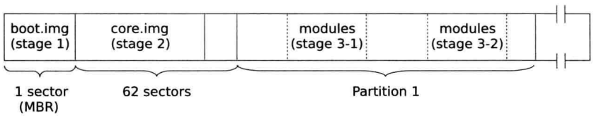

# From Power on to kernel boot

## 1st instruction after Power-up
PC 在 power on 或者 reset(assertion of the RESET# pin) 后，系统总线上的 CPU 会做处理器的硬件初始化，这包括：将所有寄存器复位成默认值，将 CPU 置于 real mode，invalidate 内部所有的 cache，比如 TLB 等；然后对于 SMP 系统来说，会执行硬件的 multiple processor (MP) initialization protocol 来选择一个 CPU 成为 BSP(bootstrap processor)，被选出的 BSP 则立刻从当前的 CS:EIP 中取指令执行。

Power-up 后，寄存器 CR0 的值为 0x60000010，意味着将 CPU 置于关闭 paging 的 real mode 状态.

其他的寄存器复位后的状态如下图示:

此处需提前介绍一下 X86 的 segment register，如下图：

每个 segment register 包含了一个 visual part 和一个 hidden part(有时也会叫做“descriptor cache” or  ”shadow register“)，当 segment selector 被加载进 visual part 时，处理器也会自动将相应 segment descripter 中的 Base Address, Limit, Accesstion Information 加载进 hidden part，这些 cache 在 segment register 中的信息，使得处理器做地址翻译时不必从 segment descriptor 中读取 base address 等信息，从而省去了不必要的 bus cycle。如果 segment descriptor table 发生了变化，处理器需要显式的重新加载 segment register，不然的话，地址翻译还是使用老的 segment descriptor 中的信息。也就是说，当使用 CS:EIP 的方式去寻址时(或者说在计算 linear address 时)，实际是使用 hidden part 中的 Base Address + EIP value。

上面已知 bootstrap processer 会从 CS：EIP 中取出第一条指令来执行，Power-up 后，CS.Base = FFFF0000H, EIP=0000FFF0H，所以第一条指令的地址 = FFFF0000H + 0000FFFFH = FFFFFFF0H，这超出了 real mode 最大 1M 的寻址空间，但 PC 复位后寄存器的值就是那样。PC 复位后第一次加载新的值进 CS 后，接下来的 linear address 的翻译方式就是我们知道的： selector value << 4 + EIP。

主板上的 chipset 会把第一条指令的地址 FFFFFFF0H 映射到包含 bios 的 rom 中，典型的第一条指令是：

    FFFFFFF0:    EA 5B E0 00 F0         jmp far ptr F000:E05B

这个跳转指令就会刷新 CS 的值，那么 CS.Base 的值就变成了 F0000H(F000H << 4)，接下来的寻址就是按照 real mode 的方式： CS selector << 4 + EIP。

BIOS 执行到最后是从已设置的启动设备中读取指令到内存，并跳转过去执行。我们以安装了 grub2 的硬盘启动为例说明。

## GRUB2

BIOS 将硬盘 MBR 中的内容加载到 0000:7C00 并跳转到这个地址继续执行。为什么将 boot sector(MBR) 加载到这个比 32kb 小 1024 byte 的地址？ 这里有[一篇科普](http://www.ruanyifeng.com/blog/2015/09/0x7c00.html)。

接下来我们分析 grub2 是如何执行并将 OS 加载到内存执行的。这里有一篇很好的材料讲述了 [GRUB2 的启动过程](https://www.slideshare.net/MikeWang45/grub2-booting-process)

grub2 的启动分为几个阶段：stage1，stage2，文件系统的剩余部分。stage1 是执行 MBR 中的代码，也就是我们常说的 boot sector； stage2 执行的代码存在 MBR 之后，第一个磁盘分区之前(以前这个 size 有 63 sector，今天普遍是 2048 个 sector)，由 boot sector 的代码加载到内存中执行，这里面包含了访问文件系统的驱动程序，可以从文件系统读取 stage2 的内容；stage2 包含读取文件系统上的 grub 的配置文件和其他模块等。所以，grub 的代码 image 被分为几个部分安装在硬盘中.

具体来说，grub2 的代码 image 分为 3 个部分： MBR 中的 boot.img，stage2 区域的 core.img，文件系统中的模块。安装在硬盘上的 grub2 的布局如下图：

core.img 又包含了多个 image 和模块，它的布局如下图：

boot.img 的功能是将 core.img 的第一个 sector 的内容(也即 diskboot.img)加载到内存执行，core.img 中剩余的部分由它的 diskboot.img 完成。

### MBR/boot.img

boot.img 对应的 grub2 的源码文件是 grub-core/boot/i386/pc/boot.S。这里有一篇对[boot.img的完整分析](https://www.funtoo.org/Boot_image)，只是代码比较老，但整体逻辑是一样的

文件开始部分定义了两个宏，可以略过不看

	.macro floppy
	xxx
	.endm
	.macro scratch
	xxx
	.endm

boot sector 开始的部分为了兼容 FAT/HPFS BIOS parameter block(BPB) 预留了空间，前 12 bytes(0xB) 由 .marco scratch 实现。BPB 是一个存储在 VBR(volumn boot record) 中用来描述磁盘或者分区的物理布局的数据结构。在[这篇介绍](https://en.wikipedia.org/wiki/BIOS_parameter_block)的表：Format of full DOS 7.1 Extended BIOS Parameter Block (79 bytes) for FAT32 中，可以看出，BPB 起始位置是 boot sector 的 offset 0xB 处，也即12 bytes，正好是 .macro scratch 定义的大小；整个 BPB 的长度是 0x52 + 0x8 = 0x5a，正好是 grub2 代码中宏 *GRUB_BOOT_MACHINE_BPB_END* 的值。

接下来是一堆参数定义，有些字段是需要在安装 grub 的时候被写入的

	LOCAL(kernel_address):
	.word	GRUB_BOOT_MACHINE_KERNEL_ADDR

	#ifndef HYBRID_BOOT
	.org GRUB_BOOT_MACHINE_KERNEL_SECTOR
	LOCAL(kernel_sector):
	.long	1
	LOCAL(kernel_sector_high):
	.long	0
	#endif

	.org GRUB_BOOT_MACHINE_BOOT_DRIVE
	boot_drive:
	.byte 0xff	/* the disk to load kernel from */
			/* 0xff means use the boot drive */

注意，在 grub 的上下文中，kernel 指的是 core.img。
*kernel_sector* & *kernel_sector_high* 记录 core.img 在磁盘上的第一个扇区号，用于记载它时使用;*kernel_address* 表示 core.img 第一个扇区被加载到内存中的地址，由宏 *GRUB_BOOT_MACHINE_KERNEL_ADDR*定义，
在 i386 PC 上，这个地址是 0x8000，代码如下：

	/* The address where the kernel is loaded.  */
	#define GRUB_BOOT_MACHINE_KERNEL_ADDR	(GRUB_BOOT_MACHINE_KERNEL_SEG << 4)

	#define GRUB_BOOT_MACHINE_KERNEL_SEG GRUB_OFFSETS_CONCAT (GRUB_BOOT_, GRUB_MACHINE, _KERNEL_SEG)

	#define GRUB_OFFSETS_CONCAT_(a,b,c) a ## b ## c
	#define GRUB_OFFSETS_CONCAT(a,b,c) GRUB_OFFSETS_CONCAT_(a,b,c)

	/* The segment where the kernel is loaded.  */
	#define GRUB_BOOT_I386_PC_KERNEL_SEG	0x800

单纯看代码肯定无法看出为什么这个宏定义为 0x8000。在编译完代码后，发现 grub-core/Makefile 会发现有这么一行:

	TARGET_CPPFLAGS =  -Wall -W  -DGRUB_MACHINE_PCBIOS=1 -DGRUB_MACHINE=I386_PC -m32 bluhbluh...

这样就明白了。

真正有用的代码开始于 lable: real_start。通过调用 INT 0x13 判断磁盘是否支持 LBA 访问模式，不然就使用传统的 CHS 模式。以 LBA 为例，继续调用 INT 0x13，从 core.img 的第一个 sector 的起始位置读入一个 block(size 是多少？) 到地址为 *GRUB_BOOT_MACHINE_BUFFER_SEG*(0x7000):0 的 buffer 中，关于这个 INT 0x13 调用的详细解释参考[这篇](http://www.ctyme.com/intr/rb-0708.htm)。然后调用函数 *copy_buffer*，从源地址 *GRUB_BOOT_MACHINE_BUFFER_SEG*:0 拷贝 512 bytes 到 0:*GRUB_BOOT_MACHINE_KERNEL_ADDR*，也即从 0x7000:0 拷贝到 0:0x8000，然后 jmp 到 *GRUB_BOOT_MACHINE_KERNEL_ADDR*。

MBR 中的 boot.img 的工作就完成了。

### diskboot.img

由 core.img 的图示可知，它的第一个 sector 的内容是 diskboot.img。diskboot.img 的工作是将 core.img 中剩余的部分继续加载到内存，并跳转过去执行。这个加载的动作本质上和 boot.S 一样，也是借助 BIOS 的 interrupt service。只不过 diskboot.img 需要加载多个 sector 而已。diskboot.img 需要知道 core.img 剩余部分所在的 sector，显然，这是安装 grub 的时候才会知道，grub 的安装程序将 core.img 占据的 sector 的信息写入 diskboot.img。

diskboot.img 对应的源代码文件是 grub-core/boot/i386/pc/diskboot.S。diskboot.img 执行前的环境，也即寄存器，由 boot.img 设置，此时的环境如下：

1. 有可用的堆栈(SS 和 SP 已配置)。
2. 寄存器 DL 中保存正确的引导驱动器。
3. 寄存器 SI 保存着 DAP(Disk Address Packet) 的地址，DAP 定义在 boot.S 中，由 .macro scratch 实现。
