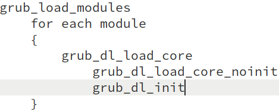

# From Power on to Linux kernel

出于对底层的极大兴趣，研究了这个 subject: 基于代码, 逐行分析基于 X86 的 Linux OS 的启动过程。本 memo 记录了这个过程的所有细节。

阅读这些内容需要熟悉包括单不限于 x86 CPU architecture, 汇编，编译，链接，以及各种硬件基础知识等。对于 X86 arch, 具体来说是 Intel® 64 and IA-32 Architectures Software Developer’s Manual, 该 manual 有约 10 volumes, 当引用该 manual 时，本文将用缩写 SDM 指代，如 SDM 1, SDM 2, SDM 3a, etc.

## 1st instruction after Power-up

PC 在 power on 或 reset(assertion of the RESET# pin) 后，系统总线上的 CPU 会做处理器的硬件初始化，这包括：将所有寄存器复位成默认值，将 CPU 置于 real mode, invalidate 所有 cache，如 TLB 等；对于 SMP 系统，还会执行硬件的 multiple processor (MP) initialization protocol 来选择一个 CPU 成为 bootstrap  processor(BSP)，被选出的 BSP 则立刻从当前的 CS:IP 中取指令执行。

Power-up 后，寄存器 CR0 的值为 0x60000010, Protection Enable(PE) bit 为 0, 意味着 CPU 处于 real mode.


其他寄存器复位后的状态如下图示:


此处需提前介绍一下 X86 的 segment register，如下图：


Segment register 包含 visual part 和 hidden part(有时也叫做 descriptor cache 或 shadow register)，当 segment selector 被加载进 visual part 时，CPU 自动将相应 segment descriptor 中的 Base Address, Limit, Accesstion Information 加载进 hidden part。这些 cache 在 segment register 中的信息，使得 CPU 做地址翻译时不必从 memory 中的 segment descriptor 读取 base address 等信息，从而节省不必要的 bus cycle。若 segment descriptor table 发生变化，CPU 需重新加载 segment register，否则，地址翻译仍使用旧的 segment descriptor 中的信息。

也就是说，当使用 CS:EIP 的方式寻址时(或者说在计算 linear address 时)，实际是使用 hidden part 中的 Base Address + EIP value。

由上文知， BSP 从 CS：IP 中取第一条指令执行。Power-up 后，CS.Base = FFFF0000H, EIP=0000FFF0H，所以第一条指令的地址 = FFFF0000H + 0000FFFFH = FFFFFFF0H，该地址映射到 [ROM](https://en.wikipedia.org/wiki/Read-only_memory)上的 system firmware(一般指 BIOS).

典型的第一条指令是：

    FFFFFFF0:    EA 5B E0 00 F0         jmp far ptr F000:E05B

跳转指令会刷新 CS, 所以 CS.Base 的值变为 F0000H(F000H << 4)。接下来的寻址就是 real mode 的方式： CS selector << 4 + IP.

System firmware 中第一条指令的实现可能在不同的芯片/平台上而不同，因为 BIOS 一般不开源，且近年来出现新的 firmware: EFI。笔者目前的知识还无法得出一个 general 的答案。基于上述典型第一条指令，可推理一种执行过程：第一条指令跳转到第 1M 地址范围内，以 [Intel ® 3 Series Express Chipset Family](https://www.intel.com/Assets/PDF/datasheet/316966.pdf) 为例，chipset 的 Programmable Attribute Map(PAM) 寄存器会控制 768 KB 到 1 MB 地址空间中的 13 个 sections 的访问属性，power-up 后这些寄存器默认值的行为是 DRAM Disabled: All accesses are directed to [DMI](https://en.wikipedia.org/wiki/Direct_Media_Interface)，猜测对上述地址范围的访问会被 route 到 4G 的最后 1M 空间内，也就是说执行的代码还是来自 ROM 中的 BIOS。后续 BIOS 是否做 memory shadowing(将自己 copy 到第 1M 空间的 DRAM) 都可，只是 access 的速度有差别。此外，猜测所谓的带外管理技术(如 Intel 的 Management Engine)，也可能提前将 BIOS copy 到第 1M 的 DRAM 空间中。

注: BIOS 运行在 real mode，只能看到第 1M 地址空间。

BIOS 的最后工作是从已设置的启动设备中加载第一个 sector 到 RAM，并跳转过去执行。本文将以 grub2 的硬盘启动为例分析。

参考： [An Introduction to the PC's BIOS](https://thestarman.pcministry.com/asm/bios/index.html)

## GRUB2 booting process

本节假设 PC 只有一块硬盘，基于代码分析 grub 的工作流程。

官方给了一堆[权威参考文档](https://www.gnu.org/software/grub/grub-documentation.html)，另外，[grub2-booting-process](https://www.slideshare.net/MikeWang45/grub2-booting-process) 也是不错的参考。

BIOS 的最后工作是将硬盘上的 Master Boot Record(MBR, 也叫 boot sector) 加载到地址 0000:7C00，并跳转过去执行。 0x7c00 = 31kb, 为什么将 MBR 加载到这个地址？[这篇](http://www.ruanyifeng.com/blog/2015/09/0x7c00.html)做出了解释。另外，使用 MBR 这个术语是为了和 Volume Boot Record(VBR) 区分，MBR 是整个硬盘的第一个 sector, 而 Volume boot record 是分区的第一个 sector.

显然，512 bytes 的 boot sector 装不下功能强大的 grub，所以 grub 使用的方案是将代码分成几个部分，用 grub 的术语讲，grub 的工作流程分为: stage 1, stage 1.5, stage 2.

* stage 1 是位于 MBR 的 boot.img，用于加载 stage 1.5 的 core.img. (boot.img 在某些场景下也可以安装在 VBR 中)
* stage 1.5 是位于 MBR 和第一个磁盘分区之间的 core.img，它包含了访问文件系统的驱动程序，可以从文件系统读取 stage 2 的内容；以前这块空间有 63 sectors, 今天普遍是 2048 sectors, 使用分区工具查看磁盘时，都会看到第一个分区从第 2048 sector 开始。
* stage 2 是位于 /boot/grub 目录下的所有文件，包括配置文件和模块等。

参考： [The bootstrap mechanism used in GRUB](https://www.gnu.org/software/grub/manual/legacy/grub.html#Bootstrap-tricks)

安装在硬盘上的 grub2 布局如下：


简化版长这样：


core.img 包含多个 image 和 module，其布局如下：


2年前分析的 grub 的版本是 2.02, 现在(2020/07)已是 2.04.

### boot.img/MBR/boot sector

boot.img 的工作仅是将 core.img 的第一个 sector(即 diskboot.img) 加载到 RAM, core.img 中剩余的部分由 diskboot.img 继续加载到 RAM. boot.img 对应的 source code 是 [grub-core/boot/i386/pc/boot.S](http://git.savannah.gnu.org/cgit/grub.git/tree/grub-core/boot/i386/pc/boot.S)

对于 boot.S 的完整分析可参考：

1. [Boot image](https://www.funtoo.org/Boot_image):基于较老的代码，但整体逻辑一样。
2. [boot.S & diskboot.S 分析](https://blog.csdn.net/conansonic/article/details/78482766):基于最新的代码(2018/4)

文件开头定义了两个宏:

```assembly
.macro floppy
	xxx
.endm

.macro scratch
	xxx
.endm
```
其中, `.macro scratch` 声明了一些描述磁盘地址的变量，叫做 disk address packet, 下面调用 BIOS INT 13h 时会填充。

Macro HYBRID_BOOT 用作生成 boot_hybrid.image，可兼容 BIOS 和 EFI 启动。本例仅关注 BIOS 启动。 ·

boot.img 的开头为 [BIOS Parameter Block (BPB)](https://en.wikipedia.org/wiki/BIOS_parameter_block) 数据结构预留了空间，这是 [Volume Boot Record(VBR)](https://en.wikipedia.org/wiki/Volume_boot_record) 使用的数据结构，用于描述 volume 的物理布局，Windows 的文件系统 FAT/HPFS/NTFS 会使用它。VBR/BPB 的概念由 IBM PC(搭载 Microsoft DOS 系统) 引入，是 DOS 时代使用的东西， Windows 的文件系统 FAT/HPFS/NTFS 会使用它，[All about BIOS parameter blocks](http://jdebp.eu/FGA/bios-parameter-block.html) 给了一些参考信息。所以，看来 grub 也会被安装到 VBR?

BPB 起始自 sector 第 12(0xB) byte, 前面空出 11 bytes. 由 [Format of full DOS 7.1 Extended BIOS Parameter Block](https://en.wikipedia.org/wiki/BIOS_parameter_block#DOS_7.1_EBPB) 可看出，BPB 结束地址 = 0x52 + 0x8 = 0x5A，正是 *GRUB_BOOT_MACHINE_BPB_END* 的值。但 GRUB_BOOT_MACHINE_BPB_START 为什么是 0x3? TBD.

```assembly
	.file	"boot.S"

	.text

	/* Tell GAS to generate 16-bit instructions so that this code works
	   in real mode. */

	/* Tell GAS to generate 16-bit instructions so that this code works
	   in real mode. */
	.code16

.globl _start, start;
_start:
start:
	/*
	 * _start is loaded at 0x7c00 and is jumped to with CS:IP 0:0x7c00
	 */

	/* Beginning of the sector is compatible with the FAT/HPFS BIOS
	 * parameter block. */

	jmp	LOCAL(after_BPB)
	nop	/* do I care about this ??? */

#ifdef HYBRID_BOOT
	...
#else
	/*
	 * This space is for the BIOS parameter block!!!!  Don't change
	 * the first jump, nor start the code anywhere but right after
	 * this area.
	 */

	.org GRUB_BOOT_MACHINE_BPB_START
	.org 4
#endif
#ifdef HYBRID_BOOT
	...
#else
	scratch
#endif

	.org GRUB_BOOT_MACHINE_BPB_END
	/* End of BIOS parameter block.	 */

/* grub 的上下文中，kernel 指 core.img. kernel_address 表示 core.img 第一个 sector(diskboot.img)
 * 加载到 RAM 中的地址，定义为 GRUB_BOOT_MACHINE_KERNEL_ADDR, 在 i386 PC 上，它的值是 0x8000，见下面解释。*/
LOCAL(kernel_address):
	.word	GRUB_BOOT_MACHINE_KERNEL_ADDR

/* kernel_sector & kernel_sector_high 记录 core.img 在磁盘上的起始 sector number, 即 
 * diskboot.img 所在 sector number. grub install 时被写入 */
#ifndef HYBRID_BOOT
	.org GRUB_BOOT_MACHINE_KERNEL_SECTOR
LOCAL(kernel_sector):
	.long	1
LOCAL(kernel_sector_high):
	.long	0
#endif
```
GRUB_BOOT_MACHINE_KERNEL_ADDR 的定义：
```c
/* The address where the kernel is loaded.  */
#define GRUB_BOOT_MACHINE_KERNEL_ADDR	(GRUB_BOOT_MACHINE_KERNEL_SEG << 4)

#define GRUB_BOOT_MACHINE_KERNEL_SEG    GRUB_OFFSETS_CONCAT (GRUB_BOOT_, GRUB_MACHINE, _KERNEL_SEG)

#define GRUB_OFFSETS_CONCAT(a,b,c)    GRUB_OFFSETS_CONCAT_(a,b,c)
#define GRUB_OFFSETS_CONCAT_(a,b,c)   a ## b ## c

/* The segment where the kernel is loaded.  */
#define GRUB_BOOT_I386_PC_KERNEL_SEG	0x800
```
同时，grub-core/Makefile 中有:
```makefile
TARGET_CPPFLAGS =  -Wall -W  -DGRUB_MACHINE_PCBIOS=1 -DGRUB_MACHINE=I386_PC -m32 bluhbluh...
```
所以， GRUB_BOOT_MACHINE_KERNEL_ADDR = 0x8000.

继续分析前，剧透一些背景知识: BIOS 跳转到 grub 时会设置 DL 寄存器，表示 **boot drive number**, 即从哪个驱动器(drive)读取 grub kernel image, 在使用 BIOS interrupt service 从 HDD 读取内容时会用到（待确认）。但 grub 可以改修改它的值。

Boot driver number 属于 BIOS 的知识范畴，因为 grub boot.img 将使用 BIOS 的磁盘读写中断服务从驱动器加载 core.img，所以 BIOS 对其有解释权，未找到权威介绍，这几篇可参考：

1. [list the BIOS drive index](https://stackoverflow.com/questions/45891044/any-way-to-list-the-bios-drive-numbers-in-real-mode)
2. [PC boot: dl register and drive number](https://stackoverflow.com/questions/11174399/pc-boot-dl-register-and-drive-number)
3. **[BIOS to MBR interface](https://en.wikipedia.org/wiki/Master_boot_record#BIOS_to_MBR_interface)**

>3: By convention, only fixed disks / removable drives are partitioned, therefore, the only DL value a MBR could see traditionally was 0x80.

简而言之，boot drive number 用一个 byte 表示，最高 bit 为 1 表示 若 boot drive 是 hard disk or removable device (包括 U盘，移动硬盘，光驱等), number range 是 0x80 - 0xfe; 最高 bit 为 0 表示 floppy, number range 是 0x00 - 0x7E. boot.img 使用 BIOS interrupt service 读取 diskboot.img 时需要确定从哪儿个驱动器读取。

```assembly
	.org GRUB_BOOT_MACHINE_BOOT_DRIVE
boot_drive:
	/* grub install 时，此 field 再次写入 0xff, 见 write_rootdev 函数。0xff 表示使用 BIOS 设置的
	 * DL 值。似乎隐含的信息：boot.img 和 core.img 可以安装在不同的 drive? */
	.byte 0xff	/* the disk to load kernel from */
			    /* 0xff means use the boot drive */

LOCAL(after_BPB):
/* MBR 真正的 code 始于此 */
/* general setup */
	cli		/* we're not safe here! */

	/*
	 * This is a workaround for buggy BIOSes which don't pass boot
	 * drive correctly. If GRUB is installed into a HDD, check if
	 * DL is masked correctly. If not, assume that the BIOS passed
	 * a bogus value and set DL to 0x80, since this is the only
	 * possible boot drive. If GRUB is installed into a floppy,
	 * this does nothing (only jump).
	 */
	/* 上面注释的关键信息：buggy BIOS 可能错误设置 DL 寄存器；grub 安装到 HDD 时, 0x80 是唯一有效
	 * boot driver number, 隐含的信息是：若系统有多个 hard drive, BIOS 始终将包含 boot loader
	 * 的 drive 置为 0x80.
	 * grub 安装在 HDD 时，jmp 指令被 overwrite 为 2 个 NOP 指令(详见 grub_util_bios_setup 函数)。
	 * 若 %dl 是 0x80 - 0x8f, 说明有效，使用它，否则强行赋值 dl 为 0x80.
	 */
    .org GRUB_BOOT_MACHINE_DRIVE_CHECK
boot_drive_check:
        jmp     3f	/* grub-setup may overwrite this jump */
        testb   $0x80, %dl  /* 若 dl 最高 bit ！= 1，则跳到 2，强赋值为 0x80 */
        jz      2f /* 若 dl 最高 bit = 1, 则进入 3 判断范围是否在 0x80-0x8f */
3:
	/* Ignore %dl different from 0-0x0f and 0x80-0x8f.  */
	testb   $0x70, %dl
	jz      1f /* grub 安装在 HDD 时，若 dl 范围在 0x80-0x8f, 说明是有效值，则不必修改，
				  进入真正代码 1f; 否则仍然强赋值为 0x80. */
2:
	movb    $0x80, %dl
1:
	/*
	 * ljmp to the next instruction because some bogus BIOSes
	 * jump to 07C0:0000 instead of 0000:7C00.
	 */
	/* 这也是 BIOS to MBR interface 中定义的内容 */
	ljmp	$0, $real_start

real_start:
	/* ... */

	/*  Check if we have a forced disk reference here	 */
	/* "forced disk reference" 是指 grub install 时 grub 修改的 boot_drive 值。若 grub 设置了
	 * boot_drive, 则使用它，否则使用 %dl. */
	movb   boot_drive, %al
	cmpb	$0xff, %al
	je	1f           /* boot_drive = 0xff 表示使用 BIOS 设置的 %dl*/
	movb	%al, %dl /* 否则，使用 boot_drive 的值 */
1:
	/* save drive reference first thing! */
	pushw	%dx
```
真正的代码始于 real_start：先使用 [INT 13/AH=41h/BX=55AAh](http://www.ctyme.com/intr/rb-0706.htm) 判断磁盘是否支持 LBA 访问，若不支持，则使用 CHS 模式。以 LBA 为例，再次调用 INT 13/AH=42h, 从 core.img 中读取第一个 sector(代码注释是："the blocks") 到地址 GRUB_BOOT_MACHINE_BUFFER_SEG(0x7000) : 0 的 buffer 中，然后函数 copy_buffer 拷贝 buffer 中的 512 bytes 到 0 : GRUB_BOOT_MACHINE_KERNEL_ADDR，即**从 0x7000 : 0 拷贝到 0 : 0x8000**，最后 absolute jmp 到 GRUB_BOOT_MACHINE_KERNEL_ADDR. That is what boot.img does.  将简略分析关键代码。

INT 0x13 的使用参考:

1. [wikipedia: INT 13H](https://en.wikipedia.org/wiki/INT_13H)
2. [INT 13/AH=42h](http://www.ctyme.com/intr/rb-0708.htm)。

[INT 13/AH=41h/BX=55AAh](http://www.ctyme.com/intr/rb-0706.htm) 检查是否支持 LBA：

>Int 13/AH=41h/BX=55AAh: Check Extensions Present

检查 **INT 13h Extensions** 功能是否存在，它支持更大的磁盘空间访问，更大的磁盘空间访问是通过支持 LBA 模式实现。所以代码注释直接道出了本质: check if LBA is supported

 [Int 13/AH=42h](http://www.ctyme.com/intr/rb-0708.htm) 加载 disk.img:

>INT 13h AH=42h: Extended Read Sectors From Drive

DS:SI 指向叫做 **disk address packet**(DAP) 的 memory，它是 INT 13h AH=42h 的入参，所以需初始化这段数据。INT 13h AH=42h 从 DAP 中取得必要的入参进行操作，所以这块内存也被叫做 packet interface.

boot.s 开头的代码定义了 DAP, 并放在BPB 的空间:

```assembly
.macro scratch
/* scratch space */
mode:
	.byte	0
disk_address_packet:
sectors:
	.long	0
heads:
	.long	0
cylinders:
	.word	0
sector_start:
	.byte	0
head_start:
	.byte	0
cylinder_start:
	.word	0
/* more space... */
.endm
```
可看出格式并不遵循 DAP 定义，应该是还有其他用处，待分析。DAP 前还有变量 mode，记录 INT 13/AH=41h/BX=55AAh 的结果，即磁盘是否支持 LBA(1：支持，0：不支持), 后面的代码直接检查这个变量即可知道是否支持 LBA mode，不必再使用 INT 13h.

初始化 [DAP](https://en.wikipedia.org/wiki/INT_13H#INT_13h_AH=42h:_Extended_Read_Sectors_From_Drive):
```assembly
LOCAL(lba_mode):
	xorw	%ax, %ax
	movw	%ax, 4(%si)

	incw	%ax
	/* set the mode to non-zero */
	movb	%al, -1(%si)

	/* the blocks */
	movw	%ax, 2(%si)

	/* the size and the reserved byte */
	movw	$0x0010, (%si)

	/* the absolute address */
	movl	LOCAL(kernel_sector), %ebx
	movl	%ebx, 8(%si)
	movl	LOCAL(kernel_sector_high), %ebx
	movl	%ebx, 12(%si)

	/* the segment of buffer address */
	movw	$GRUB_BOOT_MACHINE_BUFFER_SEG, 6(%si)
```

### diskboot.img

由 core.img 的图示可知，其第一个 sector 的内容是 diskboot.img, 对应 grub-core/boot/i386/pc/diskboot.S. diskboot.img 的执行环境，也即寄存器，由 boot.img 设置，此时的环境如下：

1. 有可用的 stack(SS 和 SP 已配置)。
2. 寄存器 DL 是正确的 boot drive。
3. 寄存器 SI 是 DAP(Disk Address Packet) 的地址(还需要使用 INT 13/AH=42h 来继续读取磁盘 sector)。

diskboot.img 的工作是加载 core.img 中剩余的部分到 RAM, 并跳过去执行。其代码实现本质上和 boot.img 一样，都是借助 BIOS 的 interrupt service 读取 HDD 的内容到 RAM, 只不过 diskboot.img 需要 load 多个 sectors 而已。

diskboot.img 需要知道 core.img 剩余部分的 sector address & size 才能去读，显然，address 在 grub-install 时才能确定；而 core.img 的 size 在 grub-mkimage(生成 core.img) 时才能确定. core.img 的 address & size 定义在 diskboot.S 末尾：

```
	.org 0x200 - GRUB_BOOT_MACHINE_LIST_SIZE
LOCAL(firstlist):	/* this label has to be before the first list entry!!! */
				 	/* fill the first data listing with the default */
blocklist_default_start:
	/* this is the sector start parameter, in logical sectors from
	   the start of the disk, sector 0 */
	/* core.img 的剩余部分从 2nd sector 开始，因为 sector 0 是 boot.img,
	 * sector 1 是 diskboot.img. 又因为 x86 是 little-endian, 所以定义如此。
	 * 通过 objdump 确认, .long 是 4 bytes, 即使是 .code16.*/
	.long 2, 0

blocklist_default_len:
	/* this is the number of sectors to read.  grub-mkimage
	   will fill this up */
	.word 0

blocklist_default_seg:
/* this is the segment of the starting address to load the data into */
/* 由 boot.img 的分析可知，GRUB_BOOT_MACHINE_KERNEL_SEG = 0x800. 因 diskboot.img 在 RAM
 * 0x8000 处，size 是 512 bytes, 将 core.img 剩余部分紧挨着 diskboot.img 加载，所以是 0x8200. */
	.word (GRUB_BOOT_MACHINE_KERNEL_SEG + 0x20)
```

对应 grub 中的 C struture：

	struct grub_pc_bios_boot_blocklist
	{
	  grub_uint64_t start;
	  grub_uint16_t len;
	  grub_uint16_t segment;
	} GRUB_PACKED;

为什么这段空间被标以 label: **firstlist**? blocklist 结构描述一块磁盘区域和其加载地址，某些情况下，core.img 可能被分成几部分安装在磁盘，这时便需要多个 blocklist, 比如，比如, MBR 到第一个 partition 之间的空间不够放下 core.img, 再比如，On GPT, there is no guaranteed unused space before the first partition. 若存在多个 blocklist，他们将紧挨着 firstlist 存放, 且向 diskboot.img 头部延伸。

代码分析：

```
	/* this sets up for the first run through "bootloop" */
	/* 将 firstlist 地址保存到寄存器 di.   $ label 的形式表示取 label 的地址。 */
	movw	$LOCAL(firstlist), %di

	/* save the sector number of the second sector in %ebp */
	/* firstlist 的第一个 field, 表示起始 sector 号，保存到 ebp. */
	movl	(%di), %ebp

    /* this is the loop for reading the rest of the kernel in */
    /* 因为每次读取的 sector 数有限制，所以需要循环读取 */
LOCAL(bootloop):

	/* check the number of sectors to read */
	/* firstlist + 8 处的值表示待读取的 sector 数；每次读 HDD 后，将减去已读 sector 数。*/
	cmpw	$0, 8(%di)

	/* if zero, go to the start function */
	/* 若待读取 sector 数是 0，说明已经读取完，跳转 bootit 启动；否则继续读 HDD.  */
	je	LOCAL(bootit)

LOCAL(setup_sectors):
	/* check if we use LBA or CHS */
	/* 读 HDD 前，判断使用哪儿种方式：LBA or CHS.  si 寄存器是 DAP 地址，-1(%si) 表示
	 * 变量 mode, boot.S 的分析中已介绍。以 LBA 为例分析. */
	cmpb	$0, -1(%si)

	/* use CHS if zero, LBA otherwise */
	je	LOCAL(chs_mode)

	/* load logical sector start */
	/* 将 HDD 起始地址(sector No. in LBA mode)放入寄存器 ebx 和 ecx， INT 13/AH=42h 要用 */
	movl	(%di), %ebx
	movl	4(%di), %ecx

	/* the maximum is limited to 0x7f because of Phoenix EDD */
	/* Phoenix EDD 的介绍参考 https://en.wikipedia.org/wiki/INT_13H:
	 * 	To support even larger addressing modes, an interface known as
	 * 	INT 13h Extensions was introduced by Western Digital and Phoenix
	 * 	Technologies as part of BIOS Enhanced Disk Drive Services (EDD).
	 */
	xorl	%eax, %eax
	movb	$0x7f, %al

	/* how many do we really want to read? */
	/* 将读取的 sector 数，和待读取的 sector 总数比较，即从 8(%di) 处减去要读取的数 */
	cmpw	%ax, 8(%di)	/* compare against total number of sectors */

	/* which is greater? */
	/* 若 cmp 结果不为 0，说明要读取 0x7f 个 sector，则跳到 1f */
	jg	1f

	/* if less than, set to total */
	/* 若 cmp 结果 <= 0，说明待读取的数目小于 0x7f，读取该数目即可 */
	movw	8(%di), %ax

1:
	/* subtract from total */
	subw	%ax, 8(%di)

	/* add into logical sector start */
	/* 读取 sector 后，下次待读取的地址要更新，新地址 = 老地址 + 上次读取的 sector 数 */
	addl	%eax, (%di)
	adcl	$0, 4(%di)

	/* set up disk address packet */
	/* 通过 blocklist 设置 DAP, 因为 DAP 是 INT 13/ah=42h 的入参。*/

	/* the size and the reserved byte */
	/* si 寄存器是 DAP 的地址。初始化 DAP，跟 boot.S 中一样，前两个字节是 0x10, 0，
	 * 因为 x86 是 little-endian, 所以是 0x0010. */
	movw	$0x0010, (%si)

	/* the number of sectors */
	movw	%ax, 2(%si)

	/* the absolute address */
	/* 填入 sector 读取地址，已经在上面代码初始化过 */
	movl	%ebx, 8(%si)
	movl	%ecx, 12(%si)

	/* the segment of buffer address */
	/* 使用和 boot.S 中一样的 buffer */
	movw	$GRUB_BOOT_MACHINE_BUFFER_SEG, 6(%si)

	/* save %ax from destruction! */
	pushw	%ax

	/* the offset of buffer address */
	/* 还是使用和 boot.S 中一样的 buffer segment 的 offset 0 */
	movw	$0, 4(%si)

	/* BIOS call "INT 0x13 Function 0x42" to read sectors from disk into memory */
	movb	$0x42, %ah
	int	$0x13

	jc	LOCAL(read_error)

	/* 读取 HDD 到 memory 后，立刻调用 copy_buffer, 把 buffer 内容 cp 到它应该在的位置 */
	movw	$GRUB_BOOT_MACHINE_BUFFER_SEG, %bx
	jmp	LOCAL(copy_buffer)
```

略过 chs_mode 的代码，来到 copy_buffer:
```
LOCAL(copy_buffer):
/* 将刚刚读到 buffer 中的数据 cp 到目的地址 */
	/* load addresses for copy from disk buffer to destination */
	/* blokdlist 10(%di) 处保存着 buffer 数据被 cp 到目的段的段基址： GRUB_BOOT_MACHINE_KERNEL_SEG
	 * + 0x20，即 0x820。这里的策略是：每次 cp 使用的目的地址是 10(%di): 0，即每次
	 * offset 都是 0，那么每次 cp 后只更新段基址 10(%di) 即可形成下次 cp 的物理(线性)地址 */
	movw	10(%di), %es	/* load destination segment */

	/* restore %ax */
	/* ax 中保存着刚刚 INT 13/ah=42h 的返回值：读取的 sector 数 */
	popw	%ax

	/* determine the next possible destination address (presuming 512 byte sectors!) */
	/* 为啥表示 sector 数的 %ax 左移 5 bit？每次从 buffer 中 cp %ax 个 sector 内容
	 * 到目的地址 10(%di):0，所以每次 cp 后，目的地址 = 目的地址 + %ax * 512，即 %ax
	 * 需要左移 9 bit。因为使用的策略是仅更新段基址，所以左移 5 bit 后的值加到 10(%di)
	 * 处的段基址上，又因为 logical address 转换 linear address 时，段基址还要左移
	 * 4 bit，所以其实一共左移 9 bit，也就达到了 %ax * 512(2^9) 的目的。 */
	shlw	$5, %ax		/* shift %ax five bits to the left */
	addw	%ax, 10(%di)	/* add the corrected value to the destination
						       address for next time */

	/* save addressing regs */
	pusha
	pushw	%ds

	/* get the copy length */
	/* 上面左移了 5 bit，这里又左移了 3 bit，共 8 bit，也即 %ax = %ax * 2^8 =
	 * %ax * 256。因为一个 sector 是 512 byte，且下面使用 movsw 指令执行 cp，每次 mov
	 * 一个 word(2 bytes)，所以 cp 一个 sector 需循环 512 / 2 = 256(2^8) 次。
	 * 所以，一共移动 %ax << 8 次即可 */
	shlw	$3, %ax
	movw	%ax, %cx

	/* 将 DS：SI cp 到 ES:DI */
	xorw	%di, %di	/* zero offset of destination addresses */
	xorw	%si, %si	/* zero offset of source addresses */
	movw	%bx, %ds	/* restore the source segment */

	cld		/* sets the copy direction to forward */

	/* perform copy */
	rep		/* sets a repeat */
	movsw		/* this runs the actual copy */

	/* restore addressing regs and print a dot with correct DS
	   (MSG modifies SI, which is saved, and unused AX and BX) */
	popw	%ds
	MSG(notification_step)
	popa

	/* check if finished with this dataset */
	/* cp 完成后，检查还有没有待读取的 sector，有的话继续这个循环，跳回 setup_sectors */
	cmpw	$0, 8(%di)
	jne	LOCAL(setup_sectors)

	/* update position to load from */
	/* 当前 blocklist 已读完，检查是否还有 blocklist 需要读取。若有多个 blocklist，上文已经分析，
	 × 它将紧挨 diskboot.S 文件底部的 firstlist，所以减去 12 即可 */
	subw	$GRUB_BOOT_MACHINE_LIST_SIZE, %di

	/* jump to bootloop */
	/* 这再请在回到前文品味 bootloop 的注释 */
	jmp	LOCAL(bootloop)

/* END OF MAIN LOOP */
```

正常情况下，只有一个 blocklist 结构。core.img 剩余部分读完后，通过下面的代码跳转到地址 0:0x8200，即 core.img 的所有 components 紧挨一起。

```assembly
LOCAL(bootit):
	/* print a newline */
	MSG(notification_done)
	popw	%dx	/* this makes sure %dl is our "boot" drive */
	ljmp	$0, $(GRUB_BOOT_MACHINE_KERNEL_ADDR + 0x200)
```

跳转后的代码是 lzma_decompress.img 的内容。

### lzma_decompress.img

lzma_decompress.img 对应源码 grub-core/boot/i386/pc/startup_raw.S，它 include 同目录下的  "lzma_decode.S"，这是 lzma 的算法核心。lzma_decompress.img 的工作是解压缩自己后面的压缩内容并跳过去，由 core.img 的图示可知，后面 kernel.img，由名字可知，这是 grub 的核心内容，它对应代码 grub-core/kern.

某种意义上说，kernel.img 才是 grub 真正的开始。对于 lzma_decompress.img 代码的详细分析参考[此文](https://blog.csdn.net/conansonic/article/details/78534950)。本节仅简单分析。

startup_raw.S 开头是 long jmp 指令：

```assembly
ljmp $0, $ABS(LOCAL (codestart))
```
跳过开头部分的 special data area 来到 lzma_dcomress.img 的真正代码处.  **GRUB_DECOMPRESSOR_MACHINE_COMPRESSED_SIZE** & **GRUB_DECOMPRESSOR_MACHINE_UNCOMPRESSED_SIZE**, 顾名思义，由 grub-mkimage 生成 core.img 时填写。

```
/* the real mode code continues... */
LOCAL (codestart):
	cli		/* we're not safe here! */

	/* set up %ds, %ss, and %es */
	/* diskboot.S 最后的跳转指令中的 CS 为 0. 将 DS，SS，ES 也置 0 */
	xorw	%ax, %ax
	movw	%ax, %ds
	movw	%ax, %ss
	movw	%ax, %es

	/* set up the real mode/BIOS stack */
	/* boot.img 和 diskboot.img 中都使用 GRUB_BOOT_MACHINE_STACK_SEG(0x2000)
	 * 作为 sp, why (0x2000 - 0x10) here? */
	movl	$GRUB_MEMORY_MACHINE_REAL_STACK, %ebp
	movl	%ebp, %esp

	sti		/* we're safe again */
	...

	/* transition to protected mode */
	/* 解压缩需使用超过 1M memory, 所以切换到 protect mode. 经 objdump -d 可看出：calll
	 * 使用 prefix 66H, operand overwrite, 生成 4 bytes long 跳转地址。
	 * calll 将下一条指令地址 push 到 stack, 下一条指令是 32-bit code. 因为 real mode 与
	 * protect mode 使用不同的 stack, 而下一条指令地址是保存在 real mode stack, 所以
	 * 跳转到 protect mode 后，将该地址辗转保存到 protect mode stack, 以便 ret 时返回到
	 * 正确地址。此外 real mode 使用的 BIOS 提供的 Interrupt Vector Table(IVT), 切到
	 * protect mode 时也需保存其地址，以便未来切回 real mode. */
	calll	real_to_prot

	/* mode switch 的分析略过。只需知道返回到这里时已是 protect mode. */

	/* The ".code32" directive takes GAS out of 16-bit mode. */
	.code32

	cld
	/* a20: address line 20. 参考 https://wiki.osdev.org/A20_Line. 此处不做分析，后面分析
	 * linux kernel 时有详细分析。*/
	call	grub_gate_a20

	/* 由代码可知，lzma_decompress.img 后面的内容不仅被压缩，而且*可能*使用 Reed
	 * solomon code 做内容纠错(grub-bios-setup's option: --no-rs-codes)。这里先纠错，
	 * 再解压。 参考：
	 * https://www.cs.cmu.edu/~guyb/realworld/reedsolomon/reed_solomon_codes.html
	 *
	 * 编译使用了 mregparm = 3，表示使用寄存器(以顺序) EAX, EDX, ECX 来传递 C 函数的入参。
	 */
	movl	LOCAL(compressed_size), %edx
#ifdef __APPLE__
	...
#else
	addl    $(LOCAL(decompressor_end) - LOCAL(reed_solomon_part)), %edx
#endif
	movl    reed_solomon_redundancy, %ecx
	leal    LOCAL(reed_solomon_part), %eax
	cld
	call    EXT_C (grub_reed_solomon_recover)
	jmp	post_reed_solomon
```

将紧挨着 lzma_decompress.img 的数据(开始于 decompressor_end)解压到 buffer GRUB_MEMORY_MACHINE_DECOMPRESSION_ADDR(0x100000) 处，并跳转过去执行：
```
post_reed_solomon:

#ifdef ENABLE_LZMA
	movl	$GRUB_MEMORY_MACHINE_DECOMPRESSION_ADDR, %edi /* edi：解压目的地址 */
	movl	$LOCAL(decompressor_end), %esi /* esi：待解压数据起始地址 */
#endif

	pushl	%edi
	movl	LOCAL (uncompressed_size), %ecx   /* ecx: 解压后的 size */
	leal	(%edi, %ecx), %ebx /* ebx: 压缩数据尾部的地址 = 起始地址 + size */
/* Don't remove this push: it's an argument.  */
	push 	%ecx
	call	_LzmaDecodeA
	pop	%ecx
	/* _LzmaDecodeA clears DF, so no need to run cld */
	popl	%esi /* esi 是刚 push 的 %edi: 解压 buffer address */
#endif

	/* 给后面的代码使用，见后面分析。boot_dev 位于 GRUB_DECOMPRESSOR_I386_PC_BOOT_DEVICE
	 * 处，它仅用于 lnxboot.img 中，本文场景不涉及。*/
	movl	LOCAL(boot_dev), %edx
	movl	$prot_to_real, %edi
	movl	$real_to_prot, %ecx
	movl	$LOCAL(realidt), %eax

	/* 又是 absolute jump. Refer: 9.15.7 of `info as`: AT&T absolute
	 * (as opposed to PC relative) jump/call operands are prefixed by '*' .
	 * 跳到解压数据起始地址。*/
	jmp	*%esi
```

### kernel.img

构建 kernel.img 的 Makefile 内容，在 grub-core/Makefile.core.am:

	# 为适配排版，格式有微调
	if COND_i386_pc
	platform_PROGRAMS += kernel.exec
	kernel_exec_SOURCES  = kern/i386/pc/startup.S
	kernel_exec_SOURCES += kern/i386/pc/init.c kern/i386/pc/mmap.c term/i386/pc/console.c
	               kern/i386/dl.c kern/i386/tsc.c kern/i386/tsc_pit.c kern/compiler-rt.c
	               kern/mm.c kern/time.c kern/generic/millisleep.c kern/command.c
	               kern/corecmd.c kern/device.c kern/disk.c kern/dl.c kern/env.c
	               kern/err.c kern/file.c kern/fs.c kern/list.c kern/main.c kern/misc.c
	               kern/parser.c kern/partition.c kern/rescue_parser.c kern/rescue_reader.c
	               kern/term.c
	...
	kernel_exec_LDFLAGS  = $(AM_LDFLAGS) $(LDFLAGS_KERNEL) $(TARGET_IMG_LDFLAGS)
	                       $(TARGET_IMG_BASE_LDOPT),0x9000
	...

可看出：kernel.img 的入口是 startup.S，起始地址为 0x9000，因 kernel.img 运行在保护模式下，所以文件开头有 directive `.code32`。

> Tip: kernel.img 前，real mode 的 CS 都是 0; 切到 protect mode 后，CS segment descriptor's base address 也是 0. 

```
.code32

/* memory reference 参考： 9.14.7 Memory References of `info as`.
 * 由 startup_raw.S 跳转前的几行代码可知：此时 esi 的值是 0x100000(1M), edi, ecx 分别
 * 保存函数 prot_to_real 和 real_to_prot 的地址，eax 保存变量 realidt 的地址。将他们存到
 * kernel.img 内部变量 */
movl	%ecx, (LOCAL(real_to_prot_addr) - _start) (%esi)
movl	%edi, (LOCAL(prot_to_real_addr) - _start) (%esi)
movl	%eax, (EXT_C(grub_realidt) - _start) (%esi)
```
kernel.img 首先把自己 copy 到链接地址 0x9000 :

```
	/* copy back the decompressed part (except the modules) */
	/* 二者相减得到 kernel.img 的 size，放在 ecx, movsb 指令会用到 */
	movl	$(_edata - _start), %ecx

	/* _start 位于 kernel.img 的开头，所以它的地址是 0x9000，这是 copy 的目的地址 */
	movl	$(_start), %edi
	rep
	movsb

	/* 窍门：符号 cont 的值(地址)基于 kernel.img 的链接起始地址 0x9000.  movsb 已
	 * 把 kernel.img copy 回它的链接地址，这里通过absolute jump，跳回符号 cont 的地址
	 * 继续执行，i.e., absolute jump 后执行的代码取自 0x9000 的 kernel.img，不是
	 * buffer 0x100000 中的 kernel.img */
	movl	$LOCAL (cont), %esi
	jmp	*%esi
LOCAL(cont):
```

上面有个不常见的符号: _edata, 参考 `man etext/edata/end/`. ld 的 default linker script 中定义了这几个符号。使用 `ld --verbose` 查看 ld's default linker script.

```assembly
LOCAL(cont):
...

	/* clean out the bss */
	/* BSS_START_SYMBOL, END_SYMBOL 通过 configure script 定义在 Makefile, 其值与当前系统匹配。
	 * 本场景下，他们是 __bss_start, & end, 都在 ld‘s default linker script 中定义。*/
	movl	$BSS_START_SYMBOL, %edi

	/* compute the bss length */
	movl	$END_SYMBOL, %ecx

	/* 相减得到 size 放在 ecx */
	subl	%edi, %ecx

	/* clean out */
	xorl	%eax, %eax
	cld /* index 递增 */
	rep
	stosb /* store eax to ES:EDI，每次 1 byte，重复 ecx 次 */

	/* lnxboot.img 专用。放入 kernel.img 内部变量中 */
	movl	%edx, EXT_C(grub_boot_device)

	/*
	 *  Call the start of main body of C code.
	 */
	call EXT_C(grub_main)
```

**grum_main** 函数是 grub 的核心内容。分析至此，可先去看 **Install GRUB** 一节，再来看 kernel.img 的流程，因为上面分析的 image 中某些变量在 install 时被写入。

#### kernel.img/grub_main

由函数定义

	void __attribute__ ((noreturn)) grub_main (void)

可知，它不会返回。这时 CPU 在 protect mode, **未开启 paging**, kernel image 被 copy 到链接地址，但 modules 还在 buffer 中. 依然捡重点代码分析：

```c
void __attribute__ ((noreturn)) grub_main (void)
{
	/* First of all, initialize the machine.  */grub_mm_base
	/* Get modules' buffer address into 'grub_modbase'; Initialize console; most important:
	 * memory management initialization. Details at below. */
	grub_machine_init ();
	...
	/* Initialize corresponding data if there is  OBJ_TYPE_CONFIG object in module info data. */
	grub_load_config ();
	...

	/* grub adopt the mechanism of module, which is PIC(Position Independent Code). Modules
	 * use the symbol from kernel image, so when module is used, relocation must be done first.
	 * Export the kernel image symbols that modules will use, for future relocation. symbols
	 * All exported are saved via grub_symtab. */
	grub_register_exported_symbols();
	...

	/* Load modules in buffer to specific address, and link them with kernel image & each other,
	 * make them available. Details at below. */
	grub_load_modules ();

	...
	/* Reclaim space used for modules. */
	 * make the buffer space for modules available for grub memory management. */
	reclaim_module_space ();
	...

	/* The core commands provides by kernel.img itself. There are still other commands
	 * provided by modules. */
	grub_register_core_commands ();

	...
	/* 加载 grub 目录中的 normal 模块，其加载过程和函数 grub_load_modules 中一样。加载
	 * 后则执行 normal 命令。normal 模块会加载 linux kernel, initramfs */
	grub_load_normal_mode ();
}
```

grub_machine_init 最重要的工作是初始化 grub 内存管理系统：
```c
void grub_machine_init (void)
{
	/* workaround for VIA chipset, skip. */
	grub_via_workaround_init ();

	/* 解压 buffer 位于地址 1M(0x100000)处，压缩数据前端是 kernel.img, 后面是 modules.
	 * bss section 不占据文件空间，所以 _edata - _start = kernel.img file size. */
	grub_modbase = GRUB_MEMORY_MACHINE_DECOMPRESSION_ADDR + (_edata - _start);
	...

	/* 通过 e820 中断获得 memory 信息(addr, len, type), 交给函数 mmap_iterate_hook 处理，
	 * 过滤掉地址小于 1M 且大于 4G 的，将类型是 GRUB_MEMORY_AVAILABLE 的 region 保存
	 * 到数组 mem_regions[] 中 */
	grub_machine_mmap_iterate (mmap_iterate_hook, NULL);
	/* Sort mem_regions[]: 按地址从小到大排序，若相邻 region 重叠，merge. */
	compact_mem_regions ();

	/* grub memory management initialization.
	 * 遍历 mem_regions[], 过滤掉 buffer 中 [1M - module end] 的 range, 交给
	 * grub_mm_init_region 初始化。有两级数据结构来管理：grub_mm_region_t &
	 * grub_mm_header_t. 初始化后，malloc 操作都是在操作 grub_mm_base 数据结构。*/
	modend = grub_modules_get_end ();
	for (i = 0; i < num_regions; i++)
	{
		grub_addr_t beg = mem_regions[i].addr;
		grub_addr_t fin = mem_regions[i].addr + mem_regions[i].size;
		if (modend && beg < modend)
			beg = modend;
	    if (beg >= fin)
			continue;

	  	grub_mm_init_region ((void *) beg, fin - beg);
	}
}
```

grub_load_modules 核心工作是遍历 buffer 中类型为 OBJ_TYPE_ELF 的 object, 即 module, 将其代码和数据加载到分配的内存中，并进行重定位，然后执行 module 的初始化函数。函数 call chain 如下：



重点函数 grub_dl_load_core_noinit:

```c
/* 入参 addr 是 module 在 buffer 中的地址 */
grub_dl_t grub_dl_load_core_noinit (void *addr, grub_size_t size)
{
	Elf_Ehdr *e;  /* module 是 ELF 格式 */
	grub_dl_t mod;/* 描述 module 的数据结构 */
	...
	/* ELF header 的常规检查。很常规，略。 */
	grub_dl_check_header(e, size);
	...

	/* Dynamic relocation. Background knowledge at `man elf`.
	 * grub_dl_check_license & grub_dl_resolve_name are easy enough to skip analysis;
	 * grub_dl_resolve_dependencies is simple too, discover the module dependency relation
	 * by searching ".moddeps" section, if there is such section, parse to find module name,
	 * load module from file system to memory, and relocate;
	 * the rest 3 functions focus on relocation. */
	if (grub_dl_check_license (e)
		|| grub_dl_resolve_name (mod, e)
		|| grub_dl_resolve_dependencies (mod, e)
		|| grub_dl_load_segments (mod, e)
		|| grub_dl_resolve_symbols (mod, e)
		|| grub_dl_relocate_symbols (mod, e))
	{
		mod->fini = 0;
		grub_dl_unload (mod);
		return 0;
	}
	...
}

/* 将所有包含代码和数据的 section 从 buffer 加载到分配的内存 */
static grub_err_t grub_dl_load_segments (grub_dl_t mod, const Elf_Ehdr *e)
{
	...
	/* 遍历 sections 获得 total size & total align. total align 是所有 section alignment
	 * 中最大的那个; total size 是将各 section size 对其到 alignment 后的 sum. */
	for (i = 0, s = (const Elf_Shdr *)((const char *) e + e->e_shoff);
		 i < e->e_shnum;
		 i++, s = (const Elf_Shdr *)((const char *) s + e->e_shentsize))
	{
		tsize = ALIGN_UP (tsize, s->sh_addralign) + s->sh_size;
		if (talign < s->sh_addralign)
			talign = s->sh_addralign;
	}

	/* 按 total size 和 total align 分配内存 */
	mod->base = grub_memalign (talign, tsize);
	mod->sz = tsize;
	ptr = mod->base;

	/* 再次遍历 module‘s sections */
	for (i = 0, s = (Elf_Shdr *)((char *) e + e->e_shoff);
		 i < e->e_shnum;
		 i++, s = (Elf_Shdr *)((char *) s + e->e_shentsize))
	{
		/* SHF_ALLOC means this section occupies memory during process execution. */
		if (s->sh_flags & SHF_ALLOC)
		{
			grub_dl_segment_t seg; /* 描述 loaded sections 的数据结构 */

			seg = (grub_dl_segment_t) grub_malloc (sizeof (*seg));
			if (! seg)
				return grub_errno;

			if (s->sh_size)
			{
				void *addr;
				/* section 加载地址按 section alignment 对齐 */
				ptr = (char *) ALIGN_UP ((grub_addr_t) ptr, s->sh_addralign);
				addr = ptr;
				ptr += s->sh_size;

				switch (s->sh_type)
				{
					/* copy modules's section from buffer to destination. */
					case SHT_PROGBITS:
					grub_memcpy (addr, (char *) e + s->sh_offset, s->sh_size);
					break;

					case SHT_NOBITS:
					grub_memset (addr, 0, s->sh_size);
					break;
				}

				seg->addr = addr;
			}
			else
				seg->addr = 0;

			seg->size = s->sh_size;
			seg->section = i;
			seg->next = mod->segment;
			mod->segment = seg;
		}
	}
}

/* Parse module's symbol table in buffer, update symbol table in place.
 * Prepare for linking. Modules is object file without linking in essence. */
static grub_err_t grub_dl_resolve_symbols (grub_dl_t mod, Elf_Ehdr *e)
{
	unsigned i;
	Elf_Shdr *s;
	Elf_Sym *sym;
	const char *str;
	Elf_Word size, entsize;

	/* 在 buffer 的 module 中遍历 sections 找到 symbol table. */
	for (i = 0, s = (Elf_Shdr *) ((char *) e + e->e_shoff);
	     i < e->e_shnum;
	 	 i++, s = (Elf_Shdr *) ((char *) s + e->e_shentsize))
		if (s->sh_type == SHT_SYMTAB)
			break;

	/* record the address & section size of symbol table inf buffer.  */
	mod->symtab = (Elf_Sym *) ((char *) e + s->sh_offset);
	mod->symsize = s->sh_entsize;
	sym = mod->symtab;
	size = s->sh_size;
	entsize = s->sh_entsize;
	...
	/* sh_link 在 man elf 未详细解释，参考：
	* https://docs.oracle.com/cd/E19683-01/816-1386/6m7qcoblj/index.html#chapter6-47976
	* For symbol table section, sh_link 是其对应 string table section 的 index. */
	s = (Elf_Shdr *) ((char *) e + e->e_shoff + e->e_shentsize * s->sh_link);
	str = (char *) e + s->sh_offset; /* 拿到 string table 的地址 */

	/* 遍历 & 解析 modules's symbol table's entry */
	for (i = 0;
	     i < size / entsize;
	     i++, sym = (Elf_Sym *) ((char *) sym + entsize))
	{
		switch (type)
		{
			case STT_NOTYPE:
			case STT_OBJECT:
			/* Resolve a global symbol. */
			/* https://docs.oracle.com/cd/E19683-01/816-1386/6m7qcoblh/index.html,
			 * table 7-11. 若符号有名字，且 st_shndx 是 SHN_UNDEF(0), 说明该 symbol 定义在
			 * kernel.img. STT_OBJECT is variable, and STT_NOTYPE generally is function,
			 * which are defined outside the module. */
			if (sym->st_name != 0 && sym->st_shndx == 0)
			{
				/* 在 kernel image exported symbol 中查找该 symbol, 若没有，则无法 relocate, fail. */
				grub_symbol_t nsym = grub_dl_resolve_symbol (name);
				if (! nsym)
					return grub_error (GRUB_ERR_BAD_MODULE,
					   N_("symbol `%s' not found"), name);

				/* 找到则把符号地址赋给 st_value, 这是 Linking; 并更新 symbol entry 的 st_info field */
				sym->st_value = (Elf_Addr) nsym->addr;
				if (nsym->isfunc)
					sym->st_info = ELF_ST_INFO (bind, STT_FUNC);
			}
			else
			{
				/* symbol 在本 module 中定义。 */
				/* symbol table entry 的 st_value 定义参考：
				 * https://docs.oracle.com/cd/E19683-01/816-1386/6m7qcoblj/index.html#chapter6-35166
				 * 本例中，st_value 是 symbol 在 section 中的 offset, 加上 section 的 *loaded address*,
				 * 构成 st_value */
				sym->st_value += (Elf_Addr) grub_dl_get_section_addr (mod,
								    sym->st_shndx);
				/* 若不是 STB_LOCAL(static variable or function), 则注册到 grub_symtable. */
				if (bind != STB_LOCAL)
					if (grub_dl_register_symbol (name, (void *) sym->st_value, 0, mod))
						return grub_errno;

				/* record the address of module initialization & finalization function,
				 * to be used after module loading & linking. */
				if (grub_strcmp (name, "grub_mod_init") == 0)
					mod->init = (void (*) (grub_dl_t)) sym->st_value;
				else if (grub_strcmp (name, "grub_mod_fini") == 0)
					mod->fini = (void (*) (void)) sym->st_value;
				break;
			}

		case STT_FUNC:
			sym->st_value += (Elf_Addr) grub_dl_get_section_addr (mod, sym->st_shndx);

	    case...
		}// switch()
	}// for()
}

/* 遍历 buffer 中 module 的 relocation section, 对 cp 到已分配内存中代码/数据进行重定位 */
static grub_err_t grub_dl_relocate_symbols (grub_dl_t mod, void *ehdr)
{
	Elf_Ehdr *e = ehdr;
	Elf_Shdr *s;
	unsigned i;

	/* 遍历所有 SHT_REL & SHT_RELA section */
	for (i = 0, s = (Elf_Shdr *) ((char *) e + e->e_shoff);
		 i < e->e_shnum;
		 i++, s = (Elf_Shdr *) ((char *) s + e->e_shentsize))
		if (s->sh_type == SHT_REL || s->sh_type == SHT_RELA)
		{
			grub_dl_segment_t seg;
			grub_err_t err;

			/* Find the target segment.  */
			/* sh_info 的详细解释参考：
			 * https://docs.oracle.com/cd/E19683-01/816-1386/6m7qcoblj/index.html#chapter6-47976
			 * For SHT_REL/SHT_RELA section, sh_info is:
			 * The section header index of the section to which the relocation applies.*/
			for (seg = mod->segment; seg; seg = seg->next)
				if (seg->section == s->sh_info)
					break;

			/* 找到待重定位 section, 对其重定位。NOTE: section 地址是 grub_dl_load_segments
			 * 分配的，即 module 运行地址，不是解压缩 buffer 中的地址。*/
			if (seg)
			{
	     		if (!mod->symtab)
					return grub_error (GRUB_ERR_BAD_MODULE, "relocation without symbol table");

				err = grub_arch_dl_relocate_symbols (mod, ehdr, s, seg);
				if (err)
					return err;
			}
		}
}

/* 不同 ABI 的重定位实现不同。x86 下分 i386 和 x86_64, take i386 for example */
grub_err_t grub_arch_dl_relocate_symbols (grub_dl_t mod, void *ehdr, Elf_Shdr *s,
                                          grub_dl_segment_t seg)
{
	Elf_Rel *rel, *max;

	/* 遍历 buffer 中每个 relocation entry */
	for (rel = (Elf_Rel *) ((char *) ehdr + s->sh_offset),
			max = (Elf_Rel *) ((char *) rel + s->sh_size);
		 rel < max;
		 rel = (Elf_Rel *) ((char *) rel + s->sh_entsize))
	{
		Elf_Word *addr;
		Elf_Sym *sym;

		if (seg->size < rel->r_offset)
			return grub_error (GRUB_ERR_BAD_MODULE,
				   "reloc offset is out of the segment");

		/* 待重定位点地址 = section 地址 + 重定位点在 section 中的 offset。
		 * 拿到重定位相关的符号信息 */
	    addr = (Elf_Word *) ((char *) seg->addr + rel->r_offset);
	    sym = (Elf_Sym *) ((char *) mod->symtab
			  + mod->symsize * ELF_R_SYM (rel->r_info));

		/* 根据 relocation type 进行重定位。grub_dl_resolve_symbols 函数已 update
		 * symbol table in buffer, so the following code is intuitive. No need for verbiage. */
	    switch (ELF_R_TYPE (rel->r_info))
		{
		case R_386_32:
			*addr += sym->st_value;
			break;

		case R_386_PC32:
			*addr += (sym->st_value - (grub_addr_t) addr);
			break;
		default:
			return grub_error (GRUB_ERR_NOT_IMPLEMENTED_YET,
			     N_("relocation 0x%x is not implemented yet"),
			     ELF_R_TYPE (rel->r_info));
		}
	}
}
```
Module has been loaded & linked, it can work from now, initialize it:

```c
static inline void grub_dl_init (grub_dl_t mod)
{
	if (mod->init)
		(mod->init) (mod);

	mod->next = grub_dl_head;
	grub_dl_head = mod;
}
```

grub module 详细介绍在 "GRUB modules introduction"一节。至此，可对 grub 启动流程做个总结了，如下图：


继续 grub_main: 倒数第二个函数是 grub_load_normal_mode，顾名思义：加载 normal mode module, 并调用其提供的 normal 命令。normal module/command 的介绍参考[官方文档](https://www.gnu.org/software/grub/manual/grub/grub.html#normal):  Enter normal mode and display the GRUB menu. 执行 normal 命令是 kernel.img/grub_main 过程的重要内容。

重点代码分析：

```c
static grub_err_t grub_cmd_normal (struct grub_command *cmd __attribute__ ((unused)),
                                   int argc, char *argv[])
{
	...
	/* According to function grub_load_normal_mode, both argc & argv are 0.
	 * 读取 grub 目录中的 grub.cfg 并进入 normal mode.  */
	char *config;
	...
	config = grub_xasprintf ("%s/grub.cfg", prefix);
	...
	grub_enter_normal_mode (config);
}

/* This starts the normal mode.  */
void grub_enter_normal_mode (const char *config)
{
	...
	/* 读取 grub boot directory 中各种文件。
	 * read_lists() 读取 command.lst, fs.lst, crypto.lst, terminal.lst 保存到
	 * 内部数据结构；读取解析 grub.cfg, 将 menu entry 保存为 grub_menu_t 结构，并执行
	 * 其中的命令。grub_menu_t 结构是展示 grub menu 所需的数据。
	 * 显示 menu 菜单，获得用户选择的 menu entry 或  timeout 后的 default entry,
	 * 执行该 entry 中各命令启动 OS. */
	/* Read the config file CONFIG and execute the menu interface or
	 * the command line interface if BATCH is false. */
	grub_normal_execute (config, 0, 0);

	/* 正常情况下，此函数不会走到，因为上面的函数已经成功启动 OS , 只有在无法启动
	 * OS 的异常情况下，grub_normal_execute 才返回 */
	grub_cmdline_run (0, 1);
	...
}
```

展示 grub menu，获得 menu entry 并执行的 callchain 长这样：


callchain 中部分过程下文有详细分析。走到这一步，我们所关心的 grub 启动流程，就剩下 menu entry 中用于加载 linux kernel 和 initramfs 的两条命令比较重要，将单独在 "normal mod loading Linux kernel & initramfs”一节分析，因为它涉及 Linux kernel 的内容。

#### GRUB modules introduction

grub2 使用 module 机制，这两篇可作科普：

1. [Writing GRUB Modules](https://wiki.osdev.org/Writing_GRUB_Modules)
2. [grub2-modules](http://blog.fpmurphy.com/2010/06/grub2-modules.html?output=pdf)

从代码角度简单分析 module 的实现框架。Module 需要 initialization 和 finalization 函数，分别由宏 GRUB_MOD_INIT 和 GRUB_MOD_FINI 辅助完成，定义在 include/grub/dl.h:

```c
/* For brevity, 直接列出该 macro 在 i386-pc 上的定义 */
#define GRUB_MOD_INIT(name)	\
static void grub_mod_init (grub_dl_t mod __attribute__ ((unused))) __attribute__ ((used)); \
void \
grub_##name##_init (void) { grub_mod_init (0); } \
static void \
grub_mod_init (grub_dl_t mod __attribute__ ((unused)))

#define GRUB_MOD_FINI(name)	\
static void grub_mod_fini (void) __attribute__ ((used)); \
void \
grub_##name##_fini (void) { grub_mod_fini (); } \
static void \
grub_mod_fini (void)
```

可以看出，对于 initialization 和 finalization, module 分别定义了 static 的函数: grub_mod_init() & grub_mod_fini。在上文加载模块的 grub_dl_resolve_symbols 函数中有：

```c
	if (grub_strcmp (name, "grub_mod_init") == 0)
		mod->init = (void (*) (grub_dl_t)) sym->st_value;
	else if (grub_strcmp (name, "grub_mod_fini") == 0)
		mod->fini = (void (*) (void)) sym->st_value;
```

所以现在可以理解 grub_dl_init 函数了。以 normal 模块为例(grub-core/normal/main.c)，它的 initialization 函数内容很简单，基本都在注册命令，比如我们最关心的命令：

	/* Register a command "normal" for the rescue mode.  */
	grub_register_command ("normal", grub_cmd_normal, 0, N_("Enter normal mode."));

grub_main 函数的最后一步就是执行这个命令。

### normal mod loading Linux kernel & initramfs

grub-mkconfig 生成 grub.cfg 时，应会根据实际环境在 menu entry 中使用 linux16/initrd16 或 linux/initrd 命令，暂时略过该代码细节。现在只需要知道，他们分别对应 16-bit/32-bit 的 linux/x86 boot protocol, 在 Linux kernel 的 Documentation/x86/boot.rst 中有详细介绍。本文以 16-bit boot protocol 为例进行代码分析。

上文提到，normal 模块解析 grub.cfg 的 menu entry，执行选中的 entry，即执行 entry 中的命令。其中 linux 和 initrd 命令分别加载 Linux kernel(bzImage) 和 initramfs. Tips: bzImage 文件是 Linux kernel image, 它包括两部分：运行在 real mode 的 setup code, 以及运行在 protect mode/long mode 的	 Linux OS. 本节分析中会经常提到他们。

 以 16-bit boot protocol 为例，在 grub.cfg's  menu entry 中，他们一般长这样：

>linux16 /vmlinuz-4.15.16-300.fc27.x86_64 root=UUID=ad9010cd-848d-4473-94c8-129d6e4a8cfe ro rhgb quiet

>initrd16 /initramfs-4.15.16-300.fc27.x86_64.img

linux16 命令由 1inux16 module 提供，代码在 grub-core/loader/i386/pc/linux.c 中：

```
static grub_err_t grub_cmd_linux (grub_command_t cmd __attribute__ ((unused)), int argc, char *argv[])
{
	struct linux_i386_kernel_header lh;
	...

	/* argv[0] 是 linux16 命令的第一个参数，即要加载的 bzImage 文件。*/
	file = grub_file_open (argv[0], GRUB_FILE_TYPE_LINUX_KERNEL);
	...

	/* Read bzImage file header, put it in linux_i386_kernel_header structure, which of
	 * Linux/x86 Boot Protocol, defined in Documentation/x86/boot.rst of Linux kernel. */
	if (grub_file_read (file, &lh, sizeof (lh)) != sizeof (lh))
	...

	  /* Skip header content check & local variable initialization.  */
	  ...

	/* Documentation/x86/boot.rst: protocol 2.05 and earlier, 最大值是 255.
	 * 这里 256 是包括了结尾的 0 */
	maximal_cmdline_size = 256;

	/* protocol 2.00 是个分界线，之前不支持 bzImage & initrd */
	if (lh.header == grub_cpu_to_le32_compile_time (GRUB_LINUX_I386_MAGIC_SIGNATURE)
		&& grub_le_to_cpu16 (lh.version) >= 0x0200)
	{
		/* 通过 BIOS e820 给 bzImage 中的 setup code(real mode) 寻找合适 memory range.
		 *  其 memory layout 如 Documentation/x86/boot.rst 中 bzImage memory layout 的图示。
		 * setup code 最大 size = 0x8000(32k), 由 arch/x86/boot/setup.ld 也可确认这点。
		 * heap/stack 紧挨 setup code. 注意：并不是真正分配空间，下面 relocator code 才是真正
		 * 分配空间。
		 *
		 * 从 grub memory management 管理的 memory 中找一块合适 region:
		 *     1. 结束地址 < 0xa0000, &
		 *     2. size >= GRUB_LINUX_CL_OFFSET + maximal_cmdline_size
		 *     3. 符合条件 1 & 2 后，起始地址尽可能高
		 * 由代码可看出，grub 给 setup code + heap/stack 预留 size 是 GRUB_LINUX_CL_OFFSET
		 * = 0x9000, 其中 setup code 最大 0x8000.  heap/stack 之后是 Linux kernel command line.
		 *
		 * 注意：变量 grub_linux_real_target 和下面的 grub_linux_real_chunk 都表示
		 * real mode 部分的地址，仔细看会发现前者的类型是整数，典型的用作跳转指令的操作数；
		 * 后者是指针 char *, 用于 memory 读写操作，所以下面会做转换。*/
		grub_linux_real_target = grub_find_real_target ();
		....
	}

	/* 获得 bzImage 中 protect mode 部分的 size: grub_linux16_prot_size; 解析 linux16 命令后的
	 * Linux kernel parameter.  略。 */
...

	/* 通过 relocator 机制为 setup code 分配空间，将整数类型的 grub_linux_real_target
	 *  转换为指针类型的 grub_linux_real_chunk.
	 * 前者根据 E820 信息找一块符合要求(size, type) memory range. 后者经过神秘的 relocator 机制，
	 * 与 grub 的内存管理机制交互真正分配 memory. */
	relocator = grub_relocator_new ();
	...
	grub_relocator_chunk_t ch;
	err = grub_relocator_alloc_chunk_addr (relocator, &ch,
		  			     grub_linux_real_target,
					     GRUB_LINUX_CL_OFFSET + maximal_cmdline_size);
	...
	grub_linux_real_chunk = get_virtual_current_address (ch);

	/* Put the real mode code at the temporary address. */
	 * linux_i386_kernel_header first, then read the rest of the setup code. */
	grub_memmove (grub_linux_real_chunk, &lh, sizeof (lh));
	len = real_size + GRUB_DISK_SECTOR_SIZE - sizeof (lh);
	if (grub_file_read (file, grub_linux_real_chunk + sizeof (lh), len) != len)
	  ...

	/* Create kernel command line. */
	/* 在 GRUB_LINUX_CL_OFFSET 处写入 Linux kernel command line parameter.
	 * 注意，特意在前面加上了 “BOOT_IMAGE=” */
	grub_memcpy ((char *)grub_linux_real_chunk + GRUB_LINUX_CL_OFFSET,
			LINUX_IMAGE, sizeof (LINUX_IMAGE));
	/* -1 是因为 LINUX_IMAGE 表示的字符串末尾是空字符(0)结尾 */
	grub_create_loader_cmdline (argc, argv,
			      (char *)grub_linux_real_chunk
			      + GRUB_LINUX_CL_OFFSET + sizeof (LINUX_IMAGE) - 1,
			      maximal_cmdline_size
			      - (sizeof (LINUX_IMAGE) - 1));

	/* 将 bzImage 的 protect mode 部分加载 GRUB_LINUX_BZIMAGE_ADDR(0x100000),
	 * 这里原是 grub 解压缩用的 buffer, 已没有用处。代码略 */
	...

	if (grub_errno == GRUB_ERR_NONE)
	{
		/* 最后一步，注册启动 OS 的 callback 函数: grub_linux16_boot，并 set 各种标记:
		 * loaded, grub_loader_flags, grub_loader_loaded 后续使用 */
		grub_loader_set (grub_linux16_boot, grub_linux_unload, 0);
		loaded = 1;
	  }
}

/* 给 bzImage 的 real mode 部分找一个合适的加载地址 */
static grub_addr_t grub_find_real_target (void)
{
	grub_uint64_t result = (grub_uint64_t) -1;

	/* 因考虑很多不同的情况，此函数较复杂。以最简单的情况分析，其过程可这样理解：
	 * 通过 E820 获得 memory map 的信息，交给 target_hook 函数处理选择：
	 *   1. 类型是 GRUB_MEMORY_AVAILABLE
	 *   2. 结束地址小于 0xa0000
	 *   3. size 必须大于 GRUB_LINUX_CL_OFFSET + maximal_cmdline_size，若某块 memory
	 *      size 大于它，则从这块 memory 尾端开始留出这个 size 的区域，目的如原注释所说：
	 *      Put the real mode part at as a high location as possible
	 * 按照这个要求遍历处理 E820 得到的所有 ENTRY，得到 the highest location。
	 */
	grub_mmap_iterate (target_hook, &result);
	return result;
}
```

一点细节：Linux kernel 的 real mode 部分的 size 包括两部分，一是开头的 512 bytes，由于历史原因，被称为 boot sector，因为最早的 Linux kernel 自带 boot sector, 可直接由 bios 启动；二是剩余部分，被称为 setup code, 这部分的 size 由 boot protocol 中的 setup_sects 指示，单位如它的名字所示：sector.

bzImage 的 real mode 部分最大是 GRUB_LINUX_MAX_SETUP_SECTS(64) x GRUB_DISK_SECTOR_BITS(512) = 32k, 包括开头 512 bytes 的 boot sector, 所以 setup code 实际最大只有 31k; 从 Linux 的文档 [Documentation/x86/boot.rst](https://github.com/torvalds/linux/blob/master/Documentation/x86/boot.rst) 中的 bzImage memory layout 也可看出 Linux kernel 的 setup code + boot sector 的 size 是 即 32k(0x8000); 更确凿的证据在 arch/x86/boot/setup.ld:

	. = ASSERT(_end <= 0x8000, "Setup too big!");

grub 代码实际以 GRUB_LINUX_CL_OFFSET(0x9000) + maximal_cmdline_size = 36k + maximal_cmdline_size 分配 memory, 多出来的 36k - 32k = 4k 作 stack & heap 用，但 setup code 与 heap/stack 的边界进入 Linux kernel 后才能确定(下方章节的 init_heap 函数)。grub_cmd_linux 函数中有：

	lh.heap_end_ptr = grub_cpu_to_le16_compile_time (GRUB_LINUX_HEAP_END_OFFSET);

即 heap_end_ptr = 0x9000 - 0x200 = 36k - 0x200(512), Linux boot protocol 对 heap_end_ptr 的解释：

>Set this field to the offset (from the beginning of the real-mode code) of the end of the setup stack/heap, minus 0x0200.

不知道为什么要减去 0x200。在启动 OS 的函数 **grub_linux16_boot** 中有：

	state.sp = GRUB_LINUX_SETUP_STACK;

即 sp = 0x9000，因为 stack 的使用是从高地址 -> 低地址，所以把 sp 赋值为 36k 空间的最顶端。

initrd16 命令对应的函数 grub_cmd_initrd 内容简单：从 range [GRUB_LINUX_BZIMAGE_ADDR + grub_linux16_prot_size, GRUB_LINUX_INITRD_MAX_ADDRESS - 0x10000(最简单情况)]中选择一块尽量靠近尾部的区域，加载 initrd image, 然后将 initrd image 加载的地址和 size 填写到 linux_i386_kernel_header 中相应的字段。

Loaded Linux kernel & initrd, time to get back to normal module. As mentioned above, normal module  parse the OS menu entry of grub.cfg, execute all the commands included in the selected entry, boot OS by executing the "boot" command. Shown as below:

```c
grub_menu_execute_entry(...)
{
	...
	/* Execute "boot" command to boot OS, which corresponds function
	 * grub_cmd_boot in grub-core/commands/boot.c */
	if (grub_errno == GRUB_ERR_NONE && grub_loader_is_loaded ())
		/* Implicit execution of boot, only if something is loaded. */
		grub_command_execute ("boot", 0, 0);
}
```

grub_cmd_boot 函数的内容只有一行：调用 grub_loader_boot 函数：

```c
grub_err_t grub_loader_boot (void)
{
	...
	/* Module 可以注册 hook function 在 OS 启动前执行，保存在 preboots_head .
	 * 若有，则依次执行。*/
	for (cur = preboots_head; cur; cur = cur->next)
		...

	/* 执行启动 OS 的 callback 函数。本例中是 grub_linux16_boot */
	err = (grub_loader_boot_func) ();

	/* Module 可以注册 hook function 在 OS 启动后执行，保存在 preboots_tail.
	 * 若有，则依次执行 */
	for (cur = preboots_tail; cur; cur = cur->prev)
		...
}
```
在 linux16 命令对应的函数 grub_cmd_linux 尾部, **grub_loader_boot_func** 已被赋值为 grub_linux16_boot:

```c
static grub_err_t grub_linux16_boot (void)
{
	grub_uint16_t segment;
	struct grub_relocator16_state state;

	/* 以 Linux kernel setup code 的加载地址作为 segment base(此时需要整数形式的
	 * grub_linux_real_target). CS 的值加 0x20, ip = 0, means CPU will execute from
	 * offset 0x200(512) of Linux setup code. */
	segment = grub_linux_real_target >> 4;
	state.gs = state.fs = state.es = state.ds = state.ss = segment;
	state.sp = GRUB_LINUX_SETUP_STACK;
	state.cs = segment + 0x20;
	state.ip = 0;
	state.a20 = 1;

	...

	return grub_relocator16_boot (relocator, state);
}

/* relocator code is provided by relocator module. 看起来是 template code, 用于
 * 跳转到 Linux OS. 所以需事先分配 memory 给 relocator code.*/
grub_err_t grub_relocator16_boot (struct grub_relocator *rel, struct grub_relocator16_state state)
{
	...
	/* Put it higher than the byte it checks for A20 check.  */
	/* Allocate memory of size RELOCATOR_SIZEOF (16) + GRUB_RELOCATOR16_STACK_SIZE
	 * for relocator code, from range:
	 *     [0x8010, 0xa0000 - RELOCATOR_SIZEOF (16) - GRUB_RELOCATOR16_STACK_SIZE]
	 *
	 * RELOCATOR_SIZEOF (16) = grub_relocator16_end - grub_relocator16_start
	 * in relocator16.S, which is actually the whole code size of relocator16.S.
	 *
	 * Denote the allocated address with A1 for convenient reference later. */
	err = grub_relocator_alloc_chunk_align (rel, &ch, 0x8010,
					  0xa0000 - RELOCATOR_SIZEOF (16)
					  - GRUB_RELOCATOR16_STACK_SIZE,
					  RELOCATOR_SIZEOF (16)
					  + GRUB_RELOCATOR16_STACK_SIZE, 16,
					  GRUB_RELOCATOR_PREFERENCE_NONE,
					  0);

	/* Initialize many global variables with parameter state. Skip. */

	/* Copy relocator16 code to the allocated memory A1, waiting to be jumped to
	 * be executed, which happened in code of "relst". */
	grub_memmove (get_virtual_current_address (ch), &grub_relocator16_start,
					RELOCATOR_SIZEOF (16));

	/* 又是重点函数，在下面分析 */
	err = grub_relocator_prepare_relocs (rel, get_physical_target_address (ch),
	                                       &relst, NULL);

	/* 执行 relocator16.S 的代码拷贝 */
	((void (*) (void)) relst) ();
}

/* Allocate memory for jumper code, which is used to jump to relocator code.
 * Skip the complicacy of grub memory management code. */
grub_err_t grub_relocator_prepare_relocs (..., grub_addr_t addr, void **relstart,...)
{
	/* Allocate memory of size rel->relocators_size via malloc_in_range, record it
	 * in rels & rels0. */
	...

	/* jumper: hardcode jmp instruction in allocated memory, jump to relocator code.
	 * From comments inside, for i386, it is instruction:
	 *
	 *	    movl imm32, %eax
	 *      jmp $eax
	 *
	 * 立即数是入参 addr, 即 A1, 也即 grub_relocator16_start 的地址。
	 */
	grub_cpu_relocator_jumper ((void *) rels, (grub_addr_t) addr);

	/* 将 hardcode 指令的地址传出去，等待执行 */
	*relstart = rels0;
}
```

relocator16.S is mainly for switching to real mode from protect mode, remember, we are using 16-bit Linux/x86 boot protocol, means when transferring to Linux kernel, it actually transfer to the real mode code of Linux kernel. Refer to: [Switching from Protected Mode to Real Mode](https://wiki.osdev.org/Real_Mode#Switching_from_Protected_Mode_to_Real_Mode). 代码流程大致如上文所述。

>NOTE: relocator has been loaded into memory as module, but the executed code is its copy in different place.

grub_relocator16_start analysis:

```assembly
#include "relocator_common.S"

VARIABLE(grub_relocator16_start)
	PREAMBLE
```
PREAMBLE defined in grub-core/lib/i386/relocator_common.S:

```assembly
	.macro PREAMBLE
LOCAL(base):
	/* %rax contains now our new 'base'.  */
	/* local label 'base' 本有自己的加载地址，但此刻执行的 code 是 A1(eax) 处的拷贝，
	 * 所以说 eax(x86) 寄存器包含的是新 'base'. */
	mov	RAX, RSI

	/* Add code size of macro PREAMBLE to address A1. */
	add	$(LOCAL(cont0) - LOCAL(base)), RAX

	/* Absolute jump to, relocator16.S 中 PREAMBLE 之后 */
	jmp	*RAX
LOCAL(cont0):
	.endm
```

Get back to relocator16.S:

```assembly
	/* Recover eax to value A1. */
	movl 	%esi, %eax

	/* relocator module defined GDT in each relocator, 16, 32, 64. Fill relocator16's
	 * GDT's 16-bit code/data segment with %eax.
	 * Memory reference form (RSI, 1) is AT&T syntax, refer to 9.16.7 Memory References
	 * of `info as`. Tips: 1 is element SCALE, because BASE & INDEX are registers.
	 *
	 * A1 in eax is under 1M, means the most significant byte of A1 is 0, so only the
	 * least significant 3 bytes need to be written into GDT. This is how label name
	 * cs_base_bytes12 & cs_base_byte3 come from.
	 * "base" is from .macro PREAMBLE of relocator_common.S. */
	movw	%ax, (LOCAL (cs_base_bytes12) - LOCAL (base)) (RSI, 1)
	movw	%ax, (LOCAL (ds_base_bytes12) - LOCAL (base)) (RSI, 1)
	shrl	$16, %eax
	movb	%al, (LOCAL (cs_base_byte3) - LOCAL (base)) (RSI, 1)
	movb	%al, (LOCAL (ds_base_byte3) - LOCAL (base)) (RSI, 1)


	/* 当前正在使用的 GDT 是 grub switch to protect mode from real mode 时准备的，
	 * 现在切换到新 GDT*/
	RELOAD_GDT
	...
```

RELOAD_GDT is also a macro defined in grub-core/lib/i386/relocator_common.S:

```
	.macro RELOAD_GDT

	/* 将 macro end address 的 effective address(offset in segement) 放到 eax,
	 * 因 segment base address is 0, so, effective address 就是 linear address;
	 * 然后转存到 local label: jump_vector, used as one of target long jump operand
	 * in the following. */
	lea	(LOCAL(cont1) - LOCAL(base)) (RSI, 1), RAX
	movl	%eax, (LOCAL(jump_vector) - LOCAL(base)) (RSI, 1)

	/* 将 local label: gdt 的 effective address 放到 eax, 再转存到 gdt_addr. GDTR 的内容。*/
	lea	(LOCAL(gdt) - LOCAL(base)) (RSI, 1), RAX
	mov	RAX, (LOCAL(gdt_addr) - LOCAL(base)) (RSI, 1)

	/* Switch to compatibility mode. GDTR 的内容在下面。 */
	lgdt	(LOCAL(gdtdesc) - LOCAL(base)) (RSI, 1)

	/* Update %cs. */
	/* 实际只是跳转到本宏结束的位置，long jump 的原因如注释所说：更新 cs, 因为刚更新 GDT.
	 * long jump 指令参考 Intel SDM 2, 指令集手册中 JMP 指令：“Far Jumps in Real-Address
	 * or Virtual-8086 Mode.” 和 “Far Jumps in Protected Mode”. Specify target address
	 * indirectly with a memory location, the value of segment selector & EIP are in memory.
	 * 语法中的星号暂未找到权威出处。 */
	ljmp	*(LOCAL(jump_vector) - LOCAL(base)) (RSI, 1)

	.p2align	4 /* 以 16 byte 对齐 */

/* GDTR 的内容， used by lgdt instruction. */
LOCAL(gdtdesc):
	.word	LOCAL(gdt_end) - LOCAL(gdt)
LOCAL(gdt_addr):
	/* Filled by the code. */
	.long	0

	.p2align	4
LOCAL(jump_vector):
	/* Jump location. Is filled by the code */
	/* CODE_SEGMENT is 8, which is the segment selector value for descriptor index 1,
     * Refer to Intel SDM 3a, Figure 3-6 Segment Selector. Question: Why using .long
     * for CS selector value? Community response:
     *     https://www.mail-archive.com/grub-devel@gnu.org/msg27434.html
     * 看起来应该是个类似手误的问题，多出了 2 个 byte，并不妨事
     */
	.long	0
	.long	CODE_SEGMENT
LOCAL(cont1):
	.endm
```

Get back to relocator16.S:

```assembly
	RELOAD_GDT

	.code32
	/* Update other registers. */
	/* DATA_SEGMENT is 0x10, index 2 in GDT. */
	movl	$DATA_SEGMENT, %eax
	movl	%eax, %ds
	movl	%eax, %es
	movl	%eax, %fs
	movl	%eax, %gs
	movl	%eax, %ss

	DISABLE_PAGING
	...

	/* Turn off PAE. 必要吗？*/
	movl	%cr4, %eax
	andl	$(~GRUB_MEMORY_CPU_CR4_PAE_ON), %eax
	movl	%eax, %cr4
```

DISABLE_PAGING is still defined in grub-core/lib/i386/relocator_common.S:

	.macro DISABLE_PAGING
	movl	%cr0, %eax
	andl	$(~GRUB_MEMORY_CPU_CR0_PAGING_ON), %eax
	movl	%eax, %cr0
	.endm

DISABLE_PAGING 顾名思义。grub  运行在 protect mode, 若使用 16-bit boot protocol，则需回到 real mode, 才好跳转到 Linux kernel 的 setup code. BTW, grub 从 real mode 切换到  protect mode 时，并没有开启 paging.

relocator16.S again:

```assembly
	/* Update other registers. */
	/* 这些 data segment register 被更新了 2 次，但又两次之间没有实际 memory 操作。
	 * 社区的答复：
	 *     https://www.mail-archive.com/grub-devel@gnu.org/msg27434.html
	 * 老代码就是这样，没人愿意冒风险去动它。
	 */
	movl	$PSEUDO_REAL_DSEG, %eax
	movl	%eax, %ds
	movl	%eax, %es
	movl	%eax, %fs
	movl	%eax, %gs
	movl	%eax, %ss
	...

	/* esi 一直保存地址 A1, 右移 4 bit 得到 real mode 下的 segment base, 放在 local label: segment. */
	movl 	%esi, %eax
	shrl	$4, %eax
	movw	%ax, (LOCAL (segment) - LOCAL (base)) (%esi, 1)

	/* Load IDTR. IDT is empty, maybe it can work because interrupt is disabled now. */
	lidt (EXT_C(grub_relocator16_idt) - LOCAL (base)) (%esi, 1)

	/* jump to a 16 bit segment.  长跳转到 16-bit protect mode segment.
	 * 本文件开头以 relocator code 起始地址，即符号 base 的地址，作为该 segment
	 * base address, 写入该 descriptor, so the offset start to make sense. */
	ljmp	$PSEUDO_REAL_CSEG, $(LOCAL (cont2) - LOCAL(base))

LOCAL(cont2):
	.code16

	/* clear the PE bit of CR0. */
	movl	%cr0, %eax
	andl 	$(~GRUB_MEMORY_CPU_CR0_PE_ON), %eax
	movl	%eax, %cr0

	/* flush prefetch queue, reload %cs */
	 * protect mode 已 disable, 现在处于 real mode, 但 CS 还是 protect mode's
	 * segment selector value, 需要 update 为 real mode 的样子: segment base.
	 *
	 * hardcode ljmp 指令。9.16.3.1 AT&T Syntax versus Intel Syntax of `info as`:
	 *     Immediate form long jumps and calls are 'lcall/ljmp $SECTION, $OFFSET'
	 *     in AT&T syntax;
	 */
	.byte	0xea
	.word 	LOCAL(cont3)-LOCAL(base)
	LOCAL(segment):
	.word	0

LOCAL(cont3):
	/* CPU executes in real mode from now. */

	/* movw imm16, %ax.*/
	/*  又 hard code 指令, grub_relocator16_keep_a20_enabled 在 grub_relocator16_boot
	 * 中被初始化为 1. */
	.byte	0xb8
VARIABLE(grub_relocator16_keep_a20_enabled)
	.word	0

	/* %ax = 1, 所以 jump to gate_a20_done */
	test	%ax, %ax
	jnz	LOCAL(gate_a20_done)

	/* 初始化 stack，因为下面 a20 检查的代码中多次出现 call 指令。stack 所在 data segment
	 * 和 code segment range 相同。label: base 是 segment base. Stack size is 4k,
	 * it is also allocated in grub_relocator16_boot. */
	movw    %cs, %ax
	movw    %ax, %ss
	leaw    LOCAL(relocator16_end) - LOCAL(base), %sp
	addw    $GRUB_RELOCATOR16_STACK_SIZE, %sp

	/* Skip a20 related code. */

/* hard code instruction to initialize register value which come from
 * grub_linux16_boot. All the segment register points to the area where
 * Linux kernel setup code exists.
 * 构建 Linux kernel setup code 的运行环境：各寄存器初始化 */
LOCAL(gate_a20_done):
	/* This comment is updated by my commit d2374cfb71.
	 *
	 * We are in real mode now. Set up the real mode segment registers and
	 * all the other general purpose registers. cs is updated with ljmp.
	 */
	/* movw imm16, %ax.  */
	.byte	0xb8
VARIABLE(grub_relocator16_ds)
	.word	0
	movw	%ax, %ds

	/* all the other data segment register assignment has the same style as
	 * DS above, skip. CS is different, it is updated via ljmp.
	 * But general purpose register ESI, EDX, EBX, EBP may have random value?
	 * 可能本场景下，Linux kernel setup code 不需要这几个 register, 所以 random value 不碍事。*/
	...
	/* ljmp */
	.byte	0xea
VARIABLE(grub_relocator16_ip)
	.word	0
VARIABLE(grub_relocator16_cs)
	.word	0
```
Finally grub has run its course! Jump to Linux kernel setup code.

回顾 CS 的变化：grub 从 real mode 切到 protect mode 时使用 realmode.S 中的 GDT, 为从 protect mode 切回 real mode 使用 relocator16.S 中的 GDT, 2 个 GDT 的 16-bit segment 不同，后者用于 CPU mode switch. 切换 GDT, CPU mode 不变，所以先使用 32-bit code segment(CODE_SEGMENT), 然后 long jump 使用 protect mode 16-bit code segment(PSEUDO_REAL_CSEG), 准备切回 real mode. Disable CR0.PE, 将 CS 更新为 real mode segment register 的样子，但 base address 与 PSEUDO_REAL_CSEG 相同。最后 long jump 到 Linux kernel setup code, 其 load address 作 segment base in CS.

分析 Linux kernel 前，有必要了解另一主题： grub 的安装，才能对上面 grub 流程中的部分细节有更确切的理解。

## Install GRUB

权威参考: [official doc](https://www.gnu.org/software/grub/manual/grub/html_node/Installation.html#Installation). 必读。

Linux PC 通常只有一块 HDD, 叫 /dev/sda，则只需: `grub-install /dev/sda [-v]` 安装 grub, 选项 -v 输出安装过程的详细信息，若需更详细的信息可使用 `-vv`.

由 official doc 知， grub-install 只是对各种 real task 的封装。它的核心内容是：调用 grub-mkimage 生成 core.img; 调用 grub-bios-setup 安装 core.img 和 boot.img. 通过 `grub-install -v` 可确认。在我的测试环境(Fedora Workstation 27)中，`-v` 的输出中有如下两条：

>grub-mkimage --directory '/usr/lib/grub/i386-pc' --prefix '(,msdos1)/grub2' --output '/boot/grub2/i386-pc/core.img'  --dtb '' --format 'i386-pc' --compression 'auto'  'ext2' 'part_msdos' 'biosdisk'

>grub-bios-setup  --verbose     --directory='/boot/grub2/i386-pc' --device-map='/boot/grub2/device.map' '/dev/sda'

grub-mkimage 从 image directory 取各种 components 生成 core.img 到 boot directory, 由上面图示可知 core.img = diskboot.img + lzma_decompress.img + kernel.img + mods

  - diskboot.img 用于 HDD 启动。其他情况有不同 image, 如 CDROM 是 cdboot.img，网络启动是 pxeboot.img
  - grub 支持多种压缩算法，对应不同的 decompress image. X86 默认是 lzma

Analyse grub-mkimage & grub-bios-setup first, then back to grub-install.

### grub-mkimage

grub utility 的编译依赖 gnulib, 每个 utility program 代码的开头都有：grub_util_host_init --> set_program_name, 后者是 gnulib 的函数；入参解析也借助于 gnulib, 每个 program 都定义这几个数据结构和函数

  - struct arguments
  - static struct argp_option options
  - static struct argp argp
  - static error_t argp_parser

由根目录下 Makefile 中 **grub_mkimage_SOURCES** 的定义可知该 utility program 的源码组成，其 main 函数在util/grub-mkimage.c. 解析命令行选项后，调用 **grub_install_generate_image** 生成 core.img: 读取 kernel.img 和相关模块，打包并压缩。打包后压缩前的数据内部结构长这样：


以我的环境

>grub-mkimage --directory '/usr/lib/grub/i386-pc' --prefix '(,msdos1)/grub2' --output '/boot/grub2/i386-pc/core.img'  --dtb '' --format 'i386-pc' --compression 'auto'  'ext2' 'part_msdos' 'biosdisk'

为例择重点代码分析 **grub_install_generate_image**.

```
/* Tips: "--format i386-pc" correspond to following struct grub_install_image_target_desc. */
{
    .dirname = "i386-pc",
    .names = { "i386-pc", NULL }, 
    .voidp_sizeof = 4, 
    .bigendian = 0, 
    .id = IMAGE_I386_PC, 
    .flags = PLATFORM_FLAGS_DECOMPRESSORS,
    .total_module_size = TARGET_NO_FIELD,
    .decompressor_compressed_size = GRUB_DECOMPRESSOR_I386_PC_COMPRESSED_SIZE,
    .decompressor_uncompressed_size = GRUB_DECOMPRESSOR_I386_PC_UNCOMPRESSED_SIZE,
    .decompressor_uncompressed_addr = TARGET_NO_FIELD,
    .section_align = 1, 
    .vaddr_offset = 0, 
    .link_addr = GRUB_KERNEL_I386_PC_LINK_ADDR,
    .default_compression = GRUB_COMPRESSION_LZMA
}

/* dir: image directory */
void grub_install_generate_image (const char *dir, const char *prefix,
			     FILE *out, const char *outname, char *mods[],
			     char *memdisk_path, char **pubkey_paths,
			     size_t npubkeys, char *config_path,
			     const struct grub_install_image_target_desc *image_target,
			     int note, grub_compression_t comp, const char *dtb_path)
{
	struct grub_mkimage_layout layout;
	...

	/* If modules is appended on grub-mkimage command line, get their dependency by
	 * reading moddep.lst of image directory, list all of them to path_list, access to get
	 * total_module_size. */
	path_list = grub_util_resolve_dependencies (dir, "moddep.lst", mods);
	...

	if (image_target->voidp_sizeof == 8)
		total_module_size = sizeof (struct grub_module_info64);
	else
		total_module_size = sizeof (struct grub_module_info32);

	...
	if (prefix)
	{
		prefix_size = ALIGN_ADDR (strlen (prefix) + 1);
		total_module_size += prefix_size + sizeof (struct grub_module_header);
	}

	for (p = path_list; p; p = p->next)
		total_module_size += (ALIGN_ADDR (grub_util_get_image_size (p->name))
				 			  + sizeof (struct grub_module_header));
	...


	kernel_path = grub_util_get_path (dir, "kernel.img");
	...
	/* Read & parse kernel.img, put parsed info into struct grub_mkimage_layout layout。
	 * kernel_img points to the buffer for data to be compressed. */
	if (image_target->voidp_sizeof == 4)
	  kernel_img = grub_mkimage_load_image32 (kernel_path, total_module_size,
					    &layout, image_target);
	else
	  kernel_img = grub_mkimage_load_image64 (kernel_path, total_module_size,
					    &layout, image_target);
```

Functions grub_mkimage_load_image32/grub_mkimage_load_image64 are defined in util/grub-mkimagexx.c:

```
/* util/grub-mkimagexx.c */
char *
SUFFIX (grub_mkimage_load_image) (const char *kernel_path,
			  size_t total_module_size,
			  struct grub_mkimage_layout *layout,
			  const struct grub_install_image_target_desc *image_target)

/* util/grub-mkimage32.c */
# define SUFFIX(x)	x ## 32

/* util/grub-mkimage64.c */
# define SUFFIX(x)	x ## 64
```

image_target->voidp_sizeof == 4, 所以是 grub_mkimage_load_image32. 其处理较复杂，比如去除 kernel.img 中非代码数据相关的 section, relocation 相关处理。不必关心。
```
{
	/* Fill in the grub_module_info structure.  */
	/* get start address of module, put it into modinfo. */
	struct grub_module_info32 *modinfo;
	if (image_target->flags & PLATFORM_FLAGS_MODULES_BEFORE_KERNEL)
		modinfo = (struct grub_module_info32 *) kernel_img;
	else
		modinfo = (struct grub_module_info32 *) (kernel_img + layout.kernel_size);

	modinfo->magic = grub_host_to_target32 (GRUB_MODULE_MAGIC);
	modinfo->offset = grub_host_to_target_addr (sizeof (struct grub_module_info32));
	modinfo->size = grub_host_to_target_addr (total_module_size);

	/* offset 是 buffer 中的指针，随着填充 buffer 往前移动。*/
	if (image_target->flags & PLATFORM_FLAGS_MODULES_BEFORE_KERNEL)
		offset = sizeof (struct grub_module_info32);
	else
		offset = layout.kernel_size + sizeof (struct grub_module_info32);
}


	/* 遍历 module, 填充 header info, load into buffer. */
	for (p = path_list; p; p = p->next)
	{
	  struct grub_module_header *header;
	  size_t mod_size;

	  mod_size = ALIGN_ADDR (grub_util_get_image_size (p->name));

	  header = (struct grub_module_header *) (kernel_img + offset);
	  header->type = grub_host_to_target32 (OBJ_TYPE_ELF);
	  header->size = grub_host_to_target32 (mod_size + sizeof (*header));
	  offset += sizeof (*header);

	  grub_util_load_image (p->name, kernel_img + offset);
	  offset += mod_size;
	}
	...

	/* prefix  '(,msdos1)/grub2' 也作为一个 module, 不知何用，TBD. */
	if (prefix)
	{
		struct grub_module_header *header;

		header = (struct grub_module_header *) (kernel_img + offset);
		header->type = grub_host_to_target32 (OBJ_TYPE_PREFIX);
		header->size = grub_host_to_target32 (prefix_size + sizeof (*header));
		offset += sizeof (*header);

		grub_strcpy (kernel_img + offset, prefix);
		offset += prefix_size;
	}

	/* Compress kernel.img & modules, put the compressed data into buffer: core_img,
	 * size after compress is core_size */
	compress_kernel (image_target, kernel_img, layout.kernel_size + total_module_size,
		   &core_img, &core_size, comp);

	...

	/* i386-PC default to GRUB_COMPRESSION_LZMA. Load lzma_decompress.img. */
	decompress_path = grub_util_get_path (dir, name);
	decompress_size = grub_util_get_image_size (decompress_path);
	decompress_img = grub_util_read_image (decompress_path);

	/* As mentioned in section "lzma_decompress.img", some special data is overwritten by
	 * grub-mkimage: size of uncompressed & compressed data is overwritten here. */
	if (image_target->decompressor_compressed_size != TARGET_NO_FIELD)
	  *((grub_uint32_t *) (decompress_img + image_target->decompressor_compressed_size))
					= grub_host_to_target32 (core_size);

	if (image_target->decompressor_uncompressed_size != TARGET_NO_FIELD)
	  *((grub_uint32_t *) (decompress_img + image_target->decompressor_uncompressed_size))
					= grub_host_to_target32 (layout.kernel_size + total_module_size);

	...

	/* Copy lzma_decompress.img & compressed data(kernel.img & mods) into new buffer: full_img. */
	full_size = core_size + decompress_size;
	full_img = xmalloc (full_size);
	memcpy (full_img, decompress_img, decompress_size);
	memcpy (full_img + decompress_size, core_img, core_size);

	free (core_img);
	/* Still use core_img & core_size respectively. */
	core_img = full_img;
	core_size = full_size;
	free (decompress_img);
	free (decompress_path);

	/* For HDD, prepend lzma_decompress.img with diskboot.img, and modify blocklist structure
	 * at the bottom of diskboot.img, then diskboot.img knows where to find the rest part(lzma
	 * image, kernel image,modules) of core.img */

	/* Transform size unit of (lzma_decomress.img + kernel.img + <mods>) to sector number */
	num = ((core_size + GRUB_DISK_SECTOR_SIZE - 1) >> GRUB_DISK_SECTOR_BITS);

	/* Find diskboot.img in image directory */
	boot_path = grub_util_get_path (dir, "diskboot.img");
	boot_size = grub_util_get_image_size (boot_path);
	...
	boot_img = grub_util_read_image (boot_path);
	{
	  /* As shown in section "diskboot.img", blocklist lies at the bottom of the image.
	   * blocklist.len denotes the length in sector for (core.img - diskboot.img). blocklist.start
	   * is known when core.img is installed. */
	  struct grub_pc_bios_boot_blocklist *block;
	  block = (struct grub_pc_bios_boot_blocklist *) (boot_img
							  + GRUB_DISK_SECTOR_SIZE
							  - sizeof (*block));
	  block->len = grub_host_to_target16 (num);
	  ...
	}
	/* Write diskboot.img first into '/boot/grub2/i386-pc/core.img' */
	grub_util_write_image (boot_img, boot_size, out, outname);

	...

	/* Then write the rest content(lzma image, kernel image, modules) of the into
	 * '/boot/grub2/i386-pc/core.img' */
	grub_util_write_image (core_img, core_size, out, outname);
```
The production of core.img is quite simple & straightforward as expected. 

### grub-bios-setup

`man grub-bios-setup` says:

>Set up images to boot from a device. You should not normally run this program directly.  Use grub-install instead.

Take the example shown above, the output of  `grub-install -v` has:
>grub-bios-setup  --verbose     --directory='/boot/grub2/i386-pc' --device-map='/boot/grub2/device.map' '/dev/sda'

Refer to [The map between BIOS drives and OS devices](https://www.gnu.org/software/grub/manual/grub/html_node/Device-map.html) for `--device-map=` option. In my environment, /boot/grub2/device.map reads:

> \# this device map was generated by anaconda
>
> (hd0)			/dev/sda

`--directory` means use GRUB files in this directory, and we don't specify boot image & core image via `-b` & `-c`, they default to "boot.img" & "core.img".

grub-bios-setup's main function locates in util/grub-setup.c,  it writes boot.img into first sector, and core.img into MBR gap(or boot tract, or embedding area) of boot drive.  因需 cover 众多特殊场景(比如 MBR 和 /boot 不在同一 disk)，代码比较复杂，依然仅分析假设场景下的关键代码。

A bunch of preparation code first:

```
  /* Initialize the emulated biosdisk driver.  */
  /* As device.map file shows, map "hd0" to "dev/sda". */
  grub_util_biosdisk_init (arguments.dev_map ? : DEFAULT_DEVICE_MAP);

  /* Initialize all modules. */
  ...

  /* 各种周折确认 /dev/sda 是 OS 上的设备文件 。*/
  dest_dev = get_device_name (arguments.device);
  if (! dest_dev)
  {
      /* Possibly, the user specified an OS device file.  */
      dest_dev = grub_util_get_grub_dev (arguments.device);
      if (! dest_dev)
      {
          char *program = xstrdup(program_name);
          fprintf (stderr, _("Invalid device `%s'.\n"), arguments.device);
          argp_help (&argp, stderr, ARGP_HELP_STD_USAGE, program);
          free(program);
          exit(1);
      }
      grub_util_info ("transformed OS device `%s' into GRUB device `%s'",
                      arguments.device, dest_dev);
  }
  else
  {
      /* For simplicity.  */
      dest_dev = xstrdup (dest_dev);
      grub_util_info ("Using `%s' as GRUB device", dest_dev);
  }
```
The real code starts from:
```
	/* Do the real work.  */
	GRUB_SETUP_FUNC (arguments.dir ? : DEFAULT_DIRECTORY,
		   arguments.boot_file ? : DEFAULT_BOOT_FILE,
		   arguments.core_file ? : DEFAULT_CORE_FILE,
		   dest_dev, arguments.force,
		   arguments.fs_probe, arguments.allow_floppy,
		   arguments.add_rs_codes);
```
Looks tricky,  GRUB_SETUP_FUNC is actually defined in Makefile:

	grub_bios_setup_CPPFLAGS = $(AM_CPPFLAGS) $(CPPFLAGS_PROGRAM) -DGRUB_SETUP_FUNC=grub_util_bios_setup

and grub_util_bios_setup is defined in util/setup.c:

```
#ifdef GRUB_SETUP_BIOS
	#define SETUP grub_util_bios_setup
#elif GRUB_SETUP_SPARC64
	#define SETUP grub_util_sparc_setup
#else
	#error "Shouldn't happen"
#endif

void
SETUP (const char *dir,
       const char *boot_file, const char *core_file,
       const char *dest, int force,
       int fs_probe, int allow_floppy,
       int add_rs_codes __attribute__ ((unused))) /* unused on sparc64 */
{
	...
	struct blocklists bl;

	bl.first_sector = (grub_disk_addr_t) -1;

	/* bl.current_segment = 0x8200，link & load address of lzma_decompress.img */
	#ifdef GRUB_SETUP_BIOS
		bl.current_segment =
		    GRUB_BOOT_I386_PC_KERNEL_SEG + (GRUB_DISK_SECTOR_SIZE >> 4);
	#endif
	bl.last_length = 0;

	/* read boot.img & core.img */
	boot_path = grub_util_get_path (dir, boot_file);
	boot_size = grub_util_get_image_size (boot_path);
	boot_img = grub_util_read_image (boot_path);

	core_path = grub_util_get_path (dir, core_file);
	core_size = grub_util_get_image_size (core_path);
	core_img = grub_util_read_image (core_path);

	/* Transform core.img size to sector from byte: divided by 512. */
	#ifdef GRUB_SETUP_BIOS
		core_sectors = ((core_size + GRUB_DISK_SECTOR_SIZE - 1)
			  >> GRUB_DISK_SECTOR_BITS);
	#endif

	/* obtain the address of blocklist structure at the bottom of diskboot.img. */
	bl.first_block = (struct grub_boot_blocklist *) (core_img
				   + GRUB_DISK_SECTOR_SIZE
				   - sizeof (*bl.block));
	...
	/* open /dev/sda */
	dest_dev = grub_device_open (dest);
	...
	/* Skip code about root_devices, too complicated.
	 * 不确定 root device 的含义。看起来是确认入参 "dir" 在 dest device 上(可能入参错误设置，
	 * 导致二者不匹配)，正常情况 directory 在 dest device 上。一般 PC 只有一块硬盘，明显它就是
	 * root device.
	 * 艰难的看了这段代码，过程大致如下：读取 /proc/self/mountinfo, 跟入参 dir:
	 * /boot/grub2/i386-pc 比对，找到 mountinfo 中 mount point 是 /boot 的 mount source,
	 * 最后确定 root device, 设置到环境变量。我的测试显示 root = hostdisk//dev/sda,msdos1 */
	grub_util_info ("setting the root device to `%s'", root);
	if (grub_env_set ("root", root) != GRUB_ERR_NONE)
		grub_util_error ("%s", grub_errmsg);

	/* all the code above still are preparation work. real job starts from now. */
	#ifdef GRUB_SETUP_BIOS
	{
		/* Read the original sector from the disk.  */
		/* 作用：
		 *   1. copy 当前 boot sector 可能存在的 BPB 数据;
		 *   2. 修改指令适配有问题的 BIOS;
		 *   3. copy 分区表
		 */
		tmp_img = xmalloc (GRUB_DISK_SECTOR_SIZE);
		if (grub_disk_read (dest_dev->disk, 0, 0, GRUB_DISK_SECTOR_SIZE, tmp_img))
		  grub_util_error ("%s", grub_errmsg);

		boot_drive_check = (grub_uint8_t *) (boot_img
						  + GRUB_BOOT_MACHINE_DRIVE_CHECK);
		/* Copy the possible DOS BPB.  */
		memcpy (boot_img + GRUB_BOOT_MACHINE_BPB_START,
				tmp_img + GRUB_BOOT_MACHINE_BPB_START,
				GRUB_BOOT_MACHINE_BPB_END - GRUB_BOOT_MACHINE_BPB_START);

		/* If DEST_DRIVE is a hard disk, enable the workaround, which is
		   for buggy BIOSes which don't pass boot drive correctly. Instead,
		   they pass 0x00 or 0x01 even when booted from 0x80.  */
		/* boot drive number 的问题在 boot.img 一节已分析。一般情况下都会 overwrite */
		if (!allow_floppy && !grub_util_biosdisk_is_floppy (dest_dev->disk))
		{
			/* Replace the jmp (2 bytes) with double nop's.  */
			boot_drive_check[0] = 0x90;
			boot_drive_check[1] = 0x90;
		}
		...
		/* 后面的处理复杂，略过。工作大致有：确认第一个分区之前是否有足够空间放 core.img,
		 * 若不够，则需多个 blocklist, 确定每个 blocklist 的起始 sector 地址&长度，并将 blocklist
		 * 重写入 diskboot.img 中。为 lzma_decompress.img 后面的数据应用 reed-solomon codes
		 * if necessary. 最后写入 core.img & boot.img */
		...
}
```

### grub-install

grub-install 的工作是将 grub 的文件从 image directory 拷贝到 boot directory，然后调用 grub-mkimage 生成 core.img, 调用 grub-bios-setup 安装 boot.img 和 core.img. 安装 grub 通常只需 `grub-install /dev/sda`, 无需指定额外参数，grub 会自动配置。`man grub-install` 可以看出，部分选项是面向 grub-mkimage 和 grub-bios-setup 的。

main 函数在 util/grub-install.c. 仍仅简略分析关键代码。
```
	/* A bunch of preparation work: parameter parsing, get font /usr/share/grub/unicode.pf2,
	 * reading configuration /etc/default/grub. */

	/* grub_install_source_directory is the image directory, often is "/usr/lib/grub/<platform>";
	 * target is "i386-pc" in our case. */
	if (!grub_install_source_directory)
	{
		if (!target)
		{
			const char * t;
		    t = get_default_platform ();
			if (!t)
			  grub_util_error ("%s",
			     _("Unable to determine your platform."
			       " Use --target."));
			  target = xstrdup (t);
		  }
		grub_install_source_directory
			= grub_util_path_concat (2, grub_util_get_pkglibdir (), target);
	  }

	/* Get enum grub_install_plat value for platform from string. */
	platform = grub_install_get_target (grub_install_source_directory);

	...

	switch (platform)
	{
	  /* i386-pc defaults to biosdisk disk module */
  	  case GRUB_INSTALL_PLATFORM_I386_PC:
  	    if (!disk_module)
		  disk_module = xstrdup ("biosdisk");
	    break;
	  ...
	}

	/* bootdir & grubdir generally are /boot/ & /boot/grub/. bootdir is configurable when configure. */
	if (!bootdir)
	  bootdir = grub_util_path_concat (3, "/", rootdir, GRUB_BOOT_DIR_NAME);

	{
		char * t = grub_util_path_concat (2, bootdir, GRUB_DIR_NAME);
		grub_install_mkdir_p (t);
		grubdir = grub_canonicalize_file_name (t);
		if (!grubdir)
			grub_util_error (_("failed to get canonical path of `%s'"), t);
		free (t);
	}

	...

	/* For none efi, it directly come to here, copy content of image directory to boot
	 * directory.  Things that are copied:
	 *   1. image directory 下所有的 .mod 文件；
	 *   2. {"efiemu32.o", "efiemu64.o", "moddep.lst", "command.lst", "fs.lst",
	 *       "partmap.lst", "parttool.lst", "video.lst", "crypto.lst", "terminal.lst",
	 *       "modinfo.sh"} 等 12 个文件；
	 *   3. image directory 下的 po 目录，即 locale 文件(在我们的测试环境中没有 po 目录)；
	 *   4. /usr/lib/grub/theme(我们的测试下环境) 下的 theme 文件; /usr/lib/grub/
	 *      下的 fonts 文件(.pf2)
	 */
	grub_install_copy_files (grub_install_source_directory,
							 grubdir, platform);

	...

	/* 跨过一堆磁盘/文件系统检测相关代码。
	 * platdir is /boot/grub/i386-pc,  imgfile is /boot/grub/i386-pc/core.img */
	char *imgfile = grub_util_path_concat (2, platdir, core_name);
	char *prefix = xasprintf ("%s%s", prefix_drive ? : "", relative_grubdir);

	/* 调用 grub-mkimage 命令生成 core.img. 最终调用的是该命令的主函数：
	 * grub_install_generate_image */
	grub_install_make_image_wrap (/* source dir  */ grub_install_source_directory,
				/*prefix */ prefix,
				/* output */ imgfile,
				/* memdisk */ NULL,
				have_load_cfg ? load_cfg : NULL,
				/* image target */ mkimage_target, 0);

	/* core.img 已经生成到 boot directory. 把 boot.img 也放到里面：从 image directory 中 copy
	 * 到 boot directory，即: /usr/lib/grub/i386-pc/boot.img --> /boot/grub/i386-pc/boot.img */
	{
	  char *boot_img_src = grub_util_path_concat (2,
		  				  grub_install_source_directory,
						  "boot.img");
	  char *boot_img = grub_util_path_concat (2, platdir,
					      "boot.img");
	  grub_install_copy_file (boot_img_src, boot_img, 1);

	  /*  Now perform the installation. */
	  /* install_bootsector defaults to 1,  call the real function of grub-bios-setup
	   * to install boot.img & core.img */
	  if (install_bootsector)
	    grub_util_bios_setup (platdir, "boot.img", "core.img",
				  install_drive, force,
				  fs_probe, allow_floppy, add_rs_codes);
	}
	...

	/* 结束 */
```

grub-install 大部分代码是为最终调用 grub-mkimage 和 grub-bios-setup 做准备。

## How linux kernel is booted

linux kernel 编译出来的 bzImage 中包括如下两部分：

 1. 运行在 real mode 下的 arch/x86/boot/setup.bin，在 boot loader 使用 16-bit boot protocol 时才会执行，常称之为 **setup**
 2. 运行在 protect mode 或 long mode 下的 arch/x86/boot/vmlinux.bin, 它包含了压缩后的 kernel(vmlinux) 和 relocs（vmlinux 的定位信息), 它最重要的作用是解压缩，常称之为 **decompressor**

上文中所说 linux kernel 的 real mode 部分即是 setup.bin，位于 linux kernel 的 arch/x86/boot/ 目录。由 grub 的 linux16 命令加载启动的内核将首先执行 setup.bin 的代码 所以，首先来看 setup.bin 的流程.

因为本文分析的是 x86 代码，势必会很多地方引用官方文档: [Intel Software Developer Manual](https://software.intel.com/en-us/articles/intel-sdm), 下文统一用 Intel SDM 代指。Intel SDM 分为若干 volume, 下文将使用 [10 volume](https://software.intel.com/en-us/articles/intel-sdm#nine-volume) 的方式引用: 1,  2A, 2B, 2C, 2D, 3A, 3B, 3C, 3D, 4.

### arch/x86/boot/setup.bin

setup.bin 的二进制文件布局由其 linker script arch/x86/boot/setup.ld 定义:

	...
	SECTIONS
	{
	    . = 0;
	    .bstext         : { *(.bstext) }
	    .bsdata         : { *(.bsdata) }
	
	    . = 495;
	    .header         : { *(.header) }
	    .entrytext      : { *(.entrytext) }
	    .inittext       : { *(.inittext) }
	    .initdata       : { *(.initdata) }
	    __end_init = .;
	
		...
	}

可知，.bstext 和 .bsdata section 都定义在第一个 sector 即 boot sector 中，bs 即缩写。再由代码 arch/x86/boot/header.S 可知，setup.bin 最开始执行的指令在 header.S 中。linux 诞生之初好像还没有 boot loader，且被安装在软盘中使用，所以自带 boot sector 代码，现在因为向后兼容，依然保留了 boot sector 的内容。

因为 linux 支持 UEFI 启动，UEFI 可以不依赖 boot sector 而直接加载相应的 OS loader 或者 OS kernel，所以 setup.bin 需要伪装成 UEFI 支持的 image format。UEFI spec 中对 UEFI image 的描述：

>2.1.1 UEFI Images

>UEFI Images are a class of files defined by UEFI that contain executable code. The most distinguishing feature of UEFI Images is that the first set of bytes in the UEFI Image file contains an image header that defines the encoding of the executable image.

>UEFI uses a subset of the PE32+ image format with a modified header signature. The modification to the signature value in the PE32+ image is done to distinguish UEFI images from normal PE32 executables. The “+” addition to PE32 provides the 64-bit relocation fix-up extensions to standard PE32 format.

所以，UEFI image 的格式是 PE format，这是 Windows 操作系统下的可执行文件和目标文件等的格式，可以参考：

1. [PE 官方文档](https://docs.microsoft.com/en-us/windows/desktop/debug/pe-format)
2. [PE 32bit illustration](https://commons.wikimedia.org/wiki/File:Portable_Executable_32_bit_Structure.png)
3. [The Linux EFI Boot Stub](https://firmware.intel.com/blog/linux-efi-boot-stub)

用文字简单概括 PE 格式： MS-DOS stub(Image Only) + signature("PE\0\0", Image Only) + COFF file header(Object and Image) + Optional header(Image Only，包括3个主要部分：Standard fields, Windows-specific fields, Data directories) + section table。图示如下：


下面进行代码详细分析。

#### arch/x86/boot/header.S

		.code16
		.section ".bstext", "ax"
	
		.global bootsect_start
	bootsect_start:
	#ifdef CONFIG_EFI_STUB
		# "MZ", MS-DOS header
		# 一个 PE 格式的可执行文件开头是 Microsoft MS-DOS stub，这个 stub 前两个 byte
		# 是魔术字 “MZ”。后面是 stub 中的内容，不用关心。
		.byte 0x4d
		.byte 0x5a
	#endif
	
	...
	
	#ifdef CONFIG_EFI_STUB
		# 在 dos stub 的偏移 0x3c 处，如 PE spec 中所说：At location 0x3c,
		# the stub has the file offset to the PE signature.
		.org	0x3c
		# Offset to the PE header.
		.long	pe_header
	#endif /* CONFIG_EFI_STUB */
	
		.section ".bsdata", "a"
		...
	#ifdef CONFIG_EFI_STUB
		# 上文所说的 signature
		pe_header:
		.ascii	"PE"
		.word 	0
	
	# coff file header 开始，参考 "PE 官方文档"，找代码中每一个字段的出处
	coff_header:
	#ifdef CONFIG_X86_32
		.word	0x14c				# i386
	#else
		.word	0x8664				# x86-64
	#endif
		...
	
	# optional header 开始，同样对照 "PE 官方文档"
	# 开头是 optional header magic number，然后是 optional header 的 Standard Fields
	optional_header:
	#ifdef CONFIG_X86_32
		.word	0x10b				# PE32 format
	#else
		.word	0x20b 				# PE32+ format
	#endif
		...
	
	# optional header 的 Windows-Specific Fields。因为是 Windows-Specific，
	# 所以下面的大多 fields 是空的？
	extra_header_fields:
	#ifdef CONFIG_X86_32
		.long	0				# ImageBase
	#else
		.quad	0				# ImageBase
	#endif
	
	# Optional Header 的 Data Directories
		.quad	0				# ExportTable
		.quad	0				# ImportTable
		...
	
	# Section table，包含多个 section header entry，其数目由 coff header 中的
	# NumberOfSections 指定。Hardcode 4 个 section 是为啥？
	section_table:
		# The offset & size fields are filled in by build.c.
		# 第一个 field 是 name，8 bytes 长，又因为 .ascii 表示的字符串在汇编时不包含结尾
		# 的空字符，所以，用 2 个 .byte 0 补齐
		.ascii	".setup"
		.byte	0
		.byte	0
		...
	
		.ascii	".reloc"
		...
		.ascii	".text"
		...
		.ascii	".bss"
		...
	# PE file header 的内容到此结束，但 size 还没有 1 个 sector 大(512 byte)
	#endif //CONFIG_EFI_STUB
	
	# 由 arch/x86/boot/setup.ld 可知，.header section 从地址 495 开始。
	.section ".header", "a"
		.globl	sentinel
	sentinel:	.byte 0xff, 0xff        /* Used to detect broken loaders */
	
	# hdr 开始的内容属于 linux/x86 boot protocol，定义在 Documentation/x86/boot.txt
	.globl	hdr
	hdr:
	setup_sects:	.byte 0			/* Filled in by build.c */
	root_flags:	.word ROOT_RDONLY
	syssize:	.long 0			/* Filled in by build.c */
	ram_size:	.word 0			/* Obsolete */
	vid_mode:	.word SVGA_MODE
	root_dev:	.word 0			/* Filled in by build.c */
	boot_flag:	.word 0xAA55
	# 至此，第一个 sector 的内容才完整了，从最后的 0xAA55 也可以发现
	
		# offset 512, entry point。正如上文对 grub 函数 grub_linux16_boot 的分析一样。
		.globl	_start
	_start:
		# 下面注释说的清楚。但为什么 assembler 会生成 3 bytes 的 jmp 指令？难道因为当前是
		# 16-bit 的 real mode，所以 GCC 会默认生成 rel16 的 displacement？
		# 一般 jmp 指令是相对跳转，即跳转相对当前位置的偏移，所以指令的第二个 byte 表示偏移。
		# start_of_setup 是 .entrytext section 的第一个地址，也即跳转目的地址。
	
		# Explicitly enter this as bytes, or the assembler
		# tries to generate a 3-byte jump here, which causes
		# everything else to push off to the wrong offset.
		.byte	0xeb		# short (2-byte) jump
		.byte	start_of_setup-1f
	1:
	
	# 下面的内容依然是 linux boot protocol，所以说是 part 2
	# Part 2 of the header, from the old setup.S。
		.ascii	"HdrS"		# header signature
		.word	0x020d		# header version number (>= 0x0105)
		...
	# 省略 boot protocol 的内容，待有需要时候再进行分析。紧挨着 boot protocol 的就是上面
	# 跳转指令的目的地，在 section .entrytext 中。
	
	# End of setup header #####################################################
	.section ".entrytext", "ax"
	start_of_setup:
		# Force %es = %ds
		movw	%ds, %ax
		movw	%ax, %es
		cld
	
	# Apparently some ancient versions of LILO invoked the kernel with %ss != %ds,
	# which happened to work by accident for the old code.  Recalculate the stack
	# pointer if %ss is invalid.  Otherwise leave it alone, LOADLIN sets up the
	# stack behind its own code, so we cant blindly put it directly past the heap.
		movw	%ss, %dx
		cmpw	%ax, %dx	# %ds == %ss?
		movw	%sp, %dx # sp 在 grub 函数 grub_linux16_boot 中已被赋值为 0x9000
		je	2f		# -> assume %sp is reasonably set
		...
	
	# ds = ss 的正常情况下，跳转至此
	2:	# Now %dx should point to the end of our stack space
		# dx 此时的值是 sp = 0x9000。 and 操作强制抹 0 尾部 2 个 bit，为了 dword 对齐
		andw	$~3, %dx	# dword align (might as well...)
		jnz	3f
		# 万一 dx 中是个无效值，我们也要给它赋个有效值，segment 最高的地址，64k 的最大处
		movw	$0xfffc, %dx	# Make sure we're not zero
	3:	movw	%ax, %ss  # ax 中是 ds 的值
		movzwl	%dx, %esp	# Clear upper half of %esp。将校正过的 sp 放回去
		# 恢复响应中断，上次 cli 发生在 grub 的函数 grub_relocator16_boot 中
		sti			# Now we should have a working stack
	
	# We will have entered with %cs = %ds+0x20, normalize %cs so
	# it is on par with the other segments. 用这个技巧重新 load cs 和 ip 寄存器
		pushw	%ds
		pushw	$6f
		lretw
	6:
	
	# Check signature at end of setup.
	# setup_sig 是定义在 linker script 中的变量。理论上他们不会不相等，参考 Maintainer
	# 的解释：https://lkml.org/lkml/2018/3/21/226。下面的 bss 清零代码也有个小问题，也在
	# 上面的邮件里得到确认和澄清。
		cmpl	$0x5a5aaa55, setup_sig
		jne	setup_bad
	
	# Zero the bss
		movw	$__bss_start, %di
		movw	$_end+3, %cx
		xorl	%eax, %eax
		subw	%di, %cx
		shrw	$2, %cx
		rep; stosl
	
	# Jump to C code (should not return)。跳入 setup 的 C 函数，在 arch/x86/boot/main.c
	# 中。call 指令奇怪的加了 l 后缀，用于指定内存操作数的 size，但在 real mode 中，并不需要
	# l(32 bit)。怀疑是作者手误，改成 "call" 经测试没有问题。看看 setup 的反汇编：
	#	2bb:   66 e8 29 2b             callw  2de8 <bios_probe+0x108>
	#	...
	#	00002dea <main>:
	#	...
	# 这里 call 指令使用的是 relative offset，即相对当前 PC(IP 寄存器)的 offset， 使用
	# l 后缀导致 call 指令机器码前面有前缀 66: Operand-size override prefix。即操作数是
	# 32bit，又因为 x86 是小端，所以其实 objdump 反汇编的机器码中少显示了 2 个 0 byte，也
	# 就是说整个 call 指令是 6 bytes 大小，所以跳转地址是： 2bb + 6 + 2b29 = 2dea，其中
	# (2bb+6) 是当前 IP 的值，2b29是嵌在指令中的相对 offset。
	
		calll	main

#### arch/x86/boot/main.c

header.S 中最后一条指令跳入了 setup.bin 的 main 函数，终于进入了 C 语言部分。main 函数内容如下，依然分析重点代码

	void main(void)
	{
		/* First, copy the boot header into the "zeropage" */
		copy_boot_params();
	
		/* Initialize the early-boot console */
		/* 解析 command line 是否有 “console=xxx” 的选项，初始化串口，在 I/O port 地址空间 */
		console_init();
		if (cmdline_find_option_bool("debug"))
			puts("early console in setup code\n");
	
		/* End of heap check */
		init_heap();
	
		/* Make sure we have all the proper CPU support */
		/* 看起来并不重要，略过 */
		if (validate_cpu()) {
			...
		}
	
		/* Tell the BIOS what CPU mode we intend to run in. */
		/* 这是 x86-64 专用代码，其中断: "int 0x15 eax=0xec00, ebx=0x2"，在网上的
		 * bios interrupt list 找不到任何描述。这是目前唯一的发现：
		 *     https://forum.osdev.org/viewtopic.php?f=1&t=20445&start=0
		 */
		set_bios_mode();
	
		/* Detect memory layout */
		/* 依次通过 int 0x15 ax=E820/E801/88 中断获取 memory map 信息，填充到全局变量
		 * boot_params 的不同的字段中。参考阅读：
		 *     https://wiki.osdev.org/Detecting_Memory_(x86)。
		 * 另外，为使用 real mode 下的 bios 中断服务，专门写了叫 intcall 的汇编函数，
		 * 在 setup 的代码中广泛使用，值的分析，TBD
		 */
		detect_memory();
	
		/* Set keyboard repeat rate (why?) and query the lock flags */
		/* 也是通过 bios 中断(intcall 函数)来查询键盘信息存在 boot_params 变量中，
		 * 并设置键盘的配置参数 */
		keyboard_init();
	
		/* Query Intel SpeedStep (IST) information */
		/* 这个更不是重点了，仍然是通过 bios 中断获取信息存在 boot_params 中 */
		query_ist();
	
		/* 略过两个非重点函数：query_apm_bios，query_edd，set_video，
		 * 过程依然主要是 bios 中断 -> boot_params */
	
		/* Do the last things and invoke protected mode。这才是重点 */
		go_to_protected_mode();
	}

对重点函数单独分析：

	/* 把 header.S 中 hdr 起始的 boot protocol 的内容 copy 到另一处的全局变量
	 * boot_params 中 */
	static void copy_boot_params(void)
	{
		...
		/* 这个宏很有意思，详细解释在:include/linux/build_bug.h 中。简言之：括号中的条件
		 * 为真时，编译将报错退出。同时引出一个新东西：__OPTIMIZE__，GCC 的 Common
		 * Predefined Macros，参考：
		 *     https://gcc.gnu.org/onlinedocs/cpp/Common-Predefined-Macros.html
		 */
		BUILD_BUG_ON(sizeof boot_params != 4096);
		memcpy(&boot_params.hdr, &hdr, sizeof hdr);
	
		/* 下面一段代码针对老版本的 boot protocol 做相关处理，无需关注。需要配合 grub 的
		 * grub_cmd_linux 一起看，只需要看字段 cl_offset，setup_move_size 的赋值即可 */
	}
	
	static void init_heap(void)
	{
		char *stack_end;
	
		/* gcc inline assembly 的介绍可以参考：
		 *     https://www.ibiblio.org/gferg/ldp/GCC-Inline-Assembly-HOWTO.html
		 * 这句内嵌汇编的意思: stack_end = %esp - STACK_SIZE = %esp - 0x400。进入
		 * main 函数前 esp 的值是 0x9000，因为本函数没有入参，所以理论上此时 esp 的值不变，
		 * 待验证。回忆一下：在 grub 为 linux kernel 分配内存时，为了 stack 和 heap 共
		 * 分配了 4k 内存
		 */
		if (boot_params.hdr.loadflags & CAN_USE_HEAP) {
			asm("leal %P1(%%esp),%0"
			    : "=r" (stack_end) : "i" (-STACK_SIZE));
	
			/* Documentation/x86/boot.txt 对 heap_end_ptr 的定义有减去 0x200，grub
			 * 代码中也是这样做的：给 heap_end_ptr 赋值为 GRUB_LINUX_HEAP_END_OFFSET
			 * = 0x9000 - 0x200，所以这里使用前需要复原一下。
			 */
			heap_end = (char *)((size_t)boot_params.hdr.heap_end_ptr + 0x200);
			if (heap_end > stack_end)
				heap_end = stack_end; /* stack 优先，4k 中，1k 作 stack, 3k 作 heap */
		} else {
			/* Boot protocol 2.00 only, no heap available */
			puts("WARNING: Ancient bootloader, some functionality "
			     "may be limited!\n");
		}
	}

函数 detect_memory 依次使用 BIOS Function: INT 0x15, AX = 0xE820/0xE801/0x88 来获取内存信息，后两者比较少见，着重分析。

E820 很常见，就不介绍它的用法了。在本代码中使用 E820 中断服务，将获取的内存信息保存到 boot_params.e820_table 中。

对 E801 比较标准的定义是：
>It is built to handle the 15M memory hole, but stops at the next hole / memory mapped device / reserved area above that. That is, it is only designed to handle contiguous memory above 16M. 

它的返回值是：
>AX = CX = extended memory between 1M and 16M, in K (max 3C00h = 15MB)
BX = DX = extended memory above 16M, in 64K blocks

读了几次也可能不太明白描述的意思，因为缺少一些背景知识：RAM 在映射到 cpu 地址空间时，本应该是连续的，但由于某些原因，某段空间不能用来映射 RAM，这段空间就叫做 memory hole。在地址 1M - 16M 之间可能有一个 memory hole，后面的地址空间还可能有 memory hole，E801 最多只能处理 2 个 memory hole，也即最多返回 2 段连续的映射到 RAM 的地址空间，16M 之前和之后的。再回过头来看其英文描述，是不是感觉好理解了？或者简单一句话：E801 reports the amount of memory after 0xFFFFF

E801 的用法很简单，无需入参，直接 INT 0x15 AX = 0xE801，看代码前最好参考[这里](https://wiki.osdev.org/Detecting_Memory_(x86)#BIOS_Function:_INT_0x15.2C_AX_.3D_0xE801)的描述。看代码如何处理：

	static int detect_memory_e801(void)
	{
		...
		/* Do we really need to do this? */
		/* 有些 bios 只会返回ax/bx，或者 cx/dx */
		if (oreg.cx || oreg.dx) {
			oreg.ax = oreg.cx;
			oreg.bx = oreg.dx;
		}
	
		if (oreg.ax > 15*1024) {
			return -1;	/* Bogus! 因为 16M - 1M = 15M */
		} else if (oreg.ax == 15*1024) {
			/* 说明 1M -15M 之间没有 memory hole，又因为 bx 的值是 64k 为单位，
			 * 所以 << 6 转为单位 k*/
			boot_params.alt_mem_k = (oreg.bx << 6) + oreg.ax;
		} else {
			/*
			 * This ignores memory above 16MB if we have a memory
			 * hole there.  If someone actually finds a machine
			 * with a memory hole at 16MB and no support for
			 * 0E820h they should probably generate a fake e820
			 * map.
			 */
			/* 上面的注释讲的清楚，同时可参考：
			 * https://stackoverflow.com/questions/20612874/why-memory-size-returned-by-e801-bios-interrupt-is-ingnored-on-linux */
			boot_params.alt_mem_k = oreg.ax;
		}
	}

0x88 中断就更简单了，用于返回地址 0x100000 之后的连续空间的 size，以 k 为单位。

go_to_protected_mode 是 main 函数中的最后 & 最重要一步：

	void go_to_protected_mode(void)
	{
		/* Hook before leaving real mode, also disables interrupts */
		/* 进入 protect mode 前，需要关闭普通中断 & NMI。调用 realmode_swtch hook 完成
		 * 这项工作，如果有的话。同时引出一个小问题，为什么在切换到 protect mode 时需要关闭
		 * 中断？其中一个最简单的原因，real mode 下使用的是 IVT，protect mode 下使用的叫
		 * IDT，要做切换的话，可想而知要先关闭中断 */
		realmode_switch_hook();
	
		/* Enable the A20 gate。有趣的内容，下面详细分析 */
		if (enable_a20()) {
			puts("A20 gate not responding, unable to boot...\n");
			die();
		}
	
		/* Reset coprocessor (IGNNE#) */
		/* 各种 I/O port 操作 */
		reset_coprocessor();
	
		/* Mask all interrupts in the PIC */
		/* I/O 指令写入 OCW1 到 master & slave，设置 8259 PIC 的 IMR 寄存器，
		 * 屏蔽所有 IR pin*/
		mask_all_interrupts();
	
		/* Actual transition to protected mode... */
		/* 保护模式下需要使用 IDT，GDT，并将 table 的基址 load 到相应的寄存器。奇怪的是，
		 * 这里给 IDTR 的值是 0。显然这里使用的 table 都是临时的。protected_mode_jump
		 * 函数是定义在 pmjump.S 的汇编代码，下面详细分析。*/
		setup_idt();
		setup_gdt();
		protected_mode_jump(boot_params.hdr.code32_start,
				    (u32)&boot_params + (ds() << 4));
}

*enable_a20* 函数值得分析。首先了解什么是 a20，读完下面两篇就足够了解背景知识以及代码原理：

1. [A20 line@wikipedia](https://en.wikipedia.org/wiki/A20_line)
2. [A20 line@osdev](https://wiki.osdev.org/A20_Line)

最后参考一下 Intel SDM Volume 3a, chaper 8.7.13.4 的描述：
>On an IA-32 processor, the A20M# pin is typically provided for compatibility with the Intel 286
processor. Asserting this pin causes bit 20 of the physical address to be masked (forced to zero) for all external bus memory accesses.

>The functionality of A20M# is used primarily by older operating systems and not used by modern operating systems. On newer Intel 64 processors, A20M# may be absent.

来看代码：

	int enable_a20(void)
	{
		int loops = A20_ENABLE_LOOPS;
		int kbc_err;
	
		while (loops--) {
			/* First, check to see if A20 is already enabled(legacy free, etc.) */
			/* 此函数是重点，下面几个只是 enable a20 的不同方法。
			 * 原理：从 real mode 下表示相同线性地址的两个逻辑地址中(其中一个故意 wrap
			 * around)分别读取一个数，判断是否相等，相等则说明是从同一个地址读出来的，说明
			 * a20 没有 enable。
			 *
			 * 本例中，读取中断向量 0x80 所在逻辑地址 0：200h(线性地址 200h)处的 4-byte
			 * 整数值，++ 后写入原地址；从另一个逻辑地址 ffff:210h(real mode 下线性地址
			 * 也是 200h) 处读取它，判断是否相等，进而判断 a20 是否 enable。上述步骤最多
			 * 重复 A20_TEST_LONG 次，若不相等则说明 a20 已 enable，函数返回。
			 */
			if (a20_test_short())
				return 0;
	
			/* 下面几种 enable a20 的方法，在上面第 2 篇文章里都有描述，不是本文重点 */
			/* Next, try the BIOS (INT 0x15, AX=0x2401) */
			enable_a20_bios();
			if (a20_test_short())
				return 0;
	
			/* Try enabling A20 through the keyboard controller */
			kbc_err = empty_8042();
	
			if (a20_test_short())
				return 0; /* BIOS worked, but with delayed reaction */
	
			if (!kbc_err) {
				enable_a20_kbc();
				if (a20_test_long())
					return 0;
			}
	
			/* Finally, try enabling the "fast A20 gate" */
			enable_a20_fast();
			if (a20_test_long())
				return 0;
		}
	
		return -1;
	}

省略 I/O port 操作的两个函数的分析。setup 的代码中经常使用 in/out 指令来操作 I/O port，比如常见的 io_delay 函数，这里有一个[简单介绍](http://lkml.iu.edu/hypermail/linux/kernel/0802.2/0766.html)。

real mode 的 setup 代码最后一步是调用 protected_mode_jump:

	protected_mode_jump(boot_params.hdr.code32_start, (u32)&boot_params + (ds() << 4));

第一个入参 code32_start 表示 protect mode 内核代码所在地址，在 header.s 中定义为默认值 0x100000，grub 没有修改它，并且也是使用这个地址(GRUB_LINUX_BZIMAGE_ADDR)加载 protect mode 的代码; 第二个入参是全局变量 boot_param 的地址，以整数形式表示，表达式的意思是使用逻辑地址翻译成线性地址。这是汇编代码写的函数，定义在 arch/x86/boot/pmjump.S 中。这里有个小 tips, linux kernel real mode 的代码都使用了 GCC 的编译选项 `-mregparm=3`，定义在 arch/x86/Makefile 中：

	REALMODE_CFLAGS := $(M16_CFLAGS) -g -Os -DDISABLE_BRANCH_PROFILING \
	                   -Wall -Wstrict-prototypes -march=i386 -etregparm=3 \
	                   -fno-strict-aliasing -fomit-frame-pointer -fno-pic \
	                   -mno-mmx -mno-sse

`man gcc` 可知它的含义是：

>mregparm=num

>	Control how many registers are used to pass integer arguments.  By default, no registers are used to pass arguments, and at most 3 registers can be used.  You can control this behavior for a specific function by using the function attribute "regparm".

本来 x86 上函数调用时的参数传递是使用 stack 的，用这个选项则强制使用寄存器(最多3个)，可能是因为需要提高执行效率的原因。按入参从左到右的顺序，此选项分别使用 eax, edx, ecx 三个寄存器作参数传递用。

	/*
	 * void protected_mode_jump(u32 entrypoint, u32 bootparams);
	 */
	GLOBAL(protected_mode_jump)
		movl	%edx, %esi		# Pointer to boot_params table
	
		xorl	%ebx, %ebx # 清零 ebx
		movw	%cs, %bx
		shll	$4, %ebx # 获得 cs 的段基址，保存在 ebx
		addl	%ebx, 2f # 将 ebx 的值加到下方的 label: 2 处
		jmp	1f			# Short jump to serialize on 386/486
	1:
	
		# __BOOT_DS = 24，是 DS 的 segment selector value； __BOOT_TSS = 32，
		# 是 TSS 的 segment selector value。参考 segment selector 格式。
		movw	$__BOOT_DS, %cx
		movw	$__BOOT_TSS, %di
	
		movl	%cr0, %edx
		orb	$X86_CR0_PE, %dl	# Protected mode，这里就无需解释了
		movl	%edx, %cr0
	
		# Transition to 32-bit mode
		# 0x66 是 Operand-size override prefix，因为从 16 bit 代码跳到 32 bit 代码。
		# 0xea 是 jmp 指令，表示 Jump far, absolute, address given in operand
		.byte	0x66, 0xea # ljmpl opcode
	2:	.long	in_pm32	   # in_pm32 的值是它在当前 segment 中的 offset, 即 effective
						   # address。上面的代码将 real mode 下 cs 的段基址加到这里，
						   # 此时 label:2 处的这个数表示 real mode 下 in_pm32 的线性
						   # 地址；进入 protect mode 后所有 segment 的基址是 0，所以
						   # 这个数既是 real mode 下的线性地址，又是 protect mode
						   # 下的 offset(effective address)。
	
		.word	__BOOT_CS  # segment。GDT 中的段都以 0 为基地址，配上面的 offset
		                   # 一起作为跳转地址
	ENDPROC(protected_mode_jump)
	
		.code32
		.section ".text32","ax"
	GLOBAL(in_pm32)
		# Set up data segments for flat 32-bit mode
		# cx 寄存器在上面的 real mode 代码中已被赋值为数据段的 segment selector：__BOOT_DS
		movl	%ecx, %ds
		movl	%ecx, %es
		movl	%ecx, %fs
		movl	%ecx, %gs
		movl	%ecx, %ss
	
		# The 32-bit code sets up its own stack, but this way we do have
		# a valid stack if some debugging hack wants to use it.
		# ebx 在上面被赋值为 real mode 下 cs 的段基址，加到 esp 上，得到 esp 在 real
		# mode 下的线性地址。因为 protect mode 下所有段基址为 0，原来的线性地址变成现在的
		# offset(effective address)。所以，实际上还是使用原来的 stack。
		addl	%ebx, %esp
	
		# Set up TR to make Intel VT happy。实际没用
		ltr	%di
	
		# Clear registers to allow for future extensions to the
		# 32-bit boot protocol
		# 唯独 esi 没有清零，因为作为入参到目前还没使用。
		xorl	%ecx, %ecx
		xorl	%edx, %edx
		xorl	%ebx, %ebx
		xorl	%ebp, %ebp
		xorl	%edi, %edi
	
		# Set up LDTR to make Intel VT happy。同样，实际没用
		lldt	%cx
	
		# 本函数的第一个入参保留到现在才使用，又是一个 absolute jump
		jmpl	*%eax			# Jump to the 32-bit entrypoint
	ENDPROC(in_pm32)

上面代码中多次提到 make Intel VT happy，可以参考这个 [commit](https://github.com/torvalds/linux/commit/88089519f302f1296b4739be45699f06f728ec31) 了解一下。

linux kernel 的 real mode 代码终于结束，跳入了 protect mode。

### arch/x86/boot/vmlinux.bin

bzImage 中的另一部分: arch/x86/boot/vmlinux.bin，包含了压缩后的 kernel 本尊(源码根目录下的 vmlinux)和重定位信息。

需要先简单了解它是如何生成的：源码根目录下的 vmlinux 被 `objcopy -R .comment -S` 为 arch/x86/boot/compressed/vmlinux.bin; 若 kernel 编译为 relocatable 的，还将剥离其重定位信息到 vmlinux.relocs; 二者被一起压缩为 vmlinux.bin.gz(默认压缩算法)，作为同目录下 host program `mkpiggy` 的输入，生成 piggy.S; piggy.S 和同目录的其他源代码文件一起编译生成该目录下的 vmlinux；此 vmlinux 被 objcopy 处理输出为 arch/x86/boot/vmlinux.bin. 有 host program `build` 将 vmlinux.bin 与 setup.bin 一起打包成 bzImage。

图示的 bzImage 文件布局重点强调了 vmlinux.bin 的内容:


图示的比例无法准确描述 bzImage 的内部 layout，从图示中的 size 数据(从我的环境中获得)可以看出，几乎整个 bzImage(vmlinux.bin) 的内容是 compressed kernel.

有必要简单了解几个术语先，因为下文将多处使用他们，在 "VO/ZO" 一节中有更多的细节描述。注意：表示同一个概念时，不同的地方可能使用不同的术语，混合使用容易让读者产生混淆，本文尽量阐明。

 1. VO: 指源码根目录下的 vmlinux, 从代码角度来说是 VO__end - VO__text 范围内的内容, 有时也被叫做 decompressed kernel；
 2. ZO: 上面的图示清楚的标记了它的范围，它的内容是 boot/compressed/vmlinux, 有时也被叫做 ZO image 或 decompressor(因为最重要的功能是解压缩 kernel);
 3. compressed kernel: 压缩的数据实际上包括 compressed/vmlinux.bin 和 compressed/vmlinux.relocs, 但通常简称为 compressed kernel.

VO/ZO 的唯一权威解释在 [patch](https://lore.kernel.org/patchwork/patch/674100/), 下文还有专门一节介绍。

以 x86-64 为例分析这部分代码。首先看下 arch/x86/boot/compressed/vmlinux 的代码布局，定义在 arch/x86/boot/compressed/vmlinux.lds：

	...
	SECTIONS
	{
	 . = 0;
	 .head.text : {
	  _head = . ;
	  *(.head.text)
	  _ehead = . ;
	 }
	
	 .rodata..compressed : {
	  *(.rodata..compressed)
	 }
	
	 .text : {
	  _text = .;
	  *(.text)
	  *(.text.*)
	  _etext = . ;
	 }
	 ....
	}

由此可知，地址 0 处的代码是 .head.text section 的内容，也即 real mode 的 setup 代码跳转到 protect mode 后开始执行的代码。.head.text section 在文件 arch/x86/boot/compressed/head_64.S 中。入口点是 startup_32。

#### startup_32

		__HEAD
		.code32
	ENTRY(startup_32)
		/*
		 * 32bit entry is 0 and it is ABI so immutable!
		 * If we come here directly from a bootloader,
		 * kernel(text+data+bss+brk) ramdisk, zero_page, command line
		 * all need to be under the 4G limit.
		 */
		/* clear direction flag in EFLAGS 寄存器，字符串操作指令(scas, stos等)将递增
		 * index 寄存器。下面初始化 page table 会用到 stos 指令。header.S 中已看到这条
		 * 指令，这里看到它是因为 32-bit boot protocol 的情况 */
		cld
	
		/* startup_32 是 32-bit boot protocol 的入口，在阅读下面代码前，有必要事先 &
		 * 事后各详细阅读一遍 “32-bit BOOT PROTOCOL” of Documentation/x86/boot.txt，
		 * 因为事先读肯定无法透彻理解，待看完代码再回头复习一遍便可查漏补缺。
		 *
		 * tips: bzImage 是作为一个整体被 load 到 RAM 中，所以在 32/64-bit boot
		 * protocol 下, boot loader 才能基于 setup 中 header.S 的 setup header
		 * 数据初始化 boot_params 供后续使用。
		 */
	
		/*
		 * Test KEEP_SEGMENTS flag to see if the bootloader is asking
		 * us to not reload segments
		 * setup 代码最后一个函数 protected_mode_jump 的入参之一是 setup 的数据结构
		 * boot_params 的线性地址，保存在 esi 中。以 grub 为例，它没有设置 KEEP_SEGMENTS
		 * bit，所以代码不会跳转到 1f，而是执行下面几行代码重新加载各 segment register。
		 * BP_loadflags 的实现待分析，但顾名思义，BP = Boot Protocol */
		testb $KEEP_SEGMENTS, BP_loadflags(%esi)
		jnz 1f
	
		/* realmode_switch_hook 中已 cli，这是 32-bit boot protocol 的情况 */
		cli
	
		/* 如果是从 setup 来到 startup_32，则使用 setup 的 setup_gdt 函数配置的 GDT
		 * 加载段寄存器(pmjump.S 中有同样操作)；如果通过 32-bit boot protocol 来到
		 * startup_32，根据 “32-bit BOOT PROTOCOL” of Documentation/x86/boot.txt
		 * 的最后一段描述可知，GDT 已经按需配好。 但这里显式 load 段寄存器可能是为了保险。
		 */
		movl	$(__BOOT_DS), %eax
		movl	%eax, %ds
		movl	%eax, %es
		movl	%eax, %ss
	1:
	
	/*
	 * Calculate the delta between where we were compiled to run
	 * at and where we were actually loaded at.  This can only be done
	 * with a short local call on x86.  Nothing else will tell us what
	 * address we are running at.  The reserved chunk of the real-mode
	 * data at 0x1e4 (defined as a scratch field) are used as the stack
	 * for this calculation. Only 4 bytes are needed.
	 */
	
	/* ZO 的加载地址，由 boot protocol(header.S) 中的 code32_start 表示, 它默认 1M，
	 * 是加载 ZO 的标准地址；若 boot loader 想加载 ZO 到 nonstandard address(boot
	 * protocol document 用词), boot loader 会将实际加载地址写入此 field.
	 *
	 * 16-bit boot protocol: grub 使用 GRUB_LINUX_BZIMAGE_ADDR(1M) 作为 ZO 的加载
	 * 地址，没有修改 code32_start.
	 * 32-bit boot-protocol: grub 根据 kernel 是否 relocatable 分别使用 pref_address
	 * 或 GRUB_LINUX_BZIMAGE_ADDR(1M) 作为 ZO 的加载地址，并写入 code32_start.
	 *
	 * call 指令将下一条指令地址(label 1 的运行地址)压栈，再弹出到 ebp，再和 label 1 的
	 * 编译地址相减，差值(delta)即是符号 startup_32 的运行地址，因 startup_32 的编译地址
	 * 是 0, 放 ebp 中.    (16-bit boot protocol 下它的运行地址是 0x100000)
	 * setup 中有设置 esp, 这里再设置应该也是 32-bit boot protocol 的情况。 */
	
		leal	(BP_scratch+4)(%esi), %esp
		call	1f
	1:	popl	%ebp
		subl	$1b, %ebp
	
	/* setup a stack and make sure cpu supports long mode. */
	/* 本文件底部定义了 label: boot_stack，boot_stack_end，boot_heap，并开辟了空间 */
		movl	$boot_stack_end, %eax
		addl	%ebp, %eax /* stack 顶的编译地址加上 delta，得到运行时地址 */
		movl	%eax, %esp /* 得到栈的运行时地址，现在可以做函数调用(call)了 */
	
	/* 函数定义在 verify_cpu.S，文件在下面被 include。函数大部分内容是用 cpuid 指令
	 * discover CPU feature。此刻只需看 verify_cpu.S 的文件头描述，了解其返回值:
	 *     verify_cpu, returns the status of longmode and SSE in register %eax,
	 *     0: Success, 1: Failure
	 * 有需求时再来详细分析 */
		call	verify_cpu
		testl	%eax, %eax
		jnz	no_longmode  /* 根据常识，一般不会执行这条指令 */
	
	/*
	 * Compute the delta between where we were compiled to run at
	 * and where the code will actually run at.
	 *
	 * %ebp contains the address we are loaded at by the boot loader and %ebx
	 * contains the address where we should move the kernel image temporarily
	 * for safe in-place decompression.
	 */
	
	/* kernel_alignment 在 header.S(boot protocol) 中定义为: CONFIG_PHYSICAL_ALIGN,
	 * x86_64 下，其范围是 0x200000(2M) - 0x1000000(16M)，且必须是 2M 的倍数，可能因为
	 * early boot page table 使用 2M 的 page. 16-bit boot protocol 的 grub 没有
	 * 修改它.
	 * 重要 tip: CONFIG_PHYSICAL_ALIGN 的注释(arch/x86/Kconfig 中)说：On x86_64,
	 * this value must be a multiple of 0x200000. 实际只能是 2,4,8,16 之一，因为
	 * arch/x86/include/asm/boot.h 中有：
	 *
	 *     #if (CONFIG_PHYSICAL_ALIGN & (CONFIG_PHYSICAL_ALIGN-1)) || \
	 *         (CONFIG_PHYSICAL_ALIGN < MIN_KERNEL_ALIGN)
	 *	       # error "Invalid value for CONFIG_PHYSICAL_ALIGN"
	 *	   #endif
	 *
	 * 所以，虽然原注释没错，但明显不够严谨。
	 *
	 * ebp 是 ZO 的加载地址, CONFIG_RELOCATABLE 将其向上对齐到
	 *     kernel_alignment(CONFIG_PHYSICAL_ALIGN)
	 * 对齐后的值放 ebx. 这是预防 bad-behaved boot loader 没有将 ZO 加载满足对齐需求的
	 * 地址, grub behaves good. 若实际加载地址小于编译时指定的加载地址，即 ebx <
	 * LOAD_PHYSICAL_ADDR, 则给 ebx 赋值 LOAD_PHYSICAL_ADDR. 说明即使 ZO 是
	 * relocatable, 其最小加载地址也不能小于 LOAD_PHYSICAL_ADDR, arch/x86/Kconfig
	 * 中符号 “RELOCATABLE” 的注释有描述此逻辑。 所以，正常情况下, ebx = ebp >
	 * LOAD_PHYSICAL_ADDR, 且满足 alignment requirement.
	 *
	 * 所以 ebx 是解压缩 buffer 的地址，也即 VO 的起始地址？
	 * 2018/12/29 update：上述推论正确！ LOAD_PHYSICAL_ADDR 在代码中被定义为:
	 * CONFIG_PHYSICAL_START 对齐到 CONFIG_PHYSICAL_ALIGN。阅读 arch/x86/Kconfig
	 * 中 PHYSICAL_START 和 PHYSICAL_ALIGN 的定义，会发现上面的推论正确！！！ */
	
	#ifdef CONFIG_RELOCATABLE
		movl    %ebp, %ebx
		movl	BP_kernel_alignment(%esi), %eax
		decl	%eax
		addl	%eax, %ebx
		notl	%eax
		andl	%eax, %ebx
		/* 若 ebx >= LOAD_PHYSICAL_ADDR，则跳到 1f */
		cmpl	$LOAD_PHYSICAL_ADDR, %ebx
		jge	1f
	#endif
		movl	$LOAD_PHYSICAL_ADDR, %ebx
	
	/* Target address to relocate to for decompression */
	/* _end 定义在 linker script，表示 arch/x86/boot/compressed/vmlinux 的链接结束
	 * 地址，因链接起始地址是 0, 它也表示 ZO 的 memory image size, 比 file size 大，
	 * 因为 SHT_NOBITS 类型的 section(.bss, .pgtable) 不占据文件空间;
	 *
	 * init_size 在 header.S 中的定义比较复杂，在 “VO/ZO” 一节中有详细描述。它表示可
	 * 安全 in-place decompress 所需的 buffer size, 经实际计算发现, 一般情况下它等于
	 * ZO_INIT_SIZE;
	 *
	 * 二者相减的 offset 加到 ebx(解压缩 buffer 的地址)，所以，现在 ebx 表示 ZO memory
	 * image 被 copy/relocate 到解压缩 buffer 中的地址. 即 ZO 紧贴 buffer 的底部摆放.
	 * 压缩后 size 大于压缩前的情况是怎样???
	 */
	1:
		movl	BP_init_size(%esi), %eax
		subl	$_end, %eax
		addl	%eax, %ebx
	
	/* Prepare for entering 64 bit mode */
	
		/* Load new GDT with the 64bit segments using 32bit descriptor */
		/* GDT 定义在文件下方的 .data section. ebp 是 ZO 的加载/运行地址，加上它得到
		 * label: gdt 的运行地址。虽然 lgdt，但未重新 load 段寄存器，所以此刻没有生效.
		 */
		addl	%ebp, gdt+2(%ebp)
		lgdt	gdt(%ebp)
	
		/* Enable PAE mode。开启 long mode 必要步骤(见下文)之一，也是开启 4-level
		 * paging 的必要条件之一: CR0.PG=1 & CR4.PAE=1 & IA32_EFER.LME=1 */
		movl	%cr4, %eax
		orl	$X86_CR4_PAE, %eax
		movl	%eax, %cr4
	
	/* Build early 4G boot pagetable */
	
		/* If SEV is active then set the encryption mask in the page tables.
		 * This will insure that when the kernel is copied and decompressed
		 * it will be done so encrypted. */
		/* 此函数定义在 mem_encrypt.S。AMD Secure Encrypted Virtualization (SEV)
		 * 是 AMD 的特性，代码也是最近合入, 不是本文焦点，略过。直接跳到 1: 继续分析 */
		call	get_sev_encryption_bit
		xorl	%edx, %edx
		testl	%eax, %eax
		jz	1f
		subl	$32, %eax	/* Encryption bit is always above bit 31 */
		bts	%eax, %edx	/* Set encryption mask for page tables */
	
	1:
		/* Initialize Page tables to 0 */
		/*
		 * label: pgtable 定义在本文件最底部的 .pgtable section 中，指向 size 为
		 * BOOT_PGT_SIZE 的空间，它的地址在 arch/x86/boot/compressed/vmlinux.lds.S
		 * 中被对齐到 4k(page size)！ 注意！这里 leal 指令是基于 ebx 寄存器，上文说过，
		 * ebx 是 ZO memory image 被 relocate 到解压缩 buffer 中的地址，所以初始化
		 * 的页表位于解压缩 buffer 中 ZO 的相应空间。
		 *
		 * 阅读页表代码须掌握基础知识，权威材料是 Intel SDM 3a, "chapter 4: paging".
		 * 由上面注释可知，early boot 只需映射 4G 的物理地址空间，所以只需 6 个 paging
		 * structure，下面会详细解释为什么 4G 空间只需 6 个。*/
		leal	pgtable(%ebx), %edi
		xorl	%eax, %eax
		movl	$(BOOT_INIT_PGT_SIZE/4), %ecx
		rep	stosl
	
		/* 5-level paging 出现前，x86_64 进入 long mode 时只可能是 4-level paging
		 * mode, 即: 48-bit linear address -> 52-bit(最大) physical address。
		 * 5-level paging 出现后，因无法预知 CPU 是否需要进入 5-level paging，所以仍
		 * 默认进入 4-level paging。
		 * linear address 的 48-bit 包含几个 fields，最后一个 field 表示页中的 offset，
		 * 其他都是 paging structure 的 index。
		 *   一个 PML4 entry 可以映射 2^39(48-9)，即 512G 物理地址空间；
		 *   一个 PDPT(page directory pointer table) entry 可以映射 2^30(48-9-9)，
		 *     即 1G 物理地址空间；
		 *   一个 PD(page directory) entry 可以映射 2^21(48-9-9-9)，即 2M 地址空间。
		 * 所以，映射 4G 物理地址空间需要 PML4 的 1 个 entry，1 个 PDPT 中的 4 个 entry，
		 * 4 个 PD 中的全部 entry 即可。另外，paging structures 的 size 都是 4k，CR3
		 * 保存 top paging structure 的物理地址，由 Intel SDM 3a, chapter 2.5
		 * CONTROL REGISTERS 可知，CR3 只保存 lower 12 bits 以外的其他地址 bit，
		 * 地址的 lower 12 bits 是 0, 所以第一级 paging structure 的地址是 4k 对齐的；
		 * 同样，其他所有 paging structure 的地址都是 4k 对齐的；若 entry 是 map a
		 * page，则 entry 中的地址是 page size 对齐的。 本例中，所有 paging structure
		 * 分配在同一块连续内存，所以他们的地址都是 4k 对齐的。
		 */
	
		/* Build Level 4 */
		/* 这里的 0x1007 让我困惑了一天，主要因为忽略了 lable: pgtable 已经 4k 对齐。
		 * 将 (pgtable + 0x1007) 的 effective address 放到 eax 中，作为 PML4 第一个
		 * entry 的内容。举例：假设 pgtable = 0x80600000，则 0x80600000 + 0x1007 =
		 * 0x80601007，作为 entry 的值，说明此 entry 指向的下一级 paging structure 的
		 * 地址是 0x80601000；末尾的 7 = 01111b，表示 Present；相应的 memory region
		 * 是 read/write;user-mode address(参考 4.6.1 Determination of Access
		 * Rights)。所以，这算是小小的 trick。
		 * 如上面分析所说，PML4 table 仅需初始化 1 个 entry
		 */
		leal	pgtable + 0(%ebx), %edi
		leal	0x1007 (%edi), %eax
		movl	%eax, 0(%edi)
		addl	%edx, 4(%edi) /* 由 AMD SEV 特性引入，可忽略。同样忽略下面所有相同操作 */
	
		/* Build Level 3 */
		/* 如上面分析，PDPT 需要初始化 4 个 entry */
		leal	pgtable + 0x1000(%ebx), %edi
		leal	0x1007(%edi), %eax
		movl	$4, %ecx /* counter，用来 count 4 个 entry */
	1:	movl	%eax, 0x00(%edi)
		addl	%edx, 0x04(%edi) /* AMD SEV 特有，忽略 */
		addl	$0x00001000, %eax
		addl	$8, %edi /* entry size 是 8 byte */
		decl	%ecx
		jnz	1b
	
		/* Build Level 2 */
		/* 如上面分析，PD table 的所有 entry 都需初始化，共 4 tables x 512 entries
		 * per table。0x183 = 0001,1000,0011b，参考 Intel SDM 3a, Figure 4-11.
		 * Formats of CR3 and Paging-Structure Entries with 4-Level Paging 可知：
		 * Present, Read/Write, Page size = 1(2M page), Global。第一个 page 的
		 * 地址是 0，所以是从物理地址 0 开始连续 map 4G 物理地址空间
		 */
		leal	pgtable + 0x2000(%ebx), %edi
		movl	$0x00000183, %eax
		movl	$2048, %ecx /* 4 x 512 = 2048 */
	1:	movl	%eax, 0(%edi)
		addl	%edx, 4(%edi) /* AMD SEV 特有，忽略 */
		addl	$0x00200000, %eax /* page size 是 2M */
		addl	$8, %edi
		decl	%ecx
		jnz	1b
	
		/* Enable the boot page tables */
		/* 获得解压缩 buffer 中 top paging structure 运行(物理)地址。此刻还没开启
		 * paging. 因 ZO 链接起始地址是 0，label 的值表示地址，也表示 offset. Tip: lea
		 * 得到的 effective address 是运行地址。问题：和 CS 基址有没有联系？
		 */
		leal	pgtable(%ebx), %eax
		movl	%eax, %cr3
	
		/* Enable Long mode in EFER (Extended Feature Enable Register) */
		/* 参考 Intel SDM 3a, "2.2.1 Extended Feature Enable Register".
		 * MSR 的一般性介绍在 Intel SDM 3a, “9.4 MODEL-SPECIFIC REGISTERS (MSRS)”;
		 * 详细介绍在 Intel SDM 4, chapter 2.
		 *
		 * 开启 long mode 的条件：protect mode(CR0.PE=1) 下，LME=1 & CR0.PG=1。
		 * 已经在 protect mode 下，这里 LME=1 只是 enable，需要 CR0.PG=1 才会
		 * activate。这也表示，long mode 中必须有 paging 功能。
		 * 详细描述在 Intel SDM 3a, 9.8.5 Initializing IA-32e Mode
		 */
		movl	$MSR_EFER, %ecx
		rdmsr		/* 64-bit MSR 地址由 ECX 指定，读入 EDX:EAX */
		btsl	$_EFER_LME, %eax /* enable long mode in value of eax，然后写回 msr */
		wrmsr
	
		/* After gdt is loaded */
		/* 为了 make Intel VT happy，在 real mode 的 setup 代码有做过，上文有描述。
		 * 这是 32-bit boot protocol 的情况。segment selector 的格式参考
		 * Intel SDM 3a, Figure 3-6. Segment Selector */
		xorl	%eax, %eax
		lldt	%ax
		movl    $__BOOT_TSS, %eax
		ltr	%ax
	
		/*
		 * Setup for the jump to 64bit mode
		 *
		 * When the jump is performed we will be in long mode but
		 * in 32bit compatibility mode with EFER.LME = 1, CS.L = 0, CS.D = 1
		 * (and in turn EFER.LMA = 1).	To jump into 64bit mode we use
		 * the new gdt/idt that has __KERNEL_CS with CS.L = 1.
		 * We place all of the values on our mini stack so lret can
		 * used to perform that far jump.
		 */
		/* Intel 对于 64-bit 模式的权威描述是：Intel 64-bit 架构引入了 IA-32e mode，
		 * 它包括 2 种子模式, Compatibility mode 和 64-bit mode。compatibility mode
		 * 下执行 16-bit 或 32-bit 代码, 64-bit mode 下执行 64-bit 代码。通过
		 * EFER.LME = 1 进入 long mode(即 IA-32e mode) 时，势必是子模式的一种，究竟是
		 * 哪儿一种，由 CS.L 决定。代码的意图是直接跳入 64-bit mode，所以需要 load
		 * 64-bit code segment: __KERNEL_CS.这里使用了小技巧：push segment
		 * selector 和 startup_64 的地址，待执行 lret 指令将它们加载回 CS:EIP。
		 * 问题: 不能用长跳转 jmp cs:eip 的形式跳转到另一个代码段中执行吗？ AT&T 语法：
		 * ljmp $SECTION,$OFFSET。(2019/12/29)经测试, ljmp $__KERNEL_CS, %eax 报错：
		 *     Error: operand type mismatch for `ljmp'
		 * ljmp $__KERNEL_CS, %rax 则报错：Error: bad register name `%rax'
		 * 粗略分析：根据 volume 2 指令集手册中的 JMP 描述，jmp 要么跟 ptr16:32, 两部分
		 * 都是立即数；要么 m16:64，两部分是存在 memory 中。所以写法不对。
		 */
		pushl	$__KERNEL_CS
		leal	startup_64(%ebp), %eax
	#ifdef CONFIG_EFI_MIXED
		/* 若 firmware 是 EFI，推测 efi_32_config 处已被填入数据，那么 eax 将被更新为
		 * 别的地址。本文暂不考虑 EFI 的情况，所以直接跳到 1f */
		movl	efi32_config(%ebp), %ebx
		cmp	$0, %ebx
		jz	1f
		leal	handover_entry(%ebp), %eax
	1:
	#endif
		pushl	%eax
	
		/* Enter paged protected Mode, activating Long Mode */
		/* 问：startup_32 中的代码明显已经处在 protect mode，为什么再 enable 一次？
		 * 答：(2019/12/29)经测试，删掉 X86_CR0_PE 导致无法启动，又回到 grub menu。
		 * WHY? 仔细看宏定义发现，这两个 macro 只有 set 自己的 bit。这里操作不是读取了
		 * CR0 后仅 enable PG bit，然后写回。所以如果删除 X86_CR0_PE，它的 bit 最终
		 * 不会被 set。从另一个角度看，CR0 中有那么多 bit，这里不管之前有没有设置其他 bit，
		 * 单纯的只 set PG 和 PE，似乎也透露出什么信息
		 */
		movl	$(X86_CR0_PG | X86_CR0_PE), %eax /* Enable Paging and Protected mode */
		movl	%eax, %cr0
	
		/* 看起来 compatibility mode 的存在也是为了润滑的过渡到 64-bit mode。protect
		 * mode 下，所有 long mode 必需开关开启后，直接进入 compatibility mode。差别
		 * 仅在 CS.L，切换个 CS，即可从 compatibility mode 进入 64-bit mode。
		 *
		 * 从 stack 上 load 回准备好的 CS 和 EIP，进入 64-bit mode. */
		/* Jump from 32bit compatibility mode into 64bit mode. */
		lret
	ENDPROC(startup_32)

startup_32 的主要作用是为跳入到 long mode 做准备，Intel SDM 3a, 9.8.5 Initializing IA-32e Mode 中描述了所需步骤:

>1. 处在没有开启 paging 的 protect mode 下。
>2. 设置 CR4.PAE = 1 使能 physical-address extensions (PAE)
>3. 加载 paging structure 的物理地址到 CR3 寄存器。64-bit 下即 Level 4 page map table (PML4) 的基址
>4. 设置 IA32_EFER.LME = 1 使能 long mode(IA-32e)
>5. 设置 CR0.PG = 1 使能 paging。这将使 processor 自动设置 IA32_EFER.LMA = 1.

32-bit protect mode 时 paging 不是必须开启，从上述步骤可以看出，IA-32e mode 默认必须开启 paging。对照手册中的步骤回望代码，会发现代码做的和手册讲的完全一致。手册对第 5 步还有更多描述：

>The MOV CR0 instruction that enables paging and the following instructions must be located in an **identity-mapped** page

Tips:

>1. processor 操作模式切换条件在 Intel SDM 3a, Figure 2-3. Transitions Among the Processor’s Operating Modes
>2. paging mode 切换条件在 Intel SDM 3a, Figure 4-1. Enabling and Changing Paging Modes

#### 科普两例

代码中常看到 **identity-mapped** 字眼，是什么意思呢？术语解释在 [Identity function](https://en.wikipedia.org/wiki/Identity_function)，原来是个数学术语，中文翻译为恒等函数。单词 identity 的主要意思是**身份**，但还有另一个意思：**一致性**，所以翻译过来是“恒等映射的 page”，也就是 linear address = physical address 的映射。

另一科普：看到过很久却没有找到权威定义的术语: Canonical Address，权威解释在 Intel SDM 1, 3.3.7.1 Canonical Addressing。

#### startup_64

继续分析 head_64.S:

	/* 忽略 efi32_stub_entry 的分析。因为我们不考虑 firmware 是 EFI 的情况 */
	
	/* startup_64 是 64-bit boot protocol 的入口。同样，在阅读下面代码前，有必要事先 &
	 * 事后各仔细阅读一遍 “64-bit BOOT PROTOCOL” of Documentation/x86/boot.txt。
	 * grub 不支持 64-bit boot protocol, EFI 等新的 firmware 才支持 */
	
		.code64
		.org 0x200  /* WHY？(2019/1/2) 这是 64-bit boot protocol 的约定 */
	ENTRY(startup_64)
		/*
		 * 64bit entry is 0x200 and it is ABI so immutable!
		 * We come here either from startup_32 or directly from a
		 * 64bit bootloader.
		 * If we come here from a bootloader, kernel(text+data+bss+brk),
		 * ramdisk, zero_page, command line could be above 4G.
		 * We depend on an identity mapped page table being provided
		 * that maps our entire kernel(text+data+bss+brk), zero page
		 * and command line.
		 */
	
		/* Setup data segments. */
		/* 64-bit mode 下，根据 Intel SDM volume 1, chapter 3.4.2.1 Segment
		 * Registers in 64-Bit Mode 所说：不管 CS, DS, ES, SS 中的值如何，他们的
		 * 段基址都被当作 0；FS, GS 例外，这俩的使用如往常一样。所以这里给各段寄存器赋值
		 * 的意义是？而且他们都被赋值为0，引用 null descriptor？
		 * By initializing the segment registers with segment selector of null
		 * descriptor, accidental reference to unused segment registers can be
		 * guaranteed to generate an exception.
		 * 这是目前 manual 中看到的最像答案的说法, BUT 应该并不是！Still in Question!
		 * 无论是从 startup_32 还是 64-bit boot protocol 来到这里，所有段寄存器应该是
		 * 设置过了，所以暂不理解为什么还要显式的设置一遍？
		 * 2019/1/15 update: 由 commit 08da5a2ca 可知，set fs/gs 是为了 make VT
		 * happy, 但 BIOS 中开启了 Intel VT, 没有发现异常！
		 * 2019/2/12 update: 询问社区(https://lkml.org/lkml/2019/1/15/443)后依然
		 * 不明白. PIC 需要所有 segment register 为 0? 但测试过删除这几行代码，并没有
		 * 问题，从 startup_32 走到这里时，一些 segment register 明显不为 0. TBD.
		 */
		xorl	%eax, %eax
		movl	%eax, %ds
		movl	%eax, %es
		movl	%eax, %ss
		movl	%eax, %fs
		movl	%eax, %gs
	
		/* 这段 & 更下面的代码的逻辑在 startup_32 中出现过，同样是因为 64-bit boot
		 * protocol 的原因又做一遍，下面的英文注释也有讲。 重复一遍 FYI:
		 * 将 ZO 的加载物理地址，向上对齐到 kernel_alignment 后放入 ebp，作为解压缩
		 * buffer 的起始地址; ebx 是 ZO memory image 被 copy/relocate 到解压缩
		 * buffer 中的物理地址。
		 *
		 * 2019/2/12 update: 起初以为下面 comments 中的 "2M boundary" 不严谨，认为是
		 * aligned to CONFIG_PHYSICAL_ALIGN, 但看过 CONFIG_PHYSICAL_ALIGN 的注释，
		 * 悟了一下后，发现下面的 comments 没有问题，因为 CONFIG_PHYSICAL_ALIGN 必须是
		 * 2M 的倍数，即可以是: 2,4,6,8,10,12,14,16, 举例来说，如果数字 N 是 6 的倍数，
		 * 那么肯定也是 2 的倍数，a subtle difference ~ ~!
		 */
	
		/*
		 * Compute the decompressed kernel start address.  It is where
		 * we were loaded at aligned to a 2M boundary. %rbp contains the
		 * decompressed kernel start address.
		 *
		 * If it is a relocatable kernel then decompress and run the kernel
		 * from load address aligned to 2MB addr, otherwise decompress and
		 * run the kernel from LOAD_PHYSICAL_ADDR
		 *
		 * We cannot rely on the calculation done in 32-bit mode, since we
		 * may have been invoked via the 64-bit entry point.
		 */
	
		/* Start with the delta to where the kernel will run at. */
	#ifdef CONFIG_RELOCATABLE
		/* 由于不仔细阅读 gnu as 文档对 rip relative addressing 的描述，仍然按 x86_32
		 * memory reference 方式来理解这条 lea 指令，导致无法理解，以致费了一天多时间翻阅
		 * Intel SDM 也没有找到对该语句的权威解释。绝望中重翻 `info as`，finally got:
		 *
		 * AT&T: 'symbol(%rip)', Intel: '[rip + symbol]'
		 *     Points to the 'symbol' in RIP relative way, this is shorter than
		 *     the default absolute addressing.*/
		 * (In 9.15.7 Memory References of `info as`)
		 *
		 * 原来就是 symbol 的地址！而且是运行时地址！ So, everything finally make sense
		 * 看下这条语句的反汇编：
		 *
		 *   20c:  48 8d 2d ed fd ff ff  lea  -0x213(%rip),%rbp  # 0 <startup_32>
		 * (诚不欺我)
		 */
		leaq	startup_32(%rip) /* - $startup_32 */, %rbp
		movl	BP_kernel_alignment(%rsi), %eax
		decl	%eax
		addq	%rax, %rbp
		notq	%rax
		andq	%rax, %rbp
		cmpq	$LOAD_PHYSICAL_ADDR, %rbp
		jge	1f
	#endif
		movq	$LOAD_PHYSICAL_ADDR, %rbp
	
		1:
		/* Target address to relocate to for decompression */
		/* rbp 是解压缩 buffer 的物理起始地址. 计算后，rbx 是 ZO memory image 被 copy/
		 * relocate  到解压缩 buffer 中物理地址 */
		movl	BP_init_size(%rsi), %ebx
		subl	$_end, %ebx
		addq	%rbp, %rbx
	
		/* Set up the stack. 使用 relocated 后的 ZO 中的 boot_stack_end 做 stack */
		leaq	boot_stack_end(%rbx), %rsp
	
		/*
		 * paging_prepare() and cleanup_trampoline() below can have GOT
		 * references. Adjust the table with address we are running at.
		 *
		 * Zero RAX for adjust_got: the GOT was not adjusted before;
		 * there's no adjustment to undo.
		 */
		/* 上面注释和 adjust_got 的注释连在一起看更 make sense，但不理解位置无关代码的话，
		 * 对注释的理解只能停留在表面。关于动态链接，共享对象，位置无关代码(PIC)，对我来说目前
		 * 最 make sense 的讲解是：<一个程序员的自我修养>，第7章“动态链接”。
		 *
		 * 为何 ZO 中有 Global Offset Table(GOT)? 分析：使用 -fPIC 或 -fPIE 编译位置
		 * 无关代码，会生成 .got section，因为 GOT 是实现 PIC 的核心技术。
		 *
		 * 查看引入上面注释的 commit 5c9b0b1c498 可知：为生成 X86_64 的位置无关代码，新
		 * 版本 binutils 使用 RIP relative addressing 的方式(这也是我脑中最自然的方式)，
		 * 而老版本 binutils 则使用 GOT。
		 *
		 * 下面的分析是个人粗浅理解，很可能不准确，仅作理解当前代码用。盼指正。
		 * 本例中，GOT entry 的内容应是相应符号的编译地址，因不涉及动态链接，不会 involve
		 * Procedure Link Table(PLT)。entry size 在 i386 下为 4 bytes，X86_64 下
		 * 为 8 bytes。普通可执行程序与动态库链接时默认使用 -fPIC，对每一个动态库中符号的
		 * 引用都生成一条 GOT entry；程序执行时，run time linker 会修改 GOT entry 中的
		 * 值，使其等于目标符号的运行时地址。可执行程序主体中所有对 .so 中符号的引用都变成对
		 * 自身 GOT 中相应 entry 的引用。
		 *
		 * 对老版本 binutils 会生成 GOT 不完全理解，因为 ZO image 作为独立运行的个体，不引用
		 * 外部模块的变量或函数，所以不存在动态链接。是部分函数如 paging_prepare，
		 * cleanup_trampoline 还是全部函数都会在 GOT 中有 reference? 推测: 对全部
		 * global C 函数都会生成 GOT entry, head_32.S 中也有调整 got 的相同操作。
		 *
		 * 暂时不纠结这个问题，因为老版本中 -fPIC 会生成 GOT 是事实，那么只有 bootloader
		 * 有机会对它做 PIC 的调整(对于普通应用程序来说，叫动态链接)，但从未听说有此说法，且
		 * Zero RAX for adjust_got 的注释和代码，arch/x86/boot/compressed/Makefile
		 * 中 "quiet_cmd_check_data_rel" 的注释，也证实 bootloader 不会对 compressed
		 * kernel 做 PIC 的调整，这个调整就是对 GOT entry 的内容重新计算。既然之前没有人做
		 * GOT adjust，所以此刻 adjust_got 无需 undo previous adjustment，只需 apply
		 * current adjustment。   那么又引出别的问题：adjustment 的值如何决定？GOT 中的
		 * 初始值是什么？这两个问题本质上是一个，假设并推理一下：GOT 的内容是符号的编译地址，
		 * 所以此处 adjust_got 只需加上编译地址和加载地址之 delta，即可更新为运行地址，又
		 * 因为编译起始地址是 0，所以加载地址就是这个 delta。
		 *
		 * 我的环境中，binutils 的版本是 2.29(>2.24)，所以不会通过 GOT 实现位置无关，通过
		 * `objdump -h <compressed_vmlinux>` 发现，.got section 的 size 是 0x18，即
		 * 只有 3 条(8 bytes per entry) entry，而 GOT 的前三条是特殊 entry，用于动态链接，
		 * 后面的 entry 才是对符号的 reference，也就是说，这是只有 header 的 GOT，其实是
		 * 空的，所以不会使用它。
		 * ToDo: 虚拟机装个老版本 binutils 看一下 compressed 目录下的 vmlinux？
		 */
		xorq	%rax, %rax
	
		/*
		 * Calculate the address the binary is loaded at and use it as
		 * a GOT adjustment.
		 */
		call	1f
	1:	popq	%rdi
		subq	$1b, %rdi
	
		/* 定义在文件下方 */
		call	adjust_got
	
		/*
		 * At this point we are in long mode with 4-level paging enabled,
		 * but we might want to enable 5-level paging or vice versa.
		 *
		 * The problem is that we cannot do it directly. Setting or clearing
		 * CR4.LA57 in long mode would trigger #GP. So we need to switch off
		 * long mode and paging first.
		 *
		 * We also need a trampoline in lower memory to switch over from
		 * 4- to 5-level paging for cases when the bootloader puts the kernel
		 * above 4G, but didn't enable 5-level paging for us.
		 *
		 * The same trampoline can be used to switch from 5- to 4-level paging
		 * mode, like when starting 4-level paging kernel via kexec() when
		 * original kernel worked in 5-level paging mode.
		 *
		 * For the trampoline, we need the top page table to reside in lower
		 * memory as we don't have a way to load 64-bit values into CR3 in
		 * 32-bit mode.
		 *
		 * We go though the trampoline even if we don't have to: if we're
		 * already in a desired paging mode. This way the trampoline code gets
		 * tested on every boot.
		 */
		/* 使用文件下方自己定义的 GDT。5-level paging 的背景知识参考：
		 *  <5-Level Paging and 5-Level EPT white paper>。总结上面注释的要点如下：
		 *   1. 无法在 long mode 中随意切换 4-level 和 5-level paging，只能从 protect
		 *      mode 直接跳入，所以我们需要一个在低地址中的 trampoline 函数
		 *   2. trampoline 函数的功能不仅那么点，还有很多其他的功能。
		 *      目前作者还没有感受，待补充。
		 */
		/* Make sure we have GDT with 32-bit code segment */
		/* 64-bit boot protocol 的情况，如 commit 7beebaccd50 所说，bootloader 可能
		 * 没有为我们准备一个合适的 GDT，即缺少 32-bit code segment，因为 trampoline
		 * 必须位于低地址(0-4G)，这是 32-bit protect mode 的虚拟地址空间范围
		 */
		leaq	gdt(%rip), %rax
		movq	%rax, gdt64+2(%rip)
		lgdt	gdt64(%rip)
	
		/*
		 * paging_prepare() sets up the trampoline and checks if we need to
		 * enable 5-level paging.
		 *
		 * Address of the trampoline is returned in RAX.
		 * Non zero RDX on return means we need to enable 5-level paging.
		 *
		 * RSI holds real mode data and needs to be preserved across
		 * this function call.
		 */
		/* 对 paging_prepare 的使用解释的很清楚，函数细节分析在下方。这里涉及 X86_64 ABI
		 * 中的 calling conventions，详细描述在 “3.2.3 Parameter Passing” of
		 * https://software.intel.com/sites/default/files/article/402129/mpx-linux64-abi.pdf
		 * 简单总结：函数入参传递要么使用 register 要么使用 stack。规则是：先对所有入参
		 * 分类，分为 POINTER, INTEGER, MEMORY 等等，查看 paging_prepare 函数发现其
		 * 入参是指针(POINTER)，根据规则：
		 *   If the class is INTEGER or POINTER, the next available register of
		 *   the sequence %rdi, %rsi, %rdx, %rcx, %r8 and %r9 is used
		 * 这就是为什么代码需要 push & mov rsi。
		 *
		 * 返回值和入参一样分类，对于 structure/array 这种 aggregate 类型，按照规则：
		 *   If the size of the aggregate exceeds a single eightbyte, each is
		 *   classified separately. Each eightbyte gets initialized to class
		 *   NO_CLASS.
		 * 每一个 field 单独分类，在根据规则得到一个 resulting class，本例适用规则：
		 *   If both classes are equal, this is the resulting class.
		 * 函数返回值是结构体，其中两个 field 都是 long 型整数。所以 resulting class 是
		 * INTEGER，根据规则:
		 *   If the class is INTEGER or POINTER, the next available register of
		 *   the sequence %rax, %rdx is used.
		 * 所以现在可以理解上面的原注释了。
		 * brief introduction 见 Figure 3.4: Register Usage
		 */
		pushq	%rsi
		movq	%rsi, %rdi		/* real mode address */
		call	paging_prepare
		popq	%rsi
	
		/* Save the trampoline address in RCX */
		movq	%rax, %rcx
	
		/*
		 * Load the address of trampoline_return() into RDI.
		 * It will be used by the trampoline to return to the main code.
		 */
		/* lea 指令拿到符号的运行地址，为了后面的 absolute jump */
		leaq	trampoline_return(%rip), %rdi
	
		/* Switch to compatibility mode (CS.L = 0 CS.D = 1) via far return */
		/* 跳入 trampoline 函数: trampoline_32bit_src. rax 是 trampoline 空间的
		 * 起始地址，lea 拿到 trampoline 函数在其中的地址。
		 * lret again, why not ljmp? 答：与 startup_32 中的 lret 是同样的问题，
		 * 在上面已解释。
		 */
		pushq	$__KERNEL32_CS
		leaq	TRAMPOLINE_32BIT_CODE_OFFSET(%rax), %rax
		pushq	%rax
		lretq
	
	trampoline_return:
		/* Restore the stack, the 32-bit trampoline uses its own stack */
		/* 回忆：rbx 是 ZO memory image 被 copy/relocate 到解压缩 buffer 中的物理地址.
		 * boot_stack_end 的值这里用作 offset, 以 buffer 中 ZO 的空间作 stack */
		leaq	boot_stack_end(%rbx), %rsp
	
		/*
		 * cleanup_trampoline() would restore trampoline memory.
		 *
		 * RDI is address of the page table to use instead of page table
		 * in trampoline memory (if required).
		 *
		 * RSI holds real mode data and needs to be preserved across
		 * this function call.
		 */
		/* cleanup_trampoline 的入参是指针，根据 calling conventions，用 rdi 传递。
		 * top_pgtable 定义在本文件最末尾。很久不看此段代码的话，容易和 startup_32 中
		 * 初始化页表用的 pgtable 混淆。top_pgtable 是专用于存储 trampoline 空间中的
		 * page table。函数内容本身很简单：把 trampoline 空间的 top page table 放到
		 * 它的专用空间，恢复 trampoline 空间原来的内容。下面有更详细分析。
		 */
		pushq	%rsi
		leaq	top_pgtable(%rbx), %rdi
		call	cleanup_trampoline
		popq	%rsi
	
		/* 截至目前，被 relocate 到 buffer 的 ZO memory image 空间在代码中只有两处使用:
		 * 1. 作 stack；2. 存放页表, 即刚刚 copy 的 top_pgtable，及 startup_32 中
		 * 初始化页表 pgtable。恰好都是 .bss section 的空间。
		 */
	
		/* Zero EFLAGS。为什么需要？ */
		pushq	$0
		popfq
	
		/*
		 * Previously we've adjusted the GOT with address the binary was
		 * loaded at. Now we need to re-adjust for relocation address.
		 *
		 * Calculate the address the binary is loaded at, so that we can
		 * undo the previous GOT adjustment. 解释很清楚，无需赘述。
		 */
		call	1f
	1:	popq	%rax
		subq	$1b, %rax
	
		/* The new adjustment is the relocation address */
		/* 温馨提示： rbx 是 ZO memory image 被 copy/relocate 到解压缩 buffer 中的
		 * 物理地址，用作新的 GOT adjustment。在当前运行地址处使用 relocated 后的地址
		 * 做完 PIC 调整，就可将 ZO memory image 拷贝到 relocated 处 & 跳过去执行了
		 */
		movq	%rbx, %rdi
		call	adjust_got
	
	/*
	 * Copy the compressed kernel to the end of our buffer
	 * where decompression in place becomes safe.
	 */
	/* _bss 定义在 linker script，_bss 之前的 section 是待 copy 的内容。
	 * ZO 的编译起始地址是 0，所以 _bss 的值也表示待 copy 的 size. std(Set Direction
	 * Flag) 指令表示使用逆序 copy，即从内容的后端->前端进行 copy; 当前运行在 long mode,
	 * 所以每次可 copy 一个 quadruple word. 要注意! 虽整体是逆序 copy, 但 copy 一个单位
	 * (8 bytes)时是正常的顺序! 否则 copy 后内容就乱了，这就是 _bss-8 的含义! So，copy
	 * 次数自然是 size/8，因 .bss 地址(待 copy size)在 linker script 中已对齐到
	 * 64(2^6), 所以 size/8 的结果肯定是整数。
	 * copy 结束则 cld 恢复 direction flag. rsi 保存着 boot_params 的地址，字符串
	 * 操作要用到它，所以 push 保存一下。
	 */
		pushq	%rsi
		leaq	(_bss-8)(%rip), %rsi  /* 源地址 */
		leaq	(_bss-8)(%rbx), %rdi  /* 目的地址 */
		movq	$_bss /* - $startup_32 */, %rcx  /* copy 的 size */
		shrq	$3, %rcx  /* copy 的次数 = size/8*/
		std
		rep	movsq
		cld
		popq	%rsi
	
	/* Jump to the relocated address. */
	/* 再提醒: ZO 编译起始地址是 0，所以 label 既是地址，又是 offset. lea 出 relocated
	 * ZO 中 label： relocated 的 effective 地址，then, absolute jump to it.
	 * 自此，将从解压缩 buffer(relocated 地址) 的 label relocated: 处执行，也就是说，
	 * 后面运行的代码是 ZO 在 relocated 处的拷贝。
	 */
		leaq	relocated(%rbx), %rax
		jmp	*%rax
	
	#ifdef CONFIG_EFI_STUB
		/* 不关注 EFI 相关流程，snip... */
	#endif
	
	/* 重要细节！！！解压后下方 Jump to the decompressed kernel 指令不会被覆盖的原因！*/
		.text
	relocated:
	
	/*
	 * Clear BSS (stack is currently empty)
	 * 与上面 copy 的逻辑相似，但不是逆序，且 _ebss 的值已 aligned to 8 bytes(_bss
	 * aligned to 64 bytes). 原来 stack 和 heap 被放在了 .bss section，且已做完所有
	 * 的函数调用，所以原注释强调现在 stack is empty.
	 */
		xorl	%eax, %eax
		leaq    _bss(%rip), %rdi
		leaq    _ebss(%rip), %rcx
		subq	%rdi, %rcx  /* _ebss - _bss, 获得 size */
		shrq	$3, %rcx    /* 一次 copy quadruple word(8 bytes) */
		rep	stosq
	
	/*
	 * Do the extraction, and jump to the new kernel..
	 * extract_kernel 有 6 个入参，都是指针或整数，返回指针。根据 calling conventions，
	 * 从左到右，入参依次使用 %rdi, %rsi, %rdx, %rcx, %r8 and %r9；返回值通过 %rax。
	 * 因 extract_kernel 内容复杂，涉及到 kaslr 处理，elf 解析，重定位处理，将在下文
	 * 作为独立一节进行分析。
	 */
		pushq	%rsi			/* Save the real mode argument */
		movq	%rsi, %rdi		/* real mode address */
		leaq	boot_heap(%rip), %rsi	/* malloc area for uncompression */
		leaq	input_data(%rip), %rdx  /* input_data */
		movl	$z_input_len, %ecx	/* input_len. */
		movq	%rbp, %r8		/* output target address。看C函数后可知，作物理地址 */
		movq	$z_output_len, %r9	/* decompressed length, end of relocs */
		call	extract_kernel		/* returns kernel location in %rax */
		popq	%rsi
	
	/*
	 * Jump to the decompressed kernel.
	 * (背景乐响起：我们走进新时代！)跳转！Finally！本文件的任务结束！
	 */
		jmp	*%rax
	
	/*
	 * Adjust the global offset table
	 *
	 * RAX is the previous adjustment of the table to undo (use 0 if it's the
	 * first time we touch GOT).
	 * RDI is the new adjustment to apply.
	 */
	/* jae 的 ae = above or equal，很少看到 above 的跳转条件，和 great 的区别是啥？参考：
	 * https://stackoverflow.com/questions/20906639/difference-between-ja-and-jg-in-assembly
	 * https://en.wikibooks.org/wiki/X86_Assembly/Control_Flow#Jump_if_Above_(unsigned_comparison)
	 *
	 * 符号 _got 和 _egot 定义在 linker script 中，又是通过 RIP relative addressing，
	 * 获得两个符号的运行时地址，放在 rdx, rcx 中。
	 * 代码本身比较容易理解：通过比较 .got section 起始 & 结束地址，遍历 GOT 的 entry，
	 * undo 之前的 adjustment，apply 现在的 adjustment。
	 * GOT 前三项是特殊 entry，所以这里需要从第一项开始 adjust 吗，从第4项不行吗？
	 * `readelf -x .got vmlinux` 显示确实如此，除了第一项是 .dynamic section 的地址，
	 * 其他两项都是空(0)，猜测 .dynamic section 未来应该也不会被用到，而且被 objcopy 为
	 * 上层目录的 vmlinux.bin 时(objcopy --strip-all)删除了所有符号信息 & 重定位信息.
	 * 2019/1/2：还不了解打包到 bzImage 的 relocation info 是什么情况，那些被 strip
	 * 的 relocation info 说不定在 bzImage 中。
	 */
	adjust_got:
		/* Walk through the GOT adding the address to the entries */
		leaq	_got(%rip), %rdx
		leaq	_egot(%rip), %rcx
	1:
		cmpq	%rcx, %rdx
		jae	2f  /* 起始地址怎么会大于结束地址？所以这里不会跳到 2f，但下面的代码将对起始地址++ */
		subq	%rax, (%rdx)	/* Undo previous adjustment */
		addq	%rdi, (%rdx)	/* Apply the new adjustment */
		addq	$8, %rdx	/* 起始地址不断++，直到等于结束地址，跳转到 2f，返回 */
		jmp	1b
	2:
		ret
	
	.code32
	/*
	 * This is the 32-bit trampoline that will be copied over to low memory.
	 *
	 * RDI contains the return address (might be above 4G).
	 * ECX contains the base address of the trampoline memory.
	 * Non zero RDX on return means we need to enable 5-level paging.
	 */
	/* 上面的注释 so sweet~ */
	ENTRY(trampoline_32bit_src)
		/* Set up data and stack segments */
		/* 因为 startup_64 入口处用 0 初始化了 cs 外所有 data segments，此刻我们运行在
		 * compatible mode，所以需要重新初始化数据段 */
		movl	$__KERNEL_DS, %eax
		movl	%eax, %ds
		movl	%eax, %ss
	
		/* Set up new stack。因为下面要 push 操作，所以需要准备 stack。用 trampoline
		 * 空间的结束地址作栈顶，因为 trampline 函数很小，4kb 中还剩余很多。 */
		leal	TRAMPOLINE_32BIT_STACK_END(%ecx), %esp
	
		/* Disable paging。终究要重新回到 long mode，所以先关闭 paging */
		/* btr: Bit Test and Reset. stores the value of the bit in the CF flag,
		 *      and clears the selected bit in the bit string to 0 */
		movl	%cr0, %eax
		btrl	$X86_CR0_PG_BIT, %eax
		movl	%eax, %cr0
	
		/* Check what paging mode we want to be in after the trampoline */
		/* rdx(edx) 是 l5_required，表示是否需要进入 5-level paging mode. 原注释很精准 */
		cmpl	$0, %edx
		jz	1f /* edx 为 0，不需开启 5-level paging，意味着：4->4 或者 5->4 */
	
		/* We want 5-level paging: don't touch CR3 if it already points to 5-level page tables */
		/* 需要进入 5-level paging mode, 有两种情况： 4->5 或 5->5. 通过 CR4.LA57 bit
		 * 判断进入 trampoline 函数前是否在 5-level paging mode 下。*/
		movl	%cr4, %eax
		testl	$X86_CR4_LA57, %eax
		jnz	3f  /* 5->5 的情况，不需要动 CR3，仅回到 long mode 即可 */
		jmp	2f  /* 4->5 的情况，跳到 2: 处理 5- 所需页表 */
	1:
		/* We want 4-level paging: don't touch CR3 if it already points to 4-level page tables */
		/* 希望进入 4-level paging mode, 检查进入 trampoline 函数前是否在 5-level
		 * paging mode 下，这涉及是否使用 trampoline 空间的页表。通过 CR4.LA57 bit
		 * 来确认 */
		movl	%cr4, %eax
		testl	$X86_CR4_LA57, %eax
		jz	3f /* 之前不在 5-level paging mode 下，就是 4->4, 跳到 3: */
	2:
		/* Point CR3 to the trampoline's new top level page table */
		/* 5->4 或 4->5 的情况，所以使用 trampoline 中准备好的 page table. */
		leal	TRAMPOLINE_32BIT_PGTABLE_OFFSET(%ecx), %eax
		movl	%eax, %cr3
	3:
		/* Enable PAE and LA57 (if required) paging modes */
		/* label 3 的功能是打开 paging mode 所需开关，与页表操作的代码解耦。各 sub-开关
		 * 先打开，等待最后 activate paging via CR0.PG */
		movl	$X86_CR4_PAE, %eax  /* 不 care CR4 中其他 bit? */
		cmpl	$0, %edx
		jz	1f /* 确认不需进入 5-level paging */
		orl	$X86_CR4_LA57, %eax /* 按需 eanble 5-level paging bit */
	1:
		movl	%eax, %cr4 /* enable PAE & LA57(需要的话), 但还没 activate */
	
		/* trampoline 核心代码看完了，感叹其几个 label 使用之精妙，主要就是 2: 和 3:，
		 * 前者只负责把 top paging structure 的地址搬到 cr3，后者只负责 enable 所需
		 * 开关；第一个 1: 之前是进入 5-level 的处理，之后是进入 4-level 的处理。下面的
		 * 代码是共用的功能：activate & 返回 long mode
		 */
	
		/* Calculate address of paging_enabled() once we are executing in the trampoline */
		/* 获得 trampoline 函数的 exit 地址，准备离开 trampoline. */
		leal	paging_enabled - trampoline_32bit_src + TRAMPOLINE_32BIT_CODE_OFFSET(%ecx), %eax
	
		/* Prepare the stack for far return to Long Mode */
		pushl	$__KERNEL_CS
		pushl	%eax
	
		/* Enable paging again。为啥需要 PE 一起呢，它不是已 enable？答：这个问题在
		 * 上文已解释：这两个宏只 set 各自的 bit，只使用 X86_CR0_PG 的话，意味着 clear
		 * 了 PE bit
		 */
		movl	$(X86_CR0_PG | X86_CR0_PE), %eax
		movl	%eax, %cr0
	
		lret /* 回到 long mode，跳到 trampoline 空间的 paging_enabled: */
	
		.code64
	paging_enabled:
		/* Return from the trampoline。出现多次的 absolute jump */
		jmp	*%rdi
	
		/*
	     * The trampoline code has a size limit.
	     * Make sure we fail to compile if the trampoline code grows
	     * beyond TRAMPOLINE_32BIT_CODE_SIZE bytes.
		 */
		/* 终于解释 TRAMPOLINE_32BIT_CODE_SIZE 了，paging_prepare() 使用它做 copy */
		.org	trampoline_32bit_src + TRAMPOLINE_32BIT_CODE_SIZE
	
		.code32
	no_longmode:
		/* This isn't an x86-64 CPU, so hang intentionally, we cannot continue */
	1:
		hlt
		jmp     1b
	
	#include "../../kernel/verify_cpu.S"
	
		.data
	/* gdt64 的四行是 commit 7beebaccd50 引入。表示 X86_64 下 GDTR 的内容, base 是 64
	 * bits，但分别 .long，.word，.quad 是何意? 经咨询: https://lkml.org/lkml/2019/1/22/420
	 * 应该是作者手误。遂投 patch(https://lkml.org/lkml/2019/1/23/198) 修正.
	 */
	gdt64:
		.word	gdt_end - gdt
		.long	0
		.word	0
		.quad   0
	gdt:
		/* 巧妙利用 GDT 中第一项是 null descriptor 的定义，用这个空间存储 GDTR 的值。
		 * 紧挨着的是 GDT 的内容
		 */
		.word	gdt_end - gdt   /* limit */
		.long	gdt				/* base address */
		.word	0				/* padding，补足 null descriptor */
		/* 参考 Intel SDM 3a，“3.4.5 Segment Descriptors”。前三项都是：base: 0x0,
		 * limit: 0xfffff; type 'a' 表示代码段，Execute/Read, type '2' 表示数据段，R/W;
		 * 9 = 1001b，表示 Segment present，不是 system descriptor, DPL=00; 左数第三个
		 * 数字 a = 1010b，表示 64-bit code segment，即此 segment 包含 native 64-bit
		 * code，也即运行在 IA-32e 的 64-bit mode 下, granularity 是 4k(若 L bit set，
		 * 则 D bit 必须 clear)； c 表示 granularity 是 4k，对于 32-bit code or data
		 * segment, D bit 总是 set 1. */
		/* 64-bit 模式下，TSS Descriptor 被扩展到 16 bytes。除此，还有 LDT Descriptor
		 * 等也是被扩展到 16 bytes。参考 Intel SDM 3a, 3.5.2 Segment Descriptor Tables
		 * in IA-32e Mode。引出个问题：64-bit mode 下如何计算 descriptor 的地址？对于
		 * 32-bit mode，手册有说：index x 8 + GDT base address。但 64-bit 下，
		 * descriptor 的 size varies
		 */
		.quad	0x00cf9a000000ffff	/* __KERNEL32_CS */
		.quad	0x00af9a000000ffff	/* __KERNEL_CS */
		.quad	0x00cf92000000ffff	/* __KERNEL_DS */
		.quad	0x0080890000000000	/* TS descriptor */
		.quad   0x0000000000000000	/* TS continued */
	gdt_end:

pgtable_64.c 的函数分析(以他们的出现顺序排列，所以和文件中的顺序不同)：

	/* 进入此函数时，CPU 在 long mode 下，但 paging mode 可能是 4-level，也可能是
	 * 5-level，要根据情况判断是否需要 paging mode 切换 */
	struct paging_config paging_prepare(void *rmode)
	{
		struct paging_config paging_config = {};
	
		/* Initialize boot_params. Required for cmdline_find_option_bool(). */
		/* 和 setup 中的 boot_params 同名，定义在 misc.c，需要通过它找 cmd_line_ptr，
		 * 下方的 cmdline_find_option_bool 函数会用到。但这个解析函数中的：
		 *     	cptr = cmdline_ptr & 0xf;
		 * 不明白，待向社区询问。2019/1/16 update: 不需问社区了，已明白，在下方命令行解析
		 * 一节有详细解释。
		 */
		boot_params = rmode;
	
		/*
		 * Check if LA57 is desired and supported.
		 *
		 * There are several parts to the check:
		 *   - if the kernel supports 5-level paging: CONFIG_X86_5LEVEL=y
		 *   - if user asked to disable 5-level paging: no5lvl in cmdline
		 *   - if the machine supports 5-level paging:
		 *     + CPUID leaf 7 is supported
		 *     + the leaf has the feature bit set
		 *
		 * That's substitute for boot_cpu_has() in early boot code.
		 */
		/* 判断 kernel 是否需要运行在 5-level paging. 如何判断，上面注释解释的很清楚。
		 * IS_ENABLED 宏定义在 kconfig.h 中，使用了一些技巧判断某配置项是否被定义，核心
		 * 技术是 variadic macro:
		 *     https://gcc.gnu.org/onlinedocs/cpp/Variadic-Macros.html
		 * tip: 调用有参数的宏时，即使不传入参，也可使用，参数为空而已。例子：
		 *     #include <stdio.h>
		 *     #define world(arg) "hello"##arg
		 *     int main()
		 * 	   {
		 *         printf("%s\n", world());
		 *	       return 0;
		 *     }
		 */
		if (IS_ENABLED(CONFIG_X86_5LEVEL) &&
				!cmdline_find_option_bool("no5lvl") &&
				native_cpuid_eax(0) >= 7 &&
				(native_cpuid_ecx(7) & (1 << (X86_FEATURE_LA57 & 31)))) {
			paging_config.l5_required = 1;
		}
	
		/* 无论是否切换 paging mode，head_64.S 中说 trampoline 函数始终需要(假设我们
		 * 同意)，所以先找到合适的 trampoline 空间：在 conventional memory(0 - 640kb)
		 * 中找到 2 pages 大小的空间，起始地址是 page(4k) 对齐的。
		 * 下有 find_trampoline_placement 的详细分析。
		 */
		paging_config.trampoline_start = find_trampoline_placement();
		/* 将刚找到的地址由整形数据变成 pointer */
		trampoline_32bit = (unsigned long *)paging_config.trampoline_start;
	
		/* Preserve trampoline memory. 占用的 trampoline 空间不知道有什么重要数据，
		 * 所以需要备份，待用完恢复 */
		memcpy(trampoline_save, trampoline_32bit, TRAMPOLINE_32BIT_SIZE);
	
		/* Clear trampoline memory first */
		memset(trampoline_32bit, 0, TRAMPOLINE_32BIT_SIZE);
	
		/* Copy trampoline code in place */
		/* trampoline 空间有两个作用：1. 存放 trampoline 函数的 copy; 2. 暂存 top
		 * level page table，用于 4->5 或 5->4 的 paging mode switch.
		 * 代码分析至此，一直未看到 TRAMPOLINE_32BIT_CODE_SIZE 的定义，原来它定义在
		 * head_64.S 中。但不理解为什么起始地址要除 sizeof(unsigned long)？
		 * 2019/01/11 update: 终于想明白了 = =|trampoline_32bit 的类型是
		 * (unsigned long *)，它加 1 的时候，实际是加了 sizeof(unsigned long)
		 */
		memcpy(trampoline_32bit + TRAMPOLINE_32BIT_CODE_OFFSET / sizeof(unsigned long),
				&trampoline_32bit_src, TRAMPOLINE_32BIT_CODE_SIZE);
	
		/*
		 * The code below prepares page table in trampoline memory.
		 *
		 * The new page table will be used by trampoline code for switching
		 * from 4- to 5-level paging or vice versa.
		 *
		 * If switching is not required, the page table is unused: trampoline
		 * code wouldn't touch CR3.
		 */
	
		/* 如需 paging mode 切换，则需准备好目标 mode 的页表，待执行 trampoline 函数时
		 * load 入 CR3：
		 *   1. 4 -> 5，少了最高层 paging structure，则在 trampoline 空间准备它；
		 *   2. 5 -> 4，多了最高层 paging structure，则将 PML4 copy 到 trampoline
		 *      空间, 当作新的 top level paging structure.
		 * mode 切换一共有 2 x 2 = 4 种情况: (事先 4- 或 5-) x (事后 4- 或 5-)。目前
		 * 推测，由 bootloader 启动 kernel 的情况下，只可能处于 4-level paging mode，
		 * 因为 firmware 没有需求进入 5-level
		 */
	
		/*
		 * We are not going to use the page table in trampoline memory if we
		 * are already in the desired paging mode.
		 */
		/* 此 if 语句 cover 事先事后相同的两种情况，这样则不需要准备页表 */
		if (paging_config.l5_required == !!(native_read_cr4() & X86_CR4_LA57))
			goto out;
	
		/* 就剩下两种情况： 4 -> 5 或 5 -> 4 */
		if (paging_config.l5_required) {
			/*
			 * For 4- to 5-level paging transition, set up current CR3 as
			 * the first and the only entry in a new top-level page table.
			 */
			/* 对于 identity mapping，这样确实就够了。entry 的多少决定映射 的 size，
			 * entry 的位置决定 linear address 到 physical address 的映射关系 */
			trampoline_32bit[TRAMPOLINE_32BIT_PGTABLE_OFFSET] = __native_read_cr3() | _PAGE_TABLE_NOENC;
		} else {
			unsigned long src;
	
			/*
			 * For 5- to 4-level paging transition, copy page table pointed
			 * by first entry in the current top-level page table as our
			 * new top-level page table.
			 *
			 * We cannot just point to the page table from trampoline as it
			 * may be above 4G.
			 */
			/* 将 5-level paging 的 2nd top paging table 拷贝到 trampoline 空间
			 * 作为 4-level paging 的 top paging table，所以只需 1 PAGE_SIZE 空间。
			 * 这隐含了前提：之前 5-level paging 是 identity mapping；且，内核
			 * 加载地址 + setup_header.init_size，zero page，command line buffer
			 * 都在第一个 PML5 entry 映射的范围内，即 512 x 512G = 256TB 空间内。
			 * 如何确认？ 这里隐含了一个前提：5->4 发生在 kexec 的情况下，kexec 加载第二
			 * 个内核时，会建立一个 identity mapped page table, 毕竟 kexec 可以看作
			 * 一个特殊的 boot loader. 从代码可以找到证据: machine_kexec_prepare ->
			 * init_pgtable, 可以猜想，kexec 建立的页表会满足此刻的所有需求。
			 *
			 * __native_read_cr3() 本就是返回 unsigned long，这里转换的逻辑是：
			 * 以整数形式读出 top page table 的地址，转为指针后再使用 dereference
			 * operator (*) 可以取该地址处相应指针类型的整数，即 PML5 中第一个 entry
			 * 的内容，逻辑与 PAGE_MASK 就得到了第一个 PML4 table 的地址。
			 */
			src = *(unsigned long *)__native_read_cr3() & PAGE_MASK;
			memcpy(trampoline_32bit + TRAMPOLINE_32BIT_PGTABLE_OFFSET / sizeof(unsigned long),
			       (void *)src, PAGE_SIZE);
		}
	
	out:
		return paging_config;
	}
	
	/* 给 trampoline 函数在第 1M 空间內找合适的空间摆放，WHY? 分析：第 1M 空间用于 map
	 * conventional memory(640kb RAM), firmware, video RAM, I/O device. 进入
	 * long mode linux 后，conventional memory 中的闲置部分不太会被使用，相比现代 PC
	 * 上的 RAM size，它太小了。1M 后的空间是未来使用的，所以在第 1M 内的 conventional
	 * memroy 中内找个空比较合理。
	 */
	/* 此函数参照 reserve_bios_regions() 实现，需阅读理解原函数注释，但仅阅读注释恐怕也
	 * 无法完全理解，还需要一些古老的背景知识：现代 PC 架构源自1981年的 IBM PC，BIOS 的
	 * 概念也源自该产品。IBM PC 只有 1M 地址空间。参考：
	 *     https://en.wikipedia.org/wiki/IBM_Personal_Computer (随意阅读，干货不多)
	 * 这又引出 Conventional memory 的概念，参考：
	 *     https://en.wikipedia.org/wiki/Conventional_memory
	 *     https://ancientelectronics.wordpress.com/tag/conventional-memory
	 *
	 * Simply speaking: real mode CPU 只能寻址 1M 地址空间，前 640k 地址映射为 RAM,
	 * 称为 conventional memory；后面 384k 称为 upper memory area(UMA), 作它用，如
	 * 映射 video memory，firmware(BIOS) 等。(BTW： conventional memory 的 first
	 * 64k 也被称作 "lower memory” or “low memory area”.) BIOS 会产生数据会放在
	 * Conventional memory 中，如第 1k 空间中的 Interrupt Vector Table(IVT), 1k 到
	 * 1k + 256byte 的 BIOS Data Area(BDA), 紧贴 conventional memory 顶部的
	 * Extended BIOS Data Area(EBDA).
	 *
	 * 因 EBDA 被放在 conventional memory 顶部，且 EBDA 在未来仍可能被用到，这会减少
	 * conventional memory 的 reported amount(INT 0x12)。参考：
	 *     1. http://www.ctyme.com/intr/rb-0598.htm (INT 0x12)
	 *     2. https://wiki.osdev.org/Memory_Map (很好！必看！)
	 *     3. http://stanislavs.org/helppc/bios_data_area.html (最后一节展示了
	 *        640k - 1M 空间映射的例子)
	 * 2. 中说：SMM also seems to use the EBDA. So the EBDA memory area should
	 * never be overwritten. 所以函数的计算中，考虑到了这一点。*/
	static unsigned long find_trampoline_placement(void)
	{
		unsigned long bios_start, ebda_start;
		unsigned long trampoline_start;
		struct boot_e820_entry *entry;
		int i;
	
		/*
		 * Find a suitable spot for the trampoline.
		 * This code is based on reserve_bios_regions().
		 */
	
		 * 在第 1M 地址空间里找合适的空间放 trampoline 函数，对这块空间有什么要求？首先，
		 * 类型(当然)必须是 E820_TYPE_RAM，那就是 conventional memory; 其次，不能
		 * 碰 conventional memory 中 BIOS 相关区域(代码，数据)，因为未来可能会用。
		 * conventional memory 表示 RAM，本函数尽可能保守的推测可用 RAM 空间，所以对齐
		 * 时使用 round_down，而不是 round_up。*/
	
		/* magic number: 0x40e, 0x413 表示线性地址，由链接：
		 *     http://stanislavs.org/helppc/bios_data_area.html
		 *     https://wiki.osdev.org/EBDA#Overview
		 * 可知，BIOS data area(BDA) 中的逻辑地址 40:0E 处的 word 表示 EBDA 的
		 * segment base address; 逻辑地址 40:13 处的 word 表示 Memory size in
		 * Kbytes(kilobytes of contiguous memory starting at absolute address
		 * 00000h，或叫 conventional memory size，但减去 EBDA 的空间)。变量名终于
		 * make sense：conventional memory 以上，1M 以下的部分是 BIOS related area，
		 * 所以叫 bios_start。但某种角度看，这两个值其实也是一个东西？ */
		ebda_start = *(unsigned short *)0x40e << 4;
		bios_start = *(unsigned short *)0x413 << 10;
	
		/* MIN(128K) 不知道如何确定的，MAX 是 636K，但注释中写 640K，这 4k 是 quirk?
		 * 考虑 Dell 可能在 RAM size 中没有预留 EBDA 的空间？ 通过 git blame ebda.c
		 * 发现引入 ebda.c 的 commit: 0c51a965ed3c4, 证明推测正确。但现在似乎不再需要
		 * 这 4k quirk？因为下面有 if(xxx && ebda_start < bios_start)，待确认 */
		if (bios_start < BIOS_START_MIN || bios_start > BIOS_START_MAX)
			bios_start = BIOS_START_MAX;
	
		/* EBDA 在 RAM 中，不可以 overwritten. 理论上，正常情况下，我认为 ebda_start
		 * 应等于 bios_start，但一些奇葩情况，如 Dell 老系统中 "RAM size" value 没有考虑
		 * EBDA，导致 bios_start 大于 ebda_start，这时当然要按真实情况来。
		 * 所有不可用 RAM 都被 reserve，原函数 reserve_bios_regions 的终极目标是，
		 * bios_start 至 1M 之间都要被 reserve. */
		if (ebda_start > BIOS_START_MIN && ebda_start < bios_start)
			bios_start = ebda_start;
	
		/* 可能是怕下面 for 循环中找不到合适的，而 bios_start 又需要始终保持页对齐，所以
		 * 先做页对齐。round up 可能就跑到 BIOS related area 中了，所以宁愿浪费
		 * 一点也要 round down */
		bios_start = round_down(bios_start, PAGE_SIZE);
	
		/* Find the first usable memory region under bios_start. */
		/* 这时的 boot_params->e820_table[] 还是原始的数据，即 BIOS E820 中断的输出，
		 * 未经任何处理(如，排序)。如 comments 所说，找到第一个可用的 region。因为没什么
		 * 特殊要求，只要可用。*/
		for (i = boot_params->e820_entries - 1; i >= 0; i--) {
			entry = &boot_params->e820_table[i];
	
			/* Skip all entries above bios_start. */
			if (bios_start <= entry->addr)
				continue;
	
			/* Skip non-RAM entries. */
			if (entry->type != E820_TYPE_RAM)
				continue;
	
			/* Adjust bios_start to the end of the entry if needed. */
			/* 如果 region 完全在 bios_start 之下，那么 region 和 bios_start 之间的
			 * gap 理论上可能不是可用 RAM，所以需要这样调整，保证我们找到的空间完全落在
			 * 这段 E820_TYPE_RAM 空间中。*/
			if (bios_start > entry->addr + entry->size)
				bios_start = entry->addr + entry->size;
	
			/* Keep bios_start page-aligned. */
			bios_start = round_down(bios_start, PAGE_SIZE);
	
			/* Skip the entry if it's too small. */
			if (bios_start - TRAMPOLINE_32BIT_SIZE < entry->addr)
				continue;
	
			break;
		}
	
		/* Place the trampoline just below the end of low memory */
		return bios_start - TRAMPOLINE_32BIT_SIZE;
	}
	
	void cleanup_trampoline(void *pgtable)
	{
		void *trampoline_pgtable;
	
		/* 除以 sizeof(unsigned long) 上文中已有解释 */
		trampoline_pgtable = trampoline_32bit + TRAMPOLINE_32BIT_PGTABLE_OFFSET / sizeof(unsigned long);
	
		/*
		 * Move the top level page table out of trampoline memory,
		 * if it's there.
		 */
		/* 如果 trampoline 函数做过 4->5 或 5->4 的 paging mode 切换，则此时 CR3 的值
		 * 是 trampoline 空间中 page table 的地址, 它是 top page table, 要把它放到
		 * 到预备好的 top page table 空间: pgtable 处. 看起来在 paging 开启的状态下，
		 * 可以随意修改 CR3 的值！
		 */
		if ((void *)__native_read_cr3() == trampoline_pgtable) {
			memcpy(pgtable, trampoline_pgtable, PAGE_SIZE);
			native_write_cr3((unsigned long)pgtable);
		}
	
		/* Restore trampoline memory。之前备份的内容恢复到原地址 */
		memcpy(trampoline_32bit, trampoline_save, TRAMPOLINE_32BIT_SIZE);
	}

#### command line parsing under x86/boot

此节的存在，来自分析 paging_prepare->cmdline_find_option_bool 时遇到的小困惑。command line 解析在 boot/ 和 compressed/ 目录下都会用到，在 boot/ 目录遇到时并没细看，但来到 compressed/ 后，就有了一些小困惑：fs/gs 寄存器的使用问题，本节旨在解释 fs/gs 使用在 boot/ 和 compressed/ 下的差异，并非 parsing 本身。So, let's go~

command line parsing 在 compressed/ 中第一次出现如上所述：paging_prepare->cmdline_find_option_bool("no5lvl")。compressed/cmdline.c 中 #include 了 boot/ 下的 cmdline.c，所以实际使用的核心函数来自 boot/cmdline.c，而 compressed/cmdline.c 中只是定义了 wrapper 函数和 helper 函数(set_fs, rdfs8)。来看 boot/cmdline.c 中的核心函数 __cmdline_find_option_bool：

	/* 仅关注 fs/gs 相关代码 */
	int __cmdline_find_option_bool(unsigned long cmdline_ptr, const char *option)
	{
		addr_t cptr;
		...
	
		/* 此函数既运行在 real mode, 也运行在 protect mode/long mode，两种情况分别分析。
		 * 入参 cmdline_ptr 是 command line 在 RAM 中的线性(物理)地址。
		 *
		 * 1. 作为 setup 的代码运行在 real mode
		 * 线性(即物理)地址的计算方式：linear address = segment base << 4 + offset,
		 * 第一行开始没想明白，后来逆向思考明白了，这两行代码后，按照 real mode 计算地址
		 * 的方式，fs << 4 + cptr = cmdline_ptr
		 *
		 * 2. 作为 ZO 运行在 protect mode/long mode
		 * 这个情况略复杂，因为地址计算方式不一样，此时的所有 segment base 都是 0。所以
		 * compressed/cmdline.c 定义了自己的 set_fs 和 rdfs8，代替 boot/ 中的。看
		 * 定义，便明白了。
		 */
		cptr = cmdline_ptr & 0xf;
		set_fs(cmdline_ptr >> 4);
	
		/* real mode 下，segment 的 size 是固定的 64k = 0x10000 */
		while (cptr < 0x10000) {
			c = rdfs8(cptr++);
			...
		}
	
		return 0;
	}
	
	/* compressed/cmdline.c */
	static unsigned long fs;
	static inline void set_fs(unsigned long seg)
	{
		fs = seg << 4;  /* shift it back */
	}
	
	typedef unsigned long addr_t;
	static inline char rdfs8(addr_t addr)
	{
		return *((char *)(fs + addr));
	}

#### extract_kernel:

如上文所述，extract_kernel 函数的内容复杂，涉及 kaslr 处理，elf 解析，重定位处理，本节将逐个进行分析。

函数定义在 arch/x86/boot/compressed/misc.c:

	/* asmlinkage，字面意思是汇编链接，在 X86_64 下定义为空；在 X86_32 下被定义为：
	 *     #define asmlinkage CPP_ASMLINKAGE __attribute__((regparm(0)))
	 * 意为不使用 register 做参数传递，X86_32 最多可用 3 个 register 作入参传递。但这样做
	 * 的目的是什么？推测：如名字所示，汇编链接时用，即汇编代码调用 C 函数时用，为什么呢？因为
	 * C 语言函数之间的调用，有编译器会处理 calling conventions，而汇编代码则必须自己处理。
	 * 若用 register 做入参传递，X86_32 下第 3 个后的入参时只能 stack，混合使用 register
	 * 和 stack 传递入参的话，汇编代码处理起来有些复杂。
	 * 从另一个角度看，C 函数间调用的 calling conventions 有编译器根据指定的 rule 去 take
	 * care，但汇编代码没有这种机制，需要 coder 纯手动处理，那么，设一个明确的规则，也方便汇编
	 * 代码按照一致的方式处理入参。
	 * 参考 head_32.S 种调用 extract_kernel 时入参传递的汇编代码(用 stack，从左往右)。
	 * X86_64 本身支持最多 6 个 registers 做入参传递，所以定义为空。
	 * __visible 是另一个有趣的话题，它因内核链接优化而引入。背景知识参考：
	 * 		https://lwn.net/Articles/512548/
	 * 它的定义是：
	 * 		# define __visible   __attribute__((__externally_visible__))
	 * 参考 GCC 的属性：__externally_visible__，编译选项 ‘-flto’，‘-fwhole-program’
	 */
	asmlinkage __visible void *extract_kernel(void *rmode, memptr heap,
					  unsigned char *input_data,
					  unsigned long input_len,
					  unsigned char *output,
					  unsigned long output_len)
	{
		/* VO 的 memory image size, 包括了 .bss, .brk section */
		const unsigned long kernel_total_size = VO__end - VO__text;
		/* VO 的 virtual address 其实是 base on __START_KERNEL_map 的，但这里没有提 */
		unsigned long virt_addr = LOAD_PHYSICAL_ADDR;
	
		/* Retain x86 boot parameters pointer passed from startup_32/64. */
		boot_params = rmode;
	
		/* Clear flags intended for solely in-kernel use. */
		/* 没看到之前的代码有 set 此 flag, so, WHY? 推测可能其他的 bootloader 会 set
		 * 此 flag，总之以防万一。*/
		boot_params->hdr.loadflags &= ~KASLR_FLAG;
	
		/* 下面有大片代码都对本文重点不重要，比如 console debug output 之类，暂时略过 */
		...
		/* real mode 的 setup 代码调用过，此处是非 16-bit boot protocol 的情况 */
		console_init();
		debug_putstr("early console in extract_kernel\n");
	
		free_mem_ptr     = heap;	/* Heap */
		free_mem_end_ptr = heap + BOOT_HEAP_SIZE;
	
		/* Report initial kernel position details. */
		...
	
		/*
		 * The memory hole needed for the kernel is the larger of either
		 * the entire decompressed kernel plus relocation table, or the
		 * entire decompressed kernel plus .bss and .brk sections.
		 */
		/* KASLR 是本节重点只一，下方详细分析此函数。
		 * 倒数第二个入参的 max() 的意思是，压缩数据可能包括 relocation 信息，如果包括，
		 * 则 output_len 比 kernel_total_size 大; output 和 virt_addr 分别表示
		 * kaslr 后的物理地址和虚拟地址，作 out param 用。所以 output 的处理有点技巧：
		 * 传入时二重指针转为一重指针，函数定义是一重指针，因为就是要修改指针(地址)变量的值。
		 * 无 KASLR，无 relocation xxx...
		 */
		choose_random_location((unsigned long)input_data, input_len,
					(unsigned long *)&output,
					max(output_len, kernel_total_size),
					&virt_addr);
	
		/* Validate memory location choices. */
		/* 对选择的随机物理地址 & 虚拟地址做对齐验证。X86_64 下，MIN_KERNEL_ALIGN 是 2M*/
		if ((unsigned long)output & (MIN_KERNEL_ALIGN - 1))
			error("Destination physical address inappropriately aligned");
		if (virt_addr & (MIN_KERNEL_ALIGN - 1))
			error("Destination virtual address inappropriately aligned");
	
	#ifdef CONFIG_X86_64
		if (heap > 0x3fffffffffffUL)
			error("Destination address too large");
		if (virt_addr + max(output_len, kernel_total_size) > KERNEL_IMAGE_SIZE)
			error("Destination virtual address is beyond the kernel mapping area");
	#else
		if (heap > ((-__PAGE_OFFSET-(128<<20)-1) & 0x7fffffff))
			error("Destination address too large");
	#endif
	
	#ifndef CONFIG_RELOCATABLE
		/* 无 CONFIG_RELOCATABLE 时，是解压缩 buffer 的地址(也即 VO 的运行物理地址)是
		 * LOAD_PHYSICAL_ADDR，在 head_64.S 中 enforced. 如果是非 relocatable 的
		 * ZO
		 * Tip: CONFIG_RELOCATABLE 仅影响解压 buffer 的地址，即 VO 的物理地址。
		 */
		if ((unsigned long)output != LOAD_PHYSICAL_ADDR)
			error("Destination address does not match LOAD_PHYSICAL_ADDR");
		if (virt_addr != LOAD_PHYSICAL_ADDR)
			error("Destination virtual address changed when not relocatable");
	#endif
	
		/* 核心解压缩函数，解压缩 kernel 到指定的物理地址 */
		debug_putstr("\nDecompressing Linux... ");
		__decompress(input_data, input_len, NULL, NULL, output, output_len,
				NULL, error);
	
		/* decompressor 对 VO 做个 validation, 比如：确认是它是 ELF 格式 */
		parse_elf(output);
	
		/* 依赖 CONFIG_X86_NEED_RELOCS. 因为虚拟地址也随机过了，所以需要重定位? */
		handle_relocations(output, output_len, virt_addr);
		debug_putstr("done.\nBooting the kernel.\n");
		return output;
	}

KASLR 的处理入口是 choose_random_location(), 选择随机的物理地址和虚拟地址，定义在 compressed/kaslr.c:

	/*
	 * Since this function examines addresses much more numerically,
	 * it takes the input and output pointers as 'unsigned long'.
	 */
	void choose_random_location(unsigned long input,
				    unsigned long input_size,
				    unsigned long *output,
				    unsigned long output_size,
				    unsigned long *virt_addr)
	{
		unsigned long random_addr, min_addr;
	
		if (cmdline_find_option_bool("nokaslr")) {
			warn("KASLR disabled: 'nokaslr' on cmdline.");
			return;
		}
	
	#ifdef CONFIG_X86_5LEVEL
		if (__read_cr4() & X86_CR4_LA57) {
			__pgtable_l5_enabled = 1;
			pgdir_shift = 48;
			ptrs_per_p4d = 512;
		}
	#endif
	
		boot_params->hdr.loadflags |= KASLR_FLAG;
	
		/* Prepare to add new identity pagetables on demand. */
		initialize_identity_maps();
	
		/* Record the various known unsafe memory ranges. */
		mem_avoid_init(input, input_size, *output);
	
		/*
		 * Low end of the randomization range should be the
		 * smaller of 512M or the initial kernel image
		 * location. 对 kaslr 可用空间的起始地址做个限制
		 */
		min_addr = min(*output, 512UL << 20);
	
		/* Walk available memory entries to find a random address. */
		random_addr = find_random_phys_addr(min_addr, output_size);
		if (!random_addr) {
			warn("Physical KASLR disabled: no suitable memory region!");
		} else {
			/* Update the new physical address location. */
			/* 经过复杂的计算，终于选中了一个可用的随机物理地址，存起来 */
			if (*output != random_addr) {
				add_identity_map(random_addr, output_size);
				*output = random_addr;
			}
	
			/*
			 * This loads the identity mapping page table.
			 * This should only be done if a new physical address
			 * is found for the kernel, otherwise we should keep
			 * the old page table to make it be like the "nokaslr"
			 * case.
			 */
			finalize_identity_maps();
		}
	
		/* Pick random virtual address starting from LOAD_PHYSICAL_ADDR. */
		/*
		 * "真正"看懂此函数是需要背景知识的。VO 的链接起始地址(在 linker script 中)是：
		 *
		 *     __START_KERNEL_map + LOAD_PHYSICAL_ADDR
		 *
		 * 根据 Documentation/x86/x86_64/mm.txt 可知，VO(vmlinux) 的虚拟地址起始于
		 * __START_KERNEL_map, 此函数中的虚拟地址其实是 base on it, 但代码看不出这个
		 * 细节。所以，乍看虚拟地址随机化的选择范围是 [LOAD_PHYSICAL_ADDR, KERNEL_IMAGE_SIZE
		 * - VO image size], 实际要加上 __START_KERNEL_map. 由此也可见，随机化前后，
		 * 虚拟地址的 delta 相对是比较小的。
		 * 以 CONFIG_PHYSICAL_ALIGN 为 slot size 单位，计算上述选择范围中有多少个 slot,
		 * 同样产生一个随即数，选择一个 slot 作为随机化后的起始虚拟地址.
		 *
		 * 理解了这些，对理解 handle_relocations 将很有帮助 */
		if (IS_ENABLED(CONFIG_X86_64))
			random_addr = find_random_virt_addr(LOAD_PHYSICAL_ADDR, output_size);
		*virt_addr = random_addr;
	}
	
	/* 此函数注释非常长，省略，在代码中查看。
	 *
	 * 之前发了个错误的 patch： https://lore.kernel.org/patchwork/patch/1037742/，
	 * 因为混淆了 input_size 和 ZO memory image size! input_size 只是压缩文件的
	 * size, 即 .rodata..compressed section 的 size; 而 ZO memory image 包含
	 * .rodata..compressed 和其他所有 sections!
	 *
	 * 另发现：.bss 和 .pgtable section 都不占据文件空间。.bss 无需解释，而 .pgtable
	 * 在 head_64.S 中使用 .section directive 定义时使用了 section type: nobits,
	 * 跟 .bss 一样的 type.
	 *
	 * 为什么对这些不能用来解压的空间做 add_identity_map 呢?
	 */
	static void mem_avoid_init(unsigned long input, unsigned long input_size,
				   unsigned long output)
	{
		unsigned long init_size = boot_params->hdr.init_size;
		u64 initrd_start, initrd_size;
		u64 cmd_line, cmd_line_size;
		char *ptr;
	
		/*
		 * Avoid the region that is unsafe to overlap during
		 * decompression. 这一段是 ZO relocate 后的运行空间，所以叫 ZO_RANGE
		 */
		mem_avoid[MEM_AVOID_ZO_RANGE].start = input;
		mem_avoid[MEM_AVOID_ZO_RANGE].size = (output + init_size) - input;
		add_identity_map(mem_avoid[MEM_AVOID_ZO_RANGE].start,
				 mem_avoid[MEM_AVOID_ZO_RANGE].size);
	
		/* Avoid initrd. */
		initrd_start  = (u64)boot_params->ext_ramdisk_image << 32;
		initrd_start |= boot_params->hdr.ramdisk_image;
		initrd_size  = (u64)boot_params->ext_ramdisk_size << 32;
		initrd_size |= boot_params->hdr.ramdisk_size;
		mem_avoid[MEM_AVOID_INITRD].start = initrd_start;
		mem_avoid[MEM_AVOID_INITRD].size = initrd_size;
		/* No need to set mapping for initrd, it will be handled in VO. */
	
		/* Avoid kernel command line. */
		cmd_line  = (u64)boot_params->ext_cmd_line_ptr << 32;
		cmd_line |= boot_params->hdr.cmd_line_ptr;
		/* Calculate size of cmd_line. */
		ptr = (char *)(unsigned long)cmd_line;
		for (cmd_line_size = 0; ptr[cmd_line_size++];)
			;
		mem_avoid[MEM_AVOID_CMDLINE].start = cmd_line;
		mem_avoid[MEM_AVOID_CMDLINE].size = cmd_line_size;
		add_identity_map(mem_avoid[MEM_AVOID_CMDLINE].start,
				 mem_avoid[MEM_AVOID_CMDLINE].size);
	
		/* Avoid boot parameters. boot_params 的值是由 RSI 寄存器传递过来*/
		mem_avoid[MEM_AVOID_BOOTPARAMS].start = (unsigned long)boot_params;
		mem_avoid[MEM_AVOID_BOOTPARAMS].size = sizeof(*boot_params);
		add_identity_map(mem_avoid[MEM_AVOID_BOOTPARAMS].start,
				 mem_avoid[MEM_AVOID_BOOTPARAMS].size);
	
		/* We don't need to set a mapping for setup_data. */
	
		/* Mark the memmap regions we need to avoid。下方简略分析 */
		handle_mem_options();
	
	#ifdef CONFIG_X86_VERBOSE_BOOTUP
		/* Make sure video RAM can be used. */
		add_identity_map(0, PMD_SIZE);
	#endif
	}
	
	/* 专为处理 memmap=, mem=, hugepages 三个参数。*/
	static void handle_mem_options(void)
	{
		...
		/* 着重分析 memmap=。参考 Documentation/admin-guide/kernel-parameters.txt。
		 * nn@ss 指定的区域为可用的 memory range，可用作摆放解压后的 kernel; 其他 3 个
		 * 符号: #$! 指定的空间明显不能使用。同时会记录 mem= 的值, 等同于 memmap= 不指定
		 * ss，表示系统所能使用的 memory size, 表示解压缩后的 kernel 不能超过这个 limit.
		 */
		if (!strcmp(param, "memmap")) {
			mem_avoid_memmap(val);
		} else if (strstr(param, "hugepages")) {
			...
		} else if (!strcmp(param, "mem")) {
			...
		}
	}
	
	/* 地址随机化用的最小起始地址和解压后的 size 都有了，可以直奔主题了 */
	static unsigned long find_random_phys_addr(unsigned long minimum,
						   unsigned long image_size)
	{
		/* Check if we had too many memmaps. */
		if (memmap_too_large) {
			debug_putstr("Aborted memory entries scan (more than 4 memmap= args)!\n");
			return 0;
		}
	
		/* Make sure minimum is aligned. */
		/* decompressor 的加载地址在 head_32/64.S 都会对齐到 CONFIG_PHYSICAL_ALIGN，
		 * 但 512M 未必，因为 x86-64 下，CONFIG_PHYSICAL_ALIGN 可以是 2,4,6,..16M,
		 */
		minimum = ALIGN(minimum, CONFIG_PHYSICAL_ALIGN);
	
		/* 暂不考虑 EFI firmware */
		if (process_efi_entries(minimum, image_size))
			return slots_fetch_random();
	
		process_e820_entries(minimum, image_size);
		return slots_fetch_random();
	}

不考虑 EFI 的情况，所以只看最后两个函数即可。process_e820_entries 内容很简单，遍历 boot param 中的 E820 信息，包装成 mem_vector 形式，交给 process_mem_region 处理：

	/* 入参 entry 是 E820 来的信息，表示 RAM 的地址空间；名字 "entry" 隐含 E820 entry
	 * 的意思。可想而知, 本函数将对各种情况的判断，不是重点且比较繁琐，故省略详细分析.
	 *
	 * 背景知识： 一块等于 image_size 的地址空间，在 kaslr 中被成为一个 slot, 若一块地址
	 * 空间的 size 是 image_size 的数倍，我们则称这块地址空间中有多个 kaslr slot. 可用
	 * 的区域以 slot 计(slot_area_index), 不超过 MAX_SLOT_AREA 个。最终选取解压内核的
	 * 空间时，选的也是 slot.
	 */
	static void process_mem_region(struct mem_vector *entry,
				       unsigned long minimum,
				       unsigned long image_size)
	{
		struct mem_vector region, overlap;
		unsigned long start_orig, end;
		struct mem_vector cur_entry;
	
		/* 函数逻辑粗略描述:
		 * 作为入参的 "E820" entry 的 range, 必须 overlap (minimum，mem_limit),
		 * 所以先对 entry 表示的地址范围做边界判断优化，放入 cur_entry, 再转放入 region.
		 *
		 * 遍历 region, 看其中有多少个 slot. 因为是选择物理地址，所以 slot 的起始地址须
		 * 向上对齐到 CONFIG_PHYSICAL_ALIGN，但向上对齐后也不能大于这个 entry 的 size,
		 * region.size 太小时可能出现这种情况；向上对齐导致 region.size 也相应减小，所以
		 * 要调整 region.size, 调整后的 size 当然不能小于 image_size.
		 * 调整后的 kaslr region candidate 不能落在 avoided area 中, 但可 overlap,
		 * 若 overlap，则需调整 region.size: 减去 overlap 的部分 size, 剩下的 size
		 * 如果还大于 image_size 则存起来; 没 overlap 的话，则直接存起来...
		 */
	}
	
	/* 确定了所有可用的 slot，剩下的事情就简单了，选一个即可。返回值是物理地址 */
	static unsigned long slots_fetch_random(void)
	{
		...
		/* 重点是随机选一个不可预测的 slot index */
		slot = kaslr_get_random_long("Physical") % slot_max;
		...
	}

compressed/kaslr_64.c:


	/* Used to track our allocated page tables. */
	static struct alloc_pgt_data pgt_data;
	
	/* The top level page table entry pointer. */
	static unsigned long top_level_pgt;
	
	/* __PHYSICAL_MASK_SHIFT 的注释已过时，Documentation/x86/x86_64/mm.txt 的内容
	 * 已 overhaul。它现在被定义为 52，表示 x86_64 平台最大支持 52-bit 的物理地址宽度，
	 * 参考 Intel SDM 3a, chapter 4.1.4 的最后两条：最大物理地址宽度是 52；一般
	 * 情况下, linear-address(或者叫虚拟地址) 宽度是 48(显然是在没有 5-level paging
	 * 的 long mode 下)
	 */
	phys_addr_t physical_mask = (1ULL << __PHYSICAL_MASK_SHIFT) - 1;
	/* 同时注意到，有个相应的 __VIRTUAL_MASK_SHIFT 定义如下：
	 *   #ifdef CONFIG_X86_5LEVEL
	 *     #define __VIRTUAL_MASK_SHIFT	(pgtable_l5_enabled() ? 56 : 47)
	 *   #else
	 *     #define __VIRTUAL_MASK_SHIFT	47
	 *   #endif
	 * 我们已知 long mode 下 linear address(or virtual address) 的位宽是 48(或 57
	 * in 5-level paging)，为什么这里的定义都少了 1？看起来是因为 canonical address
	 * 的原因。i386 下不存在 canonical address 的概念，因为虚拟地址是 32 bits 且全部
	 * 使用；而 x86_64 有 64-bit 虚拟地址且不全部使用，因为 64-bit mode 下要求
	 * 地址必须是 canonical address 的形式，即 address bits 63 through to the
	 * most-significant implemented bit are set to either all ones or all zeros,
	 * 所以其实 the most-significant address bit 其实是不用的。
	 */
	
	/*
	 * Mapping information structure passed to kernel_ident_mapping_init().
	 * Due to relocation, pointers must be assigned at run time not build time.
	 */
	static struct x86_mapping_info mapping_info;
	
	/* Locates and clears a region for a new top level page table. */
	void initialize_identity_maps(void)
	{
		/* If running as an SEV guest, the encryption mask is required. */
		/* AMD 的特性，mem_encrypt.S 中的汇编函数。略过 */
		set_sev_encryption_mask();
	
		/* Exclude the encryption mask from __PHYSICAL_MASK */
		/* AMD 的特性，mem_encrypt.S 中的变量。略过 */
		physical_mask &= ~sme_me_mask;
	
		/* Init mapping_info with run-time function/buffer pointers. */
		mapping_info.alloc_pgt_page = alloc_pgt_page;
		mapping_info.context = &pgt_data;
		mapping_info.page_flag = __PAGE_KERNEL_LARGE_EXEC | sme_me_mask;
		mapping_info.kernpg_flag = _KERNPG_TABLE;
	
		/*
		 * It should be impossible for this not to already be true,
		 * but since calling this a second time would rewind the other
		 * counters, let's just make sure this is reset too.
		 */
		pgt_data.pgt_buf_offset = 0;
	
		/*
		 * If we came here via startup_32(), cr3 will be _pgtable already
		 * and we must append to the existing area instead of entirely
		 * overwriting it.
		 *
		 * With 5-level paging, we use '_pgtable' to allocate the p4d page table,
		 * the top-level page table is allocated separately.
		 *
		 * p4d_offset(top_level_pgt, 0) would cover both the 4- and 5-level
		 * cases. On 4-level paging it's equal to 'top_level_pgt'.
		 *
		 * 原以为上面第一段注释 outdated, 仔细分析其 commit 3a94707d7a7b 后发觉并不是。
		 * NOTE: 2016 年还没有 5 级页表的概念. 下面的代码本意只是为了判断前面的代码流程是
		 * 32-bit 还是 64-bit boot protocol, 当加入了 5-level 页表的判断后，原代码就
		 * 不能满足需求了。
		 * 32-bit boot protocol 时，startup_32() 在 _pgtable 处为 64-bit mode 构建
		 * 4-level page table，然后走入 startup_64(), 所以只能使用 _pgtable 处的剩余
		 * 空间来分配所需 identity mapped 页表;
		 * 64-bit boot protocol 时，入口是 startup_64()，此时 bootloader 已经备好
		 * identity mapping 的 page table，但肯定不在 ZO 的 _pgtable 处，所以可以
		 * 使用 _pgtable 处的所有空间来构建额外需要的 page table.
		 * 本函数的注释似乎有点小错误: 函数只是找一块区域存放包含全新映射关系的 page table，
		 * 而不是 new top level page table.
		 * 64-bit boot protocol 时, 如 commit 所述，找到已有的 page table 比较麻烦，
		 * 不如在 _pgtable 处 build 一个全新的页表。
		 */
		top_level_pgt = read_cr3_pa();
		if (p4d_offset((pgd_t *)top_level_pgt, 0) == (p4d_t *)_pgtable) {
			/* 32-bit boot protocol + 4-level paging 才会走到这里 */
			debug_putstr("booted via startup_32()\n");
			pgt_data.pgt_buf = _pgtable + BOOT_INIT_PGT_SIZE;
			pgt_data.pgt_buf_size = BOOT_PGT_SIZE - BOOT_INIT_PGT_SIZE;
			memset(pgt_data.pgt_buf, 0, pgt_data.pgt_buf_size);
		} else {
			/* 不仅 64-bit boot protocol，现在 5-level paging 时，也会走到这里，此
			 * debug string 有些 out of date。这时将使用全部区域重新构建所有页表*/
			debug_putstr("booted via startup_64()\n");
			pgt_data.pgt_buf = _pgtable;
			pgt_data.pgt_buf_size = BOOT_PGT_SIZE;
			memset(pgt_data.pgt_buf, 0, pgt_data.pgt_buf_size);
			top_level_pgt = (unsigned long)alloc_pgt_page(&pgt_data);
		}
	}

linux kernel 页表实现了一套兼容所有 paging mode 的数据结构。5-level paging 以前，kernel 用 PGD -> PUD -> PMD -> PTE : Page 的结构描述所有 paging mode；5-level paging 出现后，在 PGD 和 PUD 中间插入一级 P4D，所以现在是 PGD -> P4D -> PUD -> PMD -> PTE : Page 的结构描述所有 paging mode。此刻尚未熟练掌握，暂且仅从代码角度笨拙的分析 p4d_offset 的实现。kaslr_64.c 中 #include 了 asm/pgtable.h，其中有 p4d_offset 的定义，但是被 #if CONFIG_PGTABLE_LEVELS 包裹，此配置项定义在 arch/x86/Kconfig 中：

	config PGTABLE_LEVELS
	        int
	        default 5 if X86_5LEVEL
	        default 4 if X86_64
	        default 3 if X86_PAE
	        default 2

它在配置阶段是 user invisible 的，也就是说根据环境自动配置。在 64-bit mode 下，只有 2 种情况, CONFIG_PGTABLE_LEVELS 等于 4 或 5。还好头文件的包含关系比较简单，可以肉眼分析。asm/pgtable.h 中 #include 了 asm/pgtable_types.h，这两个头文件中都根据 CONFIG_PGTABLE_LEVELS 的不同分别定义符号和 include 头文件。

先看 CONFIG_PGTABLE_LEVELS = 4 的情况。简单分析可知，此时 p4d_offset 定义在 asm-generic/pgtable-nop4d.h：

	/* 入参 pgd 指向 PGT 中某 entry，即 P4D table 的地址, 返回可以 cover 入参 address
	 * 的 P4D table entry 的地址，所以函数名叫 p4d_offset。
	 * 4-level paging 下没有 p4d，用 kernel 的术语说收 p4d folded into ggd. 此时，
	 * pgd 本身就是第 4 级页表，所以返回入参 pgd
	 */
	static inline p4d_t *p4d_offset(pgd_t *pgd, unsigned long address)
	{
		return (p4d_t *)pgd;
	}

再看 CONFIG_PGTABLE_LEVELS = 5 的情况。此时 p4d_offset 定义在 asm/pgtable.h:

	/* to find an entry in a page-table-directory. */
	static inline p4d_t *p4d_offset(pgd_t *pgd, unsigned long address)
	{
		/* 是否 enable 5-level 的逻辑是：
		 *   - 硬件支持(CR4.LA57)
		 *     &&
		 *   - 软件需要(CONFIG_X86_5LEVEL)
		 */
		if (!pgtable_l5_enabled())
			return (p4d_t *)pgd;
		return (p4d_t *)pgd_page_vaddr(*pgd) + p4d_index(address);
	}

杂乱memo:

 1. 看起来 CONFIG_PGTABLE_LEVELS 不会为 1，虽然理论上有1级页表，在 32-bit paging w/ Page Size Extension 的情况下，但推测 Linux Kernel 并不支持。
 2. 引入 4-level paging 时，引入了 PUD
 3. CONFIG_PGTABLE_LEVELS = 2 时，对应 32-bit paging w/o PSE, 在 linux kernel 中是 PGD -> PTE : Page, 所以会包含头文件 pgtable-nop4d.h, pgtable-nopud.h, pgtable-nopmd.h
 4. CONFIG_PGTABLE_LEVELS = 3 时，对应 PAE paging, 在 linux kernel 中是 PGD -> PMD -> PTE : Page, 所以会包含头文件 pgtable-nop4d.h, pgtable-nopud.h
 5. CONFIG_PGTABLE_LEVELS = 4 时，对应 long mode 64-bit paging, 在 linux kernel 中是 PGD -> PUD -> PMD -> PTE : Page, 所以会包含头文件 pgtable-nop4d.h
 6. https://www.kernel.org/doc/gorman/html/understand/understand006.html
 7. https://lwn.net/Articles/717293/
 8. https://lwn.net/Articles/117749/

终于结束 kaslr 的代码分析，总结一下结果，随机选择了解压物理地址 & VO 的起始虚拟地址, 两个地址都是 CONFIG_PHYSICAL_ALIGN 对齐的，虚拟地址范围是(LOAD_PHYSICAL_ADDR, KERNEL_IMAGE_SIZE), base on __START_KERNEL_map; 物理地址范围是 (min(ZO加载地址, 512M), memory 上限).

一个问题: 配置项 CONFIG_RELOCATABLE 和 CONFIG_RANDOMIZE_BASE 二者有什么不同？
CONFIG_RANDOMIZE_BASE 比较简单，表示 KASLR feature; 而 CONFIG_RELOCATABLE 在 arch/x86/Kconfig 中的描述是 “Build a relocatable kernel”，其实表示 ZO 和 VO 的加载地址都是 relocatable 的，也就是说，boot loader 可以将 ZO 加载到任意地址，解压缩地址也就从 ZO 加载地址开始。但描述中似乎有错误, CONFIG_RELOCATABLE 并不直接导致 kernel image 中包含 relocation 信息，而是 CONFIG_X86_NEED_RELOCS.  x86_64 下，依赖关系是: CONFIG_X86_NEED_RELOCS <-- CONFIG_RANDOMIZE_BASE <-- CONFIG_RELOCATABLE. 也就是说, !CONFIG_RANDOMIZE_BASE && CONFIG_RELOCATABLE 的情况是存在的。而只有因为 CONFIG_RANDOMIZE_BASE 随机化了 VO 的虚拟地址，才需要重新 relocation.

解压缩完成后，对 decompressed kernel, 即 VO 做 ELF 解析，即函数 parse_elf：

	/* VO 是 elf 格式，所以先 validate ELF header. 然后根据 ELF program header 的
	 * indication 加载 VO 中的 segment. 看后半段函数需要熟悉 ELF 格式. */
	static void parse_elf(void *output)
	{
	#ifdef CONFIG_X86_64
		Elf64_Ehdr ehdr;
		Elf64_Phdr *phdrs, *phdr;
	#else
		Elf32_Ehdr ehdr;
		Elf32_Phdr *phdrs, *phdr;
	#endif
		void *dest;
		int i;
	
		memcpy(&ehdr, output, sizeof(ehdr));
		if (ehdr.e_ident[EI_MAG0] != ELFMAG0 ||
		   ehdr.e_ident[EI_MAG1] != ELFMAG1 ||
		   ehdr.e_ident[EI_MAG2] != ELFMAG2 ||
		   ehdr.e_ident[EI_MAG3] != ELFMAG3) {
			error("Kernel is not a valid ELF file");
			return;
		}
	
		debug_putstr("Parsing ELF... ");
	
		phdrs = malloc(sizeof(*phdrs) * ehdr.e_phnum);
		if (!phdrs)
			error("Failed to allocate space for phdrs");
	
		memcpy(phdrs, output + ehdr.e_phoff, sizeof(*phdrs) * ehdr.e_phnum);
	
		for (i = 0; i < ehdr.e_phnum; i++) {
			phdr = &phdrs[i];
	
			switch (phdr->p_type) {
			case PT_LOAD:
	#ifdef CONFIG_X86_64
				/* 为什么 p_align 需要 2M 对齐?
				 * man elf 中定义：p_align 的值应是 integral power of two. segment
				 * 在文件中的偏移 p_offset 和虚拟地址 p_vaddr 应对齐到 p_align, 而
				 * p_align(一般情况下等于 page size) 应该对齐到 page size. 所以问题
				 * 变成: 链接时，linker 怎么知道 page size 是多少？
				 * 答案在 arch/x86/Makefile 中的链接选项: "-z max-page-size=0x200000"
				 * 同时参考 MAXPAGESIZE of `info ld`.
				 * 看来 linker 中每个 arch 有 default max page size, 但可以修改它.
				 */
				if ((phdr->p_align % 0x200000) != 0)
					error("Alignment of LOAD segment isn't multiple of 2MB");
	#endif
	
	#ifdef CONFIG_RELOCATABLE
				/*
				 * 先看 #else 分支。relocatable 时，解压 VO 到地址 output, 按照相同
				 * 逻辑减去相应的 LOAD_PHYSICAL_ADDR. 这个表达有点 tricky，其实是说，
				 * 第一个 PT_LOAD segment 需紧贴 VO 的解压缩地址，其他的 PT_LOAD segment
				 * 的加载情况与 !relocatable 时一致 */
				dest = output;
				dest += (phdr->p_paddr - LOAD_PHYSICAL_ADDR);
	#else
				/*
				 * 非 relocatable 时，必须解压 VO 到地址 LOAD_PHYSICAL_ADDR, 而
				 * segment 的 p_paddr 恰好也被设计为基于此地址，所以，按照 p_paddr
				 * 指示直接 load 即可. */
				dest = (void *)(phdr->p_paddr);
	#endif
				/* load VO 中各 segment 到目的地址 */
				memmove(dest, output + phdr->p_offset, phdr->p_filesz);
				break;
			default: /* Ignore other PT_* */ break;
			}//switch
		}//for
	
		free(phdrs);
	}

参考: [change alignment of code segment in elf](https://stackoverflow.com/questions/33005638/how-to-change-alignment-of-code-segment-in-elf)

然后是重定位处理(handle_relocations)。默认情况下压缩数据中有 vmlinux.relocs 文件, 它的产生定义在 arch/x86/boot/compressed/Makefile： arch/x86/tools/relocs 处理 vmlinux(VO) 得到. handle_relocations 函数专为处理 vmlinux.relocs 存在. 但为什么默认会生成 vmlinux.relocs? 是时候对这个故事的来龙去脉做一下梳理:

>KASLR 将随机化 VO 的虚拟地址，所以 VO 编译时使用的虚拟地址已不再有效，i.e., binary 中指令做符号引用的地址信息将不再有效，需要基于随机化的虚拟地址对 VO 再次 relocate，那就需要保留链接 VO 时的 relocation 信息，即各 .o 文件中的 relocation section, 用于 KASLR 后的再次 relocation.

背景已知，第一件事是保留 relocation 信息，如何保留？查看 VO 的 section header，发现有很多 .rela section, 说明 relocation 信息的确被保留下来。但 vmlinux 是完全链接(relocate)过的可执行文件，本不应存在 .rela section, vmlinux 中的 .relaXXX section 是怎么来的？ 查看 arch/x86/Makefile 发现：

	ifdef CONFIG_X86_NEED_RELOCS
		LDFLAGS_vmlinux := --emit-relocs
	endif

CONFIG_X86_NEED_RELOCS 仅依赖 CONFIG_RANDOMIZE_BASE(kaslr), 且不可配置，即 `make menuconfig` 时找不到 CONFIG_X86_NEED_RELOCS. `man ld` 对 “--emit-relocs” 的解释：

>Leave relocation sections and contents in fully linked executables.  Post link analysis and optimization tools may need this information in order to perform correct modifications of executables.  This results in larger executables.

Got it.

第二件事:如何进行再次 relocation? 这需要熟悉 ELF 文件格式，`man elf`是学习它的权威资源。For ELF, 重定位信息保存为 relocation section 中的 relocation entries, entry 的 r_offset 字段是我们关心的重点，它表示需要进行 relocation 的具体位置，其解释如下：

>For a relocatable file, the value is the byte offset from the beginning of the section to the storage unit affected by the relocation.  For an executable file or shared object, the value is the virtual address of the storage unit affected by the relocation.

也就是说，vmlinux 中 relocation entry 的 r_offset 是发生重定位的虚拟地址。有了这些背景知识，再来看代码。

首先分析工具 relocs，代码不算难，熟悉 ELF 文件格式的话比较容易阅读。总的来说：relocs 工具读取 vmlinux 文件中的所有 section，过滤出 relocation section，将所有 relocation entry 中的 r_offset 字段数据保留下来，输出到 vmlinux.relocs 文件，用于后续 KASLR 的 relocation processing 使用。

>Side note: 通过 `readelf -S` 查看 vmlinux 或者 .o 文件 section header 信息会发现，每个 PROGBITS 类型的 section 都有其对应的 .rela section, 而且在 section header table 中紧相邻。也会发现 .data section 也有相应的 .rela section, 乍一看比较奇怪，因为数据区好像不存在符号引用的问题，实际上因为数据区可能有全局指针变量，所以才会需要 relocation, 可以通过简单的小程序来测试。

relocs 的大部分代码比较普通，分析一下部分比较 tricky 的代码：

	static int do_reloc64(struct section *sec, Elf_Rel *rel, ElfW(Sym) *sym,
		      const char *symname)
	{
		unsigned r_type = ELF64_R_TYPE(rel->r_info);
		/* 这里 offset 是 VO 中发生重定位的虚拟地址处 */
		ElfW(Addr) offset = rel->r_offset;
		...
	
		/*
		 * Adjust the offset if this reloc applies to the percpu section.
		 * percpu section 还不理解，待分析。
		 */
		if (sec->shdr.sh_info == per_cpu_shndx)
			offset += per_cpu_load_addr;
	
		switch (r_type) {
		case ...
	
		case R_X86_64_32:
		case R_X86_64_32S:
		case R_X86_64_64:
			...
			/*
			 * Relocation offsets for 64 bit kernels are output
			 * as 32 bits and sign extended back to 64 bits when
			 * the relocations are processed.
			 * Make sure that the offset will fit.
			 */
			/* 没有背景知识的话，很难理解上面的 comments. 查看 VO 的 linker script
			 * arch/x86/kernel/vmlinux.lds.S 和 Documentation/x86/x86_64/mm.txt
			 * 可知, x86_64 下，VO(kernel) 的虚拟地址被安排在 ffffffff80000000 起始
			 * 的范围(__START_KERNEL_map), 除了 .data..percpu section 的虚拟地址从 0
			 * 开始, 而 .data..percpu section 的 size 很小(0x23000 bytes 在我的环境)。
			 * 所以 r_offset 的值只可能有 2 种样子: 0xffffffff 8xxxxxxx 或
			 * 0x00000000 000xxxxx, 这样的话，我们可以只保存它的低 32 bits，使用的时候
			 * 在 sign extended back to 64 bits. 之前理解困难，是因为最基础的知识欠缺：
			 * 有符号整数的扩展. 比如: 将 32 bits 负数 -249346713(0xF1234567) sign
			 * extend 到 64 bits 是 0xFFFFFFFF F1234567.
			 * 对 offset 的 if 判断，就是保证 address form 是上述的样子，只有这样的
			 * address 才能安全 sign extend back 且数值不会改变.
			 * 这 3 种 relocation type 的地址计算方式都是 S(symbol value) + A(addend),
			 * 即直接在需要 relocation 的位置填入 reference 的目标符号的地址即可
			 * */
			if ((int32_t)offset != (int64_t)offset)
				die("Relocation offset doesn't fit in 32 bits\n");
	
			if (r_type == R_X86_64_64)
				add_reloc(&relocs64, offset);
			else
				add_reloc(&relocs32, offset);
			break;
		}
	
		return 0;
	}

Simply speaking: relocs 工具把 vmlinux 中的绝对地址寻址(S + A)的几种 relocation type 的 relocation entry 的 r_offset(relocation 发生的地址) 字段保存到 vmlinux.relocs 文件. 可想而知，若虚拟地址被 KASLR 随机化，原来 relocation 位置中的符号地址，要根据随机化后的新地址相应的更新，这就是 handle_relocations 函数要做的事情。理解这个函数的细节，需要了解一个**很重要的逻辑**: 不管是从 vmlinux 的加载(物理)地址，还是链接的虚拟地址，还是 vmlinux 文件内的偏移看，relocation 的位置相对起始点的 offset 是不变的，即: relocation 的 file offset = relocation 的物理地址 - vmlinux 物理起始地址 = relocation 的虚拟地址 - vmlinux 的虚拟起始地址。

理解了上述逻辑，就容易理解 *handle_relocations* 了：

	#if CONFIG_X86_NEED_RELOCS
	static void handle_relocations(void *output, unsigned long output_len,
				       unsigned long virt_addr)
	{
		int *reloc;
		unsigned long delta, map, ptr;
		unsigned long min_addr = (unsigned long)output;
		unsigned long max_addr = min_addr + (VO___bss_start - VO__text);
	
		/* 局部变量 min_addr/max_addr 的含义: relocation 的位置当然在 VO 的 memory
		 * image 内，也即 VO 被解压的物理地址范围(.bss section 不需 relocation). 这
		 * 是本函数的核心内容：根据已知信息，找到 VO memory image 中需要再次 relocation
		 * 的物理地址, 将原虚拟地址和新虚拟地址的 delta, apply 到需 relocation 的位置.
		 */
	
		/*
		 * Calculate the delta between where vmlinux was linked to load
		 * and where it was actually loaded.
		 */
		delta = min_addr - LOAD_PHYSICAL_ADDR;
	
		/*
		 * The kernel contains a table of relocation addresses. Those
		 * addresses have the final load address of the kernel in virtual
		 * memory. We are currently working in the self map. So we need to
		 * create an adjustment for kernel memory addresses to the self map.
		 * This will involve subtracting out the base address of the kernel.
		 */
		map = delta - __START_KERNEL_map;
	
		/*
		 * 32-bit always performs relocations. 64-bit relocations are only
		 * needed if KASLR has chosen a different starting address offset
		 * from __START_KERNEL_map.
		 */
		if (IS_ENABLED(CONFIG_X86_64))
			delta = virt_addr - LOAD_PHYSICAL_ADDR;
	
		if (!delta) {
			debug_putstr("No relocation needed... ");
			return;
		}
		debug_putstr("Performing relocations... ");
	
		/* 上面几个变量的算术运算，单独看的话理解有困难，不妨结合下面的代码展开：
		 *
		 * extended = extended(虚拟地址) + map
		 * 			= extended(虚拟地址) + delta - __START_KERNEL_map
		 * 			= extended(虚拟地址) + min_addr - LOAD_PHYSICAL_ADDR - __START_KERNEL_map
		 * 			= extended(虚拟地址) - (LOAD_PHYSICAL_ADDR + __START_KERNEL_map) + min_addr
		 *
		 * 等式左边的 extended 是待求值的需再次重定位的物理地址； 右边的 extended 是
		 * vmlinux.relocs 中 relocation entry 中的值，表示编译时发生重定位的虚拟地址；
		 * (LOAD_PHYSICAL_ADDR + __START_KERNEL_map) 是 VO 的链接起始虚拟地址，extended
		 * 减去它得到上面说的待再次 relocation 位置在 file image 中的 offset; 将不变的
		 * offset 加到 VO 的物理地址 min_addr 上，便得到 VO 的 memory image 中需再次
		 * relocation 的地址。
		 */
	
		/*
		 * Process relocations: 32 bit relocations first then 64 bit after.
		 * Three sets of binary relocations are added to the end of the kernel
		 * before compression. Each relocation table entry is the kernel
		 * address of the location which needs to be updated stored as a
		 * 32-bit value which is sign extended to 64 bits.
		 *
		 * Format is:
		 *
		 * kernel bits...
		 * 0 - zero terminator for 64 bit relocations
		 * 64 bit relocation repeated
		 * 0 - zero terminator for inverse 32 bit relocations
		 * 32 bit inverse relocation repeated
		 * 0 - zero terminator for 32 bit relocations
		 * 32 bit relocation repeated
		 *
		 * So we work backwards from the end of the decompressed image.
		 */
		for (reloc = output + output_len - sizeof(*reloc); *reloc; reloc--) {
			long extended = *reloc; /* sign extend back 得到完整的重定位地址 */
			extended += map; /* 获得要做 relocation 的物理地址 */
	
			/* relocation 的物理地址必须在 VO 的加载物理地址范围内 */
			ptr = (unsigned long)extended;
			if (ptr < min_addr || ptr > max_addr)
				error("32-bit relocation outside of kernel!\n");
	
			/* 物理地址处的内容是被引用符号的链接时虚拟地址，加上随机化后虚拟地址的 delta
			 * 即得到符号的新虚拟地址。处理 32 bit relocation，所以是 uint32_t. */
			*(uint32_t *)ptr += delta;
		}
	#ifdef CONFIG_X86_64
		while (*--reloc) {
			long extended = *reloc;
			extended += map;
	
			ptr = (unsigned long)extended;
			if (ptr < min_addr || ptr > max_addr)
				error("inverse 32-bit relocation outside of kernel!\n");
	
			/* 不明白，TBD. */
			*(int32_t *)ptr -= delta;
		}
		for (reloc--; *reloc; reloc--) {
			long extended = *reloc;
			extended += map;
	
			ptr = (unsigned long)extended;
			if (ptr < min_addr || ptr > max_addr)
				error("64-bit relocation outside of kernel!\n");
	
			*(uint64_t *)ptr += delta;
		}
	#endif
	}


#### string operation under x86/boot

此 topic 源自研究 x86/boot/string.{c,h} 时的发现。x86/boot/ 下的 string.{c.h} 不仅在所在目录中使用，也在 x86/boot/compressed，x86/purgatory 目录下使用。本来意图很简单，一些通用的字符串操作，无需多次定义。但在实际使用中，发现了一些有趣的小现象。

对于 memcpy/memset/memcmp，x86/boot/string.h 做了声明，同时定义了 macro：

	void *memcpy(void *dst, const void *src, size_t len);
	void *memset(void *dst, int c, size_t len);
	int memcmp(const void *s1, const void *s2, size_t len);
	
	#define memcpy(d,s,l) __builtin_memcpy(d,s,l)
	#define memset(d,c,l) __builtin_memset(d,c,l)
	#define memcmp	__builtin_memcmp

x86/boot/string.c 中 #undef 了上述宏，并定义了 memcmp, 但 memset & memcpy 定义在 x86/boot/copy.S. 同时要注意，编译 x86/boot/ 下 setup 文件时，使用了选项 `-ffreestanding`，它在 [GCC 文档](https://gcc.gnu.org/onlinedocs/gcc/C-Dialect-Options.html#C-Dialect-Options)中的定义如下：

>Assert that compilation targets a freestanding environment. This implies
‘-fno-builtin’. bluhbluh...

`-fno-builtin` 的定义也在上述 GCC 文档：

>Don’t recognize built-in functions that do not begin with ‘__builtin_’ as prefix. bluhbluh...

Simply speaking，标准 C 库中的很多函数都有其 GCC builtin 版本，这些 GCC builtin 函数有两种形式，带前缀 "__builtin_" 和不带的，使用选项 `-fno-builtin` 意味着不带前缀则不会被识别为 builtin 函数。继续阅读之前需要补充一些背景知识：

 1.[C Language Standards supported by GCC](https://gcc.gnu.org/onlinedocs/gcc/Standards.html#C-Language)

 2.[Other Built-in Functions Provided by GCC](https://gcc.gnu.org/onlinedocs/gcc/Other-Builtins.html#Other-Builtins)

实际使用中，x86/boot/ 下的 .c 文件会 #include "string.h"，也就是说会使用 memxxx() 的 GCC builtin 版本。这么说来，x86/boot 下定义的 memxxx() 不会被用到？这要 case by case 的看：

  * memcmp() 定义在 string.c，被同文件中的 strstr()使用，且 string.c 有 #undef 这三个 memxxx()；
  * memcmp() 定义在 copy.S，被同文件中的 copy_from_fs/copy_to_fs 使用；
  * memset() 定义在 copy.S，但看起来没有被特别的使用，因为凡使用 memset 的文件头部都有 #include "string.h"，所以看起来 copy.S 中定义的 memset() 没有被使用，从 setup 的 `objdump -d` 输出中也可以确认这一点。

memset() 的情况引出了 [patch](https://lkml.org/lkml/2019/1/7/60)。x86 maintainer 的回复太简洁，无法明白背后的原理。发了 patch 后，又发现 x86/boot/compressed 目录下的[有趣现象](https://lkml.org/lkml/2019/1/8/128)，实际上和 patch 是一个问题。最后，从 GCC 社区得到了[帮助](https://gcc.gnu.org/ml/gcc-help/2019-01/msg00039.html)。

简而言之，当 GCC 看到 builtin 函数后，会使用启发式的策略决定如何 expand 它：emit a call to library equivalent(我们的情况下就是 call 自己定义的函数), 还是 optimize to inline code。有编译选项来精确的控制 expand 行为：`-mstringop-strategy=`, `-mmemcpy-strategy=`, `-mmemset-strategy=strategy`. 从这些选项的释义可以看出，可以配置是否 inline builtin 函数，inline 时根据操作数 size 选择不同的 inline 算法。

经过测试，`-mstringop-strategy=` 的确可以达成期望。在 arch/x86/boot/compressed/Makefile 添加：

	$(obj)/kaslr.o: KBUILD_CFLAGS += -mstringop-strategy=byte_loop
	$(obj)/pgtable_64.o: KBUILD_CFLAGS += -mstringop-strategy=libcall

后编译，观察 kaslr.o 和 pgtable_64.o 的 nm 输出，并 `grep mem*`，就可确认编译选项生效，与 hack 之前的结果相反，符合预期。

#### VO/ZO

head_64.S 和 head_32.S 中有用到 macro: BP_init_size，它表示 header.S 中的 boot protocol field: init_size。为了理解用到它的代码，必须搞清楚它的真实含义。init_size 在 header.S 中被定义为：

	init_size:		.long INIT_SIZE		# kernel initialization size

你会发现 INIT_SIZE 的定义非常复杂，牵扯了一堆 ZO_、VO_ 开头的变量，这些变量分别定义在 arch/x86/boot/ 下的 zoffset.h 和 voffset.h 中，若不理解 arch/x86/boot/vmlinux.bin 的处理流程，很难理解这些变量的含义。所以，是时候兑现上文的诺言了。kernel 文档中没有发现对 VO/ZO 的官方权威解释，唯一的解释在 [patch](https://lore.kernel.org/patchwork/patch/674100/) 中。

相关文件的处理过程定义在 Makefile 中，技术细节属于 kbuild 领域，本文不展开解释，仅直接告诉结果：源码根目录下的 vmlinux 被 `objcopy -R .comment -S` 为 arch/x86/boot/compressed/vmlinux.bin；vmlinux.bin(和可选的vmlinux.relocs 一起) 被压缩为 vmlinux.bin.gz(默认压缩算法)，作为同目录下 host program `mkpiggy` 的输入，生成 piggy.S；piggy.S 和同目录的其他源代码文件一起编译生成该目录下的 vmlinux；此 vmlinux 被 objcopy 剥离为上一层目录的 vmlinux.bin，即 arch/x86/boot/vmlinux.bin，此 vmlinux.bin 与同目录的 setup.bin 一起被 host program `build` 打包在一起成 bzImage。

piggy.S 由 `mkpiggy` 生成，有必要看一下 `mkpiggy` 做了什么。[mkpiggy 的源代码](https://github.com/torvalds/linux/blob/master/arch/x86/boot/compressed/mkpiggy.c)很简单，但需要结合 [gzip spec](https://tools.ietf.org/html/rfc1952) 才能理解。

>gzip spec tips: 一个 gzip 文件由一系列 members (compressed data sets) 组成，因为可以多个文件被压缩在一起，所以一个 member 表示一个被压缩的文件；而 kernel 压缩是以 `cat file | gzip` 的方式，所以只有 member。多字节整数在 gzip 压缩文件中以 Little-endian 存放。

目前，linux kernel 支持 6 种压缩算法：`.gz`, `.bz2`, `.lzma`, `.xz`, `.lzo`, `.lz4`，为了直观感受 objcopy 的剥离效果，以及各种压缩算法的效果，在我的测试环境下，各相关文件 size 如下：

	# before stripped
	[pino@IAAS0 linux]$ ll -h vmlinux
	-rwxrwxr-x 1 pino pino 576M Nov 10 12:01 vmlinux
	
	[pino@IAAS0 linux]$ ll -h arch/x86/boot/compressed/vmlinux.bin*
	-rwxrwxr-x 1 pino pino  30M Nov 10 12:02 arch/x86/boot/compressed/vmlinux.bin
	-rw-rw-r-- 1 pino pino 8.3M Nov 10 11:51 arch/x86/boot/compressed/vmlinux.bin.bz2
	-rw-rw-r-- 1 pino pino 7.9M Nov  9 19:29 arch/x86/boot/compressed/vmlinux.bin.gz
	-rw-rw-r-- 1 pino pino  11M Nov 10 13:37 arch/x86/boot/compressed/vmlinux.bin.lz4
	-rw-rw-r-- 1 pino pino 6.2M Nov 10 12:28 arch/x86/boot/compressed/vmlinux.bin.lzma
	-rw-rw-r-- 1 pino pino 9.4M Nov 10 12:40 arch/x86/boot/compressed/vmlinux.bin.lzo
	-rw-rw-r-- 1 pino pino 5.8M Nov 10 12:35 arch/x86/boot/compressed/vmlinux.bin.xz

岔开了一点话题，继续看 mkpiggy 如何处理 arch/x86/boot/compressed/vmlinux.bin。由 spec 上 member format 可知，每个 member 的最后 4 bytes 是该文件压缩前的 size：

	ISIZE (Input SIZE)
		This contains the size of the original (uncompressed) input
		data modulo 2^32.

如代码所示，这也是 mkpiggy 想要读出的信息：

	# mkpiggy.c
	...
	if (fseek(f, -4L, SEEK_END)) {
		perror(argv[1]);
	}
	
	/* fread 读取数据后会相应移动 file stream 的 position indicator，所以读完后，
	 * position indicator 在文件尾，下面的的 ftell 读出的就是整个文件的 size */
	if (fread(&olen, sizeof(olen), 1, f) != 1) {
		perror(argv[1]);
		goto bail;
	}
	
	ilen = ftell(f);
	olen = get_unaligned_le32(&olen); /* 为什么? */
	...

6 种压缩算法中，gzip 格式天然支持在压缩文件末尾附上文件压缩前的 size，其他压缩算法都是通过 Makefile 中的 `size_append` 操作在压缩文件末尾以 little-endian 附上压缩前的 size。mkpiggy 仅在 x86 上使用，x86 是 little-endian CPU，所以，为什么需要 endian 转换？ x86 maintainer 给了[解释](https://lkml.org/lkml/2018/11/9/1166)，因为考虑到了在 big-endian 机器上交叉编译 x86 的 kernel = =|，不知道谁有这种使用场景需求。

生成的 piggy.S，在我的测试环境中长这样：

	.section ".rodata..compressed","a",@progbits
	.globl z_input_len
	z_input_len = 8227726
	.globl z_output_len
	z_output_len = 31329060
	.globl input_data, input_data_end
	input_data:
	.incbin "arch/x86/boot/compressed/vmlinux.bin.gz"
	input_data_end:

它记录了内核压缩前后的 size，把压缩后的 kernel 放在一个独立的 section 中。

Tip: 汇编语言中定义的符号(label)表示 location counter 的当前值，也就是地址，给符号赋值也是表示改变其地址，这里把本表示 size 的值赋值给符号。汇编代码中使用符号时是使用其地址值。参考 "5.5.1 Value" of `info as`.

zoffset.h 和 voffset.h 两个文件在编译过程中生成，只有了解他们的生成细节，才能理解文件中那些变量的含义。arch/x86/boot/voffset.h 由 arch/x86/boot/compressed/Makefile 定义:

	sed-voffset := -e 's/^\([0-9a-fA-F]*\) [ABCDGRSTVW] \(_text\|__bss_start\|_end\)$$/\#define VO_\2 _AC(0x\1,UL)/p'
	
	quiet_cmd_voffset = VOFFSET $@
	      cmd_voffset = $(NM) $< | sed -n $(sed-voffset) > $@
	
	targets += ../voffset.h
	
	$(obj)/../voffset.h: vmlinux FORCE
	        $(call if_changed,voffset)

voffset.h 由 nm 处理源码根目录下的 vmlinux 而来(代码细节属于 kbuild 领域，本文不展开)。nm 用于列出目标文件中的符号，对于每一个符号，列出其 symbol value(address), symbol type, symbol name，它的输出长这样：

	000000000000005d t try_to_run_init_process

sed 的用法参考 `info sed`。这条 sed script 过滤出 vmlinux 中的三个符号(_text,__bss_start,_end)的地址，输出到文件 voffset.h，这三个符号都定义在 vmlinux 的 linker script(arch/x86/kernel/vmlinux.lds)中。在我的例子中，voffset.h 长这样：

	#define VO___bss_start _AC(0xffffffff82919000,UL)
	#define VO__end _AC(0xffffffff82a7e000,UL)
	#define VO__text _AC(0xffffffff81000000,UL)

可以推断：前缀 VO 的 V 表示 Vmlinux，O 猜测是 Object 或 Offset。_text 表示 vmlinux 的起始地址，_end 表示 vmlinux 的结束地址，__bss_start 的地址在二者之间。

arch/x86/boot/zoffset.h 由 arch/x86/boot/Makefile 定义：

	sed-zoffset := -e 's/^\([0-9a-fA-F]*\) [ABCDGRSTVW] \(startup_32\|startup_64\|efi32_stub_entry\|efi64_stub_entry\|efi_pe_entry\|input_data\|_end\|_ehead\|_text\|z_.*\)$$/\#define ZO_\2 0x\1/p'
	
	quiet_cmd_zoffset = ZOFFSET $@
	      cmd_zoffset = $(NM) $< | sed -n $(sed-zoffset) > $@
	
	targets += zoffset.h
	$(obj)/zoffset.h: $(obj)/compressed/vmlinux FORCE
	        $(call if_changed,zoffset)

可以看出，处理流程与 voffset.h 完全一致，只不过过滤出更多的符号地址在 zoffset.h 中。我的环境中，zoffset.h 长这样：

	#define ZO__ehead 0x00000000000003b4
	#define ZO__end 0x00000000007ee000
	#define ZO__text 0x00000000007b6ce0
	#define ZO_efi32_stub_entry 0x0000000000000190
	#define ZO_efi64_stub_entry 0x0000000000000390
	#define ZO_efi_pe_entry 0x00000000000002c0
	#define ZO_input_data 0x00000000000003b4
	#define ZO_startup_32 0x0000000000000000
	#define ZO_startup_64 0x0000000000000200
	#define ZO_z_input_len 0x00000000007b6927
	#define ZO_z_output_len 0x0000000001e04eec

可以推断：前缀 ZO 中的 Z 表示压缩后。理解了这些，再来分析 header.S 中的 INIT_SIZE 的含义：

	/* 为方便阅读，格式有做优化。源文件中本段代码上面有大段注释解释为什么需要 extra bytes，
	 * 不在作者的知识领域，我们仅需知道：为了 safety decompression in place, 解压缩
	 * buffer 的大小是原文件 size + extra bytes。以我的环境为例: 1e04eec >> 8 + 65536
	 * = 188494 bytes, 约等于 184k。
	 */
	#define ZO_z_extra_bytes	((ZO_z_output_len >> 8) + 65536)
	
	#if ZO_z_output_len > ZO_z_input_len
		/* 这是正常情况，没听过压缩后比压缩前文件 size 还大。压缩文件放在解压缩 buffer 的
		 * 尾端，此宏表示它在 buffer 中的 offset. 本例中其值约为：30M + 184k - 7.7M,
		 * 约等于 22.5M */
	    # define ZO_z_extract_offset	(ZO_z_output_len + ZO_z_extra_bytes - \
						 				ZO_z_input_len)
	#else
		/* 由 https://lore.kernel.org/patchwork/patch/674100/ 可知，压缩后比压缩前
		 * 大的情况 uncommon but possible */
	    # define ZO_z_extract_offset	ZO_z_extra_bytes
	#endif
	
	/*
	 * The extract_offset has to be bigger than ZO head section. Otherwise when
	 * the head code is running to move ZO to the end of the buffer, it will
	 * overwrite the head code itself.
	 */
	#if (ZO__ehead - ZO_startup_32) > ZO_z_extract_offset
	    /* 二者相减是 ZO 中的 .head.text section 的 size。本段代码其他信息参考:
	     * https://lore.kernel.org/patchwork/patch/674095 */
	    # define ZO_z_min_extract_offset ((ZO__ehead - ZO_startup_32 + 4095) & ~4095)
	#else
	    /* 正常情况下，只将 extract offset 向上对齐到 4k 边界，基本还是 22.5M */
	    # define ZO_z_min_extract_offset ((ZO_z_extract_offset + 4095) & ~4095)
	#endif
	
	/* 前两个变量相减表示 arch/x86/boot/compressed/vmlinux 的 memory image size,
	 * 表达式的值约等于 30.4M */
	#define ZO_INIT_SIZE	(ZO__end - ZO_startup_32 + ZO_z_min_extract_offset)
	
	/* VO 在内存中的 size, 本例中约等于 26.5M! 原来的认知被颠覆了 = =! */
	#define VO_INIT_SIZE	(VO__end - VO__text)
	
	/* 谁大选谁。认知颠覆后，本例中就是 ZO_INIT_SIZE, 这样看来，extract_kernel 注释中的
	 * 图示开始 make sense */
	#if ZO_INIT_SIZE > VO_INIT_SIZE
		# define INIT_SIZE ZO_INIT_SIZE
	#else
		# define INIT_SIZE VO_INIT_SIZE
	#endif

现在回头看 Documentation/x86/boot.txt 中 init_size 的定义，也发现开始 make sense 了。可以不用纠结 INIT_SIZE 的计算过程，只需要知道需要这么一块 memory 作 buffer，来 in-place decompression, 这块 memory 的起始地址是 kernel 的 runtime start address。

github 上电子书 《Linux Inside》 有一个 [issue](https://github.com/0xAX/linux-insides/issues/597), 虽然提问内容不太对, 但还是触发了一个问题(我猜很少人会想到)：解压缩完毕后，会使用 `jmp	*%rax` 跳到 VO 中执行，这条指令 jmp 不会覆盖吗? 这个问题需要结合多个 facts：上面的实例数据，更上面的 bzImage file layout 图示，代码细节。buffer size 是 ~30.4M; 解压数据中 VO memory size 是 ～26.5M, vmlinux.relocs 是 ～0.8M, 总计 ~27.3M; ZO memory size 是 ～7.9M, 几乎全被 .rodata..compressed(压缩数据占据)，紧贴 buffer 底部摆放，重点是！解压代码(extract_kernel) 和 label: relocated 都位于 .text(这点不容易注意到)，在 .rodata..compressed 之后,  .head.text 和 .rodata..compressed 部分空间会被覆盖, .text 不会被解压数据覆盖，所以 jmp 指令不会被覆盖.


#### linker script

分析链接 kernel 用的 linker script 对于理解 linux kernel 的代码是很有帮助的。setup, decompressor 和 VO 各有其 linker script，前两者比较简单，VO 就复杂很多。

学习 GUN linker script 的最佳方式应该还是阅读它的官方文档 via `info ld`，这应该是最权威的文档。但个人阅读下来感受到一个小问题： linker script 语言元素的 hierarchy 略多，而且许多细节描述夹杂其中，阅读中经常会忘记层次并迷失在其中。故这里用简单的语言总结下 linker script 的格式： 链接脚本的内容是一系列命令，这些命令可能是 linker script 的关键字(可能带参数)，也可能是赋值语句；命令之间可以用分号隔开(也可以不用，换行即可)。常见的命令关键字如：

>ENTRY(SYMBOL)

>OUTPUT_FORMAT(DEFAULT, BIG, LITTLE)

>OUTPUT_ARCH(BFDARCH)

>**SECTIONS**

>PHDRS

>ASSERT(EXP, MESSAGE)

等等。其中 **SECTIONS** 命令是最重要的，它描述了如何把 input section 输出(layout)到 output section，以及这些 output section 在 memory 中的地址。**SECTIONS**命令的内容包含了一些列 SECTIONS-COMMAND，SECTIONS-COMMAND 又可以分为几类内容：

>ENTRY command (很少见)

>symbol assignment (常见)

>output section description (几乎必见，继续介绍它)

>overlay description (很少见)

output section description 的完整描述长这样：

     SECTION [ADDRESS] [(TYPE)] :
       [AT(LMA)]
       [ALIGN(SECTION_ALIGN) | ALIGN_WITH_INPUT]
       [SUBALIGN(SUBSECTION_ALIGN)]
       [CONSTRAINT]
       {
         OUTPUT-SECTION-COMMAND
         OUTPUT-SECTION-COMMAND
         ...
       } [>REGION] [AT>LMA_REGION] [:PHDR :PHDR ...] [=FILLEXP] [,]

其中 OUTPUT-SECTION-COMMAND 又可以分为几类：

>symbol assignment (常见)

>input section description (必见)

>data values to include directly (偶尔见)

>special output section keyword (很少见)

command(如 ASSERT) 有时也会出现在 output/input section description 中。

三层语言要素中，名字重复多，不同的层次的语言元素也有相似之处，所以初看时易迷失。

linker script 中可以定义符号，详见 “3.5 Assigning Values to Symbols” of `info ld`. 定义符号的形式很简单：

	SYMBOL = EXPRESSION;

符号的值表示的是地址。 script 中定义的符号可以在高级语言的源代码中引用，详细描述在 "3.5.5 Source Code Reference" of `info ld`(强烈推荐阅读).

Tip: linker script 中提到的地址，对于 x86 来说，不论是 Virtual Memory Address(VMA) 还是 Load Memory Address(LMA)，都在 x86 的内存分段模型中，也就是说，这些地址是 code segment 中的地址。

X86 下链接 vmlinux 用的 script 是 arch/x86/kernel/vmlinux.lds.S，但这只是原始模板，它会被 C Preprocessor(cpp) 处理为 arch/x86/kernel/vmlinux.lds，后者才是真正使用的 linker script，但是因为被 cpp 处理过，所以格式上不 Human-friendly。

#### To Be Done

 1. UEFI 启动分析，EFI handover protocol, 即 X86-64 CPU 上，32-bit EFI firmware 启动 64-bit kernel
 2. 使用 ld version < 2.24 编译，查看 decompressor 中得 GOT 前三个 entry

## VO/The "real" Linux kernel

为什么强调 "real" 呢？虽然前面分析的代码也属于 Linux kernel, 但并不是绝大多数 developer 的 coding area. 通常我们在说 kernel development 时，主要指的 VO 部分，因为源码根目录下的绝大多数文件属于 VO. 为了保证尽可能简单的分析流程，理解最重要的 steps, 我们将忽略一些不重要的 branch feature, 无特殊说明时，我们只分析 x86_64 代码, 将忽略： SME(AMD's Secure Memory encryption), 5-level paging, PTI(Page Table Isolation), XEN.

### vmlinux linker script

linker script 很少是 developer 的焦点，但有时会在这里找到一些问题的答案。学习 linker script 的权威材料在 `info ld`. 对 x86 来说，它的 memory layout 由 arch/x86/kernel/vmlinux.lds.S 指定。

#### jiffies & jiffies_64
vmlinux.lds.S 的开头就有个有趣的小问题，代码如下(微调了格式，方便阅读)：

	#ifdef CONFIG_X86_32
		OUTPUT_ARCH(i386)
		ENTRY(phys_startup_32)
		jiffies = jiffies_64;
	#else
		OUTPUT_ARCH(i386:x86-64)
		ENTRY(phys_startup_64)
		jiffies_64 = jiffies;
	#endif

问题来了: jiffies 和 jiffies_64 在 X86_32 和 X86_64 分别是如何定义的？

X86_32 下，script 中有:

	jiffies = jiffies_64;

定义了符号 jiffies，它的值(地址)等于 jiffies_64，而 jiffies_64 定义在 kernel/time/timer.c 中：

	__visible u64 jiffies_64 __cacheline_aligned_in_smp = INITIAL_JIFFIES;

所以，script 中定义的符号 reference 了代码中的符号。

X86_64 下，script 中有：

	jiffies_64 = jiffies;

而源代码中(arch/x86/kernel/time.c)有：

	#ifdef CONFIG_X86_64
	__visible volatile unsigned long jiffies __cacheline_aligned_in_smp = INITIAL_JIFFIES;
	#endif

说明 jiffies 和 jiffies_64 两个符号在代码中都有定义，又因为 script 中符号的值表示其地址，所以 script 中的赋值操作表示这两个符号的地址相等，通过 readelf 读取两个符号的值可以确认：

```
$ readelf -s vmlinux | grep -w jiffies
 12797: 0000000000000000     0 FILE    LOCAL  DEFAULT  ABS jiffies.c
 84387: ffffffff82205000     8 OBJECT  GLOBAL DEFAULT   24 jiffies

$ readelf -s vmlinux | grep -w jiffies_64
 82843: ffffffff82205000     8 OBJECT  GLOBAL DEFAULT   24 jiffies_64
```

#### linking address of VO

VO 的 linker script 中涉及了 VMA(virtual memory address) 和 LMA(load memory address) 两种地址.

将 linker script command `SECTIONS` 的开头两行展开(x86_64 下)：
```
. = __START_KERNEL;
phys_startup_64 = ABSOLUTE(startup_64 - LOAD_OFFSET);
```
==>
```
. = __START_KERNEL_map + ALIGN(CONFIG_PHYSICAL_START, CONFIG_PHYSICAL_ALIGN);
phys_startup_64 = startup_64 - __START_KERNEL_map;
```
==>
```
. = 0xffffffff80000000 + ALIGN(CONFIG_PHYSICAL_START, CONFIG_PHYSICAL_ALIGN);
phys_startup_64 = ALIGN(CONFIG_PHYSICAL_START, CONFIG_PHYSICAL_ALIGN);
```
(这里快进了一步. Tip: __START_KERNEL_map = 0xffffffff80000000, 注意 __START_KERNEL_map 和 __START_KERNEL 的区别)

arch/x86/kernel/head_64.S 的开头定义了符号 startup_64，是 VO 的入口。由上述展开结果可知，VO 的起始 VMA = __START_KERNEL_map + offset, 参考 Documentation/x86/x86_64/mm.txt 可知，分配给 kernel 的地址空间从 __START_KERNEL_map 开始。

第一个 output section definition 是：
```
.text :  AT(ADDR(.text) - LOAD_OFFSET) {
	_text = .;
	_stext = .;
	...
}
```
AT() 表示 .text section 的 LMA, 即物理地址。AT() 中的表达式展开后等于：
```
ALIGN(CONFIG_PHYSICAL_START, CONFIG_PHYSICAL_ALIGN)
```
这里出现的 VMA 和 LMA 定义，在下文分析会经常 reference.

head_64.S 和 head64.C 中经常看到求某符号编译时物理地址(LMA in linker script)的表达式：

	physical address of symbol = virtual address of symbol - _text + load address

或

    physical address of symbol = virtual address of symbol - __START_KERNEL_map

前者很容易理解: 符号在 image 内的 offset 加上 image 实际加载地址，得到符号的物理地址。后者略有点小设计在其中，为什么会有这种关系呢? vmlinux.lds 中的特殊地址设计，使得 VO 的 LMA 和 VMA 范围分别是：

>物理地址(LMA): [(0 + **offset**) -- KERNEL_IMAGE_SIZE]

>虚拟地址(VMA): [(__START_KERNEL_map + **offset**) -- KERNEL_IMAGE_SIZE]

**offset** = ALIGN(CONFIG_PHYSICAL_START, CONFIG_PHYSICAL_ALIGN)

所以, 符号的 LMA = VMA - __START_KERNEL_map. 表面看这个等式, 减法结果表示偏移，但这个偏移值在虚拟地址和物理地址中表示的意义一样: 即符号在 VO image 中的 offset. 又因为 VO 物理地址从地址 0 开始，所以此时 offset 也是物理地址。若 KASLR 开启或者 kernel 配置为 relocatable, 将导致起始物理地址不同于 ALIGN(CONFIG_PHYSICAL_START, CONFIG_PHYSICAL_ALIGN)，在 __startup_64 函数中会根据物理地址的 load delta 调整 head_64.S 中构建的页表。

#### PHDRS
script 中通过 `PHDRS` 定义了自己的 Program Header:
```
PHDRS {
	text PT_LOAD FLAGS(5);          /* R_E */
	data PT_LOAD FLAGS(6);          /* RW_ */
#ifdef CONFIG_X86_64
#ifdef CONFIG_SMP
	percpu PT_LOAD FLAGS(6);        /* RW_ */
#endif
	init PT_LOAD FLAGS(7);          /* RWE */
#endif
	note PT_NOTE FLAGS(0);          /* ___ */
}
```

关于 ELF 格式中 section 和 segment 的问题: output section 可以指定自己的 load address, `PHDRS` 中也可以指定 segment 的 load address, 这二者的 load address 之间有什么关系？分析: section 是 ELF 文件中的基本存储单元，segment 是在 section 之上从 program loading 视角增加(封装)的一层抽象概念, 也就是说，section 被 map 到 segment, 通过 `readelf -l vmlinux` 可看到这种映射关系. linker script 中，output section 的定义从 VMA 到 LMA，(窃以为都应该)是顺序的，映射到 segment 时也应是顺序的，虽然 `info ld` 中没有关于这个问题的描述，但本例中的显式映射是这样，有理由认为是有心如此。

Q: 若乱序映射 segment 时会怎样？

本例中，`PHDRS` 命令只简单定义了几个 segment, 未指定 load address, 且纵观 linker script, section->segment 的 mapping 也是顺序的，也就是说根据 `PHDRS` 中的顺序映射 script 中的 output section, 所以 p_paddr 由 section load address 决定.

因为 segment 是 program loading 角度的概念，所以被加载的 segment 在文件中的 offset(p_offset) 和它的虚拟地址(p_vaddr)应该对齐到目标架构的 page size. 这也是 ELF spec 对这两个 field 的 enforcement.

#### percpu sections & variables

linker script 中 output percpu section 的定义是：
```
	PERCPU_VADDR(INTERNODE_CACHE_BYTES, 0, :percpu)
```
代码展开，列出所有相关 macro:
```
#define PERCPU_VADDR(cacheline, vaddr, phdr)				\
	__per_cpu_load = .;						\
	.data..percpu vaddr : AT(__per_cpu_load - LOAD_OFFSET) {	\
		PERCPU_INPUT(cacheline)					\
	} phdr								\
	. = __per_cpu_load + SIZEOF(.data..percpu);

#define PERCPU_INPUT(cacheline)						\
	__per_cpu_start = .;						\
	*(.data..percpu..first)						\
	. = ALIGN(PAGE_SIZE);						\
	*(.data..percpu..page_aligned)					\
	. = ALIGN(cacheline);						\
	*(.data..percpu..read_mostly)					\
	. = ALIGN(cacheline);						\
	*(.data..percpu)						\
	*(.data..percpu..shared_aligned)				\
	PERCPU_DECRYPTED_SECTION					\
	__per_cpu_end = .;

#ifdef CONFIG_AMD_MEM_ENCRYPT
#define PERCPU_DECRYPTED_SECTION					\
	. = ALIGN(PAGE_SIZE);						\
	*(.data..percpu..decrypted)					\
	. = ALIGN(PAGE_SIZE);
#else
#define PERCPU_DECRYPTED_SECTION
#endif
```
So, `PERCPU_VADDR(INTERNODE_CACHE_BYTES, 0, :percpu)` 的展开结果是：
```
__per_cpu_load = .;
.data..percpu 0 : AT(__per_cpu_load - 0xffffffff80000000) {
	__per_cpu_start = .;
    *(.data..percpu..first)
    . = ALIGN((1 << 12));
    *(.data..percpu..page_aligned)
    . = ALIGN((1 << 6));
    *(.data..percpu..read_mostly)
    . = ALIGN((1 << 6));
    *(.data..percpu)
    *(.data..percpu..shared_aligned)
    . = ALIGN((1 << 12));
    *(.data..percpu..decrypted)
    . = ALIGN((1 << 12));
    __per_cpu_end = .;
} :percpu
. = __per_cpu_load + SIZEOF(.data..percpu);
```
搜索代码发现(截至2019年底) percpu variable 定义的实际情况是：

  1. .data..percpu..first section 中只有：`struct fixed_percpu_data fixed_percpu_data`;
  2. .data..percpu..page_aligned section 中有 5 处定义, 如: `struct gdt_page gdt_page` 和 `struct tss_struct cpu_tss_rw`;
  3. .data..percpu..read_mostly section 中有 10+ 定义;
  4. .data..percpu section 中有大量定义;
  5. .data..percpu..shared_aligned section 不存在, 因为有 #define MODULE;
  6. .data..percpu..decrypted section 只有 AMD SME 时才存在，忽略.

percpu section 的定义有几个有趣的地方:

  1. section 虚拟地址从 0 开始，i.e., percpu symbol 虚拟地址从 0 开始;
  2. 作为 VO image 的一部分数据，他们的 LMA(物理地址)(自然应该)与其他部分一致；
  3. 变量 __per_cpu_load 记下 percpu section 原本应有的 VMA(虚拟起始地址)，会用到。

有了上述 background knowledge, 现在可以详细分析所有 percpu 相关代码了：
```
#if defined(CONFIG_X86_64) && defined(CONFIG_SMP)
	/*
	 * percpu offsets are zero-based on SMP.  PERCPU_VADDR() changes the
	 * output PHDR, so the next output section - .init.text - should
	 * start another segment - init.
	 * Comments 是 linker script PHDR 的知识：
	 * 若上一 output section 指定了 PHDR, 则下一个 output section 默认放在此 PHDR.
	 */
	PERCPU_VADDR(INTERNODE_CACHE_BYTES, 0, :percpu)
	/* 限制 percpu section 的 size。通过 readelf -s vmlinux 检查 __per_cpu_start
	 * 和 __per_cpu_end 的值发现，我的环境中 section size 只有约 140k.
	 * CONFIG_PHYSICAL_START 默认是 0x1000000 = 16M */
	ASSERT(SIZEOF(.data..percpu) < CONFIG_PHYSICAL_START,
	       "per-CPU data too large - increase CONFIG_PHYSICAL_START")
#endif

	/* SKIP unrelated code */

#ifdef CONFIG_X86_32
	/* SKIP */
#else
/* Per-cpu symbols which need to be offset from __per_cpu_load
 * for the boot processor. */
/*
 * output percpu section 的 VMA 被刻意安排起始于 0, LMA(物理地址) 与其他 section 一致。
 * 看过下面 head_64.S 的分析后可知: VO 的 VMA 通过 paging 映射到实际物理地址, percpu
 * section 的虚拟地址 [0 - SIZEOF(.data..percpu)] 没有被映射, 但它原本应占据的虚拟地址
 * 空间作为 VO image 的一部分已被映射到它的实际物理地址。所以此时无法直接使用 percpu 变量，
 * 也就是说，无法通过 percpu 符号的变量名找到它的值(变量名表示其 symbol value, 即虚拟地址).
 *
 * Trick: 为现阶段使用的 percpu variable 起一个新名字, 且新名字的 symbol value 等于
 * 该 percpu variable 原本在 VO 虚拟地址空间的地址，这样就可通过 paging 找到其实际物理地址.
 * 在 head_64.S 中，会看到使用这两个变量的地方. Wait to see.
 * lds builtin function ABSOLUTE 被 d071ae09a4a14 引入，make llvm happy. */
#define INIT_PER_CPU(x) init_per_cpu__##x = ABSOLUTE(x) + __per_cpu_load
INIT_PER_CPU(gdt_page);
INIT_PER_CPU(fixed_percpu_data);
INIT_PER_CPU(irq_stack_backing_store);

/* Build-time check on the image size: */
. = ASSERT((_end - _text <= KERNEL_IMAGE_SIZE),
	   "kernel image bigger than KERNEL_IMAGE_SIZE");

#ifdef CONFIG_SMP
/* output percpu section 中第一个 input section 是 .data..percpu..first section,
 * 其中只定义了 struct fixed_percpu_data fixed_percpu_data; 又因 output percpu
 * section 的 VMA 是 0, 所以有如下判断. */
. = ASSERT((fixed_percpu_data == 0),
           "fixed_percpu_data is not at start of per-cpu area");
#endif

#endif /* CONFIG_X86_32 */
```

### prior to start_kernel

**start_kernel** 是一个很有名的函数，其中包含真正的 kernel 初始化，即各子系统的初始化。在它之前，依然是各种准备工作。

由上一节的 linker script 可知，output section ".text" 最开头的 input section 是 .head.text, 说明它位于 VO image 的开头，这是有意而为。.head.text section 的内容只在两个文件中: arch/x86/kernel/head_64.S & arch/x86/kernel/head64.c, 但这两个文件的内容不仅属于它.

.head.text section 中的 startup_64 是 VO 真正的入口点。

>问题：如何保证 .head.text 的内容里，head_64.S 在最前面？
答：借重读 kbuild memo 的机会，找到了答案。原来的认知是正确的，只是验证方法不对。其实很简单，答案是：只需要保证 head_64.o 比 head64.o 先出现在 ld 面前即可，也就是说，命令行必须是 `ld head_64.o head64.o` 的 pattern. 验证的方式是 hack arch/x86/Makefile 这两个文件出现的顺序。之前的验证 hack 了错误的文件 arch/x86/kernel/Makefile

```
/*
 * __START_KERNEL_map = 0xffffffff80000000，所以 L3_START_KERNEL = 510, 计算器可
 * 验证. 以 4-level paging 举例，一个 PGD entry 映射 512G; 一个 PUD entry(level 3)
 * 映射 1G; 一个 PMD entry 映射 2M. 而 kernel image size limit 是 512M 或 1G(KASLR),
 * 采用 2M page size. */
L3_START_KERNEL = pud_index(__START_KERNEL_map)

	/* Why 2 个关于 section 的 directive? 某社区大佬帮找到了始作俑者: eaeae0cc985fa,
	 * 但看起来 .text 是多余的。_HEAD 引入的目的是保证本 section 在 vmlinux 的最前面 */
	.text
	__HEAD
	.code64
	.globl startup_64
	/* 这是 VO 的入口点。由下面的 comments 可以看出，有些支持 64-bit boot protocol 的
	 * boot loader 可以直接解压缩 VO. */
startup_64:
	UNWIND_HINT_EMPTY /* NOT essential, 略过 */
	/*
	 * At this point the CPU runs in 64bit mode CS.L = 1 CS.D = 0,
	 * and someone has loaded an identity mapped page table
	 * for us.  These identity mapped page tables map all of the
	 * kernel pages and possibly all of memory.
	 *
	 * %rsi holds a physical pointer to real_mode_data.
	 *
	 * We come here either directly from a 64bit bootloader, or from
	 * arch/x86/boot/compressed/head_64.S.
	 *
	 * We only come here initially at boot nothing else comes here.
	 *
	 * Since we may be loaded at an address different from what we were
	 * compiled to run at we first fixup the physical addresses in our page
	 * tables and then reload them.
	 */

	/* Set up the stack for verify_cpu(), similar to initial_stack below */
	/*
	 * 因为马上调用函数 verify_cpu. No need for verbiage. 看起来是此函数专用 stack.
	 * BUT why there? TBD.
	 * 关于 lea 指令: load effective address. Effective address 指 segment 内的
	 * offset, 因为 segment base address 是 0, 所以 effective address = linear
	 * address. 这个概念在遥远的上文解释过, 权威定义在 Intel SDM 3a, "Figure 3-5.
	 * Logical Address to Linear Address Translation". 直觉上, lea 指令应该不感知
	 * CPU 的 paging 机制，所以这里得到的地址是虚拟地址.
	 * 注意: 此刻是 identity mapped paging. */
	leaq	(__end_init_task - SIZEOF_PTREGS)(%rip), %rsp

	/* Sanitize CPU configuration */
	call verify_cpu

	/*
	 * Perform pagetable fixups. Additionally, if SME is active, encrypt
	 * the kernel and retrieve the modifier (SME encryption mask if SME
	 * is active) to be added to the initial pgdir entry that will be
	 * programmed into CR3.
	 */
	/*
	 * Tip Again: lea = load effective address, effective address 本质是 segment
	 * 内的 offset, 详细定义在 Intel SDM volume 1, "3.7.5 Specifying an Offset".
	 * 64-bit mode 下各 segment base 为 0, 所以 effective address = linear address.
	 * 这是 64-bit mode 特有的 RIP-relative addressing, 参考 Intel SDM volume 1,
	 * "3.7.5.1 Specifying an Offset in 64-Bit Mode", 加上一个 displacement 到 RIP
	 * 的下一条指令地址.
	 *
	 * 此刻是 identity mapped paging, 虚拟地址(linear address) = 物理地址, 所以这里
	 * lea 指令得到符号 _text 的实际物理地址，也即 VO 的实际起始物理地址.
	 * 根据 x86_64 ABI 的 calling convention: 函数返回值(在rax 中) 表示 (AMD SME)
	 * C-bit location in page table entry. */
	leaq	_text(%rip), %rdi
	pushq	%rsi
	call	__startup_64
	popq	%rsi

	/* Form the CR3 value being sure to include the CR3 modifier */
	/*
	 * w/o KASLR: 相减获得 early_top_pgt 的 LMA. 还需加 physical address delta 才能
	 * 得到它的实际物理地址.
	 * w/ KASLR: early_top_pgt 是 R_X86_64_32S, 会被加上 v_delta, 即 LMA + v_delta */
	addq	$(early_top_pgt - __START_KERNEL_map), %rax
	jmp 1f
ENTRY(secondary_startup_64)
	/* SKIP ...*/

1:

	/* Enable PAE mode, PGE and LA57 */
	movl	$(X86_CR4_PAE | X86_CR4_PGE), %ecx
#ifdef CONFIG_X86_5LEVEL
	/* SKIP... */
#endif
	movq	%rcx, %cr4

	/* Setup early boot stage 4-/5-level pagetables. */
	/* w/o KASLR: __startup_64 函数将 physical address delta 写入 phys_base; rax
	 * 是 early_top_pgt 的 LMA, 二者相加得到 early_top_pgt 的实际物理地址.
	 * w/ KASLR: __startup_64 函数将 p_delta - v_delta 写入 phys_base. 所以结果是：
	 * LMA + v_delta + p_delta -v_delta = LMA + p_delta, 结果不变。
	 * 用 early_top_pgt 的实际物理地址更新 CR3 */
	addq	phys_base(%rip), %rax
	movq	%rax, %cr3

	/* Ensure I am executing from virtual addresses */
	/*
	 * 之前是根据 VO 实际物理地址建立的 identity mapped page table; 现在要切换为 VO
	 * 自己 page table: early_top_pgt. CR3 虽已更新，但未生效, 因为 RIP 还是老页表的
	 * 虚拟地址。通过更新 RIP 为目标页表的虚拟地址使其生效, 即可通过新页表找到 label 1 处
	 * 的指令。
	 *
	 * 通过 objdump -d 和 readelf -r 的输出可知`movq $1f, %rax`是 R_X86_64_32S 类型.
	 * 若无 KASLR，此处 OK, 但 KASLR 情况下貌似不对? 2019/6/20 update: 经过分析 kaslr
	 * 下的 __startup_64 函数，这个问题迎刃而解。 */
	movq	$1f, %rax
	ANNOTATE_RETPOLINE_SAFE
	jmp	*%rax
1:
	UNWIND_HINT_EMPTY

	/* Check if nx is implemented */
	/* Intel SDM 3a, chapter 4.1.4 Enumeration of Paging Features by CPUID:
	 * 返回值 EDX.NX [bit 20] = 1 表示 IA32_EFER.NXE may be set to 1, allowing
	 * PAE paging and 4-level paging to disable execute access to selected pages */
	movl	$0x80000001, %eax
	cpuid
	movl	%edx,%edi

	/* Setup EFER (Extended Feature Enable Register) */
	/* Reads the contents of a 64-bit model specific register (MSR) specified
	 * in the ECX register into registers EDX:EAX. IA32_EFER 中的有效 bit 目前只
	 * 在 lower 32 bits，即存在 EAX 中. Intel SDM 4 详细介绍了 MSR. */
	movl	$MSR_EFER, %ecx
	rdmsr
	btsl	$_EFER_SCE, %eax	/* Enable System Call */
	btl		$20,%edi			/* No Execute supported? */
	jnc     1f					/* Jump if CF=0, i.e., if 不支持 NX */
	btsl	$_EFER_NX, %eax
	btsq	$_PAGE_BIT_NX, early_pmd_flags(%rip) /* set 该变量中的 NX flag */
1:	wrmsr				/* Make changes effective */

	/* Setup cr0 */
	movl	$CR0_STATE, %eax
	/* Make changes effective */
	movq	%rax, %cr0

	/* Setup a boot time stack. */
	/* 函数调用(call指令)需要 stack. initial_stack 处存有整数表示 stack 地址, 其中的
	 * 符号 init_thread_union 定义在 linker script 中. */
	movq initial_stack(%rip), %rsp

	/* zero EFLAGS after setting rsp */
	pushq $0
	popfq

	/*
	 * We must switch to a new descriptor in kernel space for the GDT
	 * because soon the kernel won't have access anymore to the userspace
	 * addresses where we're currently running on. We have to do that here
	 * because in 32bit we couldn't load a 64bit linear address.
	 */
	/* early_gdt_descr 中含有 percpu 变量，相关处理参考上文 linker script 中 “percpu
	 * sections & variables” 一节。
	 * 使用 vmlinux 自己的 GDT，但对注释的 "userspace address" 不解, ZO & VO 中 GDT
	 * 的 DPL 都是 0, why "userspace"? blame 显示这段注释自 kernel 导入 git 就存在，
	 * 高度怀疑这段注释 out of date. */
	lgdt	early_gdt_descr(%rip)

	/* set up data segments */
	/*
	 * 64-bit mode 下, segmentation 被部分 disable，创建了一个 flat 64-bit linear-
	 * address space. processor 默认 CS, DS, ES, SS 为 0; 但 FS, GS 依然按照传统
	 * 方式使用。commit ffb6017563aa 对下面的代码做了解释, 但目前仍没有很理解. TBD */
	xorl %eax,%eax
	movl %eax,%ds
	movl %eax,%ss
	movl %eax,%es

	/*
	 * We don't really need to load %fs or %gs, but load them anyway
	 * to kill any stale realmode selectors.  This allows execution
	 * under VT hardware.
	 */
	movl %eax,%fs
	movl %eax,%gs

	/* Set up %gs.
	 *
	 * The base of %gs always points to the bottom of the irqstack
	 * union.  If the stack protector canary is enabled, it is
	 * located at %gs:40.  Note that, on SMP, the boot cpu uses
	 * init data section till per cpu areas are set up.
	 */
	/*
	 * Intel SDM 3a, chapter 3.4.4 "Segment Loading Instructions in IA-32e Mode:
	 * The hidden descriptor register fields for FS.base and GS.base are
	 * physically mapped to MSRs in order to load all address bits supported
	 * by a 64-bit implementation.
	 * wrmsr: move content of edx:eax into 64-bit MSR specified by ecx */
	/*
	 * initial_gs 处是 percpu 变量 “union irq_stack_union irq_stack_union” 原本
	 * 应有的虚拟地址(实际虚拟地址是 0), 这样才可以通过 paging 找到变量的物理地址. 注意：
	 * 此阶段, percpu 特性还没有初始化 & 使用，现在使用的 percpu 变量还是"原始数据", 这是
	 * 原注释中的 "Note that, bluhbluh" 的含义.
	 * x86 是 little-endian, 所以 initial_gs+4(%rip) 的值放在 edx(higher 32-bit).
	 * 但不知此时初始化 MSR_GS_BASE 的目的是什么? 2019/7/18 update: 后面分析 percpu
	 * 变量的读时，是使用汇编语言，而汇编语句就是使用了 %gs: symbol 的形式，可知现在初始化
	 * %gs 的用处。
	 *
	 * 刚开始对原注释说的 "bottom of the irqstack" 有点困惑，不确定 bottom 指一段地址的
	 * "开头" 还是 "结尾"，现在可以确定是指 "开头". 而且看过 union irq_stack_union 定义
	 * 中的注释，就可以理解 %gs:40 的含义了 */
	movl	$MSR_GS_BASE,%ecx
	movl	initial_gs(%rip),%eax
	movl	initial_gs+4(%rip),%edx
	wrmsr

	/* rsi is pointer to real mode structure with interesting info.
	   pass it to C */
	/* 注意： rsi 的值是 boot parameter 的物理地址; 此时使用的是 kernel 页表 */
	movq	%rsi, %rdi

.Ljump_to_C_code:
	/*
	 * Jump to run C code and to be on a real kernel address.
	 * Since we are running on identity-mapped space we have to jump
	 * to the full 64bit address, this is only possible as indirect
	 * jump.  In addition we need to ensure %cs is set so we make this
	 * a far return.
	 *
	 * Note: do not change to far jump indirect with 64bit offset.
	 *
	 * AMD does not support far jump indirect with 64bit offset.
	 * AMD64 Architecture Programmer's Manual, Volume 3: states only
	 *	JMP FAR mem16:16 FF /5 Far jump indirect,
	 *		with the target specified by a far pointer in memory.
	 *	JMP FAR mem16:32 FF /5 Far jump indirect,
	 *		with the target specified by a far pointer in memory.
	 *
	 * Intel64 does support 64bit offset.
	 * Software Developer Manual Vol 2: states:
	 *	FF /5 JMP m16:16 Jump far, absolute indirect,
	 *		address given in m16:16
	 *	FF /5 JMP m16:32 Jump far, absolute indirect,
	 *		address given in m16:32.
	 *	REX.W + FF /5 JMP m16:64 Jump far, absolute indirect,
	 *		address given in m16:64.
	 */
	/*
	 * 强烈怀疑上面第二行注释 "are running on identity-mapped space" 也是 out of date.
	 * 这段代码的 style 在 ZO 的代码分析中常见, 通过 ret 实现跳转，可能因为 AMD 64 不
	 * 支持 long jmp, 才刻意如此。
	 * initial_code 处存有 C 函数 x86_64_start_kernel 的地址, 准备跳转过去执行, 汇编
	 * 代码暂告一段落 */
	pushq	$.Lafter_lret	# put return address on stack for unwinder
	xorl	%ebp, %ebp	# clear frame pointer
	movq	initial_code(%rip), %rax
	pushq	$__KERNEL_CS	# set correct cs. GDT 中 entry index=2 的 selector
	pushq	%rax		# target address in negative space
	lretq
.Lafter_lret:
END(secondary_startup_64)

#include "verify_cpu.S"

	...
	/* Both SMP bootup and ACPI suspend change these variables */
	__REFDATA
	.balign	8
	GLOBAL(initial_code)
	.quad	x86_64_start_kernel
	GLOBAL(initial_gs)
	/* 参考 linker script 一节中 percpu 相关描述. 2019/7/18 update: 真是没有想到，
	 * 这么底层的代码还会被改的机会，见 commit: e6401c1309317 */
	.quad	INIT_PER_CPU_VAR(irq_stack_union)
	GLOBAL(initial_stack)
	/*
	 * The SIZEOF_PTREGS gap is a convention which helps the in-kernel
	 * unwinder reliably detect the end of the stack.
	 */
	.quad  init_thread_union + THREAD_SIZE - SIZEOF_PTREGS
	__FINITDATA
	...

	__INITDATA

	.balign 4
GLOBAL(early_recursion_flag)
	.long 0

/* 将符号地址对齐到 PAGE_SIZE boundary */
#define NEXT_PAGE(name) \
	.balign	PAGE_SIZE; \
GLOBAL(name)

#ifdef CONFIG_PAGE_TABLE_ISOLATION
/* SKIP */
#else
	#define NEXT_PGD_PAGE(name) NEXT_PAGE(name)
	#define PTI_USER_PGD_FILL	0
#endif

/* Automate the creation of 1 to 1 mapping pmd entries */
#define PMDS(START, PERM, COUNT)			\
	i = 0 ;						\
	.rept (COUNT) ;					\
	.quad	(START) + (i << PMD_SHIFT) + (PERM) ;	\
	i = i + 1 ;					\
	.endr

	__INITDATA  /* 看起来是多余的 directive */
NEXT_PGD_PAGE(early_top_pgt)
	/* 开辟 512 x 8 = 4k 空间，在 __startup_64 函数中填充.
	 * Tip: VO 的虚拟地址空间起始于 __START_KERNEL_map = 0xffffffff80000000, size
	 * limit 是 KERNEL_IMAGE_SIZE. kernel 自身在页表中的地址映射从这个虚拟地址开始. */
	.fill	512,8,0
	.fill	PTI_USER_PGD_FILL,8,0 /* 忽略 */

NEXT_PAGE(early_dynamic_pgts)
	.fill	512*EARLY_DYNAMIC_PAGE_TABLES,8,0

	.data

#if defined(CONFIG_XEN_PV) || defined(CONFIG_PVH)
/* SKIP */
#else
NEXT_PGD_PAGE(init_top_pgt)
	/* 开辟 512 x 8 = 4k 空间, 在 x86_64_start_kernel 函数末填充 */
	.fill	512,8,0
	.fill	PTI_USER_PGD_FILL,8,0 /* 忽略 */
#endif

/*
 * 由上文分析知 L3_START_KERNEL = 510, 即在映射 VO 自身时，前 510 个 entry 不会被用到，
 * 初始化第 511, 512 号 entry 指向下一级页表即可. 注意: index 从 0 开始，所以相关 C 代码
 * 中是第 510, 511 号 entry.
 * 符号虚拟地址减链接起始地址，得到符号的物理地址(参考上文 “linking address of VO”)，再配上
 * 相应 page flags. 一个 PMD(level2_kernel_pgt) 映射 1G 空间，足够 cover kernel image. */
NEXT_PAGE(level3_kernel_pgt)
	.fill	L3_START_KERNEL,8,0
	/* (2^48-(2*1024*1024*1024)-((2^39)*511))/(2^30) = 510 */
	.quad	level2_kernel_pgt - __START_KERNEL_map + _KERNPG_TABLE_NOENC
	.quad	level2_fixmap_pgt - __START_KERNEL_map + _PAGE_TABLE_NOENC

NEXT_PAGE(level2_kernel_pgt)
	/*
	 * 512 MB kernel mapping. We spend a full page on this pagetable
	 * anyway.
	 *
	 * The kernel code+data+bss must not be bigger than that.
	 *
	 * (NOTE: at +512MB starts the module area, see MODULES_VADDR.
	 *  If you want to increase this then increase MODULES_VADDR
	 *  too.)
	 *
	 *  This table is eventually used by the kernel during normal
	 *  runtime.  Care must be taken to clear out undesired bits
	 *  later, like _PAGE_RW or _PAGE_GLOBAL in some cases.
	 */
	/*
	 * 根据 Documentation/x86/x86_64/mm.txt: __START_KERNEL_map 映射到物理地址 0.
	 * 一个 PMD 可映射 1G 空间，足够 cover KERNEL_IMAGE_SIZE. level2_kernel_pgt 从
	 * 第一个 entry 开始映射物理地址 [0 - 512M/1G], 但实际前几个 entry 无用，因为 VO
	 * 的 LMA = ALIGN(CONFIG_PHYSICAL_START, CONFIG_PHYSICAL_ALIGN) */
	PMDS(0, __PAGE_KERNEL_LARGE_EXEC,
		KERNEL_IMAGE_SIZE/PMD_SIZE)

/* 开头留下 512 - 4 - 2 = 506 个 entry 应是留作映射 module 用, 待确认; then 映射 2 个
 * page table; 最后 8 M 暂不需映射，留空。 */
NEXT_PAGE(level2_fixmap_pgt)
	.fill	(512 - 4 - FIXMAP_PMD_NUM),8,0
	pgtno = 0
	.rept (FIXMAP_PMD_NUM)
	.quad level1_fixmap_pgt + (pgtno << PAGE_SHIFT) - __START_KERNEL_map \
		+ _PAGE_TABLE_NOENC;
	pgtno = pgtno + 1
	.endr
	/* 6 MB reserved space + a 2MB hole */
	.fill	4,8,0

/* 留出 2 个 page table = 8k 空间, mapping 需要. */
NEXT_PAGE(level1_fixmap_pgt)
	.rept (FIXMAP_PMD_NUM)
	.fill	512,8,0
	.endr

#undef PMDS

	.data
	.align 16
	.globl early_gdt_descr  /* GDTR 的内容 */
early_gdt_descr:
	.word	GDT_ENTRIES*8-1
early_gdt_descr_base:
	/* linker script 一节中已经介绍了 percpu section 的背景知识，这是使用的地方。
	 * INIT_PER_CPU_VAR(gdt_page) 表示 gdt_page 的新名字，可以通过 paging 找到其
	 * 物理地址. */
	.quad	INIT_PER_CPU_VAR(gdt_page)

ENTRY(phys_base)
	/* This must match the first entry in level2_kernel_pgt */
	/*
	 * 看起来 phys_base 就是为了存储 LMA 和实际物理地址的 delta, 名不符实, and 原注释何意?
	 * 想了半天终于明白了! 故事要从 linker script 定义的 VMA 和 LMA 说起. 上文已提到,
	 * vmlinux 占据的地址空间被设计为：
	 *
	 *   VMA: [0xffffffff80000000 + offset -- KERNEL_IMAGE_SIZE]
	 *   LMA: [0                  + offset -- KERNEL_IMAGE_SIZE]
	 *
	 *   KERNEL_IMAGE_SIZE = 512M or 1G(KASLR);
	 *   offset = ALIGN(CONFIG_PHYSICAL_START, CONFIG_PHYSICAL_ALIGN)
	 *
	 * level2_kernel_pgt 可映射 1G 空间, 且是按照上述 VMA -> LMA 的关系进行映射，所以
	 * 第一个 entry 映射物理地址 0; C 函数 __startup_64 将通过将物理地址的 load_delta
	 * 加到页表中的物理地址，来修正页表映射关系，所以 phys_base 中存储的 load_delta 等于
	 * level2_kernel_pgt 中第一个 entry 中的地址!
	 *
	 * w/o KASLR, phys_base = p_delta; w/ KASLR phys_base = p_delta - v_delta */
	.quad   0x0000000000000000
EXPORT_SYMBOL(phys_base)

```
分析 __startup_64 函数前埋下一个问题: KASLR 开启时，VO 代码执行时，符号引用是如何不出错的?

**Tip**: __startup_64 函数工作在 identity-mapped paging 下, 虚拟地址 = 物理地址。

继续分析 head64.c 中的 .head.text section(以函数出现的逻辑顺序 layout). 第一个用到的函数是 __startup_64：
```
/* Code in __startup_64() can be relocated during execution, but the compiler
 * doesn't have to generate PC-relative relocations when accessing globals from
 * that function. Clang actually does not generate them, which leads to
 * boot-time crashes. To work around this problem, every global pointer must
 * be adjusted using fixup_pointer().
 */
/* 函数作用: 初始化 head_64.S 中的 built-in 页表, 并 fix 其映射关系，因 built-in 页表
 * 是按照 linker script 中的 VMA -> LMA 关系 hardcode 而来，而 VO 实际加载物理地址会因
 * relocatable 或 kaslr 特性而不同。
 * 注：本段仅考虑 relocatable 带来的物理地址变化，不考虑 kaslr 带来的虚拟地址随机化的情况，
 * 下文会另起一段单独分析此函数在 kaslr 下的情况 */
unsigned long __head __startup_64(unsigned long physaddr,
				  struct boot_params *bp)
{
	unsigned long vaddr, vaddr_end;
	unsigned long load_delta, *p;
	unsigned long pgtable_flags;
	pgdval_t *pgd;
	p4dval_t *p4d;
	pudval_t *pud;
	pmdval_t *pmd, pmd_entry;
	pteval_t *mask_ptr;
	bool la57;
	int i;
	unsigned int *next_pgt_ptr;

	/* 简单的判断和 fix pointer. 下方会详细分析 fixup_pointer */
	la57 = check_la57_support(physaddr);

	/* Is the address too large? */
	/* MAX_PHYSMEM_BITS 和 MAX_PHYSADDR_BITS 的区别看起来是 sparsemem 机制引入，不懂，
	 * 暂留疑。但这个判断的逻辑 self-documented. */
	if (physaddr >> MAX_PHYSMEM_BITS)
		for (;;);

	/*
	 * Compute the delta between the address I am compiled to run at
	 * and the address I am actually running at.
	 */
	/* (_text - __START_KERNEL_map) 即上文中提到的：求符号的编译时物理地址(LMA)的方式.
	 * 入参 "physaddr" 是 VO 的实际物理地址，所以此 delta 指物理地址 */
	load_delta = physaddr - (unsigned long)(_text - __START_KERNEL_map);

	/* Is the address not 2M aligned? */
	/* 2M aligned 是对 VO 加载地址的要求，即使有 relocatable 或 kaslr, 实际物理地址也
	 * 必须 2M aligned, 所以 load_delta 也将是 2M 对齐 */
	if (load_delta & ~PMD_PAGE_MASK)
		for (;;);

	/* Activate Secure Memory Encryption (SME) if supported and enabled */
	sme_enable(bp);

	/* Include the SME encryption mask in the fixup value */
	load_delta += sme_get_me_mask();

	/* Fixup the physical addresses in the page table */
	/*
	 * 入参: early_top_pgt 的编译时虚拟地址, VO 的实际物理地址。
	 * 看过 fixup_pointer 的分析可知: pgd = early_top_pgt 的实际物理地址(also 虚拟地址)。
	 *
	 * 初始化 PGD 中地址 __START_KERNEL_map 对应的 entry: 找到下一级页表的物理地址.
	 * 以 level3_kernel_pgt 为例将等式展开：
	 *
	 * *p = level3_kernel_pgt + _PAGE_TABLE_NOENC - __START_KERNEL_map + load_delta
	 *    = level3_kernel_pgt - __START_KERNEL_map + load_delta + _PAGE_TABLE_NOENC
	 *
	 * 前二者相减得到 level3_kernel_pgt 链接时的 LMA(物理地址), 加上 load_delta 得到
	 * 符号的实际物理地址; _PAGE_TABLE_NOENC 是 flags.
	 * 明显, __START_KERNEL_map(0xffffffff80000000) 对应 PGD 的最后一个 entry. */
	pgd = fixup_pointer(&early_top_pgt, physaddr);
	p = pgd + pgd_index(__START_KERNEL_map);
	if (la57)
		*p = (unsigned long)level4_kernel_pgt;
	else
		*p = (unsigned long)level3_kernel_pgt;
	*p += _PAGE_TABLE_NOENC - __START_KERNEL_map + load_delta;

	if (la57) {
		p4d = fixup_pointer(&level4_kernel_pgt, physaddr);
		p4d[511] += load_delta;
	}

	/* pud = level3_kernel_pgt 的实际物理地址(also 虚拟地址). 需理解 head_64.S
	 * 中符号 level3_kernel_pgt 的定义，才能明白为什么是 pud[510], pud[511]. */
	pud = fixup_pointer(&level3_kernel_pgt, physaddr);
	pud[510] += load_delta; /* ==> level2_kernel_pgt */
	pud[511] += load_delta; /* ==> level2_fixmap_pgt */

	/* pmd = level2_fixmap_pgt 的实际物理地址(also 虚拟地址). 同样需理解 level2_fixmap_pgt
	 * 在 head_64.S 中的定义. 更新 506, 507 两个 entry. */
	pmd = fixup_pointer(level2_fixmap_pgt, physaddr);
	for (i = FIXMAP_PMD_TOP; i > FIXMAP_PMD_TOP - FIXMAP_PMD_NUM; i--)
		pmd[i] += load_delta;

	/*
	 * Set up the identity mapping for the switchover.  These
	 * entries should *NOT* have the global bit set!  This also
	 * creates a bunch of nonsense entries but that is fine --
	 * it avoids problems around wraparound.
	 */
	/*
	 * next_pgt_ptr = next_early_pgt 的实际物理地址(also 虚拟地址). 后者定义在本文件
	 * 开头, 是 int 数据，为何这样使用? Lucky, 直接 blame 代码就找到 187e91fe5e91:
	 * 为了兼容 Clang 编译器.
	 *
	 * 代码分析至此，发现上面忽略了一个小细节: C 中如何引用 assembly label? 之前已经了解
	 * C 中如何引用 linker script 中的符号，这两种情况有细微的不同，参考：
	 * https://stackoverflow.com/questions/8045108/use-label-in-assembly-from-c
	 *
	 * early_dynamic_pgts 被声明为二维指针数组，所以 pud = early_dynamic_pgts 的
	 * 实际物理地址, pmd = early_dynamic_pgts 实际物理地址 + 4k. */
	next_pgt_ptr = fixup_pointer(&next_early_pgt, physaddr);
	pud = fixup_pointer(early_dynamic_pgts[(*next_pgt_ptr)++], physaddr);
	pmd = fixup_pointer(early_dynamic_pgts[(*next_pgt_ptr)++], physaddr);

	pgtable_flags = _KERNPG_TABLE_NOENC + sme_get_me_mask();

	if (la57) {
		/* 特意列出这行，因为 next_early_pgt 的使用方式和上面代码不同，详见下文 */
		p4d = fixup_pointer(early_dynamic_pgts[next_early_pgt++], physaddr);
		/* SKIP... */
	} else {
		/* pgd 中的 512 个 entry, 目前只用了最后一个 entry. 如注释所说(目前不理解)，
		 * 再做一个 identity mapping. 只需一个 PGD entry(PUD), [i + 1] 是何意?
		 * 答: 应是为 AMD SME. 参考 AMD64 programmer manual volume 2:
		 * 7.10.8 Encrypt-in-Place. */
		i = (physaddr >> PGDIR_SHIFT) % PTRS_PER_PGD;
		pgd[i + 0] = (pgdval_t)pud + pgtable_flags;
		pgd[i + 1] = (pgdval_t)pud + pgtable_flags;
	}

	/* 同样，只需一个 PUD entry(PMD). [i + 1] 含义同上: AMD SME, Encrypt-in-Place */
	i = (physaddr >> PUD_SHIFT) % PTRS_PER_PUD;
	pud[i + 0] = (pudval_t)pmd + pgtable_flags;
	pud[i + 1] = (pudval_t)pmd + pgtable_flags;

	/* 初始化: identity-mapping 的 PMD entry flags */
	pmd_entry = __PAGE_KERNEL_LARGE_EXEC & ~_PAGE_GLOBAL;
	/* Filter out unsupported __PAGE_KERNEL_* bits: */
	mask_ptr = fixup_pointer(&__supported_pte_mask, physaddr);
	pmd_entry &= *mask_ptr;
	pmd_entry += sme_get_me_mask();
	/* 初始化: PMD 中映射 VO 的第一个 entry 中的地址: VO 实际起始物理地址 */
	pmd_entry +=  physaddr;

	/* 其余 entry 的值只需更新 physical address */
	for (i = 0; i < DIV_ROUND_UP(_end - _text, PMD_SIZE); i++) {
		/* 找到 physaddr 对应 PMD 中的第一个 index, 不断 + i 直到映射 whole VO image
		 * size; 用 PMD_SIZE 不断更新 mapped physical address. */
		int idx = i + (physaddr >> PMD_SHIFT) % PTRS_PER_PMD;
		pmd[idx] = pmd_entry + i * PMD_SIZE;
	}

	/*
	 * Fixup the kernel text+data virtual addresses. Note that
	 * we might write invalid pmds, when the kernel is relocated
	 * cleanup_highmap() fixes this up along with the mappings
	 * beyond _end.
	 */
	/* 为何这块 fix 页表中物理地址的代码与上面相隔那么远? 实验证明: 将此 code block 搬
	 * 到上面，kernel 可正常启动。但 Maintainer 很可能认为这种修改 pointless.
	 *
	 * 特意判断 _PAGE_PRESENT, 因为此 PMD 中的 entry 可能用了一半(w/o KASLR)，也可能
	 * 全部用了(w/ KASLR), 若只使用了一半, 则没必要 loop all entries. */
	pmd = fixup_pointer(level2_kernel_pgt, physaddr);
	for (i = 0; i < PTRS_PER_PMD; i++) {
		if (pmd[i] & _PAGE_PRESENT)
			pmd[i] += load_delta;
	}

	/*
	 * Fixup phys_base - remove the memory encryption mask to obtain
	 * the true physical address.
	 */
	/* phys_base 定义在 head_64.S，default to 0, 这里只加上 delta 明显不够, 在本函数
	 * 结束后, head_64.S 有对其继续处理. 但原注释明显 NOT enough! */
	*fixup_long(&phys_base, physaddr) += load_delta - sme_get_me_mask();

	/* 下面的代码都是 AMD SME 相关，SKIP... */
	/* Encrypt the kernel and related (if SME is active) */
	sme_encrypt_kernel(bp);

	/*
	 * Clear the memory encryption mask from the .bss..decrypted section.
	 * The bss section will be memset to zero later in the initialization so
	 * there is no need to zero it after changing the memory encryption
	 * attribute.
	 */
	if (mem_encrypt_active()) {
		vaddr = (unsigned long)__start_bss_decrypted;
		vaddr_end = (unsigned long)__end_bss_decrypted;
		for (; vaddr < vaddr_end; vaddr += PMD_SIZE) {
			i = pmd_index(vaddr);
			pmd[i] -= sme_get_me_mask();
		}
	}

	/*
	 * Return the SME encryption mask (if SME is active) to be used as a
	 * modifier for the initial pgdir entry programmed into CR3.
	 */
	/* Memory Encryption mask: C-bit location in page table entry, mask 形式, 或
	 * 0 without AMD SME */
	return sme_get_me_mask();
}

static void __head *fixup_pointer(void *ptr, unsigned long physaddr)
{
	/* ptr(符号的编译地址) 减去 _text(VO 的编译起始地址), 是符号在 VO image 中的 offset,
	 * 加到 VO 的物理地址上，即得到符号的物理地址，或曰运行地址.
	 * identity-mapped paging, 物理地址 = 虚拟地址。*/
	return ptr - (void *)_text + (void *)physaddr;
}
```
> NOTES

>分析 __startup_64 时, 除了上面埋下的问题，又发现了新的 issue: 对于同一个符号引用，通过 `readelf -r` 发现，在不同位置的引用会生成不同的 relocation type; 不同的编译器对同一位置的同一符号也会生成不同的 relocation type. 举例：

>  1. 符号 level3_kernel_pgt 在 __startup_64 被引用了 2 次, 我的环境中(GCC 8.2.1)，relocation type 分别是 R_X86_64_64, R_X86_64_32S。
>  2. 符号 next_early_pgt 在 __startup_64 被引用了 2 次，但 2 次引用的方式不一样。根据 commit 187e91fe5e91 可知，不同编译器下 relocation type 可能不同。

除了上面埋下的问题，还引申出一个小问题：为什么需要用 fixup_pointer 访问一些变量？因为这时是 identity-mapping, 所有绝对地址寻址的符号(代码直接使用符号本身)将找不到它真正的值，因为符号本身表示 linker script 中定义的虚拟地址。可以通过分析二进制文件确认。

以 .rela.head.text section 中第一个 R_X86_64_32S 类型重定位项为例，分析为什么需要这种符号引用的 fix. `readelf -r head64.o` 的输出：

```
Relocation section '.rela.head.text' at offset 0xd38 contains 30 entries:
...
  Offset          Info           Type           Sym. Value    Sym. Name + Addend
00000000003b  002d00000002 R_X86_64_PC32     0000000000000000 sme_me_mask - 4
000000000042  002b0000000b R_X86_64_32S      0000000000000000 early_top_pgt + 0
...
```
`objdump -d head64.o` 的输出：
```
Disassembly of section .head.text:

0000000000000000 <__startup_64>:
...
  2a:   48 89 fb                mov    %rdi,%rbx /* 所以 rbx 的值是入参 physaddr */
  2d:   48 89 f7                mov    %rsi,%rdi
  30:   48 89 f5                mov    %rsi,%rbp
  33:   e8 00 00 00 00          callq  38 <__startup_64+0x38>
  38:   48 8b 3d 00 00 00 00    mov    0x0(%rip),%rdi        # 3f <__startup_64+0x3f>
  3f:   4c 8d 83 00 00 00 00    lea    0x0(%rbx),%r8
...
```
可以看出：链接重定位时，将使用符号 early_top_pgt 的 symbol value(即它的虚拟地址) 填入 offset 0x42 处, 而 rbx 的值是入参 physaddr(背景: __startup_64 的入参; x86_64 ABI 的 calling convention), 二者相加得到的地址肯定找不到 early_top_pgt, 所以需要 fixup. 可想而知：找到符号 early_top_pgt 最自然的方式应该是 VO 的实际物理地址 + 符号在 VO image 中的 offset.

为了对上述分析进一步确认(因为 .o 的输出没有列出 symbol value)，可以查看 `readelf -r vmlinux` 和 `objdump -d vmlinux` 的输出. 留一个上文解释过的小问题给读者: 为什么 vmlinux 中还有 relocation section?

`readelf -r vmlinux`:
```
Relocation section '.rela.text' at offset 0x10a618a8 contains 299850 entries:
  Offset          Info           Type           Sym. Value    Sym. Name + Addend
...
ffffffff81000232  1590a0000000b R_X86_64_32S      ffffffff82798000 early_top_pgt + 0
...
```
`objdump -d vmlinux`:
```
ffffffff810001f0 <__startup_64>:
...
ffffffff8100022f:       4c 8d 83 00 80 79 82    lea    -0x7d868000(%rbx),%r8
...
```
可以确认，上述分析没有问题。一点 tips:

  - relocation 位置： 8100022f + **3** = 81000232;(读者可以思考下 3 是怎么来的)
  - early_top_pgt symbol value =  ffffffff82798000;
  - little-endian 将 number "82798000" 表示为 "00 80 79 82";
  - R_X86_64_32S 的 S 表示 sign extended, 所以 "82798000" 实际被 sign extended 为 "ffffffff82798000".

是时候回答上文埋下的问题了：无论是 relocatable 带来的物理地址随机化，还是 kaslr 带来的物理/虚拟双随机化，其符号引用问题都在 __startup_64 函数 fix 页表时被 fix. 上面的分析 cover 了 relocatable kernel(仅物理地址发生变化) 的情况，没有 involve 虚拟地址随机化. KASLR 引入的虚拟地址随机化使得细节变得复杂，针对虚拟地址被随机化的情况再次分析 __startup_64：

```
/* 将 KASLR 后的物理地址和虚拟地址的差值分别命名为 p_delta, v_delta, 与 linker script
 * 中的 VMA，LMA 不同，p_delta 和 v_delta 没有相关性，VMA 和 LMA 因为一个 ALIGN 相关。
 *
 * 须知一个前提：对 KASLR 引入的虚拟地址随机化，ZO 函数 handle_relocations 中做了预处理,
 * 将 v_delta 加到 VO 中所有绝对地址寻址(relocation type 是 R_X86_64_32, R_X86_64_32S,
 * R_X86_64_64)的位置.   举例，若 VO 中原有指令：
 *
 *     jmp <absolute virtual address of A>
 *
 * 经 handle_relocations 处理后，变成
 *
 *     jmp <absolute virtual address of A + v_delta>
 *
 * 仅分析 kaslr 下修正 kernel 自身地址映射关系的代码 */
unsigned long __head __startup_64(unsigned long physaddr,
				  struct boot_params *bp)
{
...
	/*
	 * _text 是 R_X86_64_64. kaslr 后，等式展开:
	 *
	 * load_delta = physaddr - (_text + v_delta - __START_KERNEL_map);
	 *            = physaddr - (_text - __START_KERNEL_map) - v_delta ;
	 *            = p_delta - v_delta
	 *
	 * 这个结果乍一看，对我来说是无法理解的. But, take it easy, 完整分析后会理解的。
	 * kaslr 下的 p_delta, 等于无 kaslr 时的 load_delta */
	load_delta = physaddr - (unsigned long)(_text - __START_KERNEL_map);

...
	/* early_top_pgt 和 fixup_pointer 函数中的 _text 都是 R_X86_64_32S.
	 * level3_kernel_pgt 是 R_X86_64_64.     将 fixup_pointer 展开：
	 *
	 * pgd = early_top_pgt - (void *)_text + (void *)physaddr;
	 *     = (early_top_pgt + v_delta) - (_text + v_delta) + physaddr
	 *     = early_top_pgt - _text + physaddr
	 *
	 * early_top_pgt 在 VO image 中的 offset + VO image 的实际物理地址，和无 KASLR 时
	 * 一样，pgd 依然等于 early_top_pgt 的实际物理地址。然后:
	 *
	 * *p = level3_kernel_pgt + _PAGE_TABLE_NOENC - __START_KERNEL_map + load_delta
	 *    = (level3_kernel_pgt + v_delta) + _PAGE_TABLE_NOENC - __START_KERNEL_map + p_delta - v_delta
	 *    = level3_kernel_pgt - __START_KERNEL_map + p_delta + _PAGE_TABLE_NOENC
	 *
	 * 与无 KASLR 时结果一样。*/
	pgd = fixup_pointer(&early_top_pgt, physaddr);
	p = pgd + pgd_index(__START_KERNEL_map);
	if (la57)
		...
	else
		*p = (unsigned long)level3_kernel_pgt;
	*p += _PAGE_TABLE_NOENC - __START_KERNEL_map + load_delta;

...
	/* level3_kernel_pgt 在 head_64.S 中的引用是 R_X86_64_64, 所以 pud[510] 和
	 * pud[511] 现在的值是 level3_kernel_pgt 的 (LMA + v_delta).    等式展开：
	 *
	 *     = LMA + v_delta + p_delta - v_delta = LMA + p_delta
	 *
	 * 与无 kaslr 时结果一样。*/
	pud = fixup_pointer(&level3_kernel_pgt, physaddr);
	pud[510] += load_delta;
	pud[511] += load_delta;

...
	/* 这里 fix kernel 自身的 mapping. 虚拟地址随机化的范围很小，只能在__START_KERNEL_map
	 * 开始的 1G 范围内，i.e., 不会超出 Page middle directory 的范围；物理地址随机化的
	 * 范围远远大于虚拟地址(64TB in 4-level paging, 4PB in 5-level paging)。 等式展开：
	 *
	 *     pmd[i] = pmd[i] + p_delta -v_delta
	 *
	 * 这看起来跟上面的 load_delta 一样难理解, 需要画个图分析。见下图 */
	pmd = fixup_pointer(level2_kernel_pgt, physaddr);
	for (i = 0; i < PTRS_PER_PMD; i++) {
		if (pmd[i] & _PAGE_PRESENT)
			pmd[i] += load_delta;
	}

	/* phys_base = p_delta - v_delta */
	*fixup_long(&phys_base, physaddr) += load_delta - sme_get_me_mask();
...
}
```


来解读此图:

  1. 背景知识：VO 的原始映射关系定义在 linker script 中，如图中第一条水平横线所示。 **start** 表示 VO(vmlinux) 的**起始**虚拟地址，物理地址。VO 的 image size 被限制在 KERNEL_IMAGE_SIZE, KASLR 下是 1G; 这 1G 虚拟地址在代码中静态完整映射到物理地址。
  2. 若只有物理地址发生变化，则只需在 PMD 的 entry 中加上 p_delta
  3. 若虚拟地址和物理地址都发生变化(under KASLR), 即如图所示: original VMA -> new VMA, original LMA -> new LMA. 原映射关系下，new VMA 本来 map 到物理地址 X, KASLR 后要 map 到 new LMA, 即 new VMA -> X + (p_delta - v_delta),so, 上面分析中难理解的地方恍然大悟了。

看到这里，可以回到上文 head_64.S 中继续分析了。Not long from now, head_64.S 会跳到 x86_64_start_kernel 执行：


```
asmlinkage __visible void __init x86_64_start_kernel(char * real_mode_data)
{
	/*
	 * Build-time sanity checks on the kernel image and module
	 * area mappings. (these are purely build-time and produce no code)
	 */
	/* 下文专门分析此 macro 的实现 */
	BUILD_BUG_ON(MODULES_VADDR < __START_KERNEL_map);
	BUILD_BUG_ON(MODULES_VADDR - __START_KERNEL_map < KERNEL_IMAGE_SIZE);
	BUILD_BUG_ON(MODULES_LEN + KERNEL_IMAGE_SIZE > 2*PUD_SIZE);
	BUILD_BUG_ON((__START_KERNEL_map & ~PMD_MASK) != 0);
	BUILD_BUG_ON((MODULES_VADDR & ~PMD_MASK) != 0);
	BUILD_BUG_ON(!(MODULES_VADDR > __START_KERNEL));
	MAYBE_BUILD_BUG_ON(!(((MODULES_END - 1) & PGDIR_MASK) ==
				(__START_KERNEL & PGDIR_MASK)));
	BUILD_BUG_ON(__fix_to_virt(__end_of_fixed_addresses) <= MODULES_END);

	/* 大意是将 BSP 的 CR4 内容保存到它对应的 percpu 变量中，后续其他 AP 可能用这个值
	 * 初始化他们的 CR4. percpu 变量 cpu_tlbstate 定义在 arch/x86/mm/init.c */
	cr4_init_shadow();

	/* Kill off the identity-map trampoline */
	/* early_top_pgt 中有做 identity mapping, 但目前还不知道具体含义。这里看起来已使用
	 * 完成，可以清理掉，并 reset 相关变量。清理完成需要将页表地址重新写入 cr3. 其中有计算
	 * early_top_pgt 实际物理地址的过程，逻辑在上文已解释 */
	reset_early_page_tables();

	clear_bss();

	/* 使用内嵌汇编的方式，看起来比较复杂，TBD */
	clear_page(init_top_pgt);

	/*
	 * SME support may update early_pmd_flags to include the memory
	 * encryption mask, so it needs to be called before anything
	 * that may generate a page fault.
	 */
	sme_early_init();

	kasan_early_init();

	/* 值的单独一节进行分析，见下文："Task Management in x86" 和 “Early Interrupt
	 * Initialization” */
	idt_setup_early_handler();

	/* 有趣的 __va, 入参是符号的物理地址，下文单独分析 */
	copy_bootdata(__va(real_mode_data));

	/*
	 * Load microcode early on BSP.
	 */
	load_ucode_bsp();

	/* set init_top_pgt kernel high mapping。另一个 top pgt 终于初始化了，等待使用 */
	init_top_pgt[511] = early_top_pgt[511];

	x86_64_start_reservations(real_mode_data);
}

void __init x86_64_start_reservations(char *real_mode_data)
{
	/* version is always not zero if it is copied */
	/* 不明白，为什么 copy 后还可能为 0? */
	if (!boot_params.hdr.version)
		copy_bootdata(__va(real_mode_data));

	/* quick glace 可知，一堆 quirks, 特定平台的小怪僻 */
	x86_early_init_platform_quirks();

	switch (boot_params.hdr.hardware_subarch) {
	case X86_SUBARCH_INTEL_MID:
		x86_intel_mid_early_setup();
		break;
	default:
		break;
	}

	/* 终于，来了这里，长征总算开始了，海阔凭鱼跃，天高任鸟飞，可以开始研究感兴趣的子系统了 */
	start_kernel();
```
__va() 分析：
```
/* 入参是物理地址 */
#define __va(x)			((void *)((unsigned long)(x) + PAGE_OFFSET))

#define PAGE_OFFSET		((unsigned long)__PAGE_OFFSET)

/* 此配置默认开启，暂不管其含义 */
#ifdef CONFIG_DYNAMIC_MEMORY_LAYOUT
	#define __PAGE_OFFSET           page_offset_base
#else
	#define __PAGE_OFFSET           __PAGE_OFFSET_BASE_L4
#endif /* CONFIG_DYNAMIC_MEMORY_LAYOUT */

#ifdef CONFIG_DYNAMIC_MEMORY_LAYOUT
unsigned long page_offset_base __ro_after_init = __PAGE_OFFSET_BASE_L4;
...
#endif

#define __PAGE_OFFSET_BASE_L4	_AC(0xffff888000000000, UL)
...
#endif

代码展开后其实逻辑很简单，只是给入参物理地址加上了 0xffff888000000000 得到其虚拟地址，但
明白其背景才是重要的。由 Documentation/x86/x86_64/mm.rst 可看出，4-level paging 时，
[ffff888000000000, ffffc87fffffffff] 的 64TB 空间用于 direct mapping of all
physical memory, 也就是说，虚拟地址 ffff888000000000 映射到物理地址 0.
```

在 ZO 中也看到 BUILD_BUG_ON 的定义, 但 VO 中的实现不同，VO 中的实现才是正宗的：

```
/* in include/linux/build_bug.h, 按照出境顺序列出所有相关定义 */
/**
 * BUILD_BUG_ON - break compile if a condition is true.
 * @condition: the condition which the compiler should know is false.
 *
 * If you have some code which relies on certain constants being equal, or
 * some other compile-time-evaluated condition, you should use BUILD_BUG_ON to
 * detect if someone changes it.
 */
#define BUILD_BUG_ON(condition) \
	BUILD_BUG_ON_MSG(condition, "BUILD_BUG_ON failed: " #condition)

# 把 condition 反转了一下
#define BUILD_BUG_ON_MSG(cond, msg) compiletime_assert(!(cond), msg)

# 因为上面将条件反转，所以这里 condition 为 false 才会 break build
#define compiletime_assert(condition, msg) \
	_compiletime_assert(condition, msg, __compiletime_assert_, __LINE__)

#define _compiletime_assert(condition, msg, prefix, suffix) \
	__compiletime_assert(condition, msg, prefix, suffix)

/* __OPTIMIZE__ 是 c preprocessor 的 prefined macro, 与常见的 __FILE__, __LINE__
 * 是一样的，但它属于 GNU C extensions, 而后者是 C 语言定义的标准 macro. Refer:
 *     https://gcc.gnu.org/onlinedocs/cpp/Common-Predefined-Macros.html
 *
 * "__OPTIMIZE__ is defined in all optimizing compilations kernel." Kernel 默认
 * 使用 -O2 编译。
 * 只有声明，没有定义，根据 attribute 描述，是允许的 */
#ifdef __OPTIMIZE__
# define __compiletime_assert(condition, msg, prefix, suffix)		\
	do {								\
		extern void prefix ## suffix(void) __compiletime_error(msg); \
		if (!(condition))					\
			prefix ## suffix();				\
	} while (0)
#else
# define __compiletime_assert(condition, msg, prefix, suffix) do { } while (0)
#endif

/* Refer: https://gcc.gnu.org/onlinedocs/gcc/Common-Function-Attributes.html
 * Tip: 1. 使用此 attribute 声明的函数，若被调用，则 break build with included message.
 *      2. it is possible to leave the function undefined */
#define __compiletime_error(message) __attribute__((__error__(message)))
```

#### Task Management in x86

为什么要莫名的插入这个 topic 呢？在学习 interrupt 基础知识的时候，分析一个中断的详细流程，不可避免的涉及到 task switch, stack switch 等等概念，这些概念都属于 task management, 关于它的详细描述在 Intel SDM 3a 的 chapter 7 整整一章中。此处仅在逻辑上梳理下概念。

Intel x86 CPU 在硬件上提供了 multi-tasking 的机制，这种机制仅仅 available 在 protect mode(IA-32). IA-32 提供的 task management 机制包括保存 task state, dispatching task for execution, task switch. **当 CPU 运行在 protect mode, 所有 CPU 的运行都源于一个 task.** 虽然 X86 提供了硬件的 multi-tasking 机制，但一个 OS 也可以实现自己的 software level multi-tasking mechanism.

一个 task 在概念上包括 2 部分: task execution space & task-state segment (TSS). Task execution space 指代码运行 related 的 code/data/stack segment, 还有可能包括 privilege protection mechanism 带来的 stack segment per privilege level; TSS 则是一个 memory segment, 其中描述了 task 执行所需要的所有 segment, 以及提供了保存 task state info 的空间，只能定义在 GDT 中。

我们在谈论 task 时，它的身份是通过这个 task 的 TSS 的 segment selector 标识出来。一个 task 的 state，主要是它的执行上下文，也就是它执行时的所有 register value. 执行一个 task 的方式可想可知核心是通过 task gate。

CPU 为了管理 task, 定义了 5 种数据结构(格式在 Intel SDM 中，不赘述)：

  - Task-state segment (TSS).
  - Task-gate descriptor.
  - TSS descriptor.
  - Task register.
  - NT flag in the EFLAGS register.

当 CPU 运行在 protect mode, 必须至少定义一个 TSS 及 TSS descriptor, 且 TSS 的 segment selector 必须已加载到 task register.  这几种结构之间的关系： TR --(selector)--> TSS; Task-gate descriptor --(selector)--> TSS.

64-bit mode 下，task state 和 数据结构都与 protect mode 相似，但 task switching 机制不可用，task management 和 task switch 都必须在软件中执行。虽然如此，一个 64-bit 的 TSS 依然必须存在。

对于我们下面中断的分析，本章节存在的最重要意义是，通过 gate 进入 interrupt/exception handler 时，stack push 的情况，这些内容不详述，需要多读 INTEL SDM.

补了基础知识，来对照 kernel 代码复习一下。boot code 工作在 real mode, 跳转到 protect mode(64-bit further more) 的 ZO, 然后跳转到 64-bit 的 VO。

```
/* real mode, boot code */
void go_to_protected_mode(void)
{
	...
		/* Actual transition to protected mode... */
	/* 此函数中定义的 GDT 中有一个 TSS，但也说明了，实际没有用，因为我们没有 privilege 的切换 */
	setup_gdt();
	protected_mode_jump(boot_params.hdr.code32_start,
			    (u32)&boot_params + (ds() << 4));

}

/* arch/x86/boot/pmjump.S */

	/* 进入 protect mode 前，准备好 TSS 的 segment selector */
	movw	$__BOOT_TSS, %di
	...

	# Set up TR to make Intel VT happy
	/* 进入 protect mode 后，立刻 load TR 里*/
	ltr	%di
```
ZO 运行时：
```
/* head_64.S */

	/* 进入 64-bit mode 前，加载了 64 bit 的 TSS descriptor */
	/* After gdt is loaded */
	xorl	%eax, %eax
	lldt	%ax
	movl    $__BOOT_TSS, %eax
	ltr	%ax

/* GDT 定义中有 TSS，但是 base address, limit 都是 0，看起来也没用，仅为 load TR. */
gdt:
	.word	gdt_end - gdt
	.long	gdt
	.word	0
	.quad	0x00cf9a000000ffff	/* __KERNEL32_CS */
	.quad	0x00af9a000000ffff	/* __KERNEL_CS */
	.quad	0x00cf92000000ffff	/* __KERNEL_DS */
	.quad	0x0080890000000000	/* TS descriptor */
	.quad   0x0000000000000000	/* TS continued */
gdt_end:
```
VO 的 head_64.S 中没有 ltr 操作，下文有解释。

#### Early Interrupt Initialization

上文分析到 `copy_bootdata(__va(real_mode_data))` 时，又有一个小问题： real_mode_data 是物理地址，代码中要 access 时须使用它的虚拟地址，走 page table，所以使用 __va 进行转换。由 Documentation/x86/x86_64/mm.rst 可知，4-level paging 时，虚拟地址 ffff888000000000 到 ffffc87fffffffff 的 64 TB 是用于 direct mapping of all physical memory (page_offset_base) 的，即物理地址 [0, 64TB) 映射虚拟地址 [ffff888000000000, ffffc87fffffffff)。但是截至 copy_bootdata 函数前，没有看到有初始化页表做这个 mapping。调查过程中忘记不小心 blame 到某个 commit 提示说, Interrupt Descriptor Table(IDT) 中的 page fault handler 会自动做这件事。原本想暂时推后中断代码的分析，看起来天不遂人愿:p

中断架构是相对独立的一个系统，开始之前，有必要温故一些基础知识。中断初始化的入口是 idt_setup_early_handler, 一眼看到 set_intr_gate 函数，熟读 Intel software developer manual 的同学应该可以想到这是在说 gate descriptor, 所以我们将从它开始科普。

x86 架构定义了几个 descriptor table: GDT(Global), LDT(Local), IDT. Descriptor table，顾名思义，table 中是一个个 descriptor entry. Descriptor 的基本结构参考 Intel SDM 3a "3.4.5 Segment Descriptors". 根据 descriptor 中的 S flag, 可分类为:

  1. system descriptor. 包括如下几种:

    * Local descriptor-table (LDT).
    * Task-state segment (TSS) descriptor.
    * Call-gate descriptor.
    * Interrupt-gate descriptor.
    * Trap-gate descriptor.
    * Task-gate descriptor.

  2. code or data segment descriptor

system descriptor 的前 2 个描述特殊用途的 memory segment; 后 4 个叫 gate descriptor, to provide controlled access to code segments with different privilege levels(Intel SDM 3a, 5.8.2 Gate Descriptors). Gate descriptor 使用的场景跨越很大，所以它的格式定义散落在 Intel SDM 3a 中: 5.8.3 Call Gates, 6.11 IDT DESCRIPTORS, 7.2.5 Task-Gate Descriptor. 二者的区别，一眼可以看到的: segment descriptor 用于描述一个 memory segment; 而 gate descriptor 用于描述某个 code segment 中特定 procedure 的地址。

跨 privilege level 的 procedure transfer, 通常是通过指令 call 或 jmp 一个 far pointer(segment selector: segment offset). 根据 far pointer 的不同，可以分为 Direct Calls or Jumps to Code Segments(Intel SDM 3a, 5.8.1), 和 call gate 两种. 两种 far pointer 的区别是： 使用 call gate 时，offset 可以随意填写，processor 不会检查，因为实际的 offset 在 gate descriptor 中。两种方式都会做 privilege level checking, 但肯定是有不同，参考 Intel SDM 3a 的:

  * Figure 5-6. Privilege Check for Control Transfer Without Using a Gate
  * Figure 5-11. Privilege Check for Control Transfer with Call Gate

尤其, call gate 用于 transferring program control between 16-bit and 32-bit code segments.

我个人 prefer 将 descriptor 这样分类：

  1. segment descriptor: 描述一个 memory segment. 根据 descriptor 中的 S flag, 又细分为

    * system segment: LDT & TSS
    * code or data segment

  2. gate descriptor:

    * Call gates
    * Trap gates
    * Interrupt gates
    * Task gates

上面的背景知识属于 x86 architecture. 下面开始 x86 interrupt 的科普。

Gate descriptor 中, Task gate 用于 multi-tasking 管理, provides an indirect, protected reference to a task; Interrupt gate & trap gate 用于 interrupt 和 exception 的处理, 二者的区别是，interrupt gate 时, processor 会 clear EFLAGS register 中的 IF flag, 屏蔽 maskable external interrupt, 避免干扰当前 handler 的执行，而 trap gate 不会 clear IF flag.

IDT 可以包含三种 descriptor: Task-gate descriptor, Interrupt-gate descriptor, Trap-gate descriptor. 目前猜测 Linux kernel 都是用后 2 种 gate descriptor.

当 processor 检测到 interrupt 或 exception 发生时，会做下面任意一种动作:

  - Executes an implicit call to a handler procedure.
  - Executes an implicit call to a handler task.

call to handler procedure 通过 interrupt gate 或 trap gate; call to handler task 通过 task gate.

Quick memo: Intel SDM volume 1, 6.4.1 Call and Return Operation for Interrupt or Exception Handling Procedures.

通过 handler procedure 处理 interrupt 或 exception 时，若 handler procedure 的 privilege level 与正在执行的程序相同，则不会发生 stack switch; 若 handler procedure 的 privilege level 更高，则会发生 stack switch.

若无 stack switch，调用 interrupt/exception handler procedure 时 processor 会做如下事:

  1. Pushes the current contents of the EFLAGS, CS, and EIP registers (in that order) on the stack.
  2. Pushes an error code (if appropriate) on the stack.
  3. Loads the segment selector for the new code segment and the new instruction pointer (from the interrupt gate or trap gate) into the CS and EIP registers, respectively.
  4. If the call is through an interrupt gate, clears the IF flag in the EFLAGS register.
  5. Begins execution of the handler procedure.

若有 stack switch，调用 interrupt/exception handler procedure 时 processor 会做如下事:

  1. Temporarily saves (internally) the current contents of the SS, ESP, EFLAGS, CS, and EIP registers.
  2. Loads the segment selector and stack pointer for the new stack (that is, the stack for the privilege level being called) from the TSS into the SS and ESP registers and switches to the new stack.
  3. Pushes the temporarily saved SS, ESP, EFLAGS, CS, and EIP values for the interrupted procedure’s stack onto the new stack.
  4. Pushes an error code on the new stack (if appropriate).
  5. Loads the segment selector for the new code segment and the new instruction pointer (from the interrupt gate or trap gate) into the CS and EIP registers, respectively.
  6. If the call is through an interrupt gate, clears the IF flag in the EFLAGS register.
  7. Begins execution of the handler procedure at the new privilege level.

Handler task 与 handler procedure 的不同在于： handler task 顾名思义，是 x86 架构定义的 task, 处理 interrupt/exception 时，等同于 task switch. 而 task switch 时，被 interrupted program 的 context 会保存到 TSS. task 有自己的 address space, 而 handler procedure 与被 interrupted program 在同一个 address space.

64-bit mode 下，interrupt/exception 的处理行为都略有不同，详细参考 Intel SDM 3a, 6.14 EXCEPTION AND INTERRUPT HANDLING IN 64-BIT MODE.

Error code: 32-bit value, exception 才会 push error code, 表示这个 exception condition 与某特定 segment selector 或 IDT vector 有关。参考 Intel SDM 3a, Table 6-1. Protected-Mode Exceptions and Interrupts 的 Error Code 一列。

Tip: 代码到目前为止，maskable external interrupts 是被 mask 的，ZO 的入口, compressed 目录下 head_64.s 中开头有 `cli` 指令。

 现在可以回到代码上了：
```
/* arch/x86/kernel/idt.c */

/* Must be page-aligned because the real IDT is used in a fixmap. */
/* 之前还未关注过 bss section. 这时可以看一下 linker script 中的 .bss section 处理。*/
gate_desc idt_table[IDT_ENTRIES] __page_aligned_bss;

void __init idt_setup_early_handler(void)
{
	int i;

	/* X86 上, Vector numbers [0 - 31] 是预留给 architecture-defined exceptions
	 * and interrupts 的，又因为 maskable external interrupts 目前一直被 mask，所以
	 * 才可以初始化 IDT 且只初始化 vector 0-31. 入参 early_idt_handler_array 定义在
	 * head_64.S 中，在下方详细分析。*/
	for (i = 0; i < NUM_EXCEPTION_VECTORS; i++)
		set_intr_gate(i, early_idt_handler_array[i]);
#ifdef CONFIG_X86_32
	for ( ; i < NR_VECTORS; i++)
		set_intr_gate(i, early_ignore_irq);
#endif
	load_idt(&idt_descr);
}

/* 补充背景知识：为了 task switch(IDT 中的 gate descriptor 也是一种)，需要 TSS 的存在。
 * ZO 中的 GDT 有定义 TSS，但 VO 中至今未看到，Intel SDM 3a, 7.7 TASK MANAGEMENT IN
 * 64-BIT MODE 给出了间接答案：
 *   Although hardware task-switching is not supported in 64-bit mode, a 64-bit
 *   task state segment (TSS) must exist...
 *   The operating system must create at least one 64-bit TSS after activating
 *   IA-32e mode....
 * 直接答案是：若从 ZO 跳转到 VO，TSS 已定义且已 load TR; 若从 64-bit boot protocol
 * 而来，则 loader 必须也已定义 TSS 并 load TR.
 *
 * 但是！！！至今为止，其实都没有发生 task switch with privilege change, ZO 中的 TSS
 * 也只是假的，有 descriptor, 没有实际空间(看 ZO head_64.S 中 GDT 中的 TSS 定义)。*/
static void set_intr_gate(unsigned int n, const void *addr)
{
	/* idt_data 为描述 IDT 的 descriptor 而定义. 从其名字可看出. */
	struct idt_data data;

	BUG_ON(n > 0xFF);

	memset(&data, 0, sizeof(data));
	data.vector	= n;
	data.addr	= addr;
	/* 回忆一下，当前用的 VO 自己的 GDT 定义在 arch/x86/kernel/cpu/common.c. 当前是
	 * long mode, 所以需要 64-bit code segment, __KERNEL_CS 正是它的 selector. */
	data.segment	= __KERNEL_CS;
	/* type 0xE, 使用 interrupt gate, Why not trap gate for exception? 没有使用
	 * interrupt stack table(ist) 为 0，说明使用 modified version of the legacy
	 * stack-switching mechanism, 参考 Intel SDM 3a, 6.14.4 Stack Switching in
	 * IA-32e Mode */
	data.bits.type	= GATE_INTERRUPT; /* */
	data.bits.p	= 1;

	/* idt_table 定义在 idt.c 文件头部，IDTR 的格式，与 GDTR 的格式一样，limit 在前面。
	 * 参考： Intel SDM 3a, Figure 3-11. Pseudo-Descriptor Formats */
	idt_setup_from_table(idt_table, &data, 1, false);
}

static void
idt_setup_from_table(gate_desc *idt, const struct idt_data *t, int size, bool sys)
{
	gate_desc desc; /* 局部变量当作 buffer */

	for (; size > 0; t++, size--) {
		/* 可以看出很简单，一对一填充 descriptor field. */
		idt_init_desc(&desc, t);
		/* 在非 paravirt 情况下，此函数最终仅是 memcpy 的动作*/
		write_idt_entry(idt, t->vector, &desc);
		/* 暂且 non of my business, skip. */
		if (sys)
			set_bit(t->vector, system_vectors);
	}
}

/* early_idt_handler_array 定义在 assembly, 在 C 中被 declare 为 array */
extern const char early_idt_handler_array[NUM_EXCEPTION_VECTORS][EARLY_IDT_HANDLER_SIZE];

/* arch/x86/kernel/head_64.S */

	__INIT
ENTRY(early_idt_handler_array)
/* EXCEPTION_ERRCODE_MASK(0x27d00) 用 bitmask 的方式标识有 error code 的 exception,
 * 将 0x27d00 展开为 binary, 对照 Intel SDM 3a, Table 6-1. Protected-Mode Exceptions
 * and Interrupts 的 Error Code 一列，会发现一一对应.
 *
 * 对于没有 error code 的 exception, push 一个 dummy error code 0, 初看还无法理解，
 * 等完整分析后才会恍然大悟.
 *
 * EARLY_IDT_HANDLER_SIZE 是 9，它的注释已给出解释。参考指令手册中 push 的描述可知，
 * PUSH imm8 只需 2 bytes(下面 2 个 push 的操作数都是 imm8), 而对于 jmp 指令，通过
 * objdump -d 可知，使用 PC relative 方式寻址，有时是 5 bytes，有时是 2 bytes，这就是
 * 注释中: up to five bytes 的含义。因为我们声明它为 2 维数组，且第 2 维 size 是 9, 所以
 * 不管少几个 byte, ".fill" 都将该数组元素填满为 9 bytes. */

	i = 0
	.rept NUM_EXCEPTION_VECTORS
	.if ((EXCEPTION_ERRCODE_MASK >> i) & 1) == 0
		...
		pushq $0	# Dummy error code, to make stack frame uniform
	.else
		...
	.endif

	pushq $i		# 72(%rsp) Vector number
	jmp early_idt_handler_common
	...
	i = i + 1
	.fill early_idt_handler_array + i*EARLY_IDT_HANDLER_SIZE - ., 1, 0xcc
	.endr
	...
END(early_idt_handler_array)
```
至此，early IDT 的 setup 完成，后面就是等待 exception 的发生，和 exception handler 的执行。回忆一下，目前所 care 的是 copy_bootdata 导致的 page fault exception, 所以我们将 focus 它的处理流程。page fault exception 的详细描述在 Intel SDM 3a, 6.15 EXCEPTION AND INTERRUPT REFERENCE. 触发 page fault 的几种情况中，最直接的是 P flag 不存在，也就是我们这个 case 的情况，明显，虚拟地址 ffff888000000000 还没在页表中映射。

分析 page fault 前，依然有背景知识(画外音：怎么还有= =|): Intel SDM 3a, 6.14 EXCEPTION AND INTERRUPT HANDLING IN 64-BIT MODE. 简而言之，其过程是：发生 interrupt/exception 时，首先 stack pointer (SS:RSP)无条件压栈；然后将 EFLAGS, CS, EIP 依次压栈；若有 error code，则把 error code 压栈。所有 stack push 完成，跳转到 gate 表示的 handler entry 执行.

Linux kernel 的代码到目前为止都运行在 ring 0, 不存在 privilege level change. 所以发生 interrupt/exception 时，其 stack 情况如 Intel SDM 3a, Figure 6-8. IA-32e Mode Stack Usage After Privilege Level Change 右侧所示。在我们的代码示例中，stack 的情况扩展为这样：


不看代码还不能完全理解，所以 let's take page fault for example and get back to code:
```
#ifdef CONFIG_PARAVIRT_XXL
...
#else
	#define GET_CR2_INTO(reg) movq %cr2, reg
	#define INTERRUPT_RETURN iretq
#endif

early_idt_handler_common:
	/*
	 * The stack is the hardware frame, an error code or zero, and the
	 * vector number.
	 */
	cld /* 为了 string operation 做准备 */

	incl early_recursion_flag(%rip) /* early_recursion_flag++, 看起来统计重入而已 */

	/* x86_64 下，pt_regs 定义在 arch/x86/include/asm/ptrace.h, 而下面的一堆 push，
	 * 明显在保存 interrupted routine 的上下文为 pt_regs 结构。通过上面 handler stack
	 * 图示，配合 pt_regs 定义，才能理解下面注释的含义 */

	/* The vector number is currently in the pt_regs->di slot. */
	pushq %rsi				/* pt_regs->si */
	movq 8(%rsp), %rsi			/* RSI = vector number */
	movq %rdi, 8(%rsp)			/* pt_regs->di = RDI */
	pushq %rdx				/* pt_regs->dx */
	pushq %rcx				/* pt_regs->cx */
	pushq %rax				/* pt_regs->ax */
	pushq %r8				/* pt_regs->r8 */
	pushq %r9				/* pt_regs->r9 */
	pushq %r10				/* pt_regs->r10 */
	pushq %r11				/* pt_regs->r11 */
	pushq %rbx				/* pt_regs->bx */
	pushq %rbp				/* pt_regs->bp */
	pushq %r12				/* pt_regs->r12 */
	pushq %r13				/* pt_regs->r13 */
	pushq %r14				/* pt_regs->r14 */
	pushq %r15				/* pt_regs->r15 */
	UNWIND_HINT_REGS

	/* 看起来本 interrupt procedure 存在的意义基本是为了 page fault */
	cmpq $14,%rsi		/* Page fault? */
	jnz 10f
	/* 知识点：page fault 时，cpu 自动将导致 page fault 的虚拟地址 Load 到 CR2 */
	GET_CR2_INTO(%rdi)	/* Can clobber any volatile register if pv */
	/* Tip: x86-64 ABI 定义整数入参的传递依次使用: %rdi, %rsi, %rdx, %rcx, %r8 and %r9
	 * 根据已知的 virt address 和 phys address, 在页表中做映射，细节分析暂时忽略。 */
	call early_make_pgtable
	/* x86-64 ABI: 整数返回值在 eax 中. 映射 OK, 则跳到 20f */
	andl %eax,%eax
	jz 20f			/* All good */

10:
	/* All the other exceptions handled here. 对于看习惯 Intel SDM 的人，trapnr
	 * 这个名字略有困扰，就是 vector number 而已。rsp 恰好指向一个 pt_regs 结构，此时
	 * 才发现，上面按照 pt_regs 结构体定义的逆向(自下向上) push 的奥妙。
	 * early_fixup_exception 中最重要的是调用 fixup_exception 函数，目前唯一的文档线索
	 * 是：Documentation/x86/exception-tables.rst. 待需要时研究。*/
	movq %rsp,%rdi		/* RDI = pt_regs; RSI is already trapnr */
	call early_fixup_exception

20:
	decl early_recursion_flag(%rip)
	/* handler procedure 完成，time to return to interrupted routine.
	 * 该函数定义在 arch/x86/kernel/entry/entry.S */
	jmp restore_regs_and_return_to_kernel
END(early_idt_handler_common)

/* Entry.S */
GLOBAL(restore_regs_and_return_to_kernel)
#ifdef CONFIG_DEBUG_ENTRY
	...
#endif
	/* 定义在 arch/x86/kernel/entry/calling.h 中的 assembly macro, 依次 pop 上面
	 * push 的 register, 直到 rdi. 我们的 case 中，regs->orig_as 是 error code. */
	POP_REGS
	addq	$8, %rsp	/* skip regs->orig_ax */
	/*
	 * ARCH_HAS_MEMBARRIER_SYNC_CORE rely on IRET core serialization
	 * when returning from IPI handler.
	 */
	INTERRUPT_RETURN

/* x86-64 下的 iret 比 x86 曲折(x86 下的 INTERRUPT_RETURN 就是一条 iret.) */
#define INTERRUPT_RETURN	jmp native_iret

ENTRY(native_iret)
	UNWIND_HINT_IRET_REGS
	/*
	 * Are we returning to a stack segment from the LDT?  Note: in
	 * 64-bit mode SS:RSP on the exception stack is always valid.
	 */
#ifdef CONFIG_X86_ESPFIX64
	/* SS(160) - RIP(128) = 32, 参考上面 handler stack 图示可知，正是 SS 的 segment
	 * selector. 再参考 Intel SDM 3a, Figure 3-6. Segment Selector 可知，测试其 TI
	 * bit, 代码目测处理比较繁琐，还好目前我们没有定义任何 LDT, 可忽略。*/
	testb	$4, (SS-RIP)(%rsp)
	jnz	native_irq_return_ldt
#endif

.global native_irq_return_iret
native_irq_return_iret:
	/*
	 * This may fault.  Non-paranoid faults on return to userspace are
	 * handled by fixup_bad_iret.  These include #SS, #GP, and #NP.
	 * Double-faults due to espfix64 are handled in do_double_fault.
	 * Other faults here are fatal.
	 */
	/* 不知道我们这个 page fault case 下会有什么错误, anyway, 一条简单的 iretq 符合认知.
	 * 可以回到 interrupted routine 继续分析了 */
	iretq
```

### start_kernel

鸿蒙处辟原无姓，打破顽空须悟空~

从"此"开始，也可以叫做鸿蒙，所有 sub-system 在此初始化。common sense tell us, people almost can't know all area mentioned in this function, 所以从此开始，可以选择感兴趣的 sub-system 进行分析。但不妨先看一下函数声明：
```
asmlinkage __visible void __init start_kernel(void)
{
}
```
这里出现的几个 attribute 值的说明一下： `asmlinkage` 已在 extract_kernel 的分析中解释过；__visible 定义如下:

```
/* 如注释所说, __has_attribute 是 C-preprocessor 的 operator, 低于特定版本时不支持。
 * 一般 object 默认都 visible out of the current compilation unit, 这样显式使用也是
 * 为了兼容所有 corner case. */
#if __has_attribute(__externally_visible__)
# define __visible                      __attribute__((__externally_visible__))
#else
# define __visible
#endif
```
__init 定义如下:
```
#define __init		__section(.init.text) __cold  __latent_entropy __noinitretpoline
```
cold, 顾名思义，很少被执行到, 显然 start_kernel 只会执行依次一次；使用 modules 的话，__noinitretpoline 定义为空；中间那个暂时忽略。

面对这么庞大的函数，如果没有特定兴趣点，一时还不知如何开始，不妨随意看一下先：
```
asmlinkage __visible void __init start_kernel(void)
{
	char *command_line;
	char *after_dashes;

	set_task_stack_end_magic(&init_task);
	/* 有趣的函数，可以搜到它在 start_kernel 之上定义为空，且有 attribute “__weak__”.
	 * 实际上，此函数只在少数 arch 中有定义，如：arm64, S390. 在 arch/ 目录下 grep 一下
	 * 可知。x86 arch 没有定义此函数，所以将链接到 __weak__ 的那个。*/
	smp_setup_processor_id();
	...

	/* 下面最终调用的 printk, 稍微深挖它的代码会发现也很复杂, to be analysed.
	 * Tip: with kernel parameter "console="，这是第一条 log. */
	pr_notice("%s", linux_banner);
	/* 也是 Giant Function, X86 架构相关的 setup, 单独一节分析. 入参 command_line
	 * 将指向 arch-specific cmd line buffer. boot_command_line 是原始的，入口代码从
	 * boot_param 将其初始化。这也暗示了 arch 可能会改动自己的 buffer? */
	setup_arch(&command_line);

	/* 这么多 command line buffer, 各有用处，参考定义处 comments.
	 * Initialization direction(比较乱):
	 *   - boot_command_line -> saved_command_line -> initcall_command_line.
	 *   - 前2者不可 touch
	 *   - arch cmdline buffer -> static_command_line: 均可 touch */
	setup_command_line(command_line);

	/* 数 __cpu_possible_mask 中 1 的个数, 得到 nr_cpu_ids. 正如函数 comments 所述，
	 * 此函数很可能是 redundant, 以 x86 为例， nr_cpu_ids 已在 prefill_possible_map
	 * 函数中确定。*/
	setup_nr_cpu_ids();

	/* PERCPU 的部分背景知识在上文 "percpu sections & variables" 一节。当前系统
	 * 支持的 CPU 数: nr_cpu_ids 也已确定.*/
	setup_per_cpu_areas();
	smp_prepare_boot_cpu();	/* arch-specific boot-cpu hooks */
	boot_cpu_hotplug_init();

	build_all_zonelists(NULL);
	page_alloc_init();

	pr_notice("Kernel command line: %s\n", boot_command_line);
	...

}
```

### setup_arch

这是可以和 start_kernel 媲美的巨大函数，虽然他们是调用关系，但在目录层次结构上，暂且让他们同一 level. 暂且随性分析：

```
/*
 * Determine if we were loaded by an EFI loader.  If so, then we have also been
 * passed the efi memmap, systab, etc., so we should use these data structures
 * for initialization.  Note, the efi init code path is determined by the
 * global efi_enabled. This allows the same kernel image to be used on existing
 * systems (with a traditional BIOS) as well as on EFI systems.
 */
/*
 * setup_arch - architecture-specific boot-time initializations
 *
 * Note: On x86_64, fixmaps are ready for use even before this is called.
 */

void __init setup_arch(char **cmdline_p)
{
	/* 被 KASLR 下的 __pa_symbol 迷惑了一会儿，还特意 review 上面 VO fix KASLR address
	 * 的相关分析，弯弯绕还是很多的= =| 无 KASLR 时容易理解，下文中单独分析 __pa_symbol
	 * 在 KASLR 下的情况。
	 * 注意：这里两次出现的 _text 重定位类型都是绝对地址寻址，即 S + A 类型，这个信息在下面
	 * 的分析中很重要。__bss_stop - _text 是 VO memory image 的 size。
	 * 第一次使用 memblock 内存管理机制。那些已被占据的 memory 被 reserve 操作记录下
	 * physical address & size. 后面还有多处 reserve. */
	memblock_reserve(__pa_symbol(_text),
		 (unsigned long)__bss_stop - (unsigned long)_text);

	...
	/* 新概念 get: One Laptop Per Child. Open FirmWare. 可以略过 */
	olpc_ofw_detect();
	/* 64-bit mode 下，特地初始化了 #DB 和 #BP 的 handler. 一个小问题: 修改 IDT，需要
	 * reload IDTR? */
	idt_setup_early_traps();
	/* 主要工作：early_identify_cpu() 初始化 boot_cpu_data. 其他见下文简单分析 */
	early_cpu_init();
	...
	/* 新概念 get: https://lwn.net/Articles/412072/ */
	jump_label_init();
	/* ioremap concept: CPU 通过 physical address 访问 I/O device, 代码则需要
	 * virtual address, 通过 paging 翻译出 physical address. 下文详细分析。*/
	early_ioremap_init();
	...

	/* global variable: x86_init, defined in arch/x86/kernel/x86_init.c, with
	 * a set of default functions for setting up standard PC hardware. For
	 * specific platforms, such as Intel MID, Xen, they will substitute some
	 * default functions with their specific ones, or complement the default
	 * ones.
	 *
	 * OEM products may also have their specific platform setup. */
	x86_init.oem.arch_setup();

	/* Resource is managed by struct resource, which is tree-like structure,
	 * indicating a range of address of I/O ports, physical address. Apparently,
	 * x86_phys_bits is obtained via cpuid. So the expression is self-documented.*/
	iomem_resource.end = (1ULL << boot_cpu_data.x86_phys_bits) - 1;

	/* 将 boot_params 中来自 BIOS 的 E820 信息放到 kernel 自己的 e820_table 中，并
	 * sanitize: 比如 sorting, removing overlap. */
	e820__memory_setup();

	/* 处理定义在 boot protocol 中的 setup data. (第一次注意到这个概念) 大致浏览可发现，
	 * setup data 提供了 E820 extension map info, device tree block, 以及 EFI data.
	 * SETUP_E820_EXT 存在的理由在 e820__memory_setup_extended 的注释中有描述。若有，
	 * 则 append 到 e820_table 中
	 *
	 * 2 个函数: early_memremap & early_memunmap 吸引了我。理解上面 ioremap init
	 * 函数后，这两个函数的内容就好理解了。这两个函数结合使用的含义是：setup data 中的地址
	 * 是物理地址，需要 remap 成虚拟地址访问，使用结束则可以 unmap. Remap 时，映射到
	 * level2_fixmap_pgt 505 号 pmd entry 下。*/
	parse_setup_data();

	/* Bunch of initialization of global variables, check it out when needed. */

	/* 为何需要 2 个 command line buffer??? boot_command_line 的注释给出一点 hint,
	 * 它是 kernel common 的 cmd buffer, 入口代码从 boot_param 将其初始化，不可改动。
	 * Arch-specific 代码会 copy 它到自己的 buffer, *看起来*可改动。 For X86, 这
	 * 看起来似乎没必要？ grep arch/ 可以发现，有些 arch 就是没有定义 arch-specific
	 * command line buffer. */
	strlcpy(command_line, boot_command_line, COMMAND_LINE_SIZE);
	*cmdline_p = command_line;
	...
	/* Later in start_kernel, will be called again. A local static symbol is
	 * responsible for it to be called once only. 之所以叫 “early”, 可以推测后面
	 * 仍有 parse 的地方。使用了一点 trick 只 parse 几个 specific param，详见下文 */
	parse_early_param();
	...

	/* after early param, so could get panic from serial */
	/* 不理解上述 comments.
	 * boot protocol 中记录的 setup data 在 memblock 内存管理机制中也要被记录。 为何
	 * memblock reserve operation 不放在 parse_setup_data 中，节省 remap/unmap? */
	memblock_x86_reserve_range_setup_data();
	...

	/* 上面 parse_setup_data 把 SETUP_E820_EXT 中的额外 E820 信息添到 e820_table.
	 * 这里再次解析是更新 setup data 所在物理空间对应的 E820 信息，i.e., E820_TYPE_RAM
	 * --> E820_TYPE_RESERVED_KERN, e820_table_kexec & e820_table 中都更新。 */
	e820__reserve_setup_data();

	/* 至今，e820 的处理包括：将 boot_param 中来自 BIOS 的信息 cp 到 kernel 空间；
	 * 将 setup data 中 extension E820 信息(若有)加进来；解析 "mem=", 超过用户设置的
	 * range 且类型是 RAM 的 E820 信息要删除；更新 setup data 空间在 E820 中的 type
	 * 信息；
	 * 这里，若需要，则再次 sanitize/update e820_table: sorting, overlap shooting. */
	e820__finish_early_params();

	/* Refer to System Management BIOS (SMBIOS) Specification at
	 *     https://www.dmtf.org/standards/smbios
	 *
	 * SMBIOS 数据分 2 部分： Entry Point Structure(EPS) & Structure Table, 前者
	 * 等于 header. 以非 EFI 环境简单描述函数内容。背景: 32-bit & 64-bit SMBIOS 都将
	 * EPS 放在地址 [0xF0000, 0xFFFFF] 中, 且 16-byte 对齐。
	 * 搜索该范围找到 EPS, remap 得到虚拟地址，访问其数据内容。Structure Table 中的内容
	 * 即原来的 Desktop Management Interface(DMI) 数据。
	 * (DMI: 2005 年以前的 spec，后来被整合入 SMBIOS)
	 * 从 EPS 中得到 Structure Table 的物理地址(dmi_base)和长度(dmi_len), 进一步解析，
	 * 依然需要 remap 得到虚拟地址访问其数据，因为 SMBIOS 中的地址都是物理地址。
	 *
	 * SMBIOS structure 格式： 4 byte long 的 structure header(1 byte type, 1 byte
	 * length, 2 bytes handle, handle 是这个 structure 的 ID), structure 自身, 以及
	 * 此 structure 中所用的 stringS, 附在 structure 后, 每个 string 以 NULL 结束,
	 * 最后一个 string 有一个额外的 NULL byte. structure 中用 index 索引用到的 string,
	 * 0 表示不引用 string, 1 表示第一个 string.
	 *
	 * dmi_decode 解析它关心的 structure type: 主要初始化 dmi_ident[],其中的地址直接
	 * 来自 structure 的 string set, dmi_ident[] 中的部分信息形成 dmi_system_id.
	 * 解析 DMI 得到 dmi_system_id，会在 console 输出，example(手动折叠):
	 *   [    0.000000] SMBIOS 2.8 present.
	 *   [    0.000000] DMI: QEMU Standard PC (i440FX + PIIX, 1996), BIOS \
	 *                  rel-1.12.1-0-ga5cab58e9a3f-prebuilt.qemu.org 04/01/2014
	 *
 	 * 有多处 brk space allocation, brk 的详细介绍在下文。取出的 dmi 信息可能主要为了
 	 * 构造 sysfs 下的 object?(dmi_init) */
	dmi_setup();

	/*
	 * VMware detection requires dmi to be available, so this
	 * needs to be done after dmi_setup(), for the boot CPU.
	 */
	/* 开始看到 some more interesting things, 下文详细分析 */
	init_hypervisor_platform();
	/* 时间相关，也很重要，TBD. */
	tsc_early_init();
	/* callback function name also is: probe_roms. Detailed analysis below */
	x86_init.resources.probe_roms();
	...

	/* 检查 kernel 自身占据的地址空间在 E820 中是否是类型 E820_TYPE_RAM, 否则手动添加
	 * 自己的地址范围到 e820_table 中 with E820_TYPE_RAM. */
	e820_add_kernel_range();

	/* trim is also a kind of sanitize. 函数内 comments 已解释的很清楚。涉及 memory
	 * map 信息，最佳参考：https://wiki.osdev.org/Memory_Map_(x86) */
	trim_bios_range();

	/* https://en.wikipedia.org/wiki/Graphics_address_remapping_table. TBD */
	early_gart_iommu_check();

	/*
	 * partially used pages are not usable - thus
	 * we are rounding upwards:
	 */
	/* X86 架构将 memory 划分为 4Kb 的 page frame 进行管理，pfn = page frame number.
	 * NOTE: Generally speaking, memory 并不单指 RAM. 但此处上下文提到 pfn 时，都是指
	 * RAM 这种 memory 的 pfn.
	 *
	 * 扩展知识：CPU 的 max pfn 自然和最大的物理地址有关，即 physical-address width of
	 * processor. Quick Knowledge:
	 *   - X86_32: 32-bit max
	 *   - X86_32 + PAE: 36-bit max
	 *   - X86_64: 46-bit max
	 *   - X86_64 + 5-level paging: 52-bit max
	 *
	 * 在 kernel 的 E820 数据中找到 E820_TYPE_RAM 类型的最大 pfn, 也即:
	 *     max_pfn = kernel 可用 RAM 空间的最大 pfn.
	 * 表示作为可用 RAM 物理空间的上边界。注意：至此，kernel's E820 数据包括 NUMA node.
	 */
	max_pfn = e820__end_of_ram_pfn();

	/* update e820 for memory not covered by WB MTRRs */
	/* 上述 & 下面函数中多处 comments 都在透露这个意思： sane BIOS 应将 E820_TYPE_RAM
	 * 空间的 memory type 在 MTRR 中设置为 Write-Back; 否则，将 E820_TYPE_RAM 空间中
	 * 非 WB 的 range 剔除, 若是如此，max_pfn 自然需要重新计算。*/
	mtrr_bp_init();
	if (mtrr_trim_uncached_memory(max_pfn))
		max_pfn = e820__end_of_ram_pfn();

	/* 哦？刚刚得到的 max_pfn 只是 possible? */
	max_possible_pfn = max_pfn;
	...

	/* Define random base addresses for memory sections after max_pfn is
	 * defined and before each memory section base is used. */
	/* 见下文 KASLR 一节。*/
	kernel_randomize_memory();
	...

#ifdef CONFIG_X86_32
	...
#else
	/* 通过检查 boot cpu feature & 读取 IA32_APIC_BASE MSR 确认 CPU 是否支持 x2apic.
	 * 记在 x2apic_mode 中，在 ACPI/APIC 初始化时等地方会用到。*/
	check_x2apic();

	/* 看起来上面 mtrr 的处理把 Yinghai Lu 也要搞崩溃了:D */
	/* How many end-of-memory variables you have, grandma! */
	/* need this before calling reserve_initrd */
	/* if() 检查 max_pfn 是否 > 4G. 大于 4G 时，max_low_pfn 表示 4G 以下空间中类型是
	 * E820_TYPE_RAM range 的最大 pfn; or else, 说明 kernel 可用 RAM 空间不超过 4G。*/
	if (max_pfn > (1UL<<(32 - PAGE_SHIFT)))
		max_low_pfn = e820__end_of_low_ram_pfn();
	else
		max_low_pfn = max_pfn;
	/* self-documented. */
	high_memory = (void *)__va(max_pfn * PAGE_SIZE - 1) + 1;
#endif


	/* Find and reserve possible boot-time SMP configuration. */
	/* 大众情况下是：default_find_smp_config(). 为兼容 Intel MP Spec, a outdated
	 * one, latest revision is 1.4 of 1997. 不重要，略过。 */
	find_smp_config();

	/* iSCSI, skip. */
	reserve_ibft_region();

	/* 两个函数的详细分析在下文 */
	early_alloc_pgt_buf();
	/* Need to conclude brk, before e820__memblock_setup(), it could use
	 * memblock_find_in_range, could overlap with brk area. */
	reserve_brk();

	/* 在 head_64.S 的 comments 第一次看到，下面详细分析。*/
	cleanup_highmap();

    /* 分配内存限制在 1M 内， WHY??? */
	memblock_set_current_limit(ISA_END_ADDRESS);
	/* memblock 的 general introduction 参考： head comments of memblock.c. 看过后
	 * 才对 setup_arch 中大量出现 memblock 操作开始理解。
	 * e820 info 中的可用空间： E820_TYPE_RAM & E820_TYPE_RESERVED_KERN, 也要交给
	 * memblock 管理。memblock_add_range 时会做 merge if necessary； memblock 管理
	 * 的 range addr & size 都要对齐到 PAGE_SIZE. */
	e820__memblock_setup();

    /* 熟悉的面孔，背景知识参考上文：find_trampoline_placement() 的分析。将 BIOS region
     * 加到 memblock.reserved 中 */
	reserve_bios_regions();

    if (efi_enabled(EFI_MEMMAP)) {
        /* Skip efi related code for now... */
    }

	/* preallocate 4k for mptable mpc */
	/* mpc = multi-processor configuration. mptable 被 BIOS 放在某个地址，这里通过
	 * memblock 预分配 4k 空间，后续将 mptable 挪过去。 Purpose? 上面设置了 limit 为 1M,
	 * 这里分配的空间应在 1M 内，待确认。*/
	e820__memblock_alloc_reserved_mpc_new();

#ifdef CONFIG_X86_CHECK_BIOS_CORRUPTION
    /* 函数中进一步依赖 CONFIG_X86_BOOTPARAM_MEMORY_CORRUPTION_CHECK, 在我的 Fedora
     * 30 上没有看到配置，故没有看到相应 dmesg 输出*/
	setup_bios_corruption_check();
#endif

    /* 又为我打开了一个新世界之门：real mode trampoline, source code at arch/x86/realmode
     * (也称作 x86 trampoline), 作用是在 SMP 系统中，BSP 唤醒其他 AP，使他们进入正常工作
     * 模式。这里有一个 brief 的介绍：http://lastweek.io/lego/kernel/trampoline/.
     * Simply speaking: 为 real mode 的 blob 在 real mode 的地址空间(1M 内)分配空间，
     * 以把它放进来。这里先把分配的空间 memblock_reserve. But for term "x86
     * trampoline", TO BE Analysed! */
	reserve_real_mode();

    /* 为特定平台做 workaround: 某些 range 不为被 kernel 使用，将它们 memblock_reserve.
     * 目前只有 Intel SandyBridge. Skip for now. */
	trim_platform_memory_ranges();
	/* 被称为 low memory 的 first 64k, 也被 memblock_reserve 掉 */
	trim_low_memory_range();

    /* 下文详细分析 */
	init_mem_mapping();

	/* idt 在 start_kernel 之前已初始化(idt_setup_early_handler)，实际只初始化了
	 * page fault 的 handler. 这里替换为一个新的 page fault handler 为什么? */
	idt_setup_early_pf();

	/*
	 * Update mmu_cr4_features (and, indirectly, trampoline_cr4_features)
	 * with the current CR4 value.  This may not be necessary, but
	 * auditing all the early-boot CR4 manipulation would be needed to
	 * rule it out.
	 *
	 * Mask off features that don't work outside long mode (just
	 * PCIDE for now).
	 * 不明白，get back to it later. mmu_cr4_features 在 init_mem_mapping ->
	 * probe_page_size_mask 中有赋值操作。*/
	mmu_cr4_features = __read_cr4() & ~X86_CR4_PCIDE;

	/* 上次 set limit 为 1M, 这次设为 max physical address, 用意? */
	memblock_set_current_limit(get_max_mapped());

	/* Allocate bigger log buffer. 略过 */
	setup_log_buf(1);

	if (efi_enabled(EFI_BOOT)) {
		/* SKIP... */
	}

	/* 详细分析在下文。*/
	reserve_initrd();

	/* Documentation/admin-guide/acpi/initrd_table_override.rst 介绍了此 feature.
	 * For me, 打开了新的大门：initramfs, cpio. 理解函数 find_cpio_data 的前提： 理解
	 * cpio archive format via `man 5 cpio`.
	 * Tip: 此函数在 acpi_boot_table_init 初始化之前也就 make sense 了。 */
	acpi_table_upgrade();

	/* 特定 x86 platform 的初始化。                         Quick knowledge:
	 * ScaleMP developed the versatile SMP (vSMP) architecture, a unique approach
	 * that enables server vendors to create industry-standard, high-end x86-based
	 * symmetric multiprocessor (SMP) systems.
	 * "ScaleMP", a X86 server vendor，可用国内品牌“浪潮”等价理解。  */
	vsmp_init();

	/* TBD */
	io_delay_init();

	/* 通过 DMI 确认 kernel 当前是否运行在 Apple 的硬件上 */
	early_platform_quirks();

	/* Parse the ACPI tables for possible boot-time SMP configuration. */
	/* 有数个名字带 "acpi", "init" 的函数，初看会困惑，待分析后来解惑。
	/* 解惑: Booting 阶段的 acpi table 初始化。函数名字面意思可理解为：acpi 在 boot
	 * 阶段的 table 初始化 */
	acpi_boot_table_init();

	/* 函数名字与其他同类函数不匹配，acpi_boot_early_init 可能比较合适。因为下方还有
	 * acpi_boot_init. 函数字面意思可理解为： acpi 在 boot 阶段的预(early)初始化。*/
	early_acpi_boot_init();

	/* NUMA, 详见下文。*/
	initmem_init();
	dma_contiguous_reserve(max_pfn_mapped << PAGE_SHIFT);

	/*
	 * Reserve memory for crash kernel after SRAT is parsed so that it
	 * won't consume hotpluggable memory.
	 */
	reserve_crashkernel();

	memblock_find_dma_reserve();

	if (!early_xdbc_setup_hardware())
		early_xdbc_register_console();

	/* Under X86_64, it is paging_init() in init_64.c */
	x86_init.paging.pagetable_init();

	kasan_init();

	/* Sync back kernel address range.
	 *
	 * FIXME: Can the later sync in setup_cpu_entry_areas() replace
	 * this call?	X86_32 限定，可略过。 */
	sync_initial_page_table();

	/* Intel's Trusted Execution Technology(TXT), Spec 篇幅不小，但此处初始化比较
	 * 简单: TXT 相关数据通过 boot_params.tboot_addr 传给 kernel, kernel 将其 fixmap
	 * 到预留的 FIX_TBOOT_BASE, then, 检查数据。*/
	tboot_probe();

	/* fixmap 预留给 vsyscall 的虚拟地址空间也 map 起来：__vsyscall_page */
	map_vsyscall();

	early_quirks();

	/* Read APIC and some other early information from ACPI tables. 下文详细分析。*/
	acpi_boot_init();

	/* Intel's Simple Firmware Interface, as a lightweight method for firmware
	 * to export static tables to OS. 用于 Intel MID's Moorestown platform. */
	sfi_init();

	/* Open Firmware 支持 device tree. OF 也是定义 firmware interface 的标准，最初
	 * 用于 non-x86 platform. 看起来现在也可以用在 x86 上了。 NOT interested. */
	x86_dtb_init();

	/* get boot-time SMP configuration. 之前已 find 过，若有 MPTable, 则 remap
	 * 访问 table(细节略). 使用结束则 unmap. */
	get_smp_config();

	/* Systems w/o ACPI and mptables might not have it mapped the local
	 * APIC yet, but prefill_possible_map() might need to access it. */
	/* 看起来只是确认拿到 APIC 地址，并确认 BSP's APIC ID & version. 拿到 APIC 的地址
	 * 就可以 remap 到 fixmap 虚拟地址空间访问。
	 * Tip Again: APIC 地址最终是记录在 mp_lapic_addr 中； APIC ID 是 firmware
	 * report, 可能是不连续的！一个有趣的 macro: MAX_LOCAL_APIC, 实际指的是 ID, 不是
	 * 数量。关于它的讨论：
	 * http://lkml.iu.edu/hypermail/linux/kernel/1509.3/01126.html */
	init_apic_mappings();

	/* 其中的逻辑也是看起来很复杂。不支持 CPU hotplug 时，possible CPU 就是 ACPI MADT
	 * 中所有 enabled CPU; 支持 CPU hotplug 时，那些 hot-pluggable CPU 的 slot 在
	 * ACPI 中已被 mark as disabled CPU, 这时所有的 slot 数量表示 possible CPU. 再
	 * 加上 kernel 自身对 CPU 数的限制(CONFIG & kernel parameter), 经过复杂逻辑，才
	 * 得到真正 possible CPU, set into cpu mask. 待详细分析。*/
	prefill_possible_map();

	/* 涉及 NUMA, percpu, 待需要时再来分析。*/
	init_cpu_to_node();

	/* 科普 again: I/O APIC 有 2 - 3 个 "memory mapped" 32-bit register, 以及一堆
	 * memory indexed register. 前者是 index(仅使用8-bit表示 index), data, EOI(仅在
	 * level-trigger 模式下生效). 后者是 I/O APIC ID & version register, 以及 24 个
	 * interrupt redirection register. I/O APIC 位于南桥 chipset.
	 * 在 acpi_process_madt -..-> mp_register_ioapic 中已解析 I/O APIC entry 并
	 * fixmap 其物理地址，为何这里 memblock 分配一个 page, 重新 fixmap??? 待分析～ */
	io_apic_init_mappings();

	x86_init.hyper.guest_late_init();

	/* Resource tree 相关，待分析。*/
	e820__reserve_resources();
	e820__register_nosave_regions(max_pfn);

	x86_init.resources.reserve_resources();

	/* Background: 分配给 main memory(RAM) 的 CPU 地址空间并不是连续的。
	 * Non-RAM 的 range 被称为 memory hole 或者这里的 gap. 在低 4G 空间中找一块 4M
	 * 的 gap, 用作 PCI MMIO, 记在 pci_mem_start 中。 */
	e820__setup_pci_gap();

#ifdef CONFIG_VT
	...
#endif

	/* default to default_banner() in paravirt.c. On my PC, it prints:
	 *   "Booting paravirtualized kernel on bare hardware"
	 * paravirt, an interesting topic to be learned. */
	x86_init.oem.banner();

	/* Only make sense to devicetree configured system. Skip. */
	x86_init.timers.wallclock_init();

	/* Refer Intel SDM CHAPTER 15 MACHINE-CHECK ARCHITECTURE. TBD. */
	mcheck_init();

	/* 看起来是 1st 时间相关的初始化。*/
	register_refined_jiffies(CLOCK_TICK_RATE);
	...
}
```

终于可以回到 start_kernel 了，吁～.


-------- __pa_symbol --------
```
/* w/o KASLR 时，代码逻辑很容易理解；对 w/ KASLR 的情况详细分析一下: 将 __pa_symbol
 * 涉及的 macro 全部展开 */

/* arch/x86/include/asm/page.h */
#define __pa_symbol(x) \
	__phys_addr_symbol(__phys_reloc_hide((unsigned long)(x)))

/* arch/x86/include/asm/page_64.h */
#define __phys_reloc_hide(x)	(x)

#define __phys_addr_symbol(x) \
	((unsigned long)(x) - __START_KERNEL_map + phys_base)

/* readelf -r setup.o 可知 _text 是绝对地址寻址，so, KASLR 时，ZO 会加上 v_delta.
 * __phys_addr_symbol 完全展开是：
 *
 *   VMA + v_delta - __START_KERNEL_map + p_delta - v_delta
 * = VMA - __START_KERNEL_map + p_delta
 * = LMA + p_delta
 * = 符号的实际物理地址
 *
 * 这里的窍门是:  VMA - __START_KERNEL_map = LMA, 这一点没有快速的认识到 = =|
 */
```
-------- early_cpu_init ---------

符号 __x86_cpu_dev_start 和 __x86_cpu_dev_end 定义在 linker script 中，用来 mark 一个特殊 section 的起始和结束地址。这个 section 定义在

```
#define cpu_dev_register(cpu_devX) \
	static const struct cpu_dev *const __cpu_dev_##cpu_devX __used \
	__attribute__((__section__(".x86_cpu_dev.init"))) = \
	&cpu_devX;
```
搜索发现，有多处使用此 macro, 基于 X86 指令集的不同 vendor 的不同 CPU 有一些自己的特殊数据和方法，以 struct cpu_dev 表示。上面的 macro 定义比较 smart, 只定义了 pointer, 指向 struct cpu_dev. 在 early_cpu_init 中则很容易访问相应的 struct cpu_dev.

本函数的作用是初始化 boot_cpu_data, 尤其在 early_identify_cpu() 中初始化 boot_cpu_data.x86_capability[]:
```
static void __init early_identify_cpu(struct cpuinfo_x86 *c)
{
#ifdef CONFIG_X86_64
	c->x86_clflush_size = 64;
	c->x86_phys_bits = 36; /* 奇怪，36 是 PAE 下, 也是 x86_32*/
	c->x86_virt_bits = 48;
#else
	...
#endif

	/* level = cpuid 术语中的 leaf number. 本函数大量使用 cpuid 指令，参考 Intel
	 * SDM 2 中关于该指令的介绍。*/
	c->extended_cpuid_level = 0;

	/* X86_64 下直接返回 1, 表示 64-bit CPU 都支持 cpuid 指令。*/
	if (!have_cpuid_p())
		identify_cpu_without_cpuid(c);

	/* cpuid 指令的实现涉及 paravirt 机制，interesting, TBD. 目前的了解：某些指令及
	 * 其他操作难以虚拟化，所以使用 paravirt 机制进行虚拟化。paravirt.c 中定义了需要
	 * paravirt 的操作： struct paravirt_patch_template pv_ops. 各虚拟化平台自行
	 * 替换其中的 hook funtion, 比如 Xen, Vmware. 还定义了 struct pv_info pv_info.*/

	/* x86_capability 的注释经常出现 pattern: "Intel-defined", "AMD-defined", 啥
	 * 意思? Facts:
	 *   1. feature bit 的定义可能源自 cpuid leaf, 也可能是 synthesized: 见函数
	 *      init_speculation_control();
	 *   2. 同一 CPUID leaf number, 不同 vendor 的返回值基本不可能完全相同；
	 *   3. 同一 feature bit, 不同 vendor 可能将其定义在不同 CPUID leaf number 中.
	 *   4. 更复杂情况暂未分析...
	 * 当 whole register value 都是 feature bit 时，代码定义 word(x86_capability)
	 * 总要是以一个 vendor 的定义为模板(因为不同 vendor 的值不同)。后面代码需要 check 某
	 * feature 时, 从该 word 中检查，若没有，说明该 current cpu 不支持，或该 feature
	 * 只在其他 vendor 中定义, 则走不同的 code branch 处理: mtrr_bp_init() 是一个很好
	 * 的例子。
	 * 详细 feature bit 参考: arch/x86/include/asm/cpufeatures.h
	 *
	 * Some feature bits 源于 cpuid leaf 的 whole register value; the other bits
	 * 散落在不同的 cpuid leaf 中，将 scattered bits 集中放在一个 word 中，则该 word
	 * 被称作 "Linux-defined bit" */

	/* cyrix could have cpuid enabled via c_identify()*/
	if (have_cpuid_p()) {
		/* CPUID.00H & CPUID.01H */
		cpu_detect(c);

		/* 将 CPUID.00H 拿到的 Vendor Identification String，与代码定义的 struct
		 * cpu_dev.c_ident 比对(某 cpu 竟然提供 2 个 id string)，so, kernel 将知道
		 * 自己运行在什么 struct cpu_dev 上，保存在变量 this_cpu. */
		get_cpu_vendor(c);

		/* 获取 cpu capability, 即 CPU feature, 保存在 boot_cpu_data.x86_capability[]
		 * 中, 后面会经常看到检查是否支持某 feature 的操作，比如 boot_cpu_has(bit).
		 *
		 * 人工数一下发现：有 13(共 NCAPINTS) 个 feature-bit words 来自 cpuid 返回的
		 * 完整 register value; 4 个 Linux-defined feature-bit words 源自 scattered
		 * bits of different cpuid 返回值及自定义 bit, 所谓"自定义"：若 cpuid 返回值中
		 * 某 register bit set, 则 set 相应的 Linux-defined feature bit.
		 * 唯独 2(CPUID_8086_0001_EDX) 号 feature bits word 来自小众 vendor: transmeta
		 *
		 * 函数中：重复了 CPUID.01H; 使用了 sub-leaf via cpuid_count(); involve gcc
		 * builtin function: __builtin_constant_p(exp); 使用了值得分析(在下文)的
		 * cpu_has(); 根据 feature bit 设置其他 boot_cpu_data 中相应 field. NOTE：
		 * 可 force set/clear certain bit via cpu_caps_set[] & cpu_caps_cleared[].
		 * 下面很快看到 force set/clear 的例子。*/
		get_cpu_cap(c);
		get_cpu_address_sizes(c);
		setup_force_cpu_cap(X86_FEATURE_CPUID);

		/* For Intel: early_init_intel(). Fine-tune boot_cpu_data for Intel. */
		if (this_cpu->c_early_init)
			this_cpu->c_early_init(c);

		c->cpu_index = 0;
		/* 看起来比较简单，为 broken virtualization software 而存在。*/
		filter_cpuid_features(c, false);

		/* 不知道有啥特殊事情不能在 c_early_init 中一并做完。只有 AMD 和其变种 HYGON 有。
		 * 虽然叫 bootstrap process init, 但看起来 c_early_init 也只在这里使用一次而已。*/
		if (this_cpu->c_bsp_init)
			this_cpu->c_bsp_init(c);
	} else {
		setup_clear_cpu_cap(X86_FEATURE_CPUID);
	}

	setup_force_cpu_cap(X86_FEATURE_ALWAYS);

	/* Background: cpu bug, 近期较有名的如 "meltdown", "spectre", etc.
	 * 粗看分析：内置白名单数据 cpu_vuln_whitelist, 目前只通过比对 cpu vendor, family,
	 * model, 确认 current cpu 是否在 whitelist. 对 cpu bug totally ignorant, 仅从
	 * 代码逻辑看：所有 cpu bug 本质上都是 SPECULATION, 所以，如果 whitelist 定义某 cpu
	 * model 是 NO_SPECULATION, 则无需 set any bug bit; SPECTRE 看起来在所有 cpu 都
	 * 存在；其他 cpu bug 还需 MSR_IA32_ARCH_CAPABILITIES 的值配合确认。*/
	cpu_set_bug_bits(c);
	/* 分析完上述代码后，其余代码则变得容易理解了，省略 */
	...
}

/* GCC builtin function, 参考其文档；REQUIRED_MASK_BIT_SET 中 involve 了一个 tricky
 * macro: BUILD_BUG_ON_ZERO, 最佳参考：
 *   https://stackoverflow.com/questions/9229601/what-is-in-c-code
 *
 * (For me)Keyword behind the trick:
 * anonymous bit-field: An unnamed bit-field structure member is useful for
 *                      padding to conform to externally imposed layouts.

 * REQUIRED_MASK_BIT_SET 中重复了 BUILD_BUG_ON_ZERO(NCAPINTS != 19)，在与社区的交流
 * 中理解了原因，且促成了 commit cbb1133b563a63. 但 IMHO, 我还是认为我的版本更详尽，对
 * non-native speaker 更友好: https://lkml.org/lkml/2019/8/28/60 */
#define cpu_has(c, bit)							\
	(__builtin_constant_p(bit) && REQUIRED_MASK_BIT_SET(bit) ? 1 :	\
	 test_cpu_cap(c, bit))
```

-------- early_ioremap_init --------

fixmap 的设计有一些 tricky，需要先有一个 general idea, 才容易理解下面的代码。我们以 4-level paging 为例进行描述，即假设 PAGE_SIZE 是 4k, 1 个 PMD entry 映射 2M 空间。

fixmap, 顾名思义，部分虚拟地址空间用于特定用途的mapping. 既然是 **fix**, 那么在编译时就可以确定这部分地址，或者说可以 hardcode。用于 fixmap 的初始空间不超过 4M，但初始时固定给他分配 4M, 即 2 个 PMD 的 mapping range, 参考 FIXMAP_PMD_NUM 的定义; 从 early page table 的构建也可以看出这一点：level2_fixmap_pgt 和 level1_fixmap_pgt 处的代码。fixmap 的空间范围由 [FIXADDR_START - FIXADDR_TOP + PAGE_SIZE] 表示，这段空间以 PAGE_SIZE 为单位划分，使用 index number 索引 page. index 定义在 enum fixed_addresses 中。重点是，使用 index 索引 fixmap 空间时，是**逆向**的, 也就是说 index 0 索引的地址是 FIXADDR_TOP, 而 max index 索引 FIXADDR_START. 从 FIXMAP_PMD_TOP 定义的 comment 可以看出**逆向**这一点: downwards.

不同情况下，enum fixed_addresses 中的 index 数不同，也即需要的 fixmap 空间 size 不同，所以 FIXADDR_START 的值根据它的定义计算而来。

With the general idea, 来看代码:
```
static pte_t bm_pte[PAGE_SIZE/sizeof(pte_t)] __page_aligned_bss;
...

void __init early_ioremap_init(void)
{
	pmd_t *pmd;

	/* 这里引出核心设计。需要先阅读下文 fix_to_virt & 其他的详细分析。
	 * 看完了下面的分析，也就可以理解 BUILD_BUG_ON 中的 condition 不可以为 TRUE. */
#ifdef CONFIG_X86_64
	BUILD_BUG_ON((fix_to_virt(0) + PAGE_SIZE) & ((1 << PMD_SHIFT) - 1));
#else
	...
#endif
	/* 完全理解第一行代码后，此函数的内容就容易理解了。FIX_BTMAP_BEGIN 到 FIX_BTMAP_END
	 * 中的所有 pages 又被划分为 slot per 64 pages. 将 slot address 记在 slot_virt[]
	 * 中，现在尚不知用途，let's wait to see. */
	early_ioremap_setup();

	/* 找到 FIX_BTMAP_BEGIN 对应的 virtual address, 再找到对应的 pmd entry. */
	pmd = early_ioremap_pmd(fix_to_virt(FIX_BTMAP_BEGIN));
	/* bm_pte 是一个 4k size 的 page table. 刚找到的 pmd entry *pmd* 将指向它 */
	memset(bm_pte, 0, sizeof(bm_pte));
	pmd_populate_kernel(&init_mm, pmd, bm_pte);

	/* Tips: head_64.S 中构建 early page table 时，已对 fixmap 空间作了部分初始化，见:
	 * level2_fixmap_pgt 处代码，那里的代码初始化了 506, 507 两个 pmd entry. 以正常
	 * 情况(w/ CONFIG_X86_VSYSCALL_EMULATION)为例： 507 号 pmd entry 用于 vsyscall
	 * emulation mapping; 506 号 pmd entry 用于 [FIX_DBGP_BASE - FIX_BTMAP_END)
	 * 的 mapping.
	 * 而地址 [FIX_BTMAP_END - FIX_BTMAP_BEGIN] 没有在 head_64 中初始化，显然，它需要
	 * 505 号 pmd entry, 上面的代码就是相应的页表初始化。*/

	/*
	 * The boot-ioremap range spans multiple pmds, for which
	 * we are not prepared:
	 */
	/* 宏 __FIXADDR_TOP 仅在 CONFIG_X86_32 时有效，它的存在仅仅是因为 BUILD_BUG_ON 中
	 * 需要它的值做 if 判断。变量 __FIXADDR_TOP 定义在别的文件中，仅编译当前文件时无法
	 * 知道该变量的值，链接时才能知道。而 attribute __error__() 的使用，需要在编译时知道
	 * if(__FIXADDR_TOP) 中的值，所以这里定义的宏，与它同名变量的值一样。
	 * 另外，这也暗示了一个 tip: 同名的 variable 和 macro, 编译时，优先使用 macro.
	 * 下方的 demo 程序模仿了 CONFIG_X86_32 环境，可用于验证测试上述结论。
	 *
	 * FIX_BTMAP_BEGIN 和 FIX_BTMAP_END 索引的虚拟地址必须在同一个 PMD entry 中.
	 * 详细分析在 FIX_BTMAP_BEGIN 的定义处，共 3 种情况。 */
#define __FIXADDR_TOP (-PAGE_SIZE)
	BUILD_BUG_ON((__fix_to_virt(FIX_BTMAP_BEGIN) >> PMD_SHIFT)
		     != (__fix_to_virt(FIX_BTMAP_END) >> PMD_SHIFT));
#undef __FIXADDR_TOP

	/* 如果 FIX_BTMAP_BEGIN 和 FIX_BTMAP_END 不在同一个 PMD 中，就一堆 printk.
	 * 上面已有 BUILD_BUG_ON 作 enforcement, 这里需要吗? 还以为可以发 patch 删掉，研究
	 * 了一大圈，发现并不是完全没有意义，因为 BUILD_BUG_ON 仅是使用 GCC 的 attribute
	 * __error__, 而现在 kernel 还要支持 clang, clang 中并没有这个功能，即它在 clang
	 * 下没用，这时如果发生了这个错误，下面的 printk 可以提供一些有用信息 */
	if (pmd != early_ioremap_pmd(fix_to_virt(FIX_BTMAP_END))) {
		WARN_ON(1);
		/* 一堆 printk，略过 */
	}
}

/* As general idea said, 逆向的映射, index 0 => FIXADDR_TOP */
#define __fix_to_virt(x)	(FIXADDR_TOP - ((x) << PAGE_SHIFT))

/*
 * 'index to address' translation. If anyone tries to use the idx
 * directly without translation, we catch the bug with a NULL-deference
 * kernel oops. Illegal ranges of incoming indices are caught too.
 */
static __always_inline unsigned long fix_to_virt(const unsigned int idx)
{
	/* 核心内容都在 __end_of_fixed_addresses 所属的 enum 中。需要先 理解 enum 的定义 */
	/* 看完 enum 定义后，自然 index 不能超过定义的 max value. */
	BUILD_BUG_ON(idx >= __end_of_fixed_addresses);
	return __fix_to_virt(idx);
}

/* enumeration definition 被 numerous #ifdef 包裹，看起来费劲，so, appropriately
 * simplified code would help analyzing & understanding its core design.
 *
 * 配置 CONFIG_X86_VSYSCALL_EMULATION 时，表明部分 fixmap 地址空间用于 vsyscall.
 * 目前不理解 vsyscall 不影响对本段代码的理解。需要先看下文 FIXADDR_TOP, VSYSCALL_ADDR
 * 的分析。      计算可知, VSYSCALL_PAGE = 511.
 *
 * (看完下面其他代码分析后，再来看下面这段的总结)
 * 可以看出，w/ CONFIG_X86_VSYSCALL_EMULATION 时，2 个 PMD entry(2M) 中，后者(高地址)
 * 用于 vsyscall 映射，前者(低地址)作其他用途；w/o CONFIG_X86_VSYSCALL_EMULATION 时，
 * 后者(高地址)直接作其他用途。*/
enum fixed_addresses {
	...
#ifdef CONFIG_X86_VSYSCALL_EMULATION
	VSYSCALL_PAGE = (FIXADDR_TOP - VSYSCALL_ADDR) >> PAGE_SHIFT,
#endif

	/* 一般情况下，CONFIG_X86_VSYSCALL_EMULATION 默认 y, 所以 FIX_DBGP_BASE = 512,
	 * 指向 PMD entry(2M) 中的最末 page. */
	FIX_DBGP_BASE,
	FIX_EARLYCON_MEM_BASE,
	...
	/* 看到 APIC, 开始悟到一些： APIC 有很多寄存器 */
#ifdef CONFIG_X86_LOCAL_APIC
	FIX_APIC_BASE,	/* local (CPU) APIC) -- required for SMP or not */
#endif

#ifdef CONFIG_X86_IO_APIC
	FIX_IO_APIC_BASE_0,
	FIX_IO_APIC_BASE_END = FIX_IO_APIC_BASE_0 + MAX_IO_APICS - 1,
#endif

	...

#ifdef CONFIG_ACPI_APEI_GHES
	/* Used for GHES mapping from assorted contexts */
	FIX_APEI_GHES_IRQ,
	FIX_APEI_GHES_NMI,
#endif

	__end_of_permanent_fixed_addresses,

	/*
	 * 512 temporary boot-time mappings, used by early_ioremap(),
	 * before ioremap() is functional.
	 * (为什么是 a single pgd? WHY not pmd?)
	 * If necessary we round it up to the next 512 pages boundary so
	 * that we can have a single pgd entry and a single pte table:
	 */
	 /* 下面这个巨长的 expression, 可能只有数学小王子能轻松看懂，笔者只能简化分析。
	  * PTRS_PER_PTE = 1024 only in CONFIG_X86_32 w/o PAE, 其他情况下都 = 512.
	  * 条件：
	  *    x ^ (x + 0x1FF)
	  *	   &
	  *	   0xfffffc00(PTRS_PER_PTE=1024) 或 0xfffffe00(PTRS_PER_PTE=512)
	  *
	  * PTRS_PER_PTE = 1024, 即 -PTRS_PER_PTE = 0xfffffc00 时:
	  * Condition Expression result = TRUE (if x > 511); FALSE (if x <= 511).
	  * If TRUE(x > 511):   FIX_BTMAP_END 向上对齐到 TOTAL_FIX_BTMAPS, 这时，
	  *                     FIX_BTMAP_END 要么 index 下一个(逆向) PMD entry(4M) 中
	  *                     最末 page, 要么 index 当前 PMD entry(4M) 中 512 号 entry.
	  * If FALSE(x <= 511): FIX_BTMAP_END = x.
	  *
	  * PTRS_PER_PTE = 512, 即 -PTRS_PER_PTE = 0xfffffe00 时:
	  * Condition Expression result *always* = TRUE.
	  * FIX_BTMAP_END 向上对齐到 TOTAL_FIX_BTMAPS, 即 FIX_BTMAP_END index
	  * 下一个(逆向) PMD entry(2M) 中的最末 page.
	  *
	  * "round it up to next 512 pages boundary if necessary" finally make
	  * sense: if index x > 511 */
#define NR_FIX_BTMAPS		64 /* 看起来像 long 的 bit 数 */
#define FIX_BTMAPS_SLOTS	8  /* 需要 512 个 4k mapping */
#define TOTAL_FIX_BTMAPS	(NR_FIX_BTMAPS * FIX_BTMAPS_SLOTS)
	FIX_BTMAP_END =
	 (__end_of_permanent_fixed_addresses ^
	  (__end_of_permanent_fixed_addresses + TOTAL_FIX_BTMAPS - 1)) &
	 -PTRS_PER_PTE
	 ? __end_of_permanent_fixed_addresses + TOTAL_FIX_BTMAPS -
	   (__end_of_permanent_fixed_addresses & (TOTAL_FIX_BTMAPS - 1))
	 : __end_of_permanent_fixed_addresses,

	/* 了解了 fixmap 空间是逆向索引，就明白为何 enum 中 FIX_BTMAP_END 定义在前，而
	 * FIX_BTMAP_BEGIN 在后面，END, BEGIN 是虚拟地址的角度。
	 *
	 * [Tip] 由上面表达式的分析可知，有 3 种情况:
	 *   1. (PTRS_PER_PTE = 1024 && FIX_BTMAP_END <= 511), then FIX_BTMAP_BEGIN
	 *      < 1023, so FIX_BTMAP_END & FIX_BTMAP_BEGIN 在同一个 PMD entry(4M) 中。
	 *   2. (PTRS_PER_PTE = 1024 && FIX_BTMAP_END > 511), FIX_BTMAP_END 对齐 512,
	 *      意味着它要么 index 当前 PMD entry(4M) 中的 512 号 entry, 要么下一个(逆向)
	 *      PMD entry 中的最末 page, 总之 FIX_BTMAP_BEGIN 还是和它在同一个 PMD entry 中
	 *   3. (PTRS_PER_PTE = 512), FIX_BTMAP_END 总是 512 aligned(TOTAL_FIX_BTMAPS),
	 *      即总是 index 下一个(逆向) PMD entry(2M) 中最末 page, 所以 FIX_BTMAP_BEGIN
	 *      也总是 index 下一个(逆向) PMD entry(2M) 中第一个 page, i.e., 这两个 page
	 *      _END, _BEGIN index 的 page 在同一个 pmd entry 中。
	 *      函数中会 enforce 这一条件。*/
	FIX_BTMAP_BEGIN = FIX_BTMAP_END + TOTAL_FIX_BTMAPS - 1,

	...

	__end_of_fixed_addresses
};

/* 若无上文 general idea 的背景知识，很理解此定义。
 *
 * 以 4-level paging 为例，即 PAGE_SIZE = 4k, PMD_SHIFT = 21. 简单心算可知
 * expression value = VSYSCALL_ADDR + 2M - 4k, 大约是地址 -8M 减去 4k 的位置。目地
 * 是 index 0 => FIXADDR_TOP */
#define FIXADDR_TOP	(round_up(VSYSCALL_ADDR + PAGE_SIZE, 1<<PMD_SHIFT) - \
			 PAGE_SIZE)

/* 参考 Documentation/x86/x86_64/mm.rst: 地址 ffffffffff600000 起始的 4k 用于 map
 * legacy vsyscall ABI. 而这个表达式转换后就是 ffffffffff600000, 即 -10M. */
#define VSYSCALL_ADDR (-10UL << 20)
```
用于验证 __FIXADDR_TOP 相关结论的 demo program(仅编译: `gcc -c xx.c -o x.o`):
```
extern unsigned long __FIXADDR_TOP;
#define FIXADDR_TOP     ((unsigned long)__FIXADDR_TOP)
//int __FIXADDR_TOP = 1;

extern void nocompiling(void) __attribute__((__error__("NO compile on purpose")));

int main()
{
//#define __FIXADDR_TOP 0
    if (FIXADDR_TOP)
        nocompiling();
//#undef __FIXADDR_TOP

    return 0;
}
```
注意：自己调整代码细节进行验证。

-------- e820__memory_setup() --------
```
/*
 * Calls e820__memory_setup_default() in essence to pick up the firmware/bootloader
 * E820 map - with an optional platform quirk available for virtual platforms
 * to override this method of boot environment processing:
 */
/* 用意比较明显，特定 platform 可能在这步可能会有特殊处理，可以 override default function */
void __init e820__memory_setup(void)
{
	char *who;

	/* This is a firmware interface ABI - make sure we don't break it: */
	BUILD_BUG_ON(sizeof(struct boot_e820_entry) != 20);

	/* defined to be e820__memory_setup_default by default. Got sanitized E820
	 * map info. Then copy it to _kexec and _firmware. */
	who = x86_init.resources.memory_setup();

	memcpy(e820_table_kexec, e820_table, sizeof(*e820_table_kexec));
	memcpy(e820_table_firmware, e820_table, sizeof(*e820_table_firmware));

	/* Log can be seen with "console=" kernel parameter */
	pr_info("BIOS-provided physical RAM map:\n");
	e820__print_table(who);
}

/*
 * Pass the firmware (bootloader) E820 map to the kernel and process it:
 */
/* boot_params 中的 E820 信息，在 boot/ 的 real mode 代码中有显式的获取过一次，但 ZO，
 * 以及目前为止的 VO 代码中未看到有获取，所以推断: 32-bit or 64-bit boot protocol 时，
 * boot loader 负责获取此信息，the conclusion can also be derived from original
 * comments above. */
char *__init e820__memory_setup_default(void)
{
	char *who = "BIOS-e820";

	/*
	 * Try to copy the BIOS-supplied E820-map.
	 *
	 * Otherwise fake a memory map; one section from 0k->640k,
	 * the next section from 1mb->appropriate_mem_k
	 */
	if (append_e820_table(boot_params.e820_table, boot_params.e820_entries) < 0) {
		u64 mem_size;

		/* Compare results from other methods and take the one that gives more RAM: */
		if (boot_params.alt_mem_k < boot_params.screen_info.ext_mem_k) {
			mem_size = boot_params.screen_info.ext_mem_k;
			who = "BIOS-88";
		} else {
			mem_size = boot_params.alt_mem_k;
			who = "BIOS-e801";
		}

		e820_table->nr_entries = 0;
		e820__range_add(0, LOWMEMSIZE(), E820_TYPE_RAM);
		e820__range_add(HIGH_MEMORY, mem_size << 10, E820_TYPE_RAM);
	}

	/* We just appended a lot of ranges, sanitize the table: */
	/* BIOS-E820 来的信息可能是不健全的(range overlap), so got to sanitize it.
	 * Achieve the goal via algorithm, implemented in this function, described
	 * in the comments above its definition. Just read the comments, no need
	 * spend time on it for now. */
	e820__update_table(e820_table);

	return who;
}

/* Among the call-chain of  E820 processing, I encounter for the 1st time the
 * branch predication statement:likely(). Interesting topic, let's take a look.
 * In my configuration, it is defined as following, which is GCC built-in function.
 *
 *   Refer: https://gcc.gnu.org/onlinedocs/gcc/Other-Builtins.html
 */
# define likely(x)	__builtin_expect(!!(x), 1)
# define unlikely(x)	__builtin_expect(!!(x), 0)

/* */
```
----------- parse_early_param -> parse_early_options -----------

```
void __init parse_early_options(char *cmdline)
{
	/* 这里的入参 pattern 隐含了一个 trick，使得解析 cmdline 字符串而来的参数最终进入
	 * do_early_param 中处理。*/
	parse_args("early options", cmdline, NULL, 0, 0, 0, NULL,
		   do_early_param);
}

/* Check for early params. */
/* 可以看出，early parsing 只是处理所有 mark 为 "early" 的参数，以及参数 "console" &
 * "earlycon". */
static int __init do_early_param(char *param, char *val,
				 const char *unused, void *arg)
{
	const struct obs_kernel_param *p;

	for (p = __setup_start; p < __setup_end; p++) {
		if ((p->early && parameq(param, p->str)) ||
		    (strcmp(param, "console") == 0 &&
		     strcmp(p->str, "earlycon") == 0)
		) {
			if (p->setup_func(val) != 0)
				pr_warn("Malformed early option '%s'\n", param);
		}
	}
	/* We accept everything at this stage. */
	return 0;
}
```
__setup_start & __setup_end 是定义在 linker script 中的符号，用于 mark section(.init.setup) 的起始和结束地址。此 section 的定义方式是：
```
#define __setup_param(str, unique_id, fn, early)			\
	static const char __setup_str_##unique_id[] __initconst		\
		__aligned(1) = str; 					\
	static struct obs_kernel_param __setup_##unique_id		\
		__used __section(.init.setup)				\
		__attribute__((aligned((sizeof(long)))))		\
		= { __setup_str_##unique_id, fn, early }
```
先定义字符数组容纳参数 name string, 然后定义 struct obs_kernel_param，放在 section(.init.setup) 中。

--------- dmi_setup ---------

--------- init_hypervisor_platform ---------

```
static const __initconst struct hypervisor_x86 * const hypervisors[] =
{
#ifdef CONFIG_XEN_PV
	&x86_hyper_xen_pv,
#endif
#ifdef CONFIG_XEN_PVHVM
	&x86_hyper_xen_hvm,
#endif
	&x86_hyper_vmware,
	&x86_hyper_ms_hyperv,
#ifdef CONFIG_KVM_GUEST
	&x86_hyper_kvm,
#endif
#ifdef CONFIG_JAILHOUSE_GUEST
	&x86_hyper_jailhouse,
#endif
#ifdef CONFIG_ACRN_GUEST
	&x86_hyper_acrn,
#endif
};

 void __init init_hypervisor_platform(void)
{
	const struct hypervisor_x86 *h;

	/* 进入此函数可观察到，x86 支持的 hypervisor 平台列表定义在 hypervisors[]. 每个
	 * hypervisor 都有自己的 detect 函数。TBD: 分析 KVM's & XEN's. 未来分析虚拟化
	 * 时在详细研究下面的代码。 */
	h = detect_hypervisor_vendor();

	if (!h)
		return;

	copy_array(&h->init, &x86_init.hyper, sizeof(h->init));
	copy_array(&h->runtime, &x86_platform.hyper, sizeof(h->runtime));

	x86_hyper_type = h->type;
	x86_init.hyper.init_platform();
}
```

------------ probe_roms---------------

看起来是一个新世界。一些设备，比如显卡，也有自己的 firmware. 所以我们常说的 BIOS, 也被称作 system BIOS, 而显卡的 firmware 也被称作 [Video BIOS](https://en.wikipedia.org/wiki/Video_BIOS)。了解[显卡 rom 的 memory map](https://wiki.osdev.org/Memory_Map_(x86)#ROM_Area) 是理解下面的代码的关键。

另外，从代码看，device rom 的 format 是 spec 的，但没有找到 authoritative source. 在[《PCI System Architecture》](http://www.informit.com/store/pci-system-architecture-9780201309744) 一书的 chapter 20: Expansion ROMS 中，找到 a piece of info of a code image format.

Code image 包含 4 个 components: ROM header, ROM data structure, Run-time code, Initialization code. 此处代码 focus on ROM header.

ROM image 开头是 ROM header, first 2 bytes is called ROM Signature: must contain 0xAA55, identifying this as a device ROM. This has always been the signature used for a device ROM in any PC-compatible machine.


ROM signature 后，the 3rd byte 表示: overall size of the image(in 512 byte increments).


[这篇](https://en.wikipedia.org/wiki/BIOS#Initialization) 对整个流程做了 general description.

With the knowledge of background above, Let's get back to code:

```
void __init probe_roms(void)
{
	const unsigned char *rom;
	unsigned long start, length, upper;
	unsigned char c;
	int i;

	/* video rom */
	/* 根据上面 rom's memory map 可知: 0xC0000 是 video BIOS 的起始地址，0xC8000 用于
	 * 其他设备 rom(firmware), 这也许就是 adapter 的含义。一共 8k 的 range, 以 2k 的
	 * step size 检查 video BIOS, 虽然不明白为什么是 2k step size.*/
	upper = adapter_rom_resources[0].start;
	for (start = video_rom_resource.start; start < upper; start += 2048) {
		/* 只是对 __va() 的简单封装，上文有分析过，涉及 page fault 中断服务。
		 * 拿到 video BIOS 所在物理地址对应的虚拟地址，才可以在代码中访问它 */
		rom = isa_bus_to_virt(start);
		/* 读取 first 2 bytes of ROM. 调用了实现复杂的 probe_kernel_address, TBD.*/
		if (!romsignature(rom))
			continue;

		video_rom_resource.start = start;

		if (probe_kernel_address(rom + 2, c) != 0)
			continue;

		/* 0 < length <= 0x7f * 512, historically */
		length = c * 512;

		/* if checksum okay, trust length byte */
		/* ROM checksum 机制忘记在哪儿看到，很简单：ROM 中所有 byte value 相加等于 0，
		 * 说明 ROM 是 OK 的。*/
		if (length && romchecksum(rom, length))
			video_rom_resource.end = start + length - 1;

		/* 这才是真正的重点, TBD. */
		request_resource(&iomem_resource, &video_rom_resource);
		break;
	}

	/* 处理完 video rom, 将其结束地址对齐到 2k boundary. */
	start = (video_rom_resource.end + 1 + 2047) & ~2047UL;
	if (start < upper)
		start = upper;

	/* system rom */
	/* 对其他的 ROM 也 request resource. system_rom_resource 是预定义的全局变量，描述
	 * [0xf0000 - 0xfffff], 即我们常说的 BIOS 的位置(也叫 Motherboard BIOS)。*/
	request_resource(&iomem_resource, &system_rom_resource);
	upper = system_rom_resource.start;

	/* 都是外设的 ROM，代码却做了区分，extension ROM VS adapter ROM, 暂不了解二者区别。*/

	/* check for extension rom (ignore length byte!) */
	rom = isa_bus_to_virt(extension_rom_resource.start);
	if (romsignature(rom)) {
		length = resource_size(&extension_rom_resource);
		if (romchecksum(rom, length)) {
			request_resource(&iomem_resource, &extension_rom_resource);
			upper = extension_rom_resource.start;
		}
	}

	/* check for adapter roms on 2k boundaries */
	for (i = 0; i < ARRAY_SIZE(adapter_rom_resources) && start < upper; start += 2048) {
		rom = isa_bus_to_virt(start);
		if (!romsignature(rom))
			continue;

		if (probe_kernel_address(rom + 2, c) != 0)
			continue;

		/* 0 < length <= 0x7f * 512, historically */
		length = c * 512;

		/* but accept any length that fits if checksum okay */
		if (!length || start + length > upper || !romchecksum(rom, length))
			continue;

		adapter_rom_resources[i].start = start;
		adapter_rom_resources[i].end = start + length - 1;
		request_resource(&iomem_resource, &adapter_rom_resources[i]);

		start = adapter_rom_resources[i++].end & ~2047UL;
	}
}

int request_resource(struct resource *root, struct resource *new)
{
	struct resource *conflict;

	conflict = request_resource_conflict(root, new);
	return conflict ? -EBUSY : 0;
}

/* 开始涉及读写锁的操作，值的研究，TBD. */
struct resource *request_resource_conflict(struct resource *root, struct resource *new)
{
	struct resource *conflict;

	write_lock(&resource_lock);
	conflict = __request_resource(root, new);
	write_unlock(&resource_lock);
	return conflict;
}

```
------------- mtrr_bp_init -------------

Memory Type Range Registers(MTRR) 的权威介绍在 Intel SDM 3a, chapter 11.11，它与 Page Attribute Table(PAT) 机制配合管理 memory type, 所以也需要了解 PAT at Intel SDM 3a, chapter 11.12. 所以我们在代码中看到，只有 MTRR enabled 下，才会初始化 PAT(mtrr_bp_pat_init).

MTRR quick start:

>A mechanism for associating memory types with physical address ranges in system memory, allow processor optimize operations for different memory such as RAM, ROM, frame-buffer memory, memory-mapped I/O devices. Up to 96 memory ranges can be defined, 88 among them are fixed ranges which are for the 1st Megabytes, the rest are for variable ranges. Following a hardware reset, all the fixed and variable MTRRs are disabled, make all physical memory uncacheable. Typically, firmware, BIOS for example, will configure the MTRRs. MTRR supports 5 memory types via 8-bit: Uncacheable(UC) 00H, Write Combining(WC) 01H, Write-through(WT) 04H, Write-protected(WP) 05H, Writeback(WB) 06H. Region's base address & size in MTRR must be 4K aligned.  MTRR feature is identified via CPUID, in case the CPU support it, additional info will be available in 64-bit read-only IA32_MTRRCAP MSR.

> MTRR is configured via three groups of registers: IA32_MTRR_DEF_TYPE MSR, fixed-range MTRRs, and variable range MTRRs.  IA32_MTRR_DEF_TYPE sets the default properties of the regions of physical memory that are not encompassed by MTRRs.

A [simple reference](https://www.kernel.org/doc/html/latest/x86/mtrr.html) for MTRR usage in Linux kernel

PAT quick start:
> PAT is a companion feature to the MTRRs, MTRR maps memory type to regions of physical address space, while PAT maps memory types to pages within linear address space. PAT extends the function of PCD & PWT bit of page table to allow 6(5 of MTRR, a new Uncached(UC-)) types to be assigned dynamically to pages of linear address. With PAT feature, PAT bit of page-table or page-directory entry works with PCD, PWT bit, to define the memory type for the page. NOTE: PAT bit exist only when entry maps to page frame. PAT involves 2 kinds of encoding: Memory type encoding used to program IA32_PAT MSR[1]; PAT+PCD+PWT encoding as the index to PAT entry of IA32_PAT MSR[2];

  1. Intel SDM 3a: Table 11-10. Memory Types That Can Be Encoded With PAT.
  2. Intel SDM 3a: Table 11-11. Selection of PAT Entries with PAT, PCD, and PWT Flags.

In case of any type conflicts(inside MTRR or between MTRR & PAT, etc): CPU choose the conservative memory type.

Programming MTRR 和 IA32_PAT MSR 是需要一些考虑的。MSR 属于 CPU，SMP 中，每个 CPU 都有 MTRR & PAT MSR，因此需要保证其值在所有 CPU 上的一致性。这也许就是 mtrr_bp_pat_init 中看起来不相关的复杂操作的原因。参考：11.11.8 MTRR Considerations in MP Systems, 11.12.4 Programming the PAT.

Variable Range MTRR 中 region range 的计算目前还没明白，暂且记下其 mask 计算原则：
> Address_Within_Range AND PhysMask = PhysBase AND PhysMask

CPUID_1_EDX 是 Intel-defined CPU features, MTRR feature bit 定义在其中。但对于 AMD 及其他 vendor, 并不是这样，比如(如代码所示) AMD 的 MTRR 定义在 X86_FEATURE_K6_MTRR, etc.

可能是因为 MTRR 寄存器众多，操作复杂，为 MTRR 操作专门定义了 struct mtrr_ops. Intel 使用 *generic_mtrr_ops*, 其他 vendor 有各自的 struct mtrr_ops. 仅从代码看，原来 AMD 只支持 2 个 variable range MTRR? 但 AMD SPEC 说支持 8 个.

get_mtrr_state(), 顾名思义，获取 MTRR MSR 中的信息： Fixed-range, Variable-range, default type, MTRR 是否 enable, etc. 仅是读取 MSR value 到内部结构，并未进一步处理.

PAT 初始化 via mtrr_bp_pat_init --> pat_init: 构造 IA32_PAT MSR 的内容 & 写入。IA32_PAT MSR 在 CPU reset 后的 default value 不是 0, refer: [1].  如果 IA32_PAT MSR = 0，说明 PAT is disabled explicitly. 使用 PAT MSR value 初始化 "cache mode": __init_cache_modes(), 未知领域，TBD.

  1. Intel SDM 3a, Table 11-12. Memory Type Setting of PAT Entries Following a Power-up or Reset.

不知为何需要 mtrr_cleanup(kernel parameter **disable_mtrr_cleanup** 透露出那么一点信息). cleanup 的逻辑也很不理解，如果 valid variable ranges 都是 WB 或者 WB+UC, 则不需要 cleanup, WHY??? cleanup 后的值写回 MTRR MSR. 操作复杂，暂略过。

------------- mtrr_trim_uncached_memory -------------

MTRR 的初始化(mtrr_bp_init) 看起来其实都是为了本函数。函数 comments 值的思考：本函数的存在是因为 Buggy BIOS 没有合理设置 MTRR?, What's the reasonable setup? 理论上，firmware 可以任意设置 MTRR，也就是说，整个 RAM 空间可以任意设置 memory type, 但从 comments 看，Linux kernel 要求自己使用的所有 memory 必须是 WB 类型，Why enforcement?

这篇关于 caching/MBRR/PAT 的很好[科普](https://lwn.net/Articles/282250/) 能够解答上述部分疑问： memory 相对于 CPU 很慢，所以 caching 很必要！不同类型的 memory 使用场景不同，需要合理的 memory type，或曰 caching mode. sane BIOS 应通过 MTRR 设置 regular memory(RAM 就是很常规的 memory) 为 cacheable, I/O memory 为 non-cacheable. memory type 冲突时, no matter between MTRR & PAT, or in MTRR itself, the conservative type will be chosen. 所以可以 deduce: 进入 Linux kernel 后，为了性能，kernel 希望所有可用 RAM 是 cacheable, 又因为可能的 type conflict, 为灵活使用 PAT, 所以希望 MTRR 设置的 caching mode 是 WB.

WTRR 和 E820 之间关系? E820_TYPE_RAM 表示 kernel 可用的 RAM 空间，kernel 需要它是 Write-Back 类型，若 buggy BIOS 未将可用 RAM 空间设置为 WB，则 trim 掉这部分空间。

```
/* mtrr_trim_uncached_memory - trim RAM not covered by MTRRs
 * @end_pfn: ending page frame number
 *
 * Some buggy BIOSes don't setup the MTRRs properly for systems with certain
 * memory configurations.  This routine checks that the highest MTRR matches
 * the end of memory, to make sure the MTRRs having a write back type cover
 * all of the memory the kernel is intending to use.  If not, it'll trim any
 * memory off the end by adjusting end_pfn, removing it from the kernel's
 * allocation pools, warning the user with an obnoxious message. */
int __init mtrr_trim_uncached_memory(unsigned long end_pfn)
{
	unsigned long i, base, size, highest_pfn = 0, def, dummy;
	mtrr_type type;
	u64 total_trim_size;
	/* extra one for all 0 */
	int num[MTRR_NUM_TYPES + 1];

	/*
	 * Make sure we only trim memory on machines that
	 * support the Intel MTRR architecture:
	 */
	/* Skip analysis of self-documented code, which is easy.
	 * Noticeable points: 本函数仅针对 Intel MTRR Arch; Intel SDM 3a, 11.11.2.1,
	 * IA32_MTRR_DEF_TYPE MSR: Intel 推荐 default to UC, 省略的代码中有 check 这点。
	 * 省略的代码还包括：
	 * 因为初始化时有 mtrr cleanup, 所以重新遍历 variable range MSR, 得到 range 信息：
	 * base address, size, type; 找到 MTRR_TYPE_WRBACK range 中的最大 pfn, 暗示了
	 * E820_TYPE_RAM 必为 MTRR_TYPE_WRBACK; Info: kvm/qemu 没有设置 MTRR. */

	/* Check entries number: */
	/* 遍历 range_state[],记录每个 memory type 的 range 数到 num[]。Buggy BIOS 设置
	 * region size = 0? num[] 定义的 comments finally make sense. */
	memset(num, 0, sizeof(num));
	for (i = 0; i < num_var_ranges; i++) {
		type = range_state[i].type;
		if (type >= MTRR_NUM_TYPES)
			continue;
		size = range_state[i].size_pfn;
		if (!size)
			type = MTRR_NUM_TYPES;
		num[type]++;
	}

	/* No entry for WB? */
	if (!num[MTRR_TYPE_WRBACK])
		return 0;

	/* Check if we only had WB and UC: 若有效 range 中只有 WB & UC 则继续处理其他
	 * memory type; 不然 return */
	if (num[MTRR_TYPE_WRBACK] + num[MTRR_TYPE_UNCACHABLE] !=
		num_var_ranges - num[MTRR_NUM_TYPES])
		return 0;

	memset(range, 0, sizeof(range));
	nr_range = 0;

	/* mtrr_tom2 相关代码，AMD 专属，略过。*/

	/* 此函数做了如下事情：
	 * 1. 遍历 range_state[] 挑出 MTRR_TYPE_WRBACK 的 range, merge overlapped
	 *    ranges, 放到全局变量 struct range range[RANGE_NUM];
	 * 2. 再次遍历 range_state[] 挑出 MTRR_TYPE_UNCACHABLE & MTRR_TYPE_WRPROT 的
	 *    range, 检查是否和 1. 中结果 struct range range[RANGE_NUM] overlap, 若有，
	 *    则 take out UC 和 WP 的区域：从 1. 中结果减去 overlap range.
	 *    (仅限地址 1M 以上的 range， 1M 内是 fixed range.)
	 * 3. Sort struct range range[RANGE_NUM].
	 * 返回值 nr_range 表示上述处理后的剩余 range number.
	 *
	 * Q: Why treat WRPROT as UNCACHEABLE in commit dd5523552c2897e3?
	 * A: 目前唯一有参考意义的：Intel SDM 3a, Table 11-2. Memory Types and Their
	 *    Properties 中 "Cacheable" 一列，WP 不是纯粹的 cacheable 属性 */
	nr_range = x86_get_mtrr_mem_range(range, nr_range, 0, 0);

	/* x86_get_mtrr_mem_range 后，现在 struct range range[RANGE_NUM] 中的数据是从
	 * MTRR 视角定义的， sanitized 的 RAM 物理地址 ranges(MTRR_TYPE_WRBACK 类型);
	 * 入参 end_pfn 是从 E820 视角定义的 RAM 最大 pfn, 可以相信二者交集的 ranges 肯定
	 * 是 RAM. 取交集是通过在 e820_table 中 trim 掉交集之外的 range(E820_TYPE_RAM
	 * --> E820_TYPE_RESERVED) 来完成。
	 */

	/* Check the head: */
	total_trim_size = 0;
	if (range[0].start)
		total_trim_size += real_trim_memory(0, range[0].start);

	/* Check the holes: */
	for (i = 0; i < nr_range - 1; i++) {
		if (range[i].end < range[i+1].start)
			total_trim_size += real_trim_memory(range[i].end,
							    range[i+1].start);
	}

	/* Check the top: */
	i = nr_range - 1;
	if (range[i].end < end_pfn)
		total_trim_size += real_trim_memory(range[i].end,
							 end_pfn);

	if (total_trim_size) {
		pr_warn("WARNING: BIOS bug: CPU MTRRs don't cover all of memory, losing %lluMB of RAM.\n",
			total_trim_size >> 20);

		if (!changed_by_mtrr_cleanup)
			WARN_ON(1);

		pr_info("update e820 for mtrr\n");
		e820__update_table_print();

		return 1;
	}

	return 0;
}

```
----------- early_alloc_pgt_buf & reserve_brk -----------

有意思的函数，短小，但包含了很多新知识, especially for me: .brk section. LWN 上有一篇关于 special section 的[课外阅读](https://lwn.net/Articles/531148/)

```
/*
 * By default need 3 4k for initial PMD_SIZE,  3 4k for 0-ISA_END_ADDRESS.
 * With KASLR memory randomization, depending on the machine e820 memory
 * and the PUD alignment. We may need twice more pages when KASLR memory
 * randomization is enabled.
 */
#ifndef CONFIG_RANDOMIZE_MEMORY
#define INIT_PGD_PAGE_COUNT      6
#else
#define INIT_PGD_PAGE_COUNT      12
#endif
#define INIT_PGT_BUF_SIZE	(INIT_PGD_PAGE_COUNT * PAGE_SIZE)

/* All above are non-sense to me for now, get back to it later. And the
 * following code doesn't make sense either, until you understand the analysis
 * below. So，先跳过 code 看分析先。 */

RESERVE_BRK(early_pgt_alloc, INIT_PGT_BUF_SIZE);
void  __init early_alloc_pgt_buf(void)
{
	unsigned long tables = INIT_PGT_BUF_SIZE;
	phys_addr_t base;

	/* __pa() 在上文中已分析过 */
	base = __pa(extend_brk(tables, PAGE_SIZE));

	/* 可以看出，pgt_buf_* 几个变量的单位是 pfn. */
	pgt_buf_start = base >> PAGE_SHIFT;
	pgt_buf_end = pgt_buf_start;
	pgt_buf_top = pgt_buf_start + (tables >> PAGE_SHIFT);
}

/* linker script 中定义了 symbol: __brk_base & __brk_limit, 用来 mark brk section
 * 的 boundary. 实际使用这段 section 空间时，则使用：_brk_start & _brk_end 来标记.
 * 所以，规划的空间实际使用多少，要看此函数被调用多少次。简单搜索发现，dmi & xen 是 dominant
 * user.
 * 入参 align 表示申请空间的起始地址对齐要求 */
void * __init extend_brk(size_t size, size_t align)
{
	size_t mask = align - 1;
	void *ret;

	/* 若 _brk_start 为 0，表示 brk section 不再接受新的 allocation request. */
	BUG_ON(_brk_start == 0);
	/* 必须对齐到 power of 2, 如 2, 4, 8，而 6 则不行。*/
	BUG_ON(align & mask);

	/* _brk_end 是上次 allocation 后的结束地址，其 alignment 可能和现在不同。*/
	_brk_end = (_brk_end + mask) & ~mask;
	BUG_ON((char *)(_brk_end + size) > __brk_limit);

	/* 起始地址已对齐，then, just do it. */
	ret = (void *)_brk_end;
	_brk_end += size;

	memset(ret, 0, size);

	return ret;
}
```
extend_brk() 只是 allocate brk 空间，而理解 brk section 的设计需从 linker script 开始：
```
	. = ALIGN(PAGE_SIZE);
	.brk : AT(ADDR(.brk) - LOAD_OFFSET) {
		__brk_base = .;
		. += 64 * 1024;		/* 64k alignment slop space */ /* typo? slope : slop */
		*(.brk_reservation)	/* areas brk users have reserved */
		__brk_limit = .;
	}
```
内容很简单: 定义 output section ".brk", input section 是 *.brk.reservation, 且虚拟地址空间额外留出 64k(why? Seem like guardian); 搜索 input section 名字可发现其 usage:
```
/* Reserve space in the brk section.  The name must be unique within
 * the file, and somewhat descriptive.  The size is in bytes.  Must be
 * used at file scope.
 *
 * (This uses a temp function to wrap the asm so we can pass it the
 * size parameter; otherwise we wouldn't be able to.  We can't use a
 * "section" attribute on a normal variable because it always ends up
 * being @progbits, which ends up allocating space in the vmlinux
 * executable.) */
#define RESERVE_BRK(name,sz)						\
	static void __section(.discard.text) __used notrace		\
	__brk_reservation_fn_##name##__(void) {				\
		asm volatile (						\
			".pushsection .brk_reservation,\"aw\",@nobits;" \
			".brk." #name ":"				\
			" 1:.skip %c0;"					\
			" .size .brk." #name ", . - 1b;"		\
			" .popsection"					\
			: : "i" (sz));					\
	}
```
恰好，early_alloc_pgt_buf 函数上面出现了这个 macro.

借此机会，终于理解见过多次的 assembly directive: `.pushsection`, `.popsection`.  Background: Assembly 中，每一行可执行代码和数据必属于某一个 section. Imagine a scenario: 你正在写 assembly, 并且正在写 .text 中的代码，突然下面一段代码想放在另一个 section 中，这段代码后就恢复到 .text, 这时就需要`.pushsection` & `.popsection`. 以此 macro 中的 assembly 为例：push 当前 section 到 section stack 暂存，后面的 code 放入 .brk_reservation section； 使用完毕，pop 暂存的 section, 恢复。

看着代码，恍惚中又冒出一个问题：RESERVE_BRK 定义了 static 函数，其中都是 inline assembly, 这个函数好像没有被 reference, 其中的 assembly 怎么执行到的? 分析后发现是一个非常基础的问题。Strictly speaking, 编译的过程是：pre-process, compile, assemble, link. compile 得到 assembly 文件，然后 assembler 会 parse 到这段代码，生成的 .o 文件中自然会有 .brk_reservation section; link 时按照 script 指导，将所有 .o 中的 .brk_reservation section 输出到 vmlinux 的 .brk section.

但这里仍有一个 trick: "__used" 帮助实现目的：

	#define __used                          __attribute__((__used__))

参考 [GCC 文档](https://gcc.gnu.org/onlinedocs/gcc/Common-Function-Attributes.html#index-used-function-attribute)的解释:
>code must be emitted for the function even if it appears that the function is not referenced

内核使用 "-O2" 优化，RESERVE_BRK 定义的 static 函数又没人调用，可想而知它可能会 GCC 优化掉，attribute `__used__` 使其免于被优化掉。

另外，再来看这段汇编代码，并没有真正的 code, 仅是 label & directive: label 定义 symbol, 在符号表中可见； `.skip` 开辟入参 sz 指定的空间并填充 0; `.size` 将刚定义的 symbol 的 size 设置为 sz, 这体现在 ELF symbol table 中的 size field. 但注意：RESERVE_BRK 的作用只是在 image 中 reserve 指定 size 的空间，容易看出优点是，通过 macro 预留 brk 空间变得很灵活。但这并不意味着所有 reserve 的空间都会使用，这里只是“规划/plan”一下。使用的事情要回头看 extend_brk().

如 reserve_brk 调用处的 comments 所说：need to conclude brk. 代码足够 self-documented:
```
static void __init reserve_brk(void)
{
	if (_brk_end > _brk_start)
		memblock_reserve(__pa_symbol(_brk_start),
				 _brk_end - _brk_start);

	/* Mark brk area as locked down and no longer taking any
	   new allocations */
	_brk_start = 0;
}
```

------------ cleanup_highmap ------------

To be honest, 这个函数的 comments 对于 non-native speaker, for me at least, is not friendly. OK, I am going to 拆文解字： cleanup 什么? highmap 又是什么?

highmap: take X86_64 for example, 其 kernel 起始虚拟地址被安排为 __START_KERNEL_map = 0xffffffff80000000, 这个地址在 64 bit mode 下算是比较高的地址，所以称为 highmap.

cleanup: 很远的上文中曾说过，kernel 的虚拟地址空间被安排 [__START_KERNEL_map, __START_KERNEL_map + KERNEL_IMAGE_SIZE], 物理地址空间安排在 [0, KERNEL_IMAGE_SIZE]. 但实际中，kernel 起始地址还需要 ALIGN(CONFIG_PHYSICAL_START, CONFIG_PHYSICAL_ALIGN). 明显 kernel image size 远远不太可能填满安排的空间。在 head_64.S 中构建页表时，使用的如下代码：
```
NEXT_PAGE(level2_kernel_pgt)
	PMDS(0, __PAGE_KERNEL_LARGE_EXEC, KERNEL_IMAGE_SIZE/PMD_SIZE)
```
(代码详细分析回看上文，这里只给 conclusion)依然从 __START_KERNEL_map <--> 0 开始 mapping. Obviously, 由于 ALIGN 导致前面 n 个 pmds 其实是无效 mapping，即 invalid pmds.

In the meanwhile, 虽然 kernel 的实际 memory image size 是 (_end-_text), 但尾部的 .brk section 却是很可能**未完全使用**，_brk_end 表示真正的 end virtual address of kernel, 所以，已 mapping 的 range [_brk_end, _end] 也是无意义的。 这两个 range 的 pmds 都是 cleanup 的对象。

理解这个背景知识，主要代码就好理解了，不赘述。

```
/* The head.S code sets up the kernel high mapping:
 *
 *   from __START_KERNEL_map to __START_KERNEL_map + size (== _end-_text)
 *
 * phys_base holds the negative offset to the kernel, which is added
 * to the compile time generated pmds. This results in invalid pmds up
 * to the point where we hit the physaddr 0 mapping.
 *
 * We limit the mappings to the region from _text to _brk_end.  _brk_end
 * is rounded up to the 2MB boundary. This catches the invalid pmds as
 * well, as they are located before _text: */
void __init cleanup_highmap(void)
{
	unsigned long vaddr = __START_KERNEL_map;
	unsigned long vaddr_end = __START_KERNEL_map + KERNEL_IMAGE_SIZE;
	unsigned long end = roundup((unsigned long)_brk_end, PMD_SIZE) - 1;
	pmd_t *pmd = level2_kernel_pgt;

	/* Native path, max_pfn_mapped is not set yet. Xen has valid max_pfn_mapped
	 * set in arch/x86/xen/mmu.c:xen_setup_kernel_pagetable().
	 * 暂未看到 max_pfn_mapped 相关代码. To be analysed. */
	if (max_pfn_mapped)
		vaddr_end = __START_KERNEL_map + (max_pfn_mapped << PAGE_SHIFT);

	for (; vaddr + PMD_SIZE - 1 < vaddr_end; pmd++, vaddr += PMD_SIZE) {
		if (pmd_none(*pmd))
			continue;
		if (vaddr < (unsigned long) _text || vaddr > end)
			set_pmd(pmd, __pmd(0));
	}
}
```

------------ init_mem_mapping ------------

memblock.memory 管理着所有 kernel 可用 RAM 物理地址空间，此函数将它们 direct page map 到虚拟地址空间。回忆一下：虚拟地址 PAGE_OFFSET 用于 direct mapping of all physical memory, 对于 4-level paging, all physcial memory = 64T. Refer: Documentation/x86/x86_64/mm.rst.

推理：

4-level paging 时，X86 CPU's max **virtual** address width = 48(32+16) bits = 256T, then, 64T = 46 bits, 即 max **physical** address width = 46 bits = 64T, 恰好是 mm.rst 所说 direct mapping 的 size.

5-level paging 时，由 feature name "la57" 可知 max **virtual** address width = 57(48+9) bits. Max **physical** address width = 52 bits = 4PB, 看起来比 mm.rst 中所说的留给 direct mapping 的 虚拟地址空间 size: 32PB 小，WHY? 也许没有为什么?

上述推理 arguments 可在 Intel's <5-Level Paging and 5-Level EPT> white pager's chapter 2.2.1 找到证据。
```
void __init init_mem_mapping(void)
{
	unsigned long end;

	pti_check_boottime_disable(); /* 暂略过 */
	/* 探测 CPU 支持的 page size. X86_64 (我认为)都支持 2M & 1G, 4K 是默认，不用 probe.
	 * direct_gbpages 初始值由 CONFIG_X86_DIRECT_GBPAGES 确定。
	 * 上述 conclusion 也是加打印后发现，被自己笨哭TAT. */
	probe_page_size_mask();
	setup_pcid();

	/* end 表示最大的 RAM 物理地址 */
#ifdef CONFIG_X86_64
	end = max_pfn << PAGE_SHIFT;
#else
	end = max_low_pfn << PAGE_SHIFT;
#endif

	/* the ISA range is always mapped regardless of memory holes */
	/* 虚拟地址 PAGE_OFFSET 起的 64TB(4-level paging) 空间用于 direct mapping cpu
	 * 的寻址空间，即物理地址空间。1st 1M 内，conventional memory(640k) 后的地址用于
	 * 映射 rom 等非 RAM 空间, 这即 comments 中的所说的 memory holes.
	 * 其中调用一个难读的函数: split_mem_range，maintainer 也认为它是 garbage(
	 * https://lkml.org/lkml/2019/3/24/332)。也浪费了我许多时间，后面详述。*/
	init_memory_mapping(0, ISA_END_ADDRESS);

	/* Init the trampoline, possibly with KASLR memory offset */
	init_trampoline();

	/*
	 * If the allocation is in bottom-up direction, we setup direct mapping
	 * in bottom-up, otherwise we setup direct mapping in top-down.
	 */
	if (memblock_bottom_up()) {
		unsigned long kernel_end = __pa_symbol(_end);

		/*
		 * we need two separate calls here. This is because we want to
		 * allocate page tables above the kernel. So we first map
		 * [kernel_end, end) to make memory above the kernel be mapped
		 * as soon as possible. And then use page tables allocated above
		 * the kernel to map [ISA_END_ADDRESS, kernel_end).
		 */
		memory_map_bottom_up(kernel_end, end);
		memory_map_bottom_up(ISA_END_ADDRESS, kernel_end);
	} else {
		memory_map_top_down(ISA_END_ADDRESS, end);
	}

#ifdef CONFIG_X86_64
	if (max_pfn > max_low_pfn) {
		/* can we preseve max_low_pfn ?*/
		max_low_pfn = max_pfn;
	}
#else
	early_ioremap_page_table_range_init();
#endif

	load_cr3(swapper_pg_dir);
	__flush_tlb_all();

	x86_init.hyper.init_mem_mapping();

	early_memtest(0, max_pfn_mapped << PAGE_SHIFT);
}

/*
 * Setup the direct mapping of the physical memory at PAGE_OFFSET.
 * This runs before bootmem is initialized and gets pages directly from
 * the physical memory. To access them they are temporarily mapped.
 */
/*
 * Tip：物理地址按 4k 划分 page frame, 意味着在内存管理时，看到的物理 range 的起始地址 &
 * size 都是 4k 对齐的。所以现在可以大胆相信，入参是 4k 对齐的。
 *
 * 此函数目的是 direct page mapping 入参的 RAM physical address range. Range 可大
 * 可小，怎么 mapping? Strategy: 尽可能使用 big page size(X86_64 支持 4k, 2M, 1G).
 * 所以第一步 split_mem_range 将入参 RAM range 分为几段，然后 mapping，然后 xxx?
 *
 * 初看 split_mem_range 几遍仍不懂，遂 google 函数名，有所得，但仍不懂。可见 importance
 * of narrative ability. 下有详细分析其分段机制。 */
unsigned long __ref init_memory_mapping(unsigned long start,
					       unsigned long end)
{
	/* NR_RANGE_MR =5 under x86_64, why? Details at analysis of split_mem_range */
	struct map_range mr[NR_RANGE_MR];
	unsigned long ret = 0;
	int nr_range, i;

	/* pr_debug 的内容正常情况下不出现 dmesg 中，想看这个打印的 prerequisites:
	 *   1. CONFIG_DYNAMIC_DEBUG=y, &
	 *   2. file compiled with -DDEBUG: CFLAGS_[filename].o := -DDEBUG
	 *      (https://www.kernel.org/doc/local/pr_debug.txt)
	 */
	pr_debug("init_memory_mapping: [mem %#010lx-%#010lx]\n",
	       start, end - 1);

	memset(mr, 0, sizeof(mr));
	/* 之前理解的困惑点：不知道 init_memory_mapping 会被多次调用，函数中加打印后才知道。
	 * 费了好大劲儿，终于看懂了这个函数TAT，见下文。*/
	nr_range = split_mem_range(mr, 0, start, end);

	/* 拿到 split ranges, 可以 page table mapping 了。mapping code 太复杂，下文只能
	 * 先简略分析。 */
	for (i = 0; i < nr_range; i++)
		ret = kernel_physical_mapping_init(mr[i].start, mr[i].end,
						   mr[i].page_size_mask);

	/* 记录已 mapped pfn*/
	add_pfn_range_mapped(start >> PAGE_SHIFT, ret >> PAGE_SHIFT);

	return ret >> PAGE_SHIFT;
}

/* 上面提到，本函数将 split 入参 RAM 的 physical address range 为几段. Simply:
 *   1. [0  - 2M] 以 4k page 映射
 *   2. [2M - 1G] 以 2M page 映射
 *   3. [1G - end]以 1G page 映射
 * 这也是 google 可知的 conclusion. BUT, 这太粗糙，笔者作为 newbie 很难理解。So, here
 * is the details.
 *
 * Tips:
 *   1. 代码以 pfn 表示 range 的起始地址 & 结束地址, page frame = 4k.
 *   2. 下面分析中的[range] 中的数字表示地址
 *   3. (最重要!!!)RAM 在 cpu 物理地址空间中不是连续的。知识点可能知道，但，比如我，通常并
 *      没有意识到，此处强调这点。
 *
 * 我们以实际数字举例进行代码分析 split 过程，目的是覆盖所有 split 代码。
 *
 * 假设 start = 1M, range(size) = 2G + 2M + 4K, 即 end = 0x100000 + 0x80000000 +
 * 0x200000 + 0x4000 = 2G + 3M + 4K, 根据上述 conclusion 可知:
 *   - [1M - 2M] 以 4K page 映射
 *   - [2M - 1G] 以 2M page 映射
 *   - [1G - 2G] 以 1G page 映射
 * 但 range 中还剩下零头的 2M + 4K 呢?
 *   - [2G - 2G+2M] 以 2M page 映射
 *   - [2G+2M - 2G+3M+4K] 以 4K page 映射
 * 这是覆盖所有 split 代码的示例, 共 5 个 memory range, 即 NR_RANGE_MR 的值。
 *
 * Time for the code, see if match my conclusion */
static int __meminit split_mem_range(struct map_range *mr, int nr_range,
				     unsigned long start,
				     unsigned long end)
{
	unsigned long start_pfn, end_pfn, limit_pfn;
	unsigned long pfn;
	int i;

	/* 简单计算知, limit_pfn = 0x80304. 这么多 pfn 变量，初看很容易迷惑，limit 表示入参
	 * 整个 range 的上限，下面常拿来做判断用；start & end 用来 mark split 出的 range;
	 * 最朴实的 "pfn" 用来保存各种计算结果用。*/
	limit_pfn = PFN_DOWN(end);

	/* head if not big page alignment ? */
	pfn = start_pfn = PFN_DOWN(start); // 0x100
#ifdef CONFIG_X86_32
	/* SKIP */
#else /* CONFIG_X86_64 */
	end_pfn = round_up(pfn, PFN_DOWN(PMD_SIZE));//0x200
#endif
	if (end_pfn > limit_pfn)
		end_pfn = limit_pfn;
	if (start_pfn < end_pfn) {
		/* 地址 [1M - 2M] 的 page_size_mask 为 0, 表示 4k page size? */
		nr_range = save_mr(mr, nr_range, start_pfn, end_pfn, 0);
		pfn = end_pfn;//0x200
	}

	/* big page (2M) range */
	start_pfn = round_up(pfn, PFN_DOWN(PMD_SIZE));//0x200, 2M
#ifdef CONFIG_X86_32
	/* SKIP */
#else /* CONFIG_X86_64 */
	end_pfn = round_up(pfn, PFN_DOWN(PUD_SIZE));//0x40000, 1G
	if (end_pfn > round_down(limit_pfn, PFN_DOWN(PMD_SIZE)))
		end_pfn = round_down(limit_pfn, PFN_DOWN(PMD_SIZE));
#endif

	if (start_pfn < end_pfn) {
		/* 地址 [2M - 1G] 使用 2M page 映射. */
		nr_range = save_mr(mr, nr_range, start_pfn, end_pfn,
				page_size_mask & (1<<PG_LEVEL_2M));
		pfn = end_pfn; //0x40000, 1G
	}

#ifdef CONFIG_X86_64
	/* big page (1G) range */
	start_pfn = round_up(pfn, PFN_DOWN(PUD_SIZE));//0x40000, 1G
	end_pfn = round_down(limit_pfn, PFN_DOWN(PUD_SIZE));//0x80000, 2G
	if (start_pfn < end_pfn) {
		/* 地址 [1G - 2G] 可用 2M 或 1G page size 映射. */
		nr_range = save_mr(mr, nr_range, start_pfn, end_pfn,
				page_size_mask &
				 ((1<<PG_LEVEL_2M)|(1<<PG_LEVEL_1G)));
		pfn = end_pfn;//0x80000, 2G
	}

	/* tail is not big page (1G) alignment */
	/* 下面是零头 2M + 4K 的处理 */
	start_pfn = round_up(pfn, PFN_DOWN(PMD_SIZE));//0x80000, 2G
	end_pfn = round_down(limit_pfn, PFN_DOWN(PMD_SIZE));//0x80200, 2G + 2M
	if (start_pfn < end_pfn) {
		/* 地址 [2G - 2G+2M] 使用 2M page size 映射*/
		nr_range = save_mr(mr, nr_range, start_pfn, end_pfn,
				page_size_mask & (1<<PG_LEVEL_2M));
		pfn = end_pfn;
	}
#endif

	/* tail is not big page (2M) alignment */
	/* 零头中的 2M 处理完了，只剩下 4K */
	start_pfn = pfn;//0x80200, 2G + 2M
	end_pfn = limit_pfn;//0x80304, 2G + 3M + 4K
	nr_range = save_mr(mr, nr_range, start_pfn, end_pfn, 0);

	/* 所以，split range 的 style 是  page */

	/* 此函数 comments 也不 friendly.
	 * split 出的 memory ranges，判断相邻 range 是否可合并 & 使用更大 page size, if
	 * yes, then just do it. 合并的 style 是向中心更大 page size shrink， 即
	 * (4K --> 2M --> 1G <-- 2M <-- 4K)
	 *
	 * 判断 split range 是否支持更高 page size(2M 和 1G), 将结果标记在 page_size_mask.
	 * 判断方式：将 range 扩展到更高 page size 的边界，若 expanded physical address
	 * range 还在 memblock.memory 中, 说明支持该 page size, 因为 memblock.memory
	 * 表示系统可用的 RAM 空间。
	 *
	 * 上面分析 split process 时以 [1M - 2G+3M+4k] 为例，不适用于此 adjust 函数的分析。
	 * 假设入参 range 是 [0 - 2G], 则 split 为 [0 - 2M](4k page), [2M - 1G](2M page),
	 * [1G - 2G](1G page), 前 2 个 range 自然可合并为 [0 - 1G](1G page).	 */
	if (!after_bootmem)
		adjust_range_page_size_mask(mr, nr_range);

	/* try to merge same page size and continuous */
	/* 若相邻 range 有相同的 page_size_mask, 则可合并 */
	for (i = 0; nr_range > 1 && i < nr_range - 1; i++) {
		unsigned long old_start;
		if (mr[i].end != mr[i+1].start ||
		    mr[i].page_size_mask != mr[i+1].page_size_mask)
			continue;
		/* move it */
		old_start = mr[i].start;
		memmove(&mr[i], &mr[i+1],
			(nr_range - 1 - i) * sizeof(struct map_range));
		mr[i--].start = old_start;
		nr_range--;
	}

	/* 终于分析完了 split, 好复杂精巧阿阿阿 = =|*/

	for (i = 0; i < nr_range; i++)
		pr_debug(" [mem %#010lx-%#010lx] page %s\n",
				mr[i].start, mr[i].end - 1,
				page_size_string(&mr[i]));

	return nr_range;
}

/*
 * Create page table mapping for the physical memory for specific physical
 * addresses. Note that it can only be used to populate non-present entries.
 * The virtual and physical addresses have to be aligned on PMD level
 * down. It returns the last physical address mapped.
 */
unsigned long __meminit
kernel_physical_mapping_init(unsigned long paddr_start,
			     unsigned long paddr_end,
			     unsigned long page_size_mask)
{
	return __kernel_physical_mapping_init(paddr_start, paddr_end,
					      page_size_mask, true);
}

static unsigned long __meminit
__kernel_physical_mapping_init(unsigned long paddr_start,
			       unsigned long paddr_end,
			       unsigned long page_size_mask,
			       bool init)
{
	bool pgd_changed = false;
	unsigned long vaddr, vaddr_start, vaddr_end, vaddr_next, paddr_last;

	/* 这些变量名乍看和 split 函数中的 pfn 变量的 style 很像。 __va() 上文已分析。*/
	paddr_last = paddr_end;
	vaddr = (unsigned long)__va(paddr_start);
	vaddr_end = (unsigned long)__va(paddr_end);
	vaddr_start = vaddr;

	for (; vaddr < vaddr_end; vaddr = vaddr_next) {
		/* physical address -> virtual address -> PGD entry. PGD entry maps 512G. */
		pgd_t *pgd = pgd_offset_k(vaddr);
		p4d_t *p4d;

		/* 下一个 PGD entry 对应的 virtual address. */
		vaddr_next = (vaddr & PGDIR_MASK) + PGDIR_SIZE;

		/* recursive 的进行 page table mapping 比较繁琐，暂不分析，知道它做什么即可。*/

		if (pgd_val(*pgd)) {
			/* 若 PGD entry 已 mapping, 找到它指向下一级 page table 的虚拟地址(p4d).
			 * 进入下一级 page table(p4d) 的处理 */
			p4d = (p4d_t *)pgd_page_vaddr(*pgd);
			paddr_last = phys_p4d_init(p4d, __pa(vaddr),
						   __pa(vaddr_end),
						   page_size_mask,
						   init);
			continue;
		}

		/* 若 PGD entry 未 mapping, 分配 4k 用于它的下级 page directory table, 同样
		 * 进行 recursive mapping 的动作。
		 * brk 又出场了。Simply speaking, 若 early_alloc_pgt_buf() 中预留给 page
		 * table 的 brk buffer 用尽了，则通过 memblock 分配； or else, 使用 brk 的
		 * 预留空间分配。分配的 buffer 清零后返回其 virtual address. */
		p4d = alloc_low_page();
		paddr_last = phys_p4d_init(p4d, __pa(vaddr), __pa(vaddr_end),
					   page_size_mask, init);

		/* *_populate_init() 在本文件头部以 macro: DEFINE_POPULATE 的方式定义，难怪
		 * grep 不到。我们分析的条件下(init && !l5)，实际函数 = p4d_populate_safe, 将
		 * PGD entry 填充一下。*/
		spin_lock(&init_mm.page_table_lock);
		if (pgtable_l5_enabled())
			pgd_populate_init(&init_mm, pgd, p4d, init);
		else
			p4d_populate_init(&init_mm, p4d_offset(pgd, vaddr),
					  (pud_t *) p4d, init);

		spin_unlock(&init_mm.page_table_lock);
		pgd_changed = true;
	}

	if (pgd_changed)
		sync_global_pgds(vaddr_start, vaddr_end - 1);

	return paddr_last;
}

struct range pfn_mapped[E820_MAX_ENTRIES];
int nr_pfn_mapped;

/* 已 page mapped 的 pfn 要记录在 pfn_mapped[] */
static void add_pfn_range_mapped(unsigned long start_pfn, unsigned long end_pfn)
{
	/* 将 Newly page mapped pfn range 加到 pfn_mapped[]. 先要判断 new pfn range
	 * 是否 overlap with pfn ranges in pfn_mapped[], merge them if yes. 注意，
	 * add/merge 过程中没有 sort. Range 中竟有 end 为 0 的可能???
	 * 判断重叠用的变量 common_start & common_end 较巧妙，start > end 说明两个 pfn
	 * ranges 不重叠. BTW, 最后特意将 pfn_mapped[nr_pfn_mapped] 抹零表示结束。*/
	nr_pfn_mapped = add_range_with_merge(pfn_mapped, E820_MAX_ENTRIES,
					     nr_pfn_mapped, start_pfn, end_pfn);

	/* 数组有效元素中可能有 end 为 0 的 range, 便是 clean/sort 存在的意义。clean 掉
	 * end = 0 的 range(of course invalid)。目标: ranges, 从小到大，no overlapping.
	 * clean 算法：从前找到第一个 end = 0 range, 从后找到第一个 end != 0 range， 交换，
	 * 并将 invalid range(end = 0) 的 start 也抹零。返回值是 valid range 数。*/
	nr_pfn_mapped = clean_sort_range(pfn_mapped, E820_MAX_ENTRIES);

	/* 也终于见到这两个 max mapped pfn 变量的赋值。*/
	max_pfn_mapped = max(max_pfn_mapped, end_pfn);

	if (start_pfn < (1UL<<(32-PAGE_SHIFT)))
		max_low_pfn_mapped = max(max_low_pfn_mapped,
					 min(end_pfn, 1UL<<(32-PAGE_SHIFT)));
}

```
init_memory_mapping 终于算 conclude.

----------- reserve_initrd -----------
```
#ifdef CONFIG_BLK_DEV_INITRD
/* 目的：使用 direct page mapped 的虚拟地址访问 initrd. direct page mapping 在上面
 * 刚完成。 Tip: setup_arch 函数开始的地方调用了 early_reserve_initrd(), 将 ramdisk
 * 占据的物理 RAM 空间记录在 memblock.reserved. */
static void __init reserve_initrd(void)
{
	/* Assume only end is not page aligned */
	/* 从 bootparam 中拿到 ramdisk 的 physical address & size. */
	u64 ramdisk_image = get_ramdisk_image();
	u64 ramdisk_size  = get_ramdisk_size();
	u64 ramdisk_end   = PAGE_ALIGN(ramdisk_image + ramdisk_size);
	u64 mapped_size;

	if (!boot_params.hdr.type_of_loader ||
	    !ramdisk_image || !ramdisk_size)
		return;		/* No initrd provided by bootloader */

	initrd_start = 0;

	/* 经过 setup_arch 中前面的处理， 目前 memblock.memory 中保存着 kernel 可用的所有
	 * RAM 物理地址信息。重点：这些 RAM 空间可能是 non-continuous. 遍历(Iterate)计算
	 * 所有可用 RAM 的 size, 因为刚刚在虚拟地址空间已做 direct mapping, 所以这里变量名
	 * 叫 "mapped_size".
	 * 知识点：若 ramdisk size 大于可用 RAM size 的一半, 则 too large to handle. */
	mapped_size = memblock_mem_size(max_pfn_mapped);
	if (ramdisk_size >= (mapped_size>>1))
		panic("initrd too large to handle, "
		       "disabling initrd (%lld needed, %lld available)\n",
		       ramdisk_size, mapped_size>>1);

	printk(KERN_INFO "RAMDISK: [mem %#010llx-%#010llx]\n", ramdisk_image,
			ramdisk_end - 1);

	/* init_mem_mapping 中记录了已 directly mapped 的 RAM pfn ranges. 若 ramdisk
	 * 所在 pfn range 在上述 ranges 中，则可直接通过 __va() 用虚拟地址访问(虽然这里直接
	 * 展开了 __va())；*/
	if (pfn_range_is_mapped(PFN_DOWN(ramdisk_image),
				PFN_DOWN(ramdisk_end))) {
		/* All are mapped, easy case */
		/* Easy indeed, 记下 ramdisk 的虚拟地址即可。这应是正常情况的 code path, 推理：
		 * BIOS is not aware of ramdisk, 它被 boot loader 加载到 E820_TYPE_RAM
		 * 类型的物理地址空间, 该类型空间被 memblock 管理, 且在上面的函数中被 direct
		 * mapping.*/
		initrd_start = ramdisk_image + PAGE_OFFSET;
		initrd_end = initrd_start + ramdisk_size;
		return;
	}

	/* Or else, 在 memblock.memory 中分配物理空间，将 ramdisk copy 过来。这分配的空间
	 * 自然不能再被 kernel 任意使用，所以 mark it in memblock.reserved. 同样记录 newly
	 * allocated 空间的虚拟地址。*/
	relocate_initrd();

	/* So, ramdisk 原来占据的 RAM 空间可以在 memblock.reserved 中释放了。*/
	memblock_free(ramdisk_image, ramdisk_end - ramdisk_image);
}
#else
	...
#endif
```

----------- acpi_boot_table_init -----------

这是ACPI初始化的第一个函数。有多个 ACPI init 函数，他们的名字让人困惑，现在开始 demystify. 这里的 **boot** 强调这是 OS booting 阶段的初始化，和 later initialization 有什么不同呢？TBD.
```
acpi_boot_table_init()
{
	/* 特定型号的 PC 不支持 acpi, 或 acpi 中的部分功能，被 blacklisted 在
	 * acpi_dmi_table, 通过 DMI 信息识别这些 PC.*/
	dmi_check_system(acpi_dmi_table);

	/* If acpi_disabled, bail out */
	/* 若 acpi 被 disable, 就用不着数量庞大的 ACPI 代码了，省事儿了，这是 bail out 的含义。
	 * 此刻正要初始化 ACPI，什么情况下会 acpi_disabled?
	 *  1. 特定型号的 PC: acpi_dmi_table 中第一项
	 *  2. acpi=off, kernel parameter */
	if (acpi_disabled)
		return;

	/* Initialize the ACPI boot-time table parser. */
	if (acpi_table_init()) {
		disable_acpi();
		return;
	}

	/* Simple Boot Flag Table: 别处定义的 Industry spec, simply reserved by ACPI.
	 * 下笔时最新版本是 2.1. 很简单，找到 table, 用 handler 处理一下。
	 * Quick knowledge:
	 * On PC-AT BIOS computer, a BOOT register is defined in main CMOS memory.
	 * (typically accessed through I/O ports 70h/71h on Intel Architecture platforms)
	 * The location of the BOOT register in CMOS is indicated by a BOOT table
	 * found via the ACPI RSDT table.
	 * 是一个 OS 通知 firmware 的机制, 在 CMOS 中的 1-byte register 写数据, firmware
	 * 运行时检查其中的 bit. */
	acpi_table_parse(ACPI_SIG_BOOT, acpi_parse_sbf);

	/* blacklist may disable ACPI entirely */
	/* 又是特定型号 and/or 特定版本 BIOS 的 ACPI 不能正常工作. Besides, 还有其他 ACPI
	 * 兼容性的 check, 忽略。*/
	if (acpi_blacklisted()) {
		if (acpi_force) {
			printk(KERN_WARNING PREFIX "acpi=force override\n");
		} else {
			printk(KERN_WARNING PREFIX "Disabling ACPI support\n");
			disable_acpi();
			return;
		}
	}
}

/* acglobal.h */
ACPI_GLOBAL(struct acpi_table_list, acpi_gbl_root_table_list);

/* Tip: 此函数位于 driver/acpi/table.c. 如函数名所说， table initialization.  */
int __init acpi_table_init(void)
{
	acpi_status status;

	/* kernel parameter: acpi_force_table_verification */
	if (acpi_verify_table_checksum) {
		pr_info("Early table checksum verification enabled\n");
		acpi_gbl_enable_table_validation = TRUE;
	} else {
		pr_info("Early table checksum verification disabled\n");
		acpi_gbl_enable_table_validation = FALSE;
	}

	/* kernel 内部用 struct acpi_table_desc 来描述一个 ACPI table. Linux kernel
	 * 静态分配了 root table array, 其他 OS 未必。ACPI 内部用 acpi_gbl_root_table_list
	 * 管理 root table array.
	 * 首先自然是寻找 rsdp, for x86, it is via function: x86_default_get_root_pointer,
	 * 原来这个 callback 是个空函数，自从 team member 的 patch 进去后，就可通过它的快捷
	 * 方式拿到 rsdp.
	 * 寻找 rsdp 的过程也很简单，按照 spec 说明即可。对 BIOS 来说: EBDA 的 first 1k, or
	 * BIOS read-only memory space [0xE0000h, 0xFFFFF). 代码在 get_rsdp_addr().
	 * 值得注意的是：后面的地址在 BIOS ROM memory，不仅 ACPI table, SMBIOS 也可能在这里，
	 * 所以这隐约透露的信息：这些 table data 并不是 BIOS 动态生成，而是事先准备好，与 BIOS
	 * firmware build 在一起，烧进 BIOS ROM, 这些内容可能被 memory shadow 到 RAM 中。
	 * 若快捷方式中没有 rsdp, acpi 就自己动手找(acpi_find_root_pointer)，仍然要用到
	 * fixmap 中的 __early_ioremap, 将待搜寻物理地址 map 为虚拟地址才好访问，访问结束
	 * unmap.  实际代码过程比较复杂，暂无需深究。
	 * 找到 rsdp 后按部就班解析各 tables(acpi_tb_parse_root_table), 可以想象因为都是
	 * 物理地址，需要 map 为虚拟地址才能读取 memory. 过程依然繁琐，也无需深究。*/
	status = acpi_initialize_tables(initial_tables, ACPI_MAX_TABLES, 0);
	if (ACPI_FAILURE(status))
		return -EINVAL;
	/* initrd 带来的 ACPI tables 也要初始化到 ACPI 内部管理数据结构。*/
	acpi_table_initrd_scan();

	/* 吐槽：不得不说，acpi 的代码写的太太繁琐了！想找到变量赋值的地方要绕很久！*/

	/* ACPI 中有 validate/invalidate table 的概念，其实是 ACPI 管理 table reference
	 * 的机制。Simply speaking: 使用 table 时，通过其虚拟地址访问，table reference count
	 * ++； 使用结束需显式释放: count--, count 为 0 时表示无人使用它，将 unmap 其虚拟地址。
	 * 好像这里是 early use ACPI, 所以要释放？以后会将 ACPI table 映射到永久使用区域？
	 *
	 * table 的虚拟地址记录在 acpi_table_desc.pointer, IIRC, 此地址在 fixmap 区域。*/

	/* acpi_apic_instance 是 kernel parameter, default to 0. Quick reference:
	 * 2: use 2nd APIC table, if available; 1,0: use 1st APIC table. */
	check_multiple_madt();
	return 0;
}
```
----------- early_acpi_boot_init -----------

第二个 acpi init 函数。
```
int __init early_acpi_boot_init(void)
{
	/* If acpi_disabled, bail out */
	if (acpi_disabled)
		return 1;

	/* Process the Multiple APIC Description Table (MADT), if present */
	early_acpi_process_madt();

	/* Hardware-reduced ACPI mode initialization: */
	/* 这个 indicator bit 在 FADT.flags: ACPI_FADT_HW_REDUCED. 上面 acpi_table_init
	 * 初始化内部 table array 时，已对 FADT 解析并初始化了 acpi_gbl_reduced_hardware.
	 * 看过 acpi_generic_reduced_hw_init 发现, HPET 是 ACPI hardware? */
	acpi_reduced_hw_init();

	return 0;
}

/* 变量名顾名思义：从 ACPI 表中读来的 local APIC 地址。*/
#ifdef CONFIG_X86_LOCAL_APIC
static u64 acpi_lapic_addr __initdata = APIC_DEFAULT_PHYS_BASE;
#endif

/* Time to 解析 MADT.*/
static void __init early_acpi_process_madt(void)
{
#ifdef CONFIG_X86_LOCAL_APIC
	int error;

	/* For x86, 此时要从 MADT 中找到 APIC 寄存器的基地址。由 Intel SDM 3a, 10.4.1
	 * 可知，其物理地址 defaults to APIC_DEFAULT_PHYS_BASE, 但新型 Intel CPU 支持将
	 * 该地址 relocate. 该地址存在 IA32_APIC_BASE MSR 中。
	 * acpi_parse_madt 读取 MADT header 中 APIC 的物理地址放在 acpi_lapic_addr 中。
	 * 但 MADT 中 structure entry “Local APIC Address Override” 可覆写此地址。
	 * Tips: MADT header 中的地址是 32-bit, Override 中的地址是 64-bit; 只可以有一个
	 * "Local APIC Address Override Structure", 若有 override structure, 则必须
	 * 使用 override 的地址。
	 * 代码繁琐，只有函数 register_lapic_address 值得一看。*/
	if (!acpi_table_parse(ACPI_SIG_MADT, acpi_parse_madt)) {

		/* Parse MADT LAPIC entries */
		/* 返回值的变量名 confusing, 返回的是处理的 structure entry 数。*/
		error = early_acpi_parse_madt_lapic_addr_ovr();
		if (!error) {
			acpi_lapic = 1; /* 说明 ACPI 中有正确的 lapic 信息? */
			/* find_smp_config -> xx -> smp_scan_config 已 set, if present. */
			smp_found_config = 1;
		}
		if (error == -EINVAL) {
			/* Dell Precision Workstation 410, 610 come here. */
			printk(KERN_ERR PREFIX
			       "Invalid BIOS MADT, disabling ACPI\n");
			disable_acpi();
		}
	}
#endif
}

/* 入参是从 ACPI 中读出的 APIC base address */
void __init register_lapic_address(unsigned long address)
{
	mp_lapic_addr = address;

	/* x2apic_mode 在 check_x2apic 已初始化。
	 * 根据 APIC 是否支持 x2apic mode, 有2个情况：
	 *   - 不支持 x2apic： APIC registers are accessed via mapped to physical
	 *     address; then, registers are accessed in code via virtual address
	 *     of page-mapping.
	 *     fixmap 区域已为 APCI 预留 virtual address range: FIX_APIC_BASE.
	 *
	 *   - 支持 x2apic: register 都是 MSR. 通过指令 wrmsr/rdmsr 访问，不需 memory map.
	 *
	 *  Refer: Intel SDM 3a, 10.12.1.2 x2APIC Register Address Space
	 */
	if (!x2apic_mode) {
		set_fixmap_nocache(FIX_APIC_BASE, address);
		apic_printk(APIC_VERBOSE, "mapped APIC to %16lx (%16lx)\n",
			    APIC_BASE, address);
	}

	/* 这个变量名有讲究，因为 MADT 中也有 APIC ID，但目前不清楚它和硬件根据拓扑初始化来的
	 * apic id 有何不同，理论上他们应该相等，but if not? 这里取自 boot cpu 的 APIC ID
	 * register, 由不同的 apic driver extract actual ID from register value.
	 * Refer: Intel SDM 3a, Figure 10-6. Local APIC ID Register;
	 *                      Figure 10-7. Local APIC Version Register
	 *
	 * 埋个问题：目前看到 3 个 APIC ID: Power on 时硬件初始化，根据拓扑得到 initial APIC
	 * ID; cpuid 指令也可以得到 APIC ID； ACPI/MADT 中也有 APIC ID。三者的关系？
	 * 目前已知： cpuid 指令得到的是 initial APIC ID; 硬件初始化得到 initial ID 写入
	 * APIC ID 寄存器， 但可以更改。 Refer: Intel SDM 3a, 10.4.6 Local APIC ID */
	if (boot_cpu_physical_apicid == -1U) {
		boot_cpu_physical_apicid  = read_apic_id();
		boot_cpu_apic_version = GET_APIC_VERSION(apic_read(APIC_LVR));
	}
}
```
----------- initmem_init -----------

initmem_init 根据 32-bit or 64-bit, NUMA 架构 or not, 实现各不相同。现代系统上 NUMA 一般是默认 Yes, 所以我们分析 64-bit + NUMA 下的实现。

```
void __init initmem_init(void)
{
	x86_numa_init();
}

/**
 * x86_numa_init - Initialize NUMA
 *
 * Try each configured NUMA initialization method until one succeeds.  The
 * last fallback is dummy single node config encompassing whole memory and
 * never fails.
 */
void __init x86_numa_init(void)
{
	if (!numa_off) {
#ifdef CONFIG_ACPI_NUMA
		/* OS 只有通过 ACPI(SRAT & SLIT) 才知道硬件上的 NUMA 拓扑 */
		if (!numa_init(x86_acpi_numa_init))
			return;
#endif

#ifdef CONFIG_AMD_NUMA
	/* Old style AMD Opteron NUMA detection, SKIP */
#endif
	}

	numa_init(dummy_numa_init);
}

static int __init numa_init(int (*init_func)(void))
{
	int i;
	int ret;

	/* 初始化似乎多余？因为声明处已初始化。*/
	for (i = 0; i < MAX_LOCAL_APIC; i++)
		set_apicid_to_node(i, NUMA_NO_NODE);

	/* 清零各 bitmask 变量。后两个变量等同于二维指针 */
	nodes_clear(numa_nodes_parsed);
	nodes_clear(node_possible_map);
	nodes_clear(node_online_map);

	/* struct numa_meminfo 的定义很简单。NR_NODE_MEMBLKS 的定义看起来 Linux 认为一个
	 * numa node 最多有 2 个 memblock region? 但 E820_MAX_ENTRIES 认为有 3 个 range.*/
	memset(&numa_meminfo, 0, sizeof(numa_meminfo));

	/* 初始化所有 regions' node number 为 MAX_NUMNODES. */
	WARN_ON(memblock_set_node(0, ULLONG_MAX, &memblock.memory,
				  MAX_NUMNODES));
	WARN_ON(memblock_set_node(0, ULLONG_MAX, &memblock.reserved,
				  MAX_NUMNODES));

	/* In case that parsing SRAT failed. Clear 所有 region's MEMBLOCK_HOTPLUG flag??? */
	WARN_ON(memblock_clear_hotplug(0, ULLONG_MAX));

	/* numa_distance[] 中的数据来自 SLIT's matrix entry, 表示 node 之间距离。
	 * 但是，似乎没必要 reset 嘛？初始化之前还有人 set 它吗？ */
	numa_reset_distance();

	/* ACPI's SRAT & SLIT 初始化，见下文 */
	ret = init_func();
	if (ret < 0)
		return ret;

	/*
	 * We reset memblock back to the top-down direction
	 * here because if we configured ACPI_NUMA, we have
	 * parsed SRAT in init_func(). It is ok to have the
	 * reset here even if we did't configure ACPI_NUMA
	 * or acpi numa init fails and fallbacks to dummy
	 * numa init.
	 */
	memblock_set_bottom_up(false);

	/* SRAT 中 memory affinity 的信息放在 numa_meminfo 中，现在 sanitize?
	 * 删除不在 memblock 中的 range, merge 相邻 range. */
	ret = numa_cleanup_meminfo(&numa_meminfo);
	if (ret < 0)
		return ret;

	/* 不支持 NUMA node 的 hardware 可以打开 NUMA_EMU, debug NUMA 用。默认关闭? Skip.*/
	numa_emulation(&numa_meminfo, numa_distance_cnt);

	/* sanitized numa_meminfo 注册到 memblock 中 */
	ret = numa_register_memblks(&numa_meminfo);
	if (ret < 0)
		return ret;

	for (i = 0; i < nr_cpu_ids; i++) {
		int nid = early_cpu_to_node(i);

		if (nid == NUMA_NO_NODE)
			continue;
		if (!node_online(nid))
			numa_clear_node(i);
	}
	numa_init_array();

	return 0;
}

/* 解析 ACPI 中 NUMA 相关的 table: SRAT & SLIT. */
int __init x86_acpi_numa_init(void)
{
	int ret;

	/* Parse SRAT & SLIT. Details as following. */
	ret = acpi_numa_init();
	if (ret < 0)
		return ret;
	return srat_disabled() ? -EINVAL : 0;
}

/* drivers/acpi/numa.c */
int __init acpi_numa_init(void)
{
	int cnt = 0;

	if (acpi_disabled)
		return -EINVAL;

	/* Should not limit number with cpu num that is from NR_CPUS or nr_cpus=
	 * SRAT cpu entries could have different order with that in MADT.
	 * So go over all cpu entries in SRAT to get apicid to node mapping. */
	/* Kernel 配置的 cpu 数目(config 或 parameter) 不应限制这里 SRAT 的解析。也有
	 * 道理，因为这二者完全不相关，OS 自己不会知道当前系统上的 cpu 数量。*/

	/* SRAT: System Resource Affinity Table */
	/* SRAT handler acpi_parse_srat does nothing but get acpi_srat_revision.
	 * Leave all the work to following subtable handler.
	 * SRAT 的 subtable 中只定义了 4 种 structure: 3 CPU & 1 memory*/
	if (!acpi_table_parse(ACPI_SIG_SRAT, acpi_parse_srat)) {
		struct acpi_subtable_proc srat_proc[3];

		/* 此初始化函数位于 drivers/acpi, 所有 system 通用，所以 sub-table handler
		 * 覆盖所有 possible CPU, 当前 CPU 只可能是其中一种。
		 * GICC(Generic Interrupt Controller CPU) 属于 ARM.
		 *
		 * Sub-table is easy，以 ACPI_SRAT_TYPE_CPU_AFFINITY 为例，列出了 APIC ID
		 * & ID 所属 proximity domain ID.
		 * PXM ID 是 ACPI 的定义(32-bit), kernel 对应的定义是 numa node ID(MAX_NUMNODES),
		 * 所以 kernel 要将二者 map 起来，这是 handler 要做的。Obviously, ACPI's
		 * 32-bit PXM ID should not be great than kernel's MAX_NUMNODES. PXM ID
		 * 与 numa node ID 互相 mapping: pxm_to_node_map[] & node_to_pxm_map[].
		 * Mapping 的初始化也简单：对于每一个 PXM ID, nodes_found_map 中 first unset
		 * bit's index 即是对应的 numa node ID. 一个 PXM ID 对应一个 numa node ID,
		 * 所以变量 nodes_found_map 的名中的 found 是 find from ACPI 之意.
		 *
		 * 同时，SRAT 中的 APIC ID(逻辑CPU) 也要 map 到 kernel 的 numa node ID:
		 * __apicid_to_node[]. Mapping 后 set numa_nodes_parsed, 表示此 numa
		 * node ID 上已经 parse 过 APIC ID?
		 * NOTE: 一个 PXM/numa node 上可有多个逻辑 CPU, 即 APIC ID!!!
		 *
		 * In other words: kernel 用 numa node ID 来 identify ACPI 中的 PXM ID;
		 * SRAT 中每个 APIC ID 也属于 kernel 中确定的某 numa node id.*/
		memset(srat_proc, 0, sizeof(srat_proc));
		srat_proc[0].id = ACPI_SRAT_TYPE_CPU_AFFINITY;
		srat_proc[0].handler = acpi_parse_processor_affinity;
		srat_proc[1].id = ACPI_SRAT_TYPE_X2APIC_CPU_AFFINITY;
		srat_proc[1].handler = acpi_parse_x2apic_affinity;
		srat_proc[2].id = ACPI_SRAT_TYPE_GICC_AFFINITY;
		srat_proc[2].handler = acpi_parse_gicc_affinity;

		acpi_table_parse_entries_array(ACPI_SIG_SRAT,
					sizeof(struct acpi_table_srat),
					srat_proc, ARRAY_SIZE(srat_proc), 0);

		/* Turn to parse memory affinity. Its sub-table is easy too, certain
		 * physical address range belongs to a PXM; and a flag told range's
		 * property: the memory under the range is hotpluggable? or is volatile?
		 *
		 * 同样，SRAT 中的 memory range 也要 map 到 kernel's numa node ID.
		 * Get node ID from PXM ID via the same routine as above, then store
		 * into numa_meminfo, easy, no need for verbiage. 而且，parsing 结束同样
		 * 会 set numa_nodes_parsed 一下。
		 * 此外，若 memory range is hot pluggable, mark it in memblock region's
		 * flag. 重要！会再次 evaluate max_possible_pfn, 看起来之前的 evaluation
		 * 只是在机器的默认 node 上，或者说那个 unpluggable node 上。*/
		cnt = acpi_table_parse_srat(ACPI_SRAT_TYPE_MEMORY_AFFINITY,
					    acpi_parse_memory_affinity, 0);
	}

	/* After processing SRAT, now kernel is aware: concrete APIC IDs & memory
	 * ranges that a numa node has. */

	/* SLIT: System Locality Information Table */
	/* distance 意味着 memory latency, ACPI 中用一个 byte 表示它。0xFF 表示 2 个
	 * node 间不可达; node 自己到自己的距离是 10. 所以 distance 有效范围是 [10 - 255).
	 * slit_valid() 根据 ACPI spec 对 matrix  做了简单验证：
	 *   1. 自己到自己的 distance 必须是 LOCAL_DISTANCE;
	 *   2. PXM 之间的距离必须大于 LOCAL_DISTANCE;
	 *
	 * SLIT parsing 的目的：拿到 matrix entry 中的 value, set 到 numa_distance[],
	 * 并将 system locality number/PXM number? 记在 numa_distance_cnt 中。
	 * 有必要再次分析 numa_alloc_distance, 因为产生了和 474aeffd88b8 一样的想法，但它
	 * 又被 b678c91aefa7 revert.
	 *
	 * Documentation/vm/numa.rst 说：若 node 中没有 memory, Linux kernel 将 hide
	 * this node for physical cell(ACPI PXM). 看来有 memory 的 node 才被 kernel
	 * 看作真 numa node.  */
	acpi_table_parse(ACPI_SIG_SLIT, acpi_parse_slit);

	if (cnt < 0)
		return cnt;
	else if (!parsed_numa_memblks)
		return -ENOENT;
	return 0;
}

```

------------ acpi_boot_init ------------

前两个 acpi boot 初始化函数和这个函数距离有点远，我们一次性把 ACPI 初始化分析完。

```
int __init acpi_boot_init(void)
{
	/* those are executed after early-quirks are executed */
	dmi_check_system(acpi_dmi_table_late);

	/* If acpi_disabled, bail out	 */
	if (acpi_disabled)
		return 1;

	/* 重复了，已发 patch. Wait to see. */
	acpi_table_parse(ACPI_SIG_BOOT, acpi_parse_sbf);

	/* set sci_int and PM timer address. FADT 在 acpi_boot_table_init - x - x -
	 * -> acpi_tb_parse_fadt 已解析过，且将内容 copy 到 local 变量 acpi_gbl_FADT,
	 * 并做了格式转换。 acpi_parse_fadt 中只是使用 acpi_gbl_FADT.
	 * NOTE: FADT 针对 ARM 和 IA-PC 分别定义了 2-byte long flag(ARM_BOOT_ARCH,
	 * IAPC_BOOT_ARCH); PM timer 位于 I/O address space. */
	acpi_table_parse(ACPI_SIG_FADT, acpi_parse_fadt);

	/* Process the Multiple APIC Description Table (MADT), if present */
	/* 涉及太多中断相关的知识，待有时间详细分析，目前只有简要分析。*/
	acpi_process_madt();

	/* HPET Quick Knowledge: HPET spec 独立于 ACPI spec, 所有这类 spec 在
	 * https://uefi.org/acpi 中可找到。历史原因 HPET 在不同的 spec 中可能有不同的名字，
	 * 如：IA-PC HPET, Event timers, MultiMedia timer(MMT or MM timer).
	 * What is a timer? refer to the combination of a Counter, Comparator, and
	 * Match Register. The Comparator compares the contents of the Match
	 * Register against the value of a free running up-counter. When the output
	 * of the up-counter equals the value in the match register an interrupt
	 * is generated. IA-PC HPET Architecture allows up to 32 compare/match
	 * registers per counter. Each of the 32 comparators can output an interrupt.
	 *
	 * 简而言之，Spec 定义最多有 8 个 timer block, one timer block 最多产生 32 个
	 * timer interrupt(或者说有 32 个 timer), 当我们说 "HPET" 时，通常指一个 timer
	 * block. Timer block memory map 到物理地址空间，CPU 可直接寻址， 一个 timer block
	 * (HPET)的 registers 占据 1k 空间， base address is 4k aligned, registers are
	 * 64-bit/8-byte aligned.
	 * ACPI table 中只有一个 HPET table, 描述一个 HPET; 若系统中有多个 HPET, 其他 HPET
	 * 的信息在 ACPI namespace 中描述，SPEC 给的理由是：Only one HPET table is needed
	 * in order to boot strap the OS.
	 * HPET table 描述信息: Hardware Rev ID, timer 数量 in 1st timer block's,
	 * base address, register block ID/HPET number/sequence number(0 - 7?).
	 * 看起来有点奇怪，为什么是 "1st" HPET? HPET table 是 1st HPET 吗？
	 * 1 个 HPET 提供的 timer(32 max) 应足够 kernel 使用，以 Intel ICH9 为例，它提供
	 * 4 个 timer. HPET 位于南桥 chipset 上，同样以 Intel ICH9 为例，它的 base address
	 * 配置为 0xFED00000. 至此，我想可以 make an assumption: 目前所有 PC 都只有 1 个
	 * HPET, 位于地址 0xFED00000, 提供 3 或多个 timer, HPET table 用来描述它的信息。 */
	acpi_table_parse(ACPI_SIG_HPET, acpi_parse_hpet);
	/* Boot Graphics Resource Table, UEFI 限定。*/
	if (IS_ENABLED(CONFIG_ACPI_BGRT))
		acpi_table_parse(ACPI_SIG_BGRT, acpi_parse_bgrt);

	if (!acpi_noirq)
		x86_init.pci.init = pci_acpi_init;

	/* Do not enable ACPI SPCR console by default */
	/* Serial Port Console Redirection Table */
	acpi_parse_spcr(earlycon_acpi_spcr_enable, false);
	return 0;
}

/* 之前已 early_acpi_process_madt. */
static void __init acpi_process_madt(void)
{
#ifdef CONFIG_X86_LOCAL_APIC
	int error;

	/* acpi_parse_madt 中的干货仅是 MADT header 初始化 acpi_lapic_addr. Early
	 * process MADT 时还会额外解析 Local APIC Address Override Structure, 若有此
	 * structure, 这里 acpi_lapic_addr 岂不是可能再次 override? 很快找到答案：该变量只
	 * 暂存 ACPI 读来的地址，最终通过 register_lapic_address() 记录在 mp_lapic_addr. */
	if (!acpi_table_parse(ACPI_SIG_MADT, acpi_parse_madt)) {
		/* Parse MADT LAPIC entries. 见下面详细分析 */
		error = acpi_parse_madt_lapic_entries();
		if (!error) {
			/* early process 时已 set, 这里 set 应是无 override structure 的情况。*/
			acpi_lapic = 1;

			/* Parse MADT IO-APIC entries	 */
			/* 细节在下文。*/
			mutex_lock(&acpi_ioapic_lock);
			error = acpi_parse_madt_ioapic_entries();
			mutex_unlock(&acpi_ioapic_lock);
			if (!error) {
				acpi_set_irq_model_ioapic();

				smp_found_config = 1;
			}
		}

		if (error == -EINVAL) {
			/*
			 * Dell Precision Workstation 410, 610 come here.
			 */
			printk(KERN_ERR PREFIX
			       "Invalid BIOS MADT, disabling ACPI\n");
			disable_acpi();
		}
	} else {
		/*
 		 * ACPI found no MADT, and so ACPI wants UP PIC mode.
 		 * In the event an MPS table was found, forget it.
 		 * Boot with "acpi=off" to use MPS on such a system.
 		 */
		if (smp_found_config) {
			printk(KERN_WARNING PREFIX
				"No APIC-table, disabling MPS\n");
			smp_found_config = 0;
		}
	}

	/*
	 * ACPI supports both logical (e.g. Hyper-Threading) and physical
	 * processors, where MPS only supports physical.
	 */
	if (acpi_lapic && acpi_ioapic)
		printk(KERN_INFO "Using ACPI (MADT) for SMP configuration "
		       "information\n");
	else if (acpi_lapic)
		printk(KERN_INFO "Using ACPI for processor (LAPIC) "
		       "configuration information\n");
#endif
	return;
}

/* parse ACPI 中 APIC 相关信息 */
static int __init acpi_parse_madt_lapic_entries(void)
{
	int count;
	int x2count = 0;
	int ret;
	struct acpi_subtable_proc madt_proc[2];

	if (!boot_cpu_has(X86_FEATURE_APIC))
		return -ENODEV;

	/* Parse ACPI_MADT_TYPE_LOCAL_SAPIC first?
	 * SAPIC = Streamlined APIC: An advanced APIC commonly found on Intel
	 * Itanium TM Processor Family-based 64-bit systems. Soga, SAPIC 和
	 * APIC/X2APIC 不会同时存在，因为他们是不同 CPU arch 上的 APIC. So, if NO SAPIC,
	 * check APIC/X2APIC, 逻辑没问题。
	 *
	 * SAPIC sub-table 中有多个 id field, 初看很困惑。EID 是 Extension ID 的缩写,
	 * ID & EID 一起描述 SAPIC 的 APIC ID, 这是硬件拓扑范畴的 ID; 同时, SAPIC 在
	 * ACPI namespace 还有 ACPI processor ID 和 ACPI Processor UID Value, 表示某
	 * CPU 在 ACPI namespace 中的 ID, 看起来应该只用其中之一，而且前者在 ACPI Spec
	 * 中标记为 deprecated. 但代码处理中, SAPIC 与 APIC/X2APIC 不同，使用了前者，APIC
	 * & X2APIC structure 中根本都没有前者 ID.
	 *
	 * (APIC ID & APIC's ACPI ID) 经 acpi_register_lapic -> generic_processor_info
	 * 映射得到 kernel 视角的 logical CPU number. 细节见下文。
	 */
	count = acpi_table_parse_madt(ACPI_MADT_TYPE_LOCAL_SAPIC,
				      acpi_parse_sapic, MAX_LOCAL_APIC);

	if (!count) {
		/* 确认不是 Itanium, then, process the other possibilities.
		 * NOTE: 支持 x2APIC arch 的 CPU 可以工作在 x2APIC mode 或 xAPIC mode 下，
		 * 注意这些术语(arch VS mode)间的 subtle difference. Q: 一个 CPU package
		 * 的不同 logical CPU 是否可分别处于两个不同 mode？直觉是 NO.  参考：
		 *   1. Intel SDM 3a, chapter 10.3.
		 *   2. x86_x64体系探索及编程(邓志), 18.1.2 APIC 体系的版本
		 *
		 * APIC VS xAPIC VS x2APIC: 最显著的不同可能是他们的 ID length，参考 Intel
		 * SDM 3a, Figure 10-6. Local APIC ID Register.
		 * 但 ACPI_MADT_TYPE_LOCAL_APIC 看起来可以 cover both APIC & xAPIC.
		 *
		 * APIC/X2APIC sub-table 很简单，干货只是 APIC ID & ACPI processor UID,
		 * sub-table handler 获得他们后，处理同 SAPIC: acpi_register_lapic -->
		 * generic_processor_info. 细节见下文。
		 * NOTE: CONFIG_X86_X2APIC 决定 Kernel 是否支持 x2APIC. */
		memset(madt_proc, 0, sizeof(madt_proc));
		madt_proc[0].id = ACPI_MADT_TYPE_LOCAL_APIC;
		madt_proc[0].handler = acpi_parse_lapic;
		madt_proc[1].id = ACPI_MADT_TYPE_LOCAL_X2APIC;
		madt_proc[1].handler = acpi_parse_x2apic;
		ret = acpi_table_parse_entries_array(ACPI_SIG_MADT,
				sizeof(struct acpi_table_madt),
				madt_proc, ARRAY_SIZE(madt_proc), MAX_LOCAL_APIC);
		if (ret < 0) {
			printk(KERN_ERR PREFIX
					"Error parsing LAPIC/X2APIC entries\n");
			return ret;
		}

		count = madt_proc[0].count;
		x2count = madt_proc[1].count;
	}

	if (!count && !x2count) {
		printk(KERN_ERR PREFIX "No LAPIC entries present\n");
		/* TBD: Cleanup to allow fallback to MPS */
		return -ENODEV;
	} else if (count < 0 || x2count < 0) {
		printk(KERN_ERR PREFIX "Error parsing LAPIC entry\n");
		/* TBD: Cleanup to allow fallback to MPS */
		return count;
	}

	/* Check if NMI connects to LINT1 of LAPIC or not, if not, just print
	 * warning. 简而言之： NMI 应该连接到 LINT1 pin.
	 *
	 * Take ACPI_MADT_TYPE_LOCAL_APIC_NMI for example, ACPI spec says:
	 * Each Local APIC NMI connection requires a separate Local APIC NMI
	 * structure. For example, if the platform has 4 processors with ID 0-3 and
	 * NMI is connected LINT1 for processor 3 and 2, two Local APIC NMI entries
	 * would be needed in the MADT. */
	x2count = acpi_table_parse_madt(ACPI_MADT_TYPE_LOCAL_X2APIC_NMI,
					acpi_parse_x2apic_nmi, 0);
	count = acpi_table_parse_madt(ACPI_MADT_TYPE_LOCAL_APIC_NMI,
				      acpi_parse_lapic_nmi, 0);
	if (count < 0 || x2count < 0) {
		printk(KERN_ERR PREFIX "Error parsing LAPIC NMI entry\n");
		/* TBD: Cleanup to allow fallback to MPS */
		return count;
	}
	return 0;
}

/* 简约分析 to get the point. */
int generic_processor_info(int apicid, int version)
{
	/* nr_cpu_ids 初始化自 CONFIG_NR_CPUS, 也可被修改 via parameter "nr_cpus".
	 * 表示 kernel 支持的最大 CPU 数。 */
	int cpu, max = nr_cpu_ids;

	/* boot_cpu_physical_apicid (之前)在 early_acpi_parse_madt_lapic_addr_ovr --
	 * --> register_lapic_address 已由 APIC ID register 初始化。在本文分析条件下
	 * (X86_64 & SMP), it is not set in phys_cpu_present_map.
	 * (之后的start_kernel 的 time_init 在 UniProcessor 情况下会 set.) */
	bool boot_cpu_detected = physid_isset(boot_cpu_physical_apicid,
				phys_cpu_present_map);

	/* Skip 无关紧要 codes. */

	/* If boot cpu has not been detected yet, then only allow up to
	 * nr_cpu_ids - 1 processors and keep one slot free for boot cpu.
	 * 进入此函数注册 apicid 时，若发现:
	 *   1. boot_cpu_physical_apicid is not set in phys_cpu_present_map, AND
	 *   2. 已注册的 num_processors > max config value, AND
	 *   3. 入参 apicid 也不是 boot_cpu_physical_apicid
	 * 则需在 phys_cpu_present_map 给 boot cpu 留个位置。disabled_cpus 表示 kernel
	 * 不能使用的 CPU 数目. "留个位置"就是不处理入参 apicid, 把它当作 disabled_cpu.
	 */
	if (!boot_cpu_detected && num_processors >= nr_cpu_ids - 1 &&
	    apicid != boot_cpu_physical_apicid) {
	    /* nr_cpu_ids 的值和 ACPI MADT 中 local APIC entry 数可能不同，若 ACPI MADT
	     * 中 entry 数 > kernel 支持的数目，则不支持多余 CPUs, 将他们计入 disabled_cpus.
	     * 所以 "thiscpu" is evaluated like this, 表示 CPU index.
	     * 本函数中多处定义 thiscpu, 看起来冗余，仅 debug 用。*/
		int thiscpu = max + disabled_cpus - 1;

		pr_warning(
			"APIC: NR_CPUS/possible_cpus limit of %i almost"
			" reached. Keeping one slot for boot cpu."
			"  Processor %d/0x%x ignored.\n", max, thiscpu, apicid);

		disabled_cpus++;
		return -ENODEV;
	}

	/* 逻辑同上，不赘述。*/
	if (num_processors >= nr_cpu_ids) {
		int thiscpu = max + disabled_cpus;

		pr_warning("APIC: NR_CPUS/possible_cpus limit of %i "
			   "reached. Processor %d/0x%x ignored.\n",
			   max, thiscpu, apicid);

		disabled_cpus++;
		return -EINVAL;
	}

	/* 逻辑很明显, BSP 要作为第一个 kernel logical CPU ID: 0, 其他的依次递增。
	 * NOTE: "logical cpuid" 是 kernel 定义的 CPU 编号(纯软件视角)，与 APIC ID 有
	 * 1:1 映射关系 via cpuid_to_apicid[].
	 */
	if (apicid == boot_cpu_physical_apicid) {
		/* x86_bios_cpu_apicid is required to have processors listed
		 * in same order as logical cpu numbers. Hence the first
		 * entry is BSP, and so on.
		 * boot_cpu_init() already hold bit 0 in cpu_present_mask for BSP. */
		/* 上面注释暂时不懂，TBD. */
		cpu = 0;

		/* Logical cpuid 0 is reserved for BSP. */
		cpuid_to_apicid[0] = apicid;
	} else {
		cpu = allocate_logical_cpuid(apicid);
		if (cpu < 0) {
			disabled_cpus++;
			return -EINVAL;
		}
	}

	/* SKIP Validate version code */

	if (apicid > max_physical_apicid)
		max_physical_apicid = apicid;

	/* 一个物理 CPU 在不同 context 下有不同的 ID 定义:
	 *   1. First, 它在硬件拓扑上有 APIC ID;
	 *   2. Then, 它在 ACPI namespace 中有 ACPI processor ID;
	 *   3. At last, 它在 Linux kernel 中有 logical CPU ID.
	 * ID 之间互相映射，比如这里，还有 caller: acpi_register_lapic 处理返回值的操作。
	 * PERCPU, TBD.
	 */
#if defined(CONFIG_SMP) || defined(CONFIG_X86_64)
	early_per_cpu(x86_cpu_to_apicid, cpu) = apicid;
	early_per_cpu(x86_bios_cpu_apicid, cpu) = apicid;
#endif
	/* Skip X86_32 code. */

	/* 至此，已确定一个 APIC ID 在 kernel 中的 logical CPU ID.
	 * 首次看到 cpu mask 的 assignment, 所以 cpu mask 其实是 logical CPU ID mask */
	set_cpu_possible(cpu, true);
	physid_set(apicid, phys_cpu_present_map);
	set_cpu_present(cpu, true);
	num_processors++;

	return cpu;
}

/* Parse IOAPIC related entries in MADT returns 0 on success, < 0 on error */
static int __init acpi_parse_madt_ioapic_entries(void)
{
	int count;
	/* Skip 不重要的 code. */

	/* if "noapic" boot option, don't look for IO-APICs */
	/* kernel parameter "noapic" 指的是不要使用 IO-APIC, 但这个名字也太名不副实了？*/
	if (skip_ioapic_setup) {
		printk(KERN_INFO PREFIX "Skipping IOAPIC probe "
		       "due to 'noapic' option.\n");
		return -ENODEV;
	}

	/* Quick knowledge: 系统中可能有一或多个 I/O APIC, each I/O APIC resides at a
	 * unique address, address 指的应是 direct register 中的 index register 的
	 * memory address. 每个 I/O APIC chip 对应 ACPI MADT 中一个 I/O APIC Structure.
	 *
	 * IO-APIC structure 的处理也很复杂，在 mp_register_ioapic. Kernel 用 struct
	 * ioapic 描述一个 I/O APIC, 用 nr_ioapics 表示它的数目，该函数的主要作用是初始化
	 * 相应的 struct ioapic(ioapics[MAX_IO_APICS]).
	 *
	 * 术语的不同：kernel 用 struct ioapic.nr_registers 描述 I/O APIC's redirection
	 * table 中 redirection register 的数目，并被它为 IRQ routing register.
	 */
	count = acpi_table_parse_madt(ACPI_MADT_TYPE_IO_APIC, acpi_parse_ioapic,
				      MAX_IO_APICS);
	if (!count) {
		printk(KERN_ERR PREFIX "No IOAPIC entries present\n");
		return -ENODEV;
	} else if (count < 0) {
		printk(KERN_ERR PREFIX "Error parsing IOAPIC entry\n");
		return count;
	}

	/* 下面的内容超出了知识边界，待回头继续分析。Go back. */
	count = acpi_table_parse_madt(ACPI_MADT_TYPE_INTERRUPT_OVERRIDE,
				      acpi_parse_int_src_ovr, nr_irqs);
	if (count < 0) {
		printk(KERN_ERR PREFIX
		       "Error parsing interrupt source overrides entry\n");
		/* TBD: Cleanup to allow fallback to MPS */
		return count;
	}

	/*
	 * If BIOS did not supply an INT_SRC_OVR for the SCI
	 * pretend we got one so we can set the SCI flags.
	 * But ignore setting up SCI on hardware reduced platforms.
	 */
	if (acpi_sci_override_gsi == INVALID_ACPI_IRQ && !acpi_gbl_reduced_hardware)
		acpi_sci_ioapic_setup(acpi_gbl_FADT.sci_interrupt, 0, 0,
				      acpi_gbl_FADT.sci_interrupt);

	/* Fill in identity legacy mappings where no override */
	mp_config_acpi_legacy_irqs();

	count = acpi_table_parse_madt(ACPI_MADT_TYPE_NMI_SOURCE,
				      acpi_parse_nmi_src, nr_irqs);
	if (count < 0) {
		printk(KERN_ERR PREFIX "Error parsing NMI SRC entry\n");
		/* TBD: Cleanup to allow fallback to MPS */
		return count;
	}

	return 0;
}
```

### KASLR
KASLR 的主要工作：随机化 kernel 自身所在 physical & virtual address, 在 ZO 完成，并在 VO 入口代码对 page table 中 kernel 所在 range 进行修正，适配 ZO 中的随机化结果。 Besides，还有一部分 kernel 使用的数据虚拟空间(kaslr_regions[])需要随机化，这似乎?是最后的随机化处理。从 Documentation/x86/x86_64/mm.rst 中可以看出，kaslr_regions[] 列出的 range 后都有 reserve unused hole, 这看起来似乎就是为了 prepare for KASLR. 函数分析忽略 5-level paging 的情况。但此函数似乎只做了简单的数学计算，得到 region 随机化后的新 base address.

```
/* Initialize base and padding for each memory region randomized with KASLR */
void __init kernel_randomize_memory(void)
{
	size_t i;
	unsigned long vaddr_start, vaddr;
	unsigned long rand, memory_tb;
	struct rnd_state rand_state;
	unsigned long remain_entropy;
	unsigned long vmemmap_size;

	/* 待随机化的 virtual address range 的起点 = direct mapping 的起始地址 */
	vaddr_start = pgtable_l5_enabled() ? __PAGE_OFFSET_BASE_L5 : __PAGE_OFFSET_BASE_L4;
	vaddr = vaddr_start;

	/*
	 * These BUILD_BUG_ON checks ensure the memory layout is consistent
	 * with the vaddr_start/vaddr_end variables. These checks are very
	 * limited....
	 */
	BUILD_BUG_ON(vaddr_start >= vaddr_end);
	BUILD_BUG_ON(vaddr_end != CPU_ENTRY_AREA_BASE);
	BUILD_BUG_ON(vaddr_end > __START_KERNEL_map);

	/* boot protocol.loadflags 中 bit 1: KASLR_FLAG 仅是 Kernel 内部使用，ZO 用它
	 * 来告诉 VO 关于 KASLR 的状态。这里就用到了。Refer: Documentation/x86/boot.rst */
	if (!kaslr_memory_enabled())
		return;

	/* 各 memory range 的定义都在 Documentation/x86/x86_64/mm.rst. Direct mapping
	 * 整个物理地址空间，所以是 MAX_PHYSMEM_BITS.*/
	kaslr_regions[0].size_tb = 1 << (MAX_PHYSMEM_BITS - TB_SHIFT);
	kaslr_regions[1].size_tb = VMALLOC_SIZE_TB;

	/* Update Physical memory mapping to available and
	 * add padding if needed (especially for memory hotplug support). */
	/* 看起来是说，为 memory hotplug 预留的虚拟地址空间，也要被随机化 */
	BUG_ON(kaslr_regions[0].base != &page_offset_base);
	memory_tb = DIV_ROUND_UP(max_pfn << PAGE_SHIFT, 1UL << TB_SHIFT) +
		CONFIG_RANDOMIZE_MEMORY_PHYSICAL_PADDING;

	/* Adapt phyiscal memory region size based on available memory */
	/* 术语使用实在让人困惑。memory_tb 由 max_pfn 计算得来，表示 RAM 的 size. 当我们说
	 * direct mapping 时，是指 RAM 空间的 page mapping, kaslr_regions[0].size_tb
	 * 初始化用的 MAX_PHYSMEM_BITS, 表示所有 CPU physical address space.
	 * 由于有 memory hole, 即 RAM 物理地址空间不是连续的，max_pfn 应该大于实际的 RAM size.
	 * 但看起来不 care memory hole, 就用 max_pfn 表示 RAM 最大地址。
	 * 现在, kaslr_regions[0].size_tb 表示 RAM size. */
	if (memory_tb < kaslr_regions[0].size_tb)
		kaslr_regions[0].size_tb = memory_tb;

	/* Calculate the vmemmap region size in TBs, aligned to a TB boundary. */
	/* 原来 vmemmap 空间是用来存放 struct page 数据结构的？ 描述 RAM size 的 size_tb
	 * 的 unit 由 TB 转为 page frame number. 看来 RAM page frame 与 struct page
	 * 是 1:1 映射关系。但 vmemmap 的 size 应该不超过 1TB? mm.rst 中预留的就是 1TB.
	 * 参考阅读：Documentation/vm/memory-model.rst */
	vmemmap_size = (kaslr_regions[0].size_tb << (TB_SHIFT - PAGE_SHIFT)) *
			sizeof(struct page);
	kaslr_regions[2].size_tb = DIV_ROUND_UP(vmemmap_size, 1UL << TB_SHIFT);

	/* Calculate entropy available between regions */
	/* KASLR 代码注释中常出现 "entropy", 不理解。就代码逻辑看，remain_entropy 表示：
	 * mm.rst 中给 kaslr_regions[] 预留的虚拟地址空间中，未被占用的部分，即剩余 size. */
	remain_entropy = vaddr_end - vaddr_start;
	for (i = 0; i < ARRAY_SIZE(kaslr_regions); i++)
		remain_entropy -= get_padding(&kaslr_regions[i]);

	/* Get one randomized number set. */
	prandom_seed_state(&rand_state, kaslr_get_random_long("Memory"));

	for (i = 0; i < ARRAY_SIZE(kaslr_regions); i++) {
		unsigned long entropy;

		/* Select a random virtual address using the extra entropy available. */
		/* entropy 以 byte 为单位表示一段未占用空间 size. */
		entropy = remain_entropy / (ARRAY_SIZE(kaslr_regions) - i);
		/* randomized number set => an unsigned long integer. */
		prandom_bytes_state(&rand_state, &rand, sizeof(rand));
		/* For 4-level paging, PUD_MASK 表示低 30 bit 是 0, 高位是 1. A PUD entry
		 * covers 1G space. Entropy 现在表示以 GB 为单位的 size.
		 * OK, now we get, 各 region 地址增加随机 GB. */
		entropy = (rand % (entropy + 1)) & PUD_MASK;
		vaddr += entropy; /* vaddr 表示当前 region 的 new base address. */
		*kaslr_regions[i].base = vaddr;

		/* Jump the region and add a minimum padding based on
		 * randomization alignment. */
		/* 这注释写的真像中国人。Region 的 new base + 它的 size 后向上对齐到 GB 边界，
		 * 即是 next region 的 base.*/
		vaddr += get_padding(&kaslr_regions[i]);
		vaddr = round_up(vaddr + 1, PUD_SIZE);
		remain_entropy -= entropy;
	}
}

```
### spinlock

early_pfn_to_nid() 中有早期的 spinlock 操作，TBD.

### PERCPU variable

percpu area 的初始化在 start_kernel -> setup_per_cpu_areas. 但这之前已有几处使用，如 initmem_init -> x86_numa_init -> numa_init -> early_cpu_to_node：

	early_per_cpu_ptr(x86_cpu_to_node_map)

再如 generic_processor_info:

	early_per_cpu(x86_cpu_to_apicid, cpu) = apicid;
	early_per_cpu(x86_bios_cpu_apicid, cpu) = apicid;

I.e, 在 percpu area 初始化前，也有使用 percpu variable 的需求(暂时不知是啥)，这些使用被 mark as  macro: EARLY_PER_CPU. 以上面 2 个例子分析 early percpu 的使用。

Early percpu variable 的定义代码展开如下：
```
/* numa.c */
/* Kernel 代码只有一处使用这个 macro, 就是本例 = =| */
DEFINE_EARLY_PER_CPU(int, x86_cpu_to_node_map, NUMA_NO_NODE);

/* percpu.h */
/* Early percpu variable 的定义原来是数组[NR_CPUS]，同时定义指针 reference 它。这样的话，
 * 目测使用它的确不需要什么初始化。 The peer macro DEFINE_EARLY_PER_CPU_READ_MOSTLY
 * 除放入不同的 percpu sub-section 外，其他完全相同。*/
#define	DEFINE_EARLY_PER_CPU(_type, _name, _initvalue)			\
	DEFINE_PER_CPU(_type, _name) = _initvalue;			\
	__typeof__(_type) _name##_early_map[NR_CPUS] __initdata =	\
				{ [0 ... NR_CPUS-1] = _initvalue };	\
	__typeof__(_type) *_name##_early_ptr __refdata = _name##_early_map

/* percpu-defs.h */
#define DEFINE_PER_CPU(type, name)					\
	DEFINE_PER_CPU_SECTION(type, name, "")

/* __typeof__ 是 GCC 对 C 语言的扩展 keyword. */
#define DEFINE_PER_CPU_SECTION(type, name, sec)				\
	__PCPU_ATTRS(sec) __typeof__(type) name

/* PER_CPU_ATTRIBUTES 在 x86 下为空，其他 arch 未必。 grep arch/ 发现只有 IA64 有定义。
 * __percpu 仅为 make check 用，可忽略。*/
#define __PCPU_ATTRS(sec)						\
	__percpu __attribute__((section(PER_CPU_BASE_SECTION sec)))	\
	PER_CPU_ATTRIBUTES

/* percpu.h */
#define PER_CPU_BASE_SECTION ".data..percpu"
```

Early percpu variable 的使用如下：
```
/* reference 数组的 pointer. */
#define	early_per_cpu_ptr(_name) (_name##_early_ptr)

/* 第 _idx 个数组元素的值。目测只用在 setup_per_cpu_areas 中？ */
#define	early_per_cpu_map(_name, _idx) (_name##_early_map[_idx])

/* 第 _cpu 个数组元素的值。功能看起来和上面这位一样，但，是代码内日常使用，如第二个示例。 Why?
 * http://lkml.iu.edu/hypermail/linux/kernel/0804.1/3269.html 中有一点线索，看起来
 * 某些 percpu variable 会在 percpu area 初始化前后都要使用。 Wait to see. */
#define	early_per_cpu(_name, _cpu) 				\
	*(early_per_cpu_ptr(_name) ?				\
		&early_per_cpu_ptr(_name)[_cpu] :		\
		&per_cpu(_name, _cpu))

```
Early PERCPU variable 的定义&使用就是这样简单。

Then, time for the real percpu initialization: **setup_per_cpu_areas**. 函数入口的 log 引出另一个 tiny topic: kernel 关于 CPU number 的诸多 variable & macro 之间的区别?

	/* threads.h */
	#define NR_CPUS		CONFIG_NR_CPUS

CONFIG_NR_CPUS 定义在 autoconf.h, (明显 autoconf.h 不用作直接 `#include`) **NR_CPUS** 是它的替身，表示 kernel 配置支持的最大 CPU 数量； **nr_cpu_ids** 是变量，对应 kernel parameter "nr_cpus=", 初始化后期根据系统实际情况被修改为系统(hardware)支持的实际 CPU 数量； **nr_cpumask_bits** 因 CONFIG_CPUMASK_OFFSTACK 而存在， cpumask_t 变量的 size 太大(NR_CPUS)，用作局部变量时，占用 stack 太多，所以 `typedef struct cpumask *cpumask_var_t;` 可节约 stack, 这也许就是 "off stack" 的含义。

```
#ifdef CONFIG_CPUMASK_OFFSTACK
	/* Assuming NR_CPUS is huge, a runtime limit is more efficient.  Also,
	 * not all bits may be allocated. */
	#define nr_cpumask_bits	nr_cpu_ids
#else
	#define nr_cpumask_bits	((unsigned int)NR_CPUS)
#endif
```
CONFIG_CPUMASK_OFFSTACK 实现细节待分析。

```c
/* arch/x86/kernel/setup_percpu.c */
/* Background Knowledge: head comments in mm/percpu.c */

void __init setup_per_cpu_areas(void)
{
	unsigned int cpu;
	unsigned long delta;
	int rc;

	pr_info("NR_CPUS:%d nr_cpumask_bits:%d nr_cpu_ids:%u nr_node_ids:%u\n",
		NR_CPUS, nr_cpumask_bits, nr_cpu_ids, nr_node_ids);

	/*
	 * Allocate percpu area.  Embedding allocator is our favorite;
	 * however, on NUMA configurations, it can result in very
	 * sparse unit mapping and vmalloc area isn't spacious enough
	 * on 32bit.  Use page in that case.
	 */
#ifdef CONFIG_X86_32
...
#endif

	/* According to f58dc01ba2ca, FC abbreviates First Chunk.*/
	rc = -EINVAL;
	if (pcpu_chosen_fc != PCPU_FC_PAGE) {
		const size_t dyn_size = PERCPU_MODULE_RESERVE +
			PERCPU_DYNAMIC_RESERVE - PERCPU_FIRST_CHUNK_RESERVE;
		size_t atom_size;

		/*
		 * On 64bit, use PMD_SIZE for atom_size so that embedded
		 * percpu areas are aligned to PMD.  This, in the future,
		 * can also allow using PMD mappings in vmalloc area.  Use
		 * PAGE_SIZE on 32bit as vmalloc space is highly contended
		 * and large vmalloc area allocs can easily fail.
		 */
#ifdef CONFIG_X86_64
		atom_size = PMD_SIZE;
#else
		atom_size = PAGE_SIZE;
#endif
		rc = pcpu_embed_first_chunk(PERCPU_FIRST_CHUNK_RESERVE,
					    dyn_size, atom_size,
					    pcpu_cpu_distance,
					    pcpu_fc_alloc, pcpu_fc_free);
		if (rc < 0)
			pr_warning("%s allocator failed (%d), falling back to page size\n",
				   pcpu_fc_names[pcpu_chosen_fc], rc);
	}
	if (rc < 0)
		rc = pcpu_page_first_chunk(PERCPU_FIRST_CHUNK_RESERVE,
					   pcpu_fc_alloc, pcpu_fc_free,
					   pcpup_populate_pte);
	if (rc < 0)
		panic("cannot initialize percpu area (err=%d)", rc);

	/* alrighty, percpu areas up and running */
	delta = (unsigned long)pcpu_base_addr - (unsigned long)__per_cpu_start;
	for_each_possible_cpu(cpu) {
		per_cpu_offset(cpu) = delta + pcpu_unit_offsets[cpu];
		per_cpu(this_cpu_off, cpu) = per_cpu_offset(cpu);
		per_cpu(cpu_number, cpu) = cpu;
		setup_percpu_segment(cpu);
		setup_stack_canary_segment(cpu);
		/*
		 * Copy data used in early init routines from the
		 * initial arrays to the per cpu data areas.  These
		 * arrays then become expendable and the *_early_ptr's
		 * are zeroed indicating that the static arrays are
		 * gone.
		 */
#ifdef CONFIG_X86_LOCAL_APIC
		per_cpu(x86_cpu_to_apicid, cpu) =
			early_per_cpu_map(x86_cpu_to_apicid, cpu);
		per_cpu(x86_bios_cpu_apicid, cpu) =
			early_per_cpu_map(x86_bios_cpu_apicid, cpu);
		per_cpu(x86_cpu_to_acpiid, cpu) =
			early_per_cpu_map(x86_cpu_to_acpiid, cpu);
#endif
#ifdef CONFIG_X86_32
		per_cpu(x86_cpu_to_logical_apicid, cpu) =
			early_per_cpu_map(x86_cpu_to_logical_apicid, cpu);
#endif
#ifdef CONFIG_NUMA
		per_cpu(x86_cpu_to_node_map, cpu) =
			early_per_cpu_map(x86_cpu_to_node_map, cpu);
		/*
		 * Ensure that the boot cpu numa_node is correct when the boot
		 * cpu is on a node that doesn't have memory installed.
		 * Also cpu_up() will call cpu_to_node() for APs when
		 * MEMORY_HOTPLUG is defined, before per_cpu(numa_node) is set
		 * up later with c_init aka intel_init/amd_init.
		 * So set them all (boot cpu and all APs).
		 */
		set_cpu_numa_node(cpu, early_cpu_to_node(cpu));
#endif
		/*
		 * Up to this point, the boot CPU has been using .init.data
		 * area.  Reload any changed state for the boot CPU.
		 */
		if (!cpu)
			switch_to_new_gdt(cpu);
	}

	/* indicate the early static arrays will soon be gone */
#ifdef CONFIG_X86_LOCAL_APIC
	early_per_cpu_ptr(x86_cpu_to_apicid) = NULL;
	early_per_cpu_ptr(x86_bios_cpu_apicid) = NULL;
	early_per_cpu_ptr(x86_cpu_to_acpiid) = NULL;
#endif
#ifdef CONFIG_X86_32
	early_per_cpu_ptr(x86_cpu_to_logical_apicid) = NULL;
#endif
#ifdef CONFIG_NUMA
	early_per_cpu_ptr(x86_cpu_to_node_map) = NULL;
#endif

	/* Setup node to cpumask map */
	setup_node_to_cpumask_map();

	/* Setup cpu initialized, callin, callout masks */
	setup_cpu_local_masks();

	/*
	 * Sync back kernel address range again.  We already did this in
	 * setup_arch(), but percpu data also needs to be available in
	 * the smpboot asm.  We can't reliably pick up percpu mappings
	 * using vmalloc_fault(), because exception dispatch needs
	 * percpu data.
	 *
	 * FIXME: Can the later sync in setup_cpu_entry_areas() replace
	 * this call?
	 */
	sync_initial_page_table();
}

```

## APPENDIX

### 常见汇编指令快速参考

#### CMP

比较源操作数和目的操作数，根据结果设置 EFLAGS 寄存器的 status flags。所谓比较是指： 目的操作数 - 源操作数(结果被丢弃)。Jcc 指令常常跟在 CMP 后，根据刚刚 CMP 的结果进行条件跳转。举例(AT&T汇编语法，第一个操作数是源操作数)：

	cmp a, b
	jg label

意味着：jump to label if and only if b > a

#### TEST

对 源操作数 和 目的操作数 做逻辑与，根据结果设置 EFLAGS 寄存器的 SF，ZF，PF 状态位，不保存逻辑与后的结果。

#### BT - Bit Test
Selects the bit in a bit string at the bit-position designated by the bit offset and stores the value of the bit in the CF flag. 所以通常后面跟指令 Jnc(Jump short if not carry (CF=0)) 或 Jc(Jump short if carry (CF=1)).

#### BTS - Bit Test and Set
Selects the bit in a bit string at the bit-position designated by the bit offset operand, stores the value of the bit in the CF flag, and sets the selected bit in the bit string to 1.

#### RDMSR
Reads the contents of a 64-bit model specific register (MSR) specified in the ECX register into registers EDX:EAX. The EDX register is loaded with the high-order 32 bits of the MSR and the EAX register is loaded with the low-order 32 bits.

#### WRMSR
Writes the contents of registers EDX:EAX into the 64-bit model specific register (MSR) specified in the ECX register. The contents of the EDX register are copied to high-order 32 bits of the selected MSR and the contents of the EAX register are copied to low-order 32 bits of the MSR.