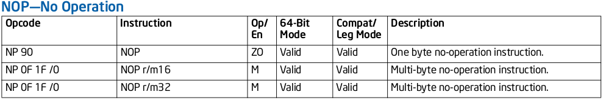
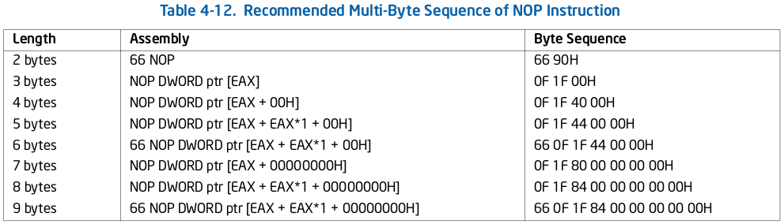

# Linux ftrace investigation

**Concept discrimination**:

>Documentation/trace/ftrace.rst:
>
>Although ftrace is typically considered the function tracer, it is really a **framework** of several assorted tracing utilities.

The core principle/design is the same as GNU `gprof`. Say program gprof.c:
```c
/* gprof.c */

int sum(int a, int b)
{
    return a + b;
}

int main()
{
    int f = 20;
    int s = 20;

    return sum(f, s);
}
```
Then,

	$ gcc gprof.c -o gprof
	$ objdump -d gprof

to show disassembled code of these 2 functions:

```assembly
0000000000401106 <sum>:
  401106:       55                      push   %rbp
  401107:       48 89 e5                mov    %rsp,%rbp
  ...

000000000040111a <main>:
  40111a:       55                      push   %rbp
  40111b:       48 89 e5                mov    %rsp,%rbp
  40111e:       48 83 ec 10             sub    $0x10,%rsp
  ...
```
nothing special.

If compile it with -pg

	$ gcc -pg gprof.c -o gprof-pg

then

	$ objdump -d gprof-pg

will show
```assembly
0000000000401196 <sum>:
  401196:       55                      push   %rbp
  401197:       48 89 e5                mov    %rsp,%rbp
  40119a:       48 83 ec 08             sub    $0x8,%rsp
  40119e:       e8 9d fe ff ff          callq  401040 <mcount@plt>
  ...

00000000004011b3 <main>:
  4011b3:       55                      push   %rbp
  4011b4:       48 89 e5                mov    %rsp,%rbp
  4011b7:       48 83 ec 10             sub    $0x10,%rsp
  4011bb:       e8 80 fe ff ff          callq  401040 <mcount@plt>
  ...
```

Function **mcount** is from glibc, and the profiling work is done in it.

ftrace works the same way by providing a equivalent tracer function as **mcount**, one can do any tracing work in this function besides tracing function call, even for live patching.

The technical knowledge above provides a general idea Linux ftrace depends on. Concretely, x86_64  actually uses following GCC flags for ftrace:

	-pg -mrecord-mcount -mfentry

`-pg` is **Program Instrumentation Option** in GCC terminology, so does `-fpatchable-function-entry=N[,M]`(for ftrace on ARM64).  Here is introduction from [GCC doc](https://gcc.gnu.org/onlinedocs/gcc/Instrumentation-Options.html):

>GCC supports a number of command-line options that control adding run-time instrumentation to the code it normally generates. For example, one purpose of instrumentation is collect profiling statistics for use in finding program hot spots, code coverage analysis, or profile-guided optimizations. Another class of program instrumentation is adding run-time checking to detect programming errors like invalid pointer dereferences or out-of-bounds array accesses, as well as deliberately hostile attacks such as stack smashing or C++ vtable hijacking. There is also a general hook which can be used to implement other forms of tracing or function-level instrumentation for debug or program analysis purposes.
>
>
>
>-mfentry
>
>​    If profiling is active (‘-pg’), put the profiling counter call before the prologue.
>
>
>
>-mrecord-mcount
>
>​    If profiling is active (‘-pg’), generate a __mcount_loc section that contains pointers to each profiling call. This is useful for automatically patching and out calls.

Take a look at the effect of these flags, still say gprof.c as above:

	$ gcc -pg -mfentry -mrecord-mcount gprof.c -o gprof-fentry
	$ objdump -D gprof-fentry

will show

```assembly
000000000401196 <sum>:
  401196:       e8 b5 fe ff ff          callq  401050 <__fentry__@plt>
  40119b:       55                      push   %rbp
  40119c:       48 89 e5                mov    %rsp,%rbp
  40119f:       48 83 ec 08             sub    $0x8,%rsp
  ...

00000000004011b3 <main>:
  4011b3:       e8 98 fe ff ff          callq  401050 <__fentry__@plt>
  4011b8:       55                      push   %rbp
  4011b9:       48 89 e5                mov    %rsp,%rbp
  4011bc:       48 83 ec 10             sub    $0x10,%rsp
  ...

Disassembly of section __mcount_loc:

0000000000402010 <__mcount_loc>:
  402010:       96                      xchg   %eax,%esi
  402011:       11 40 00                adc    %eax,0x0(%rax)
  402014:       00 00                   add    %al,(%rax)
  402016:       00 00                   add    %al,(%rax)
  402018:       b3 11                   mov    $0x11,%bl
  40201a:       40 00 00                add    %al,(%rax)
  40201d:       00 00                   add    %al,(%rax)
```

At a quick glance, the difference between `-pg` and `-pg -mfentry` looks quite obvious: **calling different function at different place**.  And the content of *__mcount_loc* section is the address of "call fentry" in each function.

[Best reading](https://blog.linuxplumbersconf.org/2014/ocw/system/presentations/1773/original/ftrace-kernel-hooks-2014.pdf) to get a general idea of ftrace framework until now.

Knowing the background, time to see how ftrace archive its goal.

## Preparation work for ftrace under x86_64

This is mostly about the kbuild process.

arch/x86/Kconfig:
```makefile
config X86
	def_bool y
	select HAVE_C_RECORDMCOUNT
	...
	select HAVE_DYNAMIC_FTRACE
	select HAVE_DYNAMIC_FTRACE_WITH_REGS
	select HAVE_DYNAMIC_FTRACE_WITH_DIRECT_CALLS
	...
	select HAVE_FENTRY				if X86_64 || DYNAMIC_FTRACE
	select HAVE_FTRACE_MCOUNT_RECORD
	select HAVE_FUNCTION_GRAPH_TRACER
	select HAVE_FUNCTION_TRACER
	...
```
Shows the ftrace related features that x86 support. Whether certain feature is enabled or not will depends on configuration.(Refer: kernel/trace/Kconfig)

ftrace will record the address of each "call fentry" instruction in kernel function, the instruction is generated by  `-pg -mfentry` flag; recording the address is done via "-mrecord-mcount" flag on GCC 5 and above, or scripts/recordmcount.{pl,c,h} when GCC doesn't support this flag.

>**NOTE**: If CPU arch support *-mfentry*, then ftrace is default to use *-mfentry*, and this is the case for x86. Detail in top makefile analysed below.

On the other hand, glibc provides "fentry" function for ordinary userspace compilation, but compiling Linux kernel doesn't involve glibc, so Linux kernel provides it by itself in **arch/x86/kernel/ftrace_{64,32}.S**:

```assembly
SYM_FUNC_START(__fentry__)
	retq
SYM_FUNC_END(__fentry__)
EXPORT_SYMBOL(__fentry__)
```
Recall: x86 Linux kernel use "call fentry" as default, as said above. This can be verified by checking the disassembled code of kernel:

```assembly
kernel/sched/stats.o:     file format elf64-x86-64

Disassembly of section .text:

0000000000000000 <schedstat_stop>:
   0:   e8 00 00 00 00          callq  5 <schedstat_stop+0x5>
   5:   c3                      retq
   ...

0000000000000010 <show_schedstat>:
  10:   e8 00 00 00 00          callq  15 <show_schedstat+0x5>
  15:   41 56                   push   %r14
  ...
```
then `objdump -d vmlinux` shows:

```assembly
ffffffff8112a870 <schedstat_stop>:
ffffffff8112a870:       e8 cb 70 8d 00          callq  ffffffff81a01940 <__fentry__>
ffffffff8112a875:       c3                      retq
					   ...
ffffffff8112a880 <show_schedstat>:
ffffffff8112a880:       e8 bb 70 8d 00          callq  ffffffff81a01940 <__fentry__>
ffffffff8112a885:       41 56                   push   %r14
					   ...
```

Now let's see how kbuild do it.

In top Makefile:
```makefile
# The arch Makefiles can override CC_FLAGS_FTRACE. We may also append it later.
# [FNST] The general switch flag for ftrace, other flags(-mrecord-mcount,
# -mfentry) should be used with -pg together.
ifdef CONFIG_FUNCTION_TRACER
  CC_FLAGS_FTRACE := -pg
endif

ifdef CONFIG_FUNCTION_TRACER  # default Y

  ifdef CONFIG_FTRACE_MCOUNT_RECORD # default Y
    # gcc 5 supports generating the mcount tables directly.
    # [FNST]: -mrecord-mcount has the same function as recordmcount.{pl,c,h}.
    # When GCC doesn't support this flag, use recordcmount.{pl,c,h} instead.
    ifeq ($(call cc-option-yn,-mrecord-mcount),y)
      CC_FLAGS_FTRACE     += -mrecord-mcount
      export CC_USING_RECORD_MCOUNT := 1
    endif
    ...
  endif

# [FNST]: Modern GCC has flag "-mfentry", this is default for x86.
ifdef CONFIG_HAVE_FENTRY # X86 support it
  ifeq ($(call cc-option-yn, -mfentry),y)
    CC_FLAGS_FTRACE     += -mfentry
    CC_FLAGS_USING      += -DCC_USING_FENTRY
  endif
endif

export CC_FLAGS_FTRACE
KBUILD_CFLAGS   += $(CC_FLAGS_FTRACE) $(CC_FLAGS_USING)
KBUILD_AFLAGS   += $(CC_FLAGS_USING)

ifdef CONFIG_DYNAMIC_FTRACE # default Y
        ifdef CONFIG_HAVE_C_RECORDMCOUNT # x86 support it
                BUILD_C_RECORDMCOUNT := y
                export BUILD_C_RECORDMCOUNT
        endif
endif

endif # CONFIG_FUNCTION_TRACER
```

scripts/Makefile.build:

```makefile
ifdef CONFIG_FTRACE_MCOUNT_RECORD
  ifndef CC_USING_RECORD_MCOUNT
    # compiler will not generate __mcount_loc, use recordmcount
    # or recordmcount.pl
    # [FNST] Since modern GCC support -mrecord-mcount, means
    # CC_USING_RECORD_MCOUNT is defined. Omit this code path.
    ifdef BUILD_C_RECORDMCOUNT
      sub_cmd_record_mcount = ...
	  recordmcount_source := ...
    else
      sub_cmd_record_mcount = ...
      recordmcount_source := ...
    endif # BUILD_C_RECORDMCOUNT

    cmd_record_mcount = ...
  endif # CC_USING_RECORD_MCOUNT

# [FNST] So, cmd_record_mcount is emtpy.
endif # CONFIG_FTRACE_MCOUNT_RECORD

# Built-in and composite module parts.
# [FNST]: rule to compile single .c --> .o. $(call if_changed_rule,cc_o_c) is
# expanded into rule_cc_o_c as showed below.
$(obj)/%.o: $(src)/%.c $(recordmcount_source) $(objtool_dep) FORCE
        $(call cmd,force_checksrc)
        $(call if_changed_rule,cc_o_c)

# [FNST] Many things are done as following during compiling *.c to *.o,
# besides compilation itself.
define rule_cc_o_c
        $(call cmd,checksrc)
        $(call cmd_and_fixdep,cc_o_c)
        $(call cmd,gen_ksymdeps)
        $(call cmd,checkdoc)
        $(call cmd,objtool)
        $(call cmd,modversions_c)
        $(call cmd,record_mcount)
endef
```

Anyway, now we know ftrace will have *__mcount_loc* section produced for object file, by GCC flag, or by scripts/recordmcount{pl,c,h}. Entry of this section is the address of "call fentry" instruction in each function, 8 bytes under x86_64.

How kernel tools recordmcount.{pl,c.h} do this work? Refer: head comments of scripts/recordmcount.pl.

Then when linking into vmlinux, all *__mcount_loc* sections of object files are collected into *.init.data* section of vmlinux:

1. arch/x86/kernel/vmlinux.lds.S
2. include/asm-generic/vmlinux.lds.h

```c
#ifdef CONFIG_FTRACE_MCOUNT_RECORD
/*
 * The ftrace call sites are logged to a section whose name depends on the
 * compiler option used. A given kernel image will only use one, AKA
 * FTRACE_CALLSITE_SECTION. We capture all of them here to avoid header
 * dependencies for FTRACE_CALLSITE_SECTION's definition.
 *
 * Need to also make ftrace_stub_graph point to ftrace_stub
 * so that the same stub location may have different protocols
 * and not mess up with C verifiers.
 */
#define MCOUNT_REC()	. = ALIGN(8);				\
			__start_mcount_loc = .;			\
			KEEP(*(__mcount_loc))			\
			KEEP(*(__patchable_function_entries))	\
			__stop_mcount_loc = .;			\
			ftrace_stub_graph = ftrace_stub;
#else
...
#endif

```

With all these preparation work, now turn to see how ftrace code utilize the data from *__mcount_loc* section in "ftrace initialization" section.

## Preparation work for ftrace under aarch64

Because of failure of setting up a ARM VM on x86, so for the time being, all ARM related experiments are done with cross compiler: **AArch64 GNU/Linux target (aarch64-none-linux-gnu)** of [The GNU Toolchain for the Cortex-A](https://developer.arm.com/tools-and-software/open-source-software/developer-tools/gnu-toolchain/gnu-a/downloads).

arch/arm64/Kconfig has:

```makefile
config ARM64
	...
	select HAVE_DYNAMIC_FTRACE
    select HAVE_DYNAMIC_FTRACE_WITH_REGS \
            if $(cc-option,-fpatchable-function-entry=2)
    ...
    select HAVE_FTRACE_MCOUNT_RECORD
    select HAVE_FUNCTION_TRACER
	select HAVE_FUNCTION_GRAPH_TRACER
```

Then re-analyse top Makefile & scripts/Makefile.build for arm64.

In top Makefile:

```makefile
# The arch Makefiles can override CC_FLAGS_FTRACE. We may also append it later.
ifdef CONFIG_FUNCTION_TRACER
  CC_FLAGS_FTRACE := -pg
endif
...
include arch/$(SRCARCH)/Makefile
...

ifdef CONFIG_FUNCTION_TRACER  # default Y for arm64

  ifdef CONFIG_FTRACE_MCOUNT_RECORD # default Y for arm64
    # [FNST]: The cross compiler doesn't support -mrecord-mcount flag.
    ifeq ($(call cc-option-yn,-mrecord-mcount),y)
      CC_FLAGS_FTRACE     += -mrecord-mcount
      export CC_USING_RECORD_MCOUNT := 1
    endif
    ...
  endif

# [FNST]: arm64 don't support HAVE_FENTRY.
ifdef CONFIG_HAVE_FENTRY
  ifeq ($(call cc-option-yn, -mfentry),y)
    CC_FLAGS_FTRACE     += -mfentry
    CC_FLAGS_USING      += -DCC_USING_FENTRY
  endif
endif

export CC_FLAGS_FTRACE
KBUILD_CFLAGS   += $(CC_FLAGS_FTRACE) $(CC_FLAGS_USING)
KBUILD_AFLAGS   += $(CC_FLAGS_USING)

ifdef CONFIG_DYNAMIC_FTRACE # default Y for arm64
    ifdef CONFIG_HAVE_C_RECORDMCOUNT # arm64 support it
        BUILD_C_RECORDMCOUNT := y
            export BUILD_C_RECORDMCOUNT
    endif
endif

endif # CONFIG_FUNCTION_TRACER
```

arch/arm64/Makefile:

```makefile
ifeq ($(CONFIG_DYNAMIC_FTRACE_WITH_REGS),y)
	KBUILD_CPPFLAGS += -DCC_USING_PATCHABLE_FUNCTION_ENTRY
	CC_FLAGS_FTRACE := -fpatchable-function-entry=2
endif
```

It shows clearly that on arm64, CONFIG_DYNAMIC_FTRACE_WITH_REGS feature relies on GCC flag `-fpatchable-function-entry=2`(livepatch depends on this feature. Further investigation should be done). This feature is introduced by commit 3b23e4991fb66f in 2019/02, before, CONFIG_DYNAMIC_FTRACE on arm64 only use flag: -pg. Since arm64's GCC doesn't support "-mrecord-mcount", it can be deduced that recordmcount.{pl, c, h} is needed to create/append *__mcount_loc* section to each *.o.

scripts/Makefile.build(re-format for easy reading):

```makefile
ifdef CONFIG_FTRACE_MCOUNT_RECORD # default Y for arm64

    ifndef CC_USING_RECORD_MCOUNT # N for arm64, so it walks this path.
        # [FNST] each object file will be processed directly by recordmcount.
        # After checking recordmcount source, suspect it is unnecessary for
        # (arm64 + CONFIG_DYNAMIC_FTRACE_WITH_REGS). Prospective patch.
        ifdef BUILD_C_RECORDMCOUNT # Y for arm64
            sub_cmd_record_mcount =
            if [ $(@) != "scripts/mod/empty.o" ]; then      \
                $(objtree)/scripts/recordmcount $(RECORDMCOUNT_FLAGS) "$(@)";  \
            fi;

		  recordmcount_source := $(srctree)/scripts/recordmcount.{c, h}
      else
          sub_cmd_record_mcount = ...
          recordmcount_source := ...
      endif # BUILD_C_RECORDMCOUNT

	  # [FNST] if GCC has ftrace related flags, process it with recordmcount.
      cmd_record_mcount = $(if $(findstring $(strip $(CC_FLAGS_FTRACE)),$(_c_flags)), \
          		$(sub_cmd_record_mcount))
    endif # CC_USING_RECORD_MCOUNT

endif # CONFIG_FTRACE_MCOUNT_RECORD

# Built-in and composite module parts.
# [FNST]: rule to compile single .c --> .o
$(obj)/%.o: $(src)/%.c $(recordmcount_source) $(objtool_dep) FORCE
        $(call cmd,force_checksrc)
        $(call if_changed_rule,cc_o_c)

define rule_cc_o_c
        $(call cmd,checksrc)
        $(call cmd_and_fixdep,cc_o_c)
        $(call cmd,gen_ksymdeps)
        $(call cmd,checkdoc)
        $(call cmd,objtool)
        $(call cmd,modversions_c)
        $(call cmd,record_mcount)
```

As CONFIG_DYNAMIC_FTRACE_WITH_REGS on arm64 uses flag `-fpatchable-function-entry=2`, the following sub-section gives a look at how this flag works.

The rest process is the same as x86, collect *__patchable_function_entries* section of *.o into *.init.data* section of vmlinux, which will be utilized by ftrace initialization code.

### -fpatchable-function-entry=N[,M]

As said above, arm64 support CONFIG_DYNAMIC_FTRACE_WITH_REGS with a slightly different technique background from x86, by using `-fpatchable-function-entry=N[,M]` instead of `-pg`.

GCC explains `-fpatchable-function-entry=N[,M]` as:

>Generate N NOPs right at the beginning of each function, **with the function entry point before the M th NOP**. If M is omitted, it defaults to 0 so the function entry points to the address just at the first NOP.

The meaning of `M` is a little bit tricky to understand, and its relation with `N` is also subtle. Still take gprof.c on x86 as above for example:

	$ gcc -fpatchable-function-entry=4,0 gprof.c -o gp-pfe

`objdump -d pg-pfe` shows:

```assembly
gp-pfe:     file format elf64-x86-64
...

0000000000401100 <frame_dummy>:
  401100:       f3 0f 1e fa             endbr64
  401104:       eb 8a                   jmp    401090 <register_tm_clones>

0000000000401106 <sum>:
  401106:       90                      nop
  401107:       90                      nop
  401108:       90                      nop
  401109:       90                      nop
  40110a:       55                      push   %rbp
  40110b:       48 89 e5                mov    %rsp,%rbp
  ...

000000000040111e <main>:
  40111e:       90                      nop
  40111f:       90                      nop
  401120:       90                      nop
  401121:       90                      nop
  401122:       55                      push   %rbp
  401123:       48 89 e5                mov    %rsp,%rbp
  401126:       48 83 ec 10             sub    $0x10,%rsp
  ...
```
nothing special, just as expected. Then try:

	$ gcc -fpatchable-function-entry=4,2 gprof.c -o gp-pfe

and `objdump -d pg-pfe` shows the subtle difference:

```assembly
gp-pfe:     file format elf64-x86-64

0000000000401100 <frame_dummy>:
  401100:       f3 0f 1e fa             endbr64
  401104:       eb 8a                   jmp    401090 <register_tm_clones>
  401106:       90                      nop
  401107:       90                      nop

0000000000401108 <sum>:
  401108:       90                      nop
  401109:       90                      nop
  40110a:       55                      push   %rbp
  40110b:       48 89 e5                mov    %rsp,%rbp
  ...
  40111d:       c3                      retq
  40111e:       90                      nop
  40111f:       90                      nop

0000000000401120 <main>:
  401120:       90                      nop
  401121:       90                      nop
  401122:       55                      push   %rbp
  401123:       48 89 e5                mov    %rsp,%rbp
  401126:       48 83 ec 10             sub    $0x10,%rsp
  ...
```
>Tip: M should be <= N, or else compilation error happens.

In terms of section, usage of `-fpatchable-function-entry=N[,M]` results in *__patchable_function_entries* section in the binary, check it out via `objdump -h pg-pfe`. What is the content in this section?

	$ objdump -d -j __patchable_function_entries gp-pfe

shows:

```
gp-pfe:     file format elf64-x86-64

Disassembly of section __patchable_function_entries:

000000000040401c <__TMC_END__-0x4>:
  40401c:	06                   	(bad)
  40401d:	11 40 00             	adc    %eax,0x0(%rax)

0000000000404020 <__TMC_END__>:
  404020:	00 00 00 00 1e 11 40 00 00 00 00 00                 ......@.....
```
In human read format:

```
	06 11 40 00 00 00 00 00
	1e 11 40 00 00 00 00 00
```
As x86 is little-endian, convert them to real numbers:

```
	00 00 00 00 00 40 11 06
	00 00 00 00 00 40 11 1e
```
Check these number out by comparing with output of `objdump -d pg-pfe` above(**-fpatchable-function-entry=4,2** version), will see they are the addresses of 1st NOP instruction. Just as GCC explains:

>For run-time identification, the starting addresses of these areas, which correspond to their respective function entries minus M, are additionally collected in the __patchable_function_entries section of the resulting binary.

So if kernel use `-fpatchable-function-entry=2`, it could be deduced that the address of 1st NOP is also the function entry address, which is recorded in section *__patchable_function_entries*.  Now Let's verify this verdict on arm64.

Compile with	`aarch64-noaarch64-none-linux-gnu-gcc -fpatchable-function-entry=2 gprof.c -o gp`, and check the disassembly with `aarch64-noaarch64-none-linux-gnu-objdump -d gp`:

```assemble
gp:     file format elf64-littleaarch64

  ...
000000000040055c <sum>:
  40055c:       d503201f        nop
  400560:       d503201f        nop
  400564:       d10043ff        sub     sp, sp, #0x10
  ...

0000000000400584 <main>:
  400584:       d503201f        nop
  400588:       d503201f        nop
  40058c:       a9be7bfd        stp     x29, x30, [sp, #-32]!
  ...

Disassembly of section __patchable_function_entries:

0000000000411028 <__TMC_END__>:
  411028:       0040055c        .inst   0x0040055c ; undefined
  41102c:       00000000        .inst   0x00000000 ; undefined
  411030:       00400584        .inst   0x00400584 ; undefined
  411034:       00000000        .inst   0x00000000 ; undefined
```

## ftrace initialization

Its initialization has several phases:

  1. start_kernel --> ftrace_init
  2. start_kernel --> early_trace_init
  3. start_kernel --> arch_call_rest_init --...--> do_initcalls --> tracer_init_tracefs

### ftrace_init

This is a brief introduction without code details.

**First**, ftrace has *struct dyn_ftrace* recording each entry of *__mcount_loc* section, they are 1:1 mapped. Allocate exact memory pages for all *struct dyn_ftrace* records, and initialize them with the addresses from *__mcount_loc* section, as simple as struct dyn_ftrace.ip = address.

```c
struct dyn_ftrace {
	unsigned long		ip; /* address of mcount call-site */
	unsigned long		flags;
	struct dyn_arch_ftrace	arch;
};
```

All *struct dyn_ftrace* are managed via *struct ftrace_page*, stored in *struct ftrace_page.records*. In case one continuous memory allocation doesn't suffice, one or more *struct ftrace_page* involved, single-linked by its *struct ftrace_page.next*.

```c
struct ftrace_page {
	struct ftrace_page	*next;
	struct dyn_ftrace	*records;
	int			index;
	int			size;
};
```
In other words: first step is to construct an initial database that consists of all the functions ftrace managed, each function is identified by its address. Note: the address of "call fentry" equals its function address, refer the output of `objdump -d vmlinux` above.

**Next** step is to replace all `call fentry` with NOP instructions through  *ftrace_update_code --> ftrace_nop_initialize*. Intel has different NOP instruction implementations, i.e., a NOP instruction could be one byte or multi-byte long, as Intel software developer manual 2 shows:





Tip: `call fentry` instruction in Linux kernel as shown above, is 5-byte long, so, of course ftrace(x86) will choose the 5 bytes NOP. NOP instruction definition code is in arch/x86/kernel/alternative.c:

```c
/* Initialize these to a safe default */
#ifdef CONFIG_X86_64
const unsigned char * const *ideal_nops = p6_nops;
#else
const unsigned char * const *ideal_nops = intel_nops;
#endif

#ifdef P6_NOP1
static const unsigned char p6nops[] =
{
	P6_NOP1,
	P6_NOP2,
	P6_NOP3,
	P6_NOP4,
	P6_NOP5,
	P6_NOP6,
	P6_NOP7,
	P6_NOP8,
	P6_NOP5_ATOMIC
};
static const unsigned char * const p6_nops[ASM_NOP_MAX+2] =
{
	NULL,
	p6nops,
	p6nops + 1,
	p6nops + 1 + 2,
	p6nops + 1 + 2 + 3,
	p6nops + 1 + 2 + 3 + 4,
	p6nops + 1 + 2 + 3 + 4 + 5,
	p6nops + 1 + 2 + 3 + 4 + 5 + 6,
	p6nops + 1 + 2 + 3 + 4 + 5 + 6 + 7,
	p6nops + 1 + 2 + 3 + 4 + 5 + 6 + 7 + 8,
};
#endif
```
And ftrace on x86 use the 5-byte NOP:

```c
static const unsigned char *ftrace_nop_replace(void)
{
	return ideal_nops[NOP_ATOMIC5];
}

#define NOP_ATOMIC5 (ASM_NOP_MAX+1)	/* Entry for the 5-byte atomic NOP */
```

**At last**, initialize ftrace filters according to kernel parameters in *set_ftrace_early_filters*, take the fundamental 2 of them for example:

>ftrace_filter=[function-list]
>
>[FTRACE] Limit the functions traced by the function tracer at boot up. function-list is a comma separated list of functions. This list can be changed at run time by the set_ftrace_filter file in the debugfs tracing directory.
>
>
>
>ftrace_notrace=[function-list]
>
>[FTRACE] Do not trace the functions specified in function-list. This list can be changed at run time by the set_ftrace_notrace file in the debugfs tracing directory.

Under CONFIG_DYNAMIC_FTRACE, the functions in these [function-list] is managed via hash bucket.

```c
struct ftrace_hash {
	unsigned long		size_bits;
	struct hlist_head	*buckets;
	unsigned long		count;
	unsigned long		flags;
	struct rcu_head		rcu;
};
```
The element in hash bucket is:

```c
struct ftrace_func_entry {
	struct hlist_node hlist;
	unsigned long ip;
	unsigned long direct; /* for direct lookup only */
};
```
The hash function *ftrace_hash_key* take integer form of function address as input, hash value returned as the index into hash bucket.

### Initialization code analysis

```c
void __init ftrace_init(void)
{
	extern unsigned long __start_mcount_loc[];
	extern unsigned long __stop_mcount_loc[];
	unsigned long count, flags;
	int ret;

	...

	/* [FNST] Little bit confused at first glance. Say __stop_mcount_loc = a,
	 * then "__stop_mcount_loc - 1" actually evaluates to (a - 8), because
	 * it is unsigned long in x86_64. So the subtracted value here is the count
	 * of entries in __mcount_loc section. */
	count = __stop_mcount_loc - __start_mcount_loc;
	if (!count) {
		pr_info("ftrace: No functions to be traced?\n");
		goto failed;
	}

	pr_info("ftrace: allocating %ld entries in %ld pages\n",
		count, count / ENTRIES_PER_PAGE + 1);

	last_ftrace_enabled = ftrace_enabled = 1;

	/* [FNST] Core function of ftrace initialization. */
	ret = ftrace_process_locs(NULL,
				  __start_mcount_loc,
				  __stop_mcount_loc);

	pr_info("ftrace: allocated %ld pages with %ld groups\n",
		ftrace_number_of_pages, ftrace_number_of_groups);

	set_ftrace_early_filters();

	return;
 failed:
	ftrace_disabled = 1;
}
```

Use *struct ftrace_page *to manage the memory allocated for all *struct dyn_ftrace* records. In case one allocation doesn't suffice for all records, more *struct ftrace_page* is used, chained by its *next* field.

```
static int ftrace_process_locs(struct module *mod,
			       unsigned long *start,
			       unsigned long *end)
{
	struct ftrace_page *start_pg;
	struct ftrace_page *pg;
	struct dyn_ftrace *rec;
	unsigned long count;
	unsigned long *p;
	unsigned long addr;
	unsigned long flags = 0; /* Shut up gcc */
	int ret = -ENOMEM;

	count = end - start;

	if (!count)
		return 0;

	sort(start, count, sizeof(*start),
	     ftrace_cmp_ips, NULL);

	/* [FNST] Involves complicated page count calculation, the intention is,
	 * as its comments said: to fill as much record as possible in one continuous
	 * memory allocation, waste as little memory as possible.
	 */
	start_pg = ftrace_allocate_pages(count);
	if (!start_pg)
		return -ENOMEM;

	mutex_lock(&ftrace_lock);

	/*
	 * Core and each module needs their own pages, as
	 * modules will free them when they are removed.
	 * Force a new page to be allocated for modules.
	 */
	if (!mod) {
		WARN_ON(ftrace_pages || ftrace_pages_start);
		/* First initialization */
		ftrace_pages = ftrace_pages_start = start_pg;
	} else {
		...
	}

	/* [FNST] Initialize the just allocated struct ftrace_page entries with
	 * the content of mcount_loc sections. It is simple, content of the section
	 * is the address of `call mcount` or "call fentry" instruction, and put it
	 * into struct dyn_ftrace.ip */
	p = start;
	pg = start_pg;
	while (p < end) {
		addr = ftrace_call_adjust(*p++);
		/*
		 * Some architecture linkers will pad between
		 * the different mcount_loc sections of different
		 * object files to satisfy alignments.
		 * Skip any NULL pointers.
		 */
		if (!addr)
			continue;

		if (pg->index == pg->size) {
			/* We should have allocated enough */
			if (WARN_ON(!pg->next))
				break;
			pg = pg->next;
		}

		rec = &pg->records[pg->index++];
		rec->ip = addr;
	}

	/* We should have used all pages */
	WARN_ON(pg->next);

	/* Assign the last page to ftrace_pages */
	ftrace_pages = pg;

	/*
	 * We only need to disable interrupts on start up
	 * because we are modifying code that an interrupt
	 * may execute, and the modification is not atomic.
	 * But for modules, nothing runs the code we modify
	 * until we are finished with it, and there's no
	 * reason to cause large interrupt latencies while we do it.
	 */
	/* [FNST] Replace "call fentry" with NOP instructions. ‵*/
	if (!mod)
		local_irq_save(flags);
	ftrace_update_code(mod, start_pg);
	if (!mod)
		local_irq_restore(flags);
	ret = 0;
 out:
	mutex_unlock(&ftrace_lock);

	return ret;
}

```
```
static int ftrace_allocate_records(struct ftrace_page *pg, int count)
{
	int order;
	int cnt;

	if (WARN_ON(!count))
		return -EINVAL;

	order = get_count_order(DIV_ROUND_UP(count, ENTRIES_PER_PAGE));

	/*
	 * We want to fill as much as possible. No more than a page
	 * may be empty.
	 */
	while ((PAGE_SIZE << order) / ENTRY_SIZE >= count + ENTRIES_PER_PAGE)
		order--;

	/* [FNST] *order* is the power value of two, for allocation size in pages.
	 * Say order = 3, then, will allocate 2^3 pages for struct dyn_ftrace.
	 *
	 * Tried hard to calculate the accurate order value, the reason is explained
	 * in comments above. In a word, ftrace want the exact count of pages that
	 * is needed for all struct dyn_ftrace. */

again:
	pg->records = (void *)__get_free_pages(GFP_KERNEL | __GFP_ZERO, order);

	if (!pg->records) {
		/* if we can't allocate this size, try something smaller */
		if (!order)
			return -ENOMEM;
		order >>= 1;
		goto again;
	}

	/* As said above, the pages allocated for struct dyn_ftrace is 2^count. */
	ftrace_number_of_pages += 1 << order;
	ftrace_number_of_groups++;

	cnt = (PAGE_SIZE << order) / ENTRY_SIZE;
	pg->size = cnt;

	if (cnt > count)
		cnt = count;

	return cnt;
}

static inline int get_count_order(unsigned int count)
{
	/* 本例中，入参 count 表示将分配的 page count.
	 * if count = 5, 101b, then, order = 1;
	 * if count = 6, 110b, then, order = 2;
	 * if count = 7, 111b, then, order = 1;
	 * if count = 8, 1000b, then, order = 3;*/
	int order;

	order = fls(count) - 1;
	if (count & (count - 1))
		order++;
	return order;
}

```

## ftrace usage


## Reference

[Welcome to ftrace & the Start of Your Journey to Understanding the Linux Kernel!](https://blogs.vmware.com/opensource/2019/11/12/ftrace-linux-kernel/) by ftrace author.
