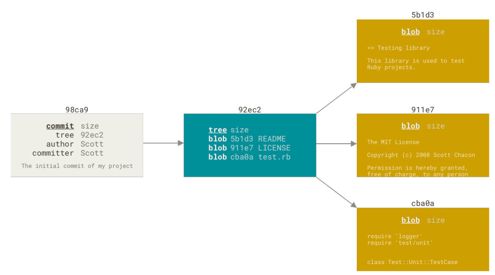
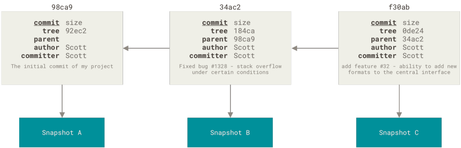
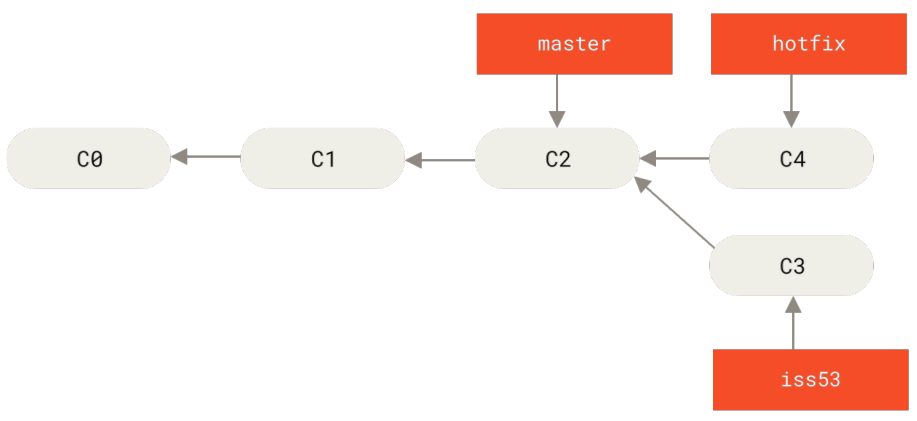
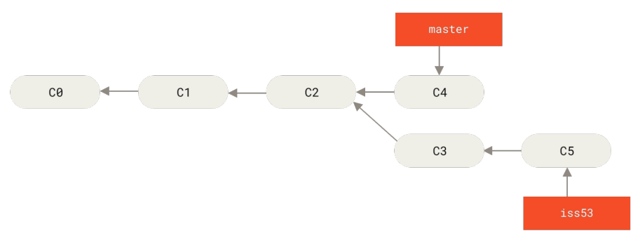

# GIT tips

Fundamentals & tips for operation. Fundamentals mostly come from [pro git](https://git-scm.com/book/en/v2)

## Git Internals - the fundamentals

Git is a content-addressable filesystem. It means that at the core of Git is a simple key-value data store, which means you can insert any kind of content into a Git repository, for which Git will hand you back a unique key you can use later to retrieve that content.

Git has three main states that your files can reside in: modified, staged, and committed. This leads us to the three main sections of a Git project: the working tree, the staging area, and the Git directory.

  - The working tree is a single checkout of one version of the project. These files are pulled out of the compressed database in the Git directory and placed on disk for you to use or modify.
  - The *staging area is a file*, generally contained in your Git directory, that stores information about what will go into your next commit. Its technical name in Git parlance is the *index*, but the phrase “staging area” works just as well.
  - The Git directory is where Git stores the metadata and object database for your project. This is the most important part of Git, and it is what is copied when you clone a repository from another computer.

Git populates *index* with a sorted list of all the file path names, whose contents were last checked out into your working directory and what they looked like when they were originally checked out. You then replace some of those files with new versions of them by `git add`, and `git commit` converts that into the *tree object* for a new commit. Here is a quick [reference for *index*](https://shafiul.github.io//gitbook/7_the_git_index.html) file.

*HEAD* is the pointer to the current branch, which is in turn a pointer to the last commit made on that branch.

Best Reference for the fundamentals: chapter *"Git internals"* of [pro git](https://git-scm.com/book/en/v2), it is strongly recommended.

#### How Git store its data?

Git doesn’t store data as a series of changesets or differences, but instead as a series of **snapshots**.

When you make a commit, Git stores a **commit object** that contains a pointer to the snapshot(tree object) of the content you staged. This object also contains the author’s name and email address, the message that you typed, and pointers to the commit or commits that directly came before this commit (its parent or parents): zero parents for the initial commit, one parent for a normal commit, and multiple parents for a commit that results from a merge of two or more branches.

Staging files via `git add` will computes a checksum for each added file (the SHA-1 hash), stores that version of the file in the Git repository (Git refers to them as **blobs**), and adds that checksum to the staging area.

When you create the commit by running git commit, Git checksums each subdirectory and stores them as a *tree object* in the Git repository. Git then creates a commit object that has the metadata and a pointer to the *root tree object* so it can re-create that snapshot when needed.  初看上面 2 个 term 会不太理解，来个示例：

	$ git cat-file -p master^{tree}
	100644 blob a906cb2a4a904a152e80877d4088654daad0c859	README
	100644 blob 8f94139338f9404f26296befa88755fc2598c289	Rakefile
	040000 tree 99f1a6d12cb4b6f19c8655fca46c3ecf317074e0	lib

The master^{tree} syntax specifies the tree object that is pointed to by the last commit on your master branch.

	$ git cat-file -p 99f1a6d12cb4b6f19c8655fca46c3ecf317074e0
	100644 blob 47c6340d6459e05787f644c2447d2595f5d3a54b	simplegit.rb

The example above is used for distinguishing *root tree object* from *subdirectory tree object*.

Relationship between commit and its tree:



If you make some changes and commit again, the next commit stores a pointer to the commit that came immediately before it.



#### Merge

Usage:

	$ git checkout branch_merged_into
	$ git merge branch_to_be_merged

>English Tip: merge A with B = B merge 到 A

When you try to merge *commit A* with *commit B* that can be reached by following A’s history, Git simplifies things by moving the pointer forward because there is no divergent work to merge together — this is called a “fast-forward.”. For example:



When merge *master* with *hotfix*, this is a "fast-forward" merge.

But generally，两个 commits 在不同的 branch 向前移动:



In this case, Git does a simple three-way merge, using the two snapshots pointed to by the branch tips and the common ancestor of the two. Git creates a new snapshot that results from this three-way merge and automatically creates a new commit that points to it. This is referred to as a merge commit, and is special in that it has more than one parent.

有趣的是，`git show merge_commit` 没有 patch diff 内容，只有 commit object 中的 meta data, author, date, log 等，**可能**因为 diff 是与 parent commit 比较，而 merge commit 有 2 或多个 parent, 所以 diff 不知与哪儿个 parent 比较？而且 merged branch 的 history 也不会出现在 merge 的 branch, [这篇](https://stackoverflow.com/questions/28157399/using-git-why-dont-commits-appear-in-the-history-after-merging-into-a-feature)给了答案: 只 merge 内容，并不 merge commits. 理解了 Git internals, 这个问题也就容易理解了。

Occasionally, this process doesn't go smoothly, Git won’t be able to merge them cleanly and you’ll get a merge conflict. You have to resolve the conflicts manually and `git add` the conflicted file to mark it as resolved.

查看哪儿些 branch 被 merge 到当前 branch:

	git branch --merged

查看哪儿些 branch 没有被 merge 到当前 branch:

	git branch --no-merged

#### Remote-tracking branch

**Remote-tracking** branches are references to the state of remote branches. They’re local references that you can’t move; Git moves them for you whenever you do any network communication, to make sure they accurately represent the state of the remote repository. Think of them as bookmarks, to remind you where the branches in your remote repositories were the last time you connected to them.

Remote-tracking branch names take the form "remote/branch"

#### Tracking branch

Checking out a local branch from a remote-tracking branch automatically creates what is called a **tracking branch** (and the branch it tracks is called an **upstream branch**). Tracking branches are local branches that have a direct relationship to a remote branch. If you’re on a tracking branch and type git pull, Git automatically knows which server to fetch from and which branch to merge in.

If you already have a local branch and want to set it to a remote branch you just pulled down, or want to change the upstream branch you’re tracking, you can use the -u or --set-upstream-to
option to git branch to explicitly set it at any time.

	$ git branch -u origin/some_branch

Check what tracking branches you have set up via:

	$ git branch -vv

#### Rebase

Merge & rebase both are the ways to integrate changes from one branch into another. Difference is, rebase command can take all the changes that were committed on one branch and replay them on a different branch. Rebasing makes for a cleaner history. If you examine the log of a rebased branch, it looks like a linear history: it appears that all the work happened in series, even when it originally happened in parallel.

	git checkout branch_to_be_rebased
	git rebase branch_rebased_onto

or

	# without checking out first
	git rebase base_branch topic_branch

This replays your *topic_branch* work on top of your *base_branch* work.

Rebase works by going to the common ancestor of the two branches (the one you’re on and
the one you’re rebasing onto), getting the diff introduced by each commit of the branch you’re on, saving those diffs to temporary files, resetting the current branch to the same commit as the branch you are rebasing onto, and finally applying each change in turn.

Note that the snapshot pointed to by the final commit you end up with, whether it’s the last of the rebased commits for a rebase or the final merge commit after a merge, is the same snapshot(hash value 一样！) — it’s only the history that is different. Rebasing replays changes from one line of work onto another in the order they were introduced, whereas merging takes the endpoints and merges them together.

**The Perils of Rebasing** can be summed up in a single line:

	Do not rebase commits that exist outside your repository and people may have based work on them.

Rebase is actually abandoning existing commits and creating new ones that are similar
but different. 也就是说，将 existing commits 基于新的 base 重新制作，commit 的内容不变，但 hash value 则不同。


#### Push

完整的语法：

	git push < remote > < local branch:remote branch >

You can use this format to push a local branch into a remote branch that is named differently, for example, you could `git push origin serverfix:awesomebranch` to push your local serverfix branch to the awesomebranch branch on the remote project.

#### Pull

假设你在 master branch, `git pull` = `git fetch` + `git merge orgin/master`

#### Reset

When doing reset, git does things as:

  1. Move HEAD to specified commit
  2. Updating the Index (--mixed)
  3. Updating the Working Directory (--hard)

## Skills

Useful tricks dedicated to real problems.

#### git blame to find the culprit

`blame` Show what revision and author last modified each line of a file.

 通常只是这样用

```
git blame -L <line number 1>,<line number 2> [--] <file>
```

或者不通过 -L 指定行号.  问题是，有时某行代码上一次 modification 可能只是简单 Macro 替换, 这时通过上面的 blame 用法是无法找到引入这行代码的原始 commit 的。但 `blame` 允许指定 revision range, 也就是说，可以通过指定 revision range 的方式来找到该行代码的 second last, third last modification, 直到引入该行代码的 commit.

举例说明用法. arch/x86/kernel/head_64.S 有如下 code piece:

```
51         .text
52         __HEAD
53         .code64
54         .globl startup_64
55 startup_64:
```

想找到 52 行的来历。直接 blame 的结果是

> 4ae59b916d269 arch/x86/kernel/head_64.S (Tim Abbott                2009-09-16 16:44:28 -0400  52)       __HEAD

`git show 4ae59b916d269` 发现只是 macro 替换。这时就要用到 blame 的 revision range 来帮忙了。

```
git blame 4ae59b916d269^ arch/x86/kernel/head_64.S
```

意思是，从 commit 4ae59b916d269 的 parent 开始，展示每一行代码的最后一次 modification 信息，结果是:

> 92417df076f75 arch/x86_64/kernel/head.S (Andi Kleen                2007-07-22 11:12:45 +0200  43)       .section .text.head

查勘 commit 92417df076f75 发现只是简单的改了文本，而且该 commit 发生时候，文件名叫 arch/x86_64/kernel/head.S, 所以需要看一下再上一次的 modification:

```
git blame 92417df076f75^ arch/x86_64/kernel/head.S
```

得到:

> eaeae0cc985fa (Arjan van de Ven       2006-03-25 16:30:28 +0100  28)    .section .bootstrap.text

查看 commit eaeae0cc985fa 发现，它就是引入该行代码的元凶

References:

1. "Revision Selection" of [progit2](https://github.com/progit/progit2)
2. `man 7 gitrevisions`: 如何为 git 命令指定某个 commit 或者 commit range
3. `git help blame`: blame 时如何指定 revision range

#### git send-email via Gmail within GFW

Keyword: socks proxy, msmtp(a smtp client), turn on less secure app access in Google security setting.

Quick steps: install msmtp, configure it in ~/.msmtprc with following:

```
defaults
auth           on
tls            on

# Gmail
account gmail
host smtp.gmail.com
port 587
proxy_host UrProxy
proxy_port UrProxyPort
tls_starttls on
from UrAccount@gmail.com
user UrAccount
password UrPWD

# Set a default account
account default : gmail
```

~/.gitconfig configuration:

```
[sendemail]
        smtpserver = /usr/bin/msmtp
        confirm = never
```

That's all you need to do in PC, now you can send patch via:

	git send-email --to=abc@domain.com I-Am-a.patch

But you will fail in all likelihood with error:

```
[marvin@arch ~]$ echo "test email 1" | msmtp -a default smtp.test.user.0002@gmail.com
msmtp: authentication failed (method PLAIN)
msmtp: server message: 535-5.7.8 Username and Password not accepted. Learn more at
msmtp: server message: 535 5.7.8  https://support.google.com/mail/?p=BadCredentials v15sm352780pfn.27 - gsmtp
msmtp: could not send mail (account default from /home/marvin/.msmtprc)
```
Because Gmail will not allow unsecured app access by default, then you need to go to **Google Account > Security > Less secure app access**, and turn it on.

Things done.

[Reference](https://marvintan.com/posts/send-email-using-google-smtp/).

#### Git sendemail.aliasesFile

In case you don't want to type long email address on command line, this trick helps a lot

Configure git:

```
[sendemail]
        smtpserver = /usr/bin/msmtp
        confirm = never
        aliasesFile = ~/.git_aliases
        aliasFileType = mutt
```

Then create ~/.git_aliases file with following content:

```
# Linux kernel mail address aliases
alias x86ml x86@kernel.org,linux-kernel@vger.kernel.org
alias x86m tglx@linutronix.de,mingo@redhat.com,bp@alien8.de,hpa@zytor.com
alias docm corbet@lwn.net
alias docml linux-doc@vger.kernel.org
```

Now you can do:

`git send-email --to=x86ml,docml --cc=x86m,docm ur.patch`

## Tips for activities in X86 community

和 git 使用没关系，但混 x86 社区，这些是重要的 tips.

#### patch style

For subject:

>Subject needs to have a verb and start with a capital letter after the subsystem/path prefix.

Commit reference:

>1e61f78baf89 ("x86/cpufeature: Make sure DISABLED/REQUIRED macros are updated")

尽量不加 bonus changes, 尤其是那些八杆子打不着的 change.

#### Good mailing practices

From Boris Petkov's mail's footnote:

>Good mailing practices for 400: avoid top-posting and trim the reply.

#### netiquette(网络礼仪)

[https://people.kernel.org/tglx/notes-about-netiquette](https://people.kernel.org/tglx/notes-about-netiquette)
